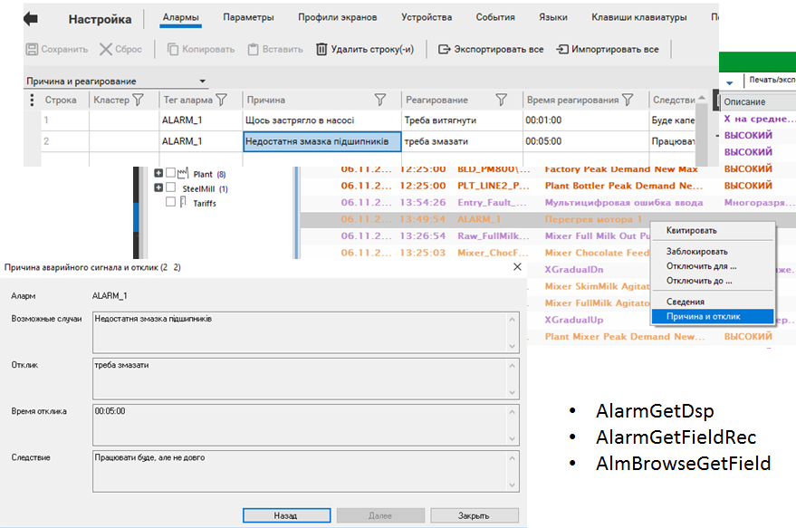

# Базові можливості налаштування тривогової підсистеми Citect 

У SCADA Citect функціями тривожної сигналізації (окрім функцій HMI) займається ***сервер тривог*** (Alarm Server). Усі тривоги (окрім системних) означуються розробником через ***тег тривоги*** (тег аларма, ***alarm tag***), у якому задаються всі налаштування, що відповідають за виявлення тривоги та її поведінку. 

У SCADA Citect для тегу тривоги реалізований стандартний автомат станів, який показаний на рис.Д4.1.2, в тому числі підтримує блоковані тривоги. Усі блоковані тривоги в Citect називаються Disabled, хоч у деяких місцях для відтермінованих тривог використовується термін Shelved. У будь-якому випадку, внутрішні механізми організації усіх блокованих тривог однакові з описаними в стандарті ISA-18.2. Для реалізації проектно-блокованих тривог використовуються Cicode функції блокування (AlarmDisable, AlarmDisableREC) та розблокування (AlarmEnable, AlarmEnableREC).


Рис.Д4.1.2 Автомат станів тривог

На відміну від підсистем тривог деяких SCADA, у даного продукту немає тривог, що не потребують підтвердження. Тому для реалізації такого типу тривог необхідно робити механізми само-підтвердження.  

Більшість тегів тривог оброблюються з періодом [Alarm]ScanTime (задається в Citect.ini).

Тривоги записуються в журнали та виводяться на сторінки: 

- активних тривог (Active Alarms Page);

- апаратних тривог (Hardware Alarms Page);

- блокованих тривог (Disabled Alarms Page);

- журналу зведення тривог (Alarm Summary Page);

- журналу послідовності подій (Sequence of Events (SOE) Page);

- банер тривог (Alarm Banner).

Для зведення тривог підтримується ведення журналу. Усі системні події та тривоги з активними опціями журналювання записуються в спеціальний журнал Sequence of Events (SOE).   

Для тегів тривоги означено ряд атрибутів, які задаються в редакторі (рис.Д4.1.3). Перелік атрибутів залежить від типу тривоги, але деякі з них спільні для всіх. Кожний тег повинен мати ім’я, яке як і тег введення/виведення повинно бути унікальним у межах проекту. Для детального описування тегу можна використовувати коментар (Comment; в рос. лок. "Примечание"). Окрім імені, для тегу задається ***назва тривоги*** (Alarm Name) – змістовний опис тривоги, наприклад, ім'я, що включає фізичний пристрій, пов'язаний з тривогою. На відміну від імені тегу тривоги та коментаря, які стосуються розробника проекту SCADA/HMI і не потрібні користувачеві, назва тривоги використовується для відображення на дисплеях.


*Рис. Д4.1.3*. Приклад налаштування тривог у Citect (вказані вибіркові поля).

Для детального представлення операторові використовується ***опис тривоги*** (Alarm Description, в рос. лок. "Описание тревоги"). Цей опис використовується для відображення на дисплеї і записах у журналах і допускає включення в нього змінної частини. Наприклад, якщо в описі тривоги записане значення:  

"Тривога поломки лінії при швидкості {LineSpeed1}"

то при формуванні запису замість {LineSpeed1} буде виведене значення тегу LineSpeed1. У фігурних дужках можна вставляти Cicode вирази. 

Окрім детального опису тривоги, Citect підтримує також використання сторінки допомоги для тривог, назву яких можна вказати в атрибуті Help (в рос. лок. "Справка"). У цьому випадку при виклику функції AlarmHelp() для виділеної тривоги відкриється сторінка допомоги.

Усі теги тривоги мають атрибут Delay (в рос. лок. "Задержка"), яка вказує на затримку спрацювання тривоги і задається у форматі HH:MM:SS.  

Для означення поведінки тривоги на дисплеях (сторінках) тривоги класифікуються через категорії (див. нижче). Тривоги створюються відповідно до вибраного типу. 

У стандарті ISA-18.2 одним із атрибутів є група тривог, за якою можна групувати тривоги по відношенню їх до певної частини просу чи устатковання. У SCADA Citect для цього використовується устатковання (Equipment), частиною якого може бути тег тривоги (буде розглядатися у іншій лабораторній роботі). 

**Типи тривог** 

У SCADA Citect поняття типу тривог збігається зі стандартним (ISA-18.2). Тим не менше, у Citect усі типи розділяються на дві групи:

- ***конфігуровані тривоги*** (Defined alarms) – ці тривоги конфігуруються розробником проекту самостійно;  

- ***апаратні тривоги*** (Hardware alarms, в рос.лок. "Аппаратные тревоги") – ці тривоги пов’язані з роботою самої системи Citect і не потребують конфігурування. 

Короткий опис типів тривог наведений у табл.6.7. 

*Таблиця Д4.1.1.* Типи тривог у SCADA Citect

| Назва Citect (укр./англ./рос.лок                             | Умова спрацювання та налаштування                            |
| ------------------------------------------------------------ | ------------------------------------------------------------ |
| Апаратні тривоги /Hardware alarms/Аппаратные алармы          | Апаратні тривоги можуть  виникати, наприклад, через помилки: комунікаційних; доступу чи роботи  серверів; роботи Cicode-функцій. Не конфігуруються розробником, є  наперед означеними |
| Дискретні  тривоги/Digital Alarm/Цифровые алармы             | Спрацьовують залежно від стану 2-х  дискретних змінних тегів. Дискретна тривога виникає тоді, коли вирази в полі  тег А та тег В будуть дорівнювати TRUE. Якщо поле "Variable Tag B" порожнє, то перевіряється  тільки тег А. У поля можна також вставляти перед тегами оператор  "NOT" для інверсії умови |
| Мульти-дискретні  тривоги /Multi-Digital Alarm/Многоразрядные  алармы | Спрацьовують  залежно від комбінації станів 3-х дискретних змінних тегів, які вказуються в  полях тегів A, B та C (рис. Д4.1.4), мають додаткові налаштування; для  кожної з 8-ми комбінацій станів задається опис тривоги (в рос. лок. "Состояние")  та активації тривоги (в рос. лок. "Триггер": 1 – задіяти, 0 – не  задіяти); тобто "Состояние 00A" = "@(SM-A1)" – означає,  що при спрацюванні тільки тегу А буде відображатися "SM-A1"; поле "Повторный  аларм" задає, чи треба генерувати нову тривогу при переході з одного  стану активної тривоги в інший стан також активної тривоги; для переходу між  станами тривоги можна задати функції, які будуть викликатися;  підтримується взаємне програмне блокування  тривог у межах однії групи, яка задається атрибутом Suppression (в рос. лок. "Блокировка"): тривоги з меншим рівнем  блокування (Level, в рос. лок. "Уровень")  будуть блокувати тривоги з більшим рівнем у межах тієї самої групи |
| Аналогові  тривоги/ Analog Alarm/ Аналоговые алармы          | Спрацьовують при виході значення  аналогової змінної за одну або декілька заданих меж; у налаштуванні тривоги вказується  тег (або Cicode-вираз), значення якого буде перевірятися (рис. Д4.1.5); можна  задати Deadband ("Зона нечуствит."), що відповідає однойменному в  стандарті – повернення до норми тільки після проходження цієї зони |
| та сама                                                      | Підтримується тривога відхилення  (deviation alarm), коли значення відхиляється від значення, заздалегідь  означеного в атрибуті "Уставка" (Setpoint) на величину, вказану в  атрибуті Deviation (в рос. лок. "Отклонение"); окрім значення,  також можна задати затримку на спрацювання |
| та сама                                                      | Підтримується тривога швидкості  зміни (rate of change alarm), коли значення змінної змінюється дуже швидко; у  полі Rate (в рос. лок. "Скорость") можна задати значення, яке буде  використовуватися в якості максимально-дозволеної зміни за період, що  задається в параметрі [Alarm]Period; у моменти сканування тривоги (задається  параметром [Alarm]ScanTime) перевіряється значення тегу, якщо швидкість його  зміни перевищує максимальну – спрацьовує сигнал про швидкість зміни. |
| Розширені тривоги/Advanced  Alarm / Расширенные алармы       | Спрацьовують, коли результат Cicode виразу, заданого в атрибуті Expression (в рос. лок."Выражение"), повертає TRUE |
| Тривоги з  відміткою часу/Time Stamped Alarm/ Алармы с  меткой времени | Подібні до дискретної тривоги, за винятком того, що відмітка часу спрацювання береться з окремої змінної-лічильника, що задається в атрибутом Timer Expr. (в рос.лок."Выражение таймера"); детальніше див. довідник |
| Дискретні  тривоги з відміткою часу/Time Stamped Digital Alarm/Цифровые  алармы с меткой времени | Подібні до дискретної тривоги, за винятком того, що дискретні теги тривоги оновлюються за підпискою від сервера введення/виведення; відмітка часу береться зі змінного тегу |
| Аналогові  тривоги з відміткою часу/Time Stamped Analog Alarm/Аналоговые  алармы с меткой времени | Подібні до аналогової тривоги, за винятком того, що аналогові теги тривоги оновлюються за підпискою від сервера введення/виведення; відмітка часу береться зі змінного тегу |

 

*Рис. Д4.1.4.* Приклад додаткових налаштувань мультидискретної тривоги

 

*Рис. Д4.1.5.* Приклад додаткових налаштувань аналогової тривоги

**Категорія тривог (Alarm Category)** 

Для означення поведінки тривоги в налаштуваннях тегу тривоги вказують ***категорію тривоги*** (Alarm Category, в рос. лок."Категория алармов"), в якій задають (рис. Д4.1.6): 

- пріоритет тривоги; 

- шрифт, який використовується під час відображення тривоги (у SCADA Citect у шрифті задається розмір, колір тексту і фону, миготіння);

- форматування, яке використовується при появі тривоги;

- дія, яка запускається (через вираз Cicode), коли сигнал тривоги досягає заданого статусу (увімкнено, вимкнено або підтверджено);

- журнал, який використовується для тривоги.


*Рис. Д4.1.6.* Налаштування категорії тривоги 

Як зазначено в довідниковій системі, основним фактором для розділення за категоріями є пріоритет. Однак, враховуючи, що може бути кілька категорій з однаковим пріоритетом, можна класифікувати тривоги і за іншою ознакою, наприклад, приналежність до класу.

Кожна категорія має свій номер, який вказується в атрибуті "категорія" тегу тривоги, щоб віднести її до цієї категорії. Якщо номер категорії в тегу не вказується, то вважається, що це категорія 0. У SCADA Citect деякі номери категорій зарезервовані:

0 – категорія за замовченням, тобто якщо в налаштуваннях тривоги не вказується номер категорії, вважається 0; 

254 – для зведення тривог (Alarm Summary);

255 – для апаратних тривог (Hardware Alarm). 

Якщо в проекті не створені категорії із зарезервованими номерами, для них використовуються властивості за замовченням. Користуватися номерами не дуже зручно, тому рекомендується використовувати ярлики (Label), які замінюють числа на текстові осмислені повідомлення (застосовуються для будь-яких полів, а не тільки для тривог).   

Пріоритет тривоги задає послідовність відображення активних тривог у списку, що відповідає стандарту ISA-18.2. Пріоритет 0 – це найвищий пріоритет, 255 – найнижчий. За замовченням використовується пріоритет 0.

Для категорії можна вказати, чи необхідно виводити дану тривогу на сторінці активних тривог (Show on Active; в рос. лок. "Показывать на активном") та зведених тривог (Show on Summary; в рос. лок. "Показывать на сводка").  

Для записування подій тривог у файл журналу (текстовий файл, принтер, базу даних) у вигляді зведення, в полі Summary Device (в рос. лок. "Устройство регистрации сводки") вказується назва системного пристрою, куди треба вести записування. Якщо необхідно вести журнал у вигляді списку, заповнюється поле Log Device (в рос. лок. "Устройство регистрации"). Які саме події необхідно записувати в журнал, вказується вибором TRUE в полях ON, OFF та ACK відповідно. Слід зазначити, що сучасні версії та нові шаблони Citect (від версій 7.5 до 8.1) не потребують означення цих журналів для їх відображення в шаблонних сторінках SOE та Summary. Ці журнали можуть знадобитися для ведення історії в текстових файлах або базах даних для перегляду в сторонніх програмах (див. нижче).  

Для означення формату відображення на сторінці активних тривог зведення тривог та SOE використовуються відповідно поля Alarm Format (рос. лок. "Формат аларма"), Summary Format (рос. лок. "Формат сводки") та SOE Format (рос. лок. "Формат SOE"). Однак формат для кожної категорії окремо підтримується тільки деякими шаблонами. Для шаблонів Tab_Style та StruxureWare формат означується першим зі списку:

- параметрами [Format]Alarm, [Format]Summary і [Format]SOE відповідно;

- форматом означеним в категорії 0;

- форматом за замовчуванням.

При означенні формату у фігурних дужках вказуються поля, кількість літер для відображення та вирівнювання (L (Left), R (Right) або N (None)):

```
{<ім’я поля>, [кількість літер[, вирівнювання]]}
```

Між полями можна вказувати знак табуляції "^t". Для сторінки тривог та SOE дозволяється використовувати поля, неповний перелік яких подано в табл.Д4.1.2.

*Таблиця Д4.1.2.*  Деякі поля для сторінок активних тривог та SOE  (повний перелік див. у довідниковій системі)

| **Поле**          | **Опис**                                                     |
| ----------------- | ------------------------------------------------------------ |
| {Tag,n}           | Ім’я аларм тегу                                              |
| {AlarmType,n}     | Тип тривоги: наприклад  "Digital"                            |
| {AlmComment,n}    | Текст,  введений для тривоги в полі коментарю                |
| {Name,n}          | Текст,  введений для тривоги в полі імені тривоги            |
| {Desc,n}          | Текст,  введений для тривоги в полі опису тривоги            |
| {Category,n}      | Номер  категорії                                             |
| {Area,n}          | Зона                                                         |
| {Priv,n}          | Привілеї                                                     |
| {Priority,n}      | Пріоритет                                                    |
| {Type,n}          | Стан тривоги:  ACKNOWLEDGED, CLEARED, DISABLED, UNACKNOWLEDGED |
| {LocalTimeDate,n} | Дата та час:  "yyyy-mm-dd hh:mm:ss[.ttt]"                    |
| {Time,n}          | Час останньої  зміни стану (hh:mm:ss).                       |
| {Date,n}          | Дата останньої  зміни стану (dd:mm:yyyy).                    |
| {Value,n}         | Плинне  значення для аналогової тривоги                      |
| {State,n}         | Плинний стан  аналогової тривоги: DEVIATION, RATE, LOW, LOWLOW, HIGH, HIGHHIGH, CLEARED |
| {ErrDesc,n}       | Інформація про  апаратну тривогу                             |
| {LogState,n}      | Стан тривоги  (для лог-журналу)                              |

Для сторінки зведення дозволяється використовувати поля, які показані в табл.6.9. 

Таблиця Д4.1.3.  Деякі поля для сторінок зведення тривог  (повний перелік див. в довідниковій системі)

| **Поле**     | **Опис**                                                     |
| ------------ | ------------------------------------------------------------ |
| {UserName,n} | Ім'я користувача, що проводив певні дії з тривогами (наприклад  підтвердження) |
| {FullName,n} | Повне ім'я користувача, що проводив певні дії з тривогами (наприклад  підтвердження) |
| {UserDesc,n} | Текст пов’язаний з подією, записаний користувачем            |
| {OnDate,n}   | Дата виникнення тривоги                                      |
| {OnTime,n}   | Час виникнення тривоги                                       |
| {OffDate,n}  | Дата повернення тривоги до нормального стану                 |
| {OffTime,n}  | Час повернення тривоги до нормального стану                  |
| {AckDate,n}  | Дата підтвердження тривоги                                   |
| {AckTime,n}  | Час підтвердження тривоги                                    |
| {SumState,n} | Плинний стан тривоги                                         |
| {SumDesc,n}  | Плинний опис тривоги                                         |
| {SumType,n}  | Стан тривоги: ACKNOWLEDGED, CLEARED, DISABLED, UNACKNOWLEDGED |
| {Comment,n}  | Коментар, який вводить оператор у режимі виконання           |

Для ряду тривог можна в полі "Зона" задати номер ***області*** (***зони*,** ***area***) процесу, до якого відноситься тривога. Тільки оператор, що має доступ до цієї області буде мати можливість бачити та підтверджувати ці тривоги. Поле "Привилегии" задає номер привілеї, яку повинен мати оператор, щоб могти підтвердити або заблокувати тривоги.   

**Використання властивостей тривог як тегів**  

У Citect є можливість використовувати властивості тегів тривог в анімації та Cicode функціях. Для цього в якості імені вказується назва тегу тривоги та через крапку властивість, до якої необхідно звернутися. Наприклад, якщо необхідно дізнатися про спрацювання тривоги з ім'ям "CV110_ERROR", необхідно звернутися до властивості "On". Тобто:

```
CV110_ERROR.On
```

Перелік властивостей даний в табл. Д4.1.4.

Таблиця Д4.1.4. Деякі властивості тегів тривог (повний перелік див. у довідниковій системі)

| **Власти­вість**                    | **Опис**                                          | **Доступ**            | **Примітка**                                    |
| ----------------------------------- | ------------------------------------------------- | --------------------- | ----------------------------------------------- |
| .On                                 | =1 – Тривога активна                              | читання               |                                                 |
| .Ack                                | =1 – Тривога підтверджена                         | читання/  записування |                                                 |
| .Disabled                           | =1 – Тривога заблокована                          | читання/  записування |                                                 |
| .Name                               | Ім’я тривоги                                      | читання               | аналогічне полю налаштування тривоги            |
| .State                              | Стан тривоги                                      | читання               | числове значення                                |
| .Desc                               | Опис тривоги                                      | читання               | аналогічне полю налаштування  аналогових тривог |
| .Tag                                | Ім’я тегу тривоги                                 | читання               | аналогічне полю налаштування тривоги            |
| .DVL                                | =1 – активна тривога відхилення  (вниз)           | читання               | тільки для аналогових тривог                    |
| .DVH                                | =1 – активна тривога відхилення  (вверх)          | читання               | тільки для аналогових тривог                    |
| .R                                  | =1 – активна тривога швидкої зміни  значення      | читання               | тільки для аналогових тривог                    |
| .L                                  | =1 – активна тривога низького  значення           | читання               | тільки для аналогових тривог                    |
| .H                                  | =1 – активна тривога високого  значення           | читання               | тільки для аналогових тривог                    |
| .LL                                 | =1 – активна тривога критично  низького значення  | читання               | тільки для аналогових тривог                    |
| .HH                                 | =1 – активна тривога кри­тично  високого значення | читання               | тільки для аналогових тривог                    |
| .Value                              | значення змінного тега для тривоги                | читання               | тільки для аналогових тривог                    |
| .DeadBand                           | налаштування зони нечутливості                    | читання/  записування | аналогічне полю налаштування  аналогових тривог |
| .Deviation                          | налаштування значення відхилення                  | читання/  записування | аналогічне полю налаштування  аналогових тривог |
| .HighHigh                           | налаштування критично високого  значення          | читання/  записування | аналогічне полю налаштування  аналогових тривог |
| .High                               | налаштування високого значення                    | читання/  записування | аналогічне полю налаштування  аналогових тривог |
| .LowLow                             | налаштування критично низького  значення          | читання/  записування | аналогічне полю налаштування  аналогових тривог |
| .Low                                | налаштування низького значення                    | читання/  записування | аналогічне полю налаштування  аналогових тривог |
| .HHDelay,.HDelay, .LDelay, .LLDelay | налаштування затримок спрацювання                 | читання/  записування | аналогічне полю налаштування  аналогових тривог |
| .Rate                               | налаштування швидкості зміни                      | читання/  записування | аналогічне полю налаштування  аналогових тривог |
| .Setpoint                           | налаштування уставки для тривоги  відхилення      | читання/  записування | аналогічне полю налаштування  аналогових тривог |


**Ведення журналів тривог і подій та їх відображення на дисплеях (сторінках)**  

Запис зміни стану тривог в історичні журнал проводиться в трьох варіантах:

- журнал зведення тривог;

- журнал списку тривог;

- журнал послідовності подій (SOE).

Журнал зведення тривог (Alarm summary log) зберігається в пам’яті і з певною періодичністю або за подією записується на диск у папку, що вказана параметром [DATA]. За замовчуванням це проводиться автоматично, і сторінки зведення можуть показувати зміст журналу. Якщо необхідно зведення тривог переглядати в інших програмах, його можна виводити на пристрій системного виведення (див. Д4.2), наприклад, у текстовий файл або в базу даних. 

У старих версіях Citect журнал списку тривог (Alarm Log) був єдиним способом ведення історії тривог. Журнал був реалізований через пристрої системного виведення (див.4.2), який давав змогу виводити тривоги в базу даних, принтер або текстовий файл. Зараз стандартним підходом є використання SOE, тому журнал використовується радше для виведення для сторонніх програм або принтер.  

***Журнал послідовності подій*** (***SOE***, Sequence of Events) використовується як єдина база даних тривог та подій. На відміну від журналів, які організовані через пристрої системного введення/виведення, він надає можливість зручного перегляду та керування записами через вбудовані засоби шаблонів сторінок та функції Cicode. Крім того, він фіксує не тільки означені користувачем події, а й системні. У Citect події (Events) вважаються більш загальним поняттям і включають у себе:

- Action (Дії) — події, що реєструють дію, здійснену оператором для тривоги; 

- `<Alarm Type>` — події, пов'язані з певним типом тривоги (наприклад, ON, OFF та ACK); 

- System (Системні) — системні події, наприклад, зупинка та перезапуск сервера;  

- Configuration (конфігураційні) — події, що відбуваються під час завантаження змін конфігурації (наприклад, додавання або видалення тегів тривоги);

- Comment (коментарі) —події, які вказують, коли користувач додає коментар до послідовності подій ;

- Interface Events (інтерфейсні події) — події, які вказують, коли користувач додає нову подію до SOE.

Для відображення активних тривог та журналів використовується вбудована в шаблони сторінок анімація та спеціальні сторінки. У табл. Д4.1.5 ці засоби наведені в контексті їх переліку в ISA-18.2. 

Таблиця Д4.1.5. Спеціальні шаблони та елементи сторінок 

| Засоби Citect (укр./англ./рос.лок                            | Призначення  та способи реалізації                           |
| ------------------------------------------------------------ | ------------------------------------------------------------ |
| Сторінка активних тривог/Active  Alarms Page/Активные  алармы (рис.Д4.1.7) | відображаються  усі активні тривоги, тобто які не в стані "норма А";  відображають усю необхідну інформацію про  тривоги та надають можливість керувати відображенням та станом тривоги  відповідно до вимог ISA-18.2; реалізовуються через шаблони або власні сторінки |
| Сторінка журналу зведення тривог/Alarm Summary Page/сводка алармов (рис. Д4.1.10) | відображаються  записи, в яких наведені дата та час всіх подій проходження по автомату  станів ; реалізовуються  через шаблони або власні сторінки |
| Банер тривог/ Alarm  Banner/Аларм баннер (рис.Д4.1.13)       | відображається  останні тривоги з найвищим пріоритетом та зведення статусу тривог;  реалізовуються через шаблони або джини |
| Сторінка журналу послідовності  подій/ Sequence of Events (SOE) Page/Последовательность  событий (рис.Д4.1.11) | відображаються  події, в тому числі системні та тривоги у вигляді хронології подій;  реалізовуються через шаблони або власні сторінки |
| Анімовані елементи на сторінках                              | змінюється  візуальне представлення та текст; реалізовуються через використання анімації  та джинів з прив’язкою до властивостей тегів тривог |
| Сторінка апаратних тривог/Hardware  Alarms Page/Аппаратные  адармы | відображаються  усі активні апаратні (системні) тривоги; реалізовуються через шаблони або  власні сторінки |
| Сторінка блокованих тривог/ Disabled  Alarms Page/Отключенные  алармы (рис.Д4.1.12) | відображаються  усі заблоковані тривоги; реалізовуються через шаблони  або власні сторінки |

 

Рис Д4.1.7. Сторінка активних тривог та доступні функції 

 У SCADA Citect журнал зведення – це своєрідний тип (історичного) журналу тривог, у якому всі події переходу тривоги зі стану до стану записуються в один запис.

На сторінці активних тривог а також частково на сторінці зведення доступні такі функції (див. рис. Д4.1.7):

- підтвердження виділеної тривоги або всієї сторінки;

- отримання інформації про тривогу (рис. Д4.1.9);

- блокування тривоги або всієї сторінки (Disable);

- відтермінувати тривогу або всю сторінку (Disable for…) та (Disable until…) (див. рис. Д4.1.8);

- впорядкування записів за будь-яким полем (зробивши клік на потрібній колонці);

- добавлення та видалення колонок зі сторінки;

- збереження налаштувань вигляду;

- друк та експорт сторінки;

- фільтрація виведених записів за вказаними в фільтрах критеріями (рис. Д4.1.9);

- фільтрація виведених записів за приналежності до устатковання. 

Як уже було сказано, у стандарті для кожної тривоги можна вказувати групу, до якої вона належить. Групою може бути устатковання або частина технологічного процесу. У SCADA Citect тег тривоги може бути частиною устатковання (Equipment). У цьому випадку для фільтрації записів на сторінці можна використовувати ліву бічну панель, в якій в ієрархічному вигляді представлене устатковання (див. рис. Д4.1.7). Виділивши необхідне устатковання, можна вибрати тільки ті тривоги, що належать до нього. Число праворуч від назви устатковання вказує на кількість активних тривог для нього. 

 

*Рис. Д4.1.8.* Відтермінування тривог

 

*Рис. Д4.1.9.* Вікно налаштування фільтру (ліворуч) та вікно інформації про тривогу (праворуч)  

 

*Рис. Д4.1.10.* Сторінка зведення тривог

На сторінці SOE доступні всі функції відображення та керування, що вимагаються стандартом ISA-18.2 до дисплеїв журналів тривог. На рис.Д4.1.11 показано тільки частину колонок. 

 

*Рис. Д4.1.11*. Сторінка послідовності подій SOE

У стандарті ISA-18.2 передбачено три різні способи блокування тривог і відповідно – три окремих дисплеї. У SCADA Citect для цього є тільки одна сторінка, куди виводиться інформація про всі заблоковані тривоги (рис. Д4.1.12). Поле дати часу, до якого діє відтермінування тривоги, може бути пустим; це значить, що це є виведена з обслуговування або проектно-блокована тривога. Якщо необхідно використовувати фільтри, а додаткові поля усі заблоковані, то тривоги можна розподілити на три окремі сторінки. З цієї сторінки необхідні тривоги (або всі) можуть бути розблоковані.   

   

*Рис. Д4.1.12*. Сторінка заблокованих тривог

Останні найбільш пріоритетні активні тривоги виводяться в банер тривог (рис.Д4.1.13). Лівіше від банера виводяться піктограми різних тривог, клікнувши на які можна перейти до конкретної сторінки тривоги. Праворуч від піктограм відображається кількість тривог на даній сторінці.  

 

*Рис.Д4.1.13.* Банер тривог та індикатори зведення статусу тривог

Дисплей (сторінка) зведення статусу тривог відсутня в наперед визначених шаблонах Citect. Тим не менше, засоби Citect дають можливість реалізувати таку сторінку самостійно. У переліку Cicode-функцій є багато таких, що призначені для роботи саме з тривогами (Alarm Functions). На додаток до цього теги тривог можна використовувати для налаштування та анімації на сторінках.  

# About Alarms 

An alarm indicates that an abnormal condition has occurred within your Citect SCADA system. For example, you can configure an alarm to notify you if a  piece of hardware is not responding to input commands, or if a variable  tag value has moved beyond a specified limit.

Alarms are a fundamental component of a control system, as they indicate to an operator that the system requires  attention.  When you configure your Citect SCADA system, you should confirm that alarms will be reported to an operator  in a way that allows them to respond in an appropriate manner.

Citect SCADA supports two types of alarms:

## Defined alarms

Alarm indications are added to a project by a system engineer to report specific runtime conditions that require an operator’s attention. Each alarm is associated with one or  more tags on the I/O server, depending on the type of configured alarm.  	

**Defined alarm types**

The following table describes the types of defined alarms you can add to your Citect SCADA project.

| Alarm Type                  | Description                                                  |
| --------------------------- | ------------------------------------------------------------ |
| Digital alarms              | Digital alarms activate in response to the state of one or two digital variables. When you define the variable tags for a digital alarm, you can precede a tag name with the logical operator "NOT". This specifies that the OFF state (0) is the triggering condition for the variable tag.  **Example**A digital alarm is configured to activate in response to the following variable tags:Variable Tag A = RFP3_TOLVariable Tag B = NOT MCOL3043In this scenario, the alarm is triggered when the state of both variables changes to the active state: RFP3_TOL changes to ON (1)MCOL304 changes to OFF (0).You can specify a delay for a digital alarm, which means the alarm only  becomes active when the triggering condition spans the duration of the  specified delay period. |
| Time stamped alarms         | Time stamped alarms are similar to digital alarms, except that a counter  variable is used to provide an external time stamp of when a triggering  condition occurs, rather than the poll time. Time stamped alarms can  only be associated with a single digital variable. |
| Analog alarms               | Analog alarms are triggered when an analog variable changes beyond one or more specified limits. Each alarm can be configured as any combination of  the following types: **High** and **high high** alarms - where the value reaches an atypical high **Low** and **low low** alarms - where the value reaches an atypical low **Deviation** alarm - where the values moves away from a predefined set point **Rate of change** alarm - where a dramatic value change occurs within a specified period of time. |
| Advanced alarms             | An advanced alarm activates when the result of an associated expression changes to true. |
| Multi-digital alarms        | Multi-digital alarms use the output for up to three digital variables to define eight states. These states represent different combination of true and false  values. You can specify which of these states will trigger an alarm.The following eight states represent the possible tag value combinations.  The tags are represented in the order tag C, tag B, tag A. State 000 - all 3 tags are false.State 00A - tags C and B are false, tag A is true.State 0B0 - tags C and A are false, tag B is true.State 0BA - tag C is false, tags B and A are true.State C00 - tag C is true, and tags B and A are false.State C0A - tags C and A are true, tag B is false.State CB0 - tags C and B are true, tag A is false.State CBA - all 3 tags are true.You can indicate whether a particular state will trigger an alarm by  applying a value of 1 (indicates an alarm state) or 0 (indicates no  alarm will be triggered). |
| Time stamped digital alarms | Time stamped digital  alarms operate via a process where the alarm server is notified if a value changes to a specified digital variable using the  Cicode function AlarmNotifyVarChange. The alarm server uses this information to update alarms that monitor the  variable, allowing an accurate time stamp to be associated with an alarm condition.  Time stamped digital alarms  activate in response to the state of one or two digital variable tags.  When you specify the variable tags, you can precede a tag name with the  logical operator "NOT". This specifies that the OFF state (0) is the  triggering condition.Events trends can be used  in conjunction with time stamped digital alarms to provide millisecond  accuracy for both trend and alarm data. See the TrnEventSetTable and TrnEventSetTableMS Cicode functions. See Add a Time Stamped Digital Alarm. **Note:** When a time stamped alarm is used in conjunction with some protocols  (such as OFS, OFSOPC and DNP3), a time stamp will be pushed from a tag  into an alarm without the need to use AlarmNotifyVarChange. |
| Time stamped analog alarms  | Time stamped  analog alarms operate via a process where the alarm server is  notified of any value changes to a specified variable using the Cicode  function AlarmNotifyVarChange. The alarm server uses this information to update the alarms that monitor  the variable, allowing an accurate time stamp to be associated with an  alarm condition.  Time stamped analog alarms are  triggered when an analog variable changes beyond one or more specific  limits. Each alarm can be configured as any combination of the following types: **High** and **high high** alarms - where the value reaches an atypical high**Low** and **low low** alarms - where the value reaches an atypical low**Deviation** alarm - where the values moves away from a predefined set point**Rate of change** alarm - where a dramatic value change occurs within a specified period of time. 	Events trends can be used in conjunction with time stamped analog alarms to provide millisecond accuracy for both trend and alarm  data.  See the TrnEventSetTable and TrnEventSetTableMS Cicode functions. 	.**Note:** When a time stamped alarm is used in conjunction with some protocols  (such as OFS, OFSOPC and DNP3), a time stamp will be pushed from a tag  into an alarm without the need to use AlarmNotifyVarChange. |

The system subscribes to the tags  associated with each configured alarm, and polls them at a rate  specified by the Citect.ini parameter [Alarm\]ScanTime.

When a change in value is  detected, a notification is sent to the alarm server for processing. The alarm server evaluates each notification against the conditions that  define each alarm, and generates an alarm if the conditions are met.

For more information on adding configured alarms to a Citect SCADA project, see Configure Alarms. 

## Hardware alarms

Citect SCADA regularly runs diagnostic routines to monitor the performance of  internal operations associated with any connected peripheral equipment.  If the system detects any abnormal conditions, such as an I/O device  that is not responding to input commands, a hardware alarm is generated.

Hardware alarms notify an operator of circumstances such as:

- Interrupted communication to a device
- An inoperative server
- Cicode not executing.

Hardware alarms are fully integrated in Citect SCADA, which means there is no need to manually configure them in a project.  However, you need to carefully consider how they are reported to an  operator.

If your project is based on one of the Citect SCADA starter projects, a hardware alarm count can be viewed on the alarm  banner, and a list is displayed on the dedicated hardware alarms page. 

**Note:** Do not allow your system to have any recurring hardware alarms. 	

There are two hardware alarm  fields that are not always shown on the hardware alarms pages. ERRPAGE  will display the name of the page that was displayed when the error was  detected. This is useful for finding errors caused by improperly  programmed animations. ERRDESC provides information that is specific to  the type of the alarm. For example, if the alarm is an I/O Device error, ERRDESC shows the name of the device.

**Note**: A timeout  applies on hardware alarms, so that old hardware alarms will be inactive as per [Alarm]HardHoldTime parameter. Unlike configured alarms, all  inactive hardware alarms will be removed immediately.

**Hardware Alarms for Certificate Errors**

The Hardware Alarms page  displays hardware alarms when a secure connection cannot be established  due to certificate errors. Some scenarios when hardware alarms may be  generated are when:

- The binding certificate is inaccessible because of incorrect permissions
- The chain of trust to the binding certificate is not valid
- A client cannot trust the certificate with which a server's connections is signed
- A certificate’s common name check is unsuccessful or other policy errors are encountered

To rectify these errors, check the error logs and if required contact your network administrator. 

## Conditions that define an alarm

Polling is used to monitor a system for the conditions that define an alarm. This process is evaluated by the alarm server, which generates an alarm whenever it detects the conditions that define an alarm.

When the alarm server generates an alarm, it is reported to an operator via the runtime interface. If  your project is based on a Citect SCADA starter project, alarms are reported in the following ways:

- The three most recent alarms are displayed on the alarm banner
- Alarm lists and alarm counts are displayed on specific alarm pages
- A historical list of alarms and events is displayed on the Sequence of Events page . 

You can also add content to your graphics pages that are animated when specific alarm conditions occur (see Using Alarm Properties as Tags).

## Alarm Server Process

An alarm server process is responsible for evaluating the conditions that define an alarm. 

The I/O server sends a notification to the alarm server process each time the value changes for a variable tag that is associated with an alarm. If a notification results in an alarm  condition occurring, the alarm server process will generate an alarm.

An alarm server process evaluates the  notifications it receives from an I/O server at a rate that is double  that used by the I/O server to poll the variable tags (that is, the rate set by the Citect.ini parameter [Alarm\]ScanTime.

For information on how to add an alarm server process to a project, see the topic Add an Alarm Server Process. 

A Citect SCADA system can have more than one alarm server process. Multiple alarm  server processes may be required in the following circumstances:

- Redundant systems – alarm  servers can be paired and synchronized so alarm data remains online if a primary server becomes inactive (see Alarm Server Redundancy in the chapter on Redundancy)
- Clustered systems – multiple alarm servers can be added to a distributed system that includes multiple clusters (see Clusters).

If required, you can also configure an alarm server to operate in **Extended Memory** mode. This allows the alarm server process to utilize memory beyond a  4GB limit. It does this by running the process in 64 bit. 

**Note:** When operating in Extended Memory mode, an alarm server process does not support the following:
 • ActiveX objects
 • calls from CitectVBA
 • Cicode functions or alarm expressions that call a DLL compiled in 32 bit. 

Extended Memory mode enables efficient query handling under the following circumstances:

- On systems with a large archive of historical alarm data
- On high-capacity systems that can generate a large number of alarms. 

To enable this mode of operation, you need to set the alarm server's **Extended Memory** property to TRUE (see Add an Alarm Server Process). You also need to recompile your project and restart the runtime system for the change to take effect. 

## Events 

Events provide notification of occurrences within a Citect SCADA system that do not require any action to be taken. Examples of such  occurrences could include a particular user logging on, or an alarm  being acknowledged.

The events that are generated by a Citect SCADA system are grouped according to the following classifications:

- **Action** — events that log an action performed on an alarm by an operator 
- `<Alarm Type>` — events associated with a particular type of alarm (for example, ON, OFF and ACK transitions)
- **System** — events that represent an occurrence that affects the entire system, such as the server being stopped and restarted
- **Configuration** — events that occur when configuration changes are loaded (for example, alarm tags being added or removed) 
- **Comment** — events that indicate when a user adds a comment to the sequence of events (see Add a Comment to the SOE Page)
- **Interface Events** — events that indicate when a user adds an event to the sequence of events (see Add an Event to the SOE Page).

Events can be viewed at runtime via the Sequence of Events (SOE) page (see Alarm Pages).

**Note:** Citect SCADA also supports triggering events that allow you to initiate a particular action when a specified set of circumstances occurs. For more  information on this type of event, see Configure Triggering Events.

# Manage Alarms 

You should carefully consider alarm management when you configure a Citect SCADA project, as it could determine if an operator is able to respond to all the alarms that a system generates.

When an operator receives an alarm notification, there are several actions they may need to perform. These include:

- Acknowledge the alarm
- Navigate to the relevant system data
- Analyze the data
- Perform the required actions
- Confirm that the alarm condition is resolved.

If a system generates alarm notifications at a  rate that does not allow the operator enough time to perform these  tasks, it raises the possibility of alarms being missed.

There are guidelines on the number of alarms  which can be successfully managed by an operator. For example, the ISA 18.2 Alarm Management standard provides metrics regarding manageable  average alarm rates. It suggests that an average of one alarm per ten  minutes is very likely to be acceptable, with a maximum manageable level of two alarms per ten minutes.

The following topics include information you can use to keep the alarms in your system at a manageable level:

- Prioritize Alarms  
- Categorize Alarms  
- Provide Cause and Response Information to Operators  
- Use Alarm Indicators 
- Set the Alarm Scan Rate.

If required, you can also configure an alarm server to operate in **Extended Memory** mode. This allows the alarm server process to utilize memory beyond a 4GB limit. For more information, see Alarm Server Process.

## Prioritize Alarms 

During periods of high activity, a control  system  can generate a large number of alarms within a short period of  time. If you prioritize the alarms in your Citect SCADA system, you can indicate to an operator which alarms they should address first. There are two things to consider when you plan alarm priorities:

- The severity of the consequence that could occur if the operator does not take the appropriate corrective action to the alarm
- The amount of time that  the operator has available, compared to the amount of time that it would take to perform a corrective action.

Alarm management standards provide guidelines  on how to effectively prioritize alarms in a control system. For  example, the EEUMA 191 standard recommends that three alarm priorities  should be used within one alarm display.

However, if your control system incorporates  more than one alarm system (for example, if your site includes a  separate fire or gas alarm panel), it is recommended that the alarm  priorities you use are consistent with any existing systems.

Alarm priorities are managed in Citect SCADA through alarm categories. Each alarm category can be assigned a  priority value (from 1 to 255), which can be used to determine the order in which alarms are displayed, acknowledged and enabled. 

Якщо потрібно, ви можете налаштувати додаткові властивості відображення для пріоритету тривоги, що дозволить вам:

- Вказати ім'я для значення пріоритету, щоб забезпечити змістовне уявлення про його призначення.
- Визначити кольори фону та переднього плану, які забезпечують візуальне представлення пріоритету на графічній сторінці.
- Пов’язати джини з пріоритетом, який можна використовувати як прапорець або піктограму тривоги. (прозорий колір не підтримується)

Ці додаткові властивості налаштовуються в **Налаштуваннях** 

To configure display properties for an alarm priority:

1. In the **Setup** activity, select **Alarming**.
2. On the menu below the Command Bar, select **Alarm Priorities**.
3. Add a row to the Grid Editor
4. Type the required information in each column, or in the fields in the Property Grid(see below for a description of the fields).
5. Click **Save**.

Хоча ця функція підтримується, не рекомендується налаштовувати три головні пріоритети тривоги, якщо для параметра **Show On Indicator** встановлено значення **FALSE**.

| Field                          | Description                                                  |
| ------------------------------ | ------------------------------------------------------------ |
| **Priority**                   | The priority value (1- 255).                                 |
| **Display Name**               | Can be used to provide a meaningful representation of a priority value. |
| **Short Name**                 | Can be used to  provide a short-form name that represents the priority value. For  example, you can use this short name as a label on an alarm flag. |
| **Comment**                    | Any useful comment.                                          |
| **Show on Indicator**          | Визначає, чи буде пріоритет ігноруватися чи ні в індикаторі тривоги. За замовчуванням TRUE (пріоритет не ігнорується). Якщо це значення FALSE, індикатор тривоги буде ігнорувати цей пріоритет і прийматиме наступні пріоритетні тривоги. Наприклад, якщо в одному графічному об’єкті є два Alarm з пріоритетом 3 і 4, а для пріоритету 3 встановлено значення FALSE, alarm  border ігноруватиме сигнали з пріоритетом 3 і відображатиме alarm  border з використанням колірних кодів пріоритету 4.  <br />**Note**: When  this value is set to FALSE, it will not be included in the alarm counts  on any alarm equipment tree views or navigation areas.<br />**Note**: You still need to  configure correct color codes on  color properties even if “Show on  Indicator” value is set to FALSE as these colors are used when there is  server – client property mismatch caused by alarm server reloading. For  example, when that field on server side configuration has been changed  from TRUE to FALSE on server side only by reloading, these colors may  appear on display client’s alarm borders even if client configuration  has that field set to FALSE. As this situation indicates configuration  mismatch, operators should get updated projects from engineers and  restart the client.  Вам все одно потрібно налаштувати правильні колірні коди для властивостей кольору, навіть якщо значення «Показати на індикаторі» встановлено на FALSE, оскільки ці кольори використовуються, коли є невідповідність властивостей сервер-клієнт, викликана перезавантаженням сервера сигналізації. Наприклад, якщо це поле на стороні сервера було змінено з TRUE на FALSE на стороні сервера лише шляхом перезавантаження, ці кольори можуть з’являтися на межах сигналізації клієнта дисплея, навіть якщо в конфігурації клієнта це поле встановлено на FALSE. Оскільки ця ситуація вказує на невідповідність конфігурації, оператори повинні отримати оновлені проекти від інженерів і перезапустити клієнта. |
| **UnAck On Foreground Color**  | Specifies the foreground color to display when an alarm of this priority is in an ON state and unacknowledged. |
| **UnAck On Background Color**  | Specifies the background color to display when an alarm of this priority is in an ON state and unacknowledged. |
| **Ack On Foreground Color**    | Specifies the foreground color to display when an alarm of this priority is in an ON state and acknowledged. |
| **Ack On Background Color**    | Specifies the background color to display when an alarm of this priority is in an ON state and acknowledged. |
| **UnAck Off Foreground Color** | Specifies the foreground color to display when an alarm of this priority is in an OFF state and still unacknowledged. |
| **UnAck Off Background Color** | Specifies the background color to display when an alarm of this priority is in an OFF state and still unacknowledged. |
| **Library Name**               | The name of library to which the associated Genies belong (see below). |
| **Genie Name**                 | The name of a Genie that you want to use as a visual representation of this priority. This  allows the Genie to be used as an alarm flag (see Use Alarm Indicators). |
| **Small Genie Name**           | The name of a small Genie that you want to use as a visual representation of this priority. This allows the Genie to be used as a small icon that indicates alarm  priority. For example, it can be used for:     Priority And State symbols in an alarms list (see Create Priority and State Symbols for an Alarms List).    The alarm counts on a tree-view (see Add a Tree View to a Page). The alarm counts in the Navigation Zone (see Navigation Zone). |

| Property    | Description                                          |
| ----------- | ---------------------------------------------------- |
| **Project** | The project in which the alarm priority is included. |

**Create Priority and State Symbols for an Alarms List**

Citect SCADA allows you to add dynamic symbols to an alarms list that indicates the priority and state of an alarm. 


To achieve this, you need to perform the following tasks.

**Create a Genie for each alarm priority that you want highlight with a symbol**

The Genie requires a root level object named "Shape". 

1. In Graphics Builder, create a new Genie. 

2. Add the object you would like use as a symbol. 

3. A small, simple shape that supports a fill color is recommended. 

4. Display the Properties dialog for the object. 

5. On the **Appearance | General** tab, select **Filled**.

6. On the **Fill | Color** tab, configure the following:

7. - Set the **Type** to **Array**. 
   - Enter the following **Array Expression**:
   - ```
     dspAnGetMetaData(dspGetAnCur(), "State")
     ```

   - Specify the **Array Colors** you want to use for 6 – 9, based to the following states:
   -  6 = On and Unacknowledged

   -  7 = Off and Unacknowledged

   -  8 = On and Acknowledged

   - 9 = Disabled/Shelved.

8. If required, you can configure flashing colors for a state via the Edit Favorite Colors Dialog Box, which is accessible via the **Edit** button on the drop-down Color Picker. 

9. **Note:** Array colors 1 - 4 are reserved for use with the flag on an Alarm Indicator. 

10. On the **Access | General** tab, enter the **Name** "Shape".

11. On the **Metadata | General** tab, enter the following items:

12. - Name: Equipment; Value: `<blank>`
    - Name: Label; Value: `<blank>`
    - Name: State; Value: 0

13. Click **OK**. 

Alarm flag Genies use  functionality provided by the Cicode function DspSym. You need to  perform the remaining steps to enable DspSym support for the Genie.  

1. Display the Page Properties for the Genie. To do this: 
2. On the **File** menu, select **Properties**.

3. Or:

4. Right-click on the Genie background and select **Page Properties**. 

5. On the Page Properties dialog, select **I want to use this Genie with the Cicode function DspSym**.
6. Click **OK**. 
7. **Save** the Genie to a library. 
8. **Note:** When saving an alarm flag Genie, use a name that is unique across all included projects that share the same primary project.

**Associate a Genie with an alarm priority**

1. In Citect Studio's **Setup** activity, select **Alarming**.
2. On the menu below the Command Bar, select **Alarm Priorities**.
3. Locate the Alarm Priority you would like to associate with a Genie. 
4. In the **Small Genie Name** field, enter the name of the Genie you would like to associate with the alarm priority.
5. In the **Library Name** field, enter the name of the library that includes the Genie.
6. Click **Save**.

**Add a Priority and State column to an alarms list**

To add a Priority and State  column to an alarms list, you need to add the display field  "{PriorityAndState}" to the alarm format used by the list. 

For example, in a project  created from a Situational Awareness Starter Project, the parameter  [Format]FormatName is used as a project database parameter to define the following alarm formats:

| Format Name           | Display Fields                                               |
| --------------------- | ------------------------------------------------------------ |
| Alarm                 | **{PriorityAndState,50}**{Date,80}{Time,90}{Name,250}{Cluster,100}{State,40}{Type,70}{UserName,100}{Tag,250}{AlmComment,250}{Priority,60}{Quality,60} |
| Top5Alarm             | **{PriorityAndState,24}**{Date,90}{Time,90}{Name,220}{Desc,300}{State,50} |
| SOE                   | **{PriorityAndState,50}**{Date,160}{Time,160}{Tag,100}{Message,640}{State,160}{Classification,130}{UserName,160}{UserLocation,160} |
| TopActiveAlarms_UHD4K | **{PriorityAndState,24}**{Date,120}{Time,130}{Name,190}{Desc,180}{State,50} |
| InfoAlarm_HD1080      | **{PriorityandState,24}**{Time,90}{Item,160}{Name,180}       |

This places the Priority and State symbol in the first column of these alarm lists. 

You can edit the alarm formats for a Situational Awareness project in the **Setup** activity (see Project Database Parameters).

For other projects, see Format an Alarm Display.

A default set of priority and state symbols are provided in the SA_Include project in a library called "sa_priorities" (see Situational Awareness Alarms). They represent the top three alarm priorities, and are named as follows:

- Priority 1 – "sa_p1_small"
- Priority 2 – "sa_p2_small"
- Priority 3 – "sa_p3_small".

**Note:** The Genie "sa_p4_small" is provided in the "sapriorities" library of the SA_Controls project to represent alarms in the fourth-highest priority. If you would like to  use this additional Genie, you need to correctly configure the fourth  alarm priority. See Configure Display Properties for a Fourth Alarm Priority. 

## **Add Variable Data to Alarm Messages**

The **Alarm Desc** field of  digital, advanced and time-stamped alarms can be used to display  variable data. An expression (variable tag, function etc.) can be  embedded into the text of the **Alarm Desc** field.  This expression is evaluated when the alarm is tripped, returning the  value of any variable tags at the point in time when the alarm was  generated. 

Enclosing the expression in braces separates the variable data from the static text. For example: Alarm Desc

```
Line Broken Alarm at Line Speed {LineSpeed1}           
```

When *LineSpeed1* is a variable tag, this expression will produce the following output on the alarm display or alarm log:

```
Line Broken Alarm at Line Speed 1234
```

The following alarm entry uses an expression instead of a tag:

```
High Level at Total Capacity {Tank1+Tank2+Offset()}             
```

When *Tank1* and *Tank2* are variable tags, and *Offset* is a Cicode function, this expression produces the following output:

```
High Level at Total Capacity 4985 liters      
```

**Note:** The result is  formatted according to the formatting specified for the first variable  tag in the expression. Standard variable formatting specifiers can be  used to define the format for the numeric variable, over-riding the  default format specified in Variable Tags.

## Categorize Alarms 

Alarm categories allow you to group the alarms in your Citect SCADA system. They are a key part of an alarm management strategy, as the  priorities that are applied to alarms are implemented through the alarm  categories you create (see Prioritize Alarms).

When you create an alarm category, you can define the following settings for all the alarms that are added to the category:

- The priority applied to an alarm
- The font that is used when an alarm displays
- The formatting that is used when an alarm displays
- The action that is triggered (via a Cicode expression) when an alarm reaches a specified status (on, off or acknowledged)
- The logging that occurs for an alarm.

Alarms can also be filtered and sorted based on their category.

A Citect SCADA project can support up to 16376 alarm categories. Each individual alarm category is represented by a numeric value. There are three special  cases:

- Category 0 is reserved as a default category
- Category 254 is reserved for user-created alarm summary entries
- Category 255 is reserved for hardware alarms.

You can also create a label to refer to an  alarm category. This allows you use a meaningful name to identify the  category instead of a numeric value. When you define a label for an  alarm category, the label's **Expression** field should include the numeric value associated with the category you would like  the label to represent. For more information, see Define a Label.

**Add an Alarm Category** 

You can use alarm categories to group the alarms in your Citect SCADA system (see Categorize Alarms). Up to 16376 alarm categories can be created.

To add an alarm category to a project:

1. In the **Setup** activity, select **Alarming**.
2. On the menu below the Command Bar, select **Alarm Categories**.
3. Type the required information in each column, or in the fields in the Property Grid (see below for a description of the fields).
4. Click **Save**.

You will now be able to assign alarms to the category you have created in the System Model activity (see Assign an Alarm to an Alarm Category).        

**General Properties**

| Field               | Description                                                  |
| ------------------- | ------------------------------------------------------------ |
| **Category**        | The alarm category as a numeric value (0-16375). The following category numbers are reserved:    Category 0 is reserved for selecting all the alarms with all categories.     Category 254 is reserved for user-created alarm summary entries.     Category 255 is reserved for hardware alarms. This field supports up to 16 characters. |
| **Priority**        | The priority  applied to alarms assigned to this alarm category (0- 255). Alarm  priority determines the order in which alarms are displayed,  acknowledged, enabled and so on. Priority 1 is the  highest priority, and priority 255 is the lowest. For example, if alarms with priorities 1 to 8 were displayed, priority 1 alarms would be  displayed first in their time/date order, then priority 2 alarms, then  priority 3, and so on up to priority 8. Priority 0 is the  default priority. It is reserved for selecting alarms of all priorities  when referencing priorities. For example, if you use the Cicode function **AlarmSetInfo** to change an alarms list so that alarms of all priorities are displayed, you would use the following settings:*Type* = 7, *Value* = 0. **Note**: When priority 0 is used to display alarms of priorities, priority 0  only alarms will display first, followed by priority 1 alarms, then  priority 2, and so on. You can also customize the order in which alarms  are displayed on an alarm summary page using the SummarySort and  SummarySortMode parameters. (This order will override the alarm category priority order.) |
| **Show on Active**  | Determines if alarms assigned to this category display on active alarms pages. You can set this field to TRUE or FALSE. The default value is TRUE. **Note:** For Situational Awareness projects, **Show On Active** must be blank (TRUE) for associated alarm counts to appear on the Page Navigation Zone and Tree Views. |
| **Show on Summary** | Determines if alarms assigned to this category display on alarm summary pages. You can set this field to TRUE or FALSE. The default value is TRUE. |
| **Comment**         | Any useful comment.                                          |

**Font Properties**

| Field              | Description                                                  |
| ------------------ | ------------------------------------------------------------ |
| **UnAck On Font**  | Defines the font used to display alarms that are unacknowledged and active. This property is optional. If no font is specified, the font defaults to 10pt YELLOW.This field supports up to 16 characters. |
| **UnAck Off Font** | Defines the font used to display alarms that are unacknowledged and no longer active. This property is optional. If no font is specified, the font defaults to 10pt BROWN. This field supports up to 16 characters. |
| **Ack On Font**    | Defines the font used to display alarms that have been acknowledged and are still active. This property is optional. If no font is specified, the font defaults to 10pt CYAN. This field supports up to 16 characters. |
| **Ack Off Font**   | Defines the font used to display alarms that have been acknowledged and are no longer active. This property is optional. If no font is specified, the font defaults to 10pt WHITE. This field supports up to 16 characters. |
| **Disabled Font**  | Defines the font used to display disabled alarms. This property is optional. If no font is specified, the font defaults to 10pt WHITE. This field supports up to 16 characters. |

**Format Properties**

| Field              | Description                                                  |
| ------------------ | ------------------------------------------------------------ |
| **Alarm Format**   | Defines the screen display format used on active alarm pages for alarms in this category. <br />**Note:** Alarm pages based on the tab-style templates will not consider individual formats for each category. The screen display format used for an alarm page is set by the first available of the following definitions:<br /> • [Format]Alarm parameter  <br />• The Alarm Format specified for category 0  <br />• The default alarm display format.<br />When applied to  pages based on a standard template, Alarm Format specifies how the data  for alarms in this category are displayed on alarms pages (on the screen only). Each alarm displays on the alarms page in a single line, for  example: `12:32:21RFP3 Raw Feed pump 3 Overload` When alarms are  displayed using variable width fonts (such as Arial or Helvetica), the  alarm fields may not align properly across different rows. This can be avoided by using a field separator in the alarm format configuration instead of just a space. Tab characters, denoted by either "^t" (horizontal tab) or "^v" (vertical tab), between the alarm fields will act as alignment points in your alarm display. If you leave the Alarm Format field blank, the format defaults to:**{Time,12} {Tag,10} {Name,20} {Desc,32}** You can change this default setting with the parameter **[Alarm]DefDspFmt**. See Alarm Format Fields for details about each field type.**Note:** If an alarm value is longer than the field it is to be displayed in, it will be truncated or replaced with the #OVR ("overflow of format  width") alert message. When the alarm is logged to a device (i.e.  printed or written to a file or database), the format specified for the  logging device overrides the display format. |
| **Summary Format** | Defines the screen display format used on alarm summary pages for alarms in this category.**Note:** Alarm summary pages based on the tab-style templates will not consider individual formats for each category. The screen display format  used for an alarm summary page is set by the first available of the following definitions:  <br />• [Format]Alarm parameter  <br />• The Alarm format specified for category 0  <br />• Default Alarm display format.<br />When applied to pages based on a standard template, Summary Format is defined the same way as **Alarm Format** (see above). However, you can also use additional data fields. See Alarm Format Fields for details about each field type. If you leave the Summary Format field blank, the format defaults to:**{Name,20} {OnTime,8} {OffTime,8} {DeltaTime,8} {Comment,22}**<br />You can change this default setting with the parameter **[Alarm]DefSumFmt**. **Note:** When an alarm is logged to a summary device (i.e. printed or written to a file or database), the format specified for the logging device  overrides the display format. |
| **SOE Format**     | Defines the screen display format used on sequence of event (SOE) pages for alarms in this category.**Note:** SOE pages based on the tab-style templates will not consider individual formats for each category. The screen display format used for an SOE page is set by the first available of the following definitions:  <br />• [Format]Alarm parameter  <br />• The Alarm format specified for category 0  <br />• Default Alarm display format.When applied to pages based on a standard template, SOE Format is defined the same way as **Alarm Format** (see above). However, you can also use additional data fields. See Alarm Format Fields for details about each field type.If you leave the SOE Format field blank, the format defaults to:**{DATE,16} {TIME,16} {TAG,10} {NAME,15} {MESSAGE,64} {STATE,16} {CLASSIFICATION,13} {USERNAME,16} {USERLOCATION,16}**You can change this default setting with the parameter **[Alarm]DefSOEFmt**. |

**Actions Properties**

| Field          | Description                                                  |
| -------------- | ------------------------------------------------------------ |
| **ON Action**  | Specifies a Cicode command that is executed when an alarm of this Category becomes active (ON). **Example:**Where **ON Action** is **STOP_PROCESS = 1;**In this example the digital variable STOP_PROCESS is set to ON when an alarm in this category is triggered. **Note:** Do not put a blocking Cicode function in this field. The alarm system  executes ON, OFF, or ACK actions within the polling loop. A blocking  function will affect the polling of alarms, and may result in slow or  delayed alarm processing.A special case of  this command occurs when the ON Action is self-referring, with a form  such as TAG1 = TAG1 + 1. This command will not work properly since tags  are not reread before processing the  ON action (for performance  reasons). This particular command will therefore initially set the value of TAG1 to 1 rather than incrementing it. To correctly run a  command of this type in the ON Action, use TaskNew() to run your own  Cicode function to perform the tag command. For example:ON Action is TaskNew("MyFunc","Data",5); |
| **OFF Action** | Specifies a Cicode command that is executed when an alarm of this Category is reset (OFF).  **Example**:Where  **OFF Action**is  **ENABLE_PROCESS = 1;**In this example the digital variable ENABLE_PROCESS is set to ON when an alarm in this category is reset. **Note:**Do not put a blocking Cicode function in this field. The alarm system  executes ON, OFF, or ACK actions within the polling loop. A blocking  function will affect the polling of alarms, and may result in slow or  delayed alarm processing. |
| **ACK Action** | A Cicode command that is executed when an alarm of this Category is acknowledged. **Note:** Do not put a blocking Cicode function in this field. The alarm system  executes ON, OFF, or ACK actions within the polling loop. A blocking  function will affect the polling of alarms, and may result in slow or  delayed alarm processing. |

**Storage Properties**

| Field                       | Description                                                  |
| --------------------------- | ------------------------------------------------------------ |
| **Alarm Acquisition Error** | Acquisition error  is an error related to acquiring data from I/O sub-system for the  underlying tag and/or expression, for example, Device Offline, Tag  Unknown, etc. (Integer length 6).  All acquisition errors are stored for each alarm record separately  within the alarm server as a new AcqError field. They are not logged and no hardware alarm is raised from them. The AcqError field  stores the error as the Citect error code (for example, NO ERROR). This  field is made accessible through the alarm browse functionality.  If there are multiple acquisition errors for a single alarm record, then the first of these is stored within the system. |
| **Summary Device**          | Specified the device to which the alarm summary is sent.The format specified in the device is used instead the display format. If not specified, alarm summaries are not logged. |
| **Log Device**              | Specifies the  device to which alarm state changes are logged.  An alarm entry is made in the log device each time an alarm assigned to  the category changes state (on, off, acknowledged, enabled, or  disabled).  When the alarm is printed, or written to a file or device, the format specified in the device overrides the display format.  If not specified, alarm state changes are not logged. |
| **Log Transitions: ON**     | Determines if the alarm details are logged when  an alarm assigned to this category becomes active. You can set this field to TRUE or FALSE. The default value is TRUE. |
| **Log Transitions: OFF**    | Determines if  the alarm details are logged when  an alarm assigned to this category becomes inactive. You can set this field to TRUE or FALSE. The default value is TRUE. |
| **Log Transitions: ACK**    | Determines if the alarm details are logged when an alarm assigned to this category is acknowledged. You can set this field to TRUE or FALSE. The default value is TRUE. |

**Project Properties**

| Property    | Description                                                  |
| ----------- | ------------------------------------------------------------ |
| **Project** | The project in which the specified alarm category is included. |

### 

## Provide Cause and Response Information to Operators

Citect SCADA дозволяє пов'язувати інформацію про причину та реакцію з тегом тривоги. Це означає, що ви можете описати обставини, які можуть викликати тривогу, і відповідний курс дій, необхідний для усунення тривоги. Потім ця інформація може бути представлена оператору під час виконання.



Властивості, які ви можете пов’язати з тегом тривоги, включають:

- Cause (Причина) — опис причини тривоги.
- Реакція (Response) — опис відповідної реакції на тривогу.
- Response Time (Час реакції) — проміжок часу, протягом якого необхідно діяти на вказану відповідь.
- Consequence (Наслідок) — опис ймовірного результату, якщо запропонована відповідь не буде виконана протягом зазначеного часу відповіді.

Ви можете налаштувати до восьми наборів властивостей причини та реакції для кожного тега тривоги.

Ця інформація представляється оператору під час виконання за допомогою таких функцій Cicode:

- AlarmGetDsp
- AlarmGetFieldRec  
- AlmBrowseGetField 

Наприклад, ви можете використовувати такий код Cicode, щоб отримати інформацію про причини та реакції з відображеного списку тривог:

```c
// Example of getting alarm responses from an Animation Number of a displayed alarm list
FUNCTION GetAlarmResponsesForAN(INT AN)
	INT i;
	STRING cause, response, time, consequence;
	INT Count = AlarmGetDsp(AN, "ResponseNum");

	FOR i = 1 to Count DO
        cause = AlarmGetDsp(AN, "Cause" + IntToStr(i));
        response = AlarmGetDsp(AN, "Response" + IntToStr(i));
        time = AlarmGetDsp(AN, "RespTime" + IntToStr(i));
        consequence = AlarmGetDsp(AN, "Consequence" + IntToStr(i));

        // DO something with the retrieved fields
        // …
	END
END
```

In a **Situational Awareness** project, cause and response information is presented on the Default Alarm Pages and the **Alarms** tab in the Information Zone

Якщо ваш проект заснований на шаблонах **SxW** або **Tab Style**, ви можете переглянути цю інформацію під час виконання за допомогою діалогового вікна Cause and  Response. Якщо для alarm було налаштовано кілька відповідей на тривогу, це діалогове вікно дозволить вам пройти через усі з них.

Ви можете запустити діалогове вікно Cause and Response із таких місць:

- Alarm Banner
- Active Alarms page
- Disabled Alarms page.

**Примітка.** Якщо для alarm не вказано інформацію про відповідь на тривогу, пункти меню, описані в наведеній нижче процедурі, будуть недоступні.

**To display alarm response information for an alarm:**        

1. Select the alarm for which you would like to view cause and response information. 

2. Right-click and select **Cause and Response**. 

3. The Cause and Response dialog will appear. It includes the following information:

4. - Possible Alarm Cause — a description of the cause of an alarm.
   - Response — a description of the appropriate response to an alarm.
   - Response Time — the period of time in which the specified response needs to be acted upon.
   - Consequence — a  description of the likely outcome if the appropriate response is not  acted upon within the specified response time.

5. If multiple alarm responses have been configured for the selected alarm, click the **Next** button to step through the available cause and response information.  When you have reached the last alarm response, the Next button will no  longer be available.

6. **Close** the dialog.

To specify cause and response information for an alarm tag, you need to use the **Alarming** view in the **Setup** activity. See Add Cause and Response Information to Alarms.

**Add Cause and Response Information to Alarms**

You can add cause and response information to  an alarm that describes the circumstances that would cause the alarm and the most appropriate course of action to take. This information can be  presented to an operator at runtime. See Provide Cause and Response Information to Operators.

You can configure up to eight alarm responses for each alarm tag. 

To add cause and response information for alarms:

1. In the **Setup** activity, select **Alarming**.
2. On the menu below the Command Bar, select **Cause and Response**.
3. Add a row to the Grid Editor. 
4. Type the required information in each column, or in the fields in the Property Grid.
5. Click **Save**.

**General Properties**

| Field         | Description                                                  |
| ------------- | ------------------------------------------------------------ |
| **Cluster**   | The name of the cluster that runs the alarm. This field needs to be defined if your project has more than one cluster. |
| **Alarm Tag** | The alarm tag associated with the cause and response information. |

**Cause and Response Properties**

| Field             | Description                                                  |
| ----------------- | ------------------------------------------------------------ |
| **Cause**         | A description of the cause of the alarm (maximum of 254 characters). |
| **Response**      | A description of the appropriate response to the alarm (maximum of 254 characters). |
| **Response Time** | A description of the period of time in which the specified response should be acted upon (maximum of 254 characters). |
| **Consequence**   | Опис ймовірного результату, якщо запропонована відповідь не буде виконана протягом зазначеного часу відповіді  (maximum of 254 characters). |

**Project Properties**

| Property    | Description                                                  |
| ----------- | ------------------------------------------------------------ |
| **Project** | The project in which the cause and response information is included. |


## Use Alarm Indicators

Alarm indicators consist of a border and flag  that appear around the extent of an object group or Genie. You can use  them to provide a prominent visual indication of alarm occurrences at  runtime. 

     

**Alarm border**

An alarm border will appear around an object group or Genie when an associated alarm state occurs. 

**Alarm flag**

An alarm flag provides additional information about an alarm by presenting: 

- a flag color
- a flag shape
- a flag code that can indicate the alarm priority or the alarm type. 

The example below shows the  shape, color and flag codes that are used to indicate emergency alarms,  high priority alarms and low priority alarms in a project  created from  the Situational Awareness Starter Project.

 

If you need to configure your own alarm flags, see Create a Custom Flag for an Alarm Indicator.

 As well as using color to indicate the  priority of an alarm, the appearance of an alarm indicator can be used  to determine the current state of an alarm. For example, if an alarm is  unacknowledged, the indicator will flash. For more information, see Alarm States.

You can position an alarm flag at a number of  locations around the outside of an object's alarm border. To indicate a  specific alarm state, an alarm indicator may flash or display a lighter  version of a color. 

To configure an alarm indicator for an object group or Genie, you need to perform the following tasks:

1. Confirm that the required alarm priorities are assigned to an alarm category. See Categorize Alarms.
2. Define the display properties for the alarm priorities that an indicator will represent. See Configure Display Properties for an Alarm Priority. 
3.  For each object group or Genie, define the Alarm Indicator properties in Graphics Builder. See Alarm Indicator.

**Alarm States**

Five alarm states can be represented by an alarm indicator:

- **Normal** — no alarms are active.
- **On Unacknowledged** — an active alarm has not been acknowledged.
- **On Acknowledged** — an active alarm has been acknowledged.
- **Off Unacknowledged** — the object has gone in and out of an alarm state without being acknowledged.
- **Shelved** — the alarm is currently shelved (which means it is disabled for a specified period of time).

These five state are demonstrated in the  following table. The examples show the default appearance of emergency  priority alarms in a project based on the Situational Awareness Starter  Project. For other priorities, the color and flag shape would be  different (see Use Alarm Indicators).

| State              | Example                                                      | Behavior                                                     |
| ------------------ | ------------------------------------------------------------ | ------------------------------------------------------------ |
| Normal             |         | No alarms are active.                                        |
| On Unacknowledged  |  | The alarm border and flag are shown around the object.The border and flag both flash between colored and white fill. |
| On Acknowledged    |   | The alarm border remains around the object, but is filled with half-intensity color.The alarm flag retains its usual appearance.There is no flashing for either element.If the alarm condition clears, the object returns to normal state. |
| Off Unacknowledged |       | The alarm border appears around the object filled with half-intensity color.The alarm flag retains its usual appearance.The alarm flag flashes.The alarm border does not flash. |
| Shelved            |     | A white alarm border is shown with a generic  alarm flag symbol; this is shown while alarms are shelved for the object (that is, temporarily disabled). |

**Create a Custom Flag for an Alarm Indicator**

An alarm indicator includes a flag that can be used to reflect the priority and current state of the most critical active alarm. 

By default, this flag is constructed from the following set of Genies:

-  One Genie for each alarm priority that is flagged
- One Genie for the Disabled/Shelved alarm mode.

To create a custom flag for an alarm indicator, you need to create the required Genies and assign them to the  associated alarm priority or alarm mode. 

**Create a Genie to use as a flag**

The Genie requires a root level object named "Shape". 

1. In Graphics Builder, create a new Genie. 

2. Add the object you would like use as an alarm flag. 

3. Display the Properties dialog for the object. 

4. On the **Appearance | General** tab, select **Filled**.

5. **Note:** If you are configuring a Genie for the Disabled/Shelved alarm mode, set the fill color you would like to use on the **Appearance | General** tab. You can then skip step 5 as the Genie will not need to change color. 

6. On the **Fill|Color** tab, configure the following:

7. - Set the **Type** to **Array**. 
   - Enter the following **Array Expression**:
   - dspAnGetMetaData(dspGetAnCur(), "State")

   - Specify the **Array Colors** you want to use for 1 – 3, based to the following states:
   -  1 = On and Unacknowledged

   -  2 = Off and Unacknowledged

   -  3 = On and Acknowledged

8. You can configure flashing colors via the Edit Favorite Colors Dialog Box, which is accessible via the **Edit** button on the Color Picker. 

9. On the **Access | General** tab, enter the **Name** "Shape".

10. On the **Metadata | General** tab, enter the following items:

11. - Name: Equipment; Value: <blank>
    - Name: Label; Value: <blank>
    - Name: State; Value: 0

12. **Note:** If you are  configuring a Genie for the Disabled/Shelved alarm mode, replace "Name:  State; Value: 0" with "Name: Priority; Value: <blank>". 

13. Click **OK**. 

Alarm flag Genies use  functionality provided by the Cicode function DspSym. You need to  perform the remaining steps to enable DspSym support for the Genie.  

1. Display the Page Properties for the Genie. To do this: 
2. On the **File** menu, select **Properties**.

3. Or:

4. Right-click on the Genie background and select **Page Properties**. 

5. On the Page Properties dialog, select **I want to use this Genie with the Cicode function DspSym**.
6. Click **OK**. 
7. **Save** the Genie to a library. 
8. **Note:** When saving an alarm flag Genie, use a name that is unique across all included projects that share the same primary project.

**Add a text label**

The Genie can also include an optional text label. The procedure described below adds a text label that displays the **Short Name** specified for an Alarm Priority.

1. Add a text object to an alarm flag Genie. 

2. Display the Text Properties dialog. 

3. On the **Appearance | Display Value** tab, configure the following:

4. - Set the **Type** to **Numeric**. This will allow you to specify the number of characters used for the text label.
   - Select the required **Format** for the label. 
   - This should reflect the number of characters used for the **Short Name** specified in the Alarm Priority properties.

   - Enter the following **Numeric Expression**:
   - dspGetMetaDataFromName(".Shape", "Label")

5. On the **Fill|Color** tab, configure the following:

6. - Set the **Type** to **Array**. 
   - Enter the following **Array Expression**:
   - dspGetMetaDataFromName(".Shape", "State")

   - Specify the **Array Colors** you want to use for 1 – 3, based to the following states:
   -  1 = On and Unacknowledged

   -  2 = Off and Unacknowledged

   -  3 = On and Acknowledged

7. Click **OK**. 

8. **Save** the Genie. 

**Associate a Genie with an alarm priority**

1. In Citect Studio's **Setup** activity, select **Alarming**.
2. On the menu below the Command Bar, select **Alarm Priorities**.
3. Locate the Alarm Priority you would like to associate with a Genie. 
4. In the **Genie Name** field, enter the name of the Genie you would like to associate with the alarm priority.
5. In the **Library Name** field, enter the name of the library that includes the Genie.
6. Click **Save**.

Associate a Genie with the Shelved/Disabled alarm mode](javascript:void(0);)

1. In Citect Studio's **Setup** activity, select **Alarming**.
2. On the menu below the Command Bar, select **Alarm Modes**.
3. Locate the Shelved/Disabled mode in the **Display Name** column.
4. In the **Genie Name** field, enter the name of the Genie you would like to associate with the alarm mode.
5. In the **Library Name** field, enter the name of the library that includes the Genie.
6. Click **Save**.

**Example**   

The default alarm flag Genies that are provided with Citect SCADA are located in the SA_Include project in a library called "sa_priorities". They are named as follows:

- Priority 1 – "sa_p1_normal"
- Priority 2 – "sa_p2_normal"
- Priority 3 – sa_p3_normal"
- Disabled/Shelved – "sa_disabled_normal".

## Set the Alarm Scan Rate 

You can use  the Citect.ini parameter AlarmScanTime to adjust the rate at which the alarm server receives updates from the  I/O server. By default, the rate is set to 500 ms. This means the  minimum time between alarm transitions will be 500 ms.

If you increase the scan time setting, it  reduces the subscription rate used to poll tags that are associated with alarms. This may reduce the load on the I/O server. Be aware, however,  that this will only work if no other servers have subscribed to a device at a higher rate.

## Customize Alarm Pages 

The Citect SCADA starter projects generate a set of alarm pages that are designed to  support the requirements of a typical control system. This section of  the help describes the different ways you can customize these pages to  suit the requirements of a particular project. 

If required, you can add additional alarm pages to a Citect SCADA project in Graphics Builder. For instructions on how to add a new page to a project, see Create a Graphics Page.

**Note**: To display a custom alarm page (with a non-standard name), use the **PageDisplay()** function to display the page, followed by the **AlarmSetInfo()** function. You can create a keyboard command or a button to call the page, or add a touch command to an existing screen object.

If your project includes multiple clusters, you may want to visually indicate to an operator the status of alarm data  across all clusters (see Confirm that Alarms Are Updated for All Clusters). 

You can also customize alarm pages in the following ways:

- Adjust the way alarms display on an alarms list (see Format an Alarm Display)
- Customize fonts (see Fonts)
- Adjust the default sort order (see Alarms List Default Sort Order).

It is also possible to define keywords for your alarm tags that allow you to perform customized queries on your alarm data (see Using Custom Alarm Filters).

### Confirm that Alarms are Updated for All Clusters 

In a multi-cluster system, alarm data may  appear on a display client in different time frames due to the proximity of the alarm server associated with each cluster. 

For example, an alarm page may retrieve alarm  data for  one cluster from a local alarm server, while the alarm server  for another cluster may be located remotely on a slow network. This  could cause moments where alarm data is only partially retrieved for an  alarms list, an SOE list or alarm summary. 

If this situation is a possibility, you can use the Cicode function AlarmGetInfo to provide a visual indication of the status of your alarm data across  all clusters.  By calling this function from an animation object on a  page, you can indicate the following to an operator:

-  If data has been retrieved for no clusters, some clusters or all clusters
- If data has been retrieved for a specific cluster
- If any timeouts have occurred.

To do this:

1. Determine where you would  like to implement AlarmGetInfo. You should use the Cicode function in a  way that will indicate to an operator how alarm data retrieval is  progressing for all clusters (see the example below). 

2. Specify the **AN** associated with the alarms list that you would like the function to monitor.

3. Specify a **Type** of 13, 14 or 16, where:

4. - 13 - the return value is used to indicate if data has been retrieved for all, some, or no clusters
   - 14 - the return value  is used to indicate if data has been updated for a particular cluster  (specified using the ClusterName argument)
   - 16 - the return value is used to indicate if a timeout occurred.

**Example**   

The following call of AlarmGetInfo() could be  used to determine if the alarm data for the list at AN 21 has been  retrieved for all clusters. 

AlarmGetInfo(21,13)

- If zero (0) is returned, it would indicate that data is not ready for any clusters.
- If 1 is returned, it would indicate that data is ready for only some clusters.
- If 2 is returned, it would indicate that data is now ready for all clusters.

These return values could be implemented on a  graphics page to indicate the completeness of the alarms list. For  example, you could create an object that represents a traffic light,  where "0" displays red, "1" displays amber, and "2" displays green.

### Format an Alarm Display

You can adjust the way alarms display on an alarms list.

The display format specifies how alarms are displayed on screen for the alarms. 

The way you format the appearance of your alarms lists depends on the template used to create the pages in your project.

- Format Alarms in a Starter Project  
- Format Alarms in a Standard Project 

**Format Alarm Pages in a Starter Project**

If you would like to customize the content  included in each of the table columns on an alarm page, you can  configure a new display format using Alarm Format Fields. 

To do this, you use the parameter [Format]FormatName. This parameter allows you to create and name a customized alarm display format that you can then associate with an alarm page. 

**Note:** If you create a  customized alarm display format for a page, be aware that the  arrangement of columns may only be temporary. An operator will be able  to rearrange the columns at runtime, and their changes will be restored  each time they log in.

To associate a customized alarm display format with an alarm page:

1. Use the [Format]FormatName parameter to create a customized alarm display format. 
2. In Graphics Builder, open the alarm page that you would like to customize.
3. Double-click on the page. A dialog will appear displaying the page parameters. 
4.    

5. In the **Display Format Name** field, enter the name of the  alarm display format you created. 
6. Click **OK** and **Save** the alarm page. 

**Note:** The Hardware Alarm  page does not display alarms in a table. To modify the alarm display  format for a Hardware Alarms page, use the techniques described in the  topic Format Alarms in a Standard Project.

You can also use the following parameters to globally customize the alarm pages in a starter project:

- Tab Style Template Alarm Parameters
- Tab Style Template Alarm Heading Parameters 

Advanced users may also use the [TabAlarm.Custom] Parameters to set a function that returns the value of a specified alarm field. 

**Format Alarms in a Standard Project** 

This topic describes how to format alarms in a  standard project. The display format specifies how alarms are displayed  on screen for the Active Alarms and Alarm Summary pages.   

**Include System Data in an Alarm Field**

Include data in an alarm  display by specifying the field name and width for each field to  display. You need to enclose each field in braces {} and use the  following syntax: 	

```
{<field name>, [width[, justification]]}	
```

For example: Format

```
{Tag,8} {Name,32}
```

In this case, data  displays in two fields: Tag, with 8 characters; and Name, with 32  characters. The width specifier is optional; if it is not used, the  width of the field is determined by the number of characters between the braces. 

```
Name of Alarm:{Name  }
```

In this case, Name is followed by four spaces; the data {Name} displays with 8 characters. 	

**Note:** The  screen resolution of your computer determines the total number of  characters (and therefore the number of fields) that can be displayed on the alarms page. 

**Include Fixed Text in an Alarm Field**

You can include fixed text by specifying the text exactly as it will display; for example:

```
Name of Alarm:
```

Any spaces that you use in a text string are also included in the display. 	

**Set the Text Justification in an Alarm Field.**

To set the justification of the text in each field, use a justification specifier. You can use three  justification characters, L (Left), R (Right), and N (None); for  example:

```
Name of Alarm:{Name,32,R} {Tag,8,L} 
```

The justification specifier is optional; if it is omitted, the field is left justified. If you use a justification specifier, you need to also use the width specifier. 	

To display field text in columns, use the tab character (^t); for example:

```
{Tag,8}^t{Name,32}^t{Desc,8}
```

This format aligns the tag, name and description fields of the alarm when using a proportional font to display the alarms. 	

#### Alarm Format Fields 

Alarm format fields define syntax you can use to customize the way alarms appear in an alarms list.

In a standard project, you would typically apply the syntax to the **Alarm Format** and **Summary Format** fields in the Alarm Category Properties to define how the alarms associated with a particular category will  display (category zero (0) being the default for all categories). 

In projects based on a starter project, some  parameters allow you to use alarm format fields to customize an alarms  list. For example, [Format]FormatName

The syntax associated with the alarm format fields are described in the following topics:

- Alarm display fields  
- Alarm SOE fields   
- Alarm summary fields

**Alarm Display Fields** 

You can use any of the fields listed below, or the Alarm Summary Fields, to format an alarm display and an alarm log device (see Format an Alarm Display).

| Field Name                                                   | Description                                                  |
| ------------------------------------------------------------ | ------------------------------------------------------------ |
| {AcqDesc,n}                                                  | Textual representation of Alarm Acquisition Error.           |
| {AcqError, n}                                                | Numeric representation of Alarm Acquisition Error.           |
| {AlarmType,n}                                                | Alarm type (string), not localized. Values are: Digital, Analog, Advanced, Multi-Digital, Time Stamped, Time Stamped Digital, Time Stamped Analog. |
| {AlmComment,n}                                               | The text entered into the Comment field of the alarm properties dialog. |
| {Area,n}                                                     | Area **Note**:Set the value of this field between 0 and 255  |
| {Category,n}                                                 | Alarm Category                                               |
| {Cluster,n}                                                  | Cluster Name                                                 |
| {CUSTOM1,n} {CUSTOM2,n} {CUSTOM3,n} {CUSTOM4,n} {CUSTOM5,n} {CUSTOM6,n} {CUSTOM7,n} {CUSTOM8,n} | Alarm custom fields as configured.                           |
| {Date,n}                                                     | The date on which the alarm  changed state (dd:mm:yyyy). Be aware that you can change the format used via the parameter [ALARM]ExtendedDate. |
| {DateExt,n}                                                  | The date on which the alarm changed state in extended format. |
| {Deadband,n}                                                 | Deadband                                                     |
| {Desc,n}                                                     | Alarm Description                                            |
| {Deviation,n}                                                | Deviation Alarm trigger value                                |
| {ErrDesc,n}                                                  | Text string associated with a  protocol (communication) error. This field is only associated with  hardware errors and contains extra information associated with whatever  error is detected (for example if the error is associated with a device, the device name is returned; if the error is associated with a Cicode  function, the function name is returned; if the error is associated with an I/O Device, the I/O Device's alert message is returned). |
| {ErrPage,n}                                                  | The page, device, etc. associated with the alarm.            |
| {Format,n}                                                   | Display format of the Variable Tag                           |
| {Help,n}                                                     | Help Page                                                    |
| {High,n}                                                     | High Alarm trigger value                                     |
| {HighHigh,n}                                                 | High High Alarm trigger value                                |
| {LocalTimeDate,n}                                            | Alarm date and time in the form: "yyyy-mm-dd hh:mm:ss[.ttt]" |
| {LogState,n}                                                 | The last state that the alarm passed through. (This is useful when logging alarms to a device.) |
| {Low,n}                                                      | Low Alarm trigger value                                      |
| {LowLow,n}                                                   | Low Low Alarm trigger value                                  |
| {Name,n}                                                     | Alarm Name **Note:** If the **Name** field is configured to support long names (up to 79 characters), it  might cause overlap in an alarm display. Use a smaller display font if  long names are expected. |
| {Native_Desc,n}                                              | Alarm Description in the native language                     |
| {Native_Name,n}                                              | Alarm Name in the expression**Note:** If the **Native_Name** field is configured to support long names (up to 79 characters), it  might cause overlap in an alarm display. Use a smaller display font if  long names are expected. |
| {Paging,n}                                                   | Indicates whether the alarm has to be paged. When the value is TRUE the alarm will be paged. The default value is FALSE. |
| {PagingGroup, n}                                             | Indicates the paging group to which the alarm belongs. Maximum length is 80 characters. |
| {Priority,n}                                                 | Alarm category's priority                                    |
| {Priv,n}                                                     | Privilege                                                    |
| {Rate,n}                                                     | Rate of change trigger value                                 |
| {State,n}                                                    | The current state of the alarm. This field may be used forAlarm Display Only. It is not applicable to Alarm Summary.ON OFF DEVIATION RATE LOW LOWLOW HIGH HIGHHIGH ON State 2 ON State 3 ON State 4 ON State 5 ON State 6 ON State 7 CLEARED |
| {State_desc, n}                                              | The configured description  (for example healthy or stopped) of a particular state. This description is entered when configuring the Multi-Digital Alarm Properties |
| {Tag,n}                                                      | Alarm Tag **Note:** If the **Tag** field is configured to support long names (up to 79 characters), it  might cause overlap in an alarm display. Use a smaller display font if  long names are expected. |
| {TagEx,n}                                                    | Alarm Tag with Cluster Name prefix **Note:** If the **TagEx** field is configured to support long names (up to 79 characters), it  might cause overlap in an alarm display. Use a smaller display font if  long names are expected. |
| {Time,n}                                                     | The time at which the alarm  changed state (hh:mm:ss). (Set the [Alarm]SetTimeOnAck parameter to use  this field for the time the alarm is acknowledged.) |
| {Type,n}                                                     | The type of alarm or condition: ACKNOWLEDGED CLEARED DISABLED UNACKNOWLEDGED |
| {TypeNum,n}                                                  | Alarm type number (use AlarmType to get string value instead). Values are:-1 Invalid0  Digital1  Analog2  Advanced3  Multi-Digital4  ArgAna5  User Event6  timestamped7  hardware8  timestamped digital9  timestamped analog |
| {Value,n}                                                    | The current value of the analog variable                     |
| {Classification,n}                                           | The class of the event. E.g:  	-“Action” -	“Comment” -	“Configuration” -	“System” -	“`<alarm type>`” |
| {Equipment,n}                                                | The name of the equipment  the alarm is associated with.     |
| {Message,n}                                                  | The event message.                                           |
| {Millisec,n}                                                 | Adds milliseconds to the {Time,n} field                      |
| {RecordId,n}                                                 | String that uniquely identifies SOE records within the cluster. On the Alarm Summary table, this field  references the associated SOE record. |
| {State,n}                                                    | State of the event.  The value of this field indicates the action that triggers the event,  similar to the value returned by the existing LogState field. |
| {UserLocation,n}                                             | The IP of the machine which last raised, or performed an action on  alarm. |

Where n specifies the display field size.

**Notes:**  
• Any of the above fields can be displayed for any type  of alarm. Where not applicable for a particular alarm type, zero or an  empty string will be displayed.
• If an alarm value is longer than  the field it is to be displayed in (n ), it will be truncated or  replaced with the #OVR ("overflow of format width") alert message. 
• For summary pages use {SumState}. To log the state to a device, use  {LogState}. State is the current state of the alarm, SumState is the  state of the alarm when it occurred, and Log State is the state of the  alarm at the transition.

**Alarm SOE Fields**

You can use any fields listed below (or a  combination) to format an alarm SOE display. Those fields specific to  the event journal can be archived.

Format the alarm SOE for an entire category of alarms by specifying field names in the **SOE Format** field of the Alarm Category Properties dialog box.

**Note:** To change the font and format of the system events on the SOE page, use alarm category 0 (zero).

You can also use the `[Alarm]DefSOEFmt` parameter to format the alarm SOE, particularly if your alarm SOE formats are to be the same.

| Field Name                                                   | Description                                                  | Archived |
| ------------------------------------------------------------ | ------------------------------------------------------------ | -------- |
| {AcqDesc,n}                                                  | Textual representation of Alarm Acquisition Error.           | No       |
| {AcqError,n}                                                 | Acquisition error. Separate event (error code) in SOE.       | No       |
| {AlarmType,n}                                                | Alarm type (text).  "Digital", "Analog", "Advanced", "Multi-Digital", "Time Stamped", "Time Stamped Digital", "Time Stamped Analog" | No       |
| {AlmComment,n}                                               | Alarm comment                                                | No       |
| {Area,n}                                                     | Alarm area.  Numeric value (integer)                         | No       |
| {Category,n}                                                 | Alarm category.  Numeric value (integer)                     | No       |
| {Classification,n}                                           | The class of the event. E.g: Action—The event was logged due to an action being performed. An action can be triggered manually by an operator, or automatically. Comment—The event was logged due to a comment being created. Configuration—The event was  logged due to configuration changes being made (for example, a new item  being created, the configuration of an existing item being modified, an  item being renamed or deleted from the database). System—The event has been  logged due to an occurrence that affects the entire system, such as the  server being stopped and restarted. The System category is also used for miscellaneous events that are not suited to the other categories. Alarm type - Type of Alarm e.g. Digital, Multi-digital etc | Yes      |
| {Cluster,n}                                                  | The cluster to which the tag belongs.                        | No       |
| {CUSTOM1,n}  {CUSTOM2,n}  {CUSTOM3,n}  {CUSTOM4,n}  {CUSTOM5,n}  {CUSTOM6,n}  {CUSTOM7,n}  {CUSTOM8,n} | Alarm custom fields from 1 to 8                              | No       |
| {Date,n}                                                     | Part of event record time in event journal.                  | Yes      |
| {DateExt,n}                                                  | Part of event record time in event journal.                  | Yes      |
| {DeadBand,n}                                                 | Alarm deadband. For Analog, and Timestamped Analog alarms: Numeric value (real). | No       |
| {Deviation,n}                                                | Alarm deviation. For Analog, and Timestamped Analog alarms: Numeric value (real). | No       |
| {Desc,n}                                                     | Alarm Description                                            | Yes      |
| {Equipment,n}                                                | The name of the equipment the alarm is associated with.      | No       |
| {FullName,n}                                                 | The full name of the user  (Full Name) who was logged on and performed some action on the alarm  (for example acknowledging the alarm or disabling the alarm, etc.). When the alarm is first activated, the full name is set to "system" (because the operator did not trip the alarm). This field is not localized. | No       |
| {Group,n}                                                    | Alarm group. For Argyle  Digital (Multi-digital) alarms: Numeric value. | No       |
| {Help,n                                                      | Alarm help. The name of the help page.                       | No       |
| {High,n}                                                     | High Alarm trigger value                                     | No       |
| {HighHigh,n}                                                 | High High Alarm trigger value                                | No       |
| {LocalTimeDate,n}                                            | Alarm date and time in the form: "yyyy-mm-dd hh:mm:ss[.ttt]" | Yes      |
| {LogState,n}                                                 | The last state that the alarm passed through. (This is useful when logging alarms to a device.) | Yes      |
| {Low,n}                                                      | Low Alarm trigger value                                      | No       |
| {LowLow,n}                                                   | Low Low Alarm trigger value                                  | No       |
| {Message,n}                                                  | The event message.                                           | Yes      |
| {MilliSec,n}                                                 | Alarm milliseconds. Numeric value (integer)                  | Yes      |
| {Name,n}                                                     | Alarm Name                                                   | No       |
| {Native_SumDesc,n}                                           | A description of the alarm summary, in the native language.  | No       |
| {Paging,n}                                                   | Alarm paged flag. A flag to indicate that the alarm is going to be paged. Values are 1 (TRUE) or 0 (FALSE). | No       |
| {PagingGroup,n}                                              | Paging group for alarm. A free form text field indicating the sequence of people to notify in the event the alarm occurred. | No       |
| {Priority,n}                                                 | Alarm category priority. Numeric value (integer)             | No       |
| {Priv,n}                                                     | Alarm privilege. Numeric value (integer)                     | No       |
| {Quality, n}                                                 | The IO server will pass the  quality of the tag to the Alarm server when a tag's value is changed. If the changed tag value causes a state transition the alarm server will  pass the quality to the database. This field displays the raw value (2  bytes numeric). The field TSQuality relates to this field and  displays  high byte of the 2 byte value in a string. | No       |
| {Rate,n}                                                     | Alarm rate. For Analog, and Timestamped Analog alarms: Numeric value (real) | No       |
| {ReceiptDate,n}                                              | Date the master station received the event.For example, Date the RTU received the event. |          |
| {ReceiptLocalDateTime,n}                                     | This field displays the alarm’s occurrence time (if known), otherwise it displays the receipt time of the alarm. |          |
| {ReceiptTime,n}                                              | Time the event was logged into the database.                 | No       |
| {State,n}                                                    | Current state of alarm.                                      | Yes      |
| {State_Desc,n}                                               | The configured description (for example healthy or stopped) of a particular state. This description is  entered when configuring the Multi-Digital Alarm Properties. | No       |
| {State_Desc0,n} {State_Desc1,n} {State_Desc2,n} {State_Desc3,n} {State_Desc4,n} {State_Desc5,n} {State_Desc6,n} {State_Desc7,n} | Argyle state 0-7. For Argyle Digital  (Multi-digital) alarms: "OFF". For others: "INVALID" | No       |
| {SumDesc,n}                                                  | Alarm description text. Analog alarm - Alarm state text. Otherwise - Configured event [or alarm in case event not defined] description. | No       |
| {SumState,n}                                                 | Describes the state of the alarm when it occurred.           | No       |
| {Tag,n}                                                      | Alarm Tag   Note: If the Tag field is configured to support long names (up to 79 characters), it might cause overlap in an alarm display. Use a smaller  display font if long names are expected. | Yes      |
| {TagItem,n}                                                  | Alarm Tag with Cluster Name prefix **Note:** If the **TagEx** field is configured to support long names (up to 79 characters), it  might cause overlap in an alarm display. Use a smaller display font if  long names are expected. | No       |
| {TagEx,n}                                                    | Alarm source                                                 | Yes      |
| {Time,n}                                                     | Alarm Time 12 hh:mm:ss [am\|pm].  **Note**: works between: UTC time 1/1/1980 - UTC time 31/12/2037, otherwise "" | Yes      |
| {TimeDate,n}                                                 | Special SQL formatted time.  HH:MM:SS.   **Note:** The format can be configured in the citect.ini file by specifying TimeDate under the section [Alarm]. | Yes      |
| {TSQuality,n}                                                | The IO server will pass the  quality of the tag to the Alarm server when a tag's value is changed. If the changed tag value causes a state transition the alarm server will  pass the quality to the database. The field  displays high byte of the 2 byte value (available under the Quality field) in a string . Expected  Timestamp Quality strings are: Time Good, Time Uncertain, Clock Not  Synchronized, or empty string if no match is found. | Yes      |
| {Type,n}                                                     | The type of alarm or condition: ACKNOWLEDGED, DISABLED, UNACKNOWLEDGED | Yes      |
| {TypeNum,n}                                                  | Alarm type number (use AlarmType to get string value instead). Values are:  -1 Invalid,  0 Digital  1, Analog  2, Advanced  3, Multi-Digital  4, ArgAna  5, User Event  6, timestamped  7, hardware  8, timestamped digital  9, timestamped analog | No       |
| {UserLocation,n}                                             | The IP address where the event was triggered.                | Yes      |
| {UserName,n}                                                 | The name of the user (User  Name) who was logged on and performed some action on the alarm (for  example acknowledging the alarm or disabling the alarm, etc.). When the  alarm is first activated, the user name is set to "system" (because the  operator did not trip the alarm). | Yes      |
| Where n specifies the display field size.                    |                                                              |          |

**Alarm Summary Fields**

You can use any fields listed below (or a combination) to format an alarm summary display and an alarm summary device.

Format the alarm summary for an entire category of alarms by specifying field names in the **Summary Format** field of the Alarm Category Properties dialog box  (category zero (0) being the default for all categories).

You can also use the `[Alarm]DefSumFmt` parameter to format the alarm summary, particularly if your alarm summary formats are to be the same.

| Field Name                                | Description                                                  |
| ----------------------------------------- | ------------------------------------------------------------ |
| {AckDate,n}                               | The date when the alarm was acknowledged.                    |
| {AckDateExt,n}                            | The date (in extended format) when the alarm was acknowledged (dd/mm/yyyy). |
| {AckTime,n}                               | The time when the alarm was acknowledged.                    |
| {DeltaMilli,n}                            | Adds milliseconds precision to the DeltaTime.                |
| {DeltaTime,n}                             | The time difference between OnDate/OnTime and OffDate/OffTime, in seconds. |
| {FullName,n}                              | The full name of the user  (Full Name) who was logged on and performed some action on the alarm  (for example acknowledging the alarm or disabling the alarm, etc.). When the alarm is first activated, the full name is set to "system" (because the operator did not trip the alarm). |
| {Native_SumDesc,n}                        | A description of the alarm summary, in the native language.  |
| {OffDate,n}                               | The date when the alarm returned to its normal state.        |
| {OffDateExt,n}                            | The date (in extended format) when the alarm returned to its normal state (dd/mm/yyyy). |
| {OffMilli,n}                              | Adds milliseconds to the time the alarm returned to its normal state. |
| {OffTime,n}                               | The time when the alarm returned to its normal state.        |
| {OnDate,n}                                | The date when alarm was activated.                           |
| {OnDateExt,n}                             | The date (in extended format) when the alarm was activated (dd/mm/yyyy). |
| {OnMilli,n}                               | Adds milliseconds to the time the alarm was activated.       |
| {OnTime,n}                                | The time when the alarm was activated.                       |
| {SumDesc,n}                               | A description of the alarm summary.                          |
| {SumState,n}                              | Describes the state of the alarm when it occurred.           |
| {SumType,n}                               | Type of alarm summary (similar to alarm "Type"). Values are ACKNOWLEDGED, DISABLED, UNACKNOWLEDGED. |
| {UserDesc,n}                              | The text related to the user event. If you specify an asterisk '*' as  the first letter of the tag argument in AlarmSumAppend, the field value  is the text following the asterisk '*' in the tag argument. |
| {UserLocation,n}                          | The IP of the machine which last raised, performed an action on or modified the alarm.  Note: If the last action performed is from a System machine, the IP will not over ride the last user machine IP address. |
| {UserName,n}                              | The name of the user (User  Name) who was logged on and performed some action on the alarm (for  example, acknowledging the alarm, disabling the alarm, and so on). When  the alarm is first activated, the user name is set to "system" (because  the operator did not trip the alarm). |
| {Value,n}                                 | Formatted alarm value.                                       |
| Where n specifies the display field size. |                                                              |

**Note:** You can also include in your Alarm Summary any alarm display field other than **State**.


### Alarms List Default Sort Order 

The default sort order for an alarms list depends on the type of alarm page and  the [Alarm]SortMode parameter. 

In the case of the Alarm Summary page, the equivalent parameter is [Alarm]SummarySortMode

| Type of view       | [Alarm]SummarySortMode | Default sorting order                               |
| ------------------ | ---------------------- | --------------------------------------------------- |
| Sequence of events | 0                      | {TIME,Descending}                                   |
| Sequence of events | 1                      | {TIME,Ascending}                                    |
| Alarm Summary      | 0                      | {Ack,Ascending}{Active,Descending}{TIME,Descending} |
| Alarm Summary      | 1                      | {Ack,Ascending}{Active,Descending}{TIME,Ascending}  |

Whatever sort order you specify, the system will append the following default set of order by fields: 

| Alarm list display                                      | Appended default sort order                                  |
| ------------------------------------------------------- | ------------------------------------------------------------ |
| Sequence of events                                      | RecordTime (ASC or DESC, depending on [Alarm]SortMode)  SeqNo (DESC)  Cluster (ASC)  CommentNo (ASC) |
| Alarm Summary                                           | As per [Alarm]SummarySort and [Alarm]SummarySortMode         |
| Active, Disabled, Acknowledged, Off, On, Unacknowledged | z (ASC)  Active (DESC)  As per [Alarm]Sort and [Alarm]SortMode |
| Configuration (non-hardware alarms in system)           | Tag (ASC)                                                    |

**Example**        

According to the order you specified, if two  records result in being equal, the records will adhere to the default  sort orders above. In the example where tags have no equipment specified (and therefore are ordered equally) the alarms will be ordered  according to Ack, Active, Time.	 	

If  you specify Active (ASC), then the resultant order on the active page will be:

Active (ASC), Acknowledged (ASC), [Alarm]Sort / [Alarm]SortMode.

You can customize the order in which alarms are displayed on the alarm summary page by using the SummarySort and  SummarySortMode parameters. 

The SummarySort parameter allows you to display alarms according to OnTime, OffTime, and AckTime. SummarySortMode  determines if the alarms will be arranged in ascending or descending  order. (The order set using these parameters will override the alarm  category priority order.)


## Archive the Alarms History 

You can archive the alarms history stored on the alarm server to a variety of devices, including:

- Removable hard disk
- Removable flash memory
- CD-R and CD-RW
- DVD-R and DVD-RAM
- Network file share.

To archive events, you firstly need to confirm that the following parameters are configured correctly:

- `[Alarm.<ClusterName>.<ServerName>]ArchiveAfter`           
- `[Alarm.<ClusterName>.<ServerName>]KeepOnlineFor`

To specify a destination for your archived events, you also need set the following alarm server properties:

- **Archive Path**            
- **Archive Prefix** (optional)

Once you have prepared your system, you can initiate archiving in the following ways:

- Initiate Archiving with a Cicode Function           
- Configure Automatic Archiving for an Alarm Server       
- Use Scheduler to Trigger Archiving         


**Configure the Archiving Parameters** 

To archive events, you firstly need to confirm that the following parameters are configured correctly:

- `[Alarm.<ClusterName>.<ServerName>]ArchiveAfter`         
- This parameter specifies how long  event data is kept for before it is marked for archiving. The default  value is four weeks. After the specified period of time has passed,  event data that is marked for archiving will remain in the database but  will be read only. When the data becomes read only it is no longer  writable. You are unable to make it writable.

- `[Alarm.<ClusterName>.<ServerName>]KeepOnlineFor`         
- This parameter defines how long  event data remains on the Alarm Summary or SOE pages. The default value  is six weeks. After this time, the data will no longer appear. 

**Example**        

The diagram below demonstrates the following scenario:

- "ArchiveAfter" is set to 1 week
- "KeepOnlineFor" is set to 2 weeks.

​                    

If archiving is manually triggered on Saturday  18 August 15:00:00, any data reported after midnight on Saturday 4  August will remain viewable via the Alarm Summary or SOE pages for two weeks. Any data reported before midnight on Saturday the 4th will be  deleted. 

Data that was reported between midnight on  Saturday the 4th and midnight on Saturday the 11th is marked for  archiving and is read only. 

The data reported after midnight Saturday 11  August and the current time is unavailable for archiving as this data is still writable. 

**Note:** 

1. Check that  the period of time set for the "ArchiveAfter" parameter is shorter than  the time specified for "KeepOnlineFor". If this is not the case, an  out-of-range hardware alarm will be raised.
2. The information  available on your active and disabled alarm pages is classified as  active data. For data integrity, ArhiveAfter needs to be configured to  be longer than the lifetime of the active events. 


**Specify a Destination for Archived Events** 

To specify a destination for your archived  events, you need to set the following properties on the alarm server  process that is managing the events.

- **Archive Path**            

- This property specifies where your  archived event data will be stored. The location should be accessible  from the alarm server when an archiving operation is executed. When the  volume is in place, Citect SCADA will mount the volume automatically (if required) prior to writing data.

- **Note:**                
  • The media where the archived file is to be saved  should be labeled. If this is not the case, archiving will not succeed  and a message will display on the SOE page.
  • If you choose the  Windows system drive (typically the "C:\" drive) as the archive path  destination, you may need to adjust Windows' UAC (User Access Control)  settings to enable archiving to occur. 

- **Archive Prefix**            

- When archiving occurs, sub folders  are created in the archive volume's destination directory. These folders are named using a timestamp (YYYYMMDD). This optional setting allows  you to apply a prefix to the name of the folders that are created. 

- **Example**            

- An alarm server could be configured to use the following property values:

- - Archive Path = D:\Data
  - Archive Prefix = Archive

- If archiving is executed on this server on 21 January 2014, the archive volume path would be:

- ```
  D:\Data\Archive20140121.
  ```

**Note:** If a redundant alarm server is configured, archiving should be enabled on both servers.


**Initiate Archiving with a Cicode Function** 

You can manually trigger event data archiving with the Cicode function SOEArchive().

**Note**: You need to be logged in as a user that can run Cicode to initiate archiving with the SOEArchive() function. 

When you call the function, archiving will  commence according to the values defined for the "ArchiveAfter" and  "KeepOnlineFor" parameters (see Configure the Archiving Parameters). 

If required, you can use the function's **Path** attribute to specify a destination for the archived data. If no path is specified, the data will be archived to the location defined in the **Archive Path** property on the associated alarm server (see Specify a Destination for Archived Events.

**Note**: If you use this  method to archive your event data, you will need to regularly call the  SOEArchive() function to avoid data becoming inaccessible. For example,  if the "ArchiveAfter" parameter is set to 1 week, and KeepOnlineFor is  set to 2 weeks, you will need to manually trigger archiving after every  eight days to confirm that all data is captured.


**Configure Automatic Archiving for an Alarm Server**  

You can configure automatic event archiving for each alarm server in your system. This is achieved via the alarm server properties . 

To configure automatic archiving for an alarm server:

1. In the Topology activity, select **Edit**. 
2.  On the menu below the Command Bar, select **Alarm Servers**. All configured alarms servers are displayed.
3. Locate the record for the required alarm server.
4. In the **Archive Internal (Days)** field, enter the number of days after which archiving will automatically occur.
5. Confirm that **Archive Path** and **Archive Prefix** fields are correctly configured (see Specify a Destination for Archived Events.
6. Click **Save**.

**Note**: In order for archiving succeed, the "KeepOnlineFor" and "ArchiveAfter" parameters need to be configured correctly (see Configure the Archiving Parameters). 


**Using Scheduler to Trigger Archiving**

You can use Scheduler to trigger event  archiving. However, the steps needed to complete this task will differ  if the system you are running is in single process or multi-process  mode. 

If you attempt to trigger archiving in  multi-process mode, Scheduler needs to invoke a custom Cicode function  that includes the following:

```c
Login (Username, Password);
SOEArchive()
```

Follow the instructions outlined in Configure Equipment for Scheduling to define new Equipment. The Equipment name can be any name specified by the user.

Follow the instructions outlined in Equipment State Properties to define the 'Trigger' and 'OFF' states for  the newly added  equipment. 

To trigger archiving in single process mode:

**Note**: For archiving to succeed in single process mode you need to log in to a display client in Runtime.

1. Open the 'Trigger' Equipment State form.
2. In the **Entry Action** field enter the function SOEArchive(). Click **OK** to save.
3. Start runtime and log in to the display client.
4. Open Scheduler. The Archive Equipment branch should be displayed in the equipment hierarchy.
5. Following the instructions outlined in Add a Schedule Entry, schedule the state 'trigger' to occur.

When the  time transitions for this scheduled task, SOEArchive() will be called and archiving will be triggered.

To trigger archiving in Multi Process Mode:

1. In the Cicode Editor  create a custom Cicode function and save it. This Cicode function needs  to include login information. For example:
2. ```c
   FUNCTION ArchiveMyData()
       Login("Engineer","citect");
       SOEArchive();
   END
   ```

3. Open the 'Trigger' Equipment State form.
4. In the **Entry Action** field enter the name of the custom Cicode function. e.g.ArchiveMyData(). Click **OK** to save.
5. Open Scheduler. The Archive Equipment branch should be displayed in the equipment hierarchy.
6. Following the instructions outlined in Add a Schedule Entry, schedule the state 'trigger' to occur.


**View Archived Event Data** 

Заархівовані дані, які більше не доступні для перегляду в онлайні, можна отримати за допомогою функції SOEMount Cicode.

Під час монтування тома ви спрямовуєте сервер туди, де зберігаються архівні дані. Ви не відновлюєте дані, а лише робите їх доступними для перегляду на сторінці SOE. Щоб переглянути дані на змонтованому томі, вам потрібно запитати дані за допомогою параметрів фільтра, доступних на сторінці SOE. Щоб переглянути дані, включаючи дані про змонтований том, скористайтеся кнопкою «сторінка вниз», щоб запитати дані та перенести їх на сторінку SOE.

Під час монтування тома ви повинні передати його шлях під час виклику функції SOEMount() Cicode. Наприклад, шлях має бути таким:

```
C:\Data\Archive20120121
```

а не:

```
C:\Data\Archive20120121\EventJournal
```

If you need to copy or move archived data to another directory (for  example, from "C:\Data\Archive20120121" to "D:\Data"), you will need to  copy or move the entire "EventJournal" folder to the new directory. You  can then invoke SOEMount("D:\Data") to restore the data from the new  location.

If you no longer need to view the data on the mounted volume, you can call use the SOEDismount Cicode function. 

**Note**: To call SOEMount() or SOEDismount(), you need to be logged on as a user that has full privileges.


## Using Custom Alarm Filters

You can define keywords for your alarm tags that you can then use to perform customized queries on your alarm data. 

The Alarm Properties dialog allows you to  define up to eight custom filters for each of the alarms in your system, allowing you to generate queries that filter your alarm data for  specific information. 

For example, you will want to prioritize any  alarms that monitor equipment and conditions with the potential to cause a fire. You could set Custom Filter 1 for each relevant tag to "fire  hazard". You could then call a Cicode function that requests alarms with a "custom filter 1" field equal to "fire hazard". The end result would  be a list of alarms notifying an operator of any potentially flammable  circumstances. 

You could also set aside Custom Filter 2 to  define the type of equipment the alarm is associated with, and label  each alarm accordingly (for example "pump", "conveyor", and so on).  Queries could then be created to list the alarms related to a particular type of machinery; for example, alarms associated with pumps. 

### Implementing Queries that Use Custom Alarm Filters 

To implement a query that creates a custom alarm filter, you need to use the following Cicode functions:

- AlarmFilterEditOpen            
- AlarmFilterEditAppend           
- AlarmFilterEditSet           
- AlarmFilterEditCommit         
- AlarmFilterEditFirst           
- AlarmFilterEditLast            
- AlarmFilterEditNext          
- AlarmFilterEditPrev          
- AlarmFilterEditClose           

The alarms within any query function can also be filtered via AlarmSetInfo set to Type=12 and a named filter (see About Named Filters).

**Note:** If a requested  filter is too complex (for example, it contains too many conditions or  too many nested brackets), the filter is cleared (no filter is used). If this occurs, the hardware alarm "Too many alarms in filters" is  generated on the client components, and a tracelog error message is  logged.

**Example** 

You may want to create a query that calls the  current alarms for the conveyors in your plant. This could be drawn from the alarm tags you have identified as being associated with a conveyor  by applying the keyword "conveyor" to the field **Custom Filter 1**. 

The AlarmFilterEditSet (hndl, "Custom1=conveyor") followed by the AlarmFilterEditCommit(hndl) function will filter your alarm data for "conveyor" information.

The query function you would create would be as follows:

```c
! This query function called FilterCustom1()
! filters alarms by the requested Custom filter 1.
! Only alarms with the requested Custom Filter 1 are displayed.

INT
FUNCTION
FilterCustom1(STRING sValue)
INT iResult=-1, INT iHndl=-1, 
STRING sFilter="";
sFilter = "Custom1=" + "^"" + sValue + "^"";
iHndl= AlarmFilterEditOpen(21);
IF  iHndl <> -1 THEN
iResult = AlarmFilterEditSet(iHndl,sFilter)
IF  iResult = 0 THEN
iResult = AlarmFilterEditCommit(iHndl)
END
AlarmFilterEditClose(iHndl)    
END

RETURN iResult;

END   
```

Say you then want to create a button on a  graphics page that lists current conveyor alarms. You would implement  this by applying the custom function to the button. 

```
FilterCustom1("converyor");     
```

You could also create a reset button that clears the current displayed list by canceling the query:

```c
hSession = AlarmFilterEditOpen(21);
AlarmFilterEditSet(hSession, "");
AlarmFilterEditCommit(hSession);
AlarmFilterEditClose(hSession);   
```

You have the choice of calling a specific  Cicode function, for example, "Customfield1", with the argument  "pumpcontrol", or using a more generic approach with the function  "Checkfield" with argument "CUSTOM1= pumpcontrol". In this case, the  Cicode function filters the passed string and checks the field  specified.

### Named Filters 

You can create a named filter and use it across multiple alarm lists.

A named filter can be used to filter an alarm  list or an alarm count only if that alarm list or alarm count is  associated to the named filter. It is not used to directly filter  alarms. Instead it is used to update the active filter of multiple alarm lists or alarm counts. Once you create the named filter you then edit  it to add the filter criteria you want the named filter to query.

To associate  an alarm list to a named filter, you need to call AlarmSetInfo(AN, 12, “Named Filter”), where AN is the animation number of the associated alarms list, 12 is  the mode for associating the named filter to the alarms list, and  “NamedFilter” is the name of the filter that was created by calling the  function AlarmFilterOpen](file:///C:/Program Files (x86)/AVEVA/Citect SCADA 2018 R2/Bin/Help/Citect SCADA/Subsystems/CicodeReferenceCitectHTML/content/AlarmFilterOpen.html).

To disassociate the named filter from an alarm  list set “NamedFilter” to empty text, for example,  AlarmSetInfo(AN, 12, “”). This will remove the association from the named filter, but the  disassociated alarm list will not be refreshed, hence the filter query  will still be in place until a new filter is applied.

​	In order to associate an alarm count to a named filter, you need to call 	AlarmCount(Type, “NamedFilter”, KeepAliveSeconds, CacheMode), where Type, 	KeepAliveSeconds and CacheMode are documented in the AlarmCount function, 	and “NamedFilter” is the named filter that was previously opened by calling 	AlarmFilterOpen.

In each of these cases, editing the filter  criteria belonging to the named filter will update all associated alarm  lists or alarm counts.

**Note:** If a requested  filter is too complex (for example, it contains too many conditions or  too many nested brackets), the filter is cleared (no filter is used). If this occurs, the hardware alarm "Too many alarms in filters" is  generated on the client components, and a tracelog error message is  logged.

**Example**        

The following examples show how to open, edit  (add filter criteria), associate, disassociate and close a named filter  called “MyFilter”.

```c
	// The following examples show how to open, edit, associate, disassociate and close 
	// a named filter (e.g. "MyFilter").
	// These are fictional examples for demonstration purposes only.
	// The prompt message is dispplayed in prompt-line for increasing clarity.
	// This function returns zero when all examples are successful,
	// otherwise error is returned. 
	INT
	FUNCTION 
	AlarmNamedFilterExamples()

	    INT iError, iHndl;
	    INT iAN=21; // Animation Number
	    INT iOpenModeNew = 1;
	    INT iCloseModeManual = 0;
	    INT iAlarmCounted=0, IAlarmDisplayed=0; 
	    STRING sName, sEmptyString="", sNamedFilter, sLinkedFilter;


	    ! Open the new filter named "MyFilter"
	    sNamedFilter = "MyFilter";   
	    iError = AlarmFilterOpen(sNamedFilter, iOpenModeNew, iCloseModeManual);
	    IF  iError <> 0 THEN
		Prompt ("MyFilter open error!");  
		RETURN iError;    
	    END;

	    ! Edit this filter by selecting alarms of Category 1 and Area 0 
	    iHndl = AlarmFilterEditOpen(sNamedFilter);
	    IF  iHndl <> -1 THEN;
		iError = AlarmFilterEditSet(iHndl,"Category=1;Area=0;");
		IF  iError = 0 THEN
		    iError = AlarmFilterEditCommit(iHndl);
		    IF  iError = 0 THEN
			iError = AlarmFilterEditClose(iHndl);
		    END
	    END
		    IF  iError <> 0 THEN
			Prompt ("MyFilter edit error!"); 
			RETURN iError;
		    END            
		 ELSE        
		    Prompt ("MyFilter hndl-edit error!");  
		    RETURN iHndl;    
		 END;


		 ! Associate this filter to the specified AN of Alarm page.
		 ! Other alarm pages can be linked in simmilar way. 
		 PageDisplay("Alarm");
		 iError = AlarmSetInfo(iAN, 12, sNamedFilter);
		 IF  iError <> 0 THEN
		     Prompt ("MyFilter link error!");  
		     RETURN iError;    
		 END

		 !  Retrieve associated filter name. Verify associated filter.
		 sLinkedFilter = AlarmGetFilterName(iAN);  // "MyFilter"
		 IF     sLinkedFilter <> sNamedFilter THEN
		      Prompt ("MyFilter get-name error!");  
		      RETURN iError;
		 END;

		 ! Count active alarms of this filter and verify against displayed alarms
		 iAlarmCounted = AlarmCount(0, sNamedFilter, 1,0);
		 iAlarmDisplayed = AlarmCountList(iAN);
		 IF  iAlarmCounted <> iAlarmDisplayed  THEN
		     Prompt ("Count verification error!");  
		     RETURN iError;
		 END;

		 ! disassociate "MyFilter"
		 iError = AlarmSetInfo(iAN, 12, "");
		 IF  iError <> 0 THEN
		     Prompt ("MyFilter unlink error!");  
		     RETURN iError;
		 END;

		 ! Verify disassociate action. 
		 sName = AlarmGetFilterName(iAN);  // ""
		 IF  sName <> sEmptyString THEN
		     Prompt ("MyFilter unlink error!");  
		     RETURN iError;
		 END;

		 ! Close this filter
		 iError = AlarmFilterClose(sNamedFilter);
		 IF     iError <> 0 THEN 
			Prompt ("MyFilter Close error!");
		 END;

		 RETURN iError;
	END           
```

### Implementing Alarm Filters Using Cicode

For historical event lists, you can define and  apply a filter (the filter is not shared between lists). The filter is a combination of conditions on the different fields which define the set  of rows to display. These conditions may become  large, with Cicode only permitting a string of 254 characters. The set / append functions  allows you to separate the filter into smaller pieces without  verification of the syntax on the sub parts. The whole filter (e.g.  concatenation of the pieces) is validated and applied later by the  commit function.

Multiple Cicode tasks can access the same  filter and modify it, with the filter browsing and modification  part of a session. This follows the principles used in tag browsing.

Filter Syntax

The filter expression may contain a field,  comparison operator and a value e.g. Tag=A. The field can be any name  listed in the Browse Field Reference, with comparison operators being  < <= > >= = <>, and value being either a String,  Integer, Date Time, and Boolean. Tag Value pairs can be connected by  logical operators AND OR Eqv NOT Xor. 

A filter may contain multiple expressions separated by a semi colon.

The syntax of the filter can be verified against the following:

**Note**:
•	(1) The ";" between <**filter_expr**> is interpreted as AND
•	(2) The parenthesis are optional but recommended to obtain the right evaluation order. If they are present they need to match.
•	(7) The "*" is standard wild card. it can be use only once per <**string_value**>

1. <filter> ::=  <filter_expr> { " ;"  <filter_expr> }
2. < filter_expr > ::= { ["("]<filter_expr>[")"] <logical_binary_op> ["("]<filter_expr>[")"]
3. | <comparison>

4. | "NOT" "(" <filter_expr>")"}

5. ​	<comparison> ::= <field> <comparison_op> <value>
6. <comparison_op> ::= "="|">"|"<"|">="|"<="
7.  <logical_binary_op> ::= "AND" | "OR"
8. <value> ::= <string_value> | <boolean_value> | <DateTime_value> |<int_value>
9. <string_value> ::= <singleword> ["*"]
10. | " ’ " <singleword> { {" <space>"}  <singleword>["*"]  } " ’ "

11. <singleword> ::= {any character but space}
12. < boolean_value > ::= "0" | "1"
13. ​	< int_value > ::= ["-"]{numeric char}["." numeric char]
14. ​	< DateTime_value > ::= string of number of sec.
15. as returned by IntToStr( TimestampToTimeInt(..)) in UTC

16. ​	<field>::= valid citect field name (case insensitive).

**Note:** If a requested  filter is too complex (for example, it contains too many conditions or  too many nested brackets), the filter is cleared (no filter is used). If this occurs, the hardware alarm "Too many alarms in filters" is  generated on the client components, and a tracelog error message is  logged.

Valid filters examples:

- Tag=A
- (Tag=A) OR (TAG=B)
- (Tag=A) OR (TAG=B) ; Name=C
- Time > IntToStr(TimestampToTimeInt(yesterday))
- Tag=Dig*
- Message=''quoted sentence with blanks''
- (((Tag=A) OR (TAG=B)) AND (category=1))

When using the alarm filter Cicode functions  first open a session (AlmFilterOpen) and then use this session to browse the different parts (AlmFilterFirst/Next/Prev) of the filter and to  update (AlmFilterSet / Append / Commit) the filter. The browse session  will be available until closed (AlmFilterClose).

​	Multiple sessions can be used on the same  list. For multiple sessions modify the same filter then the current  applied filter is the result of the last commit.

### Converting Legacy AlarmSetQuery() Functions

With the release of Citect SCADA 7.30, the AlarmSetQuery() and Query() Cicode functions were replaced  with a set of  alarm filter functions. If your project uses  AlarmSetQuery(), you will need to review and manually replace each  instance with the alarm filter edit functions (see Implementing Queries that Use Custom Alarm Filters).

Below are  examples of v7.20 Cicode and what the v7.30 Cicode may look like with the new alarm filter edit functions.

**Conversion examples from v7.20 to v7.30:**        

**v7.20 code:**        

```
		….
		INT resultAlarmSetQuery=0;
		// e.g. fieldName = Category, fieldValue = 10 
		// or fieldName = Tag, fieldValue = DigitalAlarm1
		resultAlarmSetQuery =
		AlarmSetQuery(21,"AlarmFilter","^""+fieldName+"^",^""+filterValue+"^"");//Obsolete in v7.30
		…….
		PUBLIC
		INT
		FUNCTION AlarmFilter
			(INT iRecId,
			INT iInst,
			STRING fieldName,
			STRING filterValue)
     
			INT resultFilter=0;
			STRING getValue="";

			getValue = AlarmGetFieldRec(iRecId, fieldName, iInst);
  
			IF  filterValue = getValue THEN
			    resultFilter = TRUE; 
			ELSE
			    // when "*" entered -> all values are accepted
			    IF     filterValue = "*" THEN
				   resultFilter = TRUE;  
			    ELSE
				   resultFilter = FALSE;
			    END   
		END;

		RETURN resultFilter;

		END
			
```

**v7.30 code:**        

```
		….
		INT resultAlarmSetQuery=0;

		//AlarmSetQuery(21,"AlarmFilter30","^""+fieldName+"^",^""+filterValue+"^"");Obsolete in 7.30

		//replace the above by direct call
		resultAlarmSetQuery = AlarmFilter730(fieldName,filterValue);

		....

		PUBLIC
		INT
		FUNCTION AlarmFilter730
 
   			(STRING fieldName,
			  STRING filterValue)

			  INT hndl=-1, resultFilter=-1;
			  TRING sFilter="";
 
		sFilter = fieldName + "=" + filterValue;  
		hndl= AlarmFilterEditOpen(21);
		IF  hndl <> -1 THEN
		    resultFilter = AlarmFilterEditSet(hndl,sFilter)
		    IF  resultFilter = 0 THEN
		        resultFilter = AlarmFilterEditCommit(hndl)
		    END
			AlarmFilterEditClose(hndl)
		END    

			RETURN resultFilter;

		END 

			
```

Another example of how this function could be returned:

```
		PUBLIC
		INT
		FUNCTION AlarmFilter730
			(STRING fieldName,
			 STRING filterValue)

		INT hndl;
		INT resultFilter=-1;

		hndl = AlarmFilterEditOpen(21);
		IF  hndl <> -1 THEN
			resultFilter = AlarmFilterEditSet(hndl, fieldName)
			IF  resultFilter = 0 THEN
			    resultFilter = AlarmFilterEditAppend(hndl, "=^"")
			END  
			IF  resultFilter = 0 THEN
			    resultFilter = AlarmFilterEditAppend(hndl, filterValue)
			END  
			IF  resultFilter = 0 THEN
			    resultFilter = AlarmFilterEditAppend(hndl, "^"")
			END  
			IF  resultFilter = 0 THEN
			    resultFilter = AlarmFilterEditCommit(hndl)
			END  
			AlarmFilterEditClose(hndl)  
			END

			RETURN resultFilter;

		END 
			
```

## Using Alarm Properties as Tags

Alarm properties can be used wherever variable  tags can be used (except in alarm descriptions). For example, you can  provide the operator with a visual indication when the alarm **CV110_ERROR** is active: 

- **CV110_ERROR.On** will be TRUE when the alarm is active
- **CV110_ERROR.On** will be FALSE when it is inactive.

This means **CV110_ERROR.On**  could be entered as the fill color expression in a graphics object. When the conveyor becomes inoperative, the graphics object will change  color.

**Note:** If you want to  use time-stamped digital or time-stamped analog alarm properties as  variable tags, you will need to verify that they are configured  correctly with the necessary data being pushed to the relevant variables via the Cicode function AlarmNotifyVarChange. See Time Stamped Digital Alarms and Time Stamped Analog Alarms for more details on how these alarms operate.

Alarm reference syntax 

You can reference alarm tags in the following ways: 

- Refer to an alarm property by tag name           
- Refer to an alarm using an 'equipment.item' reference           

### Refer to an alarm property by tag name

You can refer to an alarm's properties (and an optional tag extension) using the following syntax:

```
[Cluster.]Alarm.AlarmProperty[.ExtItem]
```

Where:

| Cluster       | The cluster name (optional).                                 |
| ------------- | ------------------------------------------------------------ |
| Alarm         | The alarm tag name.                                          |
| AlarmProperty | The alarm property name.  This part of the reference is not optional as it is for variable tags.  There are different available properties for different categories of  alarms. See [Supported Alarm Properties](file:///C:/Program Files (x86)/AVEVA/Citect SCADA 2018 R2/Bin/Help/Citect SCADA/Content/Supported_alarm_properties.html). |
| ExtItem       | The tag extension item name (optional). Available items are the same as for tags:     Value = V    Value Timestamp = VT    Quality = Q     Quality Timestamp = QT    Overall Timestamp = TSee [Tag Extensions](file:///C:/Program Files (x86)/AVEVA/Citect SCADA 2018 R2/Bin/Help/Citect SCADA/Content/Tag_Extensions.html). If the item name is not specified, the value of the alarm property is referenced. |

For example, "Alarm1.On" will enable you to see and control alarm states. If you want to know the timestamp of the On  state, you can use the tag extension "T" (for example, "Alarm1.On.T"). 

Such references can appear in Cicode and on graphic pages 

### Refer to an alarm using an 'equipment.item' reference

You can use "equipment.item" instead of an  alarm tag name to refer to an alarm's properties. To do this, use the  following syntax:

```
[Cluster.]Equipment.Item.AlarmProperty[.ExtItem]
```

Where:

| Cluster        | The cluster name (optional).                                 |
| -------------- | ------------------------------------------------------------ |
| Equipment.Item | A substitution for a tag name using an "equipment.item" reference. See Items. |
| AlarmProperty  | The alarm property name.  This part of the reference is not optional as it is for variable tags.  There are different available properties for different categories of  alarms.  See Supported Alarm Properties. |
| ExtItem        | The tag extension item name (optional). See Tag Extensions. If the item name is not specified, the value of the alarm property is referenced. |

This syntax means you can:

- Use equipment.item in place of an alarm tag name in expression fields in graphic pages.
- Use equipment.item to reference alarms in Genie and Super Genie substitutions.
- Used equipment.item in the value field to represent an alarm when associating Super Genie substitutions via metadata.
- Pass equipment.item to Cicode functions in which an alarm tag name is an argument.

### Supported Alarm Properties

The following properties can be used for every  alarm type. Remember, the return value relates to the description. For  example, for a digital, if 1 is returned, that means the description is  TRUE, whereas 0 (zero) means it is FALSE.

| Property                                                     | Description                                                  | Return Type       |
| ------------------------------------------------------------ | ------------------------------------------------------------ | ----------------- |
| .On*****                                                     | Alarm active                                                 | Digital           |
| .Ack                                                         | Alarm acknowledged                                           | Digital           |
| .Category                                                    | Alarm category                                               | Integer           |
| .ComBreak                                                    | For Multi-Digital alarms,  the property is set to 1 if the device cannot read data from the  underlying tag at start-up for a time greater than  [Alarm]ArgyleTagValueTimeout value. The property is set to 0 and 			 re-alarms the corresponding alarm, when the alarm server receives valid  data from the device.For every Disabled and  Display Disabled alarms (except Time Stamped Digital and Time Stamped  Analog alarms) the property is set to 1, when they are being Enabled.  The property is set to 0 and 			re-alarms the corresponding alarm, when  the alarm server receives valid data from the device. | Digital           |
| .Custom1  .Custom2  .Custom3 .Custom4 .Custom5  .Custom6 .Custom7  .Custom8 | Custom Field.                                                | String(64 bytes)  |
| .Disabled                                                    | Alarm disabled (see note below)                              | Digital           |
| .Millisec                                                    | The milliseconds part of the time the alarm was triggered    | Long              |
| .Name                                                        | Alarm name                                                   | String (80 bytes) |
| .OffTime                                                     | The time the alarm switched off.                             | Long              |
| .OnTime                                                      | The time the alarm was triggered.                            | Long              |
| .Paging                                                      | Alarm paged                                                  | Boolean           |
| .PagingGroup                                                 | Paging group alarm belongs to.                               | String (80 bytes) |
| .Priority                                                    | Alarm priority                                               | Integer           |
| .State                                                       | Alarm's state value. An alarm state value is a combination of state enumeration and action bit masks described below: State enumerationsAlarm OFF state or  state 000 for Multi-Digital alarm        0                Alarm ON state or state 00A for Multi-Digital alarm        1                state 0B0 for Multi-Digital alarm        2                State 0BA for Multi-Digital alarm        3                State C00 for Multi-Digital alarm        4                State C0A for Multi-Digital alarm        5                State CB0 for Multi-Digital alarm        6                State CBA for Multi-Digital alarm        7                Analogue deviation from set point High        8                Analogue deviation from set point low        9                Analogue rate of change alarm state        10                Analogue low limit alarm state        11                Analogue high limit alarm state        12                Analogue low low limit alarm state        13                Analogue High High limit alarm state        14    Alarm action masksUnable to get the status of underlying tag at start-up        32                Alarm cleared bit mask        64                Alarm acknowledged but held        128                Alarm unacknowledged bit mask        256                Alarm disabled bit mask        512                Argyle type alarm bit mask        1024                Argyle type alarm ON bit mask        2048                Analogue alarm threshold value changed        4096                User generated event        8192                Event already logged        16384                Disable the alarm display        32768    For Example: A digital alarm called "AlmDigital1" that is ON and unacknowledged, the value of the state property will be: AlmDigital1.State = 1 (ON state) + 256 (Unacknowledged alarm) = 257 | Short             |
| .Tag                                                         | Alarm tag                                                    | String (80 bytes) |
| .Time                                                        | The time at which the alarm changed state (hh:mm:ss). You can use the following parameters to change this default behavior:  • [Alarm]SetTimeOnAck — sets the property to the time the alarm is acknowledged. • [Alarm]SetTimeOnOff — sets the property to the time the alarm becomes inactive. | Long              |

***** The .On property for Analog alarms is true if any alarms associated with the alarm tag are active.

**Note:** Once an alarm is disabled, it cannot be re-enabled unless you use the function `AlarmEnable()` or `AlarmEnableRec()`

For digital alarms, time-stamped digital alarms, and advanced alarm, the following properties can also be used:

| Property | Description       | Return Type        |
| -------- | ----------------- | ------------------ |
| .Desc    | Alarm description | String (128 bytes) |
| .Delay   | Alarm delay       | Long               |

**Note:** Desc exists for  every alarm type but will not return meaningful data for analog or  time-stamped analog alarms. Desc returns an empty string that indicates  whether the read succeeded; the write indicates that the tag was  resolved and that the write request was sent.

For analog alarms and time-stamped analog alarms, the following properties can also be used:

| Property   | Description     | Return Type |
| ---------- | --------------- | ----------- |
| .DevDelay  | Deviation delay | Long        |
| .DeadBand  | Deadband        | Real        |
| .Deviation | Deviation       | Real        |
| .HighHigh  | High High       | Real        |
| .High      | High            | Real        |
| .LowLow    | Low Low         | Real        |
| .Low       | Low             | Real        |
| .HHDelay   | High High delay | Long        |
| .HDelay    | High delay      | Long        |
| .LDelay    | Low delay       | Long        |
| .LLDelay   | Low Low delay   | Long        |
| .Rate      | Rate            | Real        |
| .Setpoint  | Setpoint        | Real        |
| .Value     | Alarm tag Value | Real        |

For the digital properties below, only one can  be true at any point in time for each alarm. They are arranged in order  of priority, from lowest to highest.

| .DVL | Deviation alarm triggered (Low)  | Digital |
| ---- | -------------------------------- | ------- |
| .DVH | Deviation alarm triggered (High) | Digital |
| .R   | Rate of Change alarm triggered   | Digital |
| .L   | Low alarm triggered              | Digital |
| .H   | High alarm triggered             | Digital |
| .LL  | Low Low alarm triggered          | Digital |
| .HH  | High High alarm triggered        | Digital |

**Note:** DVL and DVH are only evaluated if Deviation > 0. R is only evaluated if Rate > 0.

Some alarm properties return configuration  data. If the user has not defined this information, the following  defaults are provided:

| Property   | Default  |
| ---------- | -------- |
| .Setpoint  | 0        |
| .HighHigh  | 3.4e+38  |
| .High      | 3.4e+38  |
| .LowLow    | -3.4e+38 |
| .Low       | -3.4e+38 |
| .Rate      | 0        |
| .Deviation | 0        |
| .Deadband  | 0        |
| .Category  | 0        |
| .Priority  |          |

### Writing to Alarm Properties

If you have the necessary access rights, you  can write to the following alarm properties. (Remember, the value you  write to the property relates to the description. For example, if you  set a digital alarm property to 1, you are making the description TRUE.  If you set it to 0 (zero), you are making it FALSE.)

| Property                                                     | Description                                                  | Input Type |
| ------------------------------------------------------------ | ------------------------------------------------------------ | ---------- |
| .Ack                                                         | Alarm acknowledged (once acknowledged cannot be "unacknowledged") | Digital    |
| .Category                                                    | Alarm category                                               | Integer    |
| .Deadband                                                    | Alarm deadband                                               | Real       |
| .Deviation                                                   | Deviation from setpoint                                      | Real       |
| .Disabled                                                    | Alarm disabled                                               | Digital    |
| .HighHigh                                                    | High High                                                    | Real       |
| .High                                                        | High                                                         | Real       |
| .LowLow                                                      | Low Low                                                      | Real       |
| .Low                                                         | Low                                                          | Real       |
| .HHDelay                                                     | High High delay                                              | Long       |
| .HDelay                                                      | High delay                                                   | Long       |
| .LDelay                                                      | Low delay                                                    | Long       |
| .LLDelay                                                     | Low Low delay                                                | Long       |
| .DevDelay                                                    | Deviation delay                                              | Long       |
| .Custom1  .Custom2  .Custom3 .Custom4 .Custom5  .Custom6 .Custom7  .Custom8 | Custom field                                                 | String     |
| .Paging                                                      | Alarm paged                                                  | Boolean    |
| .PagingGroup                                                 | Paging group alarm belongs to.                               | String     |

Analog alarm thresholds can also be changed using the `AlarmSetThreshold()` function.

Note the following:

- The alarm tag needs to be unique
- The alarms databases in the included projects on the alarm servers and the control client computer need to be identical.

### Setting Up Alarm Properties

To use alarm properties, you need to enable them on the Alarm Server. 

1. In the Topology activity, select **Edit** | **Alarm Servers**. 
2. Locate the alarm server you wish to update.
3. Specify the port that the Alarm Server will listen on using the Grid Editor or the Property Grid.

**Note**: You are not required to specify the port if using the default settings for ports. 	

## Alarm Server Database Specification

List of available Alarm Server Database tables. 

Sample SQL Query:

```sql
SELECT CIAlarmObject.AlarmSource, COUNT (CDBEventJournal.Id) as "Number of
Alarms"
FROM (((CDBEventJournal LEFT OUTER JOIN CIAlarmObject ON
CDBEventJournal.Id=CIAlarmObject.Id) LEFT OUTER JOIN CIAnalogAlarm ON
CDBEventJournal.Id=CIAnalogAlarm.Id) LEFT OUTER JOIN CIMultiStateDigAlarm ON
CDBEventJournal.Id=CIMultiStateDigAlarm.Id)
GROUP BY CIAlarmObject.AlarmSource, CDBEventJournal.Id
ORDER BY 2 DESC
```

Детально  у довідковій системі.

## Setup Alarming

The **Alarming** view in the **Setup** activity is where you configure project-wide settings that relate to the management of alarms. These settings include:

- Alarm categories 
- Priority display properties 
- Alarm mode display properties 
- Cause and response information 

### Configure Display Properties for an Alarm Mode 

An alarm mode provides a way to group together  any alarms that are currently in the same mode of operation. For  example, you can use a mode to represent any alarms that are currently  shelved or disabled. This allows you to configure global display  properties that can be applied to an alarm as it moves into the  specified mode of operation. For example, you can:

- Define background and foreground colors that provide a visual representation of a mode on a graphics page.
- Associate Genies with a mode that you can use as an alarm flag or icon. 

**Note:** You can only use the predefined modes that are included with Citect SCADA, that is, Shelved/Disabled. 

To configure display properties for an alarm mode:

1. In the **Setup** activity, select **Alarming**.
2. On the menu below the Command Bar, select **Alarm Modes**.
3. Add a row to the Grid Editor. 
4. Type the required information in each column, or in the fields in the Property Grid (see below for a description of the fields).
5. Click **Save**.

#### Alarm Mode Properties

**General Properties**

| Field                | Description                                                  |
| -------------------- | ------------------------------------------------------------ |
| **Display Name**     | Can be used to provide a meaningful  representation of a mode. You need to select a name from those available in the drop-down list, otherwise a compile error will be generated. |
| **Short Name**       | Can be used to  provide a short-form name that represents the mode. For example, you can use this short name as a label on an alarm flag. |
| **Comment**          | Any useful comment.                                          |
| **Foreground Color** | Defines the  foreground color to display when an alarm is in the specified mode of  operation. Transparent colors are not supported. |
| **Background Color** | Defines the  background color to display when an alarm is in the specified mode of  operation. Transparent colors are not supported. |
| **Library Name**     | The name of library to which the associated Genies belong (see below). |
| **Genie Name**       | The name of a Genie that you want to use as a visual representation of this mode. This  allows the Genie to be used as an alarm flag (see Use Alarm Indicators). |
| **Thumbnail Name**   | The name of a small Genie that you want to use as a visual representation of this mode.  This allows the Genie to be used as a small icon that indicates alarm  priority. |

**Project Properties**

| Property    | Description                                      |
| ----------- | ------------------------------------------------ |
| **Project** | The project in which the alarm mode is included. |

