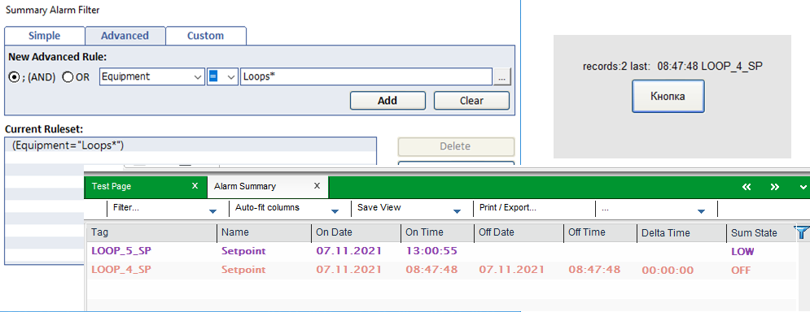

# CiCode функції для роботи з тривогами

| AlarmActive           | Determines if any alarms are active in the user's area.      |
| --------------------- | ------------------------------------------------------------ |
| AlarmCatGetFormat     | Returns the display format string of the specified alarm category. |
| AlarmClear            | Clears acknowledged, inactive alarms from the active alarm list. |
| AlarmClearRec         | Clear an alarm by its record number.                         |
| AlarmClearTag         | Clear an alarm by its tag name.                              |
| AlarmCount            | Counts the available alarms for the selected filter criteria. |
| AlarmCountEquipment   | Counts the available alarms for specified equipment in conjunction with the selected filter criteria. |
| AlarmCountList        | Counts the available alarms for the selected alarm list.     |
| AlarmDelete           | Deletes alarm summary entries that are currently displayed.  |
| AlarmDisable          | Disables alarms.                                             |
| AlarmDisableRec       | Disables alarms by record number.                            |
| AlarmDisableTag       | Disables alarms by tag name.                                 |
| AlarmEnable           | Enables alarms.                                              |
| AlarmEnableRec        | Enables alarms by record number.                             |
| AlarmEnableTag        | Enables alarms by tag name.                                  |
| AlarmEventQue         | Opens the alarm event queue.                                 |
| AlarmGetDelay         | Gets the delay setting for an alarm.                         |
| AlarmGetDelayRec      | Gets the delay setting for an alarm via the alarm record number. |
| AlarmGetDsp           | Gets field data from the alarm record that is displayed at the specified AN. |
| AlarmGetFieldRec      | Gets alarm field data from the alarm record number.          |
| AlarmGetInfo          | Gets information about an alarm list displayed at an AN.     |
| AlarmGetOrderbyKey    | Retrieves the list of key(s) used to determine the order of the alarm list. |
| AlarmGetThreshold     | Gets the thresholds of analog alarms.                        |
| AlarmGetThresholdRec  | Gets the thresholds of analog alarms by the alarm record number. |
| AlarmHelp             | Displays the help page for the alarm where the cursor is positioned. |
| AlarmHighestPriority  | Returns the priority and alarm state of the current highest priority alarm for the given equipment. |
| AlarmListCreate       | Creates an alarms list at a specified AN.                    |
| AlarmListDestroy      | Destroys an alarms list at a specified AN.                   |
| AlarmListDisplay      | Displays an alarms list at a specified AN.                   |
| AlarmListFill         | Fills an alarm list at a specified AN to be used by another routine. |
| AlarmNextCatRec       | Searches for the next occurrence of an alarm category and type. |
| AlarmNextPriRec       | Searches for the next occurrence of an alarm priority and type. |
| AlarmNextTagRec       | Searches for the next occurrence of an alarm tag, name, and description. |
| AlarmNotifyVarChange  | Activates a time-stamped digital or time-stamped analog alarm |
| AlarmQueryFirstRec    | Searches for the first occurrence of an alarm category (or priority) and type. |
| AlarmQueryNextRec     | Searches for the next occurrence of an alarm category (or priority) and type. |
| AlarmResetQuery       | Clears the filter of the specified filter source. Used to reset the filter set up by the Cicode function AlarmFilterForm(). |
| AlarmSetDelay         | Changes the delay setting for an alarm.                      |
| AlarmSetDelayRec      | Changes the delay set for an alarm via the alarm record number. |
| AlarmSetInfo          | Changes the display parameters for the alarm list displayed at an AN. |
| AlarmSetQuery         | This function is now obsolete. Use the [Alarm Filter Functions--Alarm_Filter_Functions.html). |
| AlarmSetThreshold     | Changes the thresholds of analog alarms.                     |
| AlarmSetThresholdRec  | Changes the thresholds of analog alarms by the alarm record number. |
| AlarmSplit            | Splits an alarm summary entry which has no Off time.         |
| AlarmTagFromEquipment | Returns the first tag associated with a piece of equipment.  |
| HwAlarmQue            | Returns the handle of the hardware alarm queue.              |

## Дії над тривогами

| AlarmAck          | Acknowledges alarms.                                         |
| ----------------- | ------------------------------------------------------------ |
| AlarmAckRec       | Acknowledges alarms by record number.                        |
| AlarmAckTag       | Acknowledges a specified alarm                               |
| AlarmComment      | Allows users to add comments to alarm summary entries during runtime. |
| AlarmCommentRecID | Allows an operator to add a comment to a selected alarm summary or SOE entry during runtime. |

## Виведення тривог на сторінку

|                       |                                                              |
| --------------------- | ------------------------------------------------------------ |
| AlarmDsp              | Displays alarms.                                             |
| AlarmDspClusterAdd    | Adds a cluster to a client's alarm list.                     |
| AlarmDspClusterInUse  | Determines if a cluster is included in a client's alarm list. |
| AlarmDspClusterRemove | Removes a cluster from a client's alarm list.                |
| AlarmDspLast          | Displays the latest, unacknowledged alarms.                  |
| AlarmDspNext          | Displays the next page of alarms.                            |
| AlarmDspPrev          | Displays the previous page of alarms.                        |

## Пошук активних тривог

| AlarmFirstCatRec | Searches for the first occurrence of an alarm category and type. |
| ---------------- | ------------------------------------------------------------ |
| AlarmFirstPriRec | Searches for the first occurrence of an alarm priority and type. |
| AlarmFirstTagRec | Searches for the first occurrence of an alarm tag, name, and description. |

## Alarm Summary

| AlarmSumAppend | Appends a new blank record to the alarm summary.             |
| -------------- | ------------------------------------------------------------ |
| AlarmSumCommit | Commits the alarm summary record to the alarm summary device. |
| AlarmSumDelete | Deletes alarm summary entries.                               |
| AlarmSumFind   | Finds an alarm summary index for an alarm record and alarm on time. |
| AlarmSumFirst  | Gets the oldest alarm summary entry.                         |
| AlarmSumGet    | Gets field information from an alarm summary entry.          |
| AlarmSumLast   | Gets the latest alarm summary entry.                         |
| AlarmSumNext   | Gets the next alarm summary entry.                           |
| AlarmSumPrev   | Gets the previous alarm summary entry.                       |
| AlarmSumSet    | Sets field information in an alarm summary entry.            |
| AlarmSumSplit  | Duplicates an alarm summary entry.                           |
| AlarmSumType   | Retrieves a value that indicates a specified alarm's type.   |


| AlmSummaryAck           | Acknowledges the alarm at the current cursor position in an active data browse session. |
| ----------------------- | ------------------------------------------------------------ |
| AlmSummaryClear         | Clears the alarm at the current cursor position in an active data browse session. |
| AlmSummaryClose         | Closes an alarm summary browse session.                      |
| AlmSummaryCommit        | Commits the value changes made by AlmSummarySetFieldValue(). |
| AlmSummaryDelete        | Deletes alarm summary entries from the browse session.       |
| AlmSummaryDeleteAll     | Deletes all alarm summary entries from the browse session.   |
| AlmSummaryDisable       | Disables the alarm at the current cursor position in an active data browse session. |
| AlmSummaryEnable        | Enables the alarm at the current cursor position in an active data browse session. |
| AlmSummaryFirst         | Gets the oldest alarm summary entry.                         |
| AlmSummaryGetField      | Gets the field indicated by the cursor position in the browse session. |
| AlmSummaryLast          | Places the data browse cursor at the latest summary record from the last cluster of the available browsing cluster list. |
| AlmSummaryNext          | Gets the next alarm summary entry in the browse session.     |
| AlmSummaryNumRecords    | Retrieves the number of records in an alarm summary browse session. |
| AlmSummaryOpen          | Opens an alarm summary browse session.                       |
| AlmSummaryPrev          | Gets the previous alarm summary entry in the browse session. |
| AlmSummarySetFieldValue | Sets the value of the field  indicated by the cursor position in the browse session.  AlmSummaryCommit() is required to commit the value changes. The value  changes are discarded if the cursor moves away. |



```c
FUNCTION lastalarmtag () 
	INT hTask=TaskNew("almsum","",8);
END	

FUNCTION almsum ()
 STRING t0 = IntToStr(TimestampToTimeInt(TimestampCurrent()));
 STRING t1 = IntToStr(TimestampToTimeInt(TimestampCurrent())- 4*24*3600) ;
 INT session = AlmSummaryOpen("OnTime >= " + t1 + " AND OnTime < " + t0 + " AND Equipment = ^"Loops*^"", "");
 IF (session >= 0) THEN
     AlmSummaryFirst(session);
     tagstr = "records:" + IntToStr(AlmSummaryNumRecords(session)); 
     tagstr = tagstr + " last: " AlmSummaryGetField(session, "Date"); 
     tagstr = tagstr + " " + AlmSummaryGetField(session, "Time"); 
     tagstr = tagstr + " " + AlmSummaryGetField(session, "Tag"); 
     AlmSummaryClose(session);
 ELSE
 	tagstr =  IntToStr(session) ;   
 END
END 
```


### Alarm Browse

| AlmBrowseAck        | Acknowledges the alarm tag at the current cursor position in an active data browse session. |
| ------------------- | ------------------------------------------------------------ |
| AlmBrowseClear      | This function is now obsolete.                               |
| AlmBrowseClose      | Closes an alarm tags browse session.                         |
| AlmBrowseDisable    | Disables the alarm tag at the current cursor position in an active data browse session. |
| AlmBrowseEnable     | Enables the alarm tag at the current cursor position in an active data browse session. |
| AlmBrowseFirst      | Gets the oldest alarm tags entry.                            |
| AlmBrowseGetField   | Gets the field indicated by the cursor position in the browse session. |
| AlmBrowseNext       | Gets the next alarm tags entry in the browse session.        |
| AlmBrowseNumRecords | Returns the number of records in the current browse session. |
| AlmBrowseOpen       | Opens an alarm tags browse session.                          |
| AlmBrowsePrev       | Gets the previous alarm tags entry in the browse session.    |

