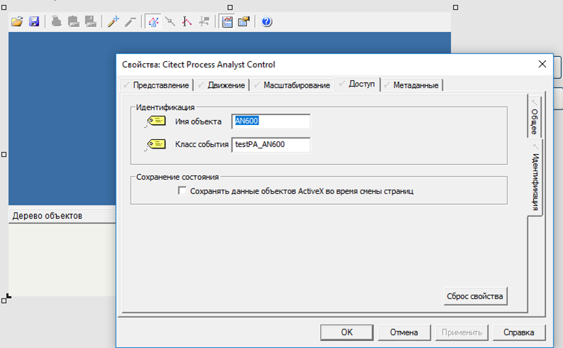

# Process Analyst Functions

Following are functions relating to Process Analyst:

| [ProcessAnalystLoadFile](file:///C:/Program Files (x86)/AVEVA/Citect SCADA 2018 R2/Bin/Help/Citect SCADA/Subsystems/CicodeReferenceCitectHTML/Content/ProcessAnalystLoadFile.html) | Loads the specified PAV file to a Process Analyst object.    |
| ------------------------------------------------------------ | ------------------------------------------------------------ |
| [ProcessAnalystPopUp](file:///C:/Program Files (x86)/AVEVA/Citect SCADA 2018 R2/Bin/Help/Citect SCADA/Subsystems/CicodeReferenceCitectHTML/Content/ProcessAnalystPopUp.html) | Displays a Process Analyst page (in a new page child window) at the current mouse position. |
| [ProcessAnalystSelect](file:///C:/Program Files (x86)/AVEVA/Citect SCADA 2018 R2/Bin/Help/Citect SCADA/Subsystems/CicodeReferenceCitectHTML/Content/ProcessAnalystSelect.html) | Allows a set of pens to be selected before displaying the PA page. |
| [ProcessAnalystSetPen](file:///C:/Program Files (x86)/AVEVA/Citect SCADA 2018 R2/Bin/Help/Citect SCADA/Subsystems/CicodeReferenceCitectHTML/Content/ProcessAnalystSetPen.html) | Allows a new pen to be added to a PA display.                |
| [ProcessAnalystWin](file:///C:/Program Files (x86)/AVEVA/Citect SCADA 2018 R2/Bin/Help/Citect SCADA/Subsystems/CicodeReferenceCitectHTML/Content/ProcessAnalystWin.html) | Displays a Process Analyst page (in a new window) preloaded with the pre-defined Process Analyst View (PAV) file. |

## ProcessAnalystLoadFile

Loads the specified PAV file to a Process Analyst object, which is identified by parameter ObjName.

**ProcessAnalystLoadFile**(*sPAVFile, iFileLocation, iButtonMask, sObjName* )

*sPAVFile:* Name of the PAV file

*iFileLocation:* PAV file location code for the PAV file. Indicates which known location to load the file from.

| Member Name         | Description                                         | Value |
| ------------------- | --------------------------------------------------- | ----- |
| FileLocation_Local  | Refers to the project folder                        | 0     |
| FileLocation_Server | Refers to the both the primary/standby server paths | 1     |
| FileLocation_User   | Refers to the My Documents folder                   | 2     |

*iButtonMask:* Bit mask for removing command buttons from the PA, bit flags as shown below:

- 1 - Load View
- 2 - Save View
- 4 - Print
- 8 - Copy to Clipboard
- 16 - Copy to File
- 32 - Add Pens
- 64 - Remove Pens
- 128 - Show Properties
- 256 - Help

*sObjName:* Name of the PA object on the given Page where the PAV file will be loaded.

## ProcessAnalystPopup

Displays a Process  Analyst page (in a new page child window) at the current mouse position  preloaded with the pre-defined Process Analyst View (PAV) file.

**ProcessAnalystPopup**(*sPage* [, *sPAVFile* [, *iFileLocation* [, *iButtonMask* [, *sObjName* [, *iMode* ]]]]])

*sPage:*  The name of the page that contains Process Analyst object(s). For example, pages based on the Process  Analyst templates found in the Tab_Style_Include project.

*sPAVFile:*  Name of the PAV file

*iFileLocation:*   PAV file location code for the PAV file, see PA doc LoadFromFile() for details.

*iButtonMask:*  Bit mask for removing command buttons from the PA, bit flags as shown below:

- 1 - Load View
- 2 - Save View
- 4 - Print
- 8 - Copy to Clipboard
- 16 - Copy to File
- 32 - Add Pens
- 64 - Remove Pens
- 128 - Show Properties
- 256 - Help

*sObjName:*        

Name of the PA object on the given Page where the PAV file will be loaded. If this parameter is not  specified or empty string, it is defaulted to the object name used in  the tab style templates, that is "_templatePA1".

*iMode:* The mode of the window (see [WinNewAt()](file:///C:/Program Files (x86)/AVEVA/Citect SCADA 2018 R2/Bin/Help/Citect SCADA/Subsystems/CicodeReferenceCitectHTML/Content/WinNewAt.html) for details).

Return Value - Window number if the window is successfully displayed. Otherwise -1 is returned.

## ProcessAnalystSelect

Works like the existing Cicode Function TrnSelect(). It allows a set of pens to be selected  before displaying the PA page. When PageProcessAnalystPens() is called  after ProcessAnalystSelect(), the pens specified by both functions will  be available in the final PA display. You can also repeat the call  sequence of ProcessAnalystSelect() and ProcessAnalystSetPen() multiple  times to set up multiple PA objects for the same page before displaying  the page.

**ProcessAnalystSelect**(*(iWindow, sPage [, sObjName [, sClusterName [, iButtonMask [, sPAVFile [, iFileLocation]]]]])* )

*iWindow:* The window number (returned from the [WinNumber()](file:///C:/Program Files (x86)/AVEVA/Citect SCADA 2018 R2/Bin/Help/Citect SCADA/Subsystems/CicodeReferenceCitectHTML/Content/WinNumber.html) function):

-3 - for the current window

-2 - For the next window displayed

*sPage:* The name of the page that displays the PA.

*sObjName:* The name of the PA object. If this is not specified, it is defaulted to "_TemplatePA1" which is the name  used by the built-in templates.

*sClusterName:*  The name of the cluster that is  associated with any trend tag for this PA. This is optional if you have  one cluster or are resolving the trend via the current cluster context.  The argument is enclosed in quotation marks "".

*iButtonMask:* Bit mask for removing command buttons from the PA, bit flags as shown below:

- 1 - Load View
- 2 - Save View
- 4 - Print
- 8 - Copy to Clipboard
- 16 - Copy to File
- 32 - Add Pens
- 64 - Remove Pens
- 128 - Show Properties
- 256 - Help

*sPAVFile:* Name of the PAV file

*iFileLocation:* PAV file location code for the PAV file, see PA doc LoadFromFile() for details.

## ProcessAnalystSetPen

Works like the  existing function TrnSetPen(). Allows a new pen to be added to a PA  display. The pane defaults to the first pane of the PA if it is not  specified.

**ProcessAnalystSetPen**(*(iPen, sTag [, sObjName [, iPane [, iPenType]]])* )

*iPen:* Pen number. The allowed values are:

- <0 - new pen
- 0 - the currently selected pen

- existing pen number - change existing pen
- \> existing pen number - new pen

Up to 8 pens can be added to the PA using the Cicode function if ObjName is set to "-2".

Be reminded that unlike trend  objects, the pen numbers in Process Analyst are not fixed. They are  dynamically reassigned when pens are added or deleted. When setting pens to the Process Analyst on the current display, pens are numbered within the scope of the pane they are in. On the other hand, when setting pens for the next display, pens are numbered in a flat scope regardless of  pane number specified.

*sTag:* The trend tag name to be assigned to the pen.

*sObjName:* The name of the PA object. If this is set to "-2", the pen is set to the next displayed PA page set up by  ProcessAnalystSelect(). If the specified ObjName is valid, the changes  will be applied to the currently displayed PA. Otherwise, the function  will try to set the pen to the specified object on the currently  displayed page. If this parameter is not specified or is an empty  string, it will default to the object name used in the tab style  templates, that is "_templatePA1".

*iPane:* Optional number of the pane where  the trend or variable tags are added. Please see the same parameter for  function PageProcessAnalystPens() for details. Defaulted to 0, that is,  the first pane.

*iPenType:*  Pen type for creation. The allowed values are:

0 - Analog Trend (Default)

1 - Digital Trend 

2 - Alarm

**Note:** This optional parameter is ignored for existing pens. To change pen type, delete a pen and create a new one.

Return Value 0 (zero) if successful, otherwise an [error code](file:///C:/Program Files (x86)/AVEVA/Citect SCADA 2018 R2/Bin/Help/Citect SCADA/Subsystems/CicodeReferenceCitectHTML/Content/Cicode_and_General_Errors.html) is returned.

## ProcessAnalystWin

Displays a Process Analyst page (in a new window) preloaded with the pre-defined Process Analyst View (PAV) file.

**ProcessAnalystWin**(*sPage, iX, iY, iMode [, sPAVFile [, iFileLocation [, iButtonMask [, sObjName ]]]]*)

*sPage:*  The name of the page that contains Process Analyst object(s). For example, pages based on the Process  Analyst templates found in the Tab_Style_Include project.

*iX:* The X pixel coordinate

*iY:* The Y pixel coordinate

*iMode:* The mode of the window (see [WinNewAt()](file:///C:/Program Files (x86)/AVEVA/Citect SCADA 2018 R2/Bin/Help/Citect SCADA/Subsystems/CicodeReferenceCitectHTML/Content/WinNewAt.html) for details).

*sPAVFile:* Name of the PAV file

*iFileLocation:* PAV file location code for the PAV file, see PA doc LoadFromFile() for details.

*iButtonMask:* Bit mask for removing command buttons from the PA, bit flags as shown below:

- 1 - Load View
- 2 - Save View
- 4 - Print
- 8 - Copy to Clipboard
- 16 - Copy to File
- 32 - Add Pens
- 64 - Remove Pens
- 128 - Show Properties
- 256 - Help

*sObjName:* Name of the PA object on the given Page where the PAV file will be loaded. If this parameter is not  specified or empty string, it is defaulted to the object name used in  the tab style templates, that is "_templatePA1".

Return Value

Window number if the window is successfully displayed. Otherwise -1 is returned.

## PageProcessAnalyst

Displays a Process Analyst page (in the same window) preloaded with the pre-defined Process Analyst View (PAV) file.

**PageProcessAnalyst**(*sPage, sPAVFile1 [, iFileLocation1 [, iButtonMask1 [, sObjName1 [, sPAVFile2  [, iFileLocation2 [, iButtonMask2 [, sObjName2 ]]]]]]]*)

*sPage:*  The name of the page that contains Process Analyst object(s). For example, pages based on the Process  Analyst templates found in the Tab_Style_Include project.

*sPAVFile1:*  Name of the 1st PAV file

*iFileLocation1:*  PAV file location code for the 1st PAV file, see PA doc LoadFromFile() for details.

*iButtonMask1:* Bit mask for removing command buttons from the 1st PA, bit flags as shown below:

- 1 - Load View
- 2 - Save View
- 4 - Print
- 8 - Copy to Clipboard
- 16 - Copy to File
- 32 - Add Pens
- 64 - Remove Pens
- 128 - Show Properties
- 256 - Help

*sObjName1:*  Name of the PA object on the given Page where the 1st PAV file will be loaded. If this parameter is not  specified or empty string, it is defaulted to the object name used in  the tab style templates, that is "_templatePA1".

*sPAVFile2:* Name of the 2nd PAV file

*iFileLocation2:* PAV file location code for the 2nd PAV file

*iButtonMask2:* Bit mask for removing command buttons from the 2nd PA, refer iButtonMask1 for details

*sObjName2:*  Name of the PA object on the given Page where the 2nd PAV file will be loaded. If this parameter is not  specified or empty string, it is defaulted to the object name used in  the tab style templates, that is "_templatePA2".

Return Value Zero (0) if the page is successfully displayed. Otherwise an error is returned.

## PageProcessAnalystPens

Display a page and add the specified pens to the first pane of the specified PA object on the  page. If a PAV file is also specified, it will be loaded first, and the  pens in the first pane will be removed before the specified pens are  created on the PA.

**PageProcessAnalystPens**(*sPage, sTag1 [, sTag2..sTag8 [, iButtonMask [, sObjName [, iPane [, sPAVFile [, iFileLocation ]]]]]]*)

*sPage:* The name of the page that displays the PA.

*sTag1..sTag8:* Up to 8 Trend tags can be added to the PA.

*iButtonMask:*  Mask to remove button(s) from the main tool bar of PA. The following values can be combined to remove multiple buttons:

- 1 - Load View
- 2 - Save View
- 4 - Print
- 8 - Copy to Clipboard
- 16 - Copy to File
- 32 - Add Pens
- 64 - Remove Pens
- 128 - Show Properties
- 256 - Help

*sObjName* The name of the PA object. If not specified it is defaulted to "_templatePA1" which is the name used by the built-in templates.

*iPane* The pane in PA where the trend or  variable tags are added. If this is not specified or less than 1, it is  defaulted to 1 (the 1st pane). If the specified pane does not exist in  the PA object, a new pane will be created.

*sPAVFile:* Optional Process Analyst View file to be loaded, default ="".

*iFileLocation:* Optional location of the PAV file. The allowed values are:

- 0 - Analyst Views subfolder in project folder (default)
- 1 - Folders specified in properties primary/standby server path
- 2 - My documents folder

Return Value - 0 (zero) if successful, otherwise an [error](file:///C:/Program Files (x86)/AVEVA/Citect SCADA 2018 R2/Bin/Help/Citect SCADA/Subsystems/CicodeReferenceCitectHTML/Content/Cicode_Errors.html) is returned.

# Приклади

## Завантаження PAV



```c
ProcessAnalystLoadFile("LOOP_2.pav",0, 0, "AN600")
```

```c
ProcessAnalystPopup("!ProcessAnalystPopup" , "LOOP_2.pav" )
```

## ActiveX

Отримання кількості панелей

```c
FUNCTION GetPanesCount()
	OBJECT hProcessAnalyst = ObjectByName("AN600");
	OBJECT hPanes = _ObjectGetProperty(hProcessAnalyst, "Panes");
	INT nPanes = _ObjectGetProperty(hPanes, "Count");
	tagstr = IntToStr (nPanes); 
END
```

Отримання назви першого пера на першій панелі

```c
FUNCTION GetPenName(INT PaneNumb, INT PenNumb)
	OBJECT hProcessAnalyst = ObjectByName("AN600");
	OBJECT hPanes = _ObjectGetProperty(hProcessAnalyst, "Panes");
	OBJECT hPane = _ObjectCallMethod(hPanes, "get_Item", PaneNumb);
	OBJECT hPens = _ObjectGetProperty(hPane, "Pens");
	OBJECT hPen = _ObjectCallMethod(hPens, "get_Item", PenNumb);
	tagstr = _ObjectGetProperty(hPen, "Name");
END
```

Виставлення часу та дати для конкретного пера. Наступний приклад виставляє час для пера для відображення за останні 10 хв

```c
FUNCTION TrendPrev10Min(INT PaneNumb, INT PenNumb)  
	OBJECT hProcessAnalyst = ObjectByName("AN600");
	OBJECT hPanes = _ObjectGetProperty(hProcessAnalyst, "Panes");
	OBJECT hPane = _ObjectCallMethod(hPanes, "get_Item", PaneNumb);
	OBJECT hPens = _ObjectGetProperty(hPane, "Pens");
	OBJECT hPen = _ObjectCallMethod(hPens, "get_Item", PenNumb);
	REAL startDate = TimeToOLEDate(TimeCurrent()-1200 , 0); // Convert to UTC
	REAL endDate = TimeToOLEDate(TimeCurrent()-600, 0); // Convert to UTC
	_ObjectcallMethod(hPen, "PutHorizontalAxisTimeSpan", startDate, 0, endDate, 0);
	_ObjectCallMethod(hPen, "RefreshData");
END
```

