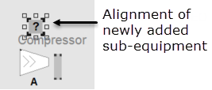
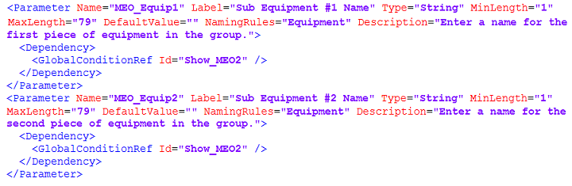
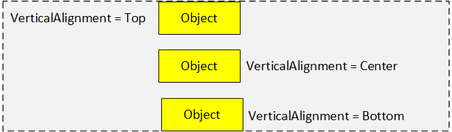

## Композитні джини

Це адаптована версія довідки.

**Композитний Джин (Composite Genie)** — це набір окремих Джинів, зібраних у єдиний об’єкт. Окремі об’єкти та їх властивості означуються у файлі шаблону XML разом із макетами для колекції, тобто Composite Genie. Ви можете вставити кілька екземплярів складеного об’єкта на графічну сторінку та щоб налаштувати Composite Genie для кожного екземпляра відповідно до ваших вимог вказати різні параметри, включаючи значення, вирівнювання та параметри відображення.

Наприклад, ви хочете створити дзеркальний об’єкт компресора, який може додатково відображати мітку, індикатор режиму та вимірювач поряд із символом. До Plant SCADA 2020 R2 ви могли створити окремі джини для кожної з перестановок, або ви могли створити одного джина, який використовував видимість для відображення/приховування елементів під час виконання. За допомогою Composite Genies ви можете просто вибрати відповідний шаблон XML для компресора, який надає набір параметрів представлення для налаштування мітки, орієнтації тощо. Все, що вам потрібно зробити, це встановити значення для цих параметрів і вставити об’єкт на сторінку.

| Без композитного джина                                       | Використовуючи композитний джин                              |
| ------------------------------------------------------------ | ------------------------------------------------------------ |
| Вставляти та налаштовувати окремі Джини.     Змінити макет і вирівнювання цих Джинів вручну. | Вставити композитний джин   Усі компоненти викладені акуратно з параметрами вирівнювання та макета, які інженери можуть налаштувати. |
| Якщо ви додасте вказівку відповідного обладнання до свого компресора Джин вище, вирівнювання об’єктів потрібно відрегулювати для розміщення нового Genie:      | З композитним джином просто відкрийте параметри представлення (Presentation Options ) і виставте відповідну опцію відображення: |

З використанням композитних джинів:

- Розмір бібліотек об’єктів можна значно зменшити, оскільки потрібно підтримувати лише один композитний джин, а не підтримувати декілька комбінацій для кожного об’єкта, що використовується на графічних сторінках.

- Інженери можуть отримати більш чітке уявлення про дизайн своєї сторінки, оскільки композитний джин відображає лише ті параметри, які були вибрані.
- Доступний розширений інтерфейс параметрів. Використовуючи XML-шаблон, розробники бібліотек можуть збагатити інтерфейс параметрів, що дозволяє операторам вибирати з різних макетів, режимів, представляє параметри з урахуванням залежностей, правил імен тощо.

Як і у випадку з Джинами та символами, композитні джини можна вставити для використання на графічній сторінці, шаблоні або суперджині. Ви можете виконувати такі операції:

- вставляти композитні джини
- редагувати/оновлювати композитні джини

- видаляти не використовувані екземпляри композитних джинів
- видаляти композитні джини

З композитним джином зв'язано кілька понять:

- **Composite Genie Templates** - шаблон композитного джина, це XML-шаблон, де описане все що необхідно для розміщення і налаштування екземплярів композитних джинів.
- **Composite Genie Instances** - екземпяр композитного джина, реалізація композитного джина з готовими налаштуваннями. Він зберігається в папці проекту `_CompositionCaches`. Не слід змінювати властивості цієї папки, вручну видаляти чи змінювати файли в цій папці, бо це приводить до помилок під час вставки композитних джинів на графічні сторінки.
- **Composite Genie** - композитний джин, вставлений на сторінку екземпляр. У одного екземпляра може бути кілька композитних джинів на кількох сторінках. Ідентифікатор екземпляру можна подивитися `Tools->GoTo Object`. Видалення композитного джина не приводить до видалення екземпляру, який треба видаляти через упакування бібліотек (описано нижче) 

Таким чином при вставці нового композитного джина на основі вибраного шаблону створюється екземпляр, в якому будуть зберігатися усі його налаштування. 

### Вставлення композитного джина

Композитний джин можна вставити в будь-яку графічну сторінку, шаблон або супер джин. Його не можна вставити в джин або символ.

**Примітка.** На зовнішній вигляд композитних джинів можуть впливати різні налаштування DPI. Рекомендується, щоб під час запуску Graphics Builder для параметра **Масштаб і структура** було встановлено значення "100%" у налаштуваннях **Дисплей** Windows™. Після зміни параметра «Масштаб і структура» для комп’ютера слід перезавантаження його.

Щоб вставити композитний джин:

1) Відкрийте Graphics Builder.

2) Натисніть кнопку **Paste Composite Genie** на панелі інструментів «Об’єкти».  Відобразиться діалогове вікно Open .

3) Виберіть шаблон XML для композитного джина зі списку шаблонів. Файл шаблону, який ви вибрали, повинен знаходитися в папці Composite Genies у папці поточного проекту (або в одному з проектів, що включені до нього).

4) Натисніть **ОК**. Відобразиться діалогове вікно Presentation Options (параметри представлення).

    

1. Type or select the values for the parameters displayed. 
2. **Note**: Depending upon the options you choose, some items may be hidden or displayed. For example, on the  Meter Composite Genies, when you select the **Display Control Output** check box, the **Display Trend** and **Trend Type** options are displayed.

3. Use the **Search** box to search for parameters in the dialog box. Type the parameter name or part of the parameter name to locate a parameter.
4. **Note**: Clear the Search box before clicking **OK** on the Presentation Options dialog box.

5. Use the **Show only parameters with invalid input** option to display options for which incorrect or no values have been selected or specified.
6. Click **OK** to insert the Composite Genie, or **Cancel** to close the Presentation Options dialog box without inserting the Composite Genie.

**Note**: You cannot rotate or mirror a Composite Genie that has been inserted on a page.

5) Введіть або виберіть значення для відображених параметрів. Залежно від вибраних параметрів деякі елементи можуть бути приховані або відображені. Наприклад, на Composite Genies `Meter`, коли ви встановлюєте прапорець **Display Control Output**, відображаються параметри **Display Trend** і **Trend Type**.

6) Для пошуку параметрів у діалоговому вікні використовуйте поле **Search**. Щоб знайти параметр введіть назву параметра або частину назви. Очистіть поле пошуку, перш ніж натискати **OK** у діалоговому вікні «Presentation Options».

7) Щоб відобразити параметри, для яких вибрано чи вказано неправильні значення або вони не встановлені використовуйте опцію **Show only parameters with invalid input**.

8) Натисніть **OK**, щоб вставити композитний джин, або **Cancel**, щоб закрити діалогове вікно не вставляючи його.

Ви не можете обертати чи віддзеркалювати композитний джин, який було вставлено на сторінку.

### Редагування/Оновлення композитних джинів

Щоб відредагувати параметри для існуючого композитного джина:

1. Відкрийте Graphics Builder.
2. Клацніть, щоб вибрати вставлений композитний джин.
3. Клацніть правою кнопкою миші або подвійним кліком композитний джин і виберіть у контекстному меню **Edit Composite Genie**. Відобразиться діалогове вікно з назвою екземпляра Composite Genie та ідентифікатором шаблону.
4. Відредагуйте необхідні параметри.
5. Натисніть **ОК**.

Подвійне клацання по ID шаблону вибирає ідентифікатор. Ви можете скопіювати ідентифікатор і використовувати його для пошуку повторюваних екземплярів шаблону в Провіднику Windows.

Якщо ви модифікуєте композитний джин після використання його у своєму проекті, усі його екземпляри можуть автоматично оновлюватися за допомогою останньої версії шаблону. Зміни, включаючи оновлення тегів, джинів і макета, будуть поширені на всі екземпляри. Якщо шаблон оновлений, пов’язані екземпляри не оновлюватимуться.

Не слід змінювати властивості папки, в якій зберігаються екземпляри композитних джинів (`%PROGRAMDATA%\AVEVA Plant SCADA 2020 R2\User\<Назва проекту>\_CompositionCaches`). Не слід вручну видаляти чи змінювати файли в цій папці. Такі дії призводять до помилок під час вставки композитних джинів на графічні сторінки.

Якщо під час оновлення виникла проблема, з’являється повідомлення про помилку. У повідомленні детально описана причина та доступні варіанти вирішення проблеми. Помилка може виникнути, якщо композитного джина немає, або якщо проект є помилковим. Наприклад, якщо ви створюєте копію існуючого шаблону, але зберігаєте той самий GUID у XML-файлі скопійованого шаблону, ви побачите таке повідомлення:

    

**Оновлення окремого екземпляру**

Оновлення конкретного екземпляра композитного джина дозволяє вам перевірити зміни в ньому, не впливаючи на інші екземпляри об’єкта на інших сторінках. Щоб оновити певний екземпляр композитного джина:

1. Відкрийте Graphics Builder.
2. За потреби оновіть шаблон композитного джина.
3. Двічі клацніть екземпляр, представлений шаблоном. Відобразиться діалогове вікно зі зміненими параметрами. 
4. Натисніть **ОК**. Зміни, включаючи оновлення тегів, джинів і макета, будуть поширені на цей екземпляр композитного джина.
5. Збережіть сторінку.

Перш ніж застосувати зміни до всіх екземплярів композитного джина на всіх сторінках, перевірте зміни, дотримуючись інструкцій вище.

**Оновлення всіх екземплярів**

  Щоб оновити екземпляри Composite Genies:

1. Відкрийте Graphics Builder.
2. У меню **Tools** виберіть **Update Pages**. Ця команда замінить існуючі екземпляри композитних джинів на їх найновішу доступну версію. Ця команда вплине лише на активний проект і його компоненти. Зкомпілюйте проект, щоб зміни вступили в силу для середовища виконання. Цю зміну неможливо скасувати.

Якщо сторінка середовища виконання містить оновлений екземпляр композитного джина, онлайн-зміни оновлять середовище виконання. 

### Видалення невикористаних екземплярів композитних джинів

Коли ви додаєте на сторінку композитний джин у папці проекту автоматично створюється екземпляр композитного джину, який унікально ідентифікується параметрами представлення (presentation options). Це встановлює посилання графічного об’єкта на цей екземпляр композитного джина. Може існувати декілька графічних об’єктів, які посилаються на один екземпляр композитного джина, якщо їхні параметри представлення однакові. Таким чином, видалення графічного об’єкта не видаляє пов’язаний екземпляр композитного джина.

З часом може з’явитися кілька екземплярів композитного джина, не пов’язаних із жодним графічним об’єктом. Ці невикористані екземпляри композитних джинів можуть уповільнити роботу та зайняти місце на диску проекту. Щоб видалити невикористані екземпляри, можна скористатися опцією **Pack Libraries**.

Щоб видалити невикористані екземпляри:

1. Відкрийте Graphics Builder.
2. У меню **Tools** виберіть **Pack Libraries in Active Projects** або **Pack Libraries in Active and Included Projects**. Відобразиться таке повідомлення.

    

3) Натисніть **Yes**. Усі екземпляри Composite Genies, які не використовуються, буде видалено.

### Видалення композитного джина

Щоб видалити Composite Genie:

1. Відкрийте сторінку, на якій було вставлено Composite Genie.
2. Виберіть Composite Genie.
3. Натисніть клавішу **Delete**. Це видалить Composite Genie зі сторінки.
4. Збережіть сторінку.

### Шаблон композитного джина

Plant SCADA надає широкий асортимент готових композитних джинів у формі XML-шаблонів. Шаблон XML містить означення композитного джина. Розробник бібліотеки може змінити існуючий шаблон XML або створити нові шаблони, що означують їхні власні Composite Genies. Рекомендується зробити копію шаблону перед його зміненням, щоб шаблони не перезаписувалися під час повторної інсталяції Plant SCADA. Шаблони XML для композитних джинів знаходяться в папці `%PROGRAMDATA%\AVEVA Plant SCADA 2020 R2\User\<ім’я проекту>\Composite Genies`.

**ВАЖЛИВО**: якщо ви робите копію шаблону, вам потрібно призначити новий GUID шаблону та всім композиціям у шаблоні. Це описано нижче.

Файл **CompositionTemplate.xsd**, розташований у `%PROGRAMFILES(X86)%\AVEVA Plant SCADA\Bin`, містить схему для шаблонів XML для Composite Genie. Цей файл описує елементи та атрибути, які можуть міститися в XML шаблоні для Composite Genie, а також порядок, у якому елементи та атрибути потрібно додати до шаблону. Файл XML шаблону перевіряється відповідно до цього файлу XSD. Коли ви змінюєте шаблон XML або створюєте новий, рекомендується використовувати хороший XML-редактор, який підтримує виявлення помилок схеми, щоб помилки були виділені та їх можна було легко виправити. Помилки можуть виникнути, якщо файл XML для Composite Genie не відповідає означенням у базовому XSD, якщо є повторювані ідентифікатори елементів, невизначені умови тощо. В усіх випадках коли оператор вставляє Composite Genie на сторінку повідомлятиметься про помилки з деталями номера рядка та положення помилки. Деталі описані нижче.

Шаблон XML для Composite Genie містить такі розділи:

- Visual Template
- Parameters
- Content Items
- Compositions
- Conditions
- Alarm Indicators

Кожен з цих елементів детально пояснюється в розділах нижче. Рекомендується переглянути ці розділи, перш ніж змінювати існуючі шаблони XML або створювати нові шаблони.

#### Visual Template

Цей розділ містить стандартні декларації XML. Крім того, цей розділ містить GUID, який є унікальним ідентифікатором для шаблону XML. Якщо ви змінюєте існуючий шаблон або створюєте новий шаблон Composite Genie, ви повинні перевірити XML-файл, завантаживши файл означення схеми (CompositionTemplate.xsd, який знаходиться в папці `<Папка інсталяції Plant SCADA>\bin `) у свій XML-редактор. Якщо ви створюєте власного Composite Genie, вам потрібно буде створити для нього GUID. Для створення GUID доступно кілька онлайн-інструментів, наприклад [guidgenerator](https://www.guidgenerator.com/).

Щоб створити GUID:

1. Виберіть формат для GUID. Формат GUID має включати дужки та дефіси і має бути у верхньому регістрі. Наприклад, `{1E49C603-FCBC-4913-ABD1-97920283C6BD}` (мають бути усі прописні).
2. Згенеруйте GUID.

**Приклад**

    

#### Parameters

Елемент `<Parameter>` означує атрибути, які будуть відображатися як параметри представлення для користувача, коли він вставляє Composite Genie на графічну сторінку. Він складається з наступних атрибутів для кожного параметра:

| Attribute    | Description                                                  |
| ------------ | ------------------------------------------------------------ |
| Name         | Унікальна назва для параметра                                |
| Label        | Відображувана назва для параметра.                           |
| Type         | Тип даних параметра – Boolean, Integer або String.           |
| MinLength    | Мінімальна кількість символів, яку має містити значення параметра. |
| MaxLength    | Максимально допустима кількість символів для значення параметра |
| MinValue     | Мінімальне значення, яке можна вказати для параметра         |
| MaxValue     | Максимально допустиме значення для параметра                 |
| DefaultValue | Для параметра встановлено значення за замовчуванням          |
| NamingRules  | Правила іменування, які можна використовувати, щоб змусити користувача вводити значення параметрів у певному форматі. Наприклад, щоб використовувати правила іменування обладнання, встановіть для цього атрибута значення «Equipment». Для отримання додаткової інформації зверніться до розділів «Правила найменування обладнання» та Правила назви тегів |
| Description  | Опис параметра. Це з’являється в нижній частині діалогового вікна Parameter Options, коли оператор клацає, щоб вказати значення параметра. Рекомендується ввести опис параметра, щоб допомогти розробникам вказати дійсні значення для параметрів. |
| Values       | Список значень, які можна вибрати, якщо параметр має відображатися як спадний список у діалоговому вікні Parameter Options. Щоб створити список значень, кожне значення має бути оголошено з унікальним ідентифікатором (Id) та міткою (Label). Мітка відображатиметься як одне із значень, які користувач може вибрати. Наприклад, якщо вам потрібна опція під назвою «Orientation» зі значеннями «Vertical» і «Horizontal», доступними для вибору, до елемента «Parameter» необхідно включити наступний код:       |

Означення параметрів можуть включати елемент `<Dependency>` для відображення або приховування параметрів. Цей елемент може використовувати умови Global, Parameter або Composite, щоб показати або приховати параметр на основі вибору опції або значення, що введене оператором. Для отримання додаткової інформації про умови зверніться до відповідного пункту нижче.

**Простий приклад **

Це простий приклад, коли залежність була означена за допомогою елемента `<Dependency>`, щоб показати параметр **Label**, лише якщо оператор вибрав прапорець **Display Label**. Це досягається за допомогою використання Global Condition. Ви також можете використовувати параметри та/або складені умови в елементі `<Dependency>`.

    

Наведений вище код відобразить такі параметри відображення.

    

**Складний приклад**

Цей приклад надає трохи складніший сценарій з параметрами, які відображаються на основі вибору значення оператором. Тому необхідно означити список значень і залежність.

- Зверніться до XML-коду для параметра “Number of sub equipment”. Цей параметр може приймати значення 0, 1, 2, 3, 4 або 5. Атрибут `<Values>` означує цей список значень, які можна вибрати (див. зразок коду нижче).

    

- Залежно від значення, яке оператор вибирає для цього параметра, будуть відображатися параметри Sub Equipment. Наприклад:
  - якщо оператор вибирає 0 для параметра  “Number of sub equipment”, параметр Sub Equipment не відображатиметься
  - якщо користувач вибирає 1, відображатиметься один параметр Sub  Equipment з міткою Sub Equipment #1 Name
  - якщо користувач вибере 2, відображатимуться два параметри Sub Equipment з мітками Sub Equipment #1 Name та Sub Equipment #2 Name 
  - тощо. 

 Користувач може вибрати до 5 одиниць Sub Equipment .

- Щоб мати можливість вибрати 5 одиниць Sub Equipment, потрібно означити параметр для кожної частини Sub Equipment. Крім того, для кожного з цих параметрів повинна бути означена залежність (див. нижче приклад коду, який показує означення для двох частин Sub Equipment ).
- Залежність означується за допомогою атрибута `<Dependency>`. Для Sub Equipment 1 має бути задоволена глобальна умова «Show_MEO1». Щоб отримати детальну інформацію про умови, перегляньте розділ Умови нижче.

    

    

#### Alarm Indicators

Елемент `<AlarmIndicators>` є додатковим елементом для відображення індикаторів тривоги для обладнання. Він містить такі дочірні елементи:

| Element           | Description                                                  | Attribute                 | Description                                                  |
| ----------------- | ------------------------------------------------------------ | ------------------------- | ------------------------------------------------------------ |
| **EquipmentLink** | Означує кожну частину супутнього обладнання, для якого потрібно відобразити сигнал тривоги. | Id                        | Унікальний ідентифікатор string , за допомогою якого елементи `<AlarmIndicator>` у композиціях можуть посилатися на пряме оголошене посилання на обладнання. |
|                   |                                                              | TemplateParameter         | Назва параметра шаблону. Значення цього використовується як вираз обладнання для індикатора тривоги. Параметр шаблону потрібно визначити в елементі `<Parameters>` того самого документа. |
|                   |                                                              | IncludeEquipmentReference | Встановіть значення «true», щоб включити посилання на обладнання під час визначення найвищого пріоритету тривоги для індикатора тривоги. Встановіть для цього значення «false», якщо ви не хочете включати посилання на обладнання. |
|                   |                                                              | Hierarchy                 | Вузол в ієрархії обладнання, який буде використовуватися для визначення найвищого пріоритету тривоги для індикатора тривоги. Ви можете встановити це, щоб включати обладнання, яке зустрічається на вузлах нижче ієрархії обладнання (іменується «дітей»). Встановіть для цього один із наступних параметрів: EquipmentOnly EquipmentAndChildren ChildrenOnly. |
| **BorderStyle**   | Defines the alarm display  settings.                         | Id                        | Унікальний ідентифікатор string , за допомогою якого елементи `<AlarmIndicator>` у композиціях можуть посилатися на передній оголошений стиль рамки. |
|                   |                                                              | Width                     | Sets the width of the alarm  border (in pixels).             |
|                   |                                                              | Padding                   | Sets the amount of space (in  pixels) between the extent of the object group or Genie and the inside edge  of the alarm border. |
|                   |                                                              | IsInside                  | Set this to 'true' to place the  border within the extent of the object group or Composite Genie. Note that  you cannot set a padding in this case. |
|                   |                                                              | IsDefault                 | Set this to 'true' to make this  border style the default style. |

Індикатор тривоги застосовується до всіх елементів обладнання в Composite Genie.  Якщо в контейнері є більше двох видимих елементів вони автоматично групуються, і для них застосовується границя тривоги (alarm border).

**Приклад**

    

#### Content Items

Елемент `<ContentItems>` означує об'єкти бібліотеки (Genies), які доступні для включення до композицій для Composite Genie. Він містить один або кілька дочірніх елементів `<ContentItem>`, кожен з яких містить такі атрибути:

| Attribute | Description                                                  |
| --------- | ------------------------------------------------------------ |
| Id        | Унікальний числовий ідентифікатор у розділі `<ContentItems>`. **Примітка**. Ви не повинні використовувати той самий числовий ідентифікатор для кількох елементів `<ContentItem>`. Це призведе до помилки, коли система прочитає цей документ візуального шаблону. |
| Type      | Це встановлюється на тип об’єкта, який входить в  Composite Genie, і не повинен бути змінений. **Примітка**: У цій версії Composite Genies складається тільки з джинів. Таким чином, Type встановлено на «Genie» у XML-шаблонах. |
| Project   | Ім'я проекту, який містить зазначений об'єкт бібліотеки. Проект має бути таким же, як проект, у якому знаходиться візуальний шаблон, або один із проектів, що включають. **Примітка**: якщо проект буде перейменовано, Genie не буде доступним для використання, якщо цей атрибут не буде змінено в шаблоні XML. Пам’ятайте про це під час перейменування проекту. |
| Library   | Ім'я бібліотеки об'єктів, до якої належить цей елемент.      |
| Item      | Назва елементу, який буде включено до Composite Genie.       |

**Note**: Вам потрібно чітко визначити кожен елемент, який ви хочете включити у свої композиції.

**Приклад**

Кожен рядок у коді нижче означує елемент, у даному випадку Джин, який буде доступний для включення до композиції.

    

#### Compositions

Елемент `<Composition>` детально описує “композицію” композитного джину, тобто можливі макети, умови параметрів і параметри, які складають Composite Genie. Він містить кілька елементів, кожен із набором атрибутів. Зазвичай шаблон XML для Composite Genie складається з кількох композицій для представлення різних доступних макетів. Кожна композиція може визначати лише один макет. Шаблон повинен мати принаймні одну композицію.

| Attribute      | Description                                                  |
| -------------- | ------------------------------------------------------------ |
| Composition Id | Унікальний ідентифікатор композиції. Це ідентифікатор, який створюється за допомогою інструмента GUID Generator. |

**Приклад**

    

##### Prerequisites

У межах композиції в елементі `<Prerequisite>` можуть бути означені одна або кілька передумов. Передумови складаються з умов, які оцінюються під час виконання. Якщо передумова виконується, буде застосована відповідна композиція. В іншому випадку буде перевірена наступна композиція. Композиція буде застосована лише тоді, коли буде виконана передумова. Передумови перевіряються послідовно. Для отримання додаткової інформації зверніться до розділу Conditions .

Означуючи умови, рекомендується спочатку почати з найскладнішої умови, а потім додати умови в порядку зменшення їх складності. Це робиться для того, щоб для Composite Genie була обрана найбільш специфічна (конкретніша) композиція.

| Attribute          | Description                                                  |
| ------------------ | ------------------------------------------------------------ |
| GlobalConditionRef | Використовується для посилання на попередньо означену глобальну умову |
| ParameterCondition | Використовується для означення умов шляхом порівняння значення параметра шаблону із попередньо означеним значенням. |
| CompositeCondition | Використовується для поєднання більш ніж однієї умови з відношенням AND або OR, зазначеним у його атрибуті. Його дочірні умови можуть складатися з попередньо означених глобальних умов `<GlobalConditionRef Id="..."/>`, умови параметра та вкладених складених умов. |

**Приклад**    

##### Container

Елемент Container є обов’язковим і містить деталі макета, елементи вмісту Plant SCADA (об’єкти бібліотеки), які будуть включені в Composite Genie, їх вирівнювання та інші параметри відображення, такі як поля (ліворуч, праворуч, верхнє та нижнє).

| Attribute          | Description                                                  | Attribute           | Description                                                  |
| ------------------ | ------------------------------------------------------------ | ------------------- | ------------------------------------------------------------ |
| **Layout**         |                                                              | Hotspot             | Означує координати сторінки, де розміщується Composite Genie при вставці на сторінку. |
| **Container**      | Означує параметри макета для Composite Genie, включаючи параметри вирівнювання, поля та укладання. | Margin              | Розташування (ліве, верхнє, праве і нижнє поля left, top, right, bottom margins) об’єкта на сторінці відносно вирівнювання. |
|                    |                                                              | Layout              | Означує спосіб розміщення контейнера: з накладенням по горизонталі, зі складенням вертикально або з накладенням. Stacked Horizontal, Stacked Vertical , Overlaid Для отримання додаткової інформації зверніться до розділу «Докладніше про макети». |
|                    |                                                              | VisibleWhen         | Використовується, щоб показати/приховати контейнер на основі глобальної умови. Контейнер буде видно лише тоді, коли умова буде виконана. |
|                    |                                                              | CreateGroup         | Означує, чи буде вміст контейнера групою. Коли вміст контейнера знаходиться в групі, розміщення вмісту автоматично коригується, щоб вмістити найбільший об’єкт/текст при зміні розміру контейнера, а також під час виконання, якщо включено анімацію. За замовчуванням вміст контейнера розміщується в групі. Якщо вміст не згруповано, кожен елемент потрібно змінити розмір і розмістити вручну. Ви можете використовувати діалогове вікно GoTo Object, щоб переглянути ієрархію елементів у контейнері. Розмір контейнера означується найбільшим об’єктом у контейнері. |
|                    |                                                              | AnimationName       | Встановлює назву анімації для застосування до об’єкта. Це унікально для макета. Назва анімації має починатися з літери та містити лише літери, цифри та такі символи: _, %, $, @ та #. Вона не повинна перевищувати 26 символів. |
|                    |                                                              | HorizontalAlignment | Встановлює вирівнювання контейнера для горизонтального відображення всередині його батьківського елемента. |
|                    |                                                              | VerticalAlignment   | Встановлює вирівнювання контейнера для вертикального відображення в межах його батьківського елемента. |
|                    |                                                              | ZIndex              | Означує положення контейнера, коли кілька контейнерів перекриваються. Об’єкт з найнижчим ZIndex укладається на вершину купи, а об’єкт з найвищим ZIndex розміщується внизу стопки контейнерів. ZIndex є відносним у контейнері, незалежно від того, згруповані чи ні об’єкти в контейнері. Щоб отримати додаткові відомості, зверніться до розділу «Докладніше про макети». |
| **AlarmIndicator** | Встановлює індикатор тривоги, який має відображатися для цієї композиції. | VisibleWhen         | Індикатор тривоги буде відображено, якщо зазначена тут умова задовольняється. |
| **EquipmentLink**  | Посилання на індикатор тривоги, який буде відображатися, як означено в елементі `<AlarmIndicators>`. |                     |                                                              |
| **BorderStyle**    | Посилання на стиль межі, який буде використовуватися для індикатора тривоги, як означено в елементі `<AlarmIndicators>`. |                     |                                                              |
| **Content**        | Означує елементи вмісту Plant SCADA, доступні в цій композиції. | Item ID             | Посилання на елемент вмісту Plant SCADA, наприклад Genie. Кожен включений тут елемент мав бути включений до елемента `<ContentItems>`. |
|                    |                                                              | HorizontalAlignment | Означає, чи буде елемент вирівняний по лівому, правому або центральному краю. |
|                    |                                                              | VerticalAlignment   | Означує, чи буде елемент вирівняний зверху, посередині чи знизу. |
|                    |                                                              | Margin              | Ліве, верхнє, нижнє та праве поля. Щоб отримати інформацію, перегляньте тему «Докладніше про поля». |
|                    |                                                              | VisibleWhen         | Елемент буде відображено, якщо зазначена тут умова виконана. |
|                    |                                                              | AnimationName       | Назва елемента, налаштована у властивостях загального доступу. Назва анімації має починатися з літери та містити лише літери, цифри та такі символи:` _, %, $, @, #`. Він не повинен перевищувати 26 символів. |
|                    |                                                              | ZIndex              | Означує позицію елемента, коли накладаються кілька елементів. Елемент із найнижчим ZIndex розміщується на вершині стека. |
| **Parameter**      | Для кожного елемента, який ви додаєте до композиції, вам потрібно зв’язати його з параметром, означеним у шаблоні XML. Це робиться для того, щоб значення параметрів можна було передати в заміну в елементі вмісту (наприклад, %Equipment%) через Composite Genie. | Name                | This name is case sensitive. Назва параметра заміни, указана без % (наприклад, «Equipment» для заміни %Equipment%). Ця назва чутлива до регістру. |
|                    |                                                              | TemplateParameter   | Ім’я параметра, як зазначено в елементі Parameter, значення якого передається для підстановки в елементі вмісту. |

**Приклад - Layout**

У цьому прикладі показано координати Hotspot точки для розміщення Composite Genie у певному місці на сторінці.

    

**Приклад- Container**

У цьому прикладі показано код для контейнера, який включає:

- параметри макета для контейнера та умови його відображення (за допомогою атрибута VisibleWhen)
- елементи вмісту та умови, коли вони мають відображатися (за допомогою атрибута VisibleWhen)
- параметри, які передаються в параметри шаблону

    

###### Докладніше про поля та вирівнювання

Поля та вирівнювання означують позиціонування Composite Genie. Їх можна використовувати разом, щоб налаштувати макет Composite Genies.

**Поля (Margins)**

Поля можуть бути вказані для контейнера або елемента вмісту всередині контейнера. Поля можна використовувати для встановлення відстані між об’єктом і його дочірнім об’єктом, а також для означення розташування об’єкта відносно його батьківського об’єкта. Поля вказуються як набір із чотирьох чисел, розділених комою. Наприклад, `2, 0,1,3`. Тут 2 – це ліве поле, 0 – верхнє поле, 1 – праве поле, а 3 – нижнє поле. Значення маржі можуть бути однаковими або різними залежно від ваших вимог. Поля вказуються в пікселях.

Поля застосовуються до контейнера в цілому та/або до кожного окремого елемента. Наприклад, поле контейнера в 2 пікселі для лівого, верхнього, правого та нижнього можна визначити за допомогою:

    

Це застосує 2-піксельне поле до групи елементів у контейнері. Поля можна застосувати до елемента всередині контейнера наступним чином:

    

Це застосує 2-піксельне поле з усіх боків об’єкта, який має ItemID 1.

    

**Alignment (Вирівнювання)**

HorizontalAlignment

Атрибут HorizontalAlignment встановлює вирівнювання, яке буде застосовано до дочірніх об’єктів. Він може встановити:

- Left – дочірні об’єкти вирівнюються ліворуч від виділеного простору батьківського об’єкта.
- Center - дочірні об'єкти вирівнюються по центру виділеного простору батьківського об'єкта.
- Right - дочірні об'єкти вирівнюються праворуч від виділеного простору батьківського об'єкта.

    

VerticalAlignment

Атрибут VerticalAlignment встановлює вирівнювання, яке буде застосовано до дочірніх об’єктів. Його можна встановити на:

- Top – дочірні об’єкти вирівнюються за верхньою межею виділеного простору батьківського об’єкта.
- Center - дочірні об'єкти вирівнюються по центру виділеного простору батьківського об'єкта.
- Bottom – дочірні об’єкти вирівнюються за нижньою частиною виділеного простору для батьківського об’єкта.

    

###### Докладніше про макети

Макети (Layouts ) можна означити на рівні контейнера або на рівні об’єкта. Рекомендується, щоб атрибути макета були означені для батьківського об’єкта з урахуванням позиціонування, необхідного для дочірнього об’єкта, як показано в наведених нижче прикладах. Рекомендується групувати об’єкти, якщо у вас змінюється анімація, розмір або положення під час виконання.

Макети бувають наступних типів:

- **StackedHorizontal**:  Об'єкти вирівнюються зліва направо. За замовчуванням об’єкти як група вирівнюються по центру. Щоб вирівняти об’єкти в групі зверху або знизу, установіть для атрибута VerticalAlignment значення «Top» або «Bottom» відповідно. Це потрібно встановити в шаблоні XML. Якщо у вас в групі два об'єкти, вам потрібно вказати вертикальне вирівнювання тільки для другого елемента. Потім другий елемент буде вирівняно відносно першого. Використовуйте атрибут Margin, щоб керувати накладанням об’єктів. Від'ємне значення поля розташує елемент ближче до об’єкта поруч.

- **StackedVertical**: Об'єкти вирівнюються зверху вниз. За замовчуванням об’єкти, як група, вирівняні по центру. Щоб вирівняти об’єкти в групі за лівим або правим краєм, установіть для атрибута HorizontalAlignment значення «Left» або «Right» відповідно. Якщо у вас в групі два об’єкти, вам потрібно вказати горизонтальне вирівнювання лише для другого об’єкта. Потім другий елемент буде вирівняно відносно першого об’єкта. Це потрібно встановити в шаблоні XML. Використовуйте атрибут Margin, щоб керувати накладанням об’єктів. Налаштування від'ємного поля розташує елемент ближче до елемента під ним.

- **Overlaid**: Усі об’єкти розміщуються в одному місці, а порядок їх розміщення керується значенням ZIndex. Об’єкт із найнижчим ZIndex буде у верхній частині накладеного стека. Більші об’єкти можна складати внизу та накладати на них менші об’єкти, а найменший об’єкт – зверху.

**Приклад: StackedHorizontal**

    

    

**Приклад: StackedVertical**

    

    

**Приклад: Overlaid**

    

    

##### Докладніше про індикатори тривоги

Індикатори тривоги можуть бути застосовані до Composite Genie як групи або до окремого Genie в композиції. Індикатори тривоги можна застосувати одним із двох способів:

- Використання попередньо означених індикаторів тривоги з атрибута `<AlarmIndicators>`. Для отримання додаткової інформації див. Індикатори тривог.
- Створення оголошення в композиції за допомогою атрибута `<AlarmIndicator>` (див. приклад нижче).

**Приклад**

У наведених нижче прикладах замість використання попередньо означених індикаторів ми означили індикатори тривоги в композиції.

У наведеному нижче прикладі індикатор тривоги означено для контейнера за допомогою атрибута `<AlarmIndicator>`. Індикатор тривоги буде видно навколо Composite Genie із заданою шириною та відступом, коли умова буде виконана.

    

Ви також можете визначити індикатор тривоги для певного елемента вмісту (Genie) за допомогою атрибута `<AlarmIndicator>`. Індикатор тривоги буде видимим лише навколо елемента вмісту з указаною шириною та відступом, коли буде виконано вказану вами умову «VisibleWhen». Якщо умова не означена, індикатор тривоги відображатиметься незалежно від введення користувача.

#### Умови

Умови можна використовувати для означення залежностей у композиції. Наприклад, якщо потрібно відобразити параметр на основі значення, вибраного для іншого параметра, або потрібно застосувати композицію на основі набору умов. Умови бувають наступних типів:

- Global Conditions (глобальна)
- Parameter Conditions (параметрична)
- Composite Conditions (композитна, складена)

Порядок означення умов важливий, оскільки лише умова, означена пізніше, може використовувати умови, означені до неї. Це робиться для уникнення циклічного посилання. Наприклад, спочатку ви означили глобальну умову «MEO», а потім умову «SmallMeter». Умова «SmallMeter» може використовувати «MEO» як параметричну умову, але умова «MEO» не може використовувати умову «SmallMeter» (показано в прикладі 1 нижче).

Перш ніж детально описувати типи умов, важливо зрозуміти оператори, які можна використовувати для означення умов. У розділі нижче наведено докладну інформацію про різні типи операторів.

**Оператори**

Умови можна означити за допомогою операторів. Оператори бувають двох типів:

- Logical – включає «AND» та «OR». Ці оператори можна використовувати під час означення складених умов.
- Comparison – такі оператори порівняння доступні для порівняння рядкових, цілих і логічних значень:

| Operator               | Використовується для порівняння значень типів даних... |
| ---------------------- | ------------------------------------------------------ |
| IsEqualTo              | Boolean, String and Integer                            |
| IsNotEqualTo           | Boolean                                                |
| IsGreaterThan          | Integer                                                |
| IsGreaterThanOrEqualTo |                                                        |
| IsLessThan             |                                                        |
| IsLessThanOrEqualTo    |                                                        |
| StartsWith             | String                                                 |
| EndsWith               |                                                        |
| Contains               |                                                        |

**Global Conditions**

Глобальні умови — це умови, які потрібно часто використовувати в шаблоні XML. Вони означуються один раз і можуть використовуватися будь-де в шаблоні XML для включення залежностей параметрів або вибору композиції. Також можна використовувати глобальні умови:

- для попереднього означення компонентів Composite Genie, які можна ввімкнути або вимкнути
- для означення залежності параметрів і може використовуватися в одній або кількох композиціях у шаблоні XML.

Вони можуть містити вкладені параметри, а також складені умови (показані в прикладі 2 нижче).

Глобальні умови означуються за допомогою елемента GlobalCondition, який містить такі атрибути:

| Attribute | Опис                                                         |
| --------- | ------------------------------------------------------------ |
| Name      | Зручна для користувача назва умови, яка має бути унікальною. |

**Приклад**

У цьому прикладі глобальна умова «Show_LabelPadding» виконується, коли виконується одна з попередньо означених глобальних умов у композитній умові.

    

**Приклад**

У цьому прикладі показано вкладену умову, яку можна використовувати для оцінки глобальної умови.

    

**Parameter Conditions**

Параметричні умови можна використовувати в композиції в елементі Prerequisite, щоб означити композицію, яку буде вибрано на основі введення користувачем, і для перемикання видимості параметра. Параметричні умови також використовуються для означення глобальних умов. Атрибути параметричної умови включають:

| Attribute | Опис                                                         |
| --------- | ------------------------------------------------------------ |
| Name      | Зручна для користувача назва умови, яка має бути унікальною. |
| Value     | Очікуване значення параметра, за яким буде оцінюватися умова. |

**Приклад**

    

**Composite Conditions**

Композитні умови – це умови, які об’єднані оператором AND  чи OR та функціонують як група. Композитні умови можуть складатися з глобальних або параметричних умов.

| Attribute | Опис                                                         |
| --------- | ------------------------------------------------------------ |
| Operator  | Для цього можна встановити значення «AND» або «OR», і це означує, як потрібно оцінювати умови. |

**Приклад**

У прикладі коду дві умови параметрів об’єднані разом за допомогою оператора AND .

    

##### Alarm Indicators та Alarm Flags

Індикатори тривог і прапорці тривог означуються за допомогою глобальних умов і включаються в композицію, яка стає видимою для користувача через діалогове вікно Presentation Options. Нижче наведено фрагмент коду для глобальної умови, яка означує індикатор тривоги.

 

Індикатори тривоги можуть відображатися на Composite Genie та/або пов’язаному з ним обладнанні (показано нижче).

    

Нижче наведено фрагмент коду для глобальної умови, яка визначає позначку тривоги та її позиціонування.

    

Щоб відобразити прапорці тривог у діалоговому вікні «Presentation Options», до композиції елемента потрібно включити прапорці тривог.

    

Тригери використовуються для умовного означення FlagStyle. Якщо жодна з умов `When` не задовольняється, FlagStyle встановлюється на резервне значення, указане елементом `<AlarmIndicator FlagStyle=”<fallback_value>”>`.

Ви також можете налаштувати атрибут FlagStyle у `<AlarmIndicator>` без тригерів. Атрибут `FlagStyle` за замовчуванням має значення `Hidden`, якщо його не вказано.

Прапор тривоги можна встановити в одному з таких місць:

- None :  Прапорець тривоги не відображається. Це значення за умовчанням.
- Top Left
- Top Center
- Top Right
- Center Left
- Center Right
- Bottom Left
- Bottom Center
- Bottom Right

Якщо ви зміните розмір прапорця тривоги та запустите команду Update Pages, розмір екземплярів Composite Genie буде змінено відповідно до розміру прапорця тривоги.

​    