# Пристрої 

**системного введення/виведення в Citect та ведення журналу користувацьких подій** 

***Пристрої системного введення/виведення***, або просто ***пристрої*** (Device; в рос. лок. "Устройства") надають користувачеві можливість у Citect забезпечувати записування та читання даних з файлів, принтерів та СУБД (рис. Д4.2.1). Пристрої можуть використовуватися для ведення журналів тривог, записування/читання даних з файлу/БД у Cicode, а також для ведення журналу дій оператора (наприклад, натискання кнопки або введення значення в полі). 

 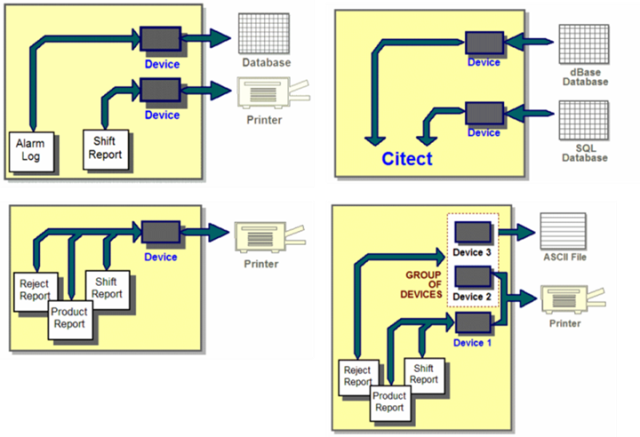

*Рис. Д4.2.1.* Приклади застосувань пристроїв

Один і той самий пристрій може використовуватися в різних діяльностях Citect. При необхідності використання декількох пристроїв для виведення їх групують в групу пристроїв. При роботі з СУБД дані можна не тільки записувати, а й зчитувати. 

При конфігуруванні пристрою вказується тип (рис. Д4.2.2), який можна вибрати з ряду: 

- RTF files; 

- ASCII files; 

- dBASE databases; 

- SQL databases (через ODBC) ; 

- Printers (Принтери). 

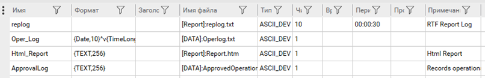

*Рис. Д4.2.2* Налаштування пристроїв

Для файлів в полі імені файлу (File Name; в рос. лок. "Имя файла") задається ім’я файлу. Шлях до директорії можна вказати з використанням параметра. Наприклад, наступний запис вказуватиме на те, що розміщення файлу буде завдатися параметром DATA, який записується в Citect.ini або в налаштуваннях параметра проекту. 

```
[DATA]: ALARMLOG.TXT
```

Для файлів можна вказати також періодичність створення (рос.лок."Периодичность") та кількість історичних файлів (в рос. лок. "Число файлов"). Нові файли будуть створюватися із зазначеною періодичністю відносно часу, вказаного в полі Time (в рос. лок."Время"). Наприклад, якщо кількість файлів задати 10, періодичність 24:00:00, ім’я FileName.TXT, а час 12:00:00, то відбуватиметься така послідовність (рис. Д4.2.3):

1) спочатку записування будуть вестися у файл "FileName.TXT";

2) о 12:00 наступного дня файл буде перейменовано на "FileName.001", після чого створиться новий файл "FileName.TXT", куди буде проводитися записування;

3) у 12:00 3-го дня файл "FileName.001" буде перейменовано на "FileName.002", а файл "FileName.TXT" на "FileName.001", після чого створиться новий файл "FileName.TXT", куди буде проводитися записування; 

4) на 11-й день найстаріший файл буде видалено.  

 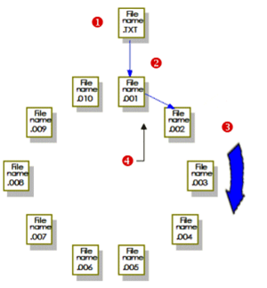

*Рис. Д4.2.3*. Ведення історії файлів

Якщо кількість файлів не вказано, за замовченням береться 10. Кількість фалів можна також задати рівним:

0 – без історії;

-1 - записування в той самий файл.

Для означення формату запису в файл використовуються спеціальні поля, як це робиться для полів тривог. Якщо в тривогах не означений формат для журналу, то буде використовуватися той, який означений для пристрою. Для журналу дій оператора використовуються спеціальні імена полів, які вказані в табл. Д4.2.1. 

*Таблиця Д4.2.1.* Деякі поля для лог-журналів дій оператора (повний перелік див. в довідниковій системі)

| **Поле**          | **Опис**                                                     | **Примітка**                   |
| ----------------- | ------------------------------------------------------------ | ------------------------------ |
| {UserName,n}      | Ім’я користувача                                             |                                |
| {FullName,n}      | Повне Ім’я користувача                                       |                                |
| {Time,n}          | Час формування запису в файлі                                |                                |
| {Date,n}          | Дата формування запису в файлі                               |                                |
| {Page,n}          | Назва сторінки, яка була  відображена, коли відбувався запис |                                |
| {MsgLog,n}        | Повідомлення, яке прописано в  графічному елементі або системній клавіатурній команді, що потребує записування  в журналі дій оператора |                                |
| {Arg1,n}…{Arg8,n} | Набір клавіш натиснутих оператором                           | тільки для клавіатурних команд |

Для ведення ***журналу дій оператора (лог-журнали***) для необхідного графічного елемента або системної клавіатурної команди вказується пристрій, який повинен бути створений заздалегідь (рис. Д4.2.4), а також повідомлення (MsgLog), яке буде заноситися до лог-журналу (рис. Д4.2.5).

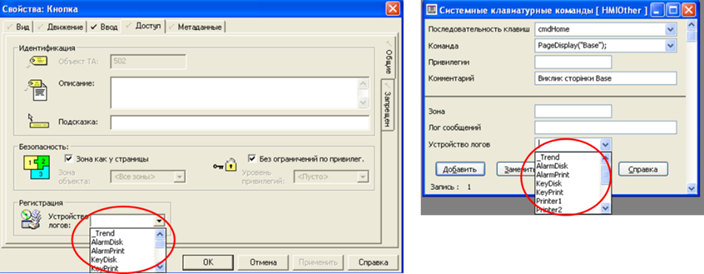

*Рис. Д4.2.4* Вказівка на пристрій для графічного елемента та системної клавіатурної команди 

 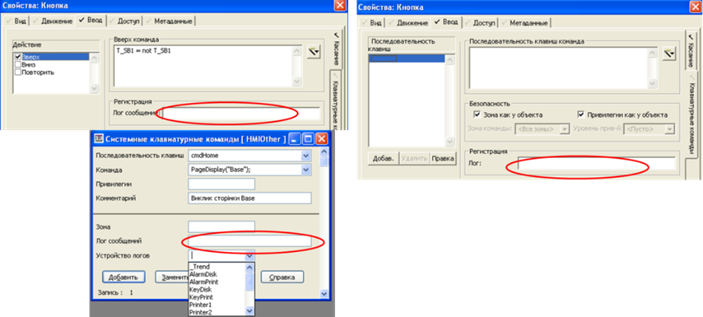

*Рис .Д4.2.5* Вказівка повідомлення, яке буде писатися в пристрій при діях оператора: натисканнях миші по елементу, введення з клавіатури для елемента та на рівні всієї системи

Слід розуміти, що ці події не будуть заноситися в загальний журнал SOE. Для внесення сконфігурованих користувачами подій можна скористатися функцією Cicode "SOEEventAdd".

# Devices

In a Citect SCADA system, a device is used to transfer high-level data such as reports,  command logs or alarm logs. For example, you could use a device to send  the output from a report to a printer, or you could use a device to save your alarm logs to a database. 

  

**Note:** A device is very different to an I/O device. An I/O device allows Citect SCADA to exchange plant floor data with a physical piece of equipment via a  communications cable. If you are looking for information on I/O devices, see I/O Devices

A device can write data to the following:

- RTF files
- ASCII files
- dBASE databases
- SQL databases (through ODBC-compliant drivers)
- Printers (connected to your Citect SCADA computer or network).

You can also read data from the following sources using a device and Cicode functions:

- ASCII files
- dBASE databases
- SQL databases

  

**Note:** You can also use ActiveX data objects (ADO.NET) to create an interface between Citect SCADA and an SQL database. For more information, see Using Structured Query Langauge

You can configure any number of devices in a Citect SCADA system. However, a device can be used as a common resource. This means  you could configure a single device that sends the output of your all  your reports to a printer (when they are requested).

[](file:///C:/Program Files (x86)/AVEVA/Citect SCADA 2018 R2/Bin/Help/Citect SCADA/Content/images/UsingDevices3.png)        

You can also configure device groups. A group of devices allows you to export the same data to two (or more) locations. 


You can read from a devices group, however, data is only read from the first device in the group.

**Note:** The Citect SCADA Include project contains a set of predefined devices. For a description of the devices that are available, see Predefined Devices

### Add a Device

Devices are used to transfer high-level data such as reports, command logs or alarm logs.

**Note:** SQL devices are configured differently to other types of devices. For information, see Configure SQL Devices.

| Property         | Description                                                  |
| ---------------- | ------------------------------------------------------------ |
| **Name**         | The name of the device.                                      |
| **Format**       | Specifies how the  data is formatted in the device. The format is determined by the type of device, and the data that is sent to the device. Enter a value of 120 characters or less. If you are logging alarms or command messages, you need to specify a format, or no data is written to the device. See Command Fields for a list of the fields (or field combinations) you can use to format a command logging device.For a list of the fields you can use to format an alarm logging device, see the following: Alarm display fields, Alarm SOE fields, Alarm summary fields. **Note:** The log device for a command is specified wherever the command is  defined. The log device for an alarm is specified at the Alarm Categories form. When producing reports, the format is ignored. (The format defined for the report is used to write the report to the device.) |
| **Header**       | Additional information for the device. Enter a value of 254 characters or less. |
| **File Name**    | The file name of the device. Enter a value of 253 characters or less. |
| **Type**         | The type of device. Enter a value of 16 characters or less.Device Type Device Description      ASCII_DEV  ASCII file*****     PRINTER_DEV  Printer      DBASE_DEV  dBASE file      SQL_DEV  SQL database             * When defining RTF report properties, an ASCII device would be selected if the report was to be saved as a file. This property is optional. If you do not specify a type, the device **Type** is ASCII_DEV unless:     The file name is a printer device (LPT1: to LPT4: or COM1: to COM4: or a UNC name), where **Type** is PRINTER_DEV, or     The file name extension is .DBF, where **Type** is dBASE_DEV. See [Print Management](file:///C:/Program Files (x86)/AVEVA/Citect SCADA 2018 R2/Bin/Help/Citect SCADA/Content/Print_Management.html). |
| **No. Files**    | The number of history files (see Use Device History Files. Enter a value of 4 characters or less. By default, Citect SCADA creates a single data file for each device. (This data file is called  <filename.TXT> or <filename.DBF>, depending whether the  device is an ASCII device or database device.) The number of history  files you specify here are in addition to the data file.  **Note:** If you do not want history files created, you need to enter 0 (zero)  here, and set the [Device]CreateHistoryFiles parameter to 0; otherwise,  10 history files will be created as a default. You need to also verify  that the data file is of a fixed size. (If the data accumulates, the  file eventually fills the hard disk.) If you specify -1 the data is appended to the end of one file. If you are logging  alarm, keyboard commands, or reports to the device, specify the number  of files to be created, and the time of each file. |
| **Time**         | The time of day to  synchronize the beginning of the history file, in hh:mm:ss  (hours:minutes:seconds). Enter a value of 32 characters or less. If you  accepted the default number of history files above, and you specify a  time and period, 10 history files will be created. If you do not specify a time, the file is synchronized at 0:00:00 (i.e. midnight). If you omit both  the time and the period, additional history files will still be created  (with the default time and period). If you don't want history files to  be created, you need to set the [Device]CreateHistoryFiles parameter to 0 (zero). |
| **Period**       | The period of the  history file, in hh:mm:ss (hours:minutes:seconds). Enter a value of 32  characters or less. Alternatively you can:     Specify a weekly period by entering the day of the week on which to start the  history file, for example Monday, Tuesday, Wednesday, etc.    Specify a monthly period by entering the day of the month on which to start the history file, for example 1st, 2nd, 3rd, 4th, 5th, etc.    Specify a yearly period by entering the day and month on which to start the  history file, for example 1st January, 25th February, etc. The day and  month needs to be separated by a space.If you accepted the default number of history files above, and you specify a time and period, 10 history files will be created. If you do not specify a period, the time field will be ignored and the device 								will assume users will invoke device logging manually. If you omit the time but have specified a period, additional history files will 								still be created (with the default time mid-night at 00:00:00). If you don't 								want history files to be created, you need to set the 								[Device]CreateHistoryFiles parameter to 0 (zero). |
| **Comment**      | Any useful comment.                                          |
| **Cluster Name** | Select a cluster from the list of clusters defined previously with the in the **Topology** activity of Citect Studio.  If this is a single cluster system this field can be left blank. |
| **Process**      | Select the type of  server (or client) on which the process runs that sends data to the  device. This field is used to prevent a history file being created while the device is active. If there is no history processing then this field can be left blank. |

| Property    | Description                           |
| ----------- | ------------------------------------- |
| **Project** | The project that includes the device. |

# Приклади

## Приклад 1 запису в SQL на стороні клієнта

```c
FUNCTION FnWriteToSQL()
	INT hDev; 	//дескриптор пристрою
	ErrSet(1); 	//обробку помилок робить програма користувача   
	
	//відкрити DEVICE з іменем Archive, який буде посилатись на таблицю T2
	hDev=DevOpen("Archive",0); 
	
	IF hDev = -1 THEN //якщо помилка відкриття
		Message("Не вдається відкрити базу даних","Не вдається відкрити базу даних",0);  
		ELSE //якщо помилки немає
		//добавити новий запис в таблицю 
		DevAppend(hDev); 
		
		//записати в поле F21 значення змінної PLC2_F21
		DevSetField(hDev, "F21", RealToStr(PLC2_F21,5,2)); 
		//де F21 – назва колонки в таблиці бази данних 		
		//PLC2_F21 – назва змінної в VijeoCitect, значення якої треба записувати   		

		//записати в поле F22 значення змінної PLC2_F22 	
		DevSetField(hDev, "F22", RealToStr(PLC2_F22,5,2)); 
		//де F22 – назва колонки в таблиці бази данних 		
		//PLC2_F22 – назва змінної в VijeoCitect, значення якої треба записувати  

	END
	DevClose(hDev);
END  

```

## Приклад 2 запису в SQL на стороні клієнта та серверу

Робити в копії проекту Example

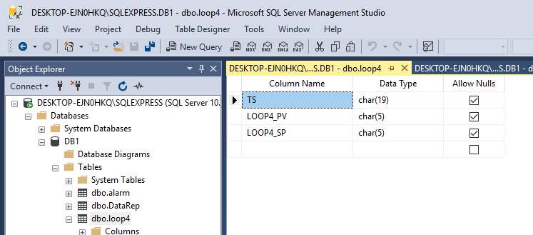

{TS,19}{LOOP4_PV,5}{LOOP4_SP,5}

Driver=SQL Server;Server=DESKTOP-EJN0HKQ\SQLEXPRESS;Database=DB1;UID=G1;PWD=1

DB1.dbo.loop4

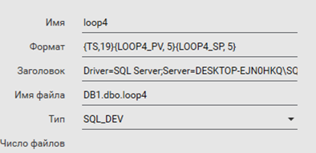

```c
INT
FUNCTION FnWriteToSQL()
	INT ret;
	INT hDev; 	//дескриптор пристрою
	ErrSet(1); 	//обробку помилок робить програма користувача   
	//відкрити DEVICE з іменем Archive, який буде посилатись на таблицю T2
	hDev=DevOpen("loop4",0); 
	IF hDev = -1 THEN //якщо помилка відкриття
		ret = -1; // Не вдається відкрити базу даних
	ELSE //якщо помилки немає
		//записати в поле LOOP_4_PV значення змінної LOOP_4_PV
		DevSetField(hDev, "LOOP4_PV", RealToStr(LOOP_4_PV,5,2,".")); 	
		DevSetField(hDev, "LOOP4_SP", RealToStr(LOOP_4_SP,5,2,"."));
		DevSetField(hDev, "TS", TimestampToStr(LOOP_4_PV.t, 5));
		//добавити новий запис в таблицю 
		DevAppend(hDev); 
		recordcounts = recordcounts + 1; //має бути створена така змінна
		ret = recordcounts; 		 
	END
	DevClose(hDev);
	RETURN ret;
END  
```

Для запису з IO Server добавити подію та прописати її в майстрі на IOServer

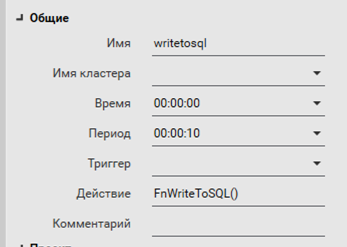  


## Приклад 3 Вибірка даних

Використовується функція CONVERT

```sql
select CONVERT(DATETIME,'07.11.2021 10:37:50', 104);
```

## Приклад 4 Запис в текстовий файл

```c
INT
FUNCTION DevWrite1 (STRING sLine)
    ErrSet(1); ! enable user error checking
    INT hDev = DevOpen("CommandLog", 0);
    IF hDev = -1 THEN
        DspError("Cannot open recipe");
        RETURN FALSE;
    END
    // дізнатися розмір файлу
    INT NoRec = DevSize(hDev);
	//перейти на останній байт в файлі
	DevSeek(hDev,NoRec); 
    DevWriteLn(hDev, Date(10) + " " + sLine );
    DevClose(hDev);
    RETURN TRUE;
END
```


## Приклад 4 Читання з текстового файлу

```c
STRING
FUNCTION GetLastRecord()
	STRING record;
	INT hDev = DevOpen("CommandLog", 0);
	IF hDev = -1 THEN
        RETURN "Cannot open device";
    END
	WHILE NOT DevEOF(hDev) DO
	    record = DevReadLn(hDev);
	END  
	DevClose(hDev);
	RETURN record 
END
```

## Приклад 5 запису Alarm в SQL Device

Налаштування категорії тривоги, важливо вказати поля в SOE

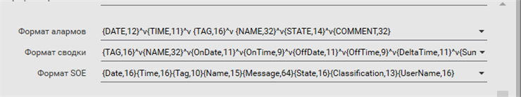

Налаштування пристрою, поля вказати такі саме як в Alarm категорії

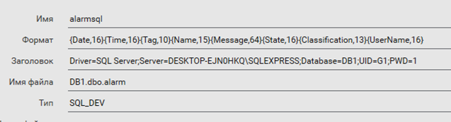


```
{Date,16}{Time,16}{Tag,10}{Name,15}{Message,64}{State,16}{Classification,13}{UserName,16}
```

Створити таблицю SQL запитом

```sql
SET ANSI_NULLS ON
GO

SET QUOTED_IDENTIFIER ON
GO

CREATE TABLE [dbo].[alarm](
	[UID] [timestamp] NOT NULL,
	[DT] [datetime] NOT NULL,
	[Date] [char](16) NULL,
	[Time] [char](16) NULL,
	[Tag] [char](10) NULL,
	[Name] [char](15) NULL,
	[Message] [char](64) NULL,
	[State] [char](16) NULL,
	[Classification] [char](16) NULL,
	[UserName] [char](16) NULL,
 CONSTRAINT [PK_alarm] PRIMARY KEY CLUSTERED 
(
	[UID] ASC
)WITH (PAD_INDEX = OFF, STATISTICS_NORECOMPUTE = OFF, IGNORE_DUP_KEY = OFF, ALLOW_ROW_LOCKS = ON, ALLOW_PAGE_LOCKS = ON) ON [PRIMARY]
) ON [PRIMARY]
GO

ALTER TABLE [dbo].[alarm] ADD  CONSTRAINT [DF_alarm_DT]  DEFAULT (getdate()) FOR [DT]
GO
```

Поле DT для автоматичного формування часу запису та індексується.

Відображення за останні 5 хвилин за допомогою компонента DataBaseExchange 

```sql
SELECT * from alarm where DT>DATEADD (MINUTE, -5, GETDATE())
```

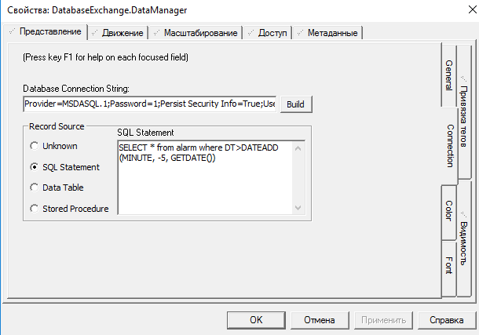

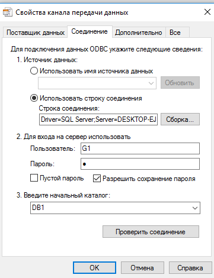

