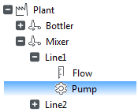
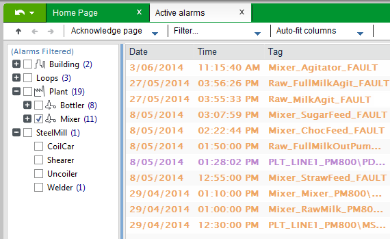
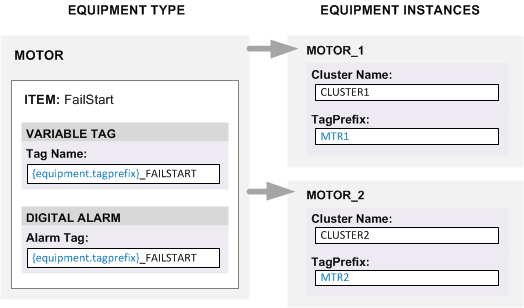
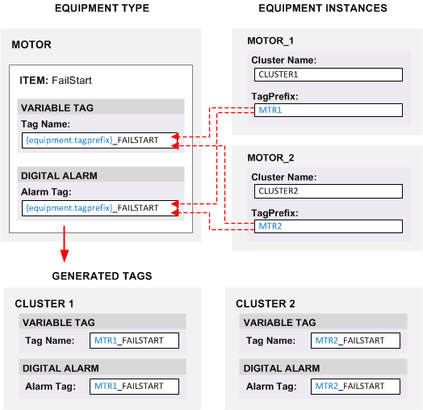
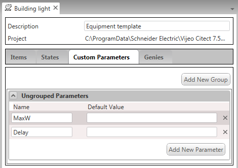
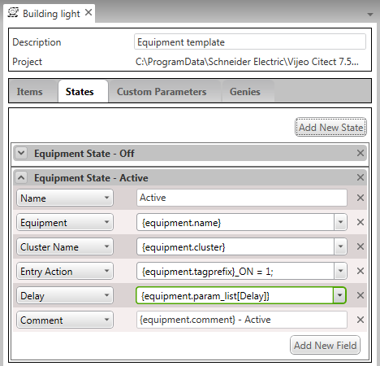
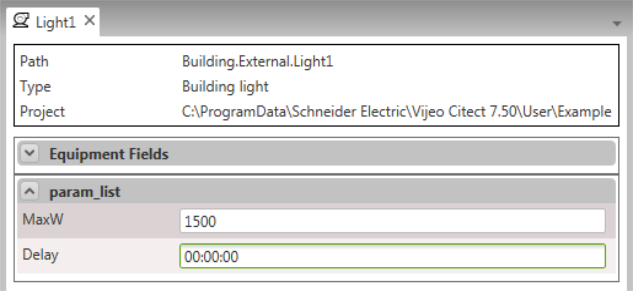
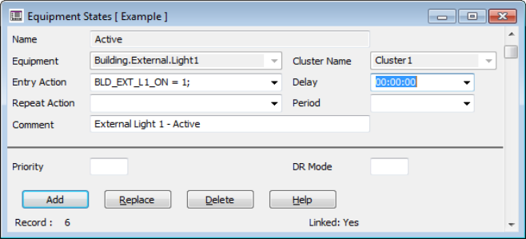
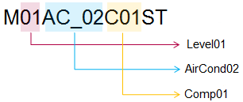

# Equipmet 

## Equipment

In Citect SCADA, the term "equipment" is used to describe an object-oriented  architecture within a project that can be used to reference the  machinery or processes being monitored. Equipment definitions create  logical groupings that allow you to organize your project using a  hierarchical design. Each definition brings together the base SCADA  properties into a single entity that can be easily replicated within  your project. 

For example, if a pump is represented in your  project as a piece of equipment, it will bring together the tags,  events, alarms, permissions, communications, scheduling and scripting associated with the pump. You can associate the pump with a particular geographical area, or include it as part a functional process. 

**Note:** To be able to define equipment, you need to have a Report Server process defined. 

This section of the help explains the concepts that define the way equipment is configured in a Citect SCADA project. These include:

- Equipment Hierarchy — the object model that is created by the equipment definitions in a project
- Equipment Types — the templates you can use to  add multiple instances of a particular piece of equipment to your project 
- Equipment Instances — the representation of a physical piece of equipment in your project that can be based on a particular equipment type
- Equipment States — operational states for a piece of equipment that you can use for scheduling
- Equipment References - the link added between a piece of equipment, and/or items belonging to other equipment  within your project. The equipment reference can  also be to equipment,  and/or items that is outside the equipment  hierarchy. 

We will also discuss the different approaches you can take when defining equipment within a project.

- If you are creating a new  project (or adding a new section to an existing project), use the  Equipment Editor to build an equipment hierarchy and automatically  generate tags from that hierarchy (see The Equipment Editor). For specific, task-based information that describes how to configure equipment in a Citect SCADA project using the Equipment Editor, see Configure Equipment Types using the Equipment Editor. 
- If you would like to add  an equipment hierarchy to an existing project, you can associate your existing variable tags, trends and alarms with equipment in Citect Studio (see Define Equipment Association for an Existing Tag). For specific, task-based information that describes how to configure equipment in Citect Studio, see Configure Equipment in Citect Studio. 

### Equipment Hierarchy

The term "equipment hierarchy" refers to the  object model that is created by the equipment definitions in a project.  When you define an equipment instance, its location in the hierarchy is  reflected in the equipment name with a period (.) used to indicate  levels in the hierarchy. 

For example, the equipment name "Plant.Mixer.Line1.Pump" refers to the selected item in the following equipment hierarchy:

​                    

This type of architecture allows you to  logically reference each piece of equipment based on its location in the object model, which could represent a geographical location or a  functional process. Each piece of equipment becomes a parent to the  items that are associated with it, including variables, trends, alarms,  accumulators, and so on.  

At runtime, the object model hierarchy can be  used to search and display information that is aligned to the process  operational model. 

#### Example

If your project uses Citect SCADA's built-in templates (accessible via a starter project), the equipment  hierarchy is integrated into the project pages. For example, the  equipment hierarchy displays in a panel on pages where a list of  variable tags or alarms is displayed, allowing you to browse, sort and  filter the list. 

The example below shows the equipment hierarchy for the Citect SCADA Example project displayed on the active alarms page. 

​                                    

The integrated object model has been used to filter the alarms by placing a check mark next to the  Mixer branch. This means the list only includes the 11 active alarms  associated with the Mixer. 

### Equipment Types

In a Citect SCADA project, the term "equipment type" refers to a template that you can  use to  associate multiple instances of a particular piece equipment in  your project. 

For example, if you have a motor that is  deployed in numerous locations across a production facility, you could  create an equipment type to act as a template for the motor. This will  bring together many of the configuration settings required to add each  instance of the motor to your project, such as the associated variable  tags, operational states, cluster associations, and so on. 

To then add one of the motors to your project,  you simply create a new instance of the equipment type. This offers the  following benefits:

- Minimal configuration is required to deploy multiple equipment instances 
- Configuration is consistent across multiple equipment instances
- Equipment instances are automatically integrated into the project's equipment hierarchy
- An equipment type  maintains an association with each equipment instance that is created  from it, allowing any changes to be easily applied across an entire  project. 

An equipment type is made up of the following:

- **Items** - used to represent attributes of the physical piece of equipment,  which can include controls, actions, conditions, settings, and so on.  Each item is made up of a set of elements, which can include variable  tags, trends or alarms (see Items)
- **Custom Parameters** - used to define specific values associated with the piece of equipment (see Add Custom Parameters to an Equipment Type)
- **States** - used to define operational states for the associated piece of equipment that you can use for scheduling (see Equipment States)
- **Linked Genie** - specifies a genie that you can use to represent the piece of equipment on your graphics pages (see Link a Genie to an Equipment Type). 

To create equipment types, you use the Equipment Editor (see Using Equipment Editor to Generate Tags). 

Alternatively, you can create your own XML template and add it to your project as an equipment type (see Importing Equipment Using XML Templates).

**Note:** Equipment types are  primarily designed to assist with the creation of new tags. If you would like to define an equipment hierarchy for existing tags, you should use the process described in the topic Define an Equipment Association for an Existing Tag.

### Items

The term "item" is used to  describe a particular attribute of a physical piece of equipment that is represented in an equipment definition. Items can be used to reflect different aspects  of a piece of equipment, such as an associated action, condition or setting. They group the tags associated with equipment in a way that  allows you to reference the particular attribute the item represents. 

When you configure an equipment type, it is defined as a set of items. Each item includes a number of  elements that directly link to the physical device, such as variable  tags, trends or alarms.

#### Example

The Citect SCADA Example project includes an equipment type named "Motor". It includes the following items:

- Running
- Stopped
- Auto
- OutOfService
- Alert
- IntLock
- Start
- Stop
- IntBypass
- Reset
- FailStart
- FailStop

This list demonstrates the different types of attributes you can represent with an item, including operational states  (Running, Stopped), actions (Start, Stop, Reset), alarm conditions  (FailStart, FailStop) and settings (IntBypass).

In each case, the item is made up of a set of  elements (tags, trends and alarms) that enable interaction with the  physical device. 

For example, FailStart includes a variable tag  definition that is associated with the physical motor, and a digital  alarm tag that indicates when an attempt to start the motor has been  unsuccessful. 

**Note:** When naming an Item, there are a number of reserved words that you need to avoid. These  reserved words relate to syntax that is used for tag extensions. They are: 

- field
- valid
- override
- overridemode
- controlmode
- status
- v
- vt
- q
- qt

- t
  If you use one of these reserved words, an error message will display when you compile your project.

### Equipment Instances

The term "equipment instance" refers to an equipment record in a Citect SCADA project. 

When you add an equipment instance to your  project, you specify a location for it within the project's equipment  hierarchy. This is reflected in the complete equipment name (where a  period (.) can be used to indicate levels in the hierarchy). This  location can then be used to refer to the variable tags, alarms and  trends that are associated with the equipment instance. 

An equipment instance contains a set of properties that may be used in the generation of tags, alarms and trends for that instance. These properties can also be used at runtime in conjunction with the equipment browse functions.

Every equipment instance includes a predefined set of properties that are common to all equipment instances (see Define Equipment in Citect Studio).

If an equipment instance has been created using an equipment type as a template, it will include additional properties that reflect the  items and custom parameters specified in the associated equipment type.  Each instance maintains an association with the equipment type from  which it was created, allowing equipment type changes to be instantiated across all related instances. 

To create equipment instances from an equipment type, you use the Equipment Editor (see Using Equipment Editor to Generate Tags). 

**Note:** Equipment does not  need to be associated with an equipment type. This scenario is typical  in projects where equipment associations have been configured for existing variable tags. See Define an Equipment Association for an Existing Tag.

### Equipment States

States are defined in an equipment type to  identify operational conditions for a piece of equipment that you can  use for scheduling.  Each state includes a set of fields that  reflect the associated Equipment State properties. These fields identify the entry action that is performed when a state transition occurs, and  any other settings that may apply while the state is active such as  delays and repeat actions. 

If you intend to use Equipment Editor to generate new tags, you can create states for an equipment type (see Add a State to an Equipment Type). Alternatively, you can manually define equipment states.

### Equipment References

Equipment references define an association  between two pieces of equipment or items on equipment. They create relationships in your equipment definitions that extend beyond those  that occur intrinsically within the equipment hierarchy. Using equipment reference browse functions, you can  track, group and display information for equipment and its referenced equipment in one interface at runtime. 

For example, you could create a pop up for a pump that monitors the following:

- The flow of the pump.
-  The pump's power and energy usage.
- The pump's running status.

When an anomaly is identified on the pump,  the operator may  need to look at other pieces of equipment to determine the cause. This could include the following:

- The low level alarm on the sump from which the pump is pumping.
- The level of the tank that the pump is filling.
- The position of the inlet and drain valves.

You can add multiple equipment references  from the pump to these associated pieces of equipment. For example, you  could create an equipment reference from the pump to the alarm on the  source sump. At runtime, when the operator is viewing the information  for this pump, they will be able to view the status of the low-level  alarm on the sump as well. 

Equipment references are defined in the **Equipment** view of the **System Model** activity. See Define Equipment References for more information.

You can use equipment references to configure interlocks in a Situational Awareness Project. See Interlocks for more information.

## Equipment Editor

Equipment Editor  is a tool designed to generate tags in a Citect SCADA project that adhere to an equipment hierarchy. To open the Equipment Editor:

1. In the **System Model** activity, select  **Equipment**.
2. On the Command Bar, click **Equipment Editor**.

The Equipment Editor interface includes two different views:

- Equipment Types
- Equipment.

These two views are accessible via the tabs along the left edge of the Equipment Editor window, or via the **View** menu. The View menu also includes a command to **Refresh** the Equipment Editor interface.

You can work with equipment in three easy steps:

1. Create equipment types. The items you include will define the tags, alarms and trends required to support each associated equipment instance.
2. Create equipment instances. The location of an instance in the  equipment hierarchy and its field values provide the information  required to create the tags, alarms, trends and states defined in the  associated equipment type.
3. Run an equipment update. This generates the related configuration records required to support each equipment instance.

The Equipment Editor also supports the following functionality:

- Equipment Property Referencing — syntax you can use to pass property values from an equipment instance to an equipment type
- Custom Parameters — named placeholders that allow you to identify and associate values with a piece of equipment.

You can also use the Equipment Editor to Link a Genie to an Equipment Type.

#### Equipment Updates

An equipment update generates the configuration records associated with the equipment instances defined in the  Equipment Editor. The records that are generated for each equipment  instance are specified by the items and states defined in the associated equipment type.

**Note:** When you perform an  equipment update, any numeric values in your project need to be in a  format that matches the current system locale setting. For example, a  decimal separator needs to be a comma (,) on systems using French,  Russian or Turkish. For this reason, you are not able to run an equipment update for the Example project on some non-English locales. 

By default, Citect SCADA will perform an incremental equipment update that only includes equipment and equipment types that have been modified since the last update occurred.

If you disable incremental updates, Citect SCADA will regenerate every tag associated with the equipment hierarchy each time an update is run.

To disable incremental equipment updates:

1. In Citect Studio, select **Options** from the Activity Bar. The Options dialog will appear.
2. Locate Incremental equipment update on the Options dialog and clear its check box.
3. Click **OK**.

**Note:** If you deselect the  Incremental equipment update program option, an equipment update will  take more time to complete. The time required to complete an update may increase significantly if a project includes a large equipment hierarchy.

#### Equipment Property Referencing

Equipment property referencing allows you to pass equipment property values from an equipment instance to an equipment type. This information is then used to generate the tags,  alarms, trends and states associated with the items defined in the  equipment type.

To refer to a particular equipment property you use the following format:

`{equipment.<equipment property>}`

Where `<equipment property>` is the name of the property that is being referenced. Be aware that any spaces and  non-alphanumeric characters are removed from the field name (for  example, the "I/O Device" field is referenced with  "{equipment.iodevice}". 

Equipment property referencing is used in the Equipment Editor (see Use Equipment Editor to Generate Tags). 

The following diagram shows two equipment  instances ("Motor_1" and "Motor_2") based on the "Motor" equipment type. In each instance, the values defined for the **Cluster Name** and **TagPrefix** properties are displayed. 

​                    

The equipment type includes an item named  "FailStart" that has a variable tag and a digital alarm defined as  elements. In both cases, the equipment property reference  "{equipment.tagprefix}_FAILSTART" is used to define the name of the  associated tags.

In the two equipment instances, the Tag Prefix  property has been set to "MTR1" and "MTR2" respectively. When an  equipment update occurs, these values are applied to equipment type,  causing the tags displayed below to be generated. 

​                    

These tags are automatically added to the  project and linked to the associated equipment instance. Each equipment  instance maintains an association with each equipment type from which it was created, allowing changes to be applied across your project. 

#### Custom Parameters

Custom parameters can be added to an equipment type to include information that is specific to an equipment instance and  the equipment it represents (such as a set point or delay setting). 

When you add a custom parameter to an equipment type, it creates a named placeholder that is included as a field in  each associated equipment instance. Parameters can be grouped together  to provide context, or added individually as ungrouped parameters. 

Custom parameters support equipment property referencing.  You can also specify a default value that is used as the initial value for a parameters when a new instance is created. 

To create custom parameters for an equipment type, use the Equipment Editor (see Use Equipment Editor to Generate Tags).

**Note:** The custom parameters for an equipment instance are saved to the **Parameters** field in the associated Equipment properties. Due to a maximum field  length of 254 characters, you are limited in how many parameters you can include. A notification is displayed (when saving) in the status area  of the application if the combined length of the parameters (and a  minimum space for their values) exceeds this field length.

The Citect SCADA Example project includes an equipment type named "Building Light" that has two parameters defined:

- MaxW
- Delay

​                    

An equipment state called "Active" is also configured for the equipment type. It includes a field called **Delay** that references the Delay parameter.

​                    

Observe that the equipment property reference in the **Delay** field uses the following syntax: 

`{equipment.param_list[Delay]}`

When the value is set for the Delay parameter in an associated equipment instance it is applied to the Delay property  when the equipment state is generated. 

Consider the following equipment instance (defined as "Building.External.Light1").

​                    

This will result in the creation of the following equipment state (with the Delay property set to "00:00:00").

​                    


## Configure Equipment Types Using the Equipment Editor

## Configure Equipment Instances

## Configure Equipment in Citect Studio

### Configure Equipment in Citect Studio

The way you configure equipment in Citect SCADA will initially depend on whether or not your project has existing tags. If you have a project with existing tags, you can use Citect Studio to associate equipment with your tags (see Define an Equipment Association for Existing Tags).

Equipment can be configured in the System Model activity of Citect Studio.

**Note**: If you are starting a new project (or adding a new area or process to an existing project)  you can use the Equipment Editor to generate tags (see Configure Equipment Using Equipment Editor).

#### Associate Existing Tags with an Equipment Hierarchy

Citect SCADA allows you to build an equipment hierarchy into a project that is already configured to include tags, alarms, trends, and so on.  When you build an equipment hierarchy into an existing system, you create a way to reference your tags using  logical groupings that may reflect geographical areas or functional  processes. 

Associating equipment with tags in an existing project is a two-step process:

1. Define the required equipment. To achieve this, add rows to the **Equipment** list in the **System Model** activity (see Define Equipment in Citect Studio).
2. Associate tags with the equipment you've defined. To achieve this, you set the Equipment property for a tag in the **System Model** activity (see Define an Equipment Association for a Tag).

You can also define equipment associations for your tags directly in the project database using Microsoft Excel™   (see Use the Project DBF Add-In to Define Equipment Associations).

#### Define Equipment in Citect Studio

You can manually add equipment definitions to a Citect SCADA project that adhere to an[equipment hierarchy. 

The hierarchy is created from the names you  apply to the equipment you define. If you include a period (.) in a  name, it specifies a hierarchy level. You can then use this hierarchy as a way to reference the tags in your project using logical equipment  groupings (see Define an Equipment Association with an Existing Tag).

To  link equipment to equipment and equipment.items outside the equipment hierarchy, you can create equipment references (see Define Equipment References).

**Note:** If you are adding equipment to an existing project, it is recommended that you leave the **Type** field blank. An equipment type is primarily used to generate new tags from Equipment Editor, and this is not required if your tags already  exist. If you want to define equipment that is associated with an  equipment type, you should use the Equipment Editor instead of Citect Studio(see Use Equipment Editor to Configure Equipment Instances).

To manually define equipment:

1. In the **System Model** activity, select **Equipment**. 
2. On the menu below the Command Bar, select **Model**. 
3. The  list of equipment definitions will display in the Grid Editor. 

4. Add a row to the Grid Editor. 
5. Type the required information in each column, or in the Property Grid (see below for a description of the properties).                            
6. Click **Save**. 

The equipment you have defined will now available to associate with the existing tags in your project (see Define an Equipment Association for a Tag). You can also Define Equipment States for the equipment to support scheduling.

##### Equipment Properties

| Property         | Description                                                  |
| ---------------- | ------------------------------------------------------------ |
| **Name**         | The name of the  equipment. This can be a name that represents a single piece of  equipment, or a name that also reflects the location of the equipment  within an equipment hierarchy (where a period (.) is used to indicate levels in the hierarchy).The length of the  complete name for the equipment is recommended to be less than 128  characters. The maximum length is 254 chars, however, long names can be  harder to use within configuration expressions and Cicode. When naming equipment the following rules apply:<br /> • Equipment names need to be unique within the same cluster. <br />• Equipment names cannot be the same as alarm tag names. <br />• A period (.) may be used in equipment name to specify equipment hierarchy levels, for example: `Plant1.Filling.Tank1`. <br />• Each period delimiter denotes an extra level in the equipment hierarchy.<br /> • Up to 14 hierarchy levels are supported. The name applied to  each hierarchy level may not  exceed 63  characters. <br />• Individual names (delimited by a period) within an equipment path need to follow tag name syntax.  For example, characters such as '%', '?' and '/' are not allowed. <br />• The name of root level equipment may not be the same as any cluster names. <br />• The name of the root level equipment  may not be a reserved word, such as IF, FOR, WHILE, END,  OR,  or AND. |
| **Display Name** | A meaningful name for the equipment that can be used at runtime to easily identify it. Enter a value of 254 characters or less. |
| **Cluster Name** | The name of the  cluster to which the equipment is assigned. The specified cluster should be configured otherwise a compile will not be successful. If no cluster name is set, the equipment will run on every cluster. |
| **Type**         | The specific type of equipment in the system. This drop down box is populated from the types database created by the Equipment Types form. |
| **Location**     | A string describing the location of the equipment. Enter a value of 254 characters or less. |
| **Page**         | The name of the page on which this equipment appears. Enter a value of 254 characters or less. This enables an operator to navigate directly to the page that hosts the piece of  equipment. If the graphic object appears on more than one page, the page specified here should represent its primary operational context. Where duplicated variations of a page exist to suit HD1080 and UHD4K screen resolutions,  the page that is used is determined by the resolution of the host  workspace. This means you do not need to add the suffix "_HD1080" or  "_UHD4K" to the end of a name to specify a particular page. For more  information, see Configure a Project that Supports Multiple Screen Resolutions. |
| **Content**      | A comma-separated list that names the content associated with the piece of equipment. This can include pages, faceplates and documents. For example: `Area1_Page_L1, Process1_Page_L2, Pump_Faceplate_FP` This content will be available at runtime when the equipment comes into context. Where duplicated  variations of a faceplate or page exist to suit HD1080 and UHD4K screen  resolutions, the content that is called is determined by the resolution  of the host workspace. This means you do not need to add the suffix  "_HD1080" or "_UHD4K" to the end of a  name. For more information, see Configure a Project that Supports Multiple Screen Resolutions. |
| **Help**         | The help context string.  Enter a value of 254 characters or less. |
| **Comment**      | Any useful comment. Enter a value of 254 characters or less. |
| **Parameters**   | A list of parameters that are defined in Equipment Editor as Custom Parameters in an associated equipment type. This is a property list separated by semi-colon characters. For example:`MyProp1=abc; MyProp2=def; MyProp3=123`. This field is not available at runtime. |
| **Tag Prefix**   | Designed to store a prefix that can be applied to the tags generated for the equipment  instance. It can be used at runtime to find tags associated with the  equipment. |
| **I/O Device**   | The I/O device used to communicate with this piece of equipment. Specify redundant devices  with a comma between primary and standby, for example, "IODev1,IODev2".  Enter a value of 254 characters or less. |
| **Hidden**       | When set to true the Equipment will not be visible in the Equipment Tree at runtime. **Note**: The functionality of the Equipment does not change and will continue to function as configured. |

**Security Properties**

| Property | Description                                                  |
| -------- | ------------------------------------------------------------ |
| **Area** | The area number or  label to which this equipment belongs. Only users with access to this  area (and any necessary privileges) will be able to perform operations  on the equipment. For example, if you enter Area 1 here, operators need  to have access to Area 1 (plus any necessary privileges) to perform  operations on the equipment. Enter a value of 16 characters or less. |

**Custom Properties**

| Property               | Description                                                  |
| ---------------------- | ------------------------------------------------------------ |
| **Custom1 .. Custom8** | User-defined  strings that can be used for filtering equipment when using the Cicode  search functions (maximum 254  characters each). |

**Scheduling Properties**

| Property                                                     | Description                                                  |
| ------------------------------------------------------------ | ------------------------------------------------------------ |
| The following fields, **Default State** and **Scheduled**, are used  when configuring schedules for equipment (see Configure Equipment for Scheduling). |                                                              |
| **Default State**                                            | The default state applied to the equipment.                  |
| **Scheduled**                                                | Specifies if the equipment is included in any scheduled actions. The options are "TRUE" or "FALSE".The following fields, **Schedule ID** and **Device Schedule**, are only required when using a schedule configured locally on a BACnet device (see Integrate BACnet Schedules into Scheduler). They require the **Scheduled** property to be set to "TRUE". |
| **Schedule ID**                                              | The ID used to identify the required schedule on the BACnet device. This field is only required if the **Device Schedule** property is set to "TRUE". |
| **Device Schedule**                                          | Specifies whether  or not the report server should retrieve the required schedule from the  BACnet device. The options are "TRUE" or "FALSE". |

**Project Properties**

| Property    | Description                                            |
| ----------- | ------------------------------------------------------ |
| **Project** | The project in which the equipment type is configured. |

**Note:** Advanced users can  use the Project DBF plug-in for Microsoft Excel to edit and save records directly in the EQUIP.DBF file (see Use the Project DBF Add-In to Define Equipment Associations).        

#### Define Equipment Types in Citect Studio

You can manually add equipment types to a Citect SCADA project. You would typically do this to incorporate an external XML template for an equipment type (see Importing Equipment Using XML Templates). 

To manually define an equipment type:

1. In the System Model activity, select **Equipment**. 
2. On the menu below the Command Bar, select **Types**. 
3. The  list of equipment types will display in the Grid Editor. 

4. Add a row to the Grid Editor. 
5. Type the required information in each column, or in the Property Grid.
6. Click **Save**. 

**Note:** You can also use the Equipment Editor to create equipment types. These equipment type definitions will appear in the equipment type list alongside those you  create manually. See Using Equipment Editor to Generate Tags.

##### Equipment Type Properties

**General Properties**

| Property     | Description                                                  |
| ------------ | ------------------------------------------------------------ |
| **Name**     | A name that  reflects the physical piece of equipment the equipment type represents,  such as "pump", "light" or "valve". Enter a value of 254 characters or  less. The names in this field populate the Type drop down in Equipment Properties (see Define Equipment in Citect Studio. |
| **Template** | The file name for the XML template that defines the equipment type.  Enter a value of 254 characters or less. If the equipment  type was created using Equipment Editor, this file will have the same  name as the equipment type (with the .xml extension). See Using Equipment Editor to Generate Tags). If you are using an externally created equipment XML template, enter the file name here to  associate it with the equipment type (see Importing Equipment Using XML Templates  for more information). |
| **Comment**  | Any useful comment. Enter a value of 254 characters or less. |

**Project Properties**

| Property    | Description                                            |
| ----------- | ------------------------------------------------------ |
| **Project** | The project in which the equipment type is configured. |

#### Define Equipment States in Citect Studio

You can manually add equipment states to a Citect SCADA project and associate them with your equipment definitions. To manually define an equipment state:

1. In the System Model activity, select **Equipment**. 
2. On the menu below the Command Bar, select **States**. 
3. The  list of equipment states will display in the Grid Editor. 

4. Add a row to the Grid Editor. 
5. Type the required information in each column, or in the Property Grid (see below for a description of the properties).                            
6. Click **Save**. 

##### Equipment State Properties

**General Properties**

| Property         | Description                                                  |
| ---------------- | ------------------------------------------------------------ |
| **Name**         | Name of the State.  Usually this would be an 'action' the equipment could be scheduled to do. For example, a light could have the action 'on' or 'active' defined. |
| **Cluster Name** | The name of the cluster to which this State will belong.     |
| **Equipment**    | The equipment associated with this state. For example: `Factory.Floor.Line1.Light1`. See Equipment. Equipment should be an existing item on the selected cluster. |

**Actions Properties** 

| Property          | Description                                                  |
| ----------------- | ------------------------------------------------------------ |
| **Entry Action**  | The action the  State will take when  triggered. For example  the entry action for light 1 could be `tag_light1=1`. When light 1 is scheduled, this will trigger  the light to turn on. The Entry Action can be a Cicode expression.    <br />**Note:** You should not enter a Cicode function that relates to a graphics page in  this field, as this type of function will only execute successfully on a display client.     <br />Be aware that  long actions on this field may delay or prevent other scheduled actions  from running. For example, if there is "action1" for startup and  "action2" for repeat, if "action1" is an infinite loop, "action2" will  be prevented from running. If "action2" takes a long time to complete, no new "action2" actions will run until the former finishes.  If you  need to run a long task, create an independent Cicode task using TaskNew() function. |
| **Delay**         | The time that needs to elapse before the state will initially become active. If delay is  defined the Entry Action for the state will not occur until the delay  period has elapsed. For example; this would allow you to turn on every  light sequentially to avoid a power spike. |
| **Repeat Action** | An action set to run periodically when state is active.  Repeat Actions  can  be a Cicode expression.    <br />**Note:** You should not enter a Cicode function that relates to a graphics page in  this field, as this type of function will only execute successfully on a display client.      <br />Be aware that  long actions on this field may delay or prevent other scheduled actions  from running.  For example, if there is "action1" for startup and  "action2" for repeat, if "action1" is an infinite loop, "action2" will  be prevented from running. If "action2" takes a long time to complete,   no new "action2" actions will run until the former finishes.  If you  need to run a long task, create an independent Cicode task using  TaskNew() function. |
| **Period**        | Sets the frequency of the 'Repeat Action'. For example set the repeat action to occur every hour.    <br />**Note**: The repeat period will not start until the entry action has completed.  <br />The first repeat action will occur after the entry action completes plus one repeat time period. For example,  if the Entry Action takes ten  minutes to complete, the Repeat Action will not start until after ten  minutes even though the Repeat Action is set to occur every two minutes. |
| **Priority**      | Number used to determine which schedule entry will run if a schedule conflict occurs between more than one state. |
| **Comment**       | Any useful comment.                                          |
| **DR Mode**       | Demand and Response (DR) mode (see Configure a Demand and Response Solution). The default DR mode value is 0. |

**Project Properties**

| Property    | Description                                             |
| ----------- | ------------------------------------------------------- |
| **Project** | The project in which the equipment state is configured. |

**Note**: Updates made to the fields on Equipment States will come into effect at runtime once the project is compiled and reloaded. 

**Note**: If the report server is run in single process mode and no user is logged in, all tag writes  attempted by the scheduler when actions are run will not succeed.  We  recommend running the report server(s) in multi-process mode to avoid  this issue (the server user will be logged in), or setting the citect.ini parameter [Client]AutoLoginMode to either 2 or 6 to insure a user is always logged in.

#### Define Equipment References

You can  add equipment references to a Citect SCADA project. See Equipment References for more information.

To manually define an equipment reference:

1. In the System Model activity, select **Equipment**. 
2. On the menu below the Command Bar, select **References**. 
3. The  list of equipment references will display in the Grid Editor. 

4. Add a row to the Grid Editor. 
5.    Type the required information in each column, or in the Property Grid (see below for a description of the properties). 
6. Click **Save**. 

##### Equipment Reference Properties

**General Properties**

| Property                 | Description                                                  |
| ------------------------ | ------------------------------------------------------------ |
| **Cluster**              | The name of the cluster to which the equipment is assigned.  |
| **Equipment**            | The name of the main piece of Equipment to which referenced equipment is linked from. |
| **Referenced Cluster**   | The name of the cluster to which the referenced equipment is assigned. |
| **Referenced Equipment** | The name of the Equipment that you want to reference (link to). |
| **Referenced Item**      | The name of the  item belonging to the "referenced" Equipment. If the Item is listed only that referenced item will be returned using EquipRefBrowse functions.  If this field is left blank items belonging to the referenced equipment  will be available. |
| **Category**             | A category that will be used to filter equipment references using EquipRefBrowse  functions. You can use any separator between filter strings. For  example, "Equipment.MT", "Equipment-MT" and "Equipment:MT" are all  valid. If you are configuring an interlock, the Situational Awareness Starter Project provides the following categories (see Information Zone - Interlocks for definitions):     `Interlock.Process`, `Interlock.Safety`,`Interlock.Permissive`. Enter the whole name of the category type (for example, "Interlock.Pocess"). |
| **Order**                | A unique index per reference category that will be used in the ordering for the EquipRefBrowse functions. |
| **Association**          | Controls the name of the association  used in the AssEquipReferences Cicode function. For each reference, a  super-genie association is created which uses the name specified in the  Association column.<br /> **Note**: Association names are  also passed into the `meo_selector_xx` genie instances on faceplates e.g `?MEO2?`. See Configure Equipment Selection for Group Objects for more information. |
| **Comment**              | Any useful comment. Enter a value of 254 characters or less. |

**Custom Properties**

| Property               | Description                                                  |
| ---------------------- | ------------------------------------------------------------ |
| **Custom1 .. Custom8** | User-defined  strings that can be used for filtering equipment when using the  EquipRefBrowse functions (maximum 254  characters each). |

**Project Properties**

| Property    | Description     |
| ----------- | --------------- |
| **Project** | Name of project |

#### Define Equipment Runtime Parameters

Equipment runtime parameters are a set of  parameters that are passed into content pages as associations. For  example, a sub-page with a faceplate that displays information for  multiple pieces of equipment. 

**Note**: Equipment runtime parameters can be used with the AssEquipParameters and EquipGetParameter Cicode functions.

You can manually add equipment runtime parameters to a Citect SCADA project.

To define an equipment runtime parameter:

1. In the System Model activity, select **Equipment**. 
2. On the menu below the Command Bar, select **Runtime Parameters**. 
3. The  list of equipment runtime parameters will display in the Grid Editor. 
4. Add a row to the Grid Editor. 
5.    Type the required information in each column, or in the Property Grid (see below for a description of the properties). 
6. Click **Save**. 

##### Equipment Runtime Parameter Properties

**General Properties**

| Property      | Description                                                  |
| ------------- | ------------------------------------------------------------ |
| **Cluster**   | The name of the cluster to which the equipment is assigned.  |
| **Equipment** | The equipment associated with this runtime parameter. For example: "Factory.Floor.Line1.Light1". See Equipment. Equipment should be an existing item on the selected cluster. |
| **Name**      | A name for the parameter. Enter a value of 254 characters or less. |
| **Value**     | Value assigned to the parameter. This could be a value or a tag name. |
| **Is Tag**    | By default, this is TRUE. If the  value is set to a tag name, the tag value will be evaluated as such. Set this to FALSE if you have set a value manually instead of specifying a  tag name. <br />**Note**: If this is a tag name it can be used in conjunction with the Cicode function AssEquipParameters to pass those tags as Super Genie associations. |
| **Comment**   | Any useful comment. Enter a value of 254 characters or less. |

**Project Properties**

| Property    | Description                                                  |
| ----------- | ------------------------------------------------------------ |
| **Project** | The project in which the equipment runtime parameter is configured. |

#### Define an Equipment Association for a Tag 

You define equipment in a Citect SCADA project to create logical groupings that reflect the machinery or  processes being monitored. When you specify an equipment association for a tag, you are simply adding the tag to one of the equipment groups you have defined. 

This allows you to use a project's equipment hierarchy as a way to reference your tags.

You can associate equipment with the following tag types:

- Advanced alarms
- Analog alarms
- Multi-digital alarms
- Digital alarms
- Time stamped alarms
- Time stamped analog alarms
- Time stamped digital alarms
- Variable tags
- Trend tags
- SPC tags
- Accumulators

To specify an equipment association for a tag:

1. Locate the tag record that you would like to update. 
2. In the **Equipment** field, enter the name of the equipment with which you would like to associate the tag. 
3. You  can select the required equipment name from the drop-down menu. The list includes the current equipment definitions. 

4. If required, specify a **Cluster** for the tag. This is only useful if the associated equipment is defined for every cluster and you want to specify a specific cluster for this  particular tag. 
5. Click  **Save** to update the tag with your changes.

If required, you can use Citect SCADA's Project DBF Add-In tool to define equipment associations for the tags  in your project. This could be particularly useful if your project  adheres to an tag naming convention that could be adopted as the basis  of an equipment hierarchy (see Use the Project DBF Add-In to Define Equipment Associations). 

**Example**

You may have a project with  tags that comply with a maintenance naming code. A typical tag name may  be `M01AC_02C01ST`. Using the naming code as a reference, it is possible to determine that this tag monitors the running status of a compressor  on air conditioner 2 on level 1. 

​                                    

This demonstrates how an  existing naming convention may be used as the framework for an equipment hierarchy. For example, you could associate the following equipment  definition with the tag described above (and any others that apply to  the same compressor):

`Level01.AirCond02.Comp01`

This would allow you to keep  your site-based maintenance IDs while also providing a way to work with  the data points using a logical, hierarchical structure.

#### Update Equipment

When you run an equipment update, Citect SCADA generates the tags associated with the equipment hierarchy and adds them to your project. 

To run an equipment update from Citect Studio:

1. In the **System Model** activity, select **Equipment**.
2. Select **Update Equipment** from the Command Bar. 

By default, Citect SCADA will perform an incremental equipment update that only includes  equipment and equipment types that have been modified since the last  update occurred.

If you disable incremental updates, Citect SCADA will regenerate every tag associated with the equipment hierarchy each time an update is run.

To disable incremental equipment updates:

1. On the Activity Bar, select **Options**. The Options dialog will appear. 
2. Locate **Incremental equipment update** on the Options dialog and clear its check box.

**Note:** If you deselect the **Incremental equipment update** program option, an equipment update will take more time to complete.  The time required to complete an update may increase significantly if a  project includes a large equipment hierarchy. 

#### Use the Project DBF Add-In to Define Equipment Associations  

You can use Citect SCADA's Project DBF Add-In to edit equipment associations directly in a  project's database tables using Microsoft Excel™. This may allow you to rapidly deploy an equipment hierarchy for an existing project,  particularly if your tags adhere to a naming convention that replicates a hierarchical architecture.

The Project DBF Add-In operates from within  Excel. It connects you to the `MASTER.DBF` file for a selected project,  and provides access to a list of included tables (see Using Microsoft Excel to Edit .dbf Tables). 

To use the Project DBF Add-In to edit your equipment associations:

1.  You will firstly need to define the equipment required to support your tags. 

2. **Note:** The **Type** and **Prefix** properties (or columns) are not required when configuring equipment for an existing project as they are only used when generating records in Equipment Editor.

3. You then need to open the table for a particular tag type to associate the **Equipment** property with one of your equipment definitions. The following tables include the Equipment column:

4. - Advanced alarms
   - Analog alarms
   - Multi-digital alarms
   - Digital alarms
   - Time stamped alarms
   - Time stamped analog alarms
   - Time stamped digital alarms
   - Variable tags
   - Trend tags
   - SPC tags
   - Accumulators

5. Save your changes. 

The compiler will check the existence of the equipment you have referenced and will generate an error message if required.

#### Import Equipment Using XML Templates

Equipment tags can be created by importing them in much the same way as tags can be imported using TagGen. An XML template is used to specify the fields of input and output  databases, and define filters and transformation rules that create tags  from existing database fields.

Equipment XML templates are configuration files that are linked with equipment types that you create (see Manually Define Equipment Types). Each equipment type can has an associated template file specified.

The Update Equipment tool (accessible via the Command Bar when **Equipment** is selected in the **System Model** activity) processes the template for each piece of equipment to manage the  associated configuration records. When updating the equipment  configuration, the associated records are updated by modifying, adding  or deleting as required. 

For example, a set of associated records defined by the template may consist of a set of variable tags, alarms  and trends. When an equipment record is added, the update tool will  create the associated records. If the template is modified, the update  tool will modify the associated records. If the equipment record is  deleted, the update tool will delete the associated records.

[читати далі](equipmetxmltemplate.md)

# Equipmet Cicode Functions

### EquipGetProperty

This function reads a property of an equipment database record from the EQUIP.RDB database file.

This function is a blocking function. It blocks the calling Cicode task until the operation is complete.

Syntax

```
STRING EquipGetProperty(STRING Name, STRING Field, INT Mode, STRING Cluster)
```

*Name:* The name of the equipment from which to get information. The name of the equipment can be prefixed by the name of the cluster that is "ClusterName.Equipment".

*Field:* The field to read. Supported fields are:

Name, Cluster, Type, Area,  Location, IODevice, Page, Parent, Composite, Help, Comment, Alias,  Content, Hidden, Custom1, Custom2, Custom3, Custom4, Custom5, Custom6,  Custom7, Custom8. Defstate, Scheduled

- *Name* - The name of the equipment (254 characters).

- *Cluster* - The cluster to which the equipment belongs (16 characters).

- *Type* - The equipment-specific type of device (254 characters).

- *Area* - Area number (integer) (16 characters).

- *Location* - Equipment specific field (254 characters).

- *IODevice* - I/O Device name(s) (254 characters).

- *Page* - Page name (254 characters).

- *Parent* - The name of the parent equipment derived from the name of the equipment (maximum 254 characters).

- *Help* - Help context (254 characters).

- *Comment* - User comment (254 characters).

- *Custom1..8* - User definable fields (254 characters each).

- *Composite* - The equipment specific composite name (maximum 254 characters).

- *Defstate* - The default state.

- *Scheduled* - Specifies if the equipment participates in a schedule.

- *Alias*- Meaningful name of equipment (254 characters).

- *Content* - Workspace content associated with equipment instance.

- *Hidden* - Hide from equipment tree at runtime.

Runtime fields:

- *MODE* - (the current mode of the equipment) 0 - automatic; 1- Manual Inherited; 2- Manual.

- *DRMODE* - (the current DR mode level  for the equipment). The value will be a positive integer to represent  the current DR level or zero if inactive.

- *STATE* - (the current state of the  equipment. Although you can only set state for equipment in Override  mode, it is still possible to get state for equipment in normal and  inherited override mode.)

*Mode:*

*0* (Block - values are retrieved from the report server, the value will also be stored in local memory cache)

*1* (Cache – values are first retrieved from local memory cache, if the property is missing from the memory  cache, a request will be sent to the report server and the result will  then be cached. If the property is missing from the memory cache or if a previous request is in progress, an empty string will be returned.)

*2* (Local - values are retrieved from  the local RDB, an error will be returned when trying to get the  scheduler engine field in local mode)

*3* (CacheThenLocal – values are first  retrieved from local memory cache, if the property is missing from the  memory cache, a request will be sent to the report server and the result will then be cached. If the property is missing from the memory cache  or if a previous request is in progress, the local RDB will be accessed  to retrieve the property value.)

**Note**: Mode 1 and 3 will access the  report server at least once, there will be a once off performance  penalty on the report server, operating in this mode will always  guarantee equipment properties being the latest. Mode 2 will be the  fastest but cannot guarantee equipment been up-to-date [See Client Side  Online Changes]. Mode 0 will be the slowest as each request is sent  across the wire and the function will block until the report server  responds.

*Cluster* - The name of the cluster (optional for a single cluster system)

Return Value

The value of the specified field as a string.  An empty string may or may not be an indication that an error has been  detected. The last [error-----------Citect SCADA/Subsystems/CicodeReferenceCitectHTML/Content/Cicode_Errors.html) should be checked in this instance to determine if an error has actually occurred.

### EquipSetProperty

The EquipSetProperty function sets the property of an item of equipment.  This function is a blocking function. It blocks the calling Cicode task until the operation is complete.

Syntax

```
INT EquipSetProperty(STRING Name, STRING Field, STRING Value, STRING Cluster)
```

*Name:* The name of the equipment.

*field:*

Only properties coming from the scheduler engine can be set:

- MODE: (the current mode of the equipment)

- STATE: (the current state of the equipment. The state only can be set for equipment in "Override" mode)

- DRMODE: (the DR mode of the equipment)

*Value:*

The value to be set:

- MODE: 0, automatic;  2 Manual

- STATE: Any state configured in the system for this equipment, also the mode set the mode to Manual  otherwise an error will be sent.

- DRMODE:   the current DR mode  level for the equipment. The value will be a positive integer to  represent the current DR level or zero if inactive.

*cluster:*

The name of the cluster (optional)

Return Value

Returns 0 if successful otherwise it returns an error.

