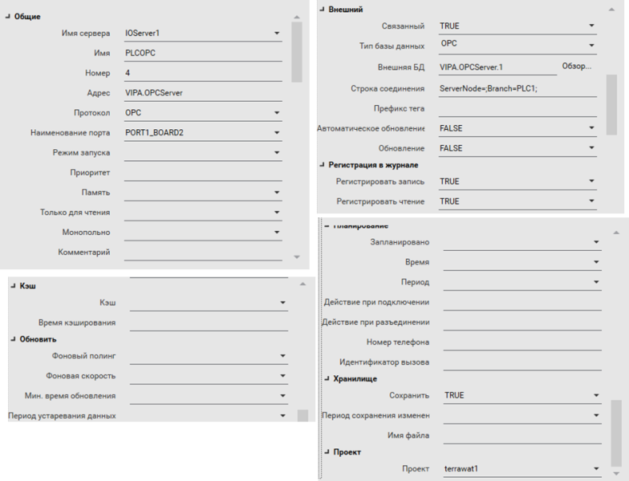

# I/O Device

## Add an I/O Device

To manually add an I/O device to a project, you need to specify its properties using the **Topology** activity. The properties depend on both the I/O device and protocol. 

You should verify your system meets the  hardware and software requirements needed to establish communication  between a device and Citect SCADA.

This may include a variety of possibilities, including:

-  the installation of a proprietary communications card
- the establishment of a device server
- the installation of configuration software. 

The **Driver Reference Help**  provides the hardware and software requirements for each device, and  includes any additional information you need to know about setting up  specific devices.

**Note:** You can use the  Device Communications Wizard to add an I/O device to your project. This  will automatically configure many of the property settings described in  this topic.

To add an I/O device:

1. In the **Topology** activity, select **I/O Devices**.
2. Add a row to the Grid Editor. 
3. Type the required information in each column, or in the Property Grid (see below for a description of the properties).
4. Click **Save**. 

## I/O Device Properties

### General Properties

| Property         | Description                                                  |
| ---------------- | ------------------------------------------------------------ |
| **Server Name**  | The name of the I/O server to which the I/O device is connected. |
| **Name**         | The name for the I/O device (31 characters maximum). The name needs to be unique in the Citect SCADA system, unless the I/O device is defined in other I/O servers (to  provide redundancy). If redundancy is used, the I/O device needs to then have the same I/O device number and address for each I/O Server. use  different I/O device names for your primary and standby I/O devices,  otherwise I/O device Cicode functions cannot differentiate between them. |
| **Number**       | Унікальний номер для пристрою вводу-виводу (0-16383). Номер має бути унікальним у системі Citect SCADA, якщо пристрій вводу-виводу не визначено на інших серверах вводу-виводу (щоб забезпечити резервування). Якщо використовується резервування, пристрій вводу-виводу повинен мати однаковий номер і адресу пристрою вводу-виводу на кожному резервному сервері вводу-виводу. Ви можете використовувати те саме ім’я пристрою, але якщо ви хочете використовувати функції Cicode пристрою вводу/виводу, легше мати різні назви пристроїв вводу/виводу. |
| **Address**      | The address of the I/O device (64 characters maximum). The format of the  address you enter in this field is determined by the type of I/O device  (and protocol) used, as each has a different addressing strategy. |
| **Protocol**     | The protocol used to communicate to the I/O device (16 characters maximum). Many I/O devices support multiple protocols, dependent on the communication method chosen. |
| **Port Name**    | The port on the board to which the I/O device is connected (31 characters maximum). This is necessary to link the I/O device to the port. For example Board1_Port1.**Note:** There is a limit of 255 COMx ports on a server. To avoid this  limitation restricting the number of remote I/O devices you use, you can connect multiple remote I/O devices to the same port as long as  communication details (telephone number, baud rate, data bits, stop bits and parity) are identical. |
| **Startup Mode** | The type of I/O device redundancy used. The options are:     - Primary —  Enable immediate use of this communications channel. This is the default mode if no mode is specified.      - Standby — This channel will remain unused until the I/O device configured with the primary channel becomes inoperative.      - StandbyWrite —  This channel will remain unused until the I/O device configured with the primary channel becomes inoperative. Write requests sent to the  primary channel are also sent to this channel.  To use Standby or  StandbyWrite modes, you need to also configure a primary I/O device with the same I/O device name, number and address.  **Note:** Уникайте використання режиму StandbyWrite для запланованих пристроїв вводу-виводу, оскільки існує ймовірність того, що черга запису пристрою введення-виводу в режимі очікування не буде очищена. Під час запису на запланований пристрій вводу-виводу, з яким він не зв’язується, запити на запис стоять у черзі до відновлення зв’язку.  У разі використання резервування пристроїв вводу/виводу та режиму StandbyWrite, первинні та резервні пристрої вводу/виводу мають власні черги запитів на запис, що очікують на розгляд. Якщо зв’язок пристрою вводу-виводу контролюється автоматично за розкладом зв’язку, тоді обидві черги очищаються, коли настає час набору за розкладом. Якщо зв’язок вручну контролюється функцією IODeviceControl Cicode, очищається лише черга запису первинного пристрою вводу-виводу, а черга запису пристрою введення-виводу в режимі очікування не очищається. |
| **Priority**     | Specifies the order standby devices are promoted in if a primary I/O device becomes  inoperative during runtime (8 characters maximum).If there is more  than one standby I/O device configured for a cluster, you can use this  field to give precedence to a particular standby device. If this field  is left blank, priority will be automatically allocated to the device  during project compilation, based on the priority settings of other  standby devices and/or the order in which the devices were configured. See I/O Device Promotion. |
| **Memory**       | Specifies whether the I/O device runs in Memory mode. The default value is FALSE. If you select TRUE, the I/O device will be created in memory and its values stored in  memory at runtime. This may be useful if you are testing your system,  before connecting physical I/O devices, as memory mode stops Citect SCADA from communicating with physical I/O devices. See Using Memory Mode.    **Note:** If a device is configured with **Memory** set to TRUE, the **Port Name** and **Address** fields can be left blank as they will not be used by the compiler or the I/O server at runtime. |
| **Read-Only**    | Specify whether the I/O device is read-only. The default value is FALSE. If you select TRUE, any attempt to write to a tag associated with the I/O device will be unsuccessful. |
| **Exclusive**    | This setting  controls the way in which redundant I/O device(s) configured with the  same network number on different I/O servers activate communications to  the physical device they represent. When Exclusive is  set to TRUE, only one I/O device (on one I/O server) will activate   communications to the physical device at a time.  The best available I/O device (online with the lowest priority) at a particular time will be  chosen to actively communicate.  When this I/O device is no longer the  best available, it will deactivate, which will in turn trigger the best  available I/O device on another server to activate.When Exclusive is  set to FALSE (default), the best available I/O device will typically be  the only active I/O device; however this may not be enforced.  When a  different I/O device becomes the best it will activate immediately,  without waiting for the other I/O device to deactivate.  An I/O device  that is not the best may also be forced into actively communicating with the physical device if a particular client can only communicate with  the I/O server that I/O device is running on. **Note:** The  parameter [IOServer\]PeerServerConnectTimeOut has been implemented so that on startup of an I/O server, all I/O  devices with Exclusive set to TRUE will not be allowed to activate  before the I/O server has successfully connected to its peers. This  parameter defines how long an I/O server will wait until it ceases  trying to connect to peer I/O servers. |
| **Comment**      | Any useful comment. This field is optional and is not used at runtime. |

**Note:** For the **Number**, **Protocol** and **Port** properties, the same network number is used for redundancy (as stated  above), however this implies that the protocol is usually the same  (though there maybe some special circumstances where devices support  multiple protocols) and the Port modes are similar. i.e. a real world  port reference, DISKDRV or MEMORY. If DISKDRV is being used, then  redundant units (i.e. the same NUMBER) needs to be DISKDRV. This also  applies for MEMORY mode.

### External Properties

| Property              | Description                                                  |
| --------------------- | ------------------------------------------------------------ |
| **Linked**            | Select TRUE or FALSE to specify whether or not the I/O device is linked to an external data source (see Linking Tags to an External Data Source. If you link to an external data source, Citect SCADA is updated with any changes made to the external data source when a refresh is performed (see Refresh the Tags for a Linked I/O Device). If you disconnect an existing link, you can choose to make a local copy of the tags in the database or you can delete them from Citect SCADA's variable tags database altogether. If an I/O device is linked to an external data source the Database Type, External Database, Connection String, Tag Prefix and Live Update fields will be greyed  out. |
| **Database Type**     | The format of the data referenced by the external data source. |
| **External Database** | The path and file name of the external data source for the I/O device. If the **Linked** property is set to TRUE (and a **Database Type** has been specified), you can use the **Browse** button next to this field in the Property Grid to select and validate a database. Alternatively, you can enter the IP address/directory, computer name, or the URL of a data server. For example:      - "C:\Work.CSV"     - "127.0.0.1"     -"139.2.4.41\HMI_SCADA"     -"http://www.abicom.com.au/main/scada"    "\\coms\data\scada". |
| **Connection String** | Enter a connection  string to provide connection details for the data source.  This is  similar to an ODBC connection string. For example: `UserID = XXX; Password = YYY ` or `ServerNode=111.2.3.44; Branch=XXX ` Not every data source needs a connection string. |
| **Tag Prefix**        | The prefix that will be inserted in front of the names of linked tags in Citect SCADA's variable tags database (for this I/O device only). To change the  prefix, delete it first, perform a manual refresh, then add the new  prefix. |
| **Automatic Refresh** | Determines whether the linked tags in Citect SCADA's variable tags database will be updated when the external data source is changed. This refresh will occur the first time you link to the data source, and then whenever you compile your project. Without an automatic refresh, you will need to perform a manual refresh to update the linked tags in Citect SCADA  (see Refresh the Tags for a Linked I/O Device). |
| **Live Updating**     | Контролює, чи будуть пов’язані теги в Citect SCADA і зовнішня база даних тегів синхронізуватися, якщо будь-яку базу даних буде змінено. Щоб увімкнути пряме посилання, виберіть Так у меню Оновлення в реальному часі. Коли активовано оновлення в реальному часі та доступ до бази даних змінних тегів (наприклад, під час компіляції проекту або при заповненні випадаючого списку), Citect SCADA запитує зовнішню базу даних тегів, щоб визначити, чи була вона змінена. Якщо так, Citect SCADA об’єднує зміни в базу даних тегів локальних змінних. І навпаки, будь-які зміни, внесені до бази даних змінних локальних тегів, будуть автоматично включені до зовнішньої бази даних тегів. |

### Logging Properties

| Property      | Description                                                  |
| ------------- | ------------------------------------------------------------ |
| **Log Write** | Вмикає/виключає реєстрацію записів на пристрої вводу/виводу. Якщо ввімкнено, записи реєструються до файлу SYSLOG.DAT у папці **logs** папки Citect SCADA **User and Data**, вибраної під час інсталяції, також зазначеної у файлі INI як [CtEdit]Logs. Інформацію про TagWriteEventQue та реєстрацію даних тегу див. у розділі «Tag Functions».   **Примітка.** Запис журналу на кожен пристрій вводу-виводу може сповільнити зв'язок, оскільки система Citect SCADA буде записувати великі обсяги даних на диск. Проте реєстрація записів корисна під час налагодження системи. |
| **Log Read**  | Вмикає/виключає реєстрацію читань із пристрою вводу/виводу. Якщо ввімкнено, читання реєструються у файлі Citect SCADA SYSLOG.DAT.  **Примітка.** Реєстрація зчитування кожного пристрою введення-виводу може сповільнити зв'язок, оскільки система Citect SCADA буде записувати великі обсяги даних на диск. Проте реєстрація читань корисна під час налагодження системи. |

### Cache Properties

| Property       | Description                                                  |
| -------------- | ------------------------------------------------------------ |
| **Cache**      | Вмикає/вимикає кешування даних. Якщо цей параметр увімкнено, кеш пам’яті пристрою вводу-виводу зберігається на сервері вводу-виводу, тим самим покращуючи час обміну даними.  **Примітка:** Кешування даних має бути включеним для пристроїв вводу-виводу за розкладом, але вимкнено для пристроїв вводу -виводу пам'яті або диска. |
| **Cache Time** | Час кешу в мілісекундах. Коли кешування ввімкнено, дані, які зчитуються з пристрою вводу-виводу, тимчасово зберігаються в пам'яті сервера вводу-виводу. Якщо зроблено інший запит (від того ж або іншого клієнта) для тих самих даних протягом часу кешу, сервер введення-виведення Citect SCADA повертає значення у своїй пам'яті, а не зчитує пристрій вводу-виводу вдруге. Кешування даних призводить до більш швидкої загальної реакції, коли ті ж дані потрібні багатьом клієнтам. Рекомендується час кешування 300 мілісекунд. Час кешування для запланованого пристрою вводу -виводу розраховується автоматично. Ви можете переглянути час кешу запланованого пристрою введення-виводу за допомогою команди Kernel Page Unit. |

### Update Properties

| Property             | Description                                                  |
| -------------------- | ------------------------------------------------------------ |
| **Background Poll**  | Вказує, що теги для вказаного пристрою постійно опитуються з мінімальною частотою опитування у фоновому режимі. Варіанти: True або False. Встановіть для цього поля значення True, якщо ви працюєте у повільній мережі, на повільному пристрої або там, де теги зазвичай опитуються нечасто. |
| **Background Rate**  | Якщо для фонового опитування встановлено значення True, вказує мінімальну швидкість опитування пристрою. Ви можете вибрати будь-яке попередньо визначене значення зі спадного списку або ввести власне у форматі ЧГ:ММ:СС. Якщо значення не введено, буде використано значення за замовчуванням 30 секунд. |
| **Min Update Rate**  | Після завершення заздалегідь визначеного періоду DataSource надішле підписаним клієнтам сповіщення про значення оновлення тегів. Ви можете вибрати будь-яке попередньо визначене значення зі спадного списку або ввести власне у форматі ЧГ:ММ:СС. Якщо значення не введено, буде використано значення за замовчуванням 0 секунд, а повідомлення про оновлення не надсилатимуться. |
| **Staleness Period** | Період непрацездатності (Staleness period) являє собою загальну кількість секунд, яка пройде після останнього оновлення, перш ніж розширена якість елемента тегу буде встановлено на "Stale". Ви можете вибрати будь-яке попередньо визначене значення зі спадного списку або ввести своє власне у форматі HH: MM: SS. Якщо значення не введено, буде використано значення за замовчуванням 0 секунд, а для елементів тегу не буде встановлено значення "Stale"  Додаткову інформацію щодо мінімальної швидкості оновлення та періоду застарілості див. у  Tag Data Persistence. |

### Scheduling Properties

| Property              | Description                                                  |
| --------------------- | ------------------------------------------------------------ |
| **Scheduled**         | Determines whether  the I/O device is configured for scheduled communications. This is  normally set using the Device Communications Wizard. **Note:** If a schedule for a dial-up remote I/O device is not specified, the  connection will be established at startup and will remain connected  until shut-down.See Scheduled Communications |
| **Time**              | The I/O server will attempt to communicate with the I/O device at this time, and then at  intervals as defined below. This time is merely a marker for Citect SCADA. If you run up your project after this time, the I/O server will not  wait until the next day to begin communicating. It will operate as if  your project had been running since before the start time. |
| **Period**            | The time between  successive communication attempts. The period needs to be long relative  to the driver's watchtime and the [Dial]WatchTime. If necessary,  decrease these watchtimes or increase Period to make Period more than  double the watchtimes.Examples (based on a Synchronize at time of 10:00:00):    If you enter 12:00:00 in the Repeat every field, and start your project at 9 a.m., the I/O Server will communicate with the I/O Device at 10 a.m., then once every 12 hours after that, i.e. 10 p.m., then again at 10  a.m. of the following day, etc.    If you enter 12:00:00, and start your project at 4 p.m., the I/O Server  will communicate with the I/O Server at 10 p.m., then again at 10 a.m.  of the following day, and so on. The I/O Server will assume that  communications were established at 10 a.m., so it continue as if they  had been - communicating once every 12 hours after 10 a.m.    If you enter 3 days, and start your project at 9 a.m. on a Wednesday, the  I/O Server will communicate with the I/O Device at 10 a.m., then once  every 3 days after that, i.e. 10 a.m. on the following Saturday, then at 10 a.m. on the following Tuesday, etc.    If you enter the 6th of December in the Repeat every, and start your  project during November, the I/O Server will communicate with the I/O  Device at 10 a.m. on December 6, then again on December 6 of the  following year, etc.Select On Startup  for a persistent connection. To disconnect a persistent connection, you  need to call the IODeviceControl() function with type 8. |
| **Connect Action**    | Cicode to be  executed once communication with the I/O device has been established  (and before any read or write requests are processed). |
| **Disconnect Action** | Cicode to be  executed once communication with the I/O device has been terminated (and after read and write requests are processed). |
| **Phone Number**      | The telephone number that needs to be dialed to initiate contact with the I/O device. (i.e. for dial-up remote I/O Devices) |

### Storage Properties

| Property           | Description                                                  |
| ------------------ | ------------------------------------------------------------ |
| **Persist**        | Встановіть значення TRUE або FALSE, щоб вказати, чи ввімкнено чи вимкнено збереження файлу кешу тегів. За замовчуванням – TRUE, і дані будуть записані в файл XML, як описано в розділі «File Name» нижче. Якщо один із первинних/резервних пристроїв вводу/виводу (ідентифікований тим самим номером мережі) має значення FALSE, то на кожному пристрої його вимкнено. |
| **Persist Period** | Вказує, як часто зберігати файл кешу XML на диску. За замовчуванням — 10 хвилин (00:10:00). Зазвичай використовуваний період є найвищим значенням, зазначеним для одного з основних/резервних пристроїв вводу/виводу (ідентифікується тим самим номером мережі). |
| **File Name**      | Вказує шлях до файлу на диску, де буде зберігатися кеш XML. Ви можете вказати лише шлях або шлях із фактичною назвою файлу. За замовчуванням є каталог даних у форматі: <ClusterName>.<IOServerName><ClusterName>.<IODeviceName>.cache. Якщо розташування неможливо створити, то використовується або шлях за замовчуванням, назва файлу за замовчуванням або обидва. Зазвичай використовується перший непорожній шлях, зазначений для одного з основних/резервних пристроїв вводу/виводу (ідентифікується тим самим номером мережі). |

### Project Properties

| Property    | Description                                        |
| ----------- | -------------------------------------------------- |
| **Project** | The project in which the I/O device is configured. |

