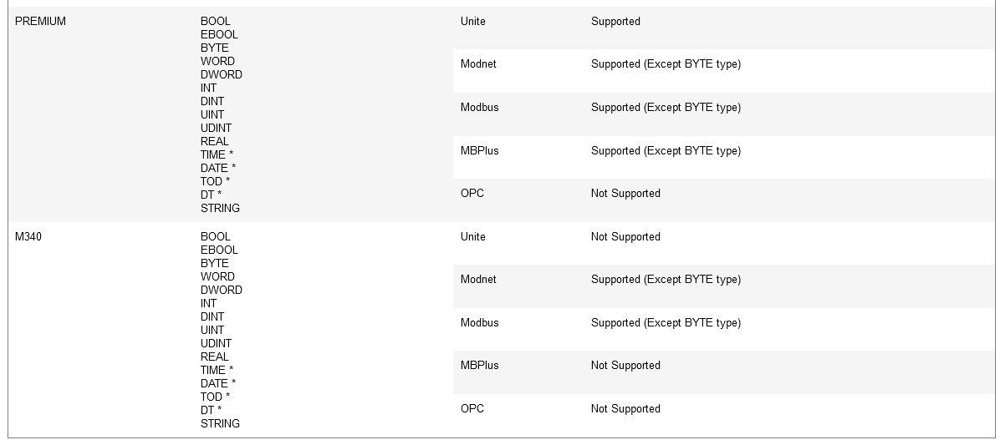
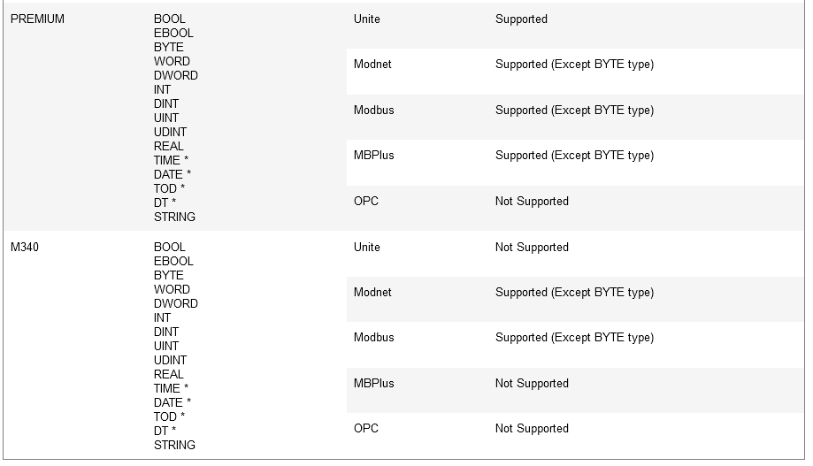
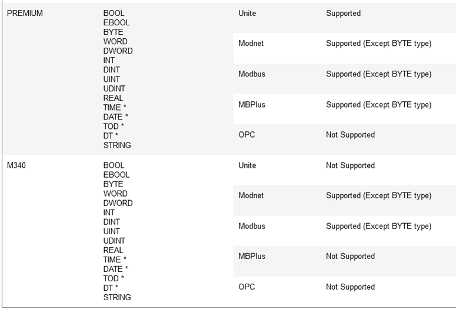

# Link an I/O Device to an External Data Source

When you add an I/O device to Citect SCADA, you can choose to [link it to an external data source](file:///C:/Program Files (x86)/AVEVA/Citect SCADA 2018 R2/Bin/Help/Citect SCADA/Content/Linking_Tags_to_an_External_Data_Source.html). This provides a link to the tag data that was saved when the  I/O device was programmed.

To link an I/O device to an external data source:

1. In the **Topology** activity, select **I/O Devices**.
2. Scroll to the relevant I/O device.
3. Set the  **Linked** property to **True** in the [Grid Editor](file:///C:/Program Files (x86)/AVEVA/Citect SCADA 2018 R2/Bin/Help/Citect SCADA/Content/GridEditor_Edit_Values_in_the_Grid_Editor.htm) or the [Property Grid](file:///C:/Program Files (x86)/AVEVA/Citect SCADA 2018 R2/Bin/Help/Citect SCADA/Content/PropertyGrid_Edit_Values_in_the_Property_Grid.htm).
4. Complete the remaining fields as required.
5. Click **Save**.

To link an I/O device to an external data source using the Device Communications Wizard:

1. In the **Topology** activity, select **I/O Devices**.
2. On the Command Bar, select **New Device**. The Device Communications Wizard is displayed.
3. Complete the wizard screens one by one, selecting the relevant I/O device, and so on. 
4. When the **Link to External Database** screen appears, select the **Link I/O Device to an external tag database** check box and complete the remaining details.

#### Refresh the Tags for a Linked I/O Device

You can manually refresh the tags for an I/O  device that is linked to an external data source. This will load any  changes that have occurred in the external data source into  Citect Studio. 

**Note:** If the **Automatic Refresh** property is set to True for a linked I/O device, a tag refresh will occur automatically when you compile your project. 

To manually refresh linked tags:

1. In the **Topology** activity, select **I/O Devices**.
2. Select **Refresh Tags** from the Command Bar. The **Refresh Linked Tags** dialog box will appear.
3. Select the I/O device that is linked to the tags you would like to refresh (see Refresh Linked Tags Properties below). 

#### Breaking the Link to the External Data Source

You can break the link to the external data source from the I/O Devices form or through the Device Communications Wizard. 

If you break the link, you can choose to make a local copy of the tags or you can simply delete them altogether.

# Link Tags to an External Data Source

Linking is an I/O device specific operation. When you add an I/O device to Citect SCADA, you can choose to link it to an external data source (see [Link an I/O Device to an External Data Source](file:///C:/Program Files (x86)/AVEVA/Citect SCADA 2018 R2/Bin/Help/Citect SCADA/Content/Link_an_IO_Device_to_an_External_Data_Source.htm)).

The external data source is where the tag data  was saved when the actual I/O device was programmed. If you link to the  external data source, Citect SCADA automatically creates variable tag records for every tag in the I/O device.

These variable tag records are dynamically linked to the tags in the external data source. Citect SCADA can update whenever one of the external tags is changed. 

For example, if you change the address of a tag using a third party I/O device programming package, the external data  source is changed. Then, when you compile your project in Citect SCADA, the change is copied from the external database to Citect SCADA's variable tags database.

If a tag is linked and you change a field, your change will not be overwritten when the link is next refreshed.  Generally, however, any field which takes its value from the external  data source is disabled. 

**Note:** Some properties defined for the external tags will not be relevant to Citect SCADA. Also, some will not be in a format that Citect SCADA can read. Each I/O device has an associated format file in Citect SCADA. It is this file that determines what information is copied to Citect SCADA's variable tags database and how this information is to be converted. In most cases, you will not have to edit this file.

#### Linked Unity Tags

Note the following for Citect SCADA tags linked to Unity tags:

1. The addition of a new tag on either side, will result in the addition of a new tag on the other side.

2. The deletion of an existing tag on either side, will result in the deletion of the corresponding tag on the other side.

3. The modification of an existing tag on either side, will result in the modification of the corresponding tag on the other side.

4. The delete operation in either Unity or Citect will take precedence over other operations (such as modify).

5. If there is some  contention between the Unity database and the Citect database for the  same tag, that is modifications are done from both databases at the same time, the Unity database item will take precedence over the Citect  database item. 

6. The linked I/O Device live update synchronization will be triggered in the following cases:

7. 1. Unity configuration update.
   2. Citect configuration update.
   3. Manual refresh.

## Unity Support Matrixes

#### Imported Tags

For Unity SpeedLinkFastlinx Dynamic and Static:

**Note:** Citect recommends that you use the Unity SpeedLinkFastlinx Dynamic driver when importing tags from Unity Pro into a Citect project.

**Note:** Arrays are  supported for every data type except DATE, TOD, DT and STRING data  types. For Unity data types marked with *, Citect does not have data  types that directly match the Unity types. Instead use supported data  types and Cicode to convert and simulate those data types.

In addition, the following Unity data types are not supported:

- Structured data types.
- Arrays which are not zero-based.
- Multi-dimensional arrays.
- Arrays of Unity BOOL data type are not supported for all protocols except OPC and will be excluded from the import.

#### Exported Tags

For SpeedLinkFastlinx Static:

**Note:** Arrays are  supported for data types except DATE, TOD, DT and STRING data types. For Unity data types marked with *, Citect does not have data types that  directly match the Unity types. Instead use Technical supported data  types and Cicode to convert and simulate those data types.

In addition, the following Unity data types are not supported:

- Structured data types.
- Arrays which are not zero-based.
- Multi-dimensional arrays.
- Arrays of Unity BOOL data type are not supported for all protocols except OPC.

#### Linking Tags

Linked I/O Device Live Update

For Unity SpeedLinkFastlinx Dynamic:

        

**Note:** Arrays are  supported for data types except DATE, TOD, DT and STRING data types. For Unity data types marked with *, Citect does not have data types that  directly match the Unity types. Instead use supported data types and  Cicode to convert and simulate those data types.

In addition, the following Unity data types are not supported:

- Structured data types.
- Arrays which are not zero-based.
- Multi-dimensional arrays.
- Arrays of Unity BOOL data type are not supported for all protocols except OPC.

