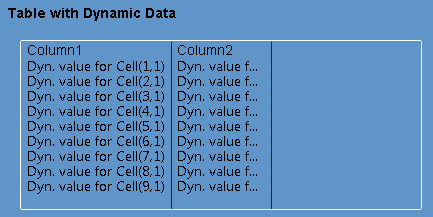
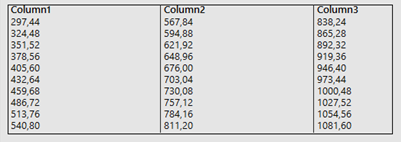
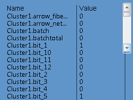

# The Library Controls Include Project 

The Library Control Include project contains a set of  Genies for common user interface controls such as an equipment tree  view, data table, and vertical and horizontal scroll bars. 

**Note:** The Library Control Include project is a system include project, and only appears in the Project list tree  if the **System Projects** filter is applied in the Projects activity.

### Library Control Genies

| Genie             | Description                                                  | When to use                                                  |
| ----------------- | ------------------------------------------------------------ | ------------------------------------------------------------ |
| AlarmTable        | A version of the Table genie for displaying an alarm list.   | Place on page to display an alarm list.                      |
| Calendar          | Displays a monthly calendar view.                            | Place on page to show calendar information or allow user to select a particular date for input. |
| Data Browse Table | A version of the  Table genie to display snapshot information retrieved via the built-in  data browse family of Cicode functions, such as AlmBrowse, TagBrowse and TrnBrowse  or other data browse-like data by providing custom  initialization callback function to the genie. | Place on page to display a snapshot of data retrieved from the built-in data browse functions. |
| EquipTree         | A version of the  Tree genie for displaying a hierarchy of equipment configured in the  project. The EquipTree genie  automatically loads the equipment defined  in the project. For advanced usage, such as doing custom actions upon different events, you will need to  write your own Cicode functions and assign them to the callback  functions part of the genie form. | Place on page to display an equipment tree.                  |
| Scrollbar_Horz    | Displays a  horizontal scroll bar for panning the displayed content horizontally to  reveal the off-screen portion of the content. This genie can be used with any content by hooking up the call-back  events of the genies with the appropriate Cicode functions (written by  the users). | Place on page to view the off screen content                 |
| Scrollbar_Vert    | Displays a vertical scroll bar for panning the displayed content vertically to reveal the  off-screen portion of the content. This genie can be used with any content by hooking up the call-back  events of the genies with the appropriate Cicode functions (written by  the users). | Place on page to view the off screen content                 |
| Slider            | Displays a Slider for hiding and displaying the equipment tree-view panel on screen. | Place on page to hide the equipment tree-view panel          |
| SQL Table         | A version of the  BrowseTable genie to display information retrieved using the built-in  SQL functions as a disconnected recordset. | Place on page to display data retrieved from an SQL data source. |
| Tab               | Displays a list of opened pages uniquely in the Activity Bar. See Using the Tab Library Control for examples in how the control can be used. | Place on page to display a list of opened pages that will allow users to navigate between pages easily. |
| Table Row         | Displays background highlight for a particular row when it is selected. This genie is to be used in conjunction with the Table genies. However, its use is optional.  The position and  size of the highlight is not automatically calculated at runtime. Locate and re-size the instance of this genie in the Graphics Builder at  design time. | Use when want to highlight the selected row with a blue background color. |
| Table             | Відображає кілька рядків даних на екрані у вигляді таблиці. Джин призначений для відображення на екрані лише певної кількості рядків і стовпців даних. Ви можете переглядати закадрову частину таблиці, використовуючи genies полоси прокрутки або за допомогою спеціальних функцій Cicode. Цей джин не включає анімацію виділення рядка для його вибору. Однак ви можете дізнатися, які рядки вибрано за допомогою набору певних функцій Cicode. | Розмістіть на сторінці, щоб відобразити таблицю з даними, тривогами та записи бази даних. |
| TagTable          | A version of the  Table genie for displaying a table of variable tags  added to the genie  using the LibTagTable_AddTag() Cicode function. See Using the Tag Table Library Control for examples in how the control can be used. | Place on page to display a table of variable tags.           |
| Tree              | Displays a  collection of items  in a parent-child hierarchical relationship.  Displays only a certain number of items on screen. You can view the  off-screen rows and columns of the table by associating it with the  scroll bar genies or via specific Cicode functions.  See Using the Tree Library Control for examples in how the control can be used. | Place on page to display hierarchical data, such as an equipme |

## Use the Library Controls

To use a Genie from the Library_Controls include project:

1. In Graphics Builder, open the page to which you would like to add a Genie. 
2. Click the Paste Genie button in the objects toolbox, or select **Paste Genie** from the **Edit** menu.
3. In the Paste Genie dialog, select the "lib_controls" library.
4. Select the required Genie from the **Genie** list and click **OK**. You can also double-click the thumbnail of the Genie.
5. The Genie is pasted on the graphics page. A dialog will open prompting you to configure the properties of the Genie.

6. Click **Save**. 

At runtime, the dialog values you entered into the prompt will replace each substitution in the Genie.

## Alarm Table Library Control

Alarm table genie has the following parameters:

|Parameter                       |Description                                                  |
|------------------------------- |------------------------------------------------------------ |
|Alarm Table Name                |Name of table (max characters). Used to identify the genie when on a graphics page. |
|Width                           |Pixel width of the table at runtime.   **Note:** Leave the size of the genie at design time as 100 pixels, as it will be automatically calculated at runtime. |
|Number Of Rows                  |Number of rows displayed on the page.                        |
|Header Height                   |Pixel Height of header row in table display.                 |
|Row Height                      |Pixel height of  row in the table display.                   |
|Header Padding                  |The pixel padding between the bottom of the header text (column name) and the bottom of the header row. |
|Row Padding                     |The pixel padding between the bottom of the cell text and the bottom of each row. |
|Column Padding                  |The pixel padding on the left-hand-side and right-hand-side of the cell text relative to the width of each column. |
|Refresh Rate                    |The minimum (quickest possible) rate that the control will be redrawn.  The control is only redrawn as required upon changes to the layout, scrolling or other user initiated events. |
|Scan Delay (Optional)           |The number of page scan  delay before the genie is initialized at runtime. this can be set to  different number on different control genies to stagger the  initialization order. If not set defaults to 1. |
|Last Alarm List                 |True/False drop down box.   Determines whether the alarm list is a normal list (which will be  instantiated via the function AlarmDsp) or a last alarm list (which will be instantiated via AlarmDspLast). |
|Horizontal Scrollbar (Optional) |The name of the horizontal  scroll bar genie on the page that allows the user to horizontally scroll the content displayed on the control genie If you do not require horizontal scrolling, leave this field blank. |
|Vertical Scrollbar (Optional)   |The name of the horizontal  scroll bar genie on the page that allows the user to vertically scroll  the content displayed on the control genie If you do not require vertical scrolling, leave this field blank. |
|Header Font                     |The pre-configured font for header text .                    |
|Auto Width                      |True/False drop down box. False is selected by default.      |
|Format Category                 |The alarm category that is used to determine the fields (columns) displayed. If this is not specified, the columns displayed on the table will be determined by the field format defined in alarm category 0. |
|Cluster                         |The cluster of the alarm list If this is not specified, alarms from all clusters configured in the project will be displayed. |
|Allow Selection                 |True/False drop down. True is selected by default.           |
|Alarm Type                      |The display type of the  alarm list. See the Type parameter for the Cicode function AlarmDsp for  details of the values you can use and what each represents.   **Note:** If you set the alarm type to a hardware alarm (types 5 - 9), the following limitations will apply:  The format used to display the hardware alarms will be defined by the **Alarm Format** property for alarm category 255.You may need to specify off-screen animation numbers (ANs) for each table row. If you are using a Citect SCADA template project (SxW or Tab Style templates), a set of ANs starting at 21 is already reserved for this purpose. If you are not using a  template project, you will need to manually add these ANs. |
|AN                              |The Animation Number (AN)  of a user created Cicode / Animation Number object where the alarm list  will be instantiated (displayed). If this is less than 1, the alarm list will be displayed at a random AN. The AN allows the user to interact with the alarm list at runtime using  built-in Cicode functions such as AlarmSetInfo(), AlarmDspPrev() and  AlarmDspNext(). |
|Intialize (Optional)            |Callback function that is  called when the control initializes. The callback function should return either TRUE (1) for success or FALSE (0) if unsuccessful. By default, if the user specified function does not initialize, the  control genie will retry the function a few times before giving up. This callback only supports the #Name keyword which represents the name  assigned to the control genie.  **Note**: The initialization callback function may be called multiple times whenever the table is re-initialized. |
|Left Mouse (Optional)           |Callback function that is called when the user clicks the left mouse button No particular return value is expected from this function, and it supports the following keywords in its argument list:   #Name = name assigned to the genie   #Row = row number of the cell (with respect to the underlying data) that is clicked   #Col = column number of the cell that is clicked   #RowDsp = row number of the cell relative to the display that is clicked   #ColDsp = column number of the cell relative to the display that is clicked  #AN= the animation number where the alarm is displayed |
|Right Mouse (Optional)          |Callback function that is called when the user clicks the right mouse button It uses the same specification as that of the Left mouse callback . |
|Double Click (Optional)         |Callback function that is called when the user double-click the left mouse button It uses the same specification as that of the Left mouse callback. |
|Table Reload (Optional)         |Callback function that is called when the control is redrawn No particular return value is expected from this function, and it supports the following keywords in its argument list:   #Name = name assigned to the genie |

**Note**: The table can be up to 62 columns (although the latter columns may not have the column separators). For tables that return more columns than the limit,  the first 62 columns will be displayed.

### Use the Alarm Table Genie

 In the example below a simple initialization  function is used to set the columns (fields) and then filter the display list  when the alarm table initializes.

####  Example: Set columns and filter via table initialization callback event

1. The Cicode sample below  will be used in the following example. Open the Cicode Editor and   create a new Cicode file (for example, _MyAlmTable_Ex.ci).

2. ```c
   	INT FUNCTION MyAlmTable_Init(STRING sTable, STRING sEquipment)
   		// Set up columns
   		LibTable_AddColumn(sTable, "Name", 150);
   		LibTable_AddColumn(sTable, "Description", 150, "Desc");
   		LibTable_AddColumn(sTable, "State", 150);
   
   		// Set up filter
   		INT nAN = LibAlmTable_GetAN(sTable);
   		INT hEdit = AlarmFilterEditOpen(nAN);
   		AlarmFilterEditSet(hEdit, "Equipment=" + sEquipment);
   		AlarmFilterEditCommit(hEdit);
   		AlarmFilterEditClose(hEdit);
   
   		RETURN TRUE;
   	END					
   ```

3. From the Graphics Builder create a new page (for example, the Normal Tab Style Page).

4. When created, from the **Object toolbox** select the **Paste Genie** icon.

5. In the **Paste Genie** window select the  **lib_controls** library 

6. Select the Alarm Table genie. The Alarm Table genie is pasted onto the graphics page. 

7. In the Alarm Table Genie property dialog configure the following fields:

8. |Parameter            |Description                                                  |
   |-------------------- |------------------------------------------------------------ |
   |Table Name           |Table 1                                                      |
   |Width                |400 ( all columns within the table are displayed. If left at 100 some columns may not be displayed) |
   |Number of rows       |10                                                           |
   |Header Height        |18                                                           |
   |Row Height           |15                                                           |
   |Header Padding       |5                                                            |
   |Row Padding          |4                                                            |
   |Column Padding       |5                                                            |
   |Horizontal Scrollbar |                                                             |
   |Vertical Scrollbar   |                                                             |
   |Initialize           |MyAlmTable_Init("#Name","Plant*")                            |

9. Click **OK** to save the changes.

10. Save the graphics page and compile and run the project. 

At runtime the table will look like the following:

  

### Приклад


```c
FUNCTION AlarmTabInit (STRING sTable)
	STRING sEquipment = AssInfo("equipname", 0);
	STRING sStartDate = AssInfo("timestart", 0);
	STRING sEndDate = AssInfo("timeend", 0);	
	
	// Set up columns
	LibTable_AddColumn(sTable, "ДатаЧас", 150, "LocalTimeDate");
	LibTable_AddColumn(sTable, "Tag", 150);
	LibTable_AddColumn(sTable, "Message", 150);
	LibTable_AddColumn(sTable, "State", 150);

	STRING sStartDate1 = StrMid (sStartDate,0,10);   
	STRING sStartTime1 =  StrMid (sStartDate,11,8);
	STRING sEndDate1 = StrMid (sEndDate,0,10);
	STRING sEndTime1 = StrMid (sEndDate,11,8);	
	STRING startDate = IntToStr (StrToDate(sStartDate1) + StrToTime(sStartTime1)); 
	STRING endDate = IntToStr (StrToDate(sEndDate1) + StrToTime(sEndTime1));
	STRING sFilter = "Equipment=" + sEquipment + "* AND LocalTimeDate>=" + startDate + " AND LocalTimeDate<" +  endDate + ";";
	
	// Set up filter
	INT nAN = LibAlmTable_GetAN(sTable);
	INT hEdit = AlarmFilterEditOpen(nAN);
	AlarmFilterEditSet(hEdit, sFilter);
	AlarmFilterEditCommit(hEdit);
	AlarmFilterEditClose(hEdit);
END
```


## Calendar Library Control

The following parameters are available for the Calendar library control:

| Parameter               | Description                                                  |
| ----------------------- | ------------------------------------------------------------ |
| Calendar Name           | A unique name used to identify the Genie within a page.      |
| Width                   | The pixel width of the control at runtime.  <br />**Note**: Please do not re-size the Genie at design time, as its width will be automatically calculated at runtime. |
| Height                  | The pixel height of the control at runtime. 						 <br /> **Note:** Please do not re-size the Genie at design time, as its height will be automatically calculated at runtime. |
| Header Height           | Pixel height of header row (that shows the week day initials) in calendar display. |
| Label Height            | Pixel height of the label row (that shows the month).        |
| Header Padding          | The pixel padding between the bottom of the header text and the bottom of the header row. |
| Label Padding           | The pixel padding between the bottom of the label text and the bottom of the label row. |
| Top Padding             | The pixel padding on top of the calendar display.            |
| Left Padding            | The pixel padding on left of the calendar display.           |
| Side Padding            | The pixel padding on both sides of the calendar display.     |
| Header Font             | The pre-configured font for header text.                     |
| Date                    | The date selected as a timestamp value. Users may wish to convert the result using TimestampToStr to the desired format and locale. |
| Date Font               | The pre-configured font for the month text.                  |
| Day Font                | The pre-configured font for the day displays.                |
| Next Month Font         | The pre-configured font for the next month text.             |
| Selection Font          | The pre-configured font for the selected day.                |
| Single selection        | Whether allow single day or multiple days to be selected.    |
| Refresh Rate            | The minimum (quickest possible) rate that the control will be drawn. The control is only redrawn as required upon changes to the layout or other user initiated events. |
| Initialize (Optional)   | Callback function that is  called when the control initializes The callback function should return  either TRUE (1) for success or FALSE (0) if unsuccessful. By default, if the user specified function does not initialize, the control Genie will retry the function a few time before giving up. This callback only  supports the #Name keyword which represents the name assigned to the  control Genie.  **Note**: The initialization callback function may be called multiple times whenever the table is re-initialized. |
| Left Mouse (Optional)   | Callback function that is  called when the user clicks the left mouse button No particular return  value is expected from this function, and it supports the following  keywords in its argument list: #Name = name assigned to the Genie  						 <br />#Date = the date selected as a timestamp value. Users may  wish to convert the result using TimestampToStr to the desired format  and locale. |
| Right Mouse (Optional)  | Callback function that is  called when the user clicks the right mouse button It uses the same  specification as that of the Left mouse callback . |
| Double Click (Optional) | Callback function that is  called when the user double-click the left mouse button It uses the same specification as that of the Left mouse callback. |
| Table Reload (Optional) | Callback function that is  called when the control is redrawn No particular return value is  expected from this function, and it supports the following keywords in  its argument list:  #Name = name assigned to the Genie. |


```c
FUNCTION DaySel (STRING sName, TIMESTAMP sDate)
	SEL_DATE1 =  TimestampToStr(sDate,5);
END
```

Приклад роботи сумісно з Process Analyst

```c
FUNCTION DaySel (STRING sName, TIMESTAMP sDate)
	ErrSet(1);
	
	OBJECT hPens, hPen, hPane;
	STRING NamePA = "AN621";
		
	REAL startDate = TimeToOLEDate(TimestampToTimeInt(sDate,1),0);
	REAL endDate = TimeToOLEDate(TimestampToTimeInt(sDate,1)+24*3600,0);		              
	OBJECT hAnalyst	= ObjectByName(NamePA);
	OBJECT hPanes	= _ObjectGetProperty(hAnalyst, "Panes");
	INT nPanes = _ObjectGetProperty(hPanes, "Count");
		
	INT i, j, nPens;
	FOR i = 1 TO nPanes DO
		hPane = _ObjectCallMethod(hPanes, "get_Item", i);
		hPens = _ObjectGetProperty(hPane, "Pens");
		nPens = _ObjectGetProperty(hPens, "Count");
		FOR j = 1 TO nPens DO
			hPen = _ObjectCallMethod(hPens, "get_Item", j);
			_ObjectcallMethod(hPen, "PutHorizontalAxisTimeSpan", startDate, 0, endDate, 0);
			_ObjectCallMethod(hPen, "RefreshData");	
		END
	END	
	ErrSet(0);	

END
```


## Browse Table Library Control

Browse table genie has the following parameters:

|Parameter                       |Description                                                  |
|------------------------------- |------------------------------------------------------------ |
|Browse Table Name               |Name of table. Used to identify the genie when on a graphics page |
|Width                           |Pixel width of the table at runtime.   **Note:** Leave the size of the genie at design time as 100 pixels, as it will be automatically calculated at runtime. |
|Number of rows                  |Number of rows displayed on the page.                        |
|Header Height                   |Pixel Height of header row in table display.                 |
|Row Height                      |Pixel height of  row in the table display.                   |
|Header Padding                  |The pixel padding between the bottom of the header text (column name) and the bottom of the header row |
|Row Padding                     |The pixel padding between the bottom of the cell text and the bottom of each row. |
|Column Padding                  |The pixel padding on the left-hand-side and right-hand-side of the cell text relative to the width of each column. |
|Refresh Rate                    |The minimum (quickest possible) rate that the control will be redrawn.  The control is only redrawn as required upon changes to the layout, scrolling or other user initiated events. |
|Scan Delay (Optional)           |The number of page scan  delay before the genie is initialized at runtime. this can be set to  different number on different control genies to stagger the  initialization order. If not set defaults to 1. |
|Browse Type                     |The type of project configuration to be browsed and displayed, including:   AccumBrowse – for listing accumulators   AlmBrowse – for listing alarm tags  EquipBrowse – for listing equipment   ServerBrowse – for listing servers   TagBrowse – for listing variable tags   TrnBrowse – for listing trend tags |
|Filter (Optional)               |A filter expression specifying the records to return during the browse If it is not specified, all records will be returned. Please see the browse open Cicode function of the selected browse type for the details of filter expression supported. |
|Fields (Optional)               |A comma delimited string  specifying the fields (columns) to be returned during the browse. If it  is not specified, all fields of the selected browse type will be  displayed: Tag, Tag Item, Value, Comment, Cluster, Equipment, Item, Type, IODev,  Addr, Arr_Size, Eng_Zero,Eng_Full, Eng_Units,Format, Deadband,  Raw_Zero,Raw_Full, Scaled_Type, Ovr_Mode, Ctrl_Mode, Override, Valid,  Status, Field, Num_Subs. |
|Sort By(Optional)               |A comma delimited string specifying the order of sorting preferences. This is only applicable to TagBrowse. Please see the Sort parameter of the built-in Cicode function TagBrowseOpen for details. |
|Horizontal Scrollbar (Optional) |The name of the horizontal  scroll bar genie on the page that allows the user to horizontally scroll the content displayed on the control genie If you will not require horizontal scrolling, leave this field blank. |
|Vertical Scrollbar  (Optional)  |The name of the horizontal  scroll bar genie on the page that allows the user to vertically scroll  the content displayed on the control genie If you will not require vertical scrolling, leave this field blank. |
|Header Font                     |The pre-configured font for header text .                    |
|Cell Font                       |The pre-configured font for cell text.                       |
|Selection Font                  |The pre-configured font for cell text when it is selected .  |
|Auto Width                      |True/False drop down box.  False is selected by default. Determines whether the column width will  be automatically adjusted to show the entire cell content when the  control is redrawn. |
|Allow Selection                 |True/False drop down. True is selected by default. Determines whether allow the rows displayed on the control are selectable . |
|Clusters (Optional)             |A comma delimited string specifying only items from a subset of clusters to be included in the display. If it is not specified, items from all clusters will be included. |
|Intialize (Optional)            |Callback function that is  called when the control initializes. The callback function should return either TRUE (1) for success or FALSE (0) if unsuccessful. By default, if the user specified function does not initialize, the  control genie will retry the function a few times before giving up. This callback only supports the #Name keyword which represents the name  assigned to the control genie.   **Note**:The initialization callback function may be called multiple times whenever the table is re-initialized. |
|Left Mouse (Optional)           |Callback function that is called when the user clicks the left mouse button. No particular return value is expected from this function, and it supports the following keywords in its argument list:   #Name = name assigned to the genie   #Row = row number of the cell (w.r.t. the underlying data) that is clicked   #Col = column number of the cell that is clicked   #RowDsp = row number of the cell relative to the display that is clicked   #ColDsp = column number of the cell relative to the display that is clicked |
|Right Mouse (Optional)          |Callback function that is called when the user clicks the right mouse button. It uses the same specification as that of the Left mouse callback . |
|Double Click (Optional)         |Callback function that is called when the user double-click the left mouse button. It uses the same specification as that of the Left mouse callback. |
|Table Reload (Optional)         |Callback function that is called when the control is redrawn No particular return value is expected from this function, and it supports the following keywords in its argument list:   #Name = name assigned to the genie |

**Note**: The Table can be up to 62 columns (although the latter columns may not have the column separators). For tables that return more columns that the limit,  the first 62 columns will be displayed.

## Equipment Tree Library Control

The Equipment Tree Genie (named "equiptree") allows you to create an in-memory menu hierarchy. It has the following parameters:

**Note**: For the Genie to work, a report server needs to be defined in your project and accessible at runtime.

|Parameter                       |Description                                                  |
|------------------------------- |------------------------------------------------------------ |
|Tree Name                       |Name of the tree. Used to identify the Genie when on a graphics page. Each tree on a page must have a unique name. |
|Width                           |Pixel width of the table at runtime.   **Note**:Leave the size of the Genie at design time as 100 pixels, as it will be automatically calculated at runtime. |
|Menu Name                       |Name of the menu that  stores the content that will be used by the tree. By default, "_Equip"  is used. This specifies that all of the equipment hierarchy will be used (based on what is available to the current user).   If you apply a filter expression to the tree using the **Filter** parameter (see below), you need to enter a unique menu name, as all  EquipTree controls share the same equipment tree if they are assigned to the same menu name. |
|Number of items                 |Number of items displayed on the page.                       |
|Item Height                     |Pixel height of item in the tree display.                    |
|Show CheckBox                   |True/False drop down box.  False is selected by default. Determines whether to show the checkboxes  next to each of the tree items. |
|Force Child                     |True/False drop down box.  False is selected by default. Determines whether to force all children  tree items to follow the checked status of their parent when the latter  is checked / unchecked. |
|Window Inst                     |True/False drop down box.  True is selected by default. Determines whether create a new instance of the equipment hierarchy on each window where the equipment tree is  displayed. |
|Refresh Rate                    |The minimum (quickest possible) rate that the control will be redrawn.  The control is only redrawn as required upon changes to the layout, scrolling or other user initiated events. |
|Expand Level                    |The minimum expand level of the tree hierarchy. Set to 0 to allow the tree be collapsed to its root items. |
|Horizontal Scrollbar (Optional) |The name of the horizontal  scroll bar Genie on the page that allows the user to horizontally scroll the content displayed on the control Genie If you will not require horizontal scrolling, leave this field blank. |
|Vertical Scrollbar (Optional)   |The name of the horizontal  scroll bar Genie on the page that allows the user to vertically scroll  the content displayed on the control Genie If you will not require vertical scrolling, leave this field blank. |
|Label Font                      |The font used for displaying the tree item label.            |
|Item Font                       |The font used for displaying the optional dynamic text next to the tree item. |
|Symbol Library (Optional)       |The name of the symbol library that contains the symbols for displayed next to the tree items. |
|Refresh Rate                    |The minimum rate that the control will be redrawn.  **Note**: The control is only redrawn as required upon changes to the layout, scrolling or other user initialized events. |
|Scan Delay                      |The number of page scan  delay before the Genie is initialized at runtime. This can be set to  different number on different control Genies to stagger the  initialization order. |
|Expand Level                    |The minimum expand level of the tree hierarchy. Set this to 0 to allow the tree to be collapsed to its root items. |
|Filter (Optional)               |A filter expression  specifying the equipment records that will be available to the tree. If  it is not specified, all equipment available to the currently logged on  user will be returned.  If you apply a filter, you need to enter a unique name in the **Menu Name** parameter (see above). A unique menu name will allow you to determine which filter settings apply to a particular menu. |
|Intialize                       |Callback function that is  called when the control initializes. The callback function should return either TRUE (1) for success or FALSE (0) for unsuccessful. By default, if the user specified function does not initialize, the  control Genie will retry the function a few times before giving up. This callback only supports the #Name keyword which represents the name  assigned to the control Genie. |
|Row Item                        |Callback function that is called when the table initializes The callback function should return a string value. The value returned will be displayed next to the tree item label. It supports the following keyword in its argument list:   #Name - name assigned to the Genie.  #Ref – the complete path of the tree item.  #Label – the label of the tree item.   #ItemDsp- the position of the item as displayed on screen.  #IsChecked - the checked status of the tree item.  #IsParent - whether the item is expanded/collapsed.  #ItemDsp - the position of the item as displayed on screen.  #Node - the handle to the internal menu node object that represents the tree item.  #Level - the level of the tree item. |
|Selected                        |Callback function that is  called when a tree item is selected. No particular return value is expected from this function, and it  supports the same set of keywords as that of the Row Item function in  its argument list. Callback function that is called when the check box of a tree item is  clicked. No particular return value is expected from this function, and it  supports the same set of keywords as that of the Row Item function in  its argument list. |
|Checked                         |Callback function that is  called when a tree item is selected. No particular return value is expected from this function, and it  supports the same set of keywords as that of the Row Item function in  its argument list. Callback function that is called when the check box of a tree item is  clicked. No particular return value is expected from this function, and it  supports the same set of keywords as that of the Row Item function in  its argument list. |
|Left Mouse                      |Callback function that is called when the user clicks the left mouse button No particular return value is expected from this function, and it supports the following keywords in its argument list:   #Node - the handle to the internal menu node object that represents the tree item.  #Level - the level of the tree item. |
|Right Mouse                     |Callback function that is called when the user clicks the right mouse button. It uses the same specification as that of the Left mouse callback . |
|Double Click                    |Callback function that is called when the user double-click the left mouse button. It uses the same specification as that of the Left mouse callback. |
|Tree Reload                     |Callback function that is called when the control is redrawn. No particular return value is expected from this function, and it supports the following keywords in its argument list:   #Name = name assigned to the Genie. |
|Tree Name                       |Name of table (max characters). Used to identify the Genie when on a graphics page. |
|Width                           |Pixel width of the table at runtime.   **Note**:Leave the size of the Genie at design time as 100 pixels, as it will be automatically calculated at runtime. |

**Note**: The project will compile and run when  configured with longer 		equipment names, a runtime error may occur when you attempt to interact with 		the tree display based on the 'EquipTree' Genie. When this happens, an alarm icon 		will appear on the tree view, and a "Too few arguments for function or argument 		string too long" hardware alarm will be reported. This usually indicates either the 		equipment name is too long or the name of the tree Genie is too long.  	

## PageTabs Library Control

PageTabs genie has the following parameters:

**Note**: The PageTabs genie  is specifically designed for displaying page data. The genie internally  binds page data to the tab display. You should not add tabs directly.  Manipulating the tab data using the LibTabs Cicode function may result  in unexpected behavior.

|Parameter               |Description                                                  |
|----------------------- |------------------------------------------------------------ |
|Page Tabs  Name         |Name of page tabs control (max characters 254). Used to identify the genie when on a graphics page. |
|Width                   |Pixel width of the tabs control at runtime.  Note: Leave the size of the genie at design time as 100 pixels, as it will be automatically calculated at runtime. |
|Tab height              |Pixel height of the tabs control at runtime.                 |
|Vertical Padding        |The vertical distance (in pixels) between the tab elements and the bottom of the tabs control. |
|Tab Padding             |The horizontal distance (in pixels) between the edges and elements of a tab |
|Tab Min Width           |The minimum width allowed for a tab                          |
|Tab Max Width           |The maximum width allowed for a tab                          |
|Auto Width              |True/False drop down box.  False is selected by default. Determines whether the column width will  be automatically adjusted to show full cell content when the control is  redrawn. |
|Icon Add Padding        |Additional vertical padding for the display of icon relative to the text. Positive padding will  move the icon further upward, and vice versa. |
|Refresh Rate            |The minimum (quickest possible) rate that the control will be redrawn.  The control is only redrawn as required upon changes to the layout, scrolling or other user initiated events. |
|Scan Delay (Optional    |The number of page scan  delay before the genie is initialized at runtime. this can be set to  different number on different control genies to stagger the  initialization order. If not set defaults to 1 |
|Page Type               |The type of page data to be displayed in the tabs: PageList GenericMenu PageMenu WindowMenu |
|Menu (Page) Name        |Name of page with menu items to display. this is only applicable when Page type is set to "PageMenu" |
|Default Font            |The pre-configured font for tab text.                        |
|Selection Font          |The pre-configured font for a tab when it is selected.       |
|Tab Line Style          |The display style of the separator between tabs, options are:  Dark Light None |
|Tab Select Style        |The display style for highlighting of selected tab: Dark Light None |
|Allow Drag Sort         |Indicates whether to allow individual tabs to be repositioned by drag and drop. |
|Allow Drag Delete       |Indicates whether to allow individual tabs to be deleted by dragging it vertically away from the tabs control. |
|Tab Select Icon         |The icon to be displayed  when a tab is selected. An icon needs to be pre-configured as a symbol  in your project. It is specified by the syntax of <symbol  library>.<symbol>. |
|Intialize (Optional)    |Callback function that is  called when the control initializes The callback function should return either TRUE (1) for success or FALSE (0) if unsuccessful. By default, if the user specified function does not initialize, the  control genie will retry the function a few times before giving up. This callback only supports the #Name keyword which represents the name  assigned to the control genie.  **Note**:The initialization callback function may be called multiple times whenever the tab is re-initialized. |
|Right Mouse (Optional)  |Callback function that is called when the user clicks the right mouse button No particular return value is expected from this function, and it supports the following keywords in its argument list:   #Name = name assigned to the genie   #Ref = reference (assigned when tab is added) of the cell that is clicked   #TabDsp = tab number of the cell relative to the display that is clicked   #Icon =Icon number indicating the different areas with a tab is clicked: <=0 - text on tab is clicked 1- icon to left hand side of text is clicked 2- icon to right hand side of text is clicked 3- selection icon (only shows up when a tab selected) is clicked |
|Double Click (Optional) |Callback function that is  called when the user double-click the left mouse button. It uses the  same specification as that of the Left mouse callback. |
|Tabs Reload (Optional)  |Callback function that is called when the control is redrawn. No particular return value is expected from this function, and it supports the following keywords in its argument list:   #Name = name assigned to the genie |

## Scroll bar Horizontal Library Control

The horizontal scroll bar genie has the following parameters:

|Parameter          |Description                                                  |
|------------------ |------------------------------------------------------------ |
|Scrollbar Name     |A unique name used to identify the  genie within a page.     |
|Width              |The pixel width of the control at runtime. Leave the size of the genie  at design time as 100 pixels, as it will be automatically calculated at  runtime. |
|Update on Drag     |True/False (True selected  by default). Determines whether the position of the scroll bar and the  contents of the associated control genie is updated while the thumb is  being dragged |
|Auto Hide          |Determines whether the  scroll bar will be automatically hidden when the contents of the  associated control are fully displayed on screen |
|Allow Double Click |Determines whether the scroll bar will response to mouse double-click event |
|Hidden When        |A user specified expression to explicitly hide the scroll bar If this is not specified, it is defaulted to FALSE (not hidden). |
|Initialize         |Callback function that is  called when the control initializes The callback function should return either TRUE (1) for success or FALSE (0)  if unsuccessful. By default, if the user specified function does not initialize, the  control genie will retry the function a few time before giving up. This callback only supports the #Name keyword which represents the name  assigned to the control genie. |
|Callback           |Callback function to be called when the position of the scroll bar is updated. No particular return value is expected from this function, and it supports the following keywords in its argument list:   #Name = name assigned to the genie   #Pos = position of the scroll bar   #View = number of  items for the scroll bar view (that constitutes one page of items)  #Max =  maximum (total) number of items for the scroll bar |
|Right Mouse        |Callback function to be called when the user clicks the right mouse button on the scroll bar. Supports the same set of substitutions as Callback. |

## Scroll bar Vertical Library Control

The vertical scroll bar genie has the following parameters:

|Parameter          |Description                                                  |
|------------------ |------------------------------------------------------------ |
|Scrollbar Name     |A unique name used to identify the  genie within a page.     |
|Height             |The pixel height of the control at runtime. Leave the height of the  genie at design time as 100 pixels, as it will be automatically  calculated at runtime. |
|Update on Drag     |True/False (True selected  by default). Determines whether the position of the scroll bar and the  contents of the associated control genie is updated while the thumb is  being dragged |
|Auto Hide          |Determines whether the  scroll bar will be automatically hidden when the contents of the  associated control are fully displayed on screen |
|Allow Double Click |Determines whether the scroll bar will response to mouse double-click event |
|Hidden When        |A user specified expression to explicitly hide the scroll bar If this is not specified, it is defaulted to FALSE (not hidden). |
|Initialize         |Callback function that is  called when the control initializes. The callback function should return either TRUE (1) for success or FALSE (0) if unsuccessful. By default, if the user specified function does not initialize, the  control genie will retry the function a few time before giving up. This callback only supports the #Name keyword which represents the name  assigned to the control genie. |
|Callback           |Callback function to be called when the position of the scroll bar is updated. No particular return value is expected from this function, and it supports the following keywords in its argument list:   #Name = name assigned to the genie   #Pos = position of the scroll bar   #View = number of  items for the scroll bar view (that constitutes one page of items)  #Max =  maximum (total) number of items for the scroll bar |
|Right Mouse        |Callback function to be  called when the user click the right mouse button on the scroll bar.  Supports the same set of substitutions as Callback. |

## Slider Library Control

The Slider  genie has the following parameters:

|Parameter                |Description                                                  |
|------------------------ |------------------------------------------------------------ |
|Slider Name              |A unique name used to identify the control genie within a page. |
|Length                   |The pixel height of the control at runtime. Leave the size of the genie  at design time as 100 pixels, as it will be automatically calculated at  runtime. |
|Minimum Offset           |The min. offset (in pixels) the slider can be dragged to. The acceptable range is -4000 to 4000. |
|Maximum Offset           |The max. offset (in pixels) the slider can be dragged to. The acceptable range is -4000 to 4000. |
|Docked Offset (Optional) |The offset (in pixels) the slider is moved to when it is docked.  If this is not set, it is defaulted to -4000.  The acceptable range is -4000 to 4000. |
|Dockable                 |Whether the middle thumb  button will appear at runtime, so that the user can click on it to move  the slider to the docked offset. |
|Update on Drag           |Whether the position of the scroll bar and the contents of the associated control genie is updated  while the thumb is being dragged. |
|Hidden                   |Determines whether to hide the genie                         |
|Scan Delay (Optional)    |The number of page scan delay before the genie is initialized at runtime This can be set to different number on different control genies to stacker their initialization order. If this is not set, it defaults to 0. |
|Initialize               |Callback function that is  called when the control initializes The callback function should return either TRUE (1) for success or FALSE (0) for unsuccessful. By default,if the user specified function can not initialize  successfully, the control genie will retry the function a few times  before giving up. This callback only supports the #Name keyword which represents the name  assigned to the control genie. |
|Callback                 |Callback function to be called when the position of the slider is updated. No particular return value is expected from this function, and it supports the following keywords in its argument list:   #Name = name assigned to the genie   #Offset =  Offset of the slider position relative to its initial position |
|Right Mouse              |Callback function to be called when the user click the right mouse button on the scroll bar |

## SQL Table Library Control

Tag table genie has the following parameters:

|Parameter                       |Description                                                  |
|------------------------------- |------------------------------------------------------------ |
|SQL Table Name                  |Name of table (max characters). Used to identify the genie when on a graphics page |
|Width                           |Pixel width of the table at runtime.   **Note**: Leave the size of the genie at design time as 100 pixels, as it will be automatically calculated at runtime. |
|Number of rows                  |Number of rows displayed on the page.                        |
|Header Height                   |Pixel Height of header row in table display.                 |
|Row Height                      |Pixel height of  row in the table display.                   |
|Header Padding                  |The pixel padding between the bottom of the header text (column name) and the bottom of the header row |
|Row Padding                     |The pixel padding between the bottom of the cell text and the bottom of each row. |
|Column Padding                  |The pixel padding on the left-hand-side and right-hand-side of the cell text relative to the width of each column. |
|Refresh Rate                    |The minimum (quickest possible) rate that the control will be redrawn.  The control is only redrawn as required upon changes to the layout, scrolling or other user initiated events. |
|Scan Delay (Optional)           |The number of page scan  delay before the genie is initialized at runtime. this can be set to  different number on different control genies to stagger the  initialization order. If not set defaults to 1. |
|Connection Str                  |The ADO connection string to the database source. See the sConnect parameter of the built-in Cicode function SQLCreate for details. |
|SQL Selection Query             |The SQL query statement to return a table of records (recordset) |
|Horizontal Scrollbar (Optional) |The name of the horizontal  scroll bar genie on the page that allows the user to horizontally scroll the content displayed on the control genie If you will not require horizontal scrolling, leave this field blank. |
|Vertical Scrollbar  (Optional)  |The name of the horizontal  scroll bar genie on the page that allows the user to vertically scroll  the content displayed on the control genie If you will not require vertical scrolling, leave this field blank. |
|Header Font                     |The pre-configured font for header text.                     |
|Cell Font                       |The pre-configured font for cell text.                       |
|Selection Font                  |The pre-configured font for cell text when it is selected.   |
|Auto Width                      |True/False drop down box. False is selected by default. Determines whether the  column width will be automatically adjusted to show full cell content  when the control is redrawn. |
|Allow Selection                 |True/False drop down. True is selected by default. Determines whether allow the rows displayed on the control are selectable . |
|Intialize (Optional)            |Callback function that is  called when the control initializes. The callback function should return either TRUE (1) for success or FALSE (0) if unsuccessful. By default, if the user specified function does not initialize, the  control genie will retry the function a few times before giving up.   This callback only supports the #Name keyword which represents the name assigned to the control genie.   **Note:** The initialization callback function may be called multiple times whenever the table is re-initialized. |
|Left Mouse (Optional)           |Callback function that is called when the user clicks the left mouse button. No particular return value is expected from this function, and it supports the following keywords in its argument list:   #Name = name assigned to the genie   #Row = row number of the cell (w.r.t. the underlying data) that is clicked   #Col = column number of the cell that is clicked   #RowDsp = row number of the cell relative to the display that is clicked   #ColDsp = column number of the cell relative to the display that is clicked |
|Right Mouse (Optional)          |Callback function that is called when the user clicks the right mouse button. It uses the same specification as that of the Left mouse callback. |
|Double Click (Optional)         |Callback function that is called when the user double-click the left mouse button. It uses the same specification as that of the Left mouse callback. |
|**Table Reload (Optional)**     |Callback function that is called when the control is redrawn No particular return value is expected from this function, and it supports the following keywords in its argument list:   #Name = name assigned to the genie |

**Note**: The Table can be up to 62 columns (although the latter columns may not have the column separators). For tables that return more columns that the limit,  the first 62 columns will be displayed.

## Tabs Library Control

Tabs genie has the following parameters:

**Note**: All fields are mandatory unless specified otherwise.

|Parameter               |Description                                                  |
|----------------------- |------------------------------------------------------------ |
|Tabs Name               |Name of tabs control (max characters). Used to identify the genie when on a graphics page. |
|Width                   |Pixel width of the tabs control at runtime.   Note: Leave the size of the genie at design time as 100 pixels, as it will be automatically calculated at runtime. |
|Tab height              |Pixel height of the tabs control at runtime.                 |
|Vertical Padding        |The vertical distance (in pixels) between the tab elements and the bottom of the tabs control. |
|Tab Padding             |The horizontal distance (in pixels) between the edges and elements of a tab |
|Tab Min Width           |The minimum width allowed for a tab                          |
|**Tab Max Width**       |The maximum width allowed for a tab                          |
|Auto Width              |True/False drop down box.  False is selected by default. Determines whether the column width will  be automatically adjusted to show full cell content when the control is  redrawn. |
|Icon Add Padding        |Additional vertical padding for the display of icon relative to the text. Positive padding will  move the icon further upward, and vice versa. |
|**Refresh Rate**        |The minimum (quickest possible) rate that the control will be redrawn.  The control is only redrawn as required upon changes to the layout, scrolling or other user initiated events. |
|Scan Delay (Optional)   |The number of page scan  delay before the genie is initialized at runtime. this can be set to  different number on different control genies to stagger the  initialization order. If not set defaults to 1 |
|Default Font            |The pre-configured font for tab text.                        |
|Selection Font          |The pre-configured font for a tab when it is selected.       |
|Tab Line Style          |The display style of the separator between tabs, options are:  Dark Light None |
|Tab Select Style        |The display style for highlighting of selected tab: Dark Light None |
|Allow Drag Sort         |Indicates whether to allow individual tabs to be repositioned by drag and drop. |
|Allow Drag Delete       |Indicates whether to allow individual tabs to be deleted by dragging it vertically away from the tabs control. |
|Tab Select Icon         |The icon to be displayed  when a tab is selected. An icon needs to be pre-configured as a symbol  in your project. It is specified by the syntax of <symbol  library>.<symbol>. |
|Intialize (Optional)    |Callback function that is  called when the control initializes The callback function should return either TRUE (1) for success or FALSE (0) if unsuccessful. By default, if the user specified function does not initialize, the  control genie will retry the function a few time before giving up. This callback only supports the #Name keyword which represents the name  assigned to the control genie.  **Note**:The initialization callback function may be called multiple times whenever the tab is re-initialized. |
|Left Mouse (Optional)   |Callback function that is called when the user clicks the left mouse button No particular return value is expected from this function, and it supports the following keywords in its argument list:  #Tab= tab ordinal number of the cell that is clicked   #Name = name assigned to the genie   #Ref = reference (assigned when tab is added) of the cell that is clicked   #TabDsp = tab number of the cell relative to the display that is clicked   #Icon =Icon number indicating the different areas within a tab when clicked: <=0 - text on tab is clicked 1- icon to left hand side of text is clicked 2- icon to right hand side of text is clicked 3- selection icon (only shows up when a tab selected) is clicked |
|Right Mouse (Optional)  |Callback function that is called when the user clicks the right mouse button. It uses the same specification as that of the Left mouse callback. |
|Double Click (Optional) |Callback function that is  called when the user double-click the left mouse button. It uses the  same specification as that of the Left mouse callback. |
|Tabs Reload (Optional)  |Callback function that is called when the control is redrawn. No particular return value is expected from this function, and it supports the following keywords in its argument list:   #Name = name assigned to the genie |

### Use the Tabs Genie

Існує два способи заповнення даних на вкладках:

1. Установіть значення комірки безпосередньо в таблиці.
2. Прив'язка функції Cicode для повернення значення для окремих вкладок.

#### Example 1: Set create tabs statically on initialization

1. The  Cicode sample below will be used in the following example. Open the  Cicode Editor and create a new Cicode file, for example: _MyTab_Ex1.ci

2. ```c
   //Callback function to respond to the initialization event of the tab genie
   INT FUNCTION MyTabs_Init(STRING sTabs)
   // Pre-populate with 2 auto-width tabs
   LibTabs_AddTab(sTabs, "Tab1", 0);
   LibTabs_AddTab(sTabs, "Tab2", 0);
   RETURN TRUE;
   END				
   					
   ```

3.  From Graphics Builder create a new page (for example, a Normal Tab Style Page).

4. When created, from the **Object Toolbox** select the **Paste Genie** icon.

5. In the **Paste Genie** window, select the **lib_contols library**.

6. Select the **Tabs** genie. The genie is pasted onto the graphics page. In the Tab Genie dialog, configure the following fields:

7. |Parameter   |Description          |
   |----------- |-------------------- |
   |Tab BarName |MyTabs1              |
   |Width       |400                  |
   |Height      |30                   |
   |Initialize  |MyTabs_Init("#Name") |

8. Click **OK** to save the changes.

9. Save the graphics page, and compile and run the project.

At runtime the tab layout should look like the following:

    

#### Example 2: Binding a Cicode function to return the value for the individual tabs

Це схоже на встановлення формули в Excel. При зв’язуванні значення клітинок не зберігаються в елементі керування вкладками. елемент керування викличе надану функцію Cicode, коли йому знадобляться дані.

1. Using the Cicode sample below, open the Cicode Editor and create a new Cicode file. For example: 'MyTabs_Ex2.ci'

2. ```c
   INT FUNCTION MyTabs_InitDyn(STRING sTabs)
   	// Bind callback function for data display
   	LibTabs_SetDataTask(sTabs, "Value", "MyTabs_GetCellValue", "^"#Name^",#Tab");
   	
   	// Set the number of tabs for the control
   	LibTabs_SetCount(sTabs, 3);
   	
   	RETURN TRUE;
   END
   	
   //Function to return the value for a data cell
   STRING FUNCTION MyTabs_GetCellValue(STRING sTabs, INT nTab)	
   	RETURN "Dyn. value for Tab(" + nTab:# + ")";
   END
   
   				
   ```

3. ​	 As in example 1, add a tabs library control to the graphics page. 

4. ​				In the Tabs Genie dialog, configure the following fields: 		

5. |Parameter      |Description             |
   |-------------- |----------------------- |
   |Tabs  Name     |MyTabs2                 |
   |Width          |400                     |
   |Height         |30                      |
   |Can Remove Tab |TRUE                    |
   |Initialize     |MyTabs_Initdyn("#Name") |

6. Click **OK** to save the changes.

7. Save the graphics page, and compile and run the project.

At runtime the tab layout should look like the following:

    

## Table Library Control

Відображає кілька рядків даних на екрані у вигляді таблиці. Джин призначений для відображення на екрані лише певної кількості рядків і стовпців даних. Ви можете переглядати закадрову частину таблиці, використовуючи genies полоси прокрутки або за допомогою спеціальних функцій Cicode. Цей джин не включає анімацію виділення рядка для його вибору. Однак ви можете дізнатися, які рядки вибрано за допомогою набору певних функцій Cicode. Розміщуються на сторінці, щоб відобразити таблицю з даними, тривогами та записи бази даних.


Table genie has the following parameters:

**Note**: All fields are mandatory unless specified otherwise.

| Parameter  | Description                                                  |
| ---------- | ------------------------------------------------------------ |
| Table Name | Name of table (max characters). Used to identify the genie when on a graphics page |
| Width      | Pixel width of the table at runtime.   **Note**: Leave the size of the genie at design time as 100 pixels, as it will be automatically calculated at runtime. |


| Parameter                       | Description                                                  |
| ------------------------------- | ------------------------------------------------------------ |
| Number of rows                  | Number of rows displayed on the page.                        |
| Header Height                   | Pixel Height of header row in table display.                 |
| Row Height                      | Pixel height of  row in the table display.                   |
| Header Padding                  | The pixel padding between the bottom of the header text (column name) and the bottom of the header row |
| Row Padding                     | The pixel padding between the bottom of the cell text and the bottom of each row. |
| Column Padding                  | The pixel padding on the left-hand-side and right-hand-side of the cell text relative to the width of each column. |
| Refresh Rate                    | The minimum (quickest possible) rate that the control will be redrawn.  The control is only redrawn as required upon changes to the layout, scrolling or other user initiated events. |
| Horizontal Scrollbar (Optional) | The name of the horizontal  scroll bar genie on the page that allows the user to horizontally scroll the content displayed on the control genie If you will not require horizontal scrolling, leave this field blank. |
| Vertical Scrollbar  (Optional)  | The name of the horizontal  scroll bar genie on the page that allows the user to vertically scroll  the content displayed on the control genie If you will not require vertical scrolling, leave this field blank. |
| Header Font                     | The pre-configured font for header text.                     |
| Cell Font                       | The pre-configured font for cell text.                       |
| Selection Font                  | The pre-configured font for cell text when it is selected.   |
| Auto Width                      | True/False drop down box.  False is selected by default. Determines whether the column width will  be automatically adjusted to show complete cell content when the control is redrawn. |
| Allow Selection                 | True/False drop down. True is selected by default. Determines whether allow the rows displayed on the control are selectable. |
| Scan Delay (Optional)           | The number of page scan  delay before the genie is initialized at runtime. this can be set to  different number on different control genies to stagger the  initialization order. If not set defaults to 1. |

User Functions

| Parameter               | Description                                                  |
| ----------------------- | ------------------------------------------------------------ |
| Intialize (Optional)    | Функція зворотного виклику, яка викликається під час ініціалізації елемента керування. Функція зворотного виклику повинна повертати або TRUE (1) для успішного виконання, або FALSE (0), якщо не вдалося. За замовчуванням, якщо визначена користувачем функція не ініціалізується, контрольний джин повторить цю функцію кілька разів, перш ніж відмовитися. Цей зворотний виклик підтримує лише ключове слово #Name, яке представляє ім’я, призначене контрольному джину. **Примітка**: функція зворотного виклику ініціалізації може бути викликана кілька разів, коли таблиця повторно ініціалізується. |
| Left Mouse (Optional)   | Callback function that is called when the user clicks the left mouse button No particular return value is expected from this function, and it supports the following keywords in its argument list:   #Name = name assigned to the genie   #Row = row number of the cell (w.r.t. the underlying data) that is clicked   #Col = column number of the cell that is clicked   #RowDsp = row number of the cell relative to the display that is clicked   #ColDsp = column number of the cell relative to the display that is clicked |
| Right Mouse (Optional)  | Callback function that is called when the user clicks the right mouse button It uses the same specification as that of the Left mouse callback . |
| Double Click (Optional) | Callback function that is called when the user double-click the left mouse button It uses the same specification as that of the Left mouse callback. |
| Table Reload (Optional) | Callback function that is called when the control is redrawn No particular return value is expected from this function, and it supports the following keywords in its argument list:   #Name = name assigned to the genie |

**Note**: The Table can be up to 62 columns (although the latter columns may not have the column separators). For tables that return more columns that the limit, the first 62 columns will be displayed.

**Note**: The Table can be up to 100 rows.

### Використання Table Genie (Довідка)

Існує два способи заповнення даних у таблиці:

1. Встановлення значення комірки безпосередньо в таблиці.
2. Прив'язка функції Cicode для повернення значення для окремих комірок таблиці.

#### Example 1: Set cell value directly to the table

In this case, the value is stored with the  table. You will need to set a new value to the individual cell of the  table if required.

1. The Cicode sample below  will be used in the following example. Open the Cicode Editor and   create a new cicode file, for example, _MyTable_Ex1.ci

   ```c
   //Callback function to respond to the initialization event of the table genie
   INT FUNCTION MyTable_Init(STRING sTable)
   	// Add your columns
   	LibTable_AddColumn(sTable, "Column1", 150);
   	LibTable_AddColumn(sTable, "Column2", 100);
   
   	// Add data directly to the table
   	MyTable_AddRow(sTable, "Value for Cell(1,1)", "Value for Cell(1,2)");
   	MyTable_AddRow(sTable, "Value for Cell(2,1)", "Value for Cell(2,2)");
   	MyTable_AddRow(sTable, "Value for Cell(3,1)", "Value for Cell(3,2)");
   
   	RETURN TRUE;
   END
   //Function to add a new row of data to the table
   INT FUNCTION MyTable_AddRow(STRING sTable, STRING sCol1Value, STRING sCol2Value)
   	// Add data to the table, and the data is stored in the table
   	INT nRow = LibTable_SetCellValue(sTable, -1, 1, sCol1Value);
   	RETURN LibTable_SetCellValue(sTable, nRow, 2, sCol2Value);
   END
   ```

2. From the Graphics Builder create a new page (E.g. the Normal Tab Style Page)

3. When created, from the **Object toolbox** select -> The **Paste Genie** icon.

4. In the **Paste Genie** window select the  **lib_controls** library 

5. Select the  Table genie. The Table genie is pasted onto the graphics page. 

6. In the Table Genie property dialog configure the following fields:

7. |Parameter            |Description                                                  |
   |-------------------- |------------------------------------------------------------ |
   |Table Name           |Table 1                                                      |
   |Width                |400 (all columns within the table are displayed. If left at 100 some columns may not be displayed) |
   |Number of rows       |10                                                           |
   |Header Height        |18                                                           |
   |Row Height           |15                                                           |
   |Header Padding       |5                                                            |
   |Row Padding          |4                                                            |
   |Column Padding       |5                                                            |
   |Horizontal Scrollbar |                                                             |
   |Vertical Scrollbar   |                                                             |
   |Initialize           |MyTable_Init("#Name")                                        |

8. Click **OK** to save the changes

9. Save the graphics page and compile and run the project. 

At runtime the table will look like the following:

  

#### Example 2: Binding a Cicode function to return the value for the individual cells of the table

This is similar to setting a formula in Excel. With binding, cell values are not stored in the table. The table will call the provided Cicode  function when it needs data. 

1. The Cicode sample below  will be used in the following example. Open the Cicode Editor and   create a new cicode file, for example, _MyTable_Ex2.ci

   ```c
   INT FUNCTION MyTable_InitDyn(STRING sTable)
       // Add your columns
       LibTable_AddColumn(sTable, "Column1", 150);
   	LibTable_AddColumn(sTable, "Column2", 100);
   
   	// Bind callback function for data display
   	LibTable_SetDataTask(sTable, "Value", "MyTable_GetCellValue", 	"^"#Name^",#Row,#Col");
   
   	// Set the number of rows for the table
   	LibTable_SetPropertyInt(sTable, "RowCount", 9);
   
   	RETURN TRUE;
   END
   
   //Function to return the value for a data cell
   STRING FUNCTION MyTable_GetCellValue(STRING sTable, INT nRow, INT nCol)
       IF (nRow > LibTable_GetPropertyInt(sTable, "RowCount")) THEN
       	RETURN "";
   	END
       RETURN "Dyn. value for Cell(" + nRow:# + "," + nCol:# + ")";
   END
   				
   ```

3. As in example 1 add a table library control  to the graphics page.

3. In the  Table Genie property dialog configure the following fields:

   |Parameter            |Description                                                  |
   |-------------------- |------------------------------------------------------------ |
   |Table Name           |MyTable2                                                     |
   |Width                |400 (all columns within the table are displayed. If left at 100 some columns may not be displayed) |
   |Number of rows       |10                                                           |
   |Header Height        |18                                                           |
   |Row Height           |15                                                           |
   |Header Padding       |5                                                            |
   |Row Padding          |4                                                            |
   |Column Padding       |5                                                            |
   |Horizontal Scrollbar |                                                             |
   |Vertical Scrollbar   |                                                             |
   |Initialize           |MyTable_InitDyn("#Name")                                     |

6. Click **OK** to save the changes

Compile and then run the project. At runtime the table will look like the following:

  

### Власні приклади і примітки 

#### Функції AddColumn та SetCellValue

**AddColumn**: Використовується для додавання стовпця до таблиці. Повертає порядковий номер стовпця.

```c
INT FUNCTION LibTable_AddColumn(STRING sTable, STRING sColName, INT nColWidth = 0, STRING sColRef = "", INT nAtColIdx = 0, INT bColHide = FALSE)
```

**SetCellValue**:  Використовується для додавання значень даних до таблиці.

```c
INT FUNCTION LibTable_SetCellValue(STRING sTable, INT nRow, INT nCol, STRING sValue, STRING sRef = "", INT bReload = TRUE)
```

**Table**: The table name. Each table on a page must have a unique name.

**ColName**: The name of the column.

**ColWidth**: The width of the column in pixels. Use zero for auto width.

**ColRef**: The reference name of the column. ColName is used by default.

**ColIdx**: The column position index starting at 1. The index represents the current column sort order.

**Row**: The row number starting at 1.

**Col**: The column ordinal starting at 1. The ordinal is returned when adding column and is not affected by sort order.

**Value**: The value for the property.

**Ref**: The reference used for the data.

##### Приклад.

У даному прикладі виводиться таблиця. 

```c
INT FUNCTION Tab1_Init(STRING sTable)
   LibTable_AddColumn(sTable, "Column1", 200);
   LibTable_AddColumn(sTable, "Column2", 200);
   LibTable_AddColumn(sTable, "Column3", 100);
   INT col, row;
   FOR row=1 TO 10 DO
    FOR col=1 TO 3 DO
     LibTable_SetCellValue(sTable, row, col, row*100+col);
    END
   END
   RETURN TRUE;
END
```


#### Substitutions


Substitutions: The following can be used in callback functions and are replaced with the specified value.
**#Name**: The name of the table control.
**#Ref**:  The reference to the table item (row, col or cell).
**#Row**:  The row number in the table.
**#Col**: The column ordinal in the table.
**#RowDsp**: The display row of the table.
**#ColDsp**: The display column of the table.
**#ColIdx**: The column index of the table.
**#Icon**: The icon context (1=Left; 2=Right; 3=Select).
**#Level**: The reload level (only available with the Reload callback).

#### Callback Functions 

Tab1_Dbl("#Name", "#Ref", #Row, #Col, #RowDsp, #ColDsp, "#Icon")

**Між назвою функції і дужками не має бути пробілів!!!!**


```c
FUNCTION Tab1_Dbl (STRING sTable, STRING Ref, INT Row, INT Col, INT RowDsp, INT ColDsp, STRING Icon)
	STRING val = LibTable_GetCellValue (sTable, Row, Col); 
	STRING newval = Input ("Зміна значення", "Введіть значення для комірки " + IntToStr(Row) + "," + IntToStr(Col) + ".", val)
	IF newval <> "" THEN LibTable_SetCellValue(sTable, Row, Col, newval);END;
END
```

#### Table property functions 

**GetProperty**: Used to get the table property as a string.
**GetPropertyInt**: Used to get the table property as an int.
**SetProperty**: Used to set the table property as a string.
**SetPropertyInt**: Used to set the table property as an int.

```c
STRING FUNCTION LibTable_GetProperty(STRING sTable, STRING sField, STRING sDefault = "")
FUNCTION LibTable_SetProperty(STRING sTable, STRING sField, STRING sValue)
```

#### Table data functions

**SetCellValue**: Used to add data values to the table.

**GetCellValue**: Used to get data values from the table.

**Delete**: Used to delete the table data and columns.

**SetDataTask**: Used to set the callback tasks for retrieving table data.

**GetRowByRef**: Used to get the row number for the given reference.

**IsInit**: Used to check if the table has been initialized.

**IsActive**: Used to check if the table is currently reloading.

**SetActive**: Used to mark the table is updating. Table will block mouse input while active.

**Reload**: Used to redraw the table.

#### Data Binding

**SetDataTask**: Used to set the callback tasks for retrieving table data.

```c
FUNCTION LibTable_SetDataTask(STRING sTable, STRING sType, STRING sName, STRING sArgs)
```

**Reload**: Used to redraw the table.

```c
FUNCTION LibTable_Reload(STRING sTable, INT nLevel = 1)
```

**Level**: The reload level (inclusive of lower levels). 0 for text only, 1 layout, 2+ user defined.

У цьому прикаді спочатку треба створити змінну-масив Artag ромзірністю 3x10. Функцію вказати в Tab1. Для оновлення даних в таблиці зі змінних на сторінку помістити LibTable_Reload.    

```c
INT FUNCTION Tab1_Init(STRING sTable)
   LibTable_AddColumn(sTable, "Column1", 200);
   LibTable_AddColumn(sTable, "Column2", 200);
   LibTable_AddColumn(sTable, "Column3", 100);
   INT col, row;
   FOR row=1 TO 10 DO
      FOR col=1 TO 3 DO
         LibTable_SetCellValue(sTable, row, col, row*100+col);
      END
   END   
   LibTable_SetDataTask(sTable, "Value", "Tab1_GetCellValue", "^"#Name^",#Row,#Col");
   RETURN TRUE;
END

STRING FUNCTION Tab1_GetCellValue(STRING sTable, INT nRow, INT nCol)
   IF (nRow > LibTable_GetPropertyInt(sTable, "RowCount") OR nRow < 1 OR nCol<1 OR nCol>10) THEN
      RETURN "";
   END
   RETURN Artag[nCol-1][nRow-1];
END
```



#### Table sel functions

**SelectAll**:  Used to select all the displayed rows in the table.

**SelectRow**: Used to select one or more rows in the table.

**SelectRowDsp**: Used to select one or more display rows.

**ClearSelected**: Used to clear all selected rows from the table.

**ClearCursor**: Used to clear the cursor position from the table.

**IsRowSelected**: Used to indicate if the given row is currently selected.

**GetSelectedCount**: Used to get the number of selected rows.

**GetSelectedRow**: Used to get the row for the specified index from the selected rows.

**GetSelectedRef**: Used to get the reference for the specified index from the selected rows.

**IsSelectedRowDsp**: Used to check if the specified index from the selected rows is displayed.

**TaskSelectedRows**: Used to call the specified task for each selected row.

#### Table Parameters 


**Table**: The table name. Each table on a page must have a unique name.

**Row**: The row number starting at 1.

**Col**: The column ordinal starting at 1. The ordinal is returned when adding column and is not affected by sort order.

**ColDsp**: The column display number. The first displayed column is 1, columns before are 0,-1,.., coluns after are 2,3,..

**ColIdx**: The column position index starting at 1. The index represents the current column sort order.

**Ref**: The reference used for the data.

**ColName**: The name of the column.

**ColWidth**: The width of the column in pixels. Use zero for auto width.

**ColRef**: The reference name of the column. ColName is used by default.

**Icon**: The symbol to use for the icon. Use format <Library>.<Symbol>

**Value**: The value for the property.

**DataType**: The data type for the task. The avilable types are: Value, Ref or Font

**Custom**: The custom index from 1..8.

**Index**: The index position starting at zero.

**Arg**: The arguments for the Cicode task.

**Level**: The reload level (inclusive of lower levels). 0 for text only, 1 layout, 2+ user defined.

**Field**: The property field name. The avilable names are:

**Width**:    The width of the table.

**HdrHeight**:  The height of the header row in the table.

**RowHeight**:  The height of each data row in the table.

**Left**:    The left position of the table on the page. [ReadOnly]

**Top**:     The top position of the table on the page. [ReadOnly]

**MoveHorz**:  The horizontal offset position of the table.

**MoveVert**:  The vertical offset position of the table.

**Custom1****..8**: Custom fields available for storing user defined values.

**SBarVert**:  Vertical scrollbar control name. [ReadOnly]

**SBarHorz**:  Horizontal scrollbar control name. [ReadOnly]

**FontHdr**:   The font for the table header.

**FontCell**:  The font for the table cells.

**FontSel**:   The font for the table selections.

**HdrPad**:   The padding space for the header text.

**RowPad**:   The padding space for the row text.

**ColPad**:   The padding space between the sides of the column.

**IconPad**:   The additional padding space for the icons.

**AutoWidth**:  Indicates if the table columns have auto caculated width.

**ColCount**:  The number of columns in the table. [ReadOnly]

**RowCount**:  The number of data rows in the table.

**RowDspCount**: The number of display rows in the table. [ReadOnly]

**RowUsedCount**: The number of display rows that have valid row data displayed. [ReadOnly]

**RowFirst**:  The first row that is displayed. [ReadOnly]

**ColIdxFirst**: The first column index that is displayed. This will not return an ordinal. Use to calculate a ColDsp. [ReadOnly]

**HasFocus**:  Indicates if the table has keyboard focus. [ReadOnly]

**RowHover**:  The display row that the mouse is over. [ReadOnly]

**ColHover**:  The column that the mouse is over. [ReadOnly]

**RowCursor**:  The display row that the cursor focus. [ReadOnly]

**ColSelect**:  The column to select.

**ColSelIcon**: The icon to display on the selected column.

**ColWidthMin**: The minimum width of each column.

**ColWidthMax**: The maximum width of each column.

**ReloadOnSel**: Whether to reload (redraw) the table upon user selection: 
0 - Automatic (Default), only reload if cell font (FontCell) is different to selection font (FontSel)

 1 - Always reload when user changes selection

#### Table column functions

**AddColumn**: Used to add a column to the table display. Returns the column ordinal number.

**HideColumn**: Used to hide a column on the table display using the column ordinal.

**GetColName**: Used to get the column display name using the column ordinal.

**GetColRef**: Used to get the column reference name using the column ordinal.

**GetColByName**: Used to get the column for the given name. Returns the column ordinal number.

**GetColByRef**: Used to get the column for the given reference. Returns the column ordinal number.

**GetColByColIdx**: Used to get the column for the given column index (display order). Returns the column ordinal number.

**GetColWidth**: Used to get the width for the column in pixels.

**SetColWidth**: Used to set the width for the column in pixels.

**SetColIcon**: Used to set the icon for the column.

**DspColMenu**: Used to display a popup menu of the columns.

**IsRowDspSelected**: Used to indicate if the given display row is currently selected.

**IsRowDspCursor**: Used to indicate if the cursor position is over the given display row.

**SetRowDspCursor**: Used to set the cursor position to the given display row.

**IsRowDspHover**: Used to indicate if the mouse is over the given display row.

**IsColHover**: Used to indicate if the mouse is over the given column.

**IsColHidden**: Used to indicate if the column is hidden.


## Table Row Library Control

Table Row genie has the following parameters:

|Parameter  |Description                                                  |
|---------- |------------------------------------------------------------ |
|Table Name |The name of the table (or its derived) genies that already exists on the page. |
|Row        |Number of row as it appears on screen                        |


## Tag Table Library Control

Tag table genie has the following parameters:

|Parameter                       |Description                                                  |
|------------------------------- |------------------------------------------------------------ |
|Tag Table Name                  |Name of table (max characters). Used to identify the genie when on a graphics page. |
|Width                           |Pixel width of the table at runtime.   Note: Leave the size of the genie at design time as 100 pixels, as it will be automatically calculated at runtime. |
|Number of rows                  |Number of rows displayed on the page.                        |
|Header Height                   |Pixel Height of header row in table display.                 |
|Row Height                      |Pixel height of  row in the table display.                   |
|Header Padding                  |The pixel padding between the bottom of the header text (column name) and the bottom of the header row |
|Row Padding                     |The pixel padding between the bottom of the cell text and the bottom of each row. |
|Column Padding                  |The pixel padding on the left-hand-side and right-hand-side of the cell text relative to the width of each column. |
|Refresh Rate                    |The minimum (quickest possible) rate that the control will be redrawn.  The control is only redrawn as required upon changes to the layout, scrolling or other user initiated events. |
|Scan Delay (Optional)           |The number of page scan  delay before the genie is initialized at runtime. this can be set to  different number on different control genies to stagger the  initialization order. If not set defaults to 1. |
|Horizontal Scrollbar (Optional) |The name of the horizontal  scroll bar genie on the page that allows the user to horizontally scroll the content displayed on the control genie If you will not require horizontal scrolling, leave this field blank. |
|Vertical Scrollbar (Optional)   |The name of the horizontal  scroll bar genie on the page that allows the user to vertically scroll  the content displayed on the control genie If you will not require vertical scrolling, leave this field blank. |
|Header Font                     |The pre-configured font for header text.                     |
|Cell Font                       |The pre-configured font for cell text.                       |
|Selection Font                  |The pre-configured font for cell text when it is selected.   |
|Auto Width                      |True/False drop down box.  False is selected by default. Determines whether the column width will  be automatically adjusted to show full cell content when the control is  redrawn. |
|Allow Selection                 |True/False drop down. True is selected by default. Determines whether allow the rows displayed on the control are selectable. |
|Intialize (Optional)            |Callback function that is  called when the control initializes The callback function should return either TRUE (1) for success or FALSE (0) if unsuccessful. By default, if the user specified function does not initialize, the  control genie will retry the function a few time before giving up. This callback only supports the #Name keyword which represents the name  assigned to the control genie.  **Note**:The initialization callback function may be called multiple times whenever the table is re-initialized. |
|Left Mouse (Optional)           |Callback function that is called when the user clicks the left mouse button No particular return value is expected from this function, and it supports the following keywords in its argument list:   #Name = name assigned to the genie   #Row = row number of the cell (w.r.t. the underlying data) that is clicked   #Col = column number of the cell that is clicked   #RowDsp = row number of the cell relative to the display that is clicked   #ColDsp = column number of the cell relative to the display that is clicked |
|Right Mouse (Optional)          |Callback function that is called when the user clicks the right mouse button It uses the same specification as that of the Left mouse callback. |
|Double Click (Optional)         |Callback function that is called when the user double-click the left mouse button It uses the same specification as that of the Left mouse callback. |
|Table Reload (Optional)         |Callback function that is called when the control is redrawn No particular return value is expected from this function, and it supports the following keywords in its argument list:   #Name = name assigned to the genie |

**Note**: The Table can be up to 62 columns (although the latter columns may not have the column separators). 		

### Using the Tag Table Genie

Use the Tag Table Genie on a page when you want to be able to view variable tags where the value of each tag changes  constantly within your project.

The table does not automatically populate with  variable tags unless a Cicode function is called to add the tags to it.  The Cicode function to add variable tag to the table is:

LibTagTable_AddTag(STRING sTable, STRING sTag)

#### Example 1: Populating the table with a button

1. From the **Object toolbox** select -> The **Paste Genie** icon.

2. In the **Paste Genie** window select the  **lib_controls** library 

3. Select the Tag Table genie. The tag Table genie is pasted onto the graphics page. 

4. In the Tag Table Genie property dialog configure the following fields:

5. |Parameter            |Description                                                  |
   |-------------------- |------------------------------------------------------------ |
   |TagTable Name        |Tags                                                         |
   |Width                |300 ( all columns within the table are displayed. If left at 100 the value column is not displayed) |
   |Number of rows       |20                                                           |
   |Header Height        |18                                                           |
   |Row Height           |15                                                           |
   |Header Padding       |5                                                            |
   |Row Padding          |4                                                            |
   |Column Padding       |5                                                            |
   |Horizontal Scrollbar |                                                             |
   |Vertical Scrollbar   |Verbar (name of horizontal scroll bar placed on current page) |

6. Click **OK** to save the changes

7. Paste the Vertical  Scrollbar genie onto the graphics page. Position where the width of the  table might end.In the 'Library_Control - Scrollbar' dialog:

8. |Parameter          |Description     |
   |------------------ |--------------- |
   |Scrollbar Name     |Verbar          |
   |Height             |100             |
   |Update on Drag     |True (default)  |
   |Allow double-click |True (default)  |
   |Auto Hide          |False (default) |
   |Hidden When        |False (default) |

9. Click **OK** to save the changes

10. From the Object toolbox select the 'Button'object

11. Draw a button onto the page and configure as follows:

12. |Action     |Up                                         |
    |---------- |------------------------------------------ |
    |Up Command |LibTagTable_AddTag("VariableTags","Bit_1") |

13. Click **OK** to save the changes

14. Compile and Run the project. 

15. At runtime open the example page and click on the 'VariableTag' button

16. The table will refresh and the Bit_1 tag and corresponding value will be displayed.

Variations of the example  include:

- Adding a second button for another Tag e.g Bit_2
- Configuring the button to accept multiple tags( though space is limited). The Cicode for the up command could be :
- LibTagTable_AddTag("VariableTags","Bit_1");    
  LibTagTable_AddTag("VariableTags","Bit_2");    
  LibTagTable_AddTag("VariableTags","Bit_4")

- Configuring a button to launch a form field where you can enter the name of the tag: The Cicode for the up command could be:
- LibTagTable_AddTag("Variabletags", Input("Add Tag","Tag name:", ""));

 

#### Example 2: Initialized Cicode function in table configuration

1. Using the Cicode sample below, open the Cicode Editor and create a  function. 

2. Example: 'MyTagTableInitialze' initialization function:

3. ```c
   	INT FUNCTION MyTagTableInitialize(STRING sTable)
   		INT hSession;
   		STRING sCluster;
   		STRING sTag;
   		INT nError;
   
   		// Add all variable tags to the tag table
   		hSession = TagBrowseOpen("", "Cluster,Tag", "Cluster:A,Tag:A", "");
   		nError = TagBrowseFirst(hSession);
   		WHILE (nError = 0) DO
   			sCluster = TagBrowseGetField(hSession, "Cluster");
   			sTag = TagBrowseGetField(hSession, "Tag");
   			LibTagTable_AddTag(sTable, sCluster + "." + sTag);
   			nError = TagBrowseNext(hSession);
   		END
   		IsError();
   		TagBrowseClose(hSession);
   
   		// Tell the tag table initialization is completed
   		RETURN TRUE;
   	END
   
   				
   ```

4. Save the Cicode file.

5. As in example 1 add the Tag table library control and Vertical scroll bar to the graphics page.

6. In the Tag Table Genie property dialog configure the following fields:

7. |Parameter            |Description                                                  |
   |-------------------- |------------------------------------------------------------ |
   |TagTable Name        |Tags                                                         |
   |Width                |300 ( all columns within the table are displayed. If left at 100 the value column is not displayed) |
   |Number of rows       |20                                                           |
   |Header Height        |18                                                           |
   |Row Height           |15                                                           |
   |Header Padding       |5                                                            |
   |Row Padding          |4                                                            |
   |Column Padding       |5                                                            |
   |Horizontal Scrollbar |                                                             |
   |Vertical Scrollbar   |Verbar (name of horizontal scroll bar placed on current page) |
   |Initialze            |MyTagTableInitialize("#Name")                                |

8. Click **OK** to save the changes

9. Paste the Vertical  Scrollbar genie onto the graphics page. Position where the width of the  table might end.In the 'Library_Control - Scrollbar' dialog:

10. |Parameter          |Description     |
    |------------------ |--------------- |
    |Scrollbar Name     |Verbar          |
    |Height             |100             |
    |Update on Drag     |True (default)  |
    |Allow double-click |True (default)  |
    |Auto Hide          |False (default) |
    |Hidden When        |False (default) |

11. Click **OK** to save the changes.

12. Compile and then run the project. 

At runtime the table will look like the following:

  


## Tree Library Control

Tree Genie has the following parameters:

|Parameter                       |Description                                                  |
|------------------------------- |------------------------------------------------------------ |
|Tree Name                       |Name of the tree. Used to identify the Genie when on a graphics page. |
|Width                           |Pixel width of the table at runtime.   **Note**:Leave the size of the Genie at design time as 100 pixels, as it will be automatically calculated at runtime. |
|Menu (Page) Name                |Name of page with menu items to display. If not specified it will default to the menu configuration of the current window. |
|Number of items                 |Number of items displayed on the page.                       |
|Item Height                     |Pixel height of item in the tree display.                    |
|Show CheckBox                   |True/False drop down box.  False is selected by default. Determines whether to show the checkboxes  next to each of the tree items. |
|Force Child                     |True/False drop down box.  False is selected by default. Determines whether to force all children  tree items to follow the checked status of their parent when the latter  is checked / unchecked. |
|Window Inst                     |True/False drop down box.  True is selected by default. Determines whether create a new instance of the equipment hierarchy on each window where the equipment tree is  displayed. |
|Refresh Rate                    |The minimum (quickest possible) rate that the control will be redrawn.  The control is only redrawn as required upon changes to the layout, scrolling or other user initiated events |
|Expand Level                    |The minimum expand level of the tree hierarchy. Set to 0 to allow the tree to be collapsed to its root items. |
|Horizontal Scrollbar (Optional) |The name of the horizontal  scroll bar Genie on the page that allows the user to horizontally scroll the content displayed on the control Genie If you will not require horizontal scrolling, leave this field blank. |
|Vertical Scrollbar (Optional)   |The name of the horizontal  scroll bar Genie on the page that allows the user to vertically scroll  the content displayed on the control Genie If you will not require vertical scrolling, leave this field blank. |
|Label Font                      |The font used for displaying the tree item label.            |
|Item Font                       |The font used for displaying the optional dynamic text next to the tree item. |
|Symbol Library (Optional)       |The name of the symbol library that contains the symbols for displayed next to the tree items. |
|Refresh Rate                    |The minimum rate that the control will be redrawn.  **Note**: The control is only redrawn as required upon changes to the layout, scrolling or other user initialized events. |
|Scan Delay                      |The number of page scan  delay before the Genie is initialized at runtime. This can be set to  different number on different control Genies to stagger the  initialization order. |
|Expand Level                    |The minimum expand level of the tree hierarchy. Set this to 0 to allow the tree to be collapsed to its root items. |
|Intialize                       |Callback function that is  called when the control initializes. The callback function should return either TRUE (1) for success or FALSE (0) for unsuccessful. By default, if the user specified function cannot initialize  successfully, the control Genie will retry the function a few time  before giving up. This callback only supports the #Name keyword which represents the name  assigned to the control Genie. |
|Row Item                        |Callback function that is called when the table initializes. The callback function should return a string value. The value returned will be displayed next to the tree item label. It supports the following keyword in its argument list:   #Name - Name assigned to the Genie  #Ref – the complete path of the tree item  #Label – the label of the tree item   #ItemDsp- The position of the item as displayed on screen  #IsChecked - The checked status of the tree item   #IsParent - Whether the item is expanded/collapsed  #ItemDsp - The position of the item as displayed on screen  #Node - The handle to the internal menu node object that represents the tree item  #Level - The level of the tree item |
|Selected                        |Callback function that is  called when a tree item is selected. No particular return value is expected from this function, and it  supports the same set of keywords as that of the Row Item function in  its argument list. Callback function that is called when the check box of a tree item is  clicked. No particular return value is expected from this function, and it  supports the same set of keywords as that of the Row Item function in  its argument list. |
|Checked                         |Callback function that is  called when a tree item is selected. No particular return value is expected from this function, and it  supports the same set of keywords as that of the Row Item function in  its argument list. Callback function that is called when the check box of a tree item is  clicked. No particular return value is expected from this function, and it  supports the same set of keywords as that of the Row Item function in  its argument list. |
|Left Mouse                      |Callback function that is called when the user clicks the left mouse button No particular return value is expected from this function, and it supports the following keywords in its argument list:   #Node - The handle to the internal menu node object that represents the tree item  #Level - The level of the tree item |
|Right Mouse                     |Callback function that is called when the user clicks the right mouse button. It uses the same specification as that of the Left mouse callback . |
|Double Click                    |Callback function that is called when the user double-click the left mouse button. It uses the same specification as that of the Left mouse callback. |
|Tree Reload                     |Callback function that is called when the control is redrawn. No particular return value is expected from this function, and it supports the following keywords in its argument list:   #Name = name assigned to the Genie |

### Use the Tree Genie

Use the Tree Genie on a page when you want to be able to view hierarchical data such as a menu.

**Note**: Configure the Equipment Tree Genie to view equipment in your system.

The example below illustrates how the Genie can be used to view menu items within your system for a particular page. A  basic example, the implementation of the tree  Genie can also be used to display dynamic generated menu items using Cicode.

#### Example 1: Displaying Pre-configured Menu Items

Using the Example project, if you would like to display the menu items for the "_plant" page, complete the following:

1. From the **Object toolbox** select the **Paste Genie** icon.

2. In the **Paste Genie** window, select the  **lib_controls** library 

3. Select the Tree Genie. The Tree Genie is pasted onto the graphics page. 

4. In the Tree Genie property dialog configure the following fields:

5. |Parameter        |Description               |
   |---------------- |------------------------- |
   |Tree Name        |PlantMenu                 |
   |Width            |200                       |
   |Number of rows   |10                        |
   |Row Height       |15                        |
   |Show CheckBox    |False (default)           |
   |Force Child      |False (default)           |
   |Window Inst      |True (default)            |
   |Expand Level     |0                         |
   |Menu (Page) Name |_Plant                    |
   |Selected         |MenuNodeRunCommand(#Node) |

6. Click **OK** to save the changes

7. Save the page. 

Compile and then run the project. At runtime the tree (menu) will look like the following:

  

#### Example 2: Displaying Dynamic Menu Items

This is the more versatile usage of the menu  tree where you can create an in-memory menu hierarchy and populate it  with your own data, and use the Tree control to display it on the  screen. The EquipTree Genie is an example of such usage.

1. Using the Cicode sample below, open the Cicode Editor and create a callback function. 

2. Example:'Mytree' initialization callback function:

3. ```c
   		INT FUNCTION MyTreeInitialize(STRING sTreeName)
      				// get the menu name for my instance of tree control
      		STRING sMenu = LibTree_GetProperty(sTreeName, "Menu");
      				// create a in-memory menu hierarchy	
      		INT hMenu = MenuGetPageNode(sMenu, 1);				
      		INT hNode;
      				// populate the menu hierarchy (only once)
      		IF (hMenu > -1) AND (MenuGetFirstChild(hMenu) < 0) THEN	
      				// add level 1 item	
      			hNode = MenuNodeAddChild(hMenu, "Item 1", "");		
      				// add level 2 (sub) items	
      			MenuNodeAddChild(hNode, "Sub-item 1", "");		
      			MenuNodeAddChild(hNode, "Sub-item 2", "");
      				// add level 1 item
      			hNode = MenuNodeAddChild(hMenu, "Item 2", "");
      				// add level 2 (sub) items	
      			MenuNodeAddChild(hNode, "Sub-item 1", "");	
      			MenuNodeAddChild(hNode, "Sub-item 2", "");
      				// add level 1 item
      			MenuNodeAddChild(hMenu, "Item 3", "");			
      			END
      				// return TRUE (1) to signal initialization completes
      			RETURN 1;		
      			END
      				
   ```

4. Save the Cicode file.

5. As in example 1, paste the Tree Genie onto a graphics page.

6. In the Tree Genie property dialog configure the following fields:

7. |Parameter        |Description               |
   |---------------- |------------------------- |
   |Tree Name        |TreeMenu                  |
   |Width            |200                       |
   |Number of rows   |10                        |
   |Show CheckBox    |True                      |
   |Force Child      |False (default)           |
   |Window Inst      |True (default)            |
   |Expand Level     |0                         |
   |Menu (Page) Name |MyMenu                    |
   |Initialize       |MyTreeInitialize("#Name") |
   |Selected         |MenuNodeRunCommand(#Node  |

8. Assign the name of the in-memory menu  hierarchy to the Menu name field of the Genie by assigning this name to  the "Menu (Page) Name" field of the Tree Genie at configuration time.

9. Click **OK** to save the changes

10. Save the page. 

Compile and then run the project. At runtime the tree (menu) will look like the following:

  


