# Metadata

## Про метадані

<C:/Program%20Files%20(x86)/AVEVA%20Plant%20SCADA/Bin/Help/SCADA%20Help/Content/Metadata.html>

Метадані – це список імен з відповідними значеннями, який прикріплюється до точки анімації об’єкта. При використанні будь-якої з функцій Cicode `DspAnGetMetadata` ці метадані обробляються, витягуються значення полів і встановлюються під час виконання. Під час виконання метадані не можуть бути додані або видалені.

Метадані можуть бути реалізовані при налаштуванні більшості об’єктів анімації. 

**Примітка**. Метадані також можна призначити асоціаціям суперджинів. Додаткову інформацію див. у розділі «Передача метаданих точок анімації як асоціації Super Genie».

Метадані добавляються у вкладці 

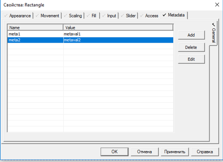

У полі Value можна вказати замінники для джинів %Value% та значення в одинарних лапках `'Equipmnet.value'`.

Під час виконання значення можна змінити, однак, коли графічну сторінку закрито, значення повернеться до початкової конфігурації.

## Використання Metadata

Наведені нижче приклади надають керівництво щодо того, як можна реалізувати метадані у своєму проекті. У першому прикладі ви встановите параметри за допомогою метаданих, а в другому прикладі подивіться, як можна використовувати заміни джина в метаданих.

У перших двох прикладах фабрика фарби повинна контролювати кількість блакитного, пурпурного, жовтого та ключового (чорного) (CMYK), яке змішується для створення різних кольорів у їх діаграмі кольорів.

Третій приклад ілюструє, як заміна назви обладнання в посилання на `equipment.item` під час налаштування Super Genies зменшує необхідність визначення великої кількості метаданих у джині, який його викликає.

### Example 1: Налаштування параметрів за допомогою метаданих 

1. На панелі інструментів виберіть інструмент «number» і в діалоговому вікні «Text Properties» налаштуйте, як показано нижче. Це насос, який представляє блакитний колір.

   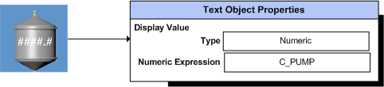

2. Повторіть, щоб створити решту насосів M_ PUMP, Y_ PUMP, B_ PUMP

3. Додайте ці насоси до прикладу проекту як Local Variable tags

4. Створіть об’єкт кнопки. Ця кнопка, вибрана під час виконання, встановить значення CMYK для певного кольору, наприклад, Pine Green

   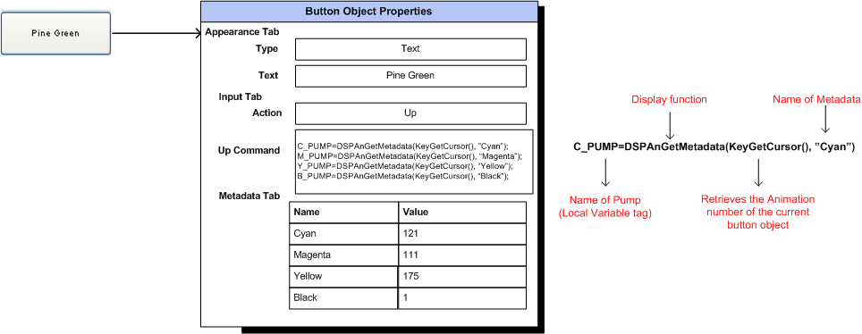

   Для функцій відображення `DspAnGetMetadataAt`, `DspAnSetMetadata`, `DspAnGetMetadata` і `DspAnSetMetadataAt` `-2` є значенням за замовчуванням, яке використовується для отримання унікального номера анімації для об’єкта-кнопки. Якщо вам потрібно знати AN, яка ініціювала введення/команду, може бути використана функція `KeyGetCursor()`, яка повертає AN, де в даний момент знаходиться курсор.

5.  Під час виконання, коли вибрано кнопку «‘Pine green», значення метаданих, визначені для блакитного, пурпурного, жовтого та чорного, витягуються та встановлюються на відповідні насоси.

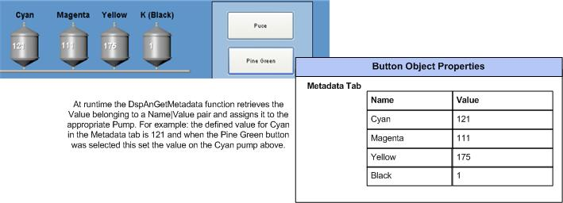       

### Example 2: Використання в Metadata Genie Substitutions

Замість того, щоб створювати нову кнопку для кожного кольору, як ви робили в попередньому прикладі, ви можете створити джина та зберегти його в бібліотеці джинів. Ви можете використовувати джина щоразу, коли вам потрібно створити нову кольорову кнопку. Потрібно лише налаштувати назву кнопки та значення CMYK, які їй належать.

У новому джині створіть кнопку в якій в метаданих поставте замінники e.g %Color% and %Cyan%.

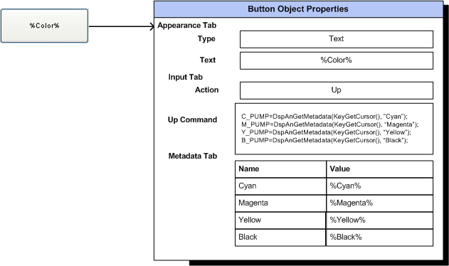

При вставці необхідно ввести значення кольорів.

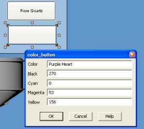

### Example 3: Використання часткових асоціацій в Metadata

Часткові асоціації, де лише частина тегу змінної або посилання на `equipment.item` замінюється (ім’ям) у Super Genie, тепер можна використовувати, щоб зменшити потребу у визначенні великих обсягів метаданих, які нелегко підтримувати.

**Create the Genie**


​        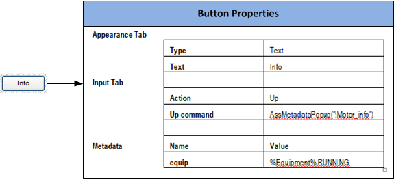    

**Create a Super Genie Library Object**

​    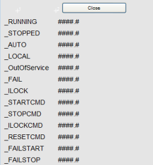


​    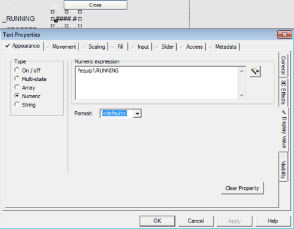    

**Attach the Super Genie to a Genie**

**Paste onto Graphics Page**

​    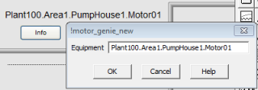    

1. The Equipment name entered will replace the value in the metadata tab (in  your button as part of the genie). For example %Equipment% becomes  Plant100.Area1.PumpHouse1.Motor01.
2. ​        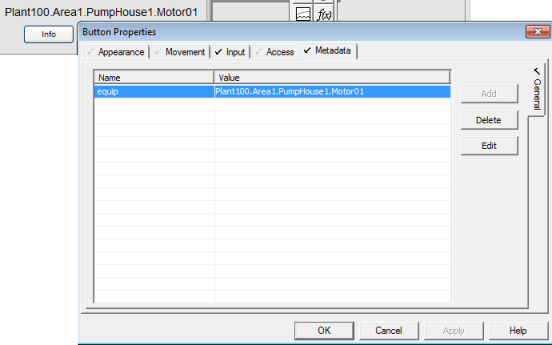    

​	At runtime, when  the ‘info’ button is pressed the values of the equipment are dynamically generated and assigned to the matching Super Genie Association. E.g.  All occurrences of the substitution name ?equip? will be replaced with  Plant100.Area1.PumpHouse1.Motor01 (creating the full equipment.item  reference) and the values for the  equipment.item displayed.

​    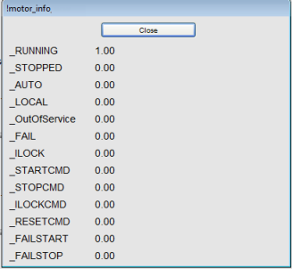

## Passing Animation Point Metadata as Super Genie Associations  

<C:/Program%20Files%20(x86)/AVEVA%20Plant%20SCADA/Bin/Help/SCADA%20Help/Content/Passing_Metadata_as_Super_Genie_Associations.html>

Метадані, які ви визначаєте, можна призначити асоціаціям Super Genie. Назва метаданих і назва асоціації в Super Genie мають бути однаковими. Якщо ім'я збігається, значення, визначене для цього імені | пара значень потім вставляється у відповідне поле «асоціації» в Super Genie. Під час виконання значення динамічно генерується, а потім відображається на сторінці Super Genie.

Під час налаштування об’єкта, який буде викликати Super Genie, ви можете використовувати функцію Cicode, яка виконуватиме асоціації окремо (`DspAnGetMetadataAt()`) або відразу (`AssMetadata()`).

У таблиці нижче наведено можливі результати відображення при передачі метаданих точки анімації як асоціації Super Genie:

де Y = Defined, N= Not Defined, * =N/A, and

**VoE** - used when Tag value is not resolved.

**Default Value** is used when the Metadata Value is not defined

**Empty String** is treated as "Not defined"

| Animation Point Metadata Pairs | Associations | Display Results at runtime |               |                |                |                |                         |
| :----------------------------: | :----------: | :------------------------: | ------------- | -------------- | -------------- | -------------- | ----------------------- |
|              Name              |    Value     |            Name            | Default Value | Value on Error | Tag Resolution | Unresolved Tag | Literal                 |
|               Y                |      Y       |             Y              | Y             | Y              | Tag Value      | VoE            | Literal                 |
|               Y                |      Y       |             Y              | Y             | N              | Tag Value      | #ASC           | Literal                 |
|               Y                |      Y       |             Y              | N             | Y              | Tag Value      | VoE            | Literal                 |
|               Y                |      Y       |             Y              | N             | N              | Tag Value      | #ASC           | Literal                 |
|               Y                |      Y       |             N              | *             | *              | Tag Value      | #ASC           | Literal                 |
|               Y                |      N       |             Y              | Y             | Y              | Default Value  | VoE            | Default Value (literal) |
|               Y                |      N       |             Y              | Y             | N              | Default Value  | #ASC           | N/A                     |
|               Y                |      N       |             Y              | N             | Y              | #ASC           | *              | *                       |
|               Y                |      N       |             Y              | N             | N              | #ASC           | *              | *                       |
|               N                |      N       |             N              | *             | *              | #ASC           | *              | *                       |
|               N                |      *       |             Y              | Y             | Y              | Default Value  | VoE            | Default Value (literal) |
|               N                |      *       |             Y              | Y             | N              | Default Value  | #ASC           | N/A                     |
|               N                |      *       |             Y              | N             | Y              | #ASC           | *              | *                       |
|               N                |      *       |             Y              | N             | N              | #ASC           | *              | *                       |
|               N                |      *       |             N              | *             | *              | #ASC           | *              | *                       |

## Cicode

### AssMetadata

Ця неблокуюча функція виконує асоціації Super Genie за допомогою полів «Name» та «Value», визначених на вкладці «Object Properties - Metadata», і співставляє її з полем «Name» в таблиці асоціацій сторінок. Під час виконання асоціацій будь-які додаткові записи метаданих ігноруються.

**AssMetadata**(*hWin* [, *nAn]*)

*hWin:* The associations will be created for the next Super Genie to display in the window specified. Enter the window number or

- *-3*: for the current window when the page is changed. The page can be changed by using the Page Cicode functions like [PageDisplay](file:///C:/Program Files (x86)/AVEVA Plant SCADA/Bin/Help/SCADA Help/Subsystems/CicodeReferenceCitectHTML/Content/PageDisplay.html), [PageGoto](file:///C:/Program Files (x86)/AVEVA Plant SCADA/Bin/Help/SCADA Help/Subsystems/CicodeReferenceCitectHTML/Content/PageGoto.html), etc.
- *-2*: for the next new window or page displayed.

*nAN:* An animation number that  uniquely identifies an object. This object contains the list of metadata definitions that will be used to perform the association  operations.This parameter is optional with -2 being the default  value.When -2 is specified, it is equivalent to DspGetAnCur() which  returns the animation number of the current active command cursor,  please refer [DspGetAnCur()](file:///C:/Program Files (x86)/AVEVA Plant SCADA/Bin/Help/SCADA Help/Subsystems/CicodeReferenceCitectHTML/Content/DspGetAnCur.html) for usage and limitations. 

Return Value: 0 (zero) if successful, otherwise an [error code](file:///C:/Program Files (x86)/AVEVA Plant SCADA/Bin/Help/SCADA Help/Subsystems/CicodeReferenceCitectHTML/Content/Cicode_and_General_Errors.html) is returned.When using partial associations, an error 274 may be  returned even though the association is successful, and can be ignored.

```pascal
/* Example of calling AssMetadata after other cicode functions */
An = DspGetAnCur();
SomeVal = TagRead("SomeTag");	// do additional work
AssMetadata(-2, An);
PageOpen("!TestSG");
```

### AssMetadataPage

Використовує інформацію метаданих з поточного об’єкта для асоціацій сторінок для нової сторінки Super Genie і відображає новий Super Genie (на поточній сторінці).

**AssMetadataPage**(*sPage* [,*nAN*])

*sPage:* The name of the Super Genie page to open.

*nAN:*  An animation number that  uniquely identifies an object. This object contains the list of metadata definitions that will be used to perform the association  operations.This parameter is optional with -2 being the default value.  When -2 is specified, it is equivalent to DspGetAnCur() which returns  the animation number of the current active command cursor, please refer [DspGetAnCur()](file:///C:/Program Files (x86)/AVEVA Plant SCADA/Bin/Help/SCADA Help/Subsystems/CicodeReferenceCitectHTML/Content/DspGetAnCur.html) for usage and limitations. 

Return Value: 0 (zero) if successful, otherwise an [error code](file:///C:/Program Files (x86)/AVEVA Plant SCADA/Bin/Help/SCADA Help/Subsystems/CicodeReferenceCitectHTML/Content/Cicode_and_General_Errors.html) is returned.

Example

```pascal
/* Example of calling AssMetadataPage after other cicode functions */
An = KeyGetCursor();
SomeVal = TagRead("SomeTag"); 	// do additional work
AssMetadataPage("!TestSG", An);
```

### AssMetadataPopUp

Використовує інформацію метаданих з поточної точки анімації для асоціацій для нової сторінки Super Genie і відображає нового Super Genie у спливаючому вікні.

**AssMetadataPopUp**(*sPage* [,*nAN*])

*sPage:* The name of the Super Genie page to open.

*nAN:*  An animation number that  uniquely identifies an object. This object contains the list of metadata definitions that will be used to perform the association  operations.This parameter is optional with -2 being the default value.  When -2 is specified, it is equivalent to DspGetAnCur() which returns  the animation number of the current active command cursor, please refer [DspGetAnCur()](file:///C:/Program Files (x86)/AVEVA Plant SCADA/Bin/Help/SCADA Help/Subsystems/CicodeReferenceCitectHTML/Content/DspGetAnCur.html) for usage and limitations. 

Return Value: 0 (zero) if successful, otherwise an [error code](file:///C:/Program Files (x86)/AVEVA Plant SCADA/Bin/Help/SCADA Help/Subsystems/CicodeReferenceCitectHTML/Content/Cicode_and_General_Errors.html) is returned.

```pascal
/* Example of calling AssMetadataPopup after other cicode functions */
An = DspGetAnCur();
SomeVal = TagRead("SomeTag"); 	// do additional work
AssMetadataPopup("!TestSG", An);
```

### AssMetadataWin 

Використовує інформацію метаданих з поточної точки анімації для асоціацій для нової сторінки Super Genie і відображає нового Super Genie у новому вікні.

**AssMetadataWin**(*sPage, INT x, INT y, INT mode* [,*nAN*])

*sPage:* The name of the Super Genie page to open.

*X:* The x pixel coordinate of the top left corner of the window. Default value is 0.

*Y:* The y pixel coordinate of the top left corner of the window. Default value is 0.

*Mode:* The mode of the window:

- *0* - Normal page (default value).
- *1* - Page  child window. The window is closed when a new page is displayed, for  example, when the PageDisplay() or PageGoto() function is called. The  parent is the current active window.

- *2* - Window  child window. The window is closed automatically when the parent window  is freed with the WinFree() function. The parent is the current active  window.

- *4* - No re-size. The window is displayed with thin borders and no maximize/minimize icons. The window cannot be re-sized.

- *8* - No icons. The window is displayed with thin borders and no maximize/minimize or  system menu icons. The window cannot be re-sized.

- *16* - No  caption. The window is displayed with thin borders, no caption, and no  maximize/minimize or system menu icons. The window cannot be re-sized.

- *32* - Echo  enabled. When enabled, keyboard echo, prompts, and error messages are  displayed on the parent window. This mode should only be used with child windows (for example, Mode 1 and 2).

- *64* - Always on top.

- *128* - Open a unique window. This mode stops this window from being opened more then once.

- *256* - Display the entire window. This mode commands that no parts of the window will appear off the screen

- *512* - Open a  unique Super Genie. This mode stops a Super Genie from being opened more than once (at the same time). However, the same Super Genie with  different associations can be opened.

- *1024* - Disables dynamic resizing of the new window, overriding the setting of the [Page]DynamicSizing parameter.

- *4096* - Allows the window to be resized without maintaining the current aspect ratio.  The aspect ratio defines the relationship between the width and the  height of the window, which means this setting allows you to stretch or  compress the window to any proportions. This option overrides the  setting of the [Page]MaintainAspectRatio parameter.

- *8192* - Text  on a page will be resized in proportion with the maximum scale change  for a resized window. For example, consider a page that is resized to  three times the original width, and half the original height. If this  mode is set, the font size of the text on the page will be tripled (in  proportion with the maximum scale). This option overrides the setting of the [Page] ScaleTextToMax parameter.

- *16384* - Hide the horizontal scroll bar.

- *32768* - Hide the vertical scroll bar.

- *65536* - Disable horizontal scrolling.

- *131072* - Disable vertical scrolling.

- You can select multiple modes  by adding modes together (for example, set Mode to 9 to open a page  child window without maximize, minimize, or system menu icons).


*nAN:*   An animation number that  uniquely identifies an object. This object contains the list of metadata definitions that will be used to perform the association  operations.This parameter is optional with -2 being the default  value.When -2 is specified, it is equivalent to DspGetAnCur() which  returns the animation number of the current active command cursor,  please refer [DspGetAnCur()](file:///C:/Program Files (x86)/AVEVA Plant SCADA/Bin/Help/SCADA Help/Subsystems/CicodeReferenceCitectHTML/Content/DspGetAnCur.html) for usage and limitations. 

Return Value: 0 (zero) if successful, otherwise an [error code](file:///C:/Program Files (x86)/AVEVA Plant SCADA/Bin/Help/SCADA Help/Subsystems/CicodeReferenceCitectHTML/Content/Cicode_and_General_Errors.html) is returned.

```
/* Example of calling AssMetadataWin after other cicode functions */
An = DspGetAnCur();
SomeVal = TagRead("SomeTag"); 	// do additional work
AssMetadataWin("!TestSG", 50, 50, 1, An);
```

### DspAnGetMetadata

Отримує значення поля вказаного запису метаданих.

**DspAnGetMetadata**(*nAN, sMetaName*)

*nAN:* Номер анімації, який однозначно ідентифікує об'єкт. Цей об’єкт містить список означень метаданих, які будуть використовуватися для виконання операцій асоціації. Якщо вказано `-2`, це еквівалентно використанню `DspGetAnCur()`. (Див. [DspGetAnCur](file:///C:/Program Files (x86)/AVEVA Plant SCADA/Bin/Help/SCADA Help/Subsystems/CicodeReferenceCitectHTML/Content/DspGetAnCur.html) щодо використання та обмежень.)

*sMetaName:* Назва запису метаданих, для якого потрібно шукати.

Перш ніж викликати цю функцію, можливо, варто викликати `ErrSet(1)`, щоб вимкнути перевірку помилок, оскільки ця функція генеруватиме апаратну помилку для будь-якого об’єкта, який не має запису метаданих `sMetaName`, і завдання cicode припинить виконання.

Return Value: Значення для вказаних метаданих. Повертає порожній рядок, якщо відповідний запис метаданих не означено, і код помилки, якщо невдалий.


### DspAnGetMetadataAt

Отримує інформацію метаданих за вказаним індексом.

**DspAnGetMetadataAt**(*nAN, nIndex, sField*)

*nAn:* Номер анімації, який однозначно ідентифікує об'єкт. Цей об’єкт містить список означень метаданих, які будуть використовуватися для виконання операцій асоціації. Якщо вказано `-2`, це еквівалентно використанню `DspGetAnCur()`. (Див. [DspGetAnCur](file:///C:/Program Files (x86)/AVEVA Plant SCADA/Bin/Help/SCADA Help/Subsystems/CicodeReferenceCitectHTML/Content/DspGetAnCur.html) щодо використання та обмежень.)

*nIndex:* Індекс метаданих у точці анімації. Індекс заснований на 0; тобто перший запис метаданих має індекс 0, наступний 1 і так далі.

*sField:* Назва поля, з якого потрібно отримати інформацію для метаданих. Підтримувані поля: 

- Name
- Value

Return Value:  Рядок значення поля. Якщо є помилка, повертається порожній рядок. Код помилки можна отримати, викликавши функцію Cicode [IsError](file:///C:/Program Files (x86)/AVEVA Plant SCADA/Bin/Help/SCADA Help/Subsystems/CicodeReferenceCitectHTML/Content/IsError.html) .

### DspAnSetMetadata

Неблокуюча функція, яка встановлює значення вказаного запису метаданих. Елементи метаданих можна встановити за допомогою Cicode лише якщо ім’я налаштовано на вкладці «Властивості об’єкта – метадані» та збережено разом зі сторінкою.

**DspAnSetMetadata**(*nAn, sMetaName, sValue*)

*nAn:* Номер анімації, який однозначно ідентифікує об'єкт. Цей об’єкт містить список означень метаданих, які будуть використовуватися для виконання операцій асоціації. Якщо вказано `-2`, це еквівалентно використанню `DspGetAnCur()`. (Див. [DspGetAnCur](file:///C:/Program Files (x86)/AVEVA Plant SCADA/Bin/Help/SCADA Help/Subsystems/CicodeReferenceCitectHTML/Content/DspGetAnCur.html) щодо використання та обмежень.)

*sMetaName:* Назва запису метаданих, для якого потрібно шукати.

Перш ніж викликати цю функцію, можливо, варто викликати `ErrSet(1)`, щоб вимкнути перевірку помилок, оскільки ця функція генеруватиме апаратну помилку для будь-якого об’єкта, який не має запису метаданих `sMetaName`, і завдання cicode припинить виконання.

*sValue:* встановлювальне значення

### DspAnSetMetadataAt

Неблокуюча функція, яка встановлює значення вказаного запису метаданих. Елементи метаданих можна встановити за допомогою Cicode лише якщо ім’я налаштовано на вкладці «Властивості об’єкта – метадані» та збережено разом зі сторінкою.

**DspAnSetMetadataAt**(*nAN, nIndex, sField, sFieldValue*)

*nAn:* Номер анімації, який однозначно ідентифікує об'єкт. Цей об’єкт містить список означень метаданих, які будуть використовуватися для виконання операцій асоціації. Якщо вказано `-2`, це еквівалентно використанню `DspGetAnCur()`. (Див. [DspGetAnCur](file:///C:/Program Files (x86)/AVEVA Plant SCADA/Bin/Help/SCADA Help/Subsystems/CicodeReferenceCitectHTML/Content/DspGetAnCur.html) щодо використання та обмежень.)

*nIndex:* The index of the metadata in the animation point.

*sField:* The name of the field in which to set the information for the metadata. Supported fields are:

- Name
- Value

*sFieldValue:* The value to set in the specified field of the metadata entry.

**Note**: Clusters should be configured  either directly by specifying a full tag name such as C1.TagA or  indirectly via the function calls (such as WinNewAt(…)) or via the page  configuration parameter.

Return Value: 0 if successful, error code if unsuccessful

### DspGetMetadataFromName 	

Ім’я, яке використовується для отримання метаданих об’єкта на сторінці. Використовуйте такий синтаксис відносного шляху:

`[RelativePath].[Group].[Group].Control`

Це дозволить переглянути ієрархію групи до певної початкової точки, а потім перейти до інших груп, щоб знайти названий елемент керування або об’єкт і метадані. Дивіться  [Referencing an object using a name at runtime](C:/Program Files (x86)/AVEVA Plant SCADA/Bin/Help/SCADA Help/Subsystems/CicodeReferenceCitectHTML/Content/Referencing_an_object_using_a_name_at_runtime.html)  для отримання додаткової інформації.

**DspGetMetadataFromName**(*sName*, *sMetaName*)

sName: Ім'я, що використовується як посилання на об'єкт.

sMetaName: The name of the metadata to be returned.

Ім’я, що належить до пари ім’я/значення метаданих, визначеної на вкладці метаданих властивостей об’єкта. Додаткову інформацію дивіться в темі Метадані в основній довідці.

Return Value: Значення метаданих або пусто.

### DspGetMetadataFromNameRelative 	

Ім’я, яке використовується для отримання метаданих об’єкта на сторінці щодо заданого Animation Number (AN). Використовуйте наступний синтаксис:

`[RelativePath].[Group].[Group].Control`

Це дозволить переглянути ієрархію груп із заданої AN, а потім перейти до інших груп, щоб знайти названий елемент керування або об’єкт. Дивіться [Referencing an object using a name at runtime](file:///C:/Program Files (x86)/AVEVA Plant SCADA/Bin/Help/SCADA Help/Subsystems/CicodeReferenceCitectHTML/Content/Referencing_an_object_using_a_name_at_runtime.html) для отримання додаткової інформації. .

**DspGetMetadataFromNameRelative**(*hAN*, *sName*, *sMetaName*)

hAN: AN використовується як відправна точка для пошуку.

**Note**: За допомогою AN ви можете почати пошук з будь-якого рівня, а не лише з групи, до якої ви перебуваєте.

sName: Ім'я AN, що використовується як посилання на об'єкт.

sMetaName: Ім’я метаданих, які потрібно повернути.

Ім’я, що належить до пари ім’я/значення метаданих, визначеної на вкладці метаданих властивостей об’єкта. Додаткову інформацію дивіться в темі **Метадані** в основній довідці.

Return Value:  Значення метаданих або пробіл.

### DspSetMetadataFromName 	

Name used to set the metadata of an object on the page. Use the following syntax:

[RelativePath].[Group].[Group].Control

Syntax

**DspSetMetadataFromName**(*sName*, *sMetaName*, *sValue*)

sName

The Name used as a reference for the  object. 

sMetaName

The Name of the metadata to be returned.

sValue

The value of the metadata to be returned.

Return Value

The value of the metadata or error code.

### DspSetMetadataFromNameRelative 	

Name used to set the metadata of an object on the page relative to the given AN. Use the following syntax:

[RelativePath].[Group].[Group].Control

This will browse the group hierarchy to the given AN, and then drill down to other groups to find the named control or object.

See [Referencing an object using a name at runtime](file:///C:/Program Files (x86)/AVEVA Plant SCADA/Bin/Help/SCADA Help/Subsystems/CicodeReferenceCitectHTML/Content/Referencing_an_object_using_a_name_at_runtime.html)  for more information.

Syntax

**DspSetMetadataFromNameRelative**(*hAN*, *sName*, *sMetaName*, *sValue*)

hAN

AN used as the starting point for the search of the object name.

sName

The Name used as a reference for the  object. 

sMetaName

The Name of the metadata to be returned.

sValue

The Name of the metadata to be returned.

Return Value

The value of the metadata or error code

### Referencing an Object Using a Name at Runtime

Використання Cicode функцій [DspGetAnFromName](file:///C:/Program Files (x86)/AVEVA Plant SCADA/Bin/Help/SCADA Help/Subsystems/CicodeReferenceCitectHTML/Content/DspGetAnFromName.html), [DspGetMetadataFromName](file:///C:/Program Files (x86)/AVEVA Plant SCADA/Bin/Help/SCADA Help/Subsystems/CicodeReferenceCitectHTML/Content/DspGetMetadataFromName.html) [DspGetAnFromNameRelative](file:///C:/Program Files (x86)/AVEVA Plant SCADA/Bin/Help/SCADA Help/Subsystems/CicodeReferenceCitectHTML/Content/DspGetAnFromNameRelative.html) and [DspGetMetadataFromNameRelative](file:///C:/Program Files (x86)/AVEVA Plant SCADA/Bin/Help/SCADA Help/Subsystems/CicodeReferenceCitectHTML/Content/DspGetMetadataFromNameRelative.html) для посилання на об’єкти на сторінці, у джині, групі та символі.

При посиланні на об’єкти важливо пам’ятати про наступні моменти:

- При посиланні на об'єкт всередині джина, групи або символу вам потрібно використовувати відносний синтаксис шляху. Це означає, що ви можете шукати «вгору» або «вниз» об’єкти всередині джина, символу та/або групи.
- Ім'я завжди відносно об'єкта, на який ви посилаєтеся.
- Якщо посилатися на об'єкт всередині групи, він шукатиме лише в групі, до якої належить об'єкт.
- Якщо посилається на об'єкт на рівні групи, він шукатиме об'єкт по визначених шляхах.
- **Using the Syntax**                

- “Name” – Used at page level. This is a fully qualified name.
- “.Name” - References itself, either in a group, genie or symbol.
-  “..\Name” – References objects within a group.
- «Name» – використовується на рівні сторінки. Це повна назва.
- “.Name” – посилання на себе у групі, джині або символі.
- “..\Name” – посилання на об’єкти в групі.

Наприклад: Наведена нижче діаграма містить об’єкти та текст на сторінці, а також об’єкти та текст у групах A, B та C. Ієрархія перегляду дерева була використана, щоб проілюструвати, як можна застосувати посилання. 

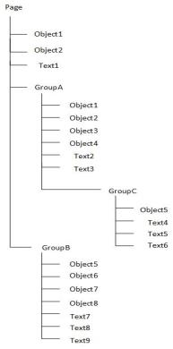                    

| Referenced Object                                            | Syntax                                                       | Description                                                  |
| ------------------------------------------------------------ | ------------------------------------------------------------ | ------------------------------------------------------------ |
| To reference "Object1" from Object2 at the root or page level | `DspGetAnFromName("Object1") `                               | Object1 is a fully qualified name. Searches at page level for this object. |
| To reference "Object1" from Object2 at the root or page level. | `DspGetMetadataFromName("Object1","Pump")`                   | Object1 is a  fully qualified name. Pump is the name of the metadata defined in  Object1. Searches the page level for Object1 and the metadata name. |
| To reference "Object1" in GroupA from Object2 from the root level | `DspGetAnFromName("GroupA.Object1")`                         | "GroupA.Object2" is a fully qualified name. From the root (page) level search for Object1 within GroupA. |
| To reference "Object5" in GroupC from Object2 at the root level | `DspGetAnFromName("GroupA.GroupC.Object5") `                 | "GroupA.GroupC.Object5" is a fully qualified name. From the root (page)level  search for Object5 within GroupC and GroupA. |
| To reference“Object1” in GroupA from Object4                 | `DspGetAnFromName(".Object1")`                               | “.Object1”. This means  search for Object1 in the current group. |
| To reference“Object2” in GroupA from Object8 in Group B      | `DspGetAnFromName(“..\..\GroupA.Object2”)`                   | “..\..\GroupA.Object2”  Navigate two levels up the hierarchy, which will be root (page) level, and then search for GroupA and within Group A, Object2. |
| To reference“Object2” in GroupA from Text8 in Group B        | `DspGetAnFromNameRelative(639,"..\..\GroupA.Object2")`       | From AN 639 and "..\..\GroupA.Object2" navigate two levels up the hierarchy and search for Group A and within Group A, Object2.**Note:**639 is the  animation number for Text8 once pasted on the graphics page within GroupB. |
| To reference“Object2” in GroupA from Text8 in Group B        | `DspGetMetadataFromName("..\..\GroupA.Object2", "Meter")`    | “..\..\GroupA.Object2”  Navigate two levels up the hierarchy which will be from the root  (page)level, and then search for GroupA and within Group A, Object2,  where the name of the metadata is "Meter". |
| To reference "Object1" at the root level from Object5 in GroupC | `DspGetAnFromName(“..\..\..\Object1”)`                       | “..\..\..\Object1” Navigate three levels up the hierarchy which will be from the root (page)level, and then search for Object1. |
| To reference "Object1" at the root level from Text5 in GroupC | `DspGetMetadataFromNameRelative(625, "..\..\..\Object1", "Pump")` | From AN 625 navigate three levels up and from the root level search for Object1 where the name of the metadata  is Pump.**Note**: 625 is the animation number for Text6 once pasted on the page within GroupC. |

**Note**: При посиланні на об’єкт у групі шукатимуться лише ті об’єкти в групі, до якої належить об’єкт. Наприклад: якщо ви посилаєтеся на Object1 у групі A з Object7 у GroupB за допомогою синтаксису «..\Object1», буде повернуто помилку, оскільки в GroupB немає Object1. Правильний синтаксис для використання – «..\..\GroupA.Object1».

## Автоматизація Graphic Builder

### PropertiesSelectMetadataByName

Вибирає вказані метадані на поточній сторінці.

**PropertiesSelectMetadataByName(BSTR Name)** 

*Name:* The name of the metadata to be selected.

Return Value: 

0 (zero) if successful, otherwise an error is returned.

Example

Determining whether an metadata with a particular name exists:

```
On Error Resume Next
Err.Clear()
GraphicsBuilder.PropertiesSelectMetadataByName("MyName")
If (Err.Number <> 0)
    ' The metadata does not exist
End If
```

PropertiesDeleteMetadata

Deletes the selected metadata from the  properties of the current object. After an item has been deleted, a call to PropertiesSelectNextMetadata  will select the item immediately following the deleted item.

Syntax 

### PropertiesDeleteMetadata()

Return Value 

0 (zero) if successful, otherwise an error is returned.

Example

delete any metadata starting with “a”:

```
Dim name As String
On Error Resume Next
Err.Clear()
GraphicsBuilder.PropertiesSelectFirstMetadata()
While (Err.Number = 0)
    name = GraphicsBuilder.PropertiesMetadataName
    If (name.ToLower().StartsWith("a")) Then
        GraphicsBuilder.PropertiesDeleteMetadata()
    End If
    GraphicsBuilder.PropertiesSelectNextMetadata()
End While
```

### PropertiesAddMetadata

Adds a new metadata entry to the current  object properties. This function will return an error if metadata with  the specified name already exists.

Syntax 

PropertiesAddMetadata (Name, Value)

*Name:* 

The name of the new metadata entry to be added to the properties of the current object

*Value:* 

​	The value of the new metadata to be added to the current object properties.

Return Value 

0 (zero) if successful, otherwise an error is returned.

Example

Adding a new element and setting its properties:

```
GraphicsBuilder.PropertiesAddMetadata("MyName","MyValue")
```

### PropertiesSelectFirstMetadata

Selects the first metadata entry from the properties of the current object.

Syntax 

PropertiesSelectFirstMetadata()

Return Value 

0 (zero) if successful, otherwise an error is returned.

Example

Determines whether the page properties of thecurrent object has defined metadata:

```
On Error Resume Next
Err.Clear()
GraphicsBuilder.PropertiesSelectFirstMetadata()
If (Err.Number <> 0)
    ' The object has no metadata
End If
```

### PropertiesSelectNextMetadata

Selects the next metadata entry from the properties of the current object.

Syntax 

PropertiesSelectNextMetadata()

Return Value 

0 (zero) if successful, otherwise an error is returned.

Example

Print metadata entries in the current object properties:

```
On Error Resume Next
Err.Clear()
GraphicsBuilder.PropertiesSelectFirstMetadata()
While (Err.Number = 0)
    Console.Out.WriteLine(GraphicsBuilder.PropertiesMetadataName)
    GraphicsBuilder.PropertiesSelectNextMetadata()
End While
```

### PropertiesMetadataName

Sets or retrieves the name of the currently selected object metadata.

Syntax 

*Name* = PropertiesMetadataName
PropertiesMetadataName (Name)

Return Value 

The name of the currently selected metadata item (as a string). An error is returned if unsuccessful.

### PropertiesMetadataValue

Sets or retrieves the value of the currently selected object metadata.

Syntax 

*Val* = PropertiesMetadataValue

PropertiesMetadataValue(*Def*)

Return Value 

The value of the currently selected  metadata (as a string), or 0 (zero) if successfully used to set the  default. An error is returned if unsuccessful.