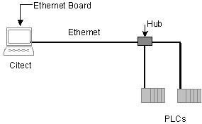
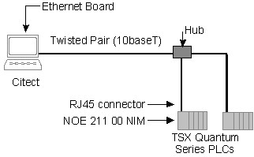

# MODNET Driver

The MODNET protocol supports TCP/IP communication with Modicon™ [TSX Quantum™ and Premium™ PLCs](mk:@MSITStore:C:\Program Files (x86)\AVEVA\Citect SCADA 2018 R2\Bin\MODNET.chm::/tsxq99dj.htm) and a  number of [MODBUS/TCP](mk:@MSITStore:C:\Program Files (x86)\AVEVA\Citect SCADA 2018 R2\Bin\MODNET.chm::/modb96if.htm) compatible devices. The maximum request length for the MODNET protocol is 1920. 

## Supported Devices

The MODNET driver supports MODBUS communications via TCP/IP for the following devices:

- Generic MODBUS devices via TCP/IP
- Modicon™ TSX Quantum™ and Premium™ PLCs

Note: To support a wide range of Modbus/TCP devices, there are a number of variants of the MODNET protocol. See the topic [MODNET Protocol Variants](mk:@MSITStore:C:\Program Files (x86)\AVEVA\Citect SCADA 2018 R2\Bin\MODNET.chm::/protocol_variants.htm) to determine which variant you should use when configuring a device. 

### Generic MODBUS TCP/IP Devices

The MODNET Driver supports TCP/IP communication to devices supporting MODBUS/TCP over Ethernet. Using this method you can connect to single or multiple PLCs as in the following diagram:

     

Note:  The same Ethernet card that is being used for Citect SCADA communication can be used for PLC communication though this may lower performance.

#### Generic MODBUS TCP/IP Devices - Device Address 

The information you enter here will be placed in the Special Options field of the Ports form, with the following format:

-Ia -Pn  -T

where:

a Is the IP address in standard Internet dot format. (For example 192.9.2.60)

n The destination Port number. Often one physical port has several virtual ports, used for different purposes. The default is 502.

-T Forces the driver to use TCP, rather than UDP (-U).

See [Generic MODBUS TCP/IP devices](mk:@MSITStore:C:\Program Files (x86)\AVEVA\Citect SCADA 2018 R2\Bin\MODNET.chm::/modb96if.htm) for more information about this setup.

#### Generic MODBUS TCP/IP Devices - Hardware Setup 

##### Citect SCADA Computer Setup

It is recommended that you setup your specific Ethernet card as required and confirm basic network communications before proceeding with the communications configuration for the MODNET driver. Refer to the documentation accompanying your hardware for instruction.

#### Generic MODBUS TCP/IP Devices - Communications Forms 

To establish communication with a device, the Boards Form, Ports Form and I/O Devices Form need to be correctly configured in Project Editor. If you use the Express Communications Wizard to connect to a device, these forms will be automatically configured for you. However, if you need to manually configure these forms, or verify that the fields are correct, use the settings outlined below.

##### Boards Form 

| Field           | Value                    |
| --------------- | ------------------------ |
| Board Type      | Enter TCPIP .            |
| Address         | Enter 0 .                |
| I/O Port        | Leave this field blank . |
| Interrupt       | Leave this field blank.  |
| Special Options | Leave this field blank.  |

##### Ports Form

| Field           | Value                                                        |
| --------------- | ------------------------------------------------------------ |
| Port Number     | A valid unique number.                                       |
| Baud Rate       | Leave this field blank.                                      |
| Data Bits       | Leave this field blank.                                      |
| Stop Bits       | Leave this field blank.                                      |
| Parity          | Leave this field blank.                                      |
| Special Options | Enter the destination IP address of the PLC. Use the following format:-Ia -Pn  -T                         where:a =  the IP address in standard Internet dot format. (For example 192.9.2.60)n = the destination Port number. Often one physical port has several virtual ports, used for different purposes. Use this option only if you want to override the default of 502.-T = forces the driver to use TCP, rather than UDP (-U). |

##### I/O Devices Form

| Field               | Value                                                        |
| ------------------- | ------------------------------------------------------------ |
| I/O Device Address  | If the connection to the I/O device is point-to-point using TCP/IP, leave this field blank. A value of 0 is assigned by default. If the connection to the I/O device is through MODBUS/TCP to MODBUS serial line gateway, use the slave address of I/O device.Note: To enable broadcast through MODBUS/TCP to MODBUS serial line gateway, an I/O device should be created with address value 0. All the broadcast request should be sent to this I/O device. Refer to parameters Broadcast and BroadcastDelay for details. |
| I/O Device Protocol | Enter the MODNET protocol variant. (See [MODNET Protocol Variants](mk:@MSITStore:C:\Program Files (x86)\AVEVA\Citect SCADA 2018 R2\Bin\MODNET.chm::/protocol_variants.htm) to determine which variant is required.) |

#### Generic MODBUS TCP/IP Devices - Data Types 

Note: The address ranges specified in the following table will be appropriate for most generic Modbus devices. However, you should check the capabilities of a device to confirm if it will support the extent of the ranges suggested.

| Data Types                                     | Valid Address Range | Address Format                                               | Citect SCADA Data Type                     |
| ---------------------------------------------- | ------------------- | ------------------------------------------------------------ | ------------------------------------------ |
| Output Coils                                   | 000001 - 065536     | Valid address                     (e.g. 001000)              | DIGITAL                                    |
| Input Status                                   | 100001 - 165536     | Valid address                     (e.g. 103000)              | DIGITAL                                    |
| Input Registers                                | 300001 - 365536     | Valid address                     (e.g. 301350)              | INT/ REAL/ LONG/ BCD/ LONGBCD              |
| Input Registers                     (DIGITAL)  | 300001 - 365536     | Valid address.b, where b  is the bit number between 1 and 16 inclusive (e.g. 302300.2) | DIGITAL                                    |
| Output Registers                               | 400001 - 465536     | Valid address (e.g. 401190)                                  | INT/ REAL/ LONG/ BCD/ LONGBCD              |
| Output Registers                     (DIGITAL) | 400001 - 465536     | Valid address.b  where b  is the bit number between 1 and 16 inclusive                     (e.g. 40001.4) | DIGITAL                                    |
| Extended registers                             |                     | EF:R where:  E denotes the extended register.                     F is the file number between 1 and 16 inclusive                     R is the register between 0 and 9999 inclusive | INT/ REAL/ LONG/ BCD/ LONGBCD/ STRING      |
| Individual Output Coil Register                | 000001 – 065536     | G Valid address  (e.g.G 001000)                              | DIGITAL                                    |
| Individual Input Coil Status                   | 100001 – 165536     | G Valid address  (e.g. G103000)                              | DIGITAL                                    |
| Individual Input Register                      | 300001 – 365536     | G Valid address  (e.g.G 301350)                              | INT / REAL / LONG / BCD / LONGBCD / STRING |
| Individual Output Register                     | 400001 – 465536     | G Valid address  (e.g. G401190)                              | INT / REAL / LONG / BCD / LONGBCD / STRING |
| Individual Extended Register                   |                     | G EF:R where: E denotes the extended register. F is the file number between 1 and 16 inclusive R is the register between 0 and 9999 inclusive | INT/ REAL / LONG / BCD / LONGBCD / STRING  |

Note:  When writing DIGITAL variables to Output registers, the individual bits in a register (1..16) can be written to with the format n .BitPosition (e.g. 40001.1). Writing to sequential bits requires individual write commands. The user can specify the bit order direction in the INI parameter [[MODNET\]RegisterBitReverse](mk:@MSITStore:C:\Program Files (x86)\AVEVA\Citect SCADA 2018 R2\Bin\MODNET.chm::/MODNET_common_citectini_driver_parameters.htm#[MODNET]RegisterBitReverse).

EXAMPLES:         

| Data Type | DIGITAL     |
| --------- | ----------- |
| Address   | 000006      |
| Comment   | Output Coil |

| Data Type | LONGBCD        |
| --------- | -------------- |
| Address   | 300019         |
| Comment   | Input Register |

### TSX Quantum™ and Premium™ PLCs

The MODNET Driver supports TCP/IP method of communication to the TSX Quantum and Premium PLCs, manufactured by Modicon. Using this method you can connect to single or multiple TSX Quantum or Premium PLCs as in the following diagram:

Note:             

1) The same Ethernet card that is being used for Citect SCADA communication can be used for PLC communication though this may lower performance.
2) The hub is necessary even if connecting to only one PLC.

#### TSX Quantum™ and Premium™ PLCs - Device Address 

The information you enter here will be placed in the Special Options field of the Ports form, with the following format:

-Ia -Pn  -T

where:

a Is the IP address in standard Internet dot format. (For example 192.9.2.60)

n The destination Port number. Often one physical port has several virtual ports, used for different purposes. The default is 502.

-T Forces the driver to use TCP, rather than UDP (-U).

See the [TSX Quantum PLC TCP_IP Overview](mk:@MSITStore:C:\Program Files (x86)\AVEVA\Citect SCADA 2018 R2\Bin\MODNET.chm::/tsxq99dj.htm) for more information about this setup.

#### TSX Quantum™ and Premium™ PLCs - Hardware Setup 

##### Citect SCADA Computer Setup

It is recommended that you setup your specific Ethernet card as required and confirm basic network communications before proceeding with the communications configuration for the MODNET driver. Refer to the documentation accompanying your hardware for instruction.

#### TSX Quantum™ and Premium™ PLCs - Communications Forms 

To establish communication with a device, the Boards Form, Ports Form and I/O Devices Form need to be correctly configured in Project Editor. If you use the Express Communications Wizard to connect to a device, these forms will be automatically configured for you. However, if you need to manually configure these forms, or verify that the fields are correct, use the settings outlined below.

##### Boards Form

| Field           | Value                   |
| --------------- | ----------------------- |
| Board Type      | Enter TCPIP.            |
| Address         | Enter 0.                |
| I/O Port        | Leave this field blank. |
| Interrupt       | Leave this field blank. |
| Special Options | Leave this field blank. |

##### Ports Form

| Field           | Value                                                        |
| --------------- | ------------------------------------------------------------ |
| Port Number     | A valid unique number.                                       |
| Baud Rate       | Leave this field blank.                                      |
| Data Bits       | Leave this field blank.                                      |
| Stop Bits       | Leave this field blank.                                      |
| Parity          | Leave this field blank.                                      |
| Special Options | Enter the destination IP address of the PLC. Use the following format:-Ia -Pn  -T                         where:a =  the IP address in standard Internet dot format. (For example 192.9.2.60)n = the destination Port number. Often one physical port has several virtual ports, used for different purposes. Use this option only if you want to override the default of 502.-T = forces the driver to use TCP, rather than UDP (-U). |

##### I/O Devices Form

| Field               | Value                                                        |
| ------------------- | ------------------------------------------------------------ |
| I/O Device Address  | Leave this field blank. A value of 0 is assigned by default. |
| I/O Device Protocol | Enter the MODNET protocol variant. (See [MODNET Protocol Variants](mk:@MSITStore:C:\Program Files (x86)\AVEVA\Citect SCADA 2018 R2\Bin\MODNET.chm::/protocol_variants.htm) to determine which variant is required.) |

#### TSX Quantum™ and Premium™ PLCs - Data Types 

| Data Types                          | Valid Address Range | Address Format                                               | Citect SCADA Data Type                     |
| ----------------------------------- | ------------------- | ------------------------------------------------------------ | ------------------------------------------ |
| Output Coils                        | 000001 - 065536     | Valid address (e.g. 01000)                                   | DIGITAL                                    |
| Output Coils (Memory)               | 000001 – 065536     | %M Valid address  (e.g. %M7)                                 | DIGITAL                                    |
| Input Status                        | 100001 - 165536     | Valid address  (e.g. 11001)                                  | DIGITAL                                    |
| Input Registers                     | 300001 - 365536     | Valid address (e.g. 31350)                                   | INT/ REAL/ LONG/ BCD/ LONGBCD              |
| Input Registers (DIGITAL)           | 300001 - 365536     | Valid address.b where b  is the bit number between 1 and 16 inclusive (e.g. 32300.2) | DIGITAL                                    |
| Output Registers                    | 400001 - 465536     | Valid address (e.g. 41190)                                   | INT/ REAL/ LONG/ BCD/ LONGBCD              |
| Output Registers (Memory)           | 000001 – 065536     | %MW Valid address  (e.g. %MW3)                               | INT/ REAL/ LONG/ BCD/ LONGBCD              |
| Output Registers (DIGITAL)          | 400001 - 465536     | Valid address.b where b  is the bit number between 1 and 16 inclusive (e.g. 40001.4) | DIGITAL                                    |
| Output Registers (DIGITAL) (Memory) | 000001 – 065536     | %MW valid address.b where b is the bit number between 1 and 16 inclusive  (e.g. %MW4.6) | DIGITAL                                    |
| Extended registers                  |                     | EF:R where:E denotes the extended register.F is the file number between 1 and 16 inclusive.R is the register between 0 and 9999 inclusive. | INT/ REAL/ LONG/ BCD/ LONGBCD/ STRING      |
| Individual Output Coil Register     | 000001 – 065536     | G Valid address  (e.g. G001000)                              | DIGITAL                                    |
| Individual Input Coil Status        | 100001 – 165536     | G Valid address  (e.g. G103000)                              | DIGITAL                                    |
| Individual Input Register           | 300001 – 365536     | G Valid address  (e.g. G301350)                              | INT / REAL / LONG / BCD / LONGBCD / STRING |
| Individual Output Register          | 400001 – 465536     | G Valid address  (e.g. G401190)                              | INT / REAL / LONG / BCD / LONGBCD / STRING |
| Individual Extended Register        |                     | G EF:R where: E denotes the extended register. F is the file number between 1 and 16 inclusive R is the register between 0 and 9999 inclusive | INT/ REAL / LONG / BCD / LONGBCD / STRING  |

Note:  When writing DIGITAL variables to output registers, the individual bits in a register (1..16) can be written to with the format n.BitPosition (e.g. 40001.1). Writing to sequential bits requires individual write commands. The user can specify the bit order direction in the INI parameter [[MODNET\]RegisterBitReverse](mk:@MSITStore:C:\Program Files (x86)\AVEVA\Citect SCADA 2018 R2\Bin\MODNET.chm::/MODNET_common_citectini_driver_parameters.htm#[MODNET]RegisterBitReverse).

EXAMPLES:         

| Data Type | DIGITAL     |
| --------- | ----------- |
| Address   | 00036       |
| Comment   | Output Coil |

| Data Type | LONGBCD        |
| --------- | -------------- |
| Address   | 30019          |
| Comment   | Input Register |

## MODNET Protocol  Variants 

Many devices from different vendors support the Modbus/TCP protocol. Unfortunately addressing structures used by these devices vary. The following information will help you understand which protocol you should select on the I/O devices dialog box to make the addresses you enter into the variables form match those entered into the programming software for your device.     

You will need to know the following:     

1. What is the lowest register/coil number in the device? 
2. Some devices (such as a TSX Quantum or Modicon 948) have register/coil 1 as the lowest register/coil number. Other devices (such as the TSX Premium) have register/coil 0 as the lowest register/coil number        

3. When addressing an individual bit from a register, what is the lowest bit number? 
4. Some devices refer to the bits within a register as bits 0-15, others refer to them as bits 1-16.        

Based on the above information you can select a protocol using the following table:     

| Range of bits in a register | Lowest coil / register number | Protocol         |
| --------------------------- | ----------------------------- | ---------------- |
| 1-16                        | 1                             | MODNET (default) |
| 1-16                        | 0                             | MODNET1          |
| 0-15                        | 1                             | MODNET2          |
| 0-15                        | 0                             | MODNET3          |

If you are using a PLC that supports extended registers (6xxxxx addresses in a TSX Quantum for example) then the following table should be used:     

| Range of bits in a register | Lowest coil / register number | Protocol |
| --------------------------- | ----------------------------- | -------- |
| 1-16                        | 1                             | MODNET10 |
| 1-16                        | 0                             | MODNET11 |
| 0-15                        | 1                             | MODNET12 |
| 0-15                        | 0                             | MODNET13 |

Two special protocols exist for use with the TSX Quantum and TSX Premium PLC ranges. These protocol options will select the correct addressing modes, select certain INI values and other settings to provide compatibility with these devices without the need to set any other special parameters.      

These protocols also allow you to access memory digitals and memory words using %M7 or %MW3 or %MW4.6 style addressing. Select a protocol as follows:     

| PLC Model   | Protocol |
| ----------- | -------- |
| TSX Quantum | MODNET20 |
| TSX Premium | MODNET30 |

## MODNET Driver Parameters 

Note: Always seek the advice of Technical Support personnel for this product regarding undocumented features.

| [MODNET] Parameter name                  | Description                                                  | Allowable values                                             | Default value                        |
| ---------------------------------------- | ------------------------------------------------------------ | ------------------------------------------------------------ | ------------------------------------ |
| Broadcast                                | Enables or disables broadcast through a gateway.The 'broadcast' mechanism is designed to allow an I/O Device configured with address '0' to come online and be used to send write requests to the Modbus network through a gateway.  Some devices will interpret this address as a 'broadcast' address and accept the write request.  Consequently, there will be no acknowledgment of the message. The ini parameter is configured as: [MODNET.<port_name>.<iodevice_name>]  Broadcast | 1 – Write request will be issued. 0 – Broadcast disabled.    | 0                                    |
| BroadcastDelay                           | Time delay before replying to broadcast write requests in milliseconds. | 1-65535                                                      | 50                                   |
| ConnTimeout                              | Timeout period for channel initialization in milliseconds.   | 1 - 65535 (milliseconds)                                     | 15000                                |
| Debug                                    | Allows extra debug information to be displayed in the kernel window and logged into the syslog.dat file.Note: This parameter is only applicable if DebugStr parameter is configured. | 1 - turn on the extra debug information option 0 - turn off the extra debug information option | 0 (zero)                             |
| DebugStr                                 | Enables logging of debug information to be displayed in the kernel window and logged into the syslog.dat file. This ini paramter is configured as: [MODNET] DebugStr = `<port name>` ALL | <port name> ALL – Enables logging for a specific port.   ALL –  Enables logging for all the ports configured. | Disabled                             |
| Delay                                    | The period (in milliseconds) to wait between receiving a response and sending the next command. | 0 to 300 (milliseconds)                                      | 0 (zero)                             |
| FailOnBadData                            | Controls error reporting when BCD or LONG values received from the device are outside the valid range for that type. | 1 – Reports error0 – No error reported                       | 1                                    |
| FloatMode                                | Specifies the order of bytes in REAL variable types.Note: This parameter is not applicable if you are using the [protocol variant](mk:@MSITStore:C:\Program Files (x86)\AVEVA\Citect SCADA 2018 R2\Bin\MODNET.chm::/protocol_variants.htm) MODNET20 or MODNET30 to communicate with a device. Under these circumstances, a  value of 0 (zero) will be hardcoded for this parameter.With this parameter, you can set different values for specific I/O devices or  groups of I/O devices. See [Device/group-specific  Parameters](mk:@MSITStore:C:\Program Files (x86)\AVEVA\Citect SCADA 2018 R2\Bin\MODNET.chm::/modnet_devicegroup-specific_parameters.htm). | 0: Order of bytes =  1 0 3 2;  1: Order of bytes =  3 2 1 0 2: Order of bytes =  0 1 2 3 3: Order of bytes =  2 3 0 1 | 0 (zero)                             |
| ForceMultiCoilsOnly                      | Forces the use of only function code 15 (multiple coils) for coil writes.With this parameter, you can set different values for specific I/O devices or  groups of I/O devices. See [Device/group-specific  Parameters](mk:@MSITStore:C:\Program Files (x86)\AVEVA\Citect SCADA 2018 R2\Bin\MODNET.chm::/modnet_devicegroup-specific_parameters.htm). | 0 - function code 5 and 151 - function code 15 only          | 0 (zero)                             |
| InitVar                                  | Address of the register to read at startup to confirm connections. The address can be provided in two ways: 1.  With configuring InitVarType ini parameter                         InitVar must have the register address and InitVarType must provide the register type. InitVar will be able to support the values 0-65535.Example:[Modnet]InitVar = 39000InitVarType = 3With this configuration during start-up and re-connection the driver will attempt to read Output Register 390002. Without configuring InitVarType ini parameter                         InitVar must have the complete address including the register type. InitVar should be configured as format FR.F : Register type (range : 1-4, 1-Digital read input, 2-Digital read output, 3-Integer read output, 4-Integer read input)R : Register address (range : 0-9999)Example :[Modnet]InitVar = 12345By default, InitVarType will be assigned value 0.With this configuration during start-up and re-connection the driver will attempt to read Input Coil 2345.With this parameter, you can set different values for specific I/O devices or groups of I/O devices.See [Device/group-specific  Parameters](mk:@MSITStore:C:\Program Files (x86)\AVEVA\Citect SCADA 2018 R2\Bin\MODNET.chm::/modnet_devicegroup-specific_parameters.htm). | 0 – 65535                                                    | 40001                                |
| InitVarType                              | The type of register the MODNET driver tries to read on startup to allow communication to start. It is configured with the parameter InitVar.With this parameter, you can set different values for specific I/O devices or groups of I/O devices.See [Device/group-specific  Parameters](mk:@MSITStore:C:\Program Files (x86)\AVEVA\Citect SCADA 2018 R2\Bin\MODNET.chm::/modnet_devicegroup-specific_parameters.htm). | 0 to 4, or 20 (for extended registers access)1 - Digital read input2 - Digital read output3 - Integer read output4 - Integer read input20 – Extended register0 - the value defined for the parameter InitVar will be considered a complete address, having register type. | 0                                    |
| LongDataType                             | In the MODNET protocol, LONG data types default to a simplified implementation, with a shortened range of 0 to 99,999,999 for mode 0. Mode 2 has the same range as mode 0, but with the register order swapped. Mode 1 supports the complete LONG range of -2,147,483,648 to +2,147,483,647. Mode 3 has the same range as mode 1, but with the register order swapped. When using the MODBUS protocol, Citect SCADA combines two registers to store a long data type in a PLC. The way in which it does this is defined by this parameter. Note: This parameter is not applicable if you are using the [protocol variant](mk:@MSITStore:C:\Program Files (x86)\AVEVA\Citect SCADA 2018 R2\Bin\MODNET.chm::/protocol_variants.htm) MODNET20 or MODNET30 to communicate with a device. Under these circumstances, a  value of 3 will be hardcoded for this parameter.With this parameter, you can set different values for specific I/O devices or  groups of I/O devices. See [Device/group-specific  Parameters](mk:@MSITStore:C:\Program Files (x86)\AVEVA\Citect SCADA 2018 R2\Bin\MODNET.chm::/modnet_devicegroup-specific_parameters.htm). | 0 - implies 10,000  low register + high register1 - implies 65,536  low register + high register2 - implies 10,000  high register + low register3 - implies 65,536  high register + low register | 3                                    |
| MaxBits                                  | Sets the maximum number of bits in a block for dynamic blocking. This is normally the same as the MODNET protdir.dbf "max_bits" setting.Note: For [protocol variant](mk:@MSITStore:C:\Program Files (x86)\AVEVA\Citect SCADA 2018 R2\Bin\MODNET.chm::/protocol_variants.htm) MODNET20, this parameter is not applicable. The default value 2000 is used for blocking, ignoring any configured value. For protocol variant MODNET30, this parameter is applicable. The default value is 1024 in this case.With this parameter, you can set different values for specific I/O devices or  groups of I/O devices. See [Device/group-specific  Parameters](mk:@MSITStore:C:\Program Files (x86)\AVEVA\Citect SCADA 2018 R2\Bin\MODNET.chm::/modnet_devicegroup-specific_parameters.htm). | 8 to 2000                                                    | 2000                                 |
| MaxBitsExt                               | This  parameter sets the maximum bits blocked for extended registers.Note: This parameter is not applicable if you are using the [protocol variant](mk:@MSITStore:C:\Program Files (x86)\AVEVA\Citect SCADA 2018 R2\Bin\MODNET.chm::/protocol_variants.htm) MODNET20 or MODNET30 to communicate with a device. If MODNET20  is being used, a value of 1920 will be hardcoded for this parameter. If MODNET30 is being used, a value of 1024 will be hardcoded. | 8 to 32767                                                   | 1920                                 |
| MaxOutstanding                           | Specifies the maximum number of outstanding requests (that is, the maximum number of requests allowed to be sent to the PLC at a given time).     This parameter should be adjusted to coincide with the number of requests the PLC can process in one scan cycle. The appropriate value can be  obtained by analysing a "debug  all" dump to determine the number of PLC replies received in one PLC scan. If the PLC is running at short scan rates, the scan time might have to be temporarily stretched to 30 miliseconds in order to identify the different PLC scans easily.Empirical testing indicates that longer PLC scan times allows the PLC to process more requests per scan.     Setting the MaxOutstanding parameter unnecessarily high will lower throughput. The number of requests the PLC can process per scan determines the driver’s performance. This value is dependent on both the tuning of the PLC scan times and on the PLC's overheads such as Modbus communications.     Note: MaxPending needs to be  greater than MaxOutstanding.     If this parameter is placed under the section [MODNET] then all ports in the project will have this parameter set to this number. If this parameter is placed under the following section: [MODNET.<Port_name>]  the specififed port will have this parameter set to this number and previous number will be overwritten. A [MODNET.<Port_name>] parameter has the highest precedence.     If the MaxOutstanding parameter is missing, the number of the outstanding requests will be set to the default of 1 for all Modnet ports in the project.     Examples                         [MODNET.TCPPORT1] MaxOutstanding =3 [MODNET.TCPPORT2] MaxOutstanding =4     In the above example, TCPPORT1 is set to 3 and port TCPPORT2 is set to 4     [MODNET] MaxOutstanding =3 [MODNET. TCPPORT1] MaxOutstanding =5     In this example, TCPPORT1 is set to 5 and all other ports in the project (if any) are set to 3. | 1 to 32                                                      | 1                                    |
| MaxPending                               | The maximum number of pending commands that the driver holds ready for immediate execution. Note: MaxPending needs to be greater than MaxOutstanding. | 1 to 32                                                      | 2                                    |
| NonCriticalExceptionMask                 | Defines the exceptions to be considered non-critical exception. If a non-critical exception occurs, the driver will retry to send the request. Its value is a exception mask, where bit position value maps to exception code.  Example:  The value 0x20 sets the mask for bit position 6, that represents exception code 6, i.e. server busy. | 0x1 – 0xFFFFFFFF                                             | 0x20 (Exception code 6 – Sever busy) |
| OnlineTestExceptionMask                  | Defines the exceptions to be reported that are received while initializing or checking status of IO Device. Its value is a exception mask, where bit position value maps to exception code. Example:  The value 0xFFFFFFF9 sets the mask of bit positions except bit position 2 and 3, that represents exception code 2 (Illegal data address) and 3 (Illegal data value). Hence these exceptions will be ignored to report IO Device online status. | 0x1 – 0xFFFFFFFF                                             | 0xFFFFFFF9                           |
| PollTime                                 | The interrupt or polling service time (in milliseconds). Setting the polling time to 0 puts the driver in interrupt mode.Note: It is recommended that you do not modify the PollTime value, which is set to 0 (zero) by default. | 0 to 300 (milliseconds)                                      | 0                                    |
| PresetMultiRegistersOnly                 | Forces the use of only function code 16 (multiple registers) for register writes. This function code setting is normal for a Class 0 Modbus TCP/IP device.     With this parameter, you can set different values for specific I/O devices or  groups of I/O devices. See [Device/group-specific  Parameters](mk:@MSITStore:C:\Program Files (x86)\AVEVA\Citect SCADA 2018 R2\Bin\MODNET.chm::/modnet_devicegroup-specific_parameters.htm). | 0 - function code 6 and 161 - function code 16 only          | 1                                    |
| RegisterBitReverse                       | This parameter  defines the order in which bits in a register are individually addressed. Note: This parameter is not applicable if you are using the [protocol variant](mk:@MSITStore:C:\Program Files (x86)\AVEVA\Citect SCADA 2018 R2\Bin\MODNET.chm::/protocol_variants.htm) MODNET20 or MODNET30 to communicate with a device. Under these circumstances, a  value of 1 will be hardcoded for this parameter.With this parameter, you can set different values for specific I/O devices or  groups of I/O devices. See [Device/group-specific  Parameters](mk:@MSITStore:C:\Program Files (x86)\AVEVA\Citect SCADA 2018 R2\Bin\MODNET.chm::/modnet_devicegroup-specific_parameters.htm). | 0 - setting Bit 16 (only) will result in a register value of 1 1 - setting Bit 1 (only) will result in a register value of 1 | 0                                    |
| Retry                                    | The number of times to retry a command after a timeout.      | 0 to 8                                                       | 0                                    |
| SendBCDSwap                              | Defines the order of bytes in a written word.  This will not affect the order of bytes read.Note: This parameter is not applicable to long BCD data types.With this parameter, you can set different values for specific I/O devices or  groups of I/O devices. See [Device/group-specific  Parameters](mk:@MSITStore:C:\Program Files (x86)\AVEVA\Citect SCADA 2018 R2\Bin\MODNET.chm::/modnet_devicegroup-specific_parameters.htm). | 1 - Big Endian format (Motorola or Network format)0 - Small Endian format (Intel format) | 1                                    |
| SetNRDDisconnect ExceptionErrorAsOffline | Indicates how the non-standard exception error 0x1d is handled. This error occurs when a MODNET device is disconnected from an NRDD Gateway. | 0 - The error is treated as a general error1 - The error will cause the device to go offline | 0                                    |
| StringReverse                            | Reverses the order of bytes in string variable types, for example, “ABCD” “BADC”.With this parameter, you can set different values for specific I/O devices or  groups of I/O devices. See [Device/group-specific  Parameters](mk:@MSITStore:C:\Program Files (x86)\AVEVA\Citect SCADA 2018 R2\Bin\MODNET.chm::/modnet_devicegroup-specific_parameters.htm). | 0 - No reverse1 - Reverse                                    | 0                                    |
| TransactionExceptionMask                 | Defines which exception to be considered transaction difficulties. Driver will report unit offline if this exception is received. Its value is a exception mask, where bit position value maps to exception code. Example:  The value 0x400 sets the mask for bit position 11, that represent exception code 0xB. | 0x1 – 0xFFFFFFFF                                             | 0x400                                |
| Timeout                                  | Specifies how many milliseconds to wait for a response before displaying an error message. | 0 to 32000 (milliseconds)                                    | 1000                                 |
| WatchTime                                | The period (in seconds) with which the driver checks the communications link to the I/O device.With this parameter, you can set different values for specific I/O devices or  groups of I/O devices. See [Device/group-specific  Parameters](mk:@MSITStore:C:\Program Files (x86)\AVEVA\Citect SCADA 2018 R2\Bin\MODNET.chm::/modnet_devicegroup-specific_parameters.htm). | 0 to 128 (seconds)                                           | 30                                   |

See also

[Device/Group-specific Parameters](mk:@MSITStore:C:\Program Files (x86)\AVEVA\Citect SCADA 2018 R2\Bin\MODNET.chm::/modnet_devicegroup-specific_parameters.htm) 

### Device/group-specific Parameters 

The MODNET driver can apply different initialization parameter values to specific I/O devices or groups of I/O devices. This means the user can specify:     

- Global parameters that apply to devices.       
- Channel-level (port-level) parameters that apply to devices on the specified port.       
- Group-level parameters that apply to devices in a specified group.       
- Device-level parameters that apply only to the specified device. 

Note: Always seek the advice of Technical Support personnel for this product regarding undocumented features.

This feature can be implemented in the citect.ini for the following MODNET parameters: 

- [MaxBits](mk:@MSITStore:C:\Program Files (x86)\AVEVA\Citect SCADA 2018 R2\Bin\MODNET.chm::/MODNET_common_citectini_driver_parameters.htm#[MODNET]MaxBits)             
- [InitVar](mk:@MSITStore:C:\Program Files (x86)\AVEVA\Citect SCADA 2018 R2\Bin\MODNET.chm::/MODNET_common_citectini_driver_parameters.htm#[MODNET]InitVar)             
- [InitVarType](mk:@MSITStore:C:\Program Files (x86)\AVEVA\Citect SCADA 2018 R2\Bin\MODNET.chm::/MODNET_common_citectini_driver_parameters.htm#[MODNET]InitVarType)             
- [StringReverse](mk:@MSITStore:C:\Program Files (x86)\AVEVA\Citect SCADA 2018 R2\Bin\MODNET.chm::/MODNET_common_citectini_driver_parameters.htm#[MODNET]StringReverse)             
- [RegisterBitReverse](mk:@MSITStore:C:\Program Files (x86)\AVEVA\Citect SCADA 2018 R2\Bin\MODNET.chm::/MODNET_common_citectini_driver_parameters.htm#[MODNET]RegisterBitReverse)             
- [FloatMode](mk:@MSITStore:C:\Program Files (x86)\AVEVA\Citect SCADA 2018 R2\Bin\MODNET.chm::/MODNET_common_citectini_driver_parameters.htm#[MODNET]FloatMode)             
- [LongDataType](mk:@MSITStore:C:\Program Files (x86)\AVEVA\Citect SCADA 2018 R2\Bin\MODNET.chm::/MODNET_common_citectini_driver_parameters.htm#[MODNET]LongDataType)             
- [SendBCDSwap](mk:@MSITStore:C:\Program Files (x86)\AVEVA\Citect SCADA 2018 R2\Bin\MODNET.chm::/MODNET_common_citectini_driver_parameters.htm#[MODNET]SendBCDSwap)             
- [ForceMultiCoilsOnly](mk:@MSITStore:C:\Program Files (x86)\AVEVA\Citect SCADA 2018 R2\Bin\MODNET.chm::/MODNET_common_citectini_driver_parameters.htm#[MODNET]ForceMultiCoilsOnly)             
- [PresetMultiRegistersOnly](mk:@MSITStore:C:\Program Files (x86)\AVEVA\Citect SCADA 2018 R2\Bin\MODNET.chm::/MODNET_common_citectini_driver_parameters.htm#[MODNET]PresetMultiRegistersOnly)             

To set parameters for a particular port, group, or device, you need to create a new section in the citect.ini file. Label it with the driver name followed by a period (.) character and the name of the particular port, group, or device you want to specify the parameter setting for.     

For example:     

[MODNET.<Port_Name>]: applies the parameter settings to the specified port.     

[MODNET.<Group_Name>]: applies the parameter settings to the specified group.     

[MODNET.<Port_Name>.<IODevice_Name>]: applies to the specified device.     

Any parameters you then define in the following section of the citect.ini file relate only to the specified device or device group.     

Example         

The following citect ini file format is an example of how the InitVarType parameter could be specified differently for different I/O devices communicating using the MODNET protocol.     

Assume that two ports are used: PORT1 and PORT2. PORT1 has three I/O devices attached:     

DEV1A DEV1B EV1C     

PORT2 also has three devices:     

DEV2A DEV2B DEV2C     

Assume that the user has specified that DEV1C and DEV2C belong to GROUPZ. The citect.ini file contains the following entries:     

[MODNET]
InitVarType=1
[MODNET.PORT1]
InitVarType=2
[MODNET.PORT2]
InitVarType=2
[MODNET.GROUPZ]
InitVarType=3
[MODNET.PORT1.DEV1A]
InitVarType=1
[MODNET.PORT2.DEV2B]
InitVarType=4     

The resultant InitVarType for the I/O devices will be as follows:     

| DEV1A: | 1    | as a result of [MODNET.PORT1.DEV1A] |
| ------ | ---- | ----------------------------------- |
| DEV1B: | 2    | as a result of [MODNET.PORT1]       |
| DEV1C: | 3    | as a result of [MODNET.GROUPZ]      |
| DEV2A: | 2    | as a result of [MODNET.PORT2]       |
| DEV2B: | 4    | as a result of [MODNET.PORT2.DEV2B] |
| DEV2C: | 3    | as a result of [MODNET.GROUPZ]      |

As the above example shows, there is a hierarchy that determines the outcome of such settings. In simple terms, specific parameter settings overwrite general level settings. Therefore, parameters written in the scope of I/O devices will overwrite those set for groups; parameters set for groups will overwrite global settings, and so on.     

See Also     

[MODNET Citect.ini Driver Parameters](mk:@MSITStore:C:\Program Files (x86)\AVEVA\Citect SCADA 2018 R2\Bin\MODNET.chm::/MODNET_common_citectini_driver_parameters.htm) 

## MODNET Driver  Specific Errors  

The following errors, listed in (hexadecimal) sequence, are specific to this protocol. Citect SCADA  displays the error number and description for common protocol-specific errors. Uncommon errors are not contained in the Citect SCADA  error database, in which case Citect SCADA  only displays the error number.     

You might need additional information to rectify an error. This information should be detailed in the documentation that accompanied the I/O device (or network). If, after reviewing the documentation, you cannot rectify an error, contact Technical Support for this product.   

| Error (in hex)              | Description                                                  |
| --------------------------- | ------------------------------------------------------------ |
| 0x0101 Illegal function     | The message function received is not allowed for the addressed slave. |
| 0x0102 Illegal data address | The address referenced is out of range.                      |
| 0x0103 Illegal data value   | Invalid data is being written to the PLC.                    |
| 0x0108 Memory parity error  | An error has been encountered in the computer's memory.      |
| 0x28                        | Bad response from PLC.                                       |
| 0x104                       | Device inoperative.                                          |
| 0x105                       | Acknowledge.                                                 |
| 0x106                       | Busy – rejected.                                             |
| 0x107                       | Negative Acknowledge.                                        |
| 0x2100                      | Function Code Mismatch.                                      |
| 0x2101                      | Invalid Command.                                             |
| 0x100                       | Point-To-Point and gateway units are on the same port.       |