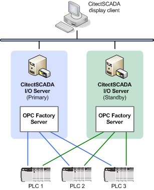
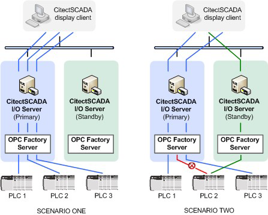
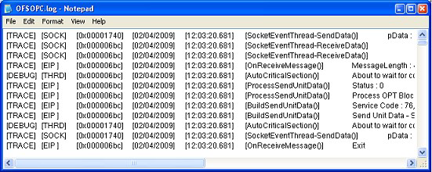

## OFSOPC Driver 

The OFSOPC Driver enables Citect SCADA to communicate with Schneider Electric's OPC Factory Server (OFS), providing a gateway to a network of OFS-compatible devices.

For each Citect SCADA I/O server, a single connection to a local instance of OFS is established, allowing tight integration between the driver and the OFS configuration environment. Individual devices are addressed within a Citect SCADA project using OFS alias names. 

The following diagram demonstrates a simple system installation using I/O server and PLC network redundancy. 

     

**Note:** With the release of version 7.20, Citect SCADA supports the retrieval of time-stamped data directly from field devices. This capability is enabled by the Driver Runtime Interface (DRI), a component of Citect SCADA that is used by the OFSOPC driver to directly update time-stamped digital alarms, time-stamped analog alarms and event-based trends. For more information, see the topic *Retrieving time-stamped data from field devices* in the main Citect SCADA help. 

### System Requirements 

Each Citect SCADA I/O server  needs to have a local installation of OPC Factory Server (OFS) version 3.33 or later. 

Version 1.02.12.001 (or later) of the OFSOPC driver will only use the **#PLCQualStatus** tag to determine the status of a device.

**OFS configuration file locations**         

At startup, the OFSOPC driver might need to access  the OFS configuration file **DeviceConfig.xml** to gather push data information.

Once OFS has been installed, this file can be found in the following directory:

```
%PROGRAMDATA%\Schneider Electric\OFS\<ver>
```

Where <*ver*> is the version of OFS installed.

### Setting up Device Communication 

The OFSOPC driver handles device communication through the integration of OPC Factory Server (OFS) on the I/O Server. Individual devices are addressed through the use of OFS alias names in the configuration of your Citect SCADA variable tags.

Setting up communication within a Citect SCADA project is therefore a straightforward process of connecting to OFS locally on each I/O server. 

See [Communications Forms Information](mk:@MSITStore:C:\Program Files (x86)\AVEVA\Citect SCADA 2018 R2\Bin\OFSOPC.chm::/OFSOPC_communications_forms.htm) for the default settings used by the Express Communication Wizard when configuring the connection to Schneider Electric OFS as a device. 

#### Device Address

The address to use for a device using the OFSOPC driver is the alias name configured in the OFS configuration for the remote PLC.

#### Communications Forms 

The following tables indicate the recommended settings for the  Citect SCADA communications forms to connect with  devices via OPC Factory Server.  

**Boards dialog box**         

The Boards dialog box lists boards used in the       Citect SCADA  project. Each board record defines a separate board within the project.     

| Field               | Value                                                        |
| ------------------- | ------------------------------------------------------------ |
| **Board Name**      | This field is user defined (e.g. 'Board1').                  |
| **Board Type**      | Enter **OFSOPC**.                                            |
| **Address**         | Enter zero (0)                                               |
| **I/O Port**        | Leave this field blank.                                      |
| **Interrupt**       | Leave this field blank.                                      |
| **Special Options** | Leave this field blank.                                      |
| **Comment**         | Any useful comment. This field is user defined and not required by the driver. |

**Ports dialog box**          

The Ports dialog box lists ports used in the Citect SCADA  project. Each port record defines a separate port within the project.     

| Field               | Value                                                        |
| ------------------- | ------------------------------------------------------------ |
| **Port Name**       | This field is user defined.                                  |
| **Port Number**     | Leave this field blank.                                      |
| **Board Name**      | Refers to the board previously defined in Board form (e.g. 'Board1'). |
| **Baud Rate**       | Leave this field blank.                                      |
| **Data Bits**       | Leave this field blank.                                      |
| **Stop Bits**       | Leave this field blank.                                      |
| **Parity**          | Leave this field blank.                                      |
| **Special Options** | Leave this field blank.                                      |
| **Comment**         | Any useful comment. This field is user defined and not required by the driver. |

**I/O Devices dialog box**         

The I/O Devices dialog box lists I/O Devices used in the Citect SCADA  project. Each device record defines a device within the project.

| Field         | Value                                                        |
| ------------- | ------------------------------------------------------------ |
| **Name**      | This field is user defined.                                  |
| **Number**    | I/O device number which needs to be unique for each logical device, but identical for redundant devices. |
| **Address**   | The alias name configured in the OFS configuration for the remote PLC. |
| **Protocol**  | Enter OFSOPC.                                                |
| **Port Name** | Refers to the port previously defined in the Ports form.     |
| **Comment**   | Any useful comment. This field is user defined and not required by the driver. |

#### Data Dictionary Support

To support OFS Data Dictionary, OFS version 3.6 (or later) needs to be installed.

OFS version 3.6 introduced a new specific item, `#PLCDataDicReady`, which provides the status of Data Dictionary in OFS for each device alias.

`#PLCDataDicReady` item can be equal to the following values:

- **0**: indicates that the PLC Data Dictionary is not configured for this alias (in the OFS configuration tool).
- **1**: indicates that the PLC Data Dictionary is not available. This may occur if OFS is still in the process of loading the Data Dictionary, or the Data Dictionary is not set in the UnityPro application (which means it is not embedded in the PLC).
- **2**: indicates that the PLC Data Dictionary is available.

The driver checks the status of the `#PLCDataDicReady` item. If the value of the item is equal to **0** (data dictionary is not enabled in OFS configuration tool), or **2** (data dictionary is loaded), it adds the OPC items and sets the I/O device online.

**Note:** Data Dictionary must be either enabled or disabled in both the OFS configuration tool and the UnityPro application, otherwise the value of `#PLCDataDicReady` will be equal to 1 and the driver will not put the I/O device online.

### Configuring Variable Tags 

Variable tags are addressed using the alias names defined in OPC Factory Server (OFS). The following table demonstrates the variable tag address formats you can use to read values. 

When specifying a data type, consider whether the server will be able to convert data to the requested type.

| Address               | Citect SCADA type | OFS Type           | Example                                |
| --------------------- | ----------------- | ------------------ | -------------------------------------- |
| `[<alias>!]<item_id>` | digital           | vt_bool            | `bool_symbol` or  `plc1!bool`_symbol   |
| `[<alias>!]<item_id>` | byte              | vt_ui1             | `byte_symbol` or  `plc1!byte_symbol`   |
| `[<alias>!]<item_id>` | int               | vt_i2              | `int_symbol` or  `plc1!int_symbol`     |
| `[<alias>!]<item_id>` | long              | vt_i4              | `long_symbol` or `plc1!long_symbol`    |
| `[<alias>!]<item_id>` | real              | vt_r4              | `real_symbol` or  plc1!real_symbol     |
| `[<alias>!]<item_id>` | string            | VT_ARRAY of VT_UI1 | `string_symbol` or  plc1!string_symbol |

Citect SCADA also allows a collection of variables to be associated with an OFS array tag. The following table demonstrates the variable tag address formats used to read values from OFS array tags. 

| Address                       | Citect SCADA type | OFS Type                                  | Example                                        |
| ----------------------------- | ----------------- | ----------------------------------------- | ---------------------------------------------- |
| `[<alias>!]<item_id>!a[size]` | digital           | array of                          vt_bool | `dig_array!a[32]` or  `plc1!dig_array!a[32]`   |
| `[<alias>!]<item_id>!a[size]` | byte              | array of vt_ui1                           | `byte_array!a[10]` or  `plc1!byte_array!a[10]` |
| `[<alias>!]<item_id>!a[size]` | int               | array of vt_i2                            | `int_array!a[10]` or   `plc1!int_array!a[10]`  |
| `[<alias>!]<item_id>!a[size]` | long              | array of vt_i4                            | `long_array!a[10]` or  `plc1!long_array!a[10]` |
| `[<alias>!]<item_id>!a[size]` | real              | array of vt_r4                            | `real_array!a[10]` or  `plc1!real_array!a[10]` |

Tag addressing for bits

The following table defines the syntax for configuring the tag that represents the bit of a WORD or INT UnityPro data type.

| Address                            | Citect SCADA type | UnityPro Type | Example                    |
| ---------------------------------- | ----------------- | ------------- | -------------------------- |
| `[<alias>!]<item_ID>.<bit number>` | digital           | INT or WORD   | `MyInt.0` Or `PLC!MyInt.1` |

#### Array Support 

The OFSOPC driver allows you to write to an individual array item without updating the whole array.  This operation is performed by creating a temporary subscription to the individual sub-item and issuing a write to that item.

For example, the following expression: 

```
MyArray [5] = 8 
```

indicates to the OFSOPC driver to assign a value of 8 to the fifth element of the "MyArray" tag in OFS.

**Note:** Citect SCADA indexes an array starting from zero, while some OFS applications allow you to specify an array's lower bound (as a positive or negative value). The  OFSOPC driver will dynamically determine an array's lower bound and map the Citect SCADA array to it.

Large array support

The maximum size of an array tag is limited to 256 bytes due to the underlying infrastructure of Citect SCADA.  For example, if the type is integer (2 bytes), Citect SCADA only allows the array tag to be configured with 128 elements.

However, special array offset syntax can be used to address multiple array tags configured with the same address as sub-arrays. A variable tag can therefore represents a sub-array with the particular offset and range within a large array.

The following demonstrates the variable tag address syntax used to facilitate this:

```
[<alias>!]<ITEM_ID>\<OFFSET>!A[SIZE]
```

**Example**         

The following provides an example of how sub-arrays can be used to map to a large array in an OFS system.

To address **IntArray[17]** in OFS, you would use the variable tag address **LargeArrayPart1[17]**. 

To address **IntArray[193]**, you would use **LargeArrayPart2[65]** (as 65 = 193-128). 

#### Timestamp and Quality Support 

When used with Citect SCADA version 7.0 or later, the OFSOPC driver supports the use of additional variable tags to obtain quality and timestamp values. Quality or timestamp tags are duplicates of a variable tag, with an appended "!Q" or "!T" or "!M" in the address field to define their purpose.

 For example:

| Address                 | Citect SCADAType | Description                                                  |
| ----------------------- | ---------------- | ------------------------------------------------------------ |
| `[<alias>!]<item_ID>!Q` | INT              | The quality reported for the item                            |
| `[<alias>!]<item_ID>!T` | LONG             | The seconds component of the timestamp reported for the item (in UTC seconds) |
| `[<alias>!]<item_ID>!M` | LONG             | The milliseconds component of the timestamp reported for the item |

**Tip:** A quick way to create a quality or timestamp tag in Citect SCADA  is to locate the relevant variable tag in the Variable Tags dialog box, edit it as required to create a quality or timestamp tag, and save it using the **Add** button. This creates a copy of the original variable tag with the required changes. 

#### Tag Addressing for Derived Data Types (DDT) 

The following table defines the syntax for configuring the tag that represents the field of a structure.

| Address                       | Example                                         |
| ----------------------------- | ----------------------------------------------- |
| `[<alias>!]<item_ID>.<field>` | `MyStruct.MyField1` or `PLC1!MyStruct.MyField1` |

For example, if the Derived Data Type (DDT) "MyStruct" is defined in UnityPro as the following:

| Field Name | UnityPro Type |
| ---------- | ------------- |
| MyField1   | INT           |
| MyField2   | INT           |
| MyField3   | INT           |

And MyStructInstance is configured as an instance of MyStruct in UnityPro®, then you would need to configure the following tags to access the fields of MyStructInstance:

| Tag Name                  | Tag Address               | Citect SCADA Type |
| ------------------------- | ------------------------- | ----------------- |
| MyStructInstance_MyField1 | MyStructInstance.MyField1 | INT               |
| MyStructInstance_MyField2 | MyStructInstance.MyField2 | INT               |
| MyStructInstance_MyField3 | MyStructInstance.MyField3 | INT               |

### Advanced Configuration and Maintenance 

#### Configuring Redundancy 

The OFSOPC driver supports fully transparent redundancy across the following architectures:

- multiple I/O server redundancy, including support for load balancing across one or more computers
- device redundancy, where a PLC is managed by more than one I/O server 
- communication redundancy, where each PLC is on a redundant network

To facilitate a complex redundant architecture, the  OFSOPC driver represents each PLC as a separate I/O device. This allows a switchover to occur on a per-PLC basis, as demonstrated by the diagram below.

   

Scenario one demonstrates the system in normal operating state, with the client connected to the three PLCs via the primary server. In scenario two, the link from the primary server to PLC2 is broken. Under these circumstances, the client is able to re-establish communication with PLC2 via the standby server. 

The OFSOPC driver subscribes to **#PLCQualStatus** and system bit %S0 on each PLC to determine the current operational status of a device. If these tags report bad quality, the I/O device will be declared offline and a switchover to the standby will occur. 

**Note:**  It is also possible to specify a custom item value that the driver will check in addition to #PLCQualStatus. 

#### Using the Batch-write Mechanism 

The OFSOPC driver supports a batch-write mechanism that allows a defined set of tags to be updated at the same time.

A  batch-write is implemented by creating a special tag with the address "BatchWrite". This functionality will be implemented on a per-PLC basis (you need to create one special tag per device).     

Once BatchWrite has been written to with a value of 1, subsequent writes to the I/O device will be deferred until a write operation to BatchWrite with value 0 (zero) is received. At that time, the deferred writes will be performed together to the OFS server.

If a 0 value is not received within a pre-defined timeout period, the batch write operation will be performed on the deferred writes currently held by the driver. The BatchWrite tag will be reset with to a value of 0 (zero) to help prevent infinite waiting. This timeout period (set to 30 seconds by default), can be adjusted using the BatchWriteTimeout parameter. 

**Note:** The OFSOPC driver does not support a batch write operation during any kind of redundancy switchover. Under these circumstances, the batch-write operation will not work. 

#### Push Data Support 

OPC Factory Server (OFS) supports "push data", which allows a remote device to connect  as a Modbus/TCP server and write data in a format that includes a timestamp. 

The  OFSOPC driver supports this functionality by implementing push-data items as time-stamped digital alarms, time stamped analog alarms and event trends.

Subscribing to a push-data item

The  OFSOPC driver initially gathers push-data configuration information from the OFS configuration file **DeviceConfig.xml**. For each item, the address is checked to determine if it is located within a push-data area. If this is the case, the item is added to the OFS group that has the fastest subscription rate to help ensure that changes will be transmitted from OFS to Citect SCADA as efficiently as possible.

#### OFS Group Management 

The OFSOPC driver uses OFS groups to prioritize and manage device communication.

For each device instance, the driver creates three groups in OFS, each with a different update rate. Items are then allocated to a group according to a detected polling rate. For example, status tags and heavily sampled items fall into the fastest group, rarely accessed items are added to the slowest group.

The subscription rate used for each Citect SCADA tag is then adjusted to match the polling rate set for the group to which the related OFS item is allocated. Tags will be dynamically moved between the groups in response to changes in demand for an item. 

It is possible to manually adjust the update rate for each group either globally or per I/O device. This requires adjustments to the citect.ini file, and is only recommended for advanced users. 

#### Source Timestamped Events Support               

Source Timestamped (TS) Event group support

Time stamped functionality is currently implemented and supported only for digital events. For configuration details refer to TS Quality Support

The driver creates a new OPC group to manage all OPC items with TS Event support. There is  only one TS Event OPC group created per driver instance.

The driver creates and activates an OPC group called `##TSEventsGroup##`  at start up and deactivates and removes that group at shutdown.

After the TS Event OPC group has been created, the driver periodically (every 500ms) signals that it is active by writing to the `<<system>>!#ClientAlive` OPC item.

As start up the driver reads the TS Event Support item property (Id: 5012) and adds those items which support TS Events to the TS Event Group.

After TS Event items have been added and activated the driver writes to the `#TSEventSynchro` item to get the current values of all TS Event items.

Citect SCADA Configuration for Source TS Support -  Ports and I/O Devices

There must be only one logical device and one port configured to communicate with all available TS Sources. This is to ensure the following

1.  Single client connection to OFS
2. Driver issues only a single request to OFS for initial data from all available TS sources.

Accordingly, only  one primary IO Device/Port and one Standby IO Device/Port can exist in the project in the case of redundancy.

Compatibility

The driver initializes TS Event support only if the following conditions are true:

- Citect SCADA v7.20 or higher version is used.
- ​	OFS Server v3.40 or higher version is used.
- ​	EventServiceSupport setting in DeviceConfig.xml is set to True for a specific device alias.

**Note:** When the source event buffer in the PLC is full, any new events will not be stored. In this case the value of SOE_Uncertain variable becomes TRUE. When the buffer becomes available again, the PLC will provide the values of all time stamped event variables. As these values are timestamped with a current time, the time quality of these values will be set to Invalid. The SOE_Uncertain is a variable in a time stamped event source whose value becomes TRUE when there is no space in the event buffer.

#### TS Quality Support            

TS Event OPC item have not only the value quality, but also the time quality associated with it. The time quality is provided in the high 8 bits of the OPC Quality Word which are available for vendor specific use:

- bits 7 to 0 - OPC quality flags,
- bits 15 to 8 - Timestamp quality.

The time quality is available in SCADA v7.20 only via a separate tag and it will be stored and displayed by the alarm system in SCADA v7.30.

Time quality is defined as follows:

- ​	bits 4 to 0 – Time Accuracy.  These bits represent a time accuracy (values 2-24) or one of the error codes:
  - 27  Clock In Sync,
  - 28  TSInit,
  - 29  IO Channel error,
  - 30  Invalid,
  - 31  Unspecified.

- bit 5 - Clock Not Synchronized
- bit 6 - Clock Failure
- bit 7 - Leaps Seconds Known

#### Timestamp Event Replication               

The driver implements the replication of event data between redundant driver instances in order to be certain that all TS events are pushed to the Alarm and Tran systems.

Event replication helps in a case when there is a lack of communication between the I/O server which receives events from the OFS and the Alarm Server.

For example in a system which has primary I/O server, standby I/O server and alarm server, the primary I/O server receives events from the OFS server. It pushes them to the alarm server and also replicates them to the standby I/O server. The standby I/O server stores these events in the event buffer.

In the case of a lack of communication between the primary I/O server and the alarm server, the primary I/O server will not be able to push events to the alarm server.

If during that time switchover happens (for example the primary I/O server was shut down), the standby I/O server will push its event buffer to the alarm server. The standby I/O server will store events data for 10 minutes. Also the size of the event buffer is limited to 300,000 events.

In a normal scenario when there is no lack of communication, the primary I/O server sends a confirmation message to the standby server after an event has been successfully propagated through the alarm system. On receiving that message, the standby I/O server deletes the corresponding event from the event buffer.

Also, if there is a lack of communication between the primary and standby I/O servers and the replication of events is not possible, the primary I/O server stores events received from the OFS for a limited time (10 min) and sends them to the standby I/O server after connection has been restored.

#### Diagnostic Buffer Support    

A diagnostic buffer is a  list of alarm records that is stored internally on a number of PLCs manufactured by Schneider Electric™ that support a diagnostic buffer. This is configured and managed by the software application Unity Pro™. 

For diagnostic buffer management, two sets of functions have been defined:

- Record Browsing Interface          
- Functions designed to read diagnostic records from a PLC.

- Device Resynchronization Interface            
- Functions designed to force the driver to resend the whole content of the diagnostic buffer.

##### Record Browsing Interface

The following functions are designed to read diagnostic records from a PLC that supports diagnostic buffer. 

- GetNextEvent- gets the next diagnostic buffer record and sets it as the current record.
- GetEventField - retrieves  the value of the field identified by the key in the current record

###### GetNextEvent

Gets the next diagnostic buffer record and sets it as the current record. The first call will retrieve the first record.

Syntax

GetNextEvent

(This function has no parameters.)

Return value

0 - if there are no more records

1 - if a new record has been read

###### GetEventField

Retrieves  the value of the field identified by the key in the current record.

This function assumes a previous call to GetNextEvent (to set the current record), otherwise it will return an empty string.

Syntax

**GetEventField**(*Alarm key*, *Error ID*, *Network Num*, *ON Time*, *OFF Time*, *Ack Time*, *Status*, *Area*, *Fbcomment*, *FBInstanceName + FBPinName*)

*Alarm key*         

The key used to identify the alarm this event belongs to. This key is generated internally using instance name, pin name, and comment

*Error ID*         

Error ID generated by the PLC, used for acknowledgement

*Network Num*         

Allow to retrieve the PLC (DEVICE) that emits this record

*ON Time*         

Time of the occurrence of the event in the PLC (UTC seconds timestamp)

*OFF Time*         

Time of disappearance of event in the PLC (UTC seconds timestamp)

*Ack Time*         

Time of acknowledgement of the event in the PLC (UTC seconds timestamp)

*Status*         

Current status of the event. The status value can be interpreted as:

| Bit  | Title            | 0                                                | 1                                                            |
| ---- | ---------------- | ------------------------------------------------ | ------------------------------------------------------------ |
| 0    | Status           | Disappeared                                      | Active                                                       |
| 1    | Acknowledgment   | Not acknowledged or acknowledgment not requested | Acknowledged                                                 |
| 2    | Need Acknowledge | Acknowledgment is not required                   | Acknowledgment is required                                   |
| 3    | Deleted          | Not removed                                      | Removed                                                      |
| 4    | New              | Existing alarm                                   | New alarm                                                    |
| 5    | Auto dereg       | no                                               | Detected error has been simultaneously activated and deactivated |

*Area*         

Area as defined in the PLC diagnostic buffer. This may or may not match the definition of area in Citect SCADA.

*Fbcomment*         

Comment associated with the instance of the FB for this anomaly

*FBInstanceName + FBPinName*         

Name of the instance of the FB that caused this anomaly + the pin name

Return value

String value of the field.

##### Device Resynchronization Interface         

These methods force the driver to read every entry for a given device.       

- GetResendState - indicates if a "ResendAll" operation for a particular device has been successful.
- ResendAll - triggers an explicit resend of any existing records in the current diagnostic buffer.

###### GetResendState

Returns a value that indicates when a "ResendAll" operation for a particular device is complete and if it has been successful. 

Syntax

**GetResendState**(*in*)         

*in*         

Network number (short)

Return value

| Return value      | Field key value | Description                                                  |
| ----------------- | --------------- | ------------------------------------------------------------ |
| Successful        | 0               | Last ResendAll call was successful for the device.           |
| Unsuccessful      | 1               | Last ResendAll call was unsuccessful for the device.         |
| In progress       | 2               | A ResendAll operation is currently running on the specified device. |
| Invalid parameter | -1              | Device not found.                                            |

###### ResendAll

Triggers an explicit resend of existing diagnostic buffer records for the specified device.

Syntax

**ResendAll**(*in*)         

*in*         

Network number (short)

Return value

None

#### Customizing a Project using Citect.ini Parameters 

You can customize the way Citect SCADA  communicates with the OFS system by creating or editing the [OFSOPC] section of the Citect.ini file for your project. However, the default values for these parameters have been determined by driver development and testing to be optimal for the  OFSOPC driver. 

**Note:** Always seek the advice of Technical Support personnel for this product regarding undocumented features.   

When Citect SCADA  starts at runtime, it reads configuration values from the Citect.ini file stored locally. Therefore, any OFS configuration settings needs to be included in the Citect.ini file located on the computer acting as the I/O server to the OFS system. 

By default, Citect SCADA  looks for the ini file in the Citect SCADA  project  \bin directory.  If it can't find it there, it searches the default Windows directory. 

| [OFSOPC] Parameter | Allowable Values                              | Default Value | Description                          |
| ------------------ | --------------------------------------------- | ------------- | ------------------------------------ |
| Group1UpdateRate   | Any positive value less than Group2UpdateRate | 400           | Group 1 polling rate in milliseconds |
| Group2UpdateRate   | Any positive value less than Group3UpdateRate | 1000          | Group 2 polling rate in milliseconds |
| Group3UpdateRate   | Any positive value less than 2147483647       | 3000          | Group 3 polling rate in milliseconds |

**Note:** The default value will apply if a specified value does not fall within the range of allowable values.

The following example demonstrates how to override the group management parameter setting for a specific I/O device. 

```ini
[OFSOPC]
<Cluster>.<IOServerName>.<IODeviceName>.<Parameter>=<Value>
```

where:

`<Cluster>` = the name of the cluster configured in Citect SCADA

`<IOServerName>` = the name of the I/O server to which the device is connected

`<IODeviceName>` = the name given to the device in your project

`<Parameter>` = the group management parameter you would like to overwrite

`<Value>` = the update rate for the specified device in milliseconds

#### Logging Parameters 

| [OFSOPC] Parameter | Description                                                  | Allowable Values                                             | Default Value |
| ------------------ | ------------------------------------------------------------ | ------------------------------------------------------------ | ------------- |
| DebugLevel         | The trace level used for the log file.                       | Any combination of the following, separated by a pipe character (\|):ERROR WARN TRACE DEBUG ALL(e.g. ERROR \| TRACE) | -             |
| DebugCategory      | The categories used for the log file.TAG = tag debug NET = network level debug PROT = protocol level debug DCB = front end debug (i.e. I/O server) BUFF = buffer level debug THRD = thread level debug MISC = any other debugging ALL = all of the above | Any combination of the following, separated by a pipe character (\|):TAG           NET PROT DCB BUFF THRD MISC ALL(e.g. TAG \| PROT \| DCB) | -             |

Log file size and archiving are now controlled by the general [DEBUG] parameters: 

#### BatchWrite Parameters 

The BatchWriteTimeout parameter specifies the maximum period of time that the OFSOPC driver will wait to receive an 'End Batch-Write' command (i.e. a setting of BatchWrite = 0) following the commencement of a batch-write (BatchWrite = 1). This is required to avoid an infinite wait period. 

| [OFSOPC]Parameter | Allowable Values                                             | Default Value | Description                                                  |
| ----------------- | ------------------------------------------------------------ | ------------- | ------------------------------------------------------------ |
| BatchWriteTimeout | 10 - 3600 (seconds) (The default value will apply if the specified value exceeds these limits.) | 30 (seconds)  | Number of seconds to wait for BatchWrite = 0 to be written following the commencement of a batch-write (BatchWrite=1).        If BatchWrite remains set at 1 for this period of time, the system will send the write and set BatchWrite back to 0. |

The following example demonstrates how to override the global setting for the BatchWriteTimeout parameter for a specific I/O device. 

```ini
[OFSOPC]
<Cluster>.<IOServerName>.<IODeviceName>.BatchWriteTimeout=<Value>
```

where:

`<cluster>` = the name of the cluster the I/O server belongs to

`<IOServerName>` = the name of the I/O server to which the device is connected

`<IODeviceName>` = the name given to the device in your project

`<Value>` = the timeout value for the specified device in milliseconds

#### Diagnostic Buffer Parameters 

| [OFSOPC]Parameter | Allowable Values                                             | Default Value | Description                                                  |
| ----------------- | ------------------------------------------------------------ | ------------- | ------------------------------------------------------------ |
| EnableDiagBuffer  | 0 = disabled 1 = enabled                                     | 0             | Enables or disables diagnostic buffer support                |
| DiagnosticArea    | Short (0-65535).The value needs to be added in decimal format.The value 0 means all areas are selected (same as 65535). | 0             | Allows you to filter the diagnostic buffer records according to their areas value.There are 16 possible areas, and each bit of the word is used to manage one area.Bit 0 corresponds to Area 0 ...Bit 15 corresponds to Area 15. |

#### Dynamic Status Item Parameters 

By default, the driver subscribes to `#PLCQualStatus` to determine the current operational status of a device. It is also possible to specify a custom item value that the driver will check in addition to `#PLCQualStatus`. This can be useful to confirm that the driver will put the I/O device offline if OFS becomes unresponsive.

The item value must be periodically changing in the PLC. If it stops, the driver will put the I/O device offline. This behavior is controlled by the following parameters.

| [OFSOPC]Parameter         | Allowable Values         | Default Value | Description                                                  |
| ------------------------- | ------------------------ | ------------- | ------------------------------------------------------------ |
| DynamicStatusItemName     | PLC item name            | -             | This parameter specifies the item name that gets updated in PLC at a certain interval. Some system items are already programmed in the PLC and can be used to avoid changes to the PLC program. For example %S4, %S5, %S6 have value updates every 5ms, 50ms, or 500ms correspondingly. |
| DynamicStatusItemInterval | 1 - 2147483647 (seconds) | 0             | This parameter specifies the period which the driver will use to check the status of the item specified by the DynamicStatusItemName parameter. If the item value has not changed during the period specified, the driver will put the I/O device offline. For the system items %S4, %S5, %S6, the parameter can be set to 1 second. |

These parameters can only be specified for a specific I/O device using the syntax below.

```ini
[OFSOPC]<Cluster>.<IOServerName>.<IODeviceName>.<Parameter>=<Value>
```

Where:

 `<Cluster>` = the name of the cluster configured in Citect SCADA.

 `<IOServerName>` = the name of the I/O server to which the device is connected.

 `<IODeviceName>` = the name given to the device in your project.

 `<Parameter>` = the parameter name.

` <Value>` = the parameter value.

### Performance Tuning

OPC is a standard protocol that is widely used in industrial automation systems. OPC is chosen for use to simplify and standardize PLC communication.

The  Schneider Electric OPC communications solution is based on an OPC DA server called OFS. OFSOPC is a dedicated driver implemented for Citect SCADA that connects the SCADA system to OFS.

Communicating with Schneider Electric PLCs through OFS

The performance of the communications between a Citect SCADA system and a PLC through OFS involves many factors other than just the driver, because of the number of components involved.

These components, each of which could be a bottleneck, are:

- PLC: depending on the firmware/hardware, the limitations  may vary. The cycle time of the application may also have a large impact on the communications performance, because the PLC will process a predefined maximum number of requests per cycle.
- Network (PLC/OFS)
- OFS server: depending on its configuration and the application, OFS can be very demanding  of CPU usage.
- OFSOPC Driver: depending on its configuration, it can affect the speed of communications.

These tuning suggestions only deals with the OFS/OFSOPC driver communications. For tuning other components, please refer to other relevant documents or specifications.

#### Tuning Parameters

The implementation of the OFSOPC driver is based on the OPC standards but also takes into account specific enhancements in the current implementation of OFS that optimizes communications with Schneider Electric PLCs.

This section explains how to optimize the communications between PLCs and a Citect SCADA system through OFS. It presents generic principles to be adapted for each project depending on its specific needs.

It is written to optimize a configuration with OFSOPC driver	1.02.12.001 or greater, and OFS Server	3.35 or greater. 

Tuning for performance consists of adjusting several configurations in both the OFS Server and the OFSOPC Driver.

#### OFS Server Configuration

The values provided in this section are recommended default values for SCADA usage. They can be adapted depending on project needs.

OFS version

Use the latest version of OFS that is available. This information targets OFS V3.35, or greater.

Processor affinity

In multi-processor machines,  set the processor affinity of the OFS server so that it does not run on the same processor as the Citect SCADA I/O Server.

Device settings 

These settings can be adjusted on a device-by-device basis.

Communications settings        

- Sampling rate on reception
- Minimum group update rate
- QuickSetActive
- Communication Overrun behavior

Summary of recommended OFS Configuration parameters

In summary, the recommended OFS parameter settings for optimal performance are as follows:

| Parameter                      | Recommended Setting                                          |
| ------------------------------ | ------------------------------------------------------------ |
| Communication Overrun behavior | Rate adapt                                                   |
| MaxChannels                    | Equipment dependent, set to the same as the MaxPending value calculated by OFS. |
| MaxPending                     | 0 (Equipment dependent. OFS to calculate a value).           |
| Minimum group update rate      | Rate <= Fastest Group rate / 2, andRate is the greatest common divisor of the group rates (provided this doesn’t violate the previous rule). |
| OFS version                    | 3.35 or later                                                |
| Processor affinity             | Different to Citect SCADA I/O server                         |
| QuickSetActive                 | True                                                         |
| Sampling rate on reception     | 20ms                                                         |

#### Device Settings

MaxPending

By default, in the OFS configuration, “MaxChannels” is set to 1, and “MaxPending” is set to 0.

A setting of MaxPending=0 means the OFS server automatically detects the PLC’s target communications port and decides how many parallel requests may be sent at the same time. OFS will choose the appropriate MaxPending value using a predefined table of communications modules (NOE/COPRO/TSY…).

The runtime value being used by OFS can be seen in the OFS server, network window.

It is preferrable to let OFS choose the value of the MaxPending parameter, unless a new release of firmware (after the last OFS server release) changes the capability of the device.

In case of multiple OFS connections to the same PLC (redundant IO Server), it is recommended to set MaxPending to “Used” value / Number of connection. The automatic calculation done by OFS is based on one single OFS-PLC connection.

Max Channels

For Ethernet communications, it is advisable to set “MaxChannels” to the same value as the “MaxPending” value currently in operation in the OFS server.

Setting the MaxChannels parameter should be done after MaxPending has been optimized according to the recommendations above.

#### Communications Settings

Sampling rate on reception

The lower the value of this parameter, the better the response times for synchronous access will be. However, this parameter only affects CPU load on the PC on which OFS is installed, and has no impact on the network bandwidth usage.

Typically, the sampling rate on reception should be set to 20ms.

Minimum group update rate

OFS manages communications with devices based on the group update rate. This rate is the limit below which OFS will not accept OPC client requests.

To maximize performance, it is recommended to set this rate according to the following rules:

- ​	Rate <= Fastest Group rate / 2, and
- ​	Rate is the greatest common divisor of the group rates (provided this doesn’t violate the previous rule)

For example:

```
Group1UpdateRate = 400 ms
Group2UpdateRate = 800 ms
Group3UpdateRate = 2000 ms
```

Therefore, the recommended group update rate is 200 ms, (the greatest common divisor of the three group rates, which is also <= 400 /2).

**Note:**If your group rate is too high compared to your system capabilities then OFS will display a message “Polling rate overrun for …” in OFS diagnostic window when “verbose” mode is set (Menu Misc/verbose).
The Quality of some of the items will then become uncertain (depending on Communication Overrun behavior). This quality will be propagated up to the Citect SCADA system, and therefore should be avoided.
Therefore ageneral rule is to set the OPC client’s refresh rate to twice the calculated “OFS group scan time”.

The OFS group scan time can be calculated with the formula:

TS=group average time (2) * group number request (3) / max pending request used (1).

The different parameters of the equation are provided by the OFS server in “Varman” and “Network” windows.

​	QuickSetActive

This parameter is new in OFS v3.35. It causes the value of an item to be read immediately after activation instead of waiting for the next cycle. This is useful, for example, in reducing the delay for first display of variables in a popup. Therefore, it should be set active.

​	Communication Overrun behavior

This parameter allows deciding whether the overrun in OFS should be notified to Citect SCADA as a “Bad quality” or if the server should instead try to auto-adapt its own polling rate. Set this parameter to “rate adapt” to avoid some false “bad quality” when the load on the OFS server is high.

#### OFSOPC Driver Parameters

OFSOPC driver version

Use the latest version of OFSOPC that is available. This document targets OFSOPC 1.2.x, or greater.

Group management

The OFSOPC driver defines 3 groups per PLC. These groups are polled at a rate defined by the Group<i>UpdateRate parameter in citect.ini.  Set these poll rates such that:

- Group1UpdateRate < Group2UpdateRate < Group3UpdateRate
- Group1UpdateRate < Alarm scan Time
- Group2UpdateRate <Trend  sampling Time

The "Group Minimum Update rate" is different for each of these groups and can be set using OFS parameters"

The default values are:

Group1UpdateRate = 400 ms

Group2UpdateRate = 800 ms

Group3UpdateRate = 2000 ms

Each requested tag will be activated in the group which provides the lowest (e.g. fastest) update rate that is faster than the requested rate. For example, a tag with a requested rate of 2s will be activated in Group 2 if the default values are being used.

If no group provides such a rate then the fastest one is used. For example tags requested at 200 ms with default configuration will be put in 400 ms group.

Usually Group 1 (the fastest group) is associated with tags in the active page and alarms. The Group 2 should be targeted for trends and the group 3 is mostly there for slow trends if they are configured.

With the default Citect SCADA configuration, the Group1 (400 ms) will contain alarms ([Alarm] ScanTime =500ms) and page items ([Page] ScanTime =250ms).

Logging

The OFSOPC driver can log combinations of trace levels across different categories. This is achieved by setting the following Citect.ini parameters:

- [OFSOPC]DebugLevel
- [OFSOPC]DebugCategory

These settings have an impact on the performance of the driver and therefore it is recommended to switch them off by removing these parameters from the citect.ini file to get optimal performance.

​	MaxPending

This parameter defines the maximum number of pending commands that the OFSOPC driver holds for immediate execution. The default value is now 1200. If this value exists in Citect.ini, it should be updated (or removed to take into account this new default value).

Remark: This parameter is common to other drivers it is defined under [OPC] and not [OFSOPC] section in the Citect.ini file.

Summary of recommended OFSOPC Configuration parameters

In summary, the recommended driver parameters settings for optimal performance are as follows:

| Parameter                                                    | Recommended Setting                                          |
| ------------------------------------------------------------ | ------------------------------------------------------------ |
| Group management<br />[OFSOPC]Group1UpdateRate=G1<br />[OFSOPC]Group2UpdateRate=G2<br />[OFSOPC]Group3UpdateRate=G3 | G1< G2< G3<br />G1 <  Alarm scan time <br />G2 < Trend  sampling time<br />G3 < slow trend sampling time<br />The above are multiple number of the <br />“Group Minimum Update Rate” in OFS parameters. |
| Logging<br />[OFSOPC]DebugLevel<br />[OFSOPC]DebugCategory   | Remove/disable                                               |
| Commands[OPC]MaxPending                                      | Remove/disable                                               |

### Troubleshooting     

The following topics provide information about the Citect SCADA  tools available to diagnose and resolve any unexpected behavior within the runtime system. 

#### Driver Errors     

Citect SCADA  has two kinds of protocol driver errors: generic and specific.

- **Generic errors** are hardware errors 0-31, which are common to many protocols.
- **Specific errors** are unique to a particular driver.

When a driver specific error occurs, the hardware alarm system will not recognize it. The driver converts the specific error into a generic error that can be identified by the I/O server.

This means a driver error may be represented by a specific error, and a corresponding generic error.

When a hardware error occurs,Citect SCADA  generates an alarm and displays it on the hardware alarm page. To see the error number, you need to have Alarm Category 255 defined with a display format that includes {ErrDesc,15} {ErrPage,10}.

Refer to the Citect SCADA Help for more information on generic hardware errors. 

If you need more information to resolve an error, refer to the documentation that accompanied the I/O device (or network). If, after reviewing the documentation, you still cannot solve your problem, contact Technical Support for this product.

#### OFSOPC Driver Errors 

The following errors, listed in (hexadecimal) order, are specific to the Citect SCADA  OFSOPC driver.     

| Error Value (Hex) | Error Definition            | Error Description                                            |
| ----------------- | --------------------------- | ------------------------------------------------------------ |
| 0XC0040001        | GENERIC_SOFTWARE_ERROR      | Invalid handle was passed.                                   |
| 0XC0040002        | GENERIC_SOFTWARE_ERROR      | A duplicate parameter was passed where one is not allowed.   |
| 0XC0040004        | GENERIC_INVALID_DATA_FORMAT | Server cannot convert between the passed or requested data type and the canonical type. |
| 0xC0040006        | GENERIC_ACCESS_VIOLATION    | Item's access rights do not allow the operation.             |
| 0xC0040007        | GENERIC_SOFTWARE_ERROR      | Item definition does not exist within the server’s address space. |
| 0xC0040008        | GENERIC_SOFTWARE_ERROR      | Item definition does not conform to the server's syntax.     |
| 0xC004000B        | GENERIC_INVALID_DATA_FORMAT | Value passed to WRITE was out of range.                      |
| 0x80020008        | GENERIC_SOFTWARE_ERROR      | Bad variable type.                                           |
| 0x8002000A        | GENERIC_SOFTWARE_ERROR      | Out of present range.                                        |
| 0x80020005        | GENERIC_SOFTWARE_ERROR      | Type mismatch.                                               |
| 0x100             | GENERIC_SOFTWARE_ERROR      | Could not access variable dbf.                               |
| 0x101             | DRIVER_BAD_DATA             | Read of data value bad.                                      |
| 0x102             | GENERIC_GENERAL_ERROR       | Write of one or more items not completed.                    |
| 0x103             | DRIVER_UNIT_OFFLINE         | Could not resolve the server CLASSID.                        |
| 0x104             | GENERIC_SOFTWARE_ERROR      | Could not add one or more items to the Server                |
| 0x80010006        | GENERIC_CHANNEL_OFFLINE     | Connection terminated                                        |
| 0x80010007        | GENERIC_CHANNEL_OFFLINE     | Server not available.                                        |
| 0x8001000F        | GENERIC_INVALID_RESPONSE    | Received data is invalid.                                    |
| 0x80010012        | GENERIC_SOFTWARE_ERROR      | Call did not execute.                                        |
| 0x80010100        | GENERIC_SOFTWARE_ERROR      | System call aborted.                                         |
| 0x80010101        | GENERIC_SOFTWARE_ERROR      | Could not allocate some required resource.                   |
| 0x80010103        | GENERIC_BAD_PARAMETER       | Requested interface not registered on server object.         |
| 0x80010104        | GENERIC_SOFTWARE_ERROR      | Could not call server.                                       |
| 0x80010105        | GENERIC_CHANNEL_OFFLINE     | Server threw an exception.                                   |
| 0x80010108        | GENERIC_CHANNEL_OFFLINE     | Server has disconnected from its clients.                    |
| 0x8001011B        | GENERIC_CHANNEL_OFFLINE     | Access denied.                                               |
| 0x8001011C        | GENERIC_CHANNEL_OFFLINE     | Remote calls not allowed for this process.                   |

#### Driver Statistics 

You can use the following driver statistic counters to help you debug the OFSOPC driver. These statistics can be viewed within the Citect SCADA Kernel using the Page Driver command and then by pressing the 'v' key to select verbose mode. 

See the topic *Using* *Citect SCADA* *> Monitoring and Debugging Runtime > Using the Kernel > Kernel Commands > Page Driver* in the main Citect SCADA help for more information.     

| Statistic             | Description                                                  |
| --------------------- | ------------------------------------------------------------ |
| Total Tags            | Number of tags added to the OFSOPC driver, this might include the virtual tags. |
| # Uncertain Reads     | The number of reads that cannot be completed immediately due to a stale cache value. When a tag is read that has uncertain quality, it will trigger item activation on the OFS server, allowing diagnosis of the tag status. |
| # OPC Item Updates    | Number of items updated from OFS server via OnDataChange event. |
| # Read Unsuccessful   | Number of unsuccessful ReadDCBs.                             |
| # Writes Unsuccessful | Number of unsuccessful WriteDCBs.                            |
| Pending DCB Size      | Number of DCB not replied.                                   |
| Pending Tasks         | Number of tasks requested by the front-end and not served by the back-end driver. |
| Pending Write Tasks   | Number of WriteDCBs not replied.                             |
| Completed Tasks       | Number of tasks completed in the back-end.                   |
| Configured OPC Items  | Number of OPC items added to the OFS server.                 |
| Bad OPC Items         | Number of OPC items add to the OFS server unsuccessful.      |
| Inactive Items        | Number of deactivated OPC items (representing a total of the inactive items in groups 1, 2 and 3). |
| Temp Group Items      | Number of items assigned to OPC temporary group. (This is the internal group used by the OFSOPC driver to hold temporary subscriptions.) |
| Group1 Items          | Number of items assigned to OPC group 1.                     |
| Group2 Items          | Number of items assigned to OPC group 2.                     |
| Group3 Items          | Number of items assigned to OPC group 3.                     |
| Push Data Items       | Number of items assigned to OPC push-data group. An item is considered a push-data item if its address is defined within the configured push-data address range. |
| Batch Write Units     | Number of units that are currently have BatchWrite on mode.  |
| Batch Write Items     | Numbers of WriteDCBs in batch-write mode.                    |

#### Logging 

OFSOPC driver events are logged in the **syslog.dat** file in the  directory selected by the CtEditLogs parameter in the citect.ini file. This file can be rolled over into a configurable backup file. This functionality is controlled by the following citect.ini parameters.   

**Note:** With Citect SCADA V7.10 or later, the file may be delivered to the location specified in the [CtEdit]Logs parameter.

The  OFSOPC driver can log combinations of trace levels across different categories. This is achieved by setting the following Citect.ini parameters:     

- [OFSOPC]DebugLevel             
- [OFSOPC]DebugCategory             

**Note:** The more detailed the logging, the larger the amount of log data that will be generated. This could create a large, cumbersome log file, or cause multiple wraparounds that write over data.     

**Example**         

The following parameter settings:     

```ini
[OFSOPC]
DebugLevel=DEBUG|TRACE
DebugCategory=ALL     
```

would send the following information to the log file:     

         

When the log file reaches a specified size (5000 kilobytes by default), it may be rolled over into OFSOPC.bak or a timestamped file, depending on logging parameter settings. 