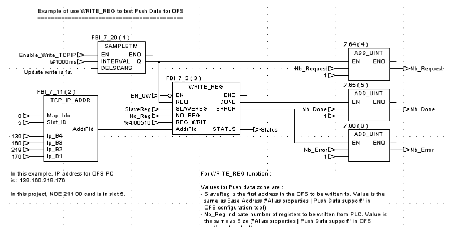
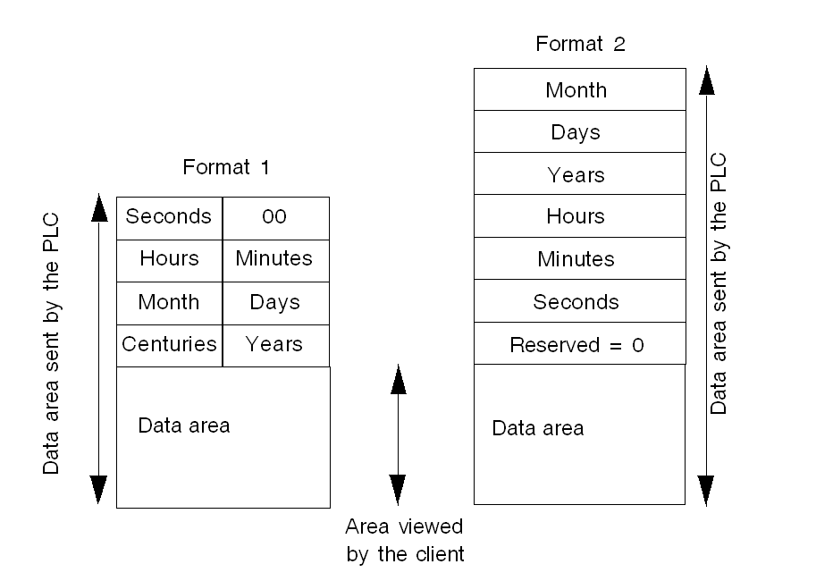

# The OFS Configuration Tool 

## Push data support 

Description 

As a general rule, to update OPC items automatically, the server  sends some network requests to the PLC, then waits for the PLC responses to  update its internal data tables. This is called polling the device. 

In contrast, the Push data feature  corresponds to the spontaneous transmission of data by the PLC to the active  server, without any request having come from the server. 

The data is regarded as being pushed  by the PLC. This feature is particularly worthwhile when the values of the data  being monitored do not change very frequently. This does, however, mean that  specific processes have to be included in the PLC application for sending data. 

This function is supported on TCP/IP (except ETY 120), Fipway and  Ethway networks. 

This feature can be enabled and configured PLC by PLC using the device property  page. 

Data sent by the device to the server should fit within the Push  data range that has been defined for this device. Only one range can be defined  for each device (using the device properties page). 

Any number of OPC items can be defined within this range. They are  seen as ordinary OPC items. 

The device has an option which can be used to send a timestamp with  the data, used by the server to update the timestamp property of all items  associated with Push data. 

Procedure and Example 

The Push data should be sent to the server using a request code 37h  for X-Way (generally via the function WRITE_VAR PL7) and the function code 16  for Modbus (generally via the Concept EFB function WRITE_REG). 

Concept example of using WRITE_REG to test  the PUSH DATA function: 

Some sample applications are provided on the DVD to show how a PLC  application can send Push Data to the server. 

In both cases, the functions and the behavior of the server are  perfectly identical. 

To use these functions, you must adhere to the following  procedure: 

| 1    | Creating an alias for the device with the Configuration  Tool, |
| ---- | ------------------------------------------------------------ |
| 2    | Open the properties page of the device.                      |
| 3    | Define the range of Push data for the device (Base and  Size).  Example: range %MW1000..%MW1500 : base = 1000, size = 500  Example: range 401000..401200 : base = 1000, size = 200 |
| 4    | Define the initialization mode for the Push data area:  Values to 0 or values read from the device. |
| 5    | Close the properties page and the Configuration Tool and  save the parameters. |
| 6    | Create an application or use a sample application  provided on the DVD capable of sending Push data to the server (check the  consistency with the Push data range shown below for the device). Load it into  the PLC. |
| 7    | Launch the OPC test client, then connect it to the OFS  server. |
| 8    | Create an item associated with the equipment in order to  establish the connection and initialize the Push data range. |
| 9    | In the server diagnostics window, a message should appear  and indicate that the Push data are being received from the device. |
| 10   | Create an item in the Push data range using the OPC test  client. |
| 11   | Launch the write operation from the application.             |
| 12   | The value of the item should have been updated.              |
| 13   | You can verify the procedure using the server diagnostics  interface(Network window), then read the counters in the transaction area: Slave  Request and Slave Answers. |

The number of OPC items that can be created in the Push data range  is unlimited (single variables and tables) but it is not possible to create  variables that straddle the limits of the area. 

In addition to its value, each OPC item must include important  attributes: 

Quality,  Timestamp. 

For the items included in the Push data range, the Quality  attribute is identical for all items and may be: 

Always defined as Good (if the Quality  Check Rate value defined in the device properties page is equal to 0),   Defined according to the communication status and the operation  mode of the device (if the Quality Check Rate  value defined in the properties page of the device is defined as NN and not as  0). Every NN seconds, the server will attempt to read the operating mode of the  device:   When the communication is interrupted, the quality is defined  as Bad,  If the communication is established and if the operating mode  is defined as RUN, the quality is defined as Good,  If the communication is established and if the operating mode  is other than RUN (generally this means STOP), the quality is defined as  Uncertain,  The Quality Check Rate option is only available for PLCs of  types Concept, PL7 on X-Way and Unity Pro. 

For items included within the Push data range, when the Timestamp  option is used, the date/time is set as follows: 

The current time and date of the server when a read operation  is requested by the OPC client,  The time and date of the PLC when the server receives the new  values of this latter,  The current time and date of the server when the Push data area  is initialized (whether it be with the value of 0 or read from the device). 

The Timestamp option may be enabled individually for each alias,  from the properties page. 

To send the time/date to the server, the PLC must include it in the  header of the data sent. 

Place the GMT time on the PLC in compliance with the OPC standard. 

To facilitate data formatting according to the PLC, two header  formats may be used. 

Illustration of the 2 formats: 

NOTE: The difference between the two  formats is made by OFS by checking the least significant byte of the first word  that contains 0 in format 1 and a value from 1 to 12 in the second  case.

NOTE: On a Premium, the date/time may  be easily be inserted using the RRTC function.

NOTE: Some sample PLC applications are  provided on the DVD.

In order to allow creation of the Push data range and the reception  of the associated data prior to creating an item, configure the device (in the  device properties page) so that it is preloaded when the server is  started.

All OPC write operations are performed directly on the device. The  Push data area is not affected at all.

All OPC read operations of the device are performed directly  (unless for a cache read), the Push data area is simultaneously updated.

For X-Way devices, only variables %MW and %MD may be associated  with the Push data area. The others (%MB, %MF) are managed as though the area  was not defined.

For Concept-type devices, the Push data area is always located in  4x. Only variables of type INT, DINT or FLOAT may be created there. 

NOTE: 

If you use the Push function on a Premium via TCPIP in direct  addressing mode, and the XIP driver is also enabled, make sure the IP of the  Premium is not declared in the XIP driver (the same TCP/IP port 502 is shared).   Only one Push data area may be created per device. However, if  the device is accessible by several network addresses, it is then possible to  define one area per address,  The Push Data function is not supported for I/O objects. It is  however possible to send them to the OFS server by copying the I/O objects to  standard objects . 

NOTE: The size of the data range  configured should be at least equal to the quantity of data sent by the device. 

NOTE: On TCPIP, OFS listens to port  502 (Schneider TCP Port). Some Schneider tools also use this port (especially  the PLC simulator). They should thus not be started on the same machine as OFS. 

NOTE: 

On a Premium using TCP/IP the PC extension number must be equal  or greater than 100 in the configuration of the Ethernet module in order to  specify the use of the Modbus/TCP protocol.  On a Quantum, the communication function blocks use only  located variables. 

NOTE: The Push Data feature is not  compatible with the Ethernet I/O scanning service. 