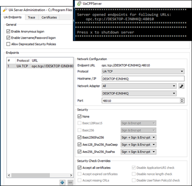
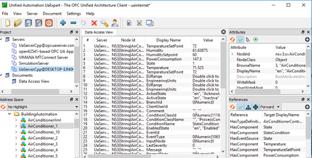
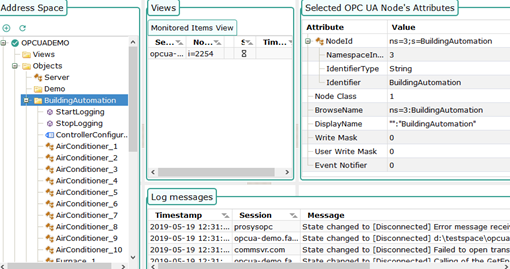
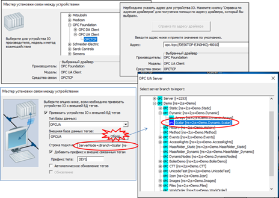
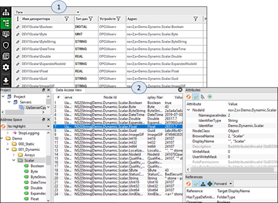
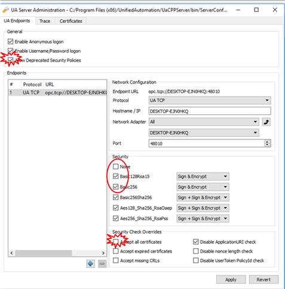
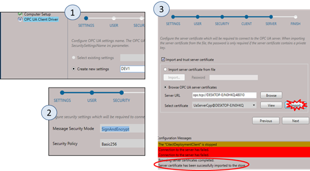
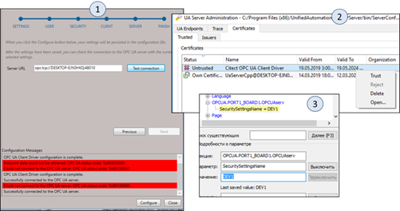

# OPC UA

## 4.3.6. Тестові OPC UA клієнти та сервери

Як і для класичного OPC, для OPC UA є достатньо багато доступних безкоштовних тестових клієнтів і серверів. Враховуючи, що технологія є мульти-платформовою, ці утиліти доступні не тільки для Windows і не тільки для ПК. Наявність мобільних застосунків робить її ще більш привабливою. 

Серед безкоштовних "еталонних" серверів для Windows зупинимося на UaCPPServer (OPC UA C++ Demo Server [13]) – тестовий OPC Unified Architecture Server для операційних систем Windows, в якому імітуються дані та інформаційна модель (Standard, DI та PLCopen). Після запуску ОРС-сервера створюється тільки одне консольне вікно, в якому виводиться URL кінцевої точки (рис. 4.54). Для конфігурування використовується окрема програма (UA Server Administration), в якій також можна керувати сертифікатами. На рис. 4.54 видно, що стоїть опція “Accept all certificates”; це дозволяє підключатися кому завгодно з будь-яким сертифікатом, також дозволено підключатися без шифрування та автентифікації. Таке налаштування зручне при тестових підключеннях, але для реальних проектів **недопустиме з точки зору кібербезпеки**! З темою кібербезпеки можна ознайомитися в підрозділі 9.5 посібника. 

 

*Рис. 4.54.* Вікно сервера OPC UA C++ Demo (UaCPPServer) та утиліти його конфігурування 

У демо-сервері UaCPPServer прописані користувачі та паролі з різними ролями (табл. 4.6)

*Таблиця 4.6.* 

**Користувачі та їх паролі наперед визначені в** **UaCPPServer**

| **UserId** | **GroupIds** | **UserName** | **Password** |
| ---------- | ------------ | ------------ | ------------ |
| 0          | 0            | root         | secret       |
| 1          | 1            | joe          | god          |
| 2          | 0,1,2        | john         | master       |
| 3          | 1,2          | sue          | curly        |

   У якості клієнта під Windows зручною є безкоштовна утиліта UaExpert [14] – це повнофункціональний клієнт OPC UA, який може працювати з декількома профілями та функціями OPC UA. Інтерфейс містить перелік серверів проекту, де зазначено їх стан, навігатор адресного простору, вікно вибраних об’єктів, вікно атрибутів і посилань (рис. 4.55). Клієнт дає можливість змінювати значення Змінних.

 

*Рис. 4.55*. Вікно UaExpert

Окрім офлайнових тестових утиліт, є й он-лайнові. На рис. 4.56 показано зовнішній вигляд он-лайнового клієнта – "OPC UA Web Client", інтерфейс якого схожий на UaExpert. 

  

   *Рис. 4.56*. Зовнішній вигляд вікна сервісу OPC UA Web Client 

Вхід на тестовий OPC UA сервер доступний за посиланням "opc.tcp://opcuaserver.com:4840". 

Посилання на деякі інші он-лайнові клієнти і сервери можна знайти на ресурсі [15]. Серед тестових клієнтів для Андроїд можна виділити "Prosys OPC UA Client for Android" [16]. 

## OPC UA Client Citect

У SCADA Citect, починаючи з версії 8.0 (2016), з’явився драйвер OPC UA Client. Спочатку розглянемо підключення його до OPC UA Server (UaCPPServer) простим шляхом, без використання сертифікатів. Для цього зручно скористатися помічником створення нового пристрою (рис. 4.57). У вікно адреси треба вставити URL кінцевої точки, який можна скопіювати з вікна UACppServer (рис. 4.54). 

Для автоматичного створення тегів можна використати прив’язку пристроїв до зовнішньої бази даних тегів. У вікні налаштувань вибирається потрібний рівень об’єкта, зміст якого прив’язується з новоствореними змінними. Результат створених змінних і зв’язків  показано на рис. 4.58. Також там наведено вигляд простору імен із вибраного об’єкта “Scalar” у тестовому клієнті UAExpert.    

 

*Рис. 4.57.* Налаштування I/O Device в Citect за допомогою помічника 

 

*Рис. 4.58*. Створені теги зі зв’язками до бази даних простору імен OPC UA Server та перегляд простору імен в UAExpert

Налаштування при відключених опціях захисту значно спрощує роботу на початкових етапах, але на стадії впровадження необхідно потурбуватися про кібербезпеку. Для тестового серверу UaCPPServer це робиться відключенням опції “Accept all certificates”, а також деактивацією опції "None" у параметрах Security (рис. 4.59). Крім того, типи "Basic128Rsa15" та "Basic256" є застарілими і за замовчуванням відключені. У версіях 2016 та 2018 драйвер Citect підтримував тільки ці типи, тому для зв’язку з використанням цих методів їх треба активувати на OPC UA сервері. Це робиться шляхом попередньої активації опції "Allow Deprecated Security settings" і виставлення інших опцій. Після зміни налаштувань і підтвердження "Apply" необхідно перезапустити UaCPPServer. У версії Citect 2018 R2 доступні також методи шифрування Basic256Sha256, Aes128Sha256RsaOaep та AES256Sha256RsaPss.



*Рис. 4.59*. Налаштування опцій кібербезпеки UaCPPServer 

Налаштування параметрів безпеки OPC UA для Citect відбувається в спеціальному застосунку "Configurator". Після запуску конфігуратора, необхідно вибрати розділ OPC UA Client Driver і створити нові налаштування "Create new settings", які потім будуть використані для конкретного пристрою введення/виведення. На рис. 4.60 показано кроки, на яких зроблені зміни в конфігурації; усі інші закладки виставлені за замовченням. На кроці налаштування "Server" необхідно зробити імпорт сертифіката сервера. Контроль результату імпорту проводиться через повідомлення.

На кроці "Finish" використовуючи кнопку “Configure”, необхідно записати конфігурацію, після чого надіслати запит на з’єднання "Test Connection", який перший раз буде відхилено (Untrusted) сервером (рис. 4.61,1). Цей пробний тест потрібен для передачі сертифіката, який потрапить до списку відхилених. Тому після цього в налаштуваннях UaCPPServer на вкладці Certificates необхідно активувати довіру до сертифіката через команду“Trust” контекстного меню (рис. 4.61,2). Після повторної перевірки "Test Connection" результат з’єднання має бути позитивним. 

Для того щоб конфігурація була використана в середовищі виконання Citect, для конкретного I/O Device в Citect.INI необхідно прописати параметр, рівним назві конфігурації. У даному випадку він буде рівним (рис. 4.61,3)

[OPCUA.PORT1_BOARD1.OPCUAserv] SecuritySettingsName = DEV1

 

*Рис. 4.60*. Налаштування параметрів кібербезпеки в Configurator

 

*Рис. 4.61.* Дозвіл-підтвердження клієнтського сертифікату від Citect 

## OPCUA Driver 

The OPCUA driver enables Citect SCADA to communicate with a system that implements the OPC UA server standard for data access. It supports binary OPC.TCP protocol.  The driver uses the Unified Automation OPC UA Client SDK v1.6.3. The OPCUA driver enables Citect SCADA to communicate with a system that implements the OPC UA server standard for data acess. 

The server endpoint needs to support OPC.TCP binary protocol.

### Setting up Device Communications

The information included in the following topics describes how to establish communication with Citect SCADA and OPC UA server using the OPCUA driver.

#### Communications Forms

To establish communication with a device, the Boards Form, Ports Form and I/O Devices Form need to be correctly configured in Project Editor.

If you use the Express Communications Wizard to connect to a device, these forms will be automatically configured for you. However, if you need to manually configure these forms, use the settings outlined below.

**Note**: that the OPCUA driver only one requires one Board and one Port to be configured.

##### Boards Form 

The Boards dialog box lists boards used in the Citect SCADA project. Each board record defines a separate board within the project. 

| Field           | Value                                       |
| --------------- | ------------------------------------------- |
| Board Name      | This field is user defined (e.g. 'Board1'). |
| Board Type      | Enter OPCUA.                                |
| Adress          | Enter zero (0).                             |
| I/O Port        | Leave this field blank.                     |
| Interrupt       | Leave this field blank.                     |
| Special Options | Leave this field blank.                     |

##### Ports Form

The Ports dialog box lists ports used in the Citect SCADA  project. Each port record defines a separate port within the project. 

| Field           | Value                                                        |
| --------------- | ------------------------------------------------------------ |
| Port Name       | This field is user defined.                                  |
| Port Number     | Leave this field blank.                                      |
| Board Name      | Refers to the board previously defined in Board form (e.g. 'Board1'). |
| Baud Rate       | Leave this field blank.                                      |
| Data Bits       | Leave this field blank.                                      |
| Stop Bits       | Leave this field blank.                                      |
| Parity          | Leave this field blank.                                      |
| Special Options | Leave this field blank.                                      |
| Comment         | Any useful comment. This field is user defined and not required by the driver. |

##### I/O Devices Form

The I/O Devices dialog box lists I/O Devices used in the Citect SCADA  project. Each device record defines a device within the project.

| Field     | Value                                                        |
| --------- | ------------------------------------------------------------ |
| Name      | This field is user defined.                                  |
| Number    | I/O device number which needs to be unique for each logical device, but identical for redundant devices. |
| Address   | The OPC UA server endpoint URL. The URL can include the host name, IPv4, or IPv6 address. For example:<br />- `opc.tcp://MyComputer:48010` <br />For this URL, the driver will use the dual TCP IPv4/IPv6 protocol stack if it is available, otherwise the IPv4 protocol stack.<br />- `opc.tcp://192.168.0.15:48010` <br />For this URL, the driver will use IPv4 protocol<br />- `stack.opc.tcp://[fe80::20ec:3acb:55d9:a3da]:48010`  <br />For this URL, the driver will use IPv6 protocol stack. |
| Protocol  | Enter OPCUA.                                                 |
| Port Name | Refers to the port previously defined in the Ports form.     |
| Comment   | Any useful comment. This field is user defined and not required by the driver. |

### Configuring Variable Tags

Variable tags are addressed using the OPC UA NodeId configured in the OPC UA server.

NodeId consists of a namespace index and a unique identifier which can be a numeric value(i=), a string(s=), a globally unique identifier (g=), or an opaque value(b=).

Examples of NodeIds: “ns=2; i=12345” or “ns=3; s=SoftwareRevision”.

The following table demonstrates the variable tag address formats you can use to read and write values.

| Address format | OPC UA data type | Citect data type      | Example                                                      |
| -------------- | ---------------- | --------------------- | ------------------------------------------------------------ |
| <Node ID>      | BOOLEAN          | DIGITAL               | FALSE or TRUE                                                |
| <Node ID>      | SBYTE            | INT, LONG             | -128 to 127                                                  |
| <Node ID>      | BYTE             | NT, UINT, LONG, ULONG | 0 to 255                                                     |
| <Node ID>      | INT16            | INT, LONG             | -32768 to 32767                                              |
| <Node ID>      | UINT16           | UINT, LONG, ULONG     | 0 to 65535                                                   |
| <Node ID>      | INT32            | LONG                  | -2147483648 to +2147483647                                   |
| <Node ID>      | UINT32           | ULONG                 | 0 to 4294967295                                              |
| <Node ID>      | INT64            | <NOT SUPPORTED>       |                                                              |
| <Node ID>      | UINT64           | <NOT SUPPORTED>       |                                                              |
| <Node ID>      | FLOAT            | REAL                  | -3.4E38 to 3.4E38                                            |
| <Node ID>      | DOUBLE           | <NOT SUPPORTED>       |                                                              |
| <Node ID>      | STRING           | STRING                | ASCII string (0 to 254 characters)                           |
| <Node ID>      | DATETIME         | STRING                | 1990-01-01-00:00:00.000 to 2089-12-31-23:59:59.999           |
| <Node ID>      | GUID             | <NOT SUPPORTED>       |                                                              |
| <Node ID>      | XMLElement       | <NOT SUPPORTED>       |                                                              |
| <Node ID>      | NodeId           | <NOT SUPPORTED>       |                                                              |
| <Node ID>      | Expanded NodeId  | <NOT SUPPORTED>       |                                                              |
| <Node ID>      | Qualified Name   | STRING                | Update the Qualified Name as string in the tag value         |
| <Node ID>      | Localized Text   | STRING                | Update the text in English Locale in the tag value           |
| <Node ID>      | Status Code      | LONG                  | Update the Integer code in the tag value                     |
| <Node ID>      | ByteString       | <NOT SUPPORTED>       | Array of Bytes                                               |
| <Node ID>      | Enumeration      | LONG                  |                                                              |
| <Node ID>      | Variant          | <NOT SUPPORTED>       |                                                              |
| <Node ID>      | Structure        | <NOT SUPPORTED>       |                                                              |
| <Node ID>      | Number           | <NOT SUPPORTED>       | This is a Variant, which can have Value as FLOAT or DOUBLE   |
| <Node ID>      | Integer          | <NOT SUPPORTED>       | This is a Variant, which can have Value as SBYTE or INT16 or INT32 or INT64 |
| <Node ID>      | UInteger         | <NOT SUPPORTED>       | This is a Variant, which can have Value as BYTE or UINT16 or UINT32 or UINT64 |
| <Node ID>      | DiagnosticInfo   | <NOT SUPPORTED>       |                                                              |

The driver supports conversions between OPC UA data types and Citect data types. When a configured tag data type cannot be converted into OPC UA data type, the driver marks that tag with quality Bad, Configuration Error.

The following table shows supported conversions between Citect and OPC UA  data types.

| Citect data type | OPC UA data type                                             |
| ---------------- | ------------------------------------------------------------ |
| DIGITAL          | BOOLEAN                                                      |
| INT, UINT        | SBYTE, BYTE, INT16, UINT16                                   |
| LONG, UINT       | SBYTE, BYTE, INT16, UINT16, INT32,UINT32                     |
| REAL             | REAL                                                         |
| STRING           | All OPCUA data types supported by the driver, except for BYTE, UINT16, UINT32, UINT64 |

#### Array Support

The driver maps the OPCUA arrays to Citect arrays. The following table demonstrates the variable tag address formats you can use to read array values for supported OPCUA array data types. 

| Address                    | OPC UA array data type | Citect data type       |
| -------------------------- | ---------------------- | ---------------------- |
| <Node ID>\<OFFSET>!A[SIZE] | BOOLEAN                | DIGITAL                |
| <Node ID>\<OFFSET>!A[SIZE] | SBYTE                  | INT, LONG              |
| <Node ID>\<OFFSET>!A[SIZE] | BYTE                   | INT, UINT, LONG, ULONG |
| <Node ID>\<OFFSET>!A[SIZE] | INT16                  | INT, LONG              |
| <Node ID>\<OFFSET>!A[SIZE] | UINT16                 | UINT, LONG, ULONG      |
| <Node ID>\<OFFSET>!A[SIZE] | INT32                  | LONG                   |
| <Node ID>\<OFFSET>!A[SIZE] | UINT32                 | ULONG                  |
| <Node ID>\<OFFSET>!A[SIZE] | FLOAT                  | REAL                   |

The array tag address should include the array size and an optional array offset.

The maximum size of an array tag is limited to 256 bytes due to the underlying infrastructure of Citect SCADA. For example, if the tag data type is integer (2 bytes), Citect SCADA only allows the array tag to be configured with 128 elements.			However, special array offset syntax can be used to address a sub-array with the particular offset and range within a large array. 

### Advanced Configuration and Maintenance

This section provides instructions for advanced configuration and maintenance tasks. It includes the following topics:

#### Configuring Redundancy

The Citect SCADA driver supports multiple I/O server/device redundancy.

The driver represents each OPC UA server as a separate I/O device. In a normal operating state, the driver will communicate to the server via the primary I/O device. If the connection to the server via the primary I/O device is lost, the server will be communicated via a standby I/O device which is connected to the server and has the next highest priority if multiple redundant I/O devices are configured. 

### Subscription management

The OPC UA driver is capable to create up to three OPC UA subscriptions per I/O Device with different publishing intervals to provide granular handling of Citect subscription update rates. 

The publishing interval of OPC UA subscriptions can be set by using the ini parameters: Subscription1PublishingInterval, Subscription2PublishingInterval, Subscription3PublishingInterval.

The default value of Subscription1PublishingInterval parameter is set to 400 msec. The default values of Subscription2PublishingInterval and Subscription3PublishingInterval are set to 0, which means that by default the driver will only create one OPC UA subscription with a publishing interval specified by Subscription1PublishingInterval parameter.

The user can change Subscription2PublishingInterval and Subscription3PublishingInterval parameters to enable OPC UA subscriptions with these publishing intervals. In that case the recommended values for Group1UpdateRate, Group2UpdateRate and Group3UpdateRate parameters are 400 msec, 1000 msec and 3000 msec correspondently.

The driver sets the OPC UA subscription sampling interval equal to be half of the publishing interval.

The driver adds monitored items for all I/O Device tags to each of the enabled OPC UA subscriptions. The monitoring mode for all items is set to DISABLED. When the driver gets a subscribe request, it will define the OPC UA subscription in which the item should be enabled based on the Citect subscription update rate and then it will change the item monitoring mode in that subscription to REPORTING.

If the Citect subscription update rate changes, the driver will re-evaluate the corresponding OPC UA subscription for the item and change it if required. 

### Security Configuration

| **NOTICE**                                                   |
| ------------------------------------------------------------ |
| When establishing secure connection either via user authentication or message encryption with client and server certificates, the anonymous connection and non-secure endpoint should be disabled to make sure that unauthorized user cannot connect and perform actions on the OPC UA server.Also, make sure that the [OPCUA]SecuritySettingsName ini parameter is set to the correct value. The driver log messages will specify the security mode/policy and the authentication mode which the driver will use for a specific I/O Device. The driver logs can be found in `syslog.IOServer.<Cluster name>.<IO Server name>.dat` file. |

The OPCUA driver provides the ability to use user credentials when connecting to the device and also to establish secure connection between the driver and the OPC UA server using the client and server X509 certificates. In order to establish a secure connection, the driver needs access to the server certificate and the server needs access to the driver client certificate. 

For more information about OPC UA security model, refer to the OPC Unified Architecture Specification, Part 2: Security Model. You can download the document from the OPC Foundation website (www.opcfoundation.org).

The configuration of the secure connection is done via Citect Studio Configurator. After the driver is installed, the Configurator will have a plugin “OPC UA Client Driver”.

This plugin allows you to: 		 

- Create security settings.
- Select the  client certificate from the Windows certificate store.
- Import the  client certificate from a file into the Windows certificate store.
- Issue Citect OPC UA  client certificate, store it in the Windows certificate store and export it to a file.
- Import the server certificate from the file into the Windows certificate store.
- Test connection to the OPC UA Server.

​	To configure the security settings (on a local computer):

1. In the panel on the left side of the Configurator, select OPC UA Client Driver. The **SETTINGS** page will display.

2. Select the existing settings or enter the settings name to create a new one. If there are no existing settings “Select existing settings” option is disabled.

3. Click the **Next** button. The **USER** page will display.

4. On that page, you can enable user authentication and specify the user name and the password which the driver will use to connect to the OPC UA server.

5. The Configurator stores the user name and the password to the ArchestraA™ Data Store (ADS) service.For the driver to be able to read the user name and the password from ADS, the I/O Server process user account needs to exist in the Citect.User.Drivers Windows group.

6. The Configurator will add Citect.User.Drivers Windows group if it does not exist and it will also add the currently logged in user to that group. Note that after the user has been added, you need either to restart the computer or to log in / log out so that the driver can read the user name and the password from ADS.

7. In case when the Citect I/O process will be configured to run as a service, you will need to select the option ‘Citect I/O Server will run as a service’. In that case the Configurator will add the Citect Runtime Manager service account to 'Citect.Driver.Users' group.

8. When user authentication is used, it is recommended that you configure the secure communication with the client and server certificates as well. Otherwise the user name and password will be sent to the server as a plain text.

9. If you do not do this, it will not be possible to proceed with the configuration after the **SECURITY** page and an error message will be displayed.

10. There are two options to fix this:

11. - Configure a valid security mode on the **SECURITY** page.
    - Set the **Disable encrypted password check** option on the **USER** page to allow the user name and password to be sent to the server as a plain text.

12. Click the **Next** button. The **SECURITY** page will display.

13. Select the message security mode and the security policy.

14. The security mode specifies the mode of encryption that will be used when messages between the driver and server are sent. There are three options: None, Sign and SignAndEncrypt. 

15. The security policy parameter specifies the endpoint security policy. There are three options: None, Basic256 and Basic128Rsa15.

16. In case when the security mode is set to None, the driver will establish a non-secure connection.

17. Click the **Next** button. The **CLIENT** page will display.

18. On that page you will need to select the client certificate from the list of available client certificates in the Windows Certificate Store.

19. If there are no client certificates available, there are two options to add a new one:

20. - Create a new Citect client certificate. 
    - When this option is selected and you click the “Create” button, the Configurator creates a new Citect OPC UA Client self-signed certificate and adds it to the Windows certificate store.

    -  The newly created client certificate is automatically selected in the list of available certificates.

    - Import the client certificate from a file 
    - When this option is selected, you should select the file in which the client certificate is stored. Use the password box if the file is password protected.

    - The imported client certificate must have a private key and its “Subject Alternative Name” field should be in the format 	"urn:HostMachineName:Citect.OPCUA.Client.Driver", where the HostMachineName is the host name of the computer running the driver.

    - In order to install the client certificate on the OPC UA server machine, there is an option on the page to export the client certificate to a file.

    - The page also provides an option to view the currently selected certificate and to export the client certificate to a file, so it can be installed on the OPC UA server machine.

    - When you select the Export option, the Configurator will export the client certificate into a file with a public key. If the certificate was issued by a Certificate Authority, then the Certificate Authority certificate will be exported.

21. Click the **Next** button. The **SERVER** page will display.

22. On that page you can add the OPC UA server certificate to the Windows certificate store.

23. If the server certificate with a public key is already in the Windows certificate store, the driver will load it automatically.

24. There are two options to import the server certificate:

25. - Import a server certificate from a file. When this option is selected, the Configurator will import the server certificate to the Windows Certificate Store.
    - Import a server certificate directly from the OPC UA server.			This option allows to select one of the available server certificates and add it to the Windows Certificate store. You will need to specify the OPC UA server URL and then click the Browse button. After that the Configurator will connect to the server and get certificates for all endpoints exposed by the server. If the operation was successful, the server certificates will be added to the dropdown list of available certificates.

26. **Note**: Importing a server certificate directly from OPC UA server only works for self-signed server certificates.

27. Click the **Next** button. The **FINISH** page will display. 

28. ​	This page informs you that the Configurator is ready to store the configured settings. After you click the Configure button, the settings will be stored in OPCUASettings file in the Citect Config folder. The Configuration Messages panel will indicate if the configuration was successful. If required, you can use the Previous button to make any changes to your settings before you complete the configuration process or create and configure new settings. 

29. There is also an option to check the connection to the server after the settings have been configured. You will need to specify the OPC UA server URL and then click the Test connection button. If the connection was successful, a message about that will appear in the Configuration Messages panel. Otherwise a message will indicate a specific error.

30. Use device specific SecuritySettingsName ini parameter to apply the settings to a specific I/O device. For example, you can enter:

31. ```ini
    [OPCUA.PORT1_BOARD1.IODev1]
    SecuritySettingsName=MySettings
    ```

#### Customizing a Project using Citect.ini Parameters 

Citect.ini parameters are used to tune the performance of the Citect SCADA OPC UA  driver,  and to perform runtime maintenance diagnostics.     

You can customize the way Citect SCADA communicates with the OPC UA system (and even individual PLCs) by creating or editing the [OPC]  section of the Citect.ini file for your project.     

When Citect SCADA starts at runtime, it reads configuration values from the Citect.ini file that is stored locally. Therefore, any OPC UA configuration  settings must be included in the Citect.ini file located on the computer acting as the I/O server to the OPCUA system. 

**Note:** Always seek the advice of Technical Support  personnel for this product regarding undocumented features.

| [OPCUA] Parameter     | Description                                                  | Allowable Values | Default Value |
| --------------------- | ------------------------------------------------------------ | ---------------- | ------------- |
| ConnectionTimeout     | The connection timeout (in milliseconds). This parameter specifies the time in milliseconds that the driver will wait for a connection with the OPC UA server to be made. | 1- 100000        | 10000 ms      |
| CallTimeout           | The timeout in milliseconds for individual service calls. This parameter defines how long the driver will wait for a server response after sending a service call. | 1- 100000        | 10000 ms      |
| ItemsMaximumBlockSize | Maximum number of monitored items the driver can add or read in one request to the OPC UA server. | 1-1000           | 100           |
| SessionTimeout        | The session timeout (in milliseconds) for the server connection. If the driver is unable to issue a request within this interval, the server will automatically stop the connection. | 1 - 10000000     | 3600000 ms    |
| WatchdogTime          | The time (in milliseconds) between watchdog checks. This parameter defines how often the driver will perform watchdog read to check the connection to the server. | 1- 100000        | 5000 ms       |
| WatchdogTimeout       | The timeout (in milliseconds) for a specific watchdog check. | 1- 100000        | 5000 ms       |

**Note:** Always seek the advice of Technical Support  personnel for this product regarding undocumented features.

| [OPCUA] Parameter               | Description                                                  | Allowable Values                                             | Default Value |
| ------------------------------- | ------------------------------------------------------------ | ------------------------------------------------------------ | ------------- |
| Subscription1PublishingInterval | Subscription 1 publishing interval in milliseconds           | Any positive value less than Subscription2PublishingInterval if Subscription2PublishingInterval is greater than 0. | 400 ms        |
| Subscription2PublishingInterval | Subscription 2 publishing interval in milliseconds           | Any positive value less than Subscription3PublishingInterval if Subscription3PublishingInterval is greater than 0. | 0 ms          |
| Subscription3PublishingInterval | Subscription 3 publishing interval in milliseconds           | Any positive value less than 100000                          | 0 ms          |
| QueueSizePerItem                | Maximum number of updates per item queued in the server before publishing | 1 - 10000                                                    | 10            |

**Note:** Always seek the advice of Technical Support  personnel for this product regarding undocumented features.

| [OPCUA] Parameter     | Description                                                  | Allowable Values | Default Value |
| --------------------- | ------------------------------------------------------------ | ---------------- | ------------- |
| SecuritySettingsName  | I/O Device security settings name                            |                  | Not Specified |
| SecureChannelLifetime | The time (in milliseconds) after which the SecureChannel between the client and server is automatically renewed. For more information about the SecureChannel Services, please consult the OPC UA specification. | 1 -              |               |

| [OPCUA] Parameter | Description                                                  | Allowable Values                                             | Default Value |
| ----------------- | ------------------------------------------------------------ | ------------------------------------------------------------ | ------------- |
| DebugLevel        | The trace level used for the log file.  See Logging for examples. | Any combination of the following, separated by a pipe character (\|) : ERROR WARN TRACE DEBUG ALL (e.g. ERROR \| TRACE) | -             |
| DebugCategory     | The categories used for the log file. PROT = protocol level debug DCB = front end debug (i.e. I/O server) MISC = any other debugging ALL = all of the above See Logging for examples. | Any combination of the following, separated by a pipe character (\|): PROT DCB INI MISC ALL (e.g. PROT \| DCB) | -             |

Any parameters placed under the [OPCUA] section of the Citect.ini file will apply globally to every device using the OPCUA driver. However, you can also set parameters for a specific device, or for every device connected to a specified port. 

To do this, use one of the following section names within the Citect.ini file. 		 

- `[<Protocol>.<PortName>] `
- where: `<Protocol>` is OPCUA and `<PortName>` is the 'Port Name' defined for a specified port on the Ports form.		 

- For example, any parameters set within the section [OPCUA.PrimaryPort1] will impact every device connected to the port defined as "PrimaryPort1" on the Ports Form. 

- `[<Protocol>.<PortName>.<DeviceName>]` 
- where: `<Protocol> ` is OPCUA, `<PortName>` is the 'Port Name' defined for a specified port on the Ports form and `<DeviceName>`.		 

- For example, any parameters set within the section [OPCUA.PrimaryPort1.PrimaryIODev128] will only impact the device named "PrimaryIODev128". 

#### Tag Import

You can use Citect SCADA's Import Variables Tags tool to automatically create variable tags that correspond to OPC UA server items.  

To create variable tags based on OPC UA variables/properties:		 

1. Open Citect Studio. In the **Topology** Activity select I/O Devices. Select "Import Variable Tags".  
2. In the Destination panel, select the required I/O Device. The drop-down menu includes a list of all the I/O devices currently configured in your Citect SCADA project.  The device you select needs to be configured to use the OPCUA protocol, otherwise an error message will be displayed when you attempt to configure the device connection.
3.  In the Source panel, set the Database Type to "OPCUA". You can ignore the value of External Database field. 
4.  Click on the “Browse…” button to display OPC UA Browse dialog box. 
5. Click on Expand (+) button to display all namespaces in OPC UA Server. Citect SCADA will connect to the OPC UA server to read the name of namespaces and folders under it.
6. Select the namespace or folder for which tags need to be imported in Citect SCADA and then click “OK” button. 
7. On Import Variable Tags dialog box, click on “Import” button. Citect SCADA will connect to the OPC UA server to read tag name, data type and address (Node ID). The value of property Browse Name will be used as Tag name, if it has parent folder then it will be pre-fixed to the folder name (separated by ‘\’).
8. **Note**: If the name of the tag is greater than 78 characters then it will be truncated to 78 characters. The warning message will be logged in the tag import log file.

9. On Tag Import Results dialog box, click on “Yes” button to display the log file.

### Troubleshooting     

The following topics provide information about the Citect SCADA  tools available to diagnose and resolve any unexpected behavior within the runtime system. 

#### OPC UA Server Connection

If secure connection is not required, only the OPC UA server URL needs to be specified in the I/O Device address form to establish the connection.  But if the user authentication or message encryption is required, the security settings will need to be configured by using the “OPC UA Client Driver” Configurator plugin.

The plugin provides an option to check if the connection can be established after the settings have been configured.

If the connection cannot be established, the specific error will help to identify the cause of the problem.

Points to consider include:

- The user credentials are stored in ArchestraA™ Data Store and the ArchestraA™ Data Store service must be running on the machine for the plug-in to store the data and for the driver to read it. The ArchestraA™ Data Store service should be installed and running after the driver installation.
- When the user credentials are configured for the first time, the plug-in adds the currently logged-in user to the Citect.User.Drivers Windows group so that the I/O Server running under the same user account can read the data. When a user is added to that group for the first time, you will need either to restart the computer or to log in / log out.
- The client and server certificates must be present in the Windows certificate store. The client certificate must have a private key and its “Subject Alternative Name” field should be in the format "urn:HostMachineName:Citect.OPCUA.Client.Driver", where the HostMachineName is the host name of the computer running the driver. 	 

​	The driver logs can also help to find out why the driver cannot connect to the server.

​	When full driver logging in enabled by setting the ini parameters ([OPCUA]DebugLevel=ALL and [OPCUA]DebugCategory=ALL), the driver log will contain a number of messages or errors describing the connection attempt for each I/O Device.

#### Driver Errors

Citect SCADA  has two kinds of protocol driver errors: generic and specific.

- **Generic errors** are hardware errors 0-31, which are common to many protocols.
- **Specific errors** are unique to a particular driver.

When a driver specific error occurs, the hardware alarm system will not recognize it. The driver converts the specific error into a generic error that can be identified by the I/O server.

This means a driver error may be represented by a specific error, and a corresponding generic error.

When a hardware error occurs,Citect SCADA  generates an alarm and displays it on the hardware alarm page. To see the error number, you need to have Alarm Category 255 defined with a display format that includes {ErrDesc,15} {ErrPage,10}.

Refer to the Citect SCADA Help for more information on generic hardware errors. 

If you need more information to resolve an error, refer to the documentation that accompanied the I/O device (or network). If, after reviewing the documentation, you still cannot solve your problem, contact Technical Support for this product.

#### Driver Statistics

You can use the following driver statistic counters to help you debug the OPCUA driver. These statistics can be viewed within the Citect SCADA Kernel using the Page Driver command and then by pressing the 'v' key to select verbose mode.  

See the topic *Runtime > Debug Runtime > The Kernel > Kernel Commands > Page Driver* in the main Citect SCADA help for more information.     

| Statistic            | Description                                                  |
| -------------------- | ------------------------------------------------------------ |
| # tags subscribed    | Total number of subscribed tags for all I/O Devices.         |
| # total updates      | Total number of tag value updates received from the OPC UA server for all I/O Devices. |
| # updates per second | Total number of tag value updates per second received from the OPC UA server for all I/O Devices. |
| # writes             | Total number of write requests processed by the driver for all I/O Devices. |
| # writes failed      | Total number of failed write requests for all I/O Devices.   |
| # configured units   | Number of configured I/O Devices.                            |
| # units online       | Number of I/O Devices which are online.                      |

#### Logging

OPCUA driver events are logged in the syslog.IOServer.<Cluster name>.<IO Server name>.dat file in the directory selected by the [CtEdit]Logs parameter in the citect.ini file.

The log file size and log file rollover process is controlled by [Debug]SysLogSize and [Debug]SysLogArchive ini parameters described in the Citect SCADA  help.

The OPCUA driver can log combinations of trace levels across different categories. This is achieved by setting the following Citect.ini parameters:

- [OPCUA]DebugLevel
- [OPCUA]DebugCategory

When the log file reaches a specified size (100000 kilobytes by default), it may be rolled over into a timestamped file when[Debug]SysLogArchive is set to 1, otherwise it will be overwritten.

**Note**: The more detailed the logging, the larger the amount of log data that will be generated. This could create a large, cumbersome log file, or cause multiple wraparounds that write over data. Also when the number of pending messages to process exceeds the value set by the [Kernel]ErrorBuffers parameter, these messages are no longer logged . Messages not logged  can be monitored in the General Kernel Window under the item "Lost Errors".
        It is recommended to use the following DebugLevel and DebugCategory settings:
        [OPCUA]DebugLevel=ERROR|WARN|TRACE
       [OPCUA]DebugCategoryl=ALL