# Parameters 

***Параметр*** – це поіменована змінна середовища, за допомогою якої можна змінювати налаштування середовища розроблення та середовища виконання. Параметри можуть бути частиною проекту (Project Database Parameters) або стосуватися конкретного комп’ютера, де запускається Citect (Citect.ini File Parameters). Перші стосуються тільки поведінки конкретного проекту в середовищі виконання і їх конфігурують у відповідному розділі проекту. Параметри, які записані в Citect.ini, стосуються як середовища розроблення, так і виконання, і мають найвищий пріоритет.

Параметр має ім’я та значення і є частиною якоїсь секції. Параметрами можуть користуватися система Citect (умовно називатимемо системні параметри), драйвери введення/виведення Citect (параметри драйверу) або розробник для власних цілей (користувацькі параметри). Системні та драйверні параметри мають наперед визначені імена та набір значень у певних секціях. Якщо їх не задавати, вони матимуть значення за замовчуванням.  

Файл Citect.ini є типовим текстовим ini-файлом, який містить розділи, назви та значення параметрів. За замовчуванням він інсталюється в папку "C:\ProgramData\...\Citect…\Config". Для його зміни можна користуватися будь-яким текстовим редактором або спеціалізованою утилітою Computer Setup Editor (рос. лок."Редактор конфигурирования компьютера"), що поставляється разом з Citect. На рис. 2.4 показаний зовнішній вигляд цього редактору. Він дає можливість знайти наперед визначені параметри і за необхідності їх змінити. Якщо параметра у файлі немає, то вважається що він має значення за замовченням. 

При запуску Citect Studio він повинен дізнатися про розміщення папок з файлами середовища розроблення. Шлях до папки з проектними даними вказано в параметрі “User” (див. рис. 2.4), за замовченням це "C:\ProgramData\...\Citect …\User". Там знаходиться файл MASTER.DBF, який вказує на проекти, що будуть видимі в редакторі. Слід сказати, що проект може знаходитися в папці User, але якщо його немає в MASTER.DBF, він не буде видимий в Citect Studio. Проект може бути підключений або відключений через добавлення/видалення посилання на проект в Citect Studio.

Середовище виконання – це, по суті, виконавчий файл (або файли) Citect.exe, який може виконувати проект, створений та скомпільований у середовищі розроблення Citect. При запуску середовище виконання повинно знати про те, який саме проект необхідно запустити, а також з якими налаштуваннями (наприклад, де зберігати файли для трендів та тривог, якою буде стартова сторінка і т. д.). Назва та розміщення проекту зберігаються в параметрі “RUN” Citect.ini. Параметр "RUN" може змінювати розробник виділивши в Citect Studio потрібний проект для виконання. 

Як видно, для налаштування параметрів середовища розроблення і виконання розробник повинен володіти достатньо великою кількістю знань. Для спрощення налаштування основних параметрів виконавчої системи краще користуватися помічником налаштування комп’ютера, Computer Setup Wizard (рос. лок. "Мастер конфигурирования компьютера"). Цей помічник в інтерактивному режимі налаштовує найнеобхідніші параметри для середовища виконання. Редактор параметрів та помічник налаштування комп’ютера доступні як з меню Windows, так і з Citect Studio.   

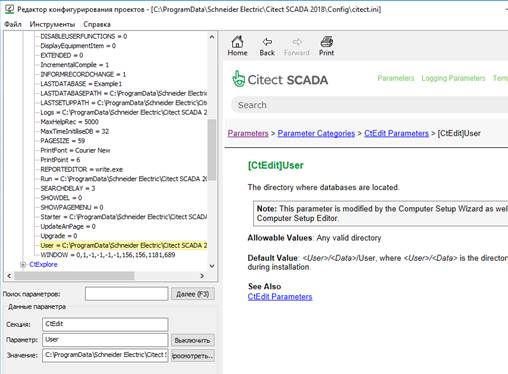

*Рис.2.4.* Редактор Citect.ini

## About Parameters

Citect SCADA supports two types of parameters:

[/AVEVA/Citect%20SCADA%202018%20R2/Bin/Help/Citect%20SCADA/Subsystems/ParametersCitectHTML/Skins/Default/Stylesheets/Images/transparent.gif)Project Database Parameters](javascript:void(0);)

[/AVEVA/Citect%20SCADA%202018%20R2/Bin/Help/Citect%20SCADA/Subsystems/ParametersCitectHTML/Skins/Default/Stylesheets/Images/transparent.gif)Citect.ini File Parameters](javascript:void(0);)

Parameters determine how each Citect SCADA computer operates in both the Citect SCADA configuration and runtime environments. 

Project database parameters can be used to set nominal defaults for parameters that are local to a specific Citect SCADA project, rather than a particular computer. For example, you could use  the project database parameters to specify login requirements for all  computers in a Citect SCADA system. 

To set (or change) the parameters in a project database, go to the **Setup** activity in Citect Studio and select **Parameters** from the Navigation Menu. Any changes to your project database parameters are only implemented following a project recompile.

The Citect.ini file is a text file that stores  values for a comprehensive set of operating parameter that are used to  configure the operational settings for each computer in a Citect SCADA system. These values are read by Citect SCADA on startup to determine how the application should operate. 

To view the complete list of built-in operating parameters that you can use in a Citect.ini file, see [Parameter Categories]---/Subsystems/ParametersCitectHTML/Content/Parameter_Categories.html). 

During installation, a default Citect.ini file is copied to the Citect SCADA Config folder in the Program Data directory. This configuration file contains a series of undocumented parameters used by Citect SCADA as well as a series of default settings.

> - Do not under any circumstances change or remove any of the undocumented Citect.ini parameters.
> - Before deleting sections of the Citect.ini file, confirm that no undocumented parameters will be deleted.

**Примітка.** Завжди звертайтеся за порадою до персоналу технічної підтримки цього продукту щодо недокументованих функцій.

Файл Citect.ini має визначену структуру, що складається з **header**, кілька **sections** (містить параметри та їх значення) і **коментарів**.

**Примітка.** Налаштування параметрів у файлі Citect.ini мають пріоритет над параметрами бази даних проекту (див. [Пріоритетність параметрів](file:///C:/Program Files (x86)/AVEVA/Citect SCADA 2018 R2/Bin/ Довідка/Citect SCADA/Підсистеми/ParametersCitectHTML/Content/Parameter_Precedence.html)).

### Header

The header of the Citect.ini  file contains comments the user wants to document about the  configuration settings contained within the file. Typically it would  include a history of edits made to the file and reasons for those edits. For example:

```ini
# Originally set up by XX on XX for use on XX
# Modified by XX on XX at the recommendation of Technical Support.
```

Comments are located at the top of the file before the first definition of a section. Each line of the  header starts with the "hash" or "pound" character (#). 

For more information, see [Add Comments to the Citect.ini File]---/Subsystems/ParametersCitectHTML/Content/Add_Comments_to_the_Citect.ini_File.html).

### Sections

In a Citect.ini file, parameters are organized into sections according to their purpose.

The syntax used to define a section is as follows:

```ini
[Section Name]
<parameter name1> = <parameter value1>
<parameter name2> = <parameter value2>
<parameter nameX> = <parameter valueX>
```

For example:

```ini
[Alarm]
Primary = 1
SavePeriod = 600
SaveSecondary = 
ScanTime = 500
```

The following rules apply when the Citect.ini is read at runtime:

- A section continues until a new section is defined or the end of file is reached.
- Each parameter definition finishes with a return.
- Any line starting with a hash or pound (#) character is considered to be a comment.
- Any line starting with an exclamation mark (*!*) is considered to be disabled and therefore treated as a comment.
- The maximum length for a parameter is 254 characters.

Sections which relate to server components (Alarms, Trend, Reports, I/O Server) also support  hierarchical inheritance to allow parameters to be fine tuned to the  cluster or server component level. The syntax used is as follows:

```ini
[Section Name.ClusterName.ServerName]
<parameter name1> = <parameter value1>
<parameter name2> = <parameter value2>
<parameter nameX> = <parameter valueX>
```

For example:

```ini
[Alarm.Cluster1.Server1]
SavePeriod = 600
ScanTime = 500
```

### Comments

You can add comments to a parameters section or a particular parameter setting in the Citect.ini file.

Comments for a **section** commence with a hash or pound character (#)  and occur on the line just above the declaration of the relevant section.

For example:

```ini
#Alarm Section comment would go here
[Alarm]
```

For more information, see [Add Comments to the Citect.ini File]---/Subsystems/ParametersCitectHTML/Content/Add_Comments_to_the_Citect.ini_File.html).

Comments for a **parameter** commence with a hash or pound  character (#) and occur on the line just above the declaration of the relevant parameter.

For example:

```ini
[Alarm]
#Set to 1 by System Administrator on 30/06/2005 10:13:44 AM.
Primary = 1
```

For more information, see [Add Comments to the Citect.ini File]---/Subsystems/ParametersCitectHTML/Content/Add_Comments_to_the_Citect.ini_File.html).

### Example

An extract from a typical Citect.ini configuration file is shown below.

```ini
#
#Header Comment on Citect.ini file
[Alarm]
#Set to 1 by System Administrator on 30/06/2015 10:13:44 AM.
Primary = 1
SavePeriod = 600
SaveSecondary =
ScanTime = 500
Server = 1
```

In most cases, if you set (or change) parameters in the Citect.ini file, you need to restart Citect SCADA before the new parameter settings are used. However, there are a few  exceptions to this rule where Citect.ini parameters are read at regular intervals and can be changed during runtime. Where this is the case, the parameter is documented accordingly.

If a parameter applies to a  particular process, setting changes are implemented as soon as the  associated process is restarted. For example, an Events parameter for an Alarm Server will be used as soon as the specific Alarm Server is  restarted.

## Parameter Precedence

On a machine where a parameter is set in **both** the project database and the Citect.ini file, the value contained in the Citect.ini will be used by that machine. 

For example, in the diagram below, the project value for "parameter X" (which is stored in the project database) is **n**. This is the value used for parameter X on every server and client  EXCEPT the I/O server and trends server, both of which use the values  set in their local Citect.ini files (**p** and **m** respectively).

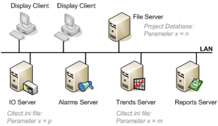

A parameter which is global to a project and  applies to the majority of servers running a project is recommended  therefore to be defined in the project database where it can be  centrally managed and controlled. Any exceptions to this global value  can then be managed by modifying the Citect.ini file on the machine to  which the exception applies.

### Included projects

If the Citect.ini has no  parameter setting, the value used will be the value specified in the  lowest level include project. This means that it will then ignore any  value placed in the top level projects at Runtime in favor of the lowest level include project which has the parameter set. Naturally if the parameter is not set anywhere, then the default value  for the parameter will be used.

For example, using the  parameter `[Alarm]SavePeriod`. The default value is 600. In this example  there is a main project and an included sub project with the parameter  being set as shown below. The runtime result column in the table below  shows what Citect SCADA considers the value to be, for example if the ParameterGet() Cicode was used.

| Citect.ini | Main | Include | Runtime Result |
| ---------- | ---- | ------- | -------------- |
| None       | None | None    | 600            |
| None       | 300  | None    | 300            |
| None       | None | 400     | 400            |
| None       | 300  | 400     | 400            |
| 500        | 300  | 400     | 500            |
| 600        | 300  | 400     | 600            |

### Duplicate Parameters

If the parameter is defined  multiple times either in the same project or different include project,  the effective value of the parameter is unpredictable. The compiler will pick up the first entry of the parameter found in the project  hierarchy, but does not check for duplicate entries.

This means it is not possible  to override parameters defined in the included project by defining the  same parameter (with different value) in the including project. It is  recommended that when you create a new parameter for your project and  give it a default value, you define the default value inline rather than defining it as a project parameter in the included project. For  example:

Call ParameterGet ("MySection", "MyParameter", MyDefaultValue) whenever needing to read the parameter.

MyDefaultValue can be defined  as a label so it is accessible outside Cicode files, or as a global  variable if the parameter is only used in Cicode files. By doing this,  the value of the parameter is overridden in the including project (by  defining the value for the parameter in the system parameter database).

However, if the same parameter  is defined in the local Citect.ini file, it will always take precedence  over the parameter defined in the project. But , if the parameter is  defined multiple times in the Citect.ini file, only the first entry will be picked up.

## Hierarchical Parameters

As Citect SCADA supports clustering and the ability to run multiple servers of the same type on one machine, there are circumstances when the server component  parameters (alarm, report, trend, I/O server) need to be tuned to a  finer level than just machine level. For this reason, these parameters  are hierarchical parameters that are capable of being implemented at a  number of levels: 

- **Component type level**   
- The widest scope, the parameter value will apply to every instance of the server type. 

- **Cluster level**   
- The parameter value will apply to every instance of the server running in the specified cluster. 

- **Server level**   
- The parameter value will apply to the instance of the server running in the specified cluster, on the specified machine. 

These parameters support **hierarchical inheritance**, that is, a parameter will:

1. Apply a value set for it at a server level;
2. If that is not specified, apply a value set for it at a cluster level;
3. If that is not specified, apply a value set for it at a component level;
4. If that is not specified, apply the default value for that parameter.

### Example

The following Citect.ini file  is applied to Server1 and Server2 (both in Cluster1), and to Server3 and Server4 (both in Cluster2).

```ini
[Alarm]SavePeriod = 500
[Alarm.Cluster1]SavePeriod = 600
[Alarm.Cluster1.Server1]SavePeriod = 1000
```

This is illustrated in the diagram below.

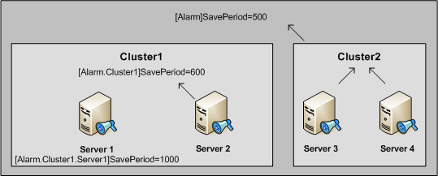       

The values applied at each server for [Alarm]SavePeriod would be as follows:

| Cluster Name | Computer Name | SavePeriod Value |
| ------------ | ------------- | ---------------- |
| Cluster1     | Server1       | 1000             |
| Cluster1     | Server2       | 600              |
| Cluster2     | Server3       | 500              |
| Cluster2     | Server4       | 500              |

**Note:** Hierarchical  parameters may be set in the parameters database. In this case normal  rules of precedence will apply. For more information see [Parameter Precedence]---/Subsystems/ParametersCitectHTML/Content/Parameter_Precedence.html).

## Computer Setup Editor

The Computer Setup Editor is a utility designed to help you manage your Citect.ini files. It combines a graphical user  interface with an extensive Help system. 

The interface provides a convenient way to  view, search and modify parameters within a Citect.ini file. The Help  system navigates the user through the parameter reference documentation, displaying the topic relevant to the current parameter.

You can use the Computer Setup Editor to perform the following tasks:

- Add or delete parameters
- Change the value of existing parameters (including the addition of optional comments)
- Save changes to disk, cancel all changes or backup to a new file
- Generate a Comparison Report between two separate configuration files, visually highlighting their differences
- Generate an Analysis  Report on a configuration file, which provides a useful summary of  parameter settings including validity checks on bounds and paths.

The Computer Setup Editor interface consists of the following components, which are described below:

   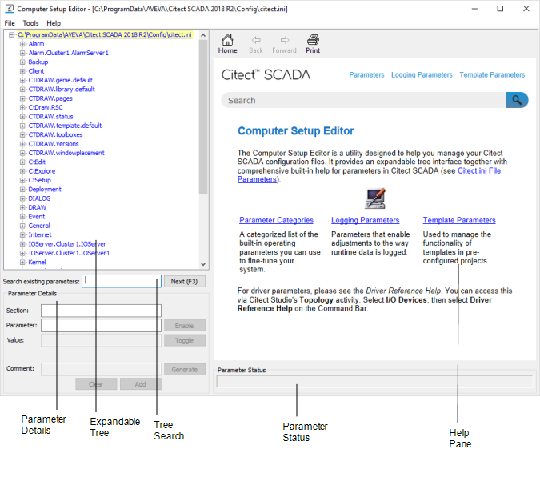        

### Expandable Tree

The expandable tree is used to display and navigate the contents of the Citect.ini file. 

Each branch on the tree  represents a section within the Citect.ini file. Each branch represents  the parameters within that section. You can expand and collapse the tree nodes by clicking the "+" and "-" by each element, just as you would in Windows Explorer.

Expand the Tree

To expand the tree:

1. Right-click the top element of the tree.
2. Choose **Expand all** from the shortcut menu. 
3. The configuration parameter tree expands to show all parameter entries

Collapse the Tree:

To collapse the tree:

1. Right-click the top element of the tree.
2. Choose **Collapse all** from the shortcut menu.
3. The configuration parameter tree collapses to show only section entries.

### Parameter Details

You can use the Parameter Details pane to view and modify settings and comments for parameters and sections. For details see: 

- Edit Parameter Sections
- Edit Parameters
- Add Comments to the Citect.ini File

When a parameter or section  entry is highlighted in the tree pane the corresponding values populate  the Parameter Details pane and the corresponding Help files appear in  the help pane. 

Similarly, the Parameter  Details pane populates when a Help topic is selected. This occurs  whether or not the parameter exists in the current configuration file.

### Tree Search

You can use the tree search to search for a particular element in the Computer Setup Editor's expandable tree.

To search for a specific parameter in the tree:

1. Type the search string in the **Search existing parameters** field..
2. The tree expands and highlights the first occurrence of the text string you entered.
3. Note: If the search string is not found a message appears in the Parameter  Status pane. In this case, a hyperlink will appear in that pane which  can be clicked to perform a search through the help reference topics.

4. To continue to search for the next match within the parameter tree, click **Next** in the tree search pane, or press **F3**. To go to the previous instance, press **Shift + F3**.
5. If the top or bottom of the Parameter Tree is reached a message appears in the Parameter Reference pane.

### Help Pane

The Help pane displays context-sensitive parameter reference topics.

Use the **Back**, **Forward** and **Home** buttons shown in the pane to navigate the Help. Click **Print** to print the current page.

To bypass the introductory Help pages and go straight to a specific help topic, choose the relevant Help topic from the **Help** menu.

When a section or parameter  entry is selected in the expandable tree pane, the corresponding Help  page appears in the help pane. If the selected item does not have a Help page, a message to this effect appears in the help pane.

**Note:** The converse of  the above is also true: when a Help topic is selected in the Help pane,  the corresponding entry in the expandable tree pane (provided it exists) is automatically selected.

### Parameter Status

The parameter status pane becomes active when either:

- A user selects a section or parameter entry in the expandable tree pane.
- A user selects a Help topic in the help pane.

Once active, the parameter  status pane displays the name of the section entry being viewed, the  name of the parameter entry being viewed (if applicable) and the status  of that entry in the current configuration file.

The status shown will depend on whether a help topic exists for this parameter. 

If there is no help topic the status pane will tell you so.

If there is a help topic the status pane will state whether:

- The section already exists in this configuration file;
- The parameter already exists in this configuration file;
- The section is not specified in this configuration file; or
- The parameter is not specified in this configuration file.

**Note:** Section and parameter names are active links that cause the corresponding help topics to be displayed in the help pane.

**Note:** The Computer Setup Editor cannot  be used to maintain or set server parameters when being configured at  the component or server level using [Hierarchical Parameters]---/Subsystems/ParametersCitectHTML/Content/Hierarchical_Parameters.html).

## Cicode functions

### ParameterGet

Gets the value of a system parameter. The system parameter can exist in the CITECT.INI file and/or in the Parameters database. If the system parameter does not exist in the  CITECT.INI file or the database, the default value is returned. If the  system parameter exists in both CITECT.INI and the database, the value  of the system parameter is taken from CITECT.INI.

Syntax

**ParameterGet**(*Section, Name, Default*)

*Section:* The section name.

*sName:* The system parameter name.

*Default:* The default value of the parameter.

**Note:** If in your Cicode you perform a ParameterGet("alarm", "alarmsave", 1000)  for say the [Alarm]SavePeriod  parameter, and NO entry exists in Citect.ini or the parameters records,  the returned value  will be 1000 however Citect SCADA will internally be using the default value of 600.

Return Value

The parameter (as a string).

```
ParameterGet ("CtEdit", "Data","none")
```

### ParameterPut

Updates a system parameter in the CITECT.INI file. If the system parameter does not exist, it is added to the CITECT.INI file.

Syntax

**ParameterPut**(*Section, Name, Value*)

*Section:* The section name.

*sName:* The system parameter name.

*Value:* The value to put in the system parameter.

Return Value

0 (zero) if successful, otherwise an error


## Майстер налаштування компютера 

### Project Configuration

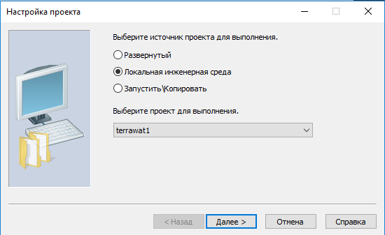

​           

The Project Setup page will vary depending on whether you are configuring a project from Citect Studio, or from a runtime only environment

Select the project source to run on this Citect SCADA computer. You will have the following options:

| Option                  | Description                                                  |
| ----------------------- | ------------------------------------------------------------ |
| **Deployed**            | This option should only be selected if [deployed projects]---/Content/Deployment.html) exist. If no deployed project(s) exist and you select this option, the following alert message is displayed: <br />“Cannot use Deployed as the project source, as no projects have been deployed”. <br />Projects that have been  deployed will be listed in the “Select the project to run” field.   Select a project and the version of the project to run. You can use this option to roll back to previous versions of the project. |
| **Local Citect Studio** | Compiled projects available in the Local Citect Studio will be listed. If there is only one  compiled project present, it will be selected automatically. If there  are no compiled projects present, an alert message is displayed and the  wizard will terminate. If this occurs, return to the Project and confirm that the necessary project is saved locally and has compiled without  errors. |
| **Run/Copy**            | No additional options are available. Refer to [runtime only environment]---/Content/Runtime_only_Environment.html) for more information. |

**Note:** If you change this setting from **Deployed** to **Local Citect Studio**, the project that runs on the computer will no longer be synchronized  with deployment updates. You need to consider the implications of  changing the runtime project on the local computer.

#### Run/Copy (Runtime-only Environment)

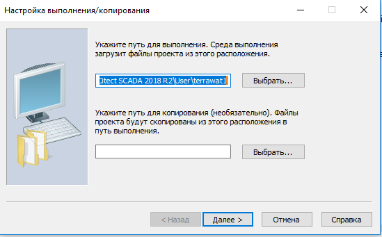

Before configuring the runtime only  environment, and running the Setup Wizard, it is assumed you have  transferred a project from the configuration environment, including  compiled projects to your local machine. If not refer to Backing up a project for more information.

Using the .CTZ files from your backup included  projects and target project, you can restore the project. It is  recommended you restore the included project before the target project.  The restore project tool is available from the start menu shortcut **Runtime Configuration | Project restore**

In the Project Restore dialog :

1. In the **Backup file** field, browse or enter the name of the project to restore.
2. Under To, the option **Current project**, may be unavailable. This is due to no project having been run on the local machine before. The option **New project** will be selected to restore a backed up project as a new one.
3. In the **Name** field, enter a name of the restored project.
4. In the **Location** field, enter or browse to the location of the project to restore (restore the project under the 'User' folder).
5. Leave the remaining settings as default and click **OK**.
6. The project will be restored.

You are now ready to run the Setup Wizard available from the start menu shortcut **Runtime Configuration** | **Citect SCADA** **Computer Setup**

In the RUN path edit box enter, or use the  select button to browse for,  the path to the local project that you  wish to the client to run.If you enter the run path set the run folder  under the ‘User’ Folder.        

If you wish to maintain a synchronized local  version of an external project select the Enable RUN/COPY deployment  check box. Then in the COPY path edit box enter, or use the select  button to browse for,  the path to the external project that you wish  maintain synchronization. This feature uses the  [CtEdit\]Run [CtEdit\]Copy commands to maintain synchronization between the two projects.

**Note**: The Run/Copy  mechanism does not transfer custom files such as meta-data, icons,  images or runtime DBF files. Therefore, it is recommended deploying a  project before Run/Copy to help ensure that those files at least exist.  You will still need to re-deploy a project, when you want to update the  custom files.

### Profile Setup

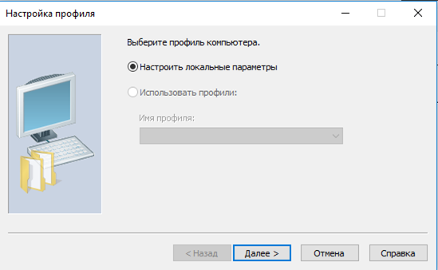

Select the INI file to be loaded on this Citect SCADA computer at Runtime.

To load the Cictect.ini file at Runtime leave the option **Configure Local Settings** selected.

**Use Profiles**         

From the drop-down list provided select one of  the profiles configured in your project. At Runtime the selected profile will be loaded.

**Note**: Use the Profile Setup Wizard to create a <profile>.ini file. Once created use the Computer  Setup Editor to configure parameters specific to that Profile.

### Computer Role Configuration

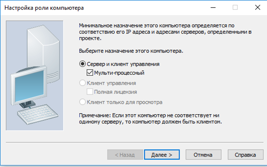

Use the Computer Role Setup page to specify the role of the computer running Citect SCADA. Select one of the options described below.

**Note:** In order to use Citect SCADA's multi-process capabilities, networking *needs to be* enabled.

| Option                    | Description                                                  |
| ------------------------- | ------------------------------------------------------------ |
| Server and Control Client | This computer will be a standalone or networked I/O Server and Control Client. This option is disabled if this computer has no Server components assigned to it to run. Selecting this option enables the **Multi-Process** check box. <br />Select the **Multi-Process** check box to separate your client and server components into individual processes. This option can be used for distributing the components  across multiple CPUs. If you leave the **Multi-Process** check box unselected, Citect SCADA will run the client and server components in one process. <br />If the **Multi-Process** check box is selected the [General]MultiProcess parameter in the  Citect.ini file is saved with the value 1. If not selected, the  parameter is saved with the value 0. |
| Control Client            | This computer will  only be a Control Client. This option is disabled if this computer has  been assigned a Server component to run. Selecting this option enables  the **full server license** check box.<br />Select the full server license check box if you want this Control Client to use a full  (server) license, as opposed to a client license. This sets the  [Client]FullLicense parameter in the Citect.ini file to 1 (the default  value is 0). Generally, you would not allocate a full server license to a client as there is no difference in functionality between the two  licenses. Allocate a full server license if you have insufficient client licenses available, or for some other specific need. |
| View-only Client          | This computer will only be a View-only Client. This read only option is disabled if this computer has been assigned a Server component to run. |

Some of these options may be disabled  depending on what servers have been configured to run on this computer.  The  Setup Wizard cross-references your computer's network  identification with the network addresses configured for each server in  your project configuration.


### Network Model

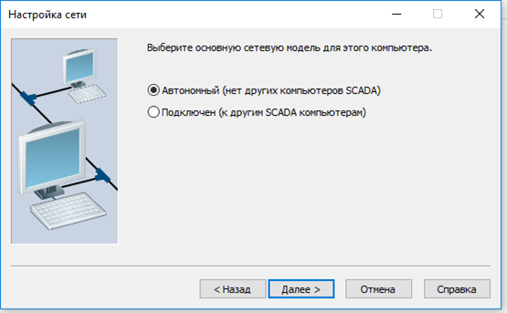

Select the network model to be applied to this Citect SCADA computer. Options include:

- Stand alone (no other SCADA computers))
- Networked (connect to other SCADA computers)

 From Version 7.0 Citect SCADA uses TCP/IP to facilitate communications across a network.

**Note:** TCP/IP address information for servers is configured within the Citect SCADA project itself. See Add a Network Address for more information.

When you complete the Profile Setup Wizard, the chosen network model is written to the `[LAN]` section in the `ini` file; for example:

```ini
...
[LAN]
TCPIP=1
...
```

### Reports Server Properties Setup

The Reports Configuration page will only be displayed if this machine is configured as a Reports Server in the Topology activity.

**Note:** For a networked  computer to be a Reports Server it needs to also be the I/O Server or  needs to be able to communicate with the I/O Server on the network.

Citect SCADA has several options available for report processing:

| Option                                               | Description                                                  |
| ---------------------------------------------------- | ------------------------------------------------------------ |
| Startup report                                       | Defines the name of the report to run when Citect SCADA starts up. |
| Inhibit triggered reports on startup                 | Наприклад, у вас може бути звіт, який запускається з наростаючого фронту біта під час запуску. Сервер звітів виявляє біт і запускає звіт. Якщо цей параметр позначено, сервер звітів не запускатиме цей звіт, доки він не прочитає пристрої введення-виводу вдруге. |
| Run reports concurrently with primary Reports Server | Enables or disables tandem  processing of reports. If this server is the standby Reports Server, it  can process every report in tandem with the primary server, or it can  remain idle until called. |

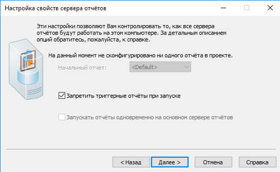


### Trends Server Properties Setup

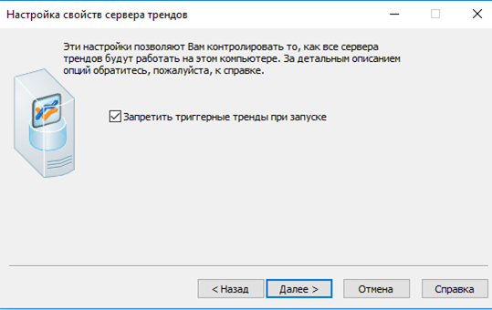

The Trends Configuration page will only be displayed if this machine is configured as a Trends Server in the Topology activity.

**Note:** For a networked  computer to be a Trends Server it needs to also be the I/O Server or  needs to be able to communicate with the I/O Server on the network.

Citect SCADA has one option available for trend processing:

| Option                              | Description                                                  |
| ----------------------------------- | ------------------------------------------------------------ |
| Inhibit triggered trends on startup | You might have a trend that is triggered off the rising edge of a bit on startup. If this option is  enabled, the trends server does not display the trend until it has read  the I/O Devices a second time. |

### CPU Configuration

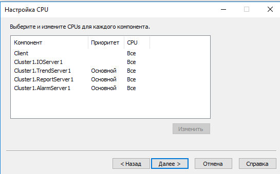

The CPU Setup page is used to assign client and server components to specific processors in a multi-processor machine.

This page lists each component's full name,  including the cluster to which it belongs, the priority and the CPU  assignment. If the multi-process option was not selected on the Computer Role Configuration page there will only be one entry listed, either Client or Client and  Servers. If the Multi-process option was selected, you have the option  of selecting specific CPUs for the Client, I/O Server, Alarm Server,  Trends Server and Reports Server.

To assign a CPU to a component:

1. Select one or more components from the list (hold the **Ctrl** key down to select multiple components).

**Note:** In some situations,  when 'All' processes is selected under "Modify CPU Configuration"  windows in the Setup Wizard, be aware that performance issues may still  occur when your CPU usage is less than 100%. You can detect these issues when your CPU usage for a process is fixed at 100 divided by your  number of processors.

When you complete the Setup Wizard, the CPU assignations are written to each component section in the `ini` file; for example:

```ini
...
[Alarm.Cluster1.AlarmServer1]
CPU=1
Clusters=Cluster1
...
[Trend.Cluster1.TrendServer1]
CPU=2
Clusters=Cluster1
...
```

### Events Configuration

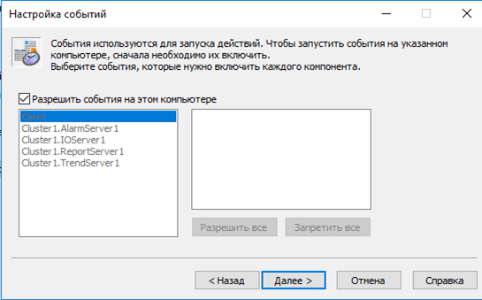

Events are used to trigger actions, such as a  command or set of commands. For example, an operator can be notified  when a process is complete, or a series of instructions can be executed  when a process reaches a certain stage. Select the **Enable Events on this computer** check box if events are to be enabled on this Citect SCADA computer.

The Events Setup page lists each component's  full name, including the cluster to which it belongs, alongside a list  of events that can be enabled for each component. If the **Multi-process** option was not selected on the Computer Role Configuration page there  will only be one entry listed, either Client or Client and Servers. If  the **Multi-process** option was selected, you have the option of enabling events for each component on this computer.

**Note:** The  Setup Wizard  only displays named events from the selected project. If you are using  events in included projects you will need to edit your `ini` file to add these under the `[Events]` section header.

**Note:** Events named  'Global' or events with no title will not appear as these are global  events. These events will run on computers that have events enabled.  These events will run in the client process.

To enable an event for a component:

1. Select the component from the list.
2. Select the events you want to enable for that component, or click **Enable All** or **Disable All**.
3. Click **Next** when finished.

When you complete the Profile Setup Wizard, the events are written to each component section in the ini file; for example:

```ini
...
[Alarm.Cluster1.AlarmServer1]
CPU=1
Clusters=Cluster1
Events=CSV_AlarmClient
...
[Trend.Cluster1.TrendServer1]
CPU=2
Clusters=Cluster1
Events=CSV_TrendXClient,CSV_TrendXServer
...
```

### Startup Functions Configuration

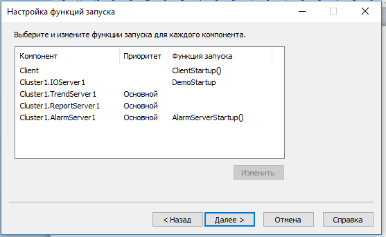

The Startup Functions Setup page is used to define the Startup Cicode that is executed by each Citect SCADA process.

The Startup Functions Setup page lists each  component's full name, including the cluster to which it belongs, the  priorities of the components and the startup function assigned to each  component. If the **Multi-process** option was not selected on the Computer Role Configuratio page there will only be one entry listed, either Client or Client and  Servers. If the Multi-process option was selected, you have the option  of assigning startup functions for each component on this computer.

If the StartupCode parameter value for a process is invalid, the Citect SCADA Runtime Manager will simply ignore it on start up.

To assign a startup function to a component:

1. Select the component from the list. To select multiple components, hold down the Ctrl key as you select each item.
2. Click **Modify**.
3. Type the name of the Cicode function you want to call on startup for that component.
4. Click **OK**.

When you complete the Setup Wizard, the events are written to each component section in the `ini` file; for example:

```ini
...
[Alarm.Cluster1.AlarmServer1]
CPU=1
StartupCode=alarmServerStartup
...
[Trend.Cluster1.TrendServer1]
CPU=2
StartupCode=trendServerStartup
...
```

### Cluster Connections Configuration

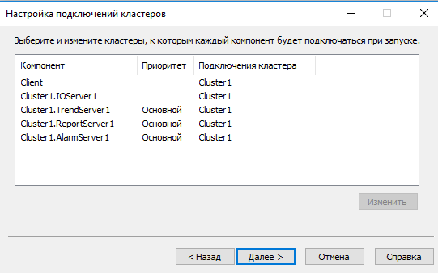

Сторінка Налаштування з'єднань кластерів використовується для визначення кластерів, до яких кожен компонент підключається під час запуску. Це визначає, які потоки даних може бачити компонент у системі.

На сторінці "Налаштування підключень кластера" перелічено повне ім'я кожного компонента, включаючи кластер, до якого він належить, пріоритети компонентів і кластери, призначені кожному компоненту. Якщо в [Конфігурація ролі комп’ютера] не вибрано параметр **Багатопроцесний** у списку буде лише один запис, або Клієнт, або Клієнт і Сервери. Якщо вибрано параметр **Багатопроцесний**, у вас є можливість призначити кластери для кожного компонента на цьому комп’ютері.

За замовчуванням кожен компонент буде підключатися до кожного кластера, якщо не змінено інше.

Якщо значення параметра Clusters для процесу недійсне, то середовище виконання Citect SCADA просто проігнорує його під час запуску.

To assign a cluster to a component:

1. Select the component from the list. To select multiple components, hold down the Ctrl key as you select each item.
2. Click **Modify**.
3. Select the clusters you want the component to connect to on startup.
4. Click **OK**.

When you complete the Setup Wizard, the clusters are written to each component section in the `Citect.ini` file; for example:

```ini
...
[Alarm.Cluster1.AlarmServer1]
CPU=1
Clusters=Sydney
...
[Trend.Cluster1.TrendServer1]
CPU=2
Clusters=Sydney,Tokyo
...
```

### Configure Server Password

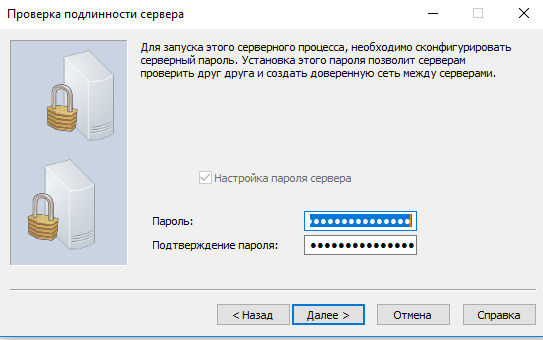

If networking is enabled use this page to  configure the machine password. The machine password is used by  computers to authenticate each other and create a trusted network  between servers. Configuring the password automatically sets the [Client\]PartofTrustedNetwork]  INI parameter.

**Note**: You will not be able to configure the server password if you are not a member of the local Windows group Citect.Engineers. 

**If a server process exists and networking has been enabled:**        

The **Configure Server Password** check box is selected and unavailable.

Enter the Password, and confirm the password in the fields provided, before clicking Next.

**If a client process exists and networking is enabled:**         

The **Configure** check box is unchecked. Select to enable the password fields.

Enter the password and confirm password in the fields provided, before clicking **Next**.

**Note**: If a server password has already been configured for the machine, the ‘Password’ and  “Confirm Password” fields will be pre-filled.

### Configure Server User

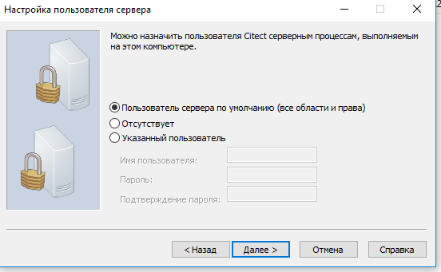

Use this page to define the user to log in for  the server processes running on the machine. The user can be the default server user, none (view-only), or a specified user. The Setup wizard  will automatically configure the [Server]AutoLoginMode INI parameter in  line with the user’s settings.

Select **Specific User** to enable the Configure Server User fields. The fields will remain disabled if either the **Default Server User** option or **None** option are selected.

### Control Menu Security Configuration

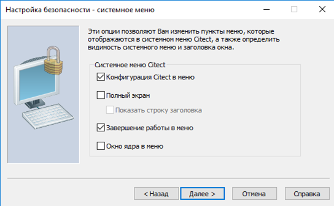

The Citect SCADA window property options allow you to control an operator's access to system features.

This allows for flexibility with system security at run time.

| Option                                         | Description                                                  |
| ---------------------------------------------- | ------------------------------------------------------------ |
| Citect SCADA configuration environment on menu | Allows the operator to use the control menu (top left-hand icon) to access Citect Studio, Graphics Builder, and Cicode Editor from Citect SCADA at run time. Disabling this provides better security. |
| FullScreen                                     | Allows the operator to set  whether pages will be displayed in fullscreen or restored state. When  checked “FullScreen” will set  the ini parameter [Animator]FullScreen to 1. If “FullScreen” is set. |
| Show title bar                                 | Allows the operator to set  whether pages will be displayed in fullscreen mode with the title bar.  The [Animator]FullScreen ini parameter is set as follows: 0 if  “Fullscreen” is unchecked; 1 if “Fullscreen” is checked and “Show title  bar” is unchecked; 2 if both “Fullscreen” and “Show title bar” are  checked.“Show title bar” cannot be modified if the option“Fullscreen” is unselected. |
| Shutdown on menu                               | Allows the operator to use the control menu (top-left icon) to shut down Citect SCADA at runtime. The shutdown is not password- or privilege-protected. Disabling this provides better security. |
| Kernel on menu                                 | Allows the operator to use the control menu (top left icon) to display the Citect SCADA Kernel at run time. Disabling this provides better security. |

### Keyboard Security Configuration

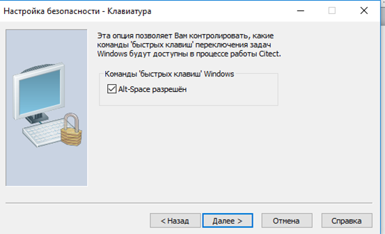

Windows has a set of standard task-swapping shortcut commands that are (optionally) supported by Citect SCADA at run time. This option allows the Alt-Space Windows command to be  enabled or disabled at run time. Alt-Space provides access to the  Windows control menu (even if the title bar has been disabled).

**Note:** The ability to disable Alt-Escape, Ctrl-Escape and Alt-Tab is not currently available.

### Miscellaneous Security Configuration

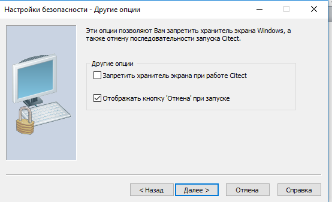

Some standard Windows features may interfere  with the secure operation of your system. Use the Miscellaneous Security page to disable these features.

| Option                                             | Description                                                  |
| -------------------------------------------------- | ------------------------------------------------------------ |
| Inhibit screen saver while Citect SCADA is running | Stops the screen saver from  blanking out screens that need to be visible at all times. Alternatively the screen saver password can add additional security features. |
| Display Cancel button at startup                   | Provides the ability to stop Citect SCADA from starting up automatically. Automatic startup is a potential security concern |

### General Options Setup 	

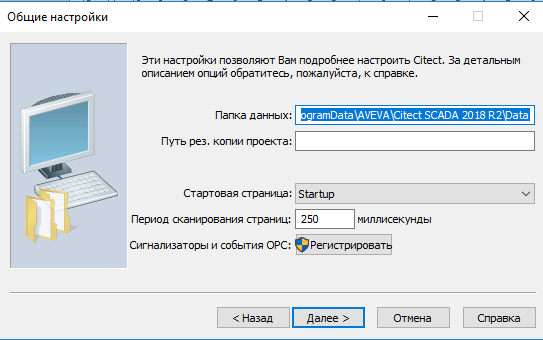

Use the General Options Setup page to specify general options.

| Option                | Description                                                  |
| --------------------- | ------------------------------------------------------------ |
| Data Directory        | The directory where the Citect SCADA data files are located. The data files are the files that are generated at run time: trend files, disk PLC etc. |
| Backup project path   | The backup directory that is  used if a runtime database cannot be located (due to inoperative  hardware or a file that has been moved, corrupted, or deleted). |
| Startup page          | The Page Name of the [graphics page]---/Content/Pages.html) to display when Citect SCADA starts up. |
| Page scan time        | The delay (in milliseconds)  between updating a graphics page and starting the next communications  cycle. The Page Scan Time sets the default for how often your graphics  pages are updated. When a page is updated, relevant data (variable tags  etc. represented on the graphics page) is scanned to determine if field  conditions have changed. This setting is overridden by the Scan Time  value specified in Page Properties (if applied).  <br />A value of 250 (the default value) indicates that Citect SCADA will try to update the page every 250 ms. However, if Citect SCADA cannot read the entire data from the I/O Device within 250 ms, the page is processed at a slower rate. For example, if it takes 800 ms to read  the data from the relevant I/O Device, Citect SCADA processes the page every 800 ms.  <br />Under some conditions, you  might want to slow the update of your pages to reduce the load on the  I/O Servers. By reducing the page scan time, you allow more  communication bandwidth to other Citect SCADA tasks or Clients. For example, you might want fast response on your  main operator computers, while slowing the response time on manager  computers. You can enter any value from 0 to 60000 (milliseconds). |
| OPC Alarms and Events | Click the **Register** button to register alarm servers defined in a project to be accessed via a third party OPC client. <br />**Note**: This registration requires administrative privileges. If already logged on  as an administrator you will be asked to allow the program to run with  elevated privileges. Click OK to proceed. If  logged on as a  non-administrator, you will need  to provide an admin password before  being asked to allow program to run with elevated privileges. |


## Profiles

- Do not under any circumstances change or remove any of the undocumented <profile_name>.ini parameters.
- Before deleting sections of the <profile_name>.ini file, confirm that no undocumented parameters will be deleted.

A profile stores runtime parameter settings that are specific to a particular type of computer within a Citect SCADA system (for example, a client or server). These settings are stored in a "<profile_name>.ini" file that can be distributed to any computer where a project is deployed. 

Profiles are created in the Topology activity using the [Profile Wizard]---/Content/Profile_Setup_Wizard.html). 

The Citect SCADA Example Project includes three profiles that you  can select from the [Profile Setup Page]---/Content/Profile_Setup_CSW.html) in the Setup Wizard. Once you have selected the profile you would like, you can compile and run the Example project.

You can use the **Deployment** activity to distribute Profile.ini files to the computers in a Citect SCADA system (see [Deployment Computers]---/Content/Deployment_Computers.html)). 

**Note:** To use an INI file  you create with the Profile Wizard, either select it locally on a  computer using the Computer Setup Wizard, or use the deployment feature.

#### Add a Profile

To add a profile:

1. In the **Topology** activity, select **Profiles**
2. On the Command Bar, click the **Add/Edit Profile** button. This launches the Profile Wizard. 

### Profile Wizard

The Profile Wizard is similar to the Setup Wizard in that it allows you to configure parameters for a specific computer.  Configuration information is stored  in an INI file which can be  deployed to the for the specific computer for which it was configured. 

The Profile Wizard contains a series of pages allowing configuration of  computer-specific settings including:

- The role the computer has in the system network
- The project being run
- The CPU Configuration
- The Citect SCADA Events enabled for each component
- The Cicode run for each component on startup
- The cluster configuration
- The security settings applied.

Parameter values collected from the user through the Wizard interface are written to the <ProfileName> ini file.

**Note**: To use a profile, either select it locally on a computer using the Computer Setup Wizard, or use the deployment feature (see Deployment Computers). The values  in the profile.ini will take precedence over the values set in the local Citect.ini. However,  values that are set for the  parameters [CtEdit]Run, [CtEdit]Bin, [CtEdit]Data, [CtEdit]Logs,  [CtEdit]Config will  be taken from the local citect.ini and not from the profile.ini.

### Run the Profile Wizard

To run the  Profile Wizard:

1. Select a project in the Project activity. If not previously compiled, compile the project.
2. In the Topology activity, select **Profiles**.
3. On the Command Bar, click **Add/Edit Profile**. The  Profile Setup Wizard is displayed.
4. Select **Express Setup** or **Custom Setup**. 

The pages that are displayed depend on the configuration of the machine and include:

- [Profile Setup]---/Content/Profile_Setup.html)            
- [Select a Profile]---/Content/Select_A_Profile.html)            
- [Create a New Profile]---/Content/Add_A_New_Profile.html)            
- [Select a Node]---/Content/Select_Machine_Type.html)            
- [Select a Screen Profile]---/Content/Profile_Screen_Setup.htm)            
- [Computer Role Configuration]---/Content/Computer_Role_Configuration.html)            
- [Network Model]---/Content/Network_Model.html)            
- [Reports Configuration]---/Content/Reports_Configuration.html)            
- [Trends Configuration]---/Content/Trends_Configuration.html)            
- [Alarms Configuration]---/Content/Profile_Alarms_Configuration.htm)            
- [CPU Configuration]---/Content/CPU_Configuration.html)            
- [Events Configuration]---/Content/Profile_Events_Configuration.html)            
- [Startup Functions Configuration]---/Content/Startup_Functions_Configuration.html)            
- [Cluster Connections Configuration]---/Content/Cluster_Connections_Configuration.html) *
- [Configure Server Password]---/Content/Server_Password_Configuration.html)            
- [Configure Server User]---/Content/Server_User_Configuration.html)            
- [Control Menu Security Configuration]---/Content/Control_Menu_Security_Configuration.html)            
- [Keyboard Security Configuration]---/Content/Keyboard_Security_Configuration.html) *
- [Miscellaneous Security Configuration]---/Content/Miscellaneous_Security_Configuration.html) *
- [EcoStruxure Web Services Client Setup]---/Content/Profile_EWS_Client_Setup.htm) *
- [EcoStruxure Web Services Server Setup]---/Content/Profile_EWS_Services_Setup.htm) *
- [EcoStruxure Web Services Server User Setup]---/Content/Profile_EWS_Services_User_Setup.htm) *
- [General Options Setup]---/Content/General_Options_Setup.html) *

\* Only available in Custom Setup mode.

Each screen of the wizard is described in the sections that follow.


## CtEdit Parameters (вибрані)

[CtEdit]Backup - The backup directory that is used if a runtime database cannot be located (due to a disk becoming inoperative or a file is unreadable).

[CtEdit]Bin - The directory where the Citect SCADA binary files are located.

[CtEdit]Config - The directory where the Citect SCADA configuration files, such as Citect.ini, are located.

[CtEdit]Copy - Sets the COPY directory. Changes made in this directory will be automatically copied to the RUN directory (see below).

[CtEdit]Data - The directory where the Citect SCADA data files are located.

[CtEdit]Deploy - The location where a project will be stored when a deployment package is received from the deployment server.

[CtEdit]IncrementalCompile - Determines whether an incremental compile will occur.

[CtEdit]Logs - The directory where the Citect SCADA log files are located.

[CtEdit]LogLevel - Specifies the level of detail used in the equipment update log file.

[CtEdit]Run - The directory where the runtime database is located.

[CtEdit]Upgrade - Allows you to manually upgrade the projects in Citect SCADA.

[CtEdit]User - The directory where databases are located.