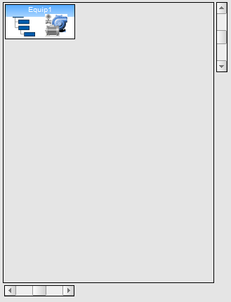
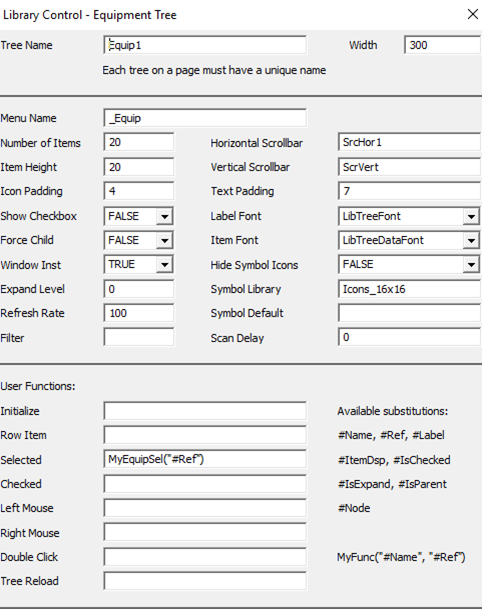
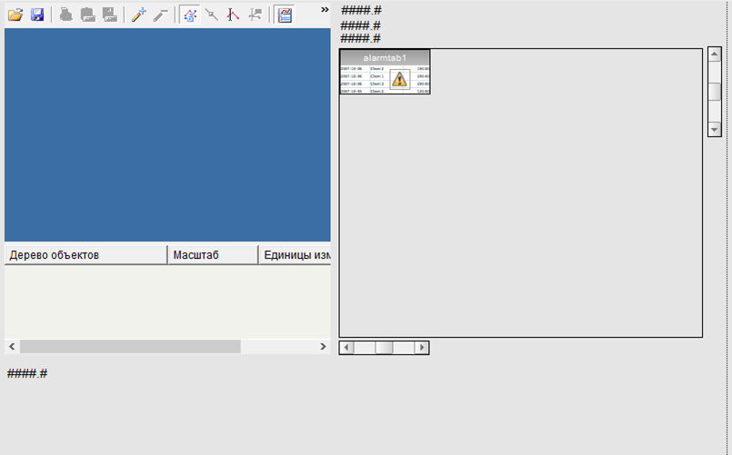
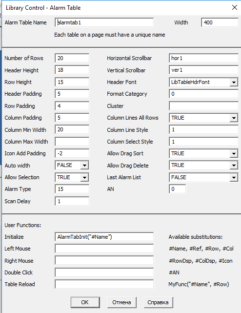
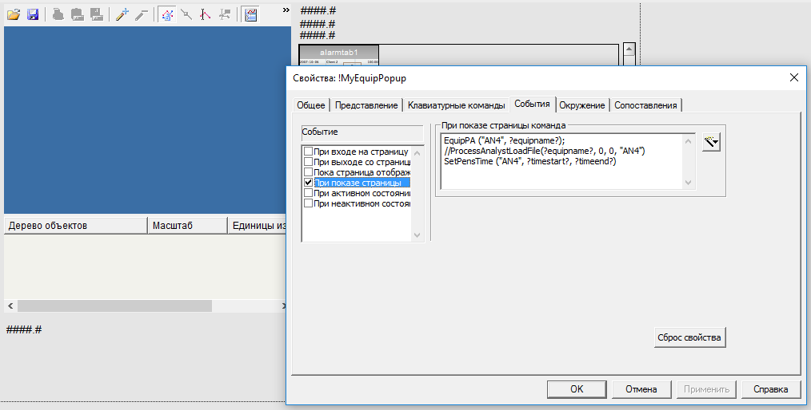

# Приклад онлайн звіту

При виборі устатковання з дереву викликається функція MyEquipSel, яка викликає спливаючу сторінку, куди передає назву обладнання та час для звіту: плинний час та плинний час мінус година. 





```c
FUNCTION MyEquipSel (STRING sEquipName)
	INT now = TimeCurrent();
	INT prewhr = TimeCurrent()-3600;
	STRING sNow = TimeToStr(now, 9) + " " + TimeToStr(now, 1);
	STRING sPrewhr  = TimeToStr(prewhr , 9) + " " + TimeToStr(prewhr , 1); 

	//GetTrnedTagsFromEquip (sEquipName);
	Ass(-2,"timestart", "'" + sPrewhr + "'", 0);
	Ass(-2,"timeend", "'" + sNow + "'", 0);
	Ass(-2,"equipname", "'" + sEquipName + "'", 0);
	PagePopUp ("!MyEquipPopup");
END
```

Сторінка popup має тренд та alarmtab. 



Налаштування alarmtab



AlarmTabInit фільтрує відображення тільки для вибраного устатковання та за вказаний час. 

```c
FUNCTION AlarmTabInit (STRING sTable)
	STRING sEquipment = AssInfo("equipname", 0);
	STRING sStartDate = AssInfo("timestart", 0);
	STRING sEndDate = AssInfo("timeend", 0);	
	
	// Set up columns
	LibTable_AddColumn(sTable, "ДатаЧас", 150, "LocalTimeDate");
	LibTable_AddColumn(sTable, "Tag", 150);
	LibTable_AddColumn(sTable, "Message", 150);
	LibTable_AddColumn(sTable, "State", 150);

	STRING sStartDate1 = StrMid (sStartDate,0,10);   
	STRING sStartTime1 =  StrMid (sStartDate,11,8);
	STRING sEndDate1 = StrMid (sEndDate,0,10);
	STRING sEndTime1 = StrMid (sEndDate,11,8);	
	STRING startDate = IntToStr (StrToDate(sStartDate1) + StrToTime(sStartTime1)); 
	STRING endDate = IntToStr (StrToDate(sEndDate1) + StrToTime(sEndTime1));
	STRING sFilter = "Equipment=" + sEquipment + "* AND LocalTimeDate>=" + startDate + " AND LocalTimeDate<" +  endDate + ";";
	tagstr = sStartDate1 + " " + sStartTime1 + " " + sEndDate1 + " " + sEndTime1 ; 
	// Set up filter
	INT nAN = LibAlmTable_GetAN(sTable);
	INT hEdit = AlarmFilterEditOpen(nAN);
	AlarmFilterEditSet(hEdit, sFilter);
	AlarmFilterEditCommit(hEdit);
	AlarmFilterEditClose(hEdit);
END
```

Налаштування запуску функцій при показу сторінки:



Функції шо викликаються:

```c
FUNCTION EquipPA (STRING NamePA, STRING sEquipName)
	ErrSet(1);

	OBJECT hAnalyst, hPanes, hPane, hPens, hPen;
	INT nPanes, nPens;
	STRING sTag;    
	STRING sFilter = "EQUIPMENT=" + sEquipName + "*";
    STRING sField = "NAME";
    INT iStatus = -1;
    INT hTagBrowse =  TrnBrowseOpen (sFilter,sField);
    IF (hTagBrowse <> -1) THEN
        iStatus = TrnBrowseFirst(hTagBrowse);
        WHILE iStatus = 0 DO
             sTag = TrnBrowseGetField(hTagBrowse,sField);
             ProcessAnalystSetPen(-1, sTag, NamePA)
             //tagstr = tagstr + sTag + ";" 
             iStatus = TrnBrowseNext(hTagBrowse);
             nError=IsError();
        END
        TrnBrowseClose(hTagBrowse);
    END  
    ErrSet(0);
END 
```

Встановлення часу для тренду:

```c
FUNCTION SetPensTime (STRING NamePA, STRING sStartDate = "11.10.2017 0:30:00", STRING sEndDate = "11.10.2017 23:30:00" )
	ErrSet(1);
	OBJECT hAnalyst, hPanes, hPane, hPens, hPen;
	INT nPanes, nPens;
	STRING sTag, sDesc;
	STRING sStartDate1, sStartTime1, sEndDate1, sEndTime1;

	sStartDate1 = StrMid (sStartDate,0,10);   
	sStartTime1 =  StrMid (sStartDate,11,8);
	sEndDate1 = StrMid (sEndDate,0,10);
	sEndTime1 = StrMid (sEndDate,11,8);
	
	              
	hAnalyst	= ObjectByName(NamePA);
	hPanes	= _ObjectGetProperty(hAnalyst, "Panes");
	nPanes = _ObjectGetProperty(hPanes, "Count");
	
	REAL startDate;
	REAL endDate;	
	startDate = StrToDate(sStartDate1) + StrToTime(sStartTime1); //StrToDate("11.10.2017") + StrToTime("0:30:00");
	endDate = StrToDate(sEndDate1) + StrToTime(sEndTime1); //StrToDate("11.10.2017") + StrToTime("23:00:00");
	startDate = TimeToOLEDate(startDate, 0); // Convert to UTC
	endDate = TimeToOLEDate(endDate, 0); // Convert to UTC
		
	INT i, j;
	FOR i = 1 TO nPanes DO
		hPane = _ObjectCallMethod(hPanes, "get_Item", i);
		hPens = _ObjectGetProperty(hPane, "Pens");
		nPens = _ObjectGetProperty(hPens, "Count");
		FOR j = 1 TO nPens DO
			hPen = _ObjectCallMethod(hPens, "get_Item", j);
			_ObjectcallMethod(hPen, "PutHorizontalAxisTimeSpan", startDate, 0, endDate, 0);
			_ObjectSetProperty(hPen, "HorizontalAxisScroll", 0);
			_ObjectCallMethod(hPen, "RefreshData");
			sTag = _ObjectGetProperty(hPen, "DataPoint");
			sDesc = TagGetProperty(sTag, "Description");
			
			//Message (sTag ,sDesc ,0);			
		END
	END	
	ErrSet(0);	
	

END
```

## Офлайн звіти

### Для відображення даних з трендів

Формат звіту html

```html
{CICODE}
	REAL Ar[100];
	INT Ar1[100];	
	INT i;
	INT iDateTime[100]; 
{END}
<table border="1" cellpadding="1" cellspacing="1" style="width: 500px">
	<tbody>
	{CICODE}
		TrnGetTable("LOOP_1_PV", 0, 300, 10, Ar[0], 0, 0);
		FOR i=0 TO 9 DO 
			PrintLn("<tr><td>" + GetTime1(i*30) + "</td>" + "<td>" + RealToStr(Ar[i],5,1) + "</td></tr>")
		END
	{END}
	</tbody>
</table>

```

Додаткова функція GetTime1 що повертає значення плинного часу зі зміщенням в секундах

```c
STRING FUNCTION GetTime1 (INT iBias)
	INT iNow = TimeCurrent() - iBias;
	STRING sRet = TimeToStr(iNow,9) + " " + TimeToStr(iNow,1); 
	RETURN sRet; 
END
```


### Для відображення даних з SQL

Формат звіту html

```html
{CICODE}
	REAL ArPV[100];
	REAL ArSP[100];	
	INT Ar1[100];	
	INT i, j;
	INT iDateTime[100];
    STRING csv;	
{END}
<html>
<head>
	<meta charset="utf-8">
	<script type="text/javascript" src="dygraph.js"></script>
	<link rel="stylesheet" src="dygraph.css" />
</head>
<body>

<h2>Звіт по дійсному значенню за останню годину</h2>
<table border="1" cellpadding="1" cellspacing="1" style="width: 500px">
	<tbody>
	{CICODE}
		TrnGetTable("LOOP_1_PV", 0, 30, 20, ArPV[0], 0, 0);
		TrnGetTable("LOOP_1_SP", 0, 30, 20, ArSP[0], 0, 0);
		FOR i=0 TO 19 DO 
			PrintLn("<tr><td>" + GetTime1(i*30) + "</td><td>" 
			+ RealToStr(ArPV[i],5,1,".") + "</td><td>" 
			+ RealToStr(ArSP[i],5,1,".") + "</td></tr>");
		END
	{END}
	</tbody>
</table>

<h2>Тренди по дійсному і заданому значенню за останню годину</h2>
<div id="graphdiv3" style="width:500px; height:300px;"></div>
<script type="text/javascript">
  g3 = new Dygraph(document.getElementById("graphdiv3"),
	'Date, PV, SP\n'
	{CICODE}
		FOR j=0 TO 19 DO 
			i = 19-j;
			csv = " + '" +  IntToStr(i*30) + "," + RealToStr(ArPV[i],5,1,".") + "," + RealToStr(ArSP[i],5,1,".") + "\n'"
			PrintLn (csv)
		END
	{END}    
	);
</script>


<h2>Звіт по тривогам за останню годину</h2>
<table border="1" cellpadding="1" cellspacing="1" style="width: 500px">
	<tbody>
	{CICODE} 
		PrintLn(ALMSQLtoReport())
	{END}
	</tbody>
</table>
</body>
</html>
```

Функція яка повертає таблицю html за певний час для вказаної змінної. 

```c
STRING
FUNCTION ALMSQLtoReport ()
	STRING tstart = GetTime1(7200); 
	STRING tend = GetTime1(0);
	INT hSQL, INT i, INT hRec, INT nRows, STRING res, STRING sSQL;
	hSQL = SQLConnect("Driver=SQL Server;Server=DESKTOP-EJN0HKQ\SQLEXPRESS;Database=DB1;UID=G1;PWD=1");
    IF hSQL <> -1 THEN
    	sSQL = "SELECT Date, Time, State from DB1.dbo.alarm2 where DT > CONVERT(datetime, '" + 
    		tstart + "',104) AND DT < CONVERT(datetime, '" + 
    		tend  + "',104) AND Tag = 'LOOP_1_SP'"; 
		hRec = SQLGetRecordset(hSQL, sSQL );
		IF hRec<>-1 THEN  
		    nRows = SQLRowCount(hRec);
	        FOR i=0 TO nRows - 1 DO
	          res = res + "<tr><td>" + SQLGetField(hRec, "Date", i) + "</td>";
	          res = res + "<td>" + SQLGetField(hRec, "Time", i)+ "</td>";
	          res = res + "<td>" + SQLGetField(hRec, "State", i)+ "</td>";
		    END
		    res = res + "</tr>"		
		ELSE 
		  res = "No data";	
		END	 
    ELSE
        res = "Error access to DB" +  SQLErrMsg();
    END
    SQLDisconnect(hSQL);
	RETURN res;
END
```

Для відображення в Citect тре використати шаблонну сторінку `file_html`. Але для коректної роботи скриптів треба скористатися налаштуванням [Browser Emulation](https://docs.microsoft.com/en-us/previous-versions/windows/internet-explorer/ie-developer/general-info/ee330730(v=vs.85)#browser-emulation) . Опис роботи з ним є [тут](https://github.com/pupenasan/ProgIngContrSystems/blob/master/%D0%94%D0%BE%D0%B2%D1%96%D0%B4%D0%BD%D0%B8%D0%BA%D0%B8/activex/WebBrowser.md)
