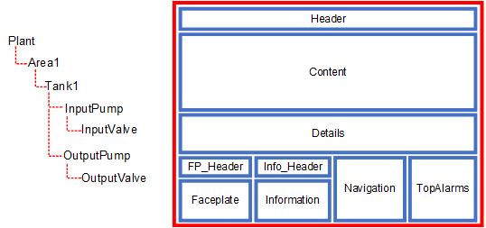
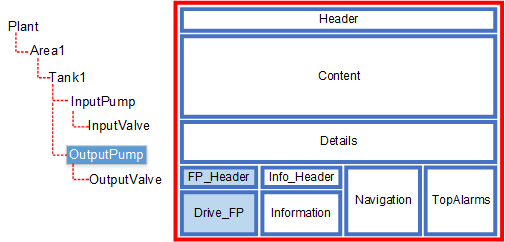
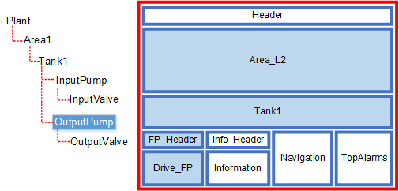
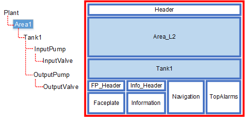

[Проект Situational Awareness](README.md)

## Автозаповнення (Autofill)

[Довідка](file:///C:/Program%20Files%20(x86)/AVEVA%20Plant%20SCADA/Bin/Help/SCADA%20Help/Content/Situational_Awareness_Autofilling.htm)

Система автозаповнення (Autofill) Workspace дозволяє автоматично оновлювати вміст на екрані під час виконання на основі поточного контексту клієнта. Автозаповнення працює для всіх вікон, зареєстрованих у робочій області, як-от вікно головної сторінки та будь-які спливаючі вікна.

Наприклад, якщо на сторінці відображення вибрано насос, процес автозаповнення оновить будь-які відповідні панелі вмістом, який безпосередньо стосується насоса, і, за бажанням, його батьківською або дочірньою ієрархією.

Автозаповнення працює, пов’язуючи певний тип вмісту (наприклад, лицьова панель або сторінка) з кожним означенням обладнання в ієрархії обладнання проекту. Щоб узгодити це, панелі в робочій області можна налаштувати на автоматичне відображення відповідних типів вмісту.

Коли частина обладнання потрапляє в контекст, будь-яка панель, на якій увімкнено автозаповнення, перевірить, чи відповідний тип вмісту такий самий, як вміст, налаштований для відображення. Якщо знайдено відповідність, на панелі відобразиться вміст.

Щоб задіяти функцію автозаповнення Plant SCADA, вам потрібно виконати такі завдання:

- Пов’язуйте типи вмісту з обладнанням (див. [Додати обладнання за допомогою редактора обладнання](file:///C:/Program Files (x86)/AVEVA Plant SCADA/Bin/Help/SCADA Help/Content/Situational_Awareness_Add_Equipment_Using_Equipment_Editor).
- Укажіть тип вмісту, який відображатиметься на кожній панелі (див. [Configure the Panes in a Workspace](file:///C:/Program Files (x86)/AVEVA Plant SCADA/Bin/Help/SCADA Help/Content/Situational_Awareness_Configure_Panes_on_a_Master_Page.htm))
- Укажіть тип вмісту для сторінок у ваших проектах (див. [Призначення типу вмісту для сторінки](file:///C:/Program Files (x86)/AVEVA Plant SCADA/Bin/Help/SCADA Help/Content/ Situational_Awareness_Assign_Content_Types_to_Pages.htm))
- Виберіть потрібну поведінку автозаповнення для вашої системи, яку називають «Context Mode». Режим за замовчуванням — «Current, Then Up, Then Down».

Контекстний режим означує, чи використовує робоча область(и) вміст обладнання на вищих і нижчих рівнях ієрархії обладнання при зміні контексту, а не лише вибране обладнання. Щоб указати, як буде працювати автозаповнення для вашої системи, див. [Specify a Context Mode for a Workspace](file:///C:/Program Files (x86)/AVEVA Plant SCADA/Bin/Help/SCADA Help/Content/Situational_Awareness_Set_the_Context_Mode_for_Workspace.htm). 

### Приклад            

Наступний приклад демонструє, як контекстні режими та конфігурація обладнання та робочих просторів дозволяють автоматично заповнювати вміст при зміні контексту.

Наведена нижче ієрархія обладнання містить резервуар (Tank1) з вхідним і вихідним насосом. Припустимо, що функція автозаповнення Plant SCADA відображатиме вміст, пов’язаний з цією ієрархією, на наступному розташуванні панелей.

​                                            

Щоб увімкнути автозаповнення, налаштовані наступні параметри.

#### Ієрархія обладнання (Equipment hierarchy)

Коли ви означуєте обладнання в проекті Plant SCADA, ви використовуєте властивість **Content**, щоб пов’язувати кожну частину обладнання з певним типом вмісту. У наведеному вище прикладі налаштовано таку ієрархію обладнання.

| Equipment                                | Level | Content     | Content Type | Description                        |
| ---------------------------------------- | ----- | ----------- | ------------ | ---------------------------------- |
| Plant                                    | 1     | Overview_L1 | L1           | Associated with a level 1 page.    |
| Plant.Area1                              | 2     | Area_L2     | L2           | Associated with a level 2 page.    |
| Plant.Area1.Tank1                        | 3     | Tank1_L3    | L3           | Associated with a level 3 page.    |
| Plant.Area1.Tank1.InputPump              | 4     | Drive_FP    | FP           | Associated with a drive faceplate. |
| Plant.Area1.Tank1.InputPump.InputValve   | 5     | Valve_FP    | FP           | Associated with a valve faceplate. |
| Plant.Area1.Tank1.OutputPump             | 4     | Drive_FP    | FP           | Associated with a drive faceplate. |
| Plant.Area1.Tank1.OutputPump.OutputValve | 5     | Valve_FP    | FP           | Associated with a valve faceplate. |

Детальніше див у  [Add Equipment Using Equipment Editor](file:///C:/Program Files (x86)/AVEVA Plant SCADA/Bin/Help/SCADA Help/Content/Situational_Awareness_Add_Equipment_Using_Equipment_Editor.htm).

#### Панелі (Panes)

Панелі мають дві властивості, які означують результат процесу автозаповнення.

- **ContentTypes** — означує тип вмісту, який буде відображатися на панелі. Можна вказати більше одного, розділяючи їх комами.

- **FillMode** — означує, як поводиться панель при зміні контексту. Підтримуються чотири режими заповнення:
  - **Static** — Зміст не змінюється.
  - **Autofill** — Вміст оновиться, якщо обладнання в контексті має відповідний тип вмісту.
  - **AutofillContextMustMatch** —  Вміст оновиться, якщо обладнання відповідає прямому контексту та має вміст того типу, якого вимагає панель (див. нижче).
  - **StaticContextMustMatch** —  Вміст не змінюється, але будь-які асоціації оновлюються, якщо обладнання безпосередньо відповідає контексту (див. нижче).

Параметри "ContextMustMatch" дозволяють виключити панель із налаштування контекстного режиму, що дозволяє автоматично заповнювати робочу область на вищих і нижчих рівнях ієрархії обладнання. Це означає, що відображатиметься лише вміст, безпосередньо пов’язаний із вибраним обладнанням.

У наведеному вище прикладі панелі налаштовуються таким чином:

| Pane        | Content Types | Fill Mode                    | Context Update                                               |
| ----------- | ------------- | ---------------------------- | ------------------------------------------------------------ |
| Header      | —             | 0 = Static                   | Панель не змінюється.                                        |
| Content     | L1, L2        | 1 = Autofill                 | На панелі автоматично відобразиться сторінка рівня 1 або рівня 2. |
| Details     | L3, L4        | 1 = Autofill                 | На панелі автоматично відобразиться сторінка рівня 3 або 4.  |
| Faceplate   | FP            | 3 = AutofillContextMustMatch | На панелі буде відображатися вміст, пов’язаний з обладнанням, лише якщо поточний контекст відповідає прямому збігу. |
| FP_Header   | —             | 4 = StaticContextMustMatch   | Вміст панелі залишиться статичним, однак усі асоціації будуть оновлені. |
| Information | —             | 4 = StaticContextMustMatch   | Вміст панелі залишиться статичним, однак усі асоціації тегів будуть оновлені. |
| Info_Header | —             | 0 = Static                   | Панель не змінюється.                                        |
| Navigation  | —             | 0 = Static                   | Панель не змінюється.                                        |
| TopAlarms   | —             | 0 = Static                   | Панель не змінюється.                                        |

Детальніше див. [Configure the Panes on a Master Page](file:///C:/Program Files (x86)/AVEVA Plant SCADA/Bin/Help/SCADA Help/Content/Situational_Awareness_Configure_Panes_on_a_Master_Page.htm).

**Примітка.** Сторінку можна віднести до певного типу вмісту. Це дозволяє системі знати, що це таке, і узгоджувати це з конфігурацією типу вмісту панелі. Див.[Assign a Content Type to a Page](file:///C:/Program Files (x86)/AVEVA Plant SCADA/Bin/Help/SCADA Help/Content/Situational_Awareness_Assign_Content_Types_to_Pages.htm).

Нижче показано очікуваний результат для наведеного вище прикладу на основі трьох доступних контекстних режимів.

##### WS_CONTEXTMODE_CurrentOnly

У разі відповідності панелям із вмістом враховується лише поточний елемент обладнання.

​                                

У наведеному вище прикладі наступні панелі оновляться, коли "OutputPump" знаходиться в контексті.

- **Панель Faceplate (Drive_FP)** — "Plant.Area1.Tank1.OutputPump" пов'язано з лицьовою панеллю drive, яка відповідає типу вмісту, визначеному для панелі Faceplate. Оскільки для FillMode встановлено значення "AutofillContextMustMatch", лицьова панель автоматично відображатиметься на цій панелі.
- **Панель FP_Header** — FillMode для цієї панелі встановлено на "StaticContextMustMatch", що означає, що відображена сторінка не зміниться, проте будь-які асоціації оновляться (наприклад, поле Display Name).

##### WS_CONTEXTMODE_CurrentThenUp

Коли панелі відповідають вмісту враховується поточна частина обладнання. Коли цей процес завершено, з будь-якими панелями, що залишилися узгоджуються типи вмісту, що пов’язані з вищими рівнями ієрархії обладнання.

​                                

У наведеному вище прикладі наступні панелі оновляться, коли "OutputPump" знаходиться в контексті.

- **Панель Faceplate** — `Plant.Area1.Tank1.OutputPump` пов'язано з лицьовою панеллю drive, яка відповідає типу вмісту, визначеному для панелі Faceplate. Оскільки для FillMode встановлено значення "AutofillContextMustMatch", лицьова панель автоматично відображатиметься на цій панелі.
- **Панель FP_Header** — FillMode для цієї панелі встановлено на "StaticContextMustMatch", що означає, що відображена сторінка не зміниться, проте будь-які асоціації оновляться (наприклад, поле Display Name).

Переміщення вгору по ієрархії розглядається як `Plant.Area1.Tank1`. Будуть оновлені такі панелі:

- **Панель Details** — `Plant.Area1.Tank1` пов'язано зі сторінкою третього рівня (`Details_L3`), яка відповідає типу вмісту, визначеному для панелі Details. Оскільки для режиму заповнення встановлено значення «Autofill», сторінка відобразиться автоматично.

Знову рухаючись вгору по ієрархії, наступним вважається `Plant.Area1`. Будуть оновлені такі панелі:

- **Панель Content** — `Plant.Area1` пов'язано зі сторінкою другого рівня (`Area_L2`), яка відповідає типу вмісту, означеному для панелі вмісту. Оскільки для режиму заповнення встановлено значення «Autofill», відобразиться сторінка.

##### WS_CONTEXTMODE_CurrentThenUpThenDown

Коли панелі відповідають вмісту враховується поточна частина обладнання. Коли цей процес завершено, обладнання на вищих рівнях ієрархії узгоджується з будь-якими панелями, що залишилися, потім розглядається обладнання на нижчих рівнях ієрархії.

​                                

У наведеному вище прикладі коли в контексті знаходиться `Plant.Area1` будуть оновлені наступні панелі. 

- **Панель Content** — `Plant.Area1` пов'язано зі сторінкою другого рівня (`Area_L2`), яка відповідає типу вмісту, визначеному для панелі вмісту. Оскільки для режиму заповнення встановлено значення «Autofill», сторінка відобразиться автоматично.

Оскільки панелі автозаповнення ще не заповнені (наприклад, «Панель Details»), система починає рухатися вгору по ієрархії, шукаючи вміст.

Наступним вважається «Plant». Він містить лише вміст «Overview_L1» типу вмісту L1, і єдина панель, яка підтримує це («Content»), уже заповнена. Потім система повернеться до початкового контексту, «Tank1», і переміститься вниз по ієрархії до свого першого дочірнього. При переході вниз по ієрархії враховується лише перший дочірній контекст. Переміщення вниз по ієрархії показало наступним `Plant.Area1.Tank1` . Буде оновлено наступну панель:

- **Панель Details** — `Plant.Area1.Tank1` пов'язано зі сторінкою третього рівня ("Details_L3"), яка відповідає типу вмісту, означеному для панелі Details. Оскільки для режиму заповнення встановлено значення «Autofill», відобразиться сторінка.

Рухаючись вниз за ієрархією до `Plant.Area1.Tank1.OutputPump`, вступає в дію налаштування FillMode для решти панелей, оскільки поточний контекст більше не відповідає прямому збігу. Відбудуться такі оновлення:

- **Панель Faceplate** — оскільки для FillMode встановлено значення "AutofillContextMustMatch", на панелі відображатиметься порожня сторінка за замовчуванням.
- **Панель FP_Header** — Оскільки для FillMode встановлено значення "StaticContextMustMatch", на панелі відображатиметься порожня сторінка за замовчуванням.

[--> Макет за замовченням](defaultlayout.md)