[Проект Situational Awareness](README.md)

## Тривоги (Alarms)

[Довідка](file:///C:/Program%20Files%20(x86)/AVEVA%20Plant%20SCADA/Bin/Help/SCADA%20Help/Content/Situational_Awareness_Alarms.htm)

Принципи ситуаційної обізнаності вказують на те, що сигнали тривоги повинні передаватися за допомогою легко впізнаваних форм і високоінтенсивного кольору. Це гарантує, що сигнали тривоги виділяються на фоні переважно ахроматичної колірної схеми, яка використовується для інтерфейсу під час виконання.

Також необхідно надати сповіщення про всі активні тривоги, навіть якщо вони виникають на сторінці, яка в даний момент не відображається. Прямий доступ до сторінки, яка є джерелом тривоги, також має бути доступним, коли надходить сповіщення.

Щоб полегшити сигналізацію тривог відповідно до цих принципів у випадку проекту Situational Awareness Starter Project за замовчуванням до "[sa_priorities](file:///C:/Program Files (x86)/AVEVA Plant SCADA/ Bin/Help/SCADA Help/Content/SA_Control_PrioritiesGenieLibrary.htm)" включено набір із шести Genies (три великих і три маленьких).

​                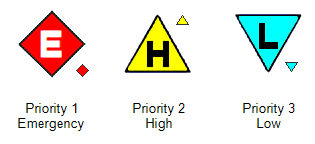            

Також надаються джини, які дають можливість зрозуміти, що тривога відтермінована (shelved), тобто вимкнена на певний період часу. Див [Shelve Alarms](file:///C:/Program Files (x86)/AVEVA Plant SCADA/Bin/Help/SCADA Help/Content/Shelve_Alarms.htm). 

​                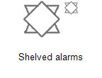            

**Примітка.** Якщо потрібно, ви можете налаштувати зовнішній вигляд цих джинів.

Джини використовуються для виділення тривог в наступних місцях.

#### Індикатори тривог (Alarm Indicators)

Індикатори тривог використовуються на сторінках вмісту для виділення стану тривоги для певного об’єкта або групи об’єктів. Вони складаються з прапорця тривоги (великий Genie пріоритет тривоги) і межі тривоги.

​                        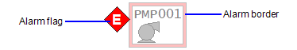                    

Див також [Use Alarm Indicators](file:///C:/Program Files (x86)/AVEVA Plant SCADA/Bin/Help/SCADA Help/Content/Use_Alarm_Indicators.htm).

#### Навігаційна зона (Navigation Zone)

Зона навігації забезпечує загальносистемний перегляд поточних тривог на всіх сторінках.

Кожна вкладка містить лічильники трьох найбільш пріоритетних тривог, які активні на сторінках, включених на вкладці.

Кожна кнопка містить лічильник трьох пріоритетних тривог і відкладених тривог для місця, яке вона відкриває.

​                        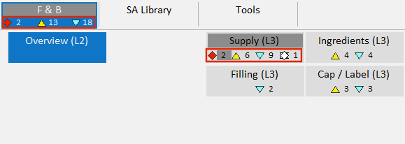                    

Див. також [Enable Navigation Zone Alarm Counts](file:///C:/Program Files (x86)/AVEVA Plant SCADA/Bin/Help/SCADA Help/Content/Situational_Awareness_Enable_Navigation_Zone_Alarm_Counts.htm).

#### Списки тривог (Alarm lists)

Маленькі значки використовуються для виділення трьох основних пріоритетів тривог в списках тривог.

​                        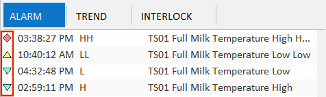                    

Якщо тривогу відтерміновано, піктограма пріоритету відображатиметься білою заливкою. Це відбувається в таких місцях: 

- Alarms pages (see [Default Alarm Pages](file:///C:/Program Files (x86)/AVEVA Plant SCADA/Bin/Help/SCADA Help/Content/Situational_Awareness_Default_AlarmPages.htm)).
- The alarms list in the [Information Zone](file:///C:/Program Files (x86)/AVEVA Plant SCADA/Bin/Help/SCADA Help/Content/Situational_Awareness_Information_Zone.htm).
- the [Active Alarms Zone](file:///C:/Program Files (x86)/AVEVA Plant SCADA/Bin/Help/SCADA Help/Content/Situational_Awareness_Alarms_Summary.htm) (if a UHD4K workspace is used). 

#### Alarm Page Tree View

Перегляд дерева на кожній сторінці тривог надає лічильники тривог для трьох головних пріоритетів тривоги та відтермінованих тривог у кожній гілці ієрархії обладнання.  (see [Default Alarm Pages](file:///C:/Program Files (x86)/AVEVA Plant SCADA/Bin/Help/SCADA Help/Content/Situational_Awareness_Default_AlarmPages.htm)).

​                        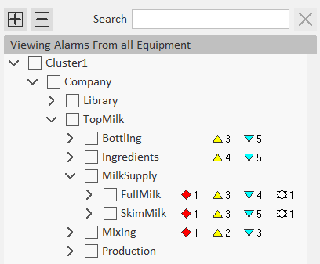                    

 

Крім використання кольору для вказівки пріоритету тривоги, зовнішній вигляд індикатора або значка тривоги можна використовувати для відображення поточного стану тривоги.

#### Стани тривог (Alarm States)

У наступній таблиці показано, як позначаються різні стани тривоги для тривоги з пріоритетом 1 (надзвичайна ситуація) у проекті, заснованому на проекті Situational Awareness Starter Project.

| State              | Alarm Indicator                                              | Alarm icon                                                   |
| ------------------ | ------------------------------------------------------------ | ------------------------------------------------------------ |
| On Unacknowledged  | 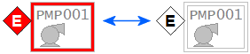    Мигають межі та прапорці з кольорову на білу заливку . | Значок блимає з кольорову на білу заливку . |
| On Acknowledged    | 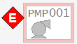  Межа тривоги заповнена кольором половинної інтенсивності. Немає проблиску для жодного елемента. Якщо умова тривоги зникає, індикатор тривоги більше не відображається. | Значок перестає блимати. |
| Off Unacknowledged | 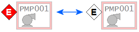    Межа тривоги світліше. Прапорець тривоги блимає. Межа тривоги не блимає. | Значок блимає між кольором напівінтенсивності та білою заливкою. |
| Shelved            | 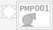    Біла рамка тривоги відображається із загальним символом тривоги. |  У списку нагадувань з’явиться піктограма пріоритету з білою заливкою.У перегляді дерева тривог і навігаційної зони з’явиться загальний значок відтермінування. |

За замовчуванням шість Genies пріоритету тривоги пов’язані з трьома першими пріоритетами тривоги через властивості відображення для кожного пріоритету.

​                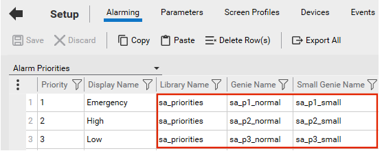            

Властивість **Genie Name** визначає більшого Genie, який використовується як прапорець тривоги; **Small Genie Name** визначає меншого джина, який використовується як піктограма тривоги. Див. [Налаштування властивостей відображення для пріоритету тривоги](file:///C:/Program Files (x86)/AVEVA Plant SCADA/Bin/Help/SCADA Help/Content/Configure_Display_Properties_for_an_Alarm_Prioirty.htm).

Genies, які використовуються для представлення тривоги на полиці, пов’язані з режимом тривоги під назвою «Shelved/Disabled» (див. [Налаштування властивостей дисплея для режиму тривоги](file:///C:/Program Files (x86)/AVEVA Plant SCADA/Bin/Help/SCADA Help/Content/Configure_Display_Properties_for_an_Alarm_Mode.htm)).

[--> Бібліотеки](libraries.md)
