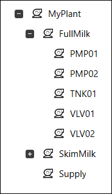
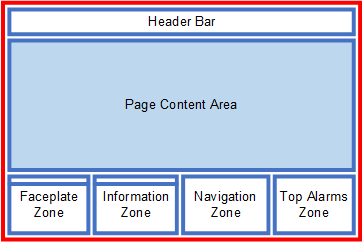
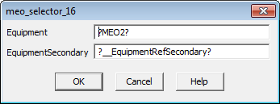

[Проект Situational Awareness](README.md)

## Конфігурування проекту в Situational Awareness Projects  

Посилання на довідку [Configure Your Project](file:///C:/Program%20Files%20(x86)/AVEVA%20Plant%20SCADA/Bin/Help/SCADA%20Help/Content/Situational_Awareness_Configure_Content.htm)

У наступних темах описано, як налаштувати вміст проекту, щоб він взаємодіяв з архітектурою, яка підтримує контекстні оновлення під час виконання.

### Додавання обладнання використовуючи Equipment Editor

[Add Equipment Using Equipment Editor](file:///C:/Program Files (x86)/AVEVA Plant SCADA/Bin/Help/SCADA Help/Content/Situational_Awareness_Add_Equipment_Using_Equipment_Editor.htm)   

Першим кроком у додаванні вмісту для проекту Situational Awareness є створення необхідного обладнання для вашого проекту, який передбачає виконання таких завдань:

- Створення нестандартних шаблонів обладнання
- Створення екземплярів обладнання
- Організування обладнання в ієрархію
- Генерування тегів

#### Створення нестандартних шаблонів обладнання

Проект Situational Awareness Starter надає набір зразків шаблонів обладнання, які допоможуть створити обладнання. Шаблон обладнання — це файл XML, який використовує власні теги та атрибути для означення полів вхідних і вихідних баз даних, а також означення фільтрів і правил перетворення, які створюють теги з наявних полів бази даних. Він використовує існуючі [правила синтаксису TagGen](file:///C:/Program Files (x86)/AVEVA Plant SCADA/Bin/Help/SCADA Help/Content/TagGen_XML_Template.html).

У рамках створення шаблону обладнання вам потрібно налаштувати шаблони обладнання відповідно до вашого фізичного пристрою. Для створення спеціального шаблону може знадобитися виконати одне або кілька з наступних завдань:

1. Означте [Equipment Types](file:///C:/Program Files (x86)/AVEVA Plant SCADA/Bin/Help/SCADA Help/Content/Equipment_Types.htm).
2. [Добавте елементи](file:///C:/Program Files (x86)/AVEVA Plant SCADA/Bin/Help/SCADA Help/Content/Add_an_Item_to_an_Equipment_Type.htm) до видів обладнання.
3. [Зконфігуруйте custom parameters](file:///C:/Program Files (x86)/AVEVA Plant SCADA/Bin/Help/SCADA Help/Content/Configure_Custom_Parameters_for_an_Equipment_Type.htm)  для кожного типу обладнання. Параметри, означені тут, зазвичай будуть однаковими для кожного екземпляра обладнання певного типу. Наприклад, діапазон значень для назв обладнання або тривог та їх значення за замовчуванням.
4. Створіть власні теги, якщо потрібно. Ви можете означити спеціальні теги (параметри), які можуть відрізнятися залежно від типу обладнання. Наприклад, адреса або інженерні одиниці для різних типів лічильників. У цьому випадку ви можете [визначити спеціальні теги](file:///C:/Program Files (x86)/AVEVA Plant SCADA/Bin/Help/SCADA Help/Content/Add_a_Variable_Tag.html) у Plant SCADA Studio.

**Note**: За замовчуванням зразки шаблонів обладнання використовують аналогові межі тривоги. Якщо ви хочете використовувати ліміти ПЛК з обладнанням, див [Associate PLC Limits with Equipment](salib/AlarmLimits.md). 

#### Створення екземплярів обладнання

Створіть необхідні [екземпляри обладнання](file:///C:/Program Files (x86)/AVEVA Plant SCADA/Bin/Help/SCADA Help/Content/Add_an_Equipment_Instance.htm) у [Equipment Editor](file:/// C:/Program Files (x86)/AVEVA Plant SCADA/Bin/Help/SCADA Help/Content/The_Equipment_Editor.htm) на основі [Типів обладнання](file:///C:/Program Files (x86)/AVEVA Plant SCADA /Bin/Help/SCADA Help/Content/Equipment_Types.htm).

#### Організування обладнання в ієрархію

[Ієрархія обладнання](file:///C:/Program Files (x86)/AVEVA Plant SCADA/Bin/Help/SCADA Help/Content/Equipment_Hierarchy.htm) надає модель заводу, яку можна використовувати для посилання на механізми або процеси, що контролюються.

У випадку проекту Situational Awareness, означення обладнання використовуються для керування функціональними можливостями, які дозволяють системі виконання реагувати на поточний контекст клієнта дисплея. Вони також можуть підтримувати функції навігації та безпеку на основі території. Для прикладів ієрархії обладнання, [клацніть тут](file:///C:/Program Files (x86)/AVEVA Plant SCADA/Bin/Help/SCADA Help/Content/Situtational_Awareness_Equipment_Hierarchy_Examples.htm).

Коли ви налаштовуєте екземпляри обладнання для проекту на основі проекту Situational Awareness Starter Project, ви повинні звернути особливу увагу на такі властивості обладнання:

| Property     | Description                                                  |
| ------------ | ------------------------------------------------------------ |
| Display Name | Ця властивість дозволяє створити значиму варіацію назви обладнання, яку можна легко розмістити в інтерфейсі середовища виконання. |
| Type         | Ця властивість означує [Тип обладнання](file:///C:/Program Files (x86)/AVEVA Plant SCADA/Bin/Help/SCADA Help/Content/Equipment_Types.htm), який асоціюється з частиною обладнання. У проекті, створеному з проекту Situational Awareness Starter, доступний набір типів обладнання за замовчуванням для підтримки Composite Genies, які знаходяться в проекті включення SA_Library. Вам слід вибрати тип обладнання, пов’язаного з Composite Genie, який ви будете використовувати для створення графічного об’єкта для частини обладнання. Наприклад, якщо елементом обладнання є насос, ви зможете створити пов’язаний графічний об’єкт за допомогою Drive Composite Genie. Тип обладнання, який вам знадобиться, це привід. |
| Page         | Ця властивість пов’язує частину обладнання зі сторінкою, тобто основною сторінкою, на якій з’являється пов’язаний графічний об’єкт. Якщо графічний об’єкт з’являється на кількох сторінках, зазначена тут сторінка повинна представляти його основний операційний контекст. Це дозволяє оператору перейти безпосередньо на сторінку, на якій розміщено обладнання. Наприклад, на сторінці тривоги ви можете перейти від вибраного обладнання в списку тривог безпосередньо до сторінки, на якій воно відображається. Ця властивість також використовується для обчислення кількості тривог для сторінки в зоні навігації. **Примітка.** Якщо частина обладнання не має властивість **Page**, вона не буде включена до кількості тривог для сторінки хоста. Додаткову інформацію див. у розділі [Увімкнути підрахунок тривог навігаційної зони](file:///C:/Program Files (x86)/AVEVA Plant SCADA/Bin/Help/SCADA Help/Content/Situational_Awareness_Enable_Navigation_Zone_Alarm_Counts.htm). |
| Content      | Ця властивість дозволяє пов’язувати об’єкт обладнання з певним типом графічного вмісту (див. [Content Types](content_types.md)). Наприклад, ви можете пов’язати насос з передньою панеллю приводу ("FP_DOL" або "FP_VSD") або область зі сторінкою огляду ("Area_L1"). Ви можете вказати кілька типів вмісту для кожного визначення обладнання, використовуючи список, розділений комами. Коли частина обладнання потрапляє в контекст, будь-які панелі, для яких встановлено автозаповнення, читатимуть цю властивість. Якщо знайдено відповідність, на панелі відобразиться вказаний вміст. Додаткову інформацію див. у розділі [Автозаповнення](file:///C:/Program Files (x86)/AVEVA Plant SCADA/Bin/Help/SCADA Help/Content/Situational_Awareness_Autofilling.htm). |
| Tag Prefix   | Ця властивість використовується для застосування префікса до будь-яких змінних тегів, пов’язаних з обладнанням. Це корисно для створення змінних тегів, необхідних для підтримки проекту ситуаційної обізнаності. |
| Area         | У проекті Situational Awareness Області використовуються для керування доступом та привілеями користувачів під час виконання. Використовуйте номер області (або ярлик label), щоб призначити обладнання певній зоні. Лише користувачі з доступом до цієї області (і будь-якими необхідними привілеями) зможуть виконувати операції на обладнанні. |

#### Генерування тегів

Якщо ви створюєте новий проект Situational Awareness, після створення ієрархії обладнання вам потрібно [згенерувати змінні теги для обладнання](file:///C:/Program Files (x86)/AVEVA Plant SCADA/Bin/ Help/SCADA Help/Content/Update_Equipment.htm).

**Примітка**: Теги, згенеровані таким чином, доступні лише для читання, тобто їх значення не можуть бути оновлені в Plant SCADA Studio.

Якщо ви оновлюєте раніше створений проект і хочете використовувати Situational Awareness Genies з тегами в старому проекті, вам потрібно буде перенести наявні теги.

### Приклад ієрархії обладнання

Наведений нижче приклад є графічною сторінкою, яка представляє резервуар на підприємстві з виробництва молока.

           

Для представлення обладнання  були використані  наступні Composite Genies:

- A tank (TNK01)
- An inlet pump for the tank (PMP01)
- An outlet pump for the tank (PMP02)
- A valve for the outlet pump (VLV01)
- A dump valve for the tank (VLV02).

На цій сторінці потрібно налаштувати наступну ієрархію обладнання в редакторі обладнання.

​                            

Натисніть на назву обладнання нижче, щоб отримати пояснення щодо пов’язаних налаштувань властивостей обладнання.

#### TNK01

- **Display Name** — "Supply Tank" було зазначено як ім'я, яке можна використовувати для ідентифікації танка під час виконання, що забезпечує значиму альтернативу назві обладнання  "MyPlant.FullMilk.TNK01". 
- **Type** — Рівень танка буде представлений на сторінці у вигляді композитного джина «Meter». Зразок шаблону обладнання «Meter» використовується як тип обладнання, оскільки він містить усі необхідні елементи, необхідні для Composite Genie та пов’язаної з ним лицьової панелі.  
- **Page** — TNK01 представлений у своїй оперативній якості на сторінці «FullMilk». Тому "FullMilk" вказано як домашню сторінку для резервуара. Це означає, що ви зможете безпосередньо перейти до сторінки FullMilk із випадків TNK01 у таких місцях, як список тривог.  
- **Content** — Вміст, пов’язаний з резервуаром, – це «FP_CTRL», що є назвою лцьової панелі для [Analog Controller](file:///C:/Program Files (x86)/AVEVA Plant SCADA/Bin/Help/SCADA Help/Content/SA_FP_Analog_Controller.htm). Це одна з лицьових панелей вимірювача за замовчуванням, включена в проект, заснований на стартовому проекті Situational Awareness. Коли резервуар потрапляє в контекст, лицьова панель FP_CTRL відображатиметься на будь-яких панелях, які налаштовані на автозаповнення і для поля **Тип вмісту** встановлено значення "FP". Див. [Типи вмісту](file:///C:/Program Files (x86)/AVEVA Plant SCADA/Bin/Help/SCADA Help/Content/Content_Types.htm).

#### PMP01

- **Display Name** — "Inlet Pump" було зазначено як ім'я, яке можна використовувати для ідентифікації насоса під час роботи, що забезпечує значиму альтернативу назві обладнання "MyPlant.FullMilk.PMP01". 
- **Type** — впускний насос буде представлений на сторінці як "Drive" Composite Genie. Зразок шаблону обладнання «Drive» використовується як тип обладнання, оскільки він містить усі необхідні елементи, необхідні для Composite Genie та пов’язаної з ним передньої панелі.
- **Page** —  PMP01 представлений у своїй робочій потужності на сторінці «FullMilk». Тому «FullMilk» вказано як домашню сторінку для насоса. Це означає, що ви зможете безпосередньо перейти до сторінки FullMilk із випадків PMP01 у таких місцях, як список тривог.
- **Content** —  Вміст, пов’язаний з PMP01, — це «FP_DOL», що є назвою панелі для [Direct On Line Drive](file:///C:/Program Files (x86)/AVEVA Plant SCADA/Bin/Help/SCADA Help /Content/SA_FP_Single_Multiple_DOL_Drive.htm). Це одна з лицьових панелей приводів за замовчуванням, включена в проект, заснований на проекті Situational Awareness Starter. Коли насос потрапляє в контекст, лицьова панель FP_DOL відображатиметься на будь-яких панелях, які налаштовані на автозаповнення і для поля **Тип вмісту** встановлено значення "FP".

#### PMP02

- **Display Name** — "Outlet Pump" було зазначено як ім'я, яке можна використовувати для ідентифікації насоса під час роботи, що забезпечує значущу альтернативу назві обладнання "MyPlant.FullMilk.PMP02". 
- **Type** — вихідний насос буде представлений на цій сторінці як композитний джин «Drive». Зразок шаблону обладнання «Drive» використовується як тип обладнання, оскільки він містить усі необхідні елементи, необхідні для Composite Genie та пов’язаної з ним передньої панелі.
- **Page** — TNK01 представлений у своїй оперативній потужності на сторінці «FullMilk». Тому «FullMilk» вказано як домашню сторінку для насоса. Це означає, що ви зможете безпосередньо перейти до сторінки FullMilk із випадків PMP02 у таких місцях, як список тривог.
- **Content** — Вміст, пов’язаний з PMP02, — це «FP_VSD», що є назвою передньої панелі для [приводу зі змінною швидкістю](file:///C:/Program Files (x86)/AVEVA Plant SCADA/Bin/Help/SCADA Help/ Content/SA_FP_Single_Multiple_VSD_Drive.htm). Це одна з лицьових панелей приводів за замовчуванням, включена в проект, заснований на проекті Situational Awareness Starter. Коли насос потрапить у контекст, лицьова панель FP_VSD відображатиметься на будь-яких панелях, для яких встановлено автозаповнення та для поля **Тип вмісту** встановлено значення "FP".

#### VLV01

- **Display Name** — "Outlet Valve" було зазначено як ім'я, яке можна використовувати для ідентифікації клапана під час роботи, що забезпечує значиму альтернативу назві обладнання  "MyPlant.FullMilk.VLV01". 
- **Type** —  випускний клапан буде представлений на сторінці як композитний джин «Valve». Зразок шаблону обладнання «Valve» використовується як тип обладнання, оскільки він містить усі необхідні елементи, необхідні для Composite Genie та пов’язаної з ним лицевої панелі.
- **Page** — VLV01 представлений у своїй робочій потужності на сторінці «FullMilk». Тому «FullMilk» вказано як домашню сторінку для клапана. Це означає, що ви зможете безпосередньо перейти до сторінки FullMilk із випадків VLV01 у таких місцях, як список тривог. 
- **Content** — Вміст, пов’язаний з VLV01, є "FP_VLV", що є назвою передньої панелі для [Simple Valve](file:///C:/Program Files (x86)/AVEVA Plant SCADA/Bin/Help/SCADA Help/ Content/SA_FP_Simple_Valve.htm). Це одна з лицьових панелей лічильника за замовчуванням, включена в проект, заснований на стартовому проекті Situational Awareness. Коли клапан потрапляє в контекст, лицьова панель FP_VLV відображатиметься на будь-яких панелях, для яких налаштовано автозаповнення та для поля **Тип вмісту** встановлено значення "FP"

#### VLV02

- **Display Name** — "Dump Valve" було зазначено як ім'я, яке можна використовувати для ідентифікації клапана під час роботи, що забезпечує значиму альтернативу назві обладнання "MyPlant.FullMilk.VLV02". 
- **Type** — клапан скидання буде представлений на сторінці як композитний джин «Valve». Зразок шаблону обладнання «Valve» використовується як тип обладнання, оскільки він містить усі необхідні елементи, необхідні для Composite Genie та пов’язаної з ним передньої панелі. 
- **Page** —  VLV02 представлений у своїй робочій потужності на сторінці «FullMilk». Тому «FullMilk» вказано як домашню сторінку для клапана. Це означає, що ви зможете безпосередньо перейти до сторінки FullMilk із випадків VLV02 у таких місцях, як список тривог
- **Content** — Вміст, пов’язаний з VLV02, – це «FP_VLV», що є назвою передньої панелі для [Simple Valve](file:///C:/Program Files (x86)/AVEVA Plant SCADA/Bin/Help/SCADA Help/ Content/SA_FP_Simple_Valve.htm). Це одна з лицьових панелей лічильника за замовчуванням, включена в проект, заснований на стартовому проекті ситуаційної обізнаності. Коли клапан потрапляє в контекст, лицьова панель FP_VLV відображатиметься на будь-яких панелях, для яких налаштовано автозаповнення та для поля **Content Type** встановлено значення "FP"

### Generate Variable Tags

[Create Variable Tags](file:///C:/Program Files (x86)/AVEVA Plant SCADA/Bin/Help/SCADA Help/Content/Situational_Awareness_Create_Variable_Tags.htm)       

Після того як ви [створили свою ієрархію обладнання](file:///C:/Program Files (x86)/AVEVA Plant SCADA/Bin/Help/SCADA Help/Content/Situational_Awareness_Add_Equipment_Using_Equipment_Editor.htm), вам потрібно згенерувати змінні теги для обладнання якщо ви створюєте новий проект ситуаційної обізнаності. Якщо ви оновлюєте раніше створений проект і хочете використовувати Situational Awareness Genies з тегами в старому проекті, вам потрібно буде [перенести існуючі теги](file:///C:/Program Files (x86)/ AVEVA Plant SCADA/Bin/Help/SCADA Help/Content/Situational_Awareness_Create_Variable_Tags.htm?tocpath=Проекти ситуаційної обізнаності|Налаштуйте свій проект|_____2#Migrate_Tags_old).

#### Generate Tags for a New Project

Plant SCADA надає зразки шаблонів обладнання, які можна використовувати як посібник для створення свого обладнання.

Щоб створити теги для нового проекту:

1. Зробіть копію необхідних шаблонів обладнання.
2. Змініть шаблони відповідно до ваших вимог. Це пов’язано з тим, що шаблони можуть не підходити для певних протоколів, таких як Modbus. У цьому випадку вам потрібно буде видалити властивість **Address**.
3. [Створіть свою ієрархію обладнання](file:///C:/Program Files (x86)/AVEVA Plant SCADA/Bin/Help/SCADA Help/Content/Situational_Awareness_Add_Equipment_Using_Equipment_Editor.htm).
4. [Згенеруйте теги](file:///C:/Program Files (x86)/AVEVA Plant SCADA/Bin/Help/SCADA Help/Content/Update_Equipment.htm).

### Створення контентних сторінок 

[Create Content Pages](file:///C:/Program Files (x86)/AVEVA Plant SCADA/Bin/Help/SCADA Help/Content/Situational_Awareness_Create_Content_Pages.htm)           

На контентних сторінках (Content Page) відображається вміст, створений користувачами, який представляє виробничий процес або огляд. У проекті Situational Awareness рекомендується створювати контентні сторінки, розмір яких відповідає області, на якій вони відображатимуться. У початковому проекті за замовчуванням це Page Content Area.

​                            

Оскільки робоча область Situational Awareness доступна в двох розмірах екрана (HD1080 і UHD4K), розмір Page  Content Area буде відрізнятися залежно від роздільної здатності головної сторінки робочої області. Ви повинні враховувати це розширення, створюючи контентні сторінки. Сторінка-шаблон під назвою "pagecontent" доступна в проекті SA_Include в обох роздільних можливостях.

Якщо ви створюєте систему, яка підтримує кілька роздільних можливостей, і хочете налаштувати вміст відповідно до збільшення/зменшення простору, ви можете застосувати суфікс до імені сторінки, щоб пов’язати його з певною роздільною здатністю. Наприклад, ви можете створити такі сторінки з дубльованим вмістом:

- MyContentPage_HD1080
- MyContentPage_UHD4K.

Якщо ви використовуєте функцію  Navigation_ShowTargetPageMultiRes( ) для виклику "MyContentPage", система використовуватиме суфікс, щоб визначити, який варіант сторінки відображати в поточному робочому просторі. Додаткову інформацію див. у розділі [Налаштування проекту, який підтримує кілька роздільних можливостей](file:///C:/Program Files (x86)/AVEVA Plant SCADA/Bin/Help/SCADA Help/Content/Situational_Awareness_Support_Multiple_Screen_Resolutions.htm).

Ваші сторінки вмісту також мають відповідати ієрархії, яка надає різні рівні деталізації процесів, які відстежуються. Це дозволяє оператору оцінити конкретний процес, зберігаючи широке уявлення про загальний стан заводу. Для отримання додаткової інформації див. [Рівні сторінки](file:///C:/Program Files (x86)/AVEVA Plant SCADA/Bin/Help/SCADA Help/Content/Situational_Awareness_Page_Levels.htm).

#### Create a content page

To create a content page for a Situational Awareness project:

1. Open Graphics Builder.

2. On the **File** menu, select **New**.

3. On the New dialog box, click **Page**. The Use Template dialog box is displayed.

4. In the **Style** field, select "situational_awareness".

5. In the **Resolution** field, select the resolution appropriate to the host workspace:

6. - HD1080 (1920 x 1080, 16:9)
   - UHD4K (3840 x2160, 16:9)

7. In the **Template** section, select "pagecontent".

8. Click **OK**.

9. **Save** the page with an appropriate name. 

10. If you are  creating duplicate pages for a system that uses multiple resolutions,  apply the appropriate suffix ("_HD1080" or "_UHD4K"). 

11. **Note:** When you use the  PageContent template to create a page, it will include two  pre-configured associations that allow the page to engage with a  project's equipment hierarchy. Named "__EquipmentName" and  "__EquipmentRef", they are accessible via the **Associations** tab of the Page Properties dialog.

To activate a page at runtime, you also need to perform the following steps:

#### Призначте тип вмісту (Content Type)

For more information, see [Assign a Content Type to a Page](file:///C:/Program Files (x86)/AVEVA Plant SCADA/Bin/Help/SCADA Help/Content/Situational_Awareness_Assign_Content_Types_to_Pages.htm). 

Рекомендується призначити тип вмісту для сторінки, щоб дозволити її правильно обробляти за допомогою [Автозаповнення](file:///C:/Program Files (x86)/AVEVA Plant SCADA/Bin/Help/SCADA Help/ Content/Situational_Awareness_Autofilling.htm). Тип вмісту використовується, щоб визначити, де буде відображатися сторінка в робочій області. Наприклад, якщо тип вмісту для сторінки — «L1» (сторінка першого рівня), вона відображатиметься лише на панелях, налаштованих на відображення вмісту L1.

Якщо на сторінці не вказано тип вмісту, вона відображатиметься на панелі, призначеній як панель «за замовчуванням». За замовчуванням це буде область вмісту сторінки.

Для отримання додаткової інформації див. [Призначення типу вмісту для сторінки](file:///C:/Program Files (x86)/AVEVA Plant SCADA/Bin/Help/SCADA Help/Content/Situational_Awareness_Assign_Content_Types_to_Pages.htm).

#### Enable navigation

Навігація під час виконання для проекту Situational Awareness керується через [Navigation Zone](file:///C:/Program Files (x86)/AVEVA Plant SCADA/Bin/Help/SCADA Help/Content/Situational_Awareness_Navigation_Section.htm) на панелі приладів оператору.

Щоб додати створену вами сторінку до зони навігації, вам потрібно додати для неї пункт меню за допомогою дії **Visualization** у Plant SCADA Studio. Для отримання додаткової інформації див. [Підготовка меню навігації](file:///C:/Program Files (x86)/AVEVA Plant SCADA/Bin/Help/SCADA Help/Content/Situational_Awareness_Prepare_Navigation_Menus.htm).

### Page Levels

Принципи ситуаційної обізнаності передбачають, що ваші сторінки вмісту мають відповідати ієрархії, яка забезпечує різні рівні деталізації процесів, які відстежуються. Це дозволяє оператору оцінити конкретний процес, зберігаючи широке уявлення про загальний стан заводу.

Наступна діаграма показує запропоновану ієрархію сторінок.

​                            

- **Level 1** –  Огляд по всьому цеху (Area). Сторінки містять KPI та підсумкову інформацію про статус
- **Level 2** –  Операційний огляд. Це основний робочий дисплей. Сторінки містять ключову операційну інформацію, пов’язану з конкретним виробничим процесом на підприємстві.
- **Level 3** –  Детальні операційні процеси. Сторінки містять інформацію про обладнання у виробничому процесі та їх підключення. Сторінки рівня 3 найбільш подібні до традиційних графічних сторінок системи SCADA
- **Level 4** –  Допоміжна інформація. Включає тренди, екрани довідки тощо.

В ідеалі клієнтська робоча станція повинна мати кілька екранів з різними рівнями сторінок, що відображаються на кожному екрані. Це дозволяє підтримувати ширшу перспективу, поки оперативні деталі досліджуються на сторінках нижнього рівня.

Як правило, сторінка рівня 1 буде на спеціальному екрані. Потім оператор використовує другий екран для навігації між рівнями 2–4.

​                            

У великій системі ви можете розглянути можливість створення екрана, виділеного для кожної області (цеху) рівня 2.

​                            

Вам потрібно враховувати вплив рівнів сторінок на означення вашого обладнання, зокрема на властивості **Page** і **Content** (див. [Додати обладнання за допомогою редактора обладнання](file:///C:/Program Файли (x86)/AVEVA Plant SCADA/Bin/Help/SCADA Help/Content/Situational_Awareness_Add_Equipment_Using_Equipment_Editor.htm)). Якщо ієрархія обладнання заздалегідь означена або має відповідати галузевим стандартам, ви повинні використовувати її як відправну точку та відповідно планувати рівні сторінки.

Якщо ви використовуєте режими [Autofill](file:///C:/Program Files (x86)/AVEVA Plant SCADA/Bin/Help/SCADA Help/Content/Situational_Awareness_Autofilling.htm) "WS_CONTEXTMODE_CurrentThenUpThenDown" або "DEU_WSCurCONTEXT", вам також потрібно враховувати, як рівні сторінок узгоджуються з ієрархією вашого обладнання, оскільки процес автозаповнення скануватиме вгору і вниз по ієрархії, шукаючи вміст для розміщення у вашому робочому просторі.

### Assign a Content Type to a Page

[Assign a Content Type to a Page](file:///C:/Program Files (x86)/AVEVA Plant SCADA/Bin/Help/SCADA Help/Content/Situational_Awareness_Assign_Content_Types_to_Pages.htm)           

Коли ви вказуєте тип вмісту для сторінки, ви визначаєте, як сторінка буде керуватися за допомогою [Автозаповнення](file:///C:/Program Files (x86)/AVEVA Plant SCADA/Bin/Help/SCADA Help/Content /Situational_Awareness_Autofilling.htm) і такі функції відображення сторінки робочої області:

- [Navigation_ShowTargetPage](file:///C:/Program Files (x86)/AVEVA Plant SCADA/Bin/Help/SCADA Help/Content/SA_NavigationShowTargetPage.htm)                
- [Workspace_ShowContent](file:///C:/Program Files (x86)/AVEVA Plant SCADA/Bin/Help/SCADA Help/Content/SA_Workspace_ShowContent.htm).

Наприклад, якщо тип вмісту для сторінки "L1" (сторінка першого рівня), він відображатиметься лише в панелях, налаштованих для відображення вмісту L1 (див [Page Levels](file:///C:/Program Files (x86)/AVEVA Plant SCADA/Bin/Help/SCADA Help/Content/Situational_Awareness_Page_Levels.htm)). 

Використання типів вмісту в поєднанні з панелями, які відповідають на типи вмісту, допоможе спростити обслуговування вашої системи, оскільки вам не потрібно буде чітко вказувати, де вміст має відображатися щоразу, коли ви вказуєте системі відображати сторінку вмісту. Натомість система сама вирішить це, використовуючи вашу конфігурацію панелі та тип вмісту сторінки, яка буде відображатися.

Типи вмісту, які ви можете призначити сторінці, налаштовуються в дії **Visualization** у Plant SCADA Studio (див. [Типи вмісту](file:///C:/Program Files (x86)/AVEVA Plant SCADA/Bin/ Help/SCADA Help/Content/Content_Types.htm)).

Щоб призначити тип вмісту для сторінки:

1. У дії **Visualization** виберіть **Pages**.
2. Виберіть потрібні сторінки. Див. [Перегляд сторінок у Plant SCADA Studio](file:///C:/Program Files (x86)/AVEVA Plant SCADA/Bin/Help/SCADA Help/Content/Browse_Pages_in_Plant_SCADA_Studio.htm).
3. Перейдіть до поля **Тип вмісту** у сітці властивостей.
4. Введіть або виберіть тип вмісту. Розкривний список містить типи вмісту, які доступні для активного проекту.
5. Якщо ваш проект створено за допомогою проекту Situational Awareness Starter, набір типів вмісту за замовчуванням буде доступний через проект SA_Include. Щоб отримати опис, див. [Типи вмісту](file:///C:/Program Files (x86)/AVEVA Plant SCADA/Bin/Help/SCADA Help/Content/Content_Types.htm).

6. Якщо вам потрібно створити новий тип вмісту, див. [Налаштування типів вмісту](file:///C:/Program Files (x86)/AVEVA Plant SCADA/Bin/Help/SCADA Help/Content/Configure_Content_Types.htm) .

7. Натисніть **Save**.

### Prepare the Navigation Menu

[Prepare the Navigation Menu](file:///C:/Program Files (x86)/AVEVA Plant SCADA/Bin/Help/SCADA Help/Content/Situational_Awareness_Prepare_Navigation_Menus.htm)        

Навігація під час виконання для проекту Situational Awareness в основному керується через [Navigation Zone](file:///C:/Program Files (x86)/AVEVA Plant SCADA/Bin/Help/SCADA Help/Content/Situational_Awareness_Navigation_Section.htm) на приладовій панелі оператора. На зображенні нижче показана зона навігації з проекту Example SA.

/AVEVA Plant SCADA/Bin/Help/SCADA Help/Content/images/SA_Navigation_Zone_ExampleSA.png)            

Розташування вкладок і кнопок у зоні навігації означується конфігурацією меню проекту, яка створюється за допомогою дії **Visualization** у Plant SCADA Studio (див [Menu Configuration](file:///C:/Program Files (x86)/AVEVA Plant SCADA/Bin/Help/SCADA Help/Content/Menu_Configuration.htm)). 

У навігаційному меню для проекту Ситуаційної обізнаності потрібно ввести «Navigation» у полі **Page** для кожного пункту меню.

/AVEVA Plant SCADA/Bin/Help/SCADA Help/Content/images/SA_Navigation_Section_config_page.png)            

Щоб підготувати навігаційне меню для проекту Situational Awareness, дотримуйтесь інструкцій нижче, використовуючи властивості конфігурації меню, як описано.

#### Set the home page for a workspace

Щоб налаштувати домашню сторінку для робочої області, використовуйте поле **Target Page** для найвищого пункту меню **Level 1**.

У випадку проекту ExampleSA домашня сторінка — це сторінка «What's New», яка відображається під час запуску середовища виконання.

/AVEVA Plant SCADA/Bin/Help/SCADA Help/Content/images/SA_Navigation_Section_config_home_button.png)                    

Ви можете отримати доступ до вказаної домашньої сторінки під час виконання за допомогою кнопки **Home** на панелі заголовка.

​                                            

Якщо ваш проект створено за допомогою проекту Situational Awareness Starter Project, ви також можете отримати доступ до домашньої сторінки за допомогою клавіші **Home** клавіатури.

**Примітка.** Підрахунок тривог не працюватиме, якщо домашня сторінка, зазначена для вашого меню навігації, відрізняється від домашньої сторінки, зазначеної для ієрархії вашого обладнання (визначається за допомогою поля **Page** на кореневому рівні ієрархії). Див. [Enable Navigation Zone Alarm Counts](file:///C:/Program Files (x86)/AVEVA Plant SCADA/Bin/Help/SCADA Help/Content/Situational_Awareness_Enable_Navigation_Zone_Alarm_Counts.htm).

#### Configure the startup context for a workspace

Поле **Level 1** можна використовувати для означення контексту запуску для робочої області. Це створює відправну точку для будь-якої навігації, яка відбувається в робочій області.

/AVEVA Plant SCADA/Bin/Help/SCADA Help/Content/images/SA_Navigation_Section_config_Level1.png)                    

Якщо у вас є дисплейний клієнт із кількома моніторами, ви можете використовувати для кожного екрана інший запис **Level 1**.

Щоб пов’язати запис **Level 1** з робочою областю на певному екрані, скористайтеся стовпцем **Context** на сторінці **Screen Setup** майстра налаштування комп’ютера.

​                                            

Під час виконання запис **Level 1** з’явиться на панелі заголовка робочої області.

/AVEVA Plant SCADA/Bin/Help/SCADA Help/Content/images/SA_Navigation_Section_config_header.png)                    

#### Create the Navigation Zone tabs

Записи **Level 2** встановлюють вкладки вздовж заголовка зони навігації.

/AVEVA Plant SCADA/Bin/Help/SCADA Help/Content/images/SA_Navigation_Section_config_Level2.png)                    

За замовчуванням у зоні навігації поміститься лише п’ять вкладок для проекту на основі головної сторінки HD1080, а шість — для головної сторінки UHD4K. Майте на увазі, що ці обмеження будуть зменшені на одиницю, якщо ви налаштуєте вкладки навігації, щоб включати додатковий підрахунок тивог (див. [Add an Additional Alarm Count to the Navigation Zone](file:///C:/Program Files (x86)/AVEVA Plant SCADA/Bin/Help/SCADA Help/Content/Situational_Awareness_Add_an_Additional_Alarm_Count.htm)). Якщо кількість записів рівня 2 перевищує ці обмеження, буде згенеровано повідомлення про помилку компіляції.

У випадку пунктів меню **Level 2** поле **Order** використовується для означення того, як вкладки виглядатимуть зліва направо.

/AVEVA Plant SCADA/Bin/Help/SCADA Help/Content/images/SA_Navigation_Section_Level2_example.png)                    

**Примітка.** Рекомендується не вказувати **Target Page** для пункту меню **Level 2**, оскільки це дозволить оператору вибрати вкладку та доступитися до пов'язаних тривог без переходу зі сторінки, яка зараз відображається.

#### Configure the page buttons

Поля **Level 3** означують кнопки, які відображаються на кожній вкладці. На кожній вкладці підтримується до 20 пунктів меню.

/AVEVA Plant SCADA/Bin/Help/SCADA Help/Content/images/SA_Navigation_Section_config_Level3.png)                    

Поле **Order** означує розташування кнопок на вкладці (див [Set the Order field](file:///C:/Program Files (x86)/AVEVA Plant SCADA/Bin/Help/SCADA Help/Content/Situational_Awareness_Prepare_Navigation_Menus.htm?tocpath=Situational Awareness Projects|Configure Your Project|_____5#Set) нижче). 

/AVEVA Plant SCADA/Bin/Help/SCADA Help/Content/images/SA_Navigation_Section_Level3_example.png)                    

Зверніть увагу, що кнопка «Overview» вказує, що вона посилається на сторінку «(L2)» (рівень 2). Це стосується розташування сторінки в ієрархії сторінок (див. [Page Levels](file:///C:/Program Files (x86)/AVEVA Plant SCADA/Bin/Help/SCADA Help/Content/Situational_Awareness_Page_Levels.htm )), це не стосується полів у вашій конфігурації меню. Кнопки сторінок, які ви створюєте за допомогою **Level 3** конфігурації меню, можуть посилатися на будь-який рівень в ієрархії сторінок вашого проекту.

#### Set the Order field

Поле **Order** означує розташування кнопок на вкладці, як показано нижче.

​                                            

Якщо для властивості **Order** не вказано значення, застосовується значення за замовчуванням нульове (0). Якщо два або більше пунктів у загальній гілці ієрархії меню мають однакове значення, макет визначається порядком, у якому вони з’являються в базі даних конфігурації меню. Перший елемент у базі даних заповнить перший доступний пробіл у макеті кнопок, наступний елемент заповнить наступний доступний пробіл і так далі.

#### Set the Target Page field for each button

Поле **Target Page** означує сторінку, яка відкривається при натисканні кнопки, пов’язаної з пунктом меню.

Поле **Menu Command** означує команду, яку потрібно використовувати для відкриття сторінки, пов’язаної з пунктом меню. Використовуйте команду "Navigation_ShowTargetPage" у властивості.

Якщо існують повторювані варіанти сторінки, які відповідають роздільній здатності екрана HD1080 і UHD4K, сторінка, яка відображається, визначається роздільною здатністю робочого простору хоста. Це означає, що не потрібно додавати суфікс "_HD1080" або "_UHD4K" в кінець назви сторінки, зазначеної в полі **Target Page**. Додаткову інформацію див. у розділі  [Configure a Project that Supports Multiple Screen Resolutions](file:///C:/Program Files (x86)/AVEVA Plant SCADA/Bin/Help/SCADA Help/Content/Situational_Awareness_Support_Multiple_Screen_Resolutions.htm).

**Note:** To enable alarm counts in the  Navigation Zone, there are a number of project settings that need to be  configured correctly. For more information, see [Enable Navigation Zone Alarm Counts](file:///C:/Program Files (x86)/AVEVA Plant SCADA/Bin/Help/SCADA Help/Content/Situational_Awareness_Enable_Navigation_Zone_Alarm_Counts.htm).

**Примітка.** Щоб увімкнути підрахунок тривог навігаційної зони, назва сторінки, яку ви вказуєте у властивості **Target Page**, має збігатися з назвою, що використовується для властивості **Page** для означення відповідного обладнання. Це дозволяє системі підраховувати три головні пріоритети та тривожні тривоги для всього обладнання, яке «розміщено» на цій сторінці. Див. [Enable Navigation Zone Alarm Counts](file:///C:/Program Files (x86)/AVEVA Plant SCADA/Bin/Help/SCADA Help/Content/Situational_Awareness_Enable_Navigation_Zone_Alarm_Counts.htm)

**Примітка.** Щоб увімкнути підрахунок тривог в зоні навігації, потрібно правильно налаштувати ряд налаштувань проекту. Додаткову інформацію див. у розділі  [Enable Navigation Zone Alarm Counts](file:///C:/Program Files (x86)/AVEVA Plant SCADA/Bin/Help/SCADA Help/Content/Situational_Awareness_Enable_Navigation_Zone_Alarm_Counts.htm)

### Enable Navigation Zone Alarm Counts

[Enable Navigation Zone Alarm Counts](file:///C:/Program Files (x86)/AVEVA Plant SCADA/Bin/Help/SCADA Help/Content/Situational_Awareness_Enable_Navigation_Zone_Alarm_Counts.htm)             

Кожна вкладка та кнопка в зоні навігації підтримують підрахунок тривог, який вказує, скільки нагадувань наразі активні на пов’язаній сторінці (додаткову інформацію див. у розділі  [Navigation Zone](file:///C:/Program Files (x86)/AVEVA Plant SCADA/Bin/Help/SCADA Help/Content/Situational_Awareness_Navigation_Section.htm)).

Кожне значення з’являється ліворуч від анімованого значка, який вказує на пріоритет, який представляє значення.

​                            

**Примітка.** Ви можете використовувати параметр [[Workspace\]NumberOfTopPriorities](file:///C:/Program Files (x86)/AVEVA Plant SCADA/Bin/Help/SCADA Help/Subsystems/ParametersCitectHTML/Content/ WorkspaceNumberOfTopPriorities.html), щоб відобразити кількість тривог для чотирьох найбільших пріоритетів тривоги (замість трьох перших). Додаткову інформацію див. у розділі Додавання додаткового лічильника тривоги до зони навігації.

Щоб увімкнути підрахунок тривог в зоні навігації, вам слід перевірити, чи правильно налаштовано наступні параметри проекту.

#### Confirm that equipment is "homed"

Щоб включити об’єкт обладнання до лічильника тривог для сторінки, його потрібно «помістити» на сторінку. Це досягається шляхом встановлення властивості **Page** у визначенні обладнання. Властивість **Page** пов’язує частину обладнання зі сторінкою, яка представляє її основний робочий контекст.

#### Confirm that alarms have a category

Підрахунок тривог вимагає, щоб сигнали тривоги були пов’язані з категорією тривоги. Потім категорію потрібно зіставити з одним із трьох найвищих пріоритетних номерів у вашому проекті. Робоча область вважає 1 найвищою, а 255 — найнижчою.

See [Add an Alarm Category](file:///C:/Program Files (x86)/AVEVA Plant SCADA/Bin/Help/SCADA Help/Content/AddanAlarmCategory.htm).

#### Configure the priority icons

Значки пріоритету налаштовуються за допомогою властивості **Small Genie Name** для кожного пріоритету тривоги. Додаткову інформацію див. у розділі [Configure Display Properties for an Alarm Priority](file:///C:/Program Files (x86)/AVEVA Plant SCADA/Bin/Help/SCADA Help/Content/Configure_Display_Properties_for_an_Alarm_Prioirty.htm)

**Примітка.** Підрахунок тривог не працюватиме, якщо домашня сторінка, зазначена для вашого навігаційного меню, відрізняється від домашньої сторінки, зазначеної для ієрархії вашого обладнання (як визначено в полі **Page** для кореневого рівня ієрархії вашого обладнання) . Дивіться «Налаштування домашньої сторінки для робочого простору» в темі [Prepare the Navigation Menu](file:///C:/Program Files (x86)/AVEVA Plant SCADA/Bin/Help/SCADA Help/Content/Situational_Awareness_Prepare_Navigation_Menus.htm). 

### Configure Panes on a Master Page

[Configure Panes on a Master Page](file:///C:/Program Files (x86)/AVEVA Plant SCADA/Bin/Help/SCADA Help/Content/Situational_Awareness_Configure_Panes_on_a_Master_Page.htm)                

Панелі (Panes ) налаштовуються під час відображення головної сторінки робочої області хоста в Graphics Builder.

Вам потрібно визначити такі параметри, як:

- Сторінка, яка відображатиметься на панелі під час запуску
- Якщо [автозаповнення](file:///C:/Program Files (x86)/AVEVA Plant SCADA/Bin/Help/SCADA Help/Content/Situational_Awareness_Autofilling.htm) увімкнено для панелі
- Тип вмісту, який буде відображатися на панелі
- Як зміниться вміст панелі при зміні розміру панелі
- Якщо на панелі є смуги прокрутки.

Щоб налаштувати властивості панелі:

1. Відкрийте Graphics Builder.
2. Відкрийте головну сторінку для робочої області, яка містить панель, яку потрібно налаштувати.
3. Якщо ваш проект був створений за допомогою проекту Situational Awareness Starter Project, ім'я за замовчуванням для головної сторінки робочої області буде `Master_PageMenu1_<resolution>`.

4. Коли головна сторінка відкрита, двічі клацніть на панелі, яку потрібно налаштувати. Відобразиться діалогове вікно Властивості панелі.
5. Внесіть необхідні зміни до полів діалогу. Опис властивостей див. нижче.
6. Натисніть **ОК**.

#### Pane Properties             

| Property                                     | Description                                                  |
| -------------------------------------------- | ------------------------------------------------------------ |
| Name                                         | Ім'я, яке використовується для ідентифікації панелі. Ім’я має бути унікальним; дві панелі на одній сторінці не можуть мати однакову назву. Файл syslog.dat для клієнта зареєструє повідомлення, якщо виявить повторювані панелі. |
| Default Page                                 | Ім'я сторінки, яку панель буде відображати під час запуску. Якщо для **FillMode** для панелі встановлено параметр автозаповнення, ця сторінка також відображатиметься, коли зміна контексту призведе до того, що панель не має вмісту для відображення. |
| Display Mode                                 | Означує, як зміниться вміст панелі при зміні її розміру. Використовуйте одне з таких цілих чисел, щоб указати режим відображення:      **1 = Stretch** — відображена сторінка продовжуватиме заповнювати панель у міру зміни розміру.     **2 = Maintain aspect ratio** —  відображена сторінка буде збільшуватися та зменшуватися в розмірі пропорційно панелі, однак вона збереже своє співвідношення сторін      **3 = Maintain size** — розмір відображуваної сторінки не зміниться при зміні розміру панелі. Якщо сторінка більша за панель, вона буде обрізана або з’являться смуги прокрутки, якщо ввімкнено  |
| Is Default Pane?                             | Установіть для цієї властивості значення TRUE, якщо ви хочете, щоб панель була панеллю за замовчуванням у робочій області. Це зробить панель основним орієнтиром для робочої області. Панель за замовчуванням використовується для відображення сторінок, які не мають визначеного типу вмісту. Кожна робоча область може містити лише одну панель за замовчуванням. Файл syslog.dat для клієнта вказуватиме, чи не вказано панель за замовчуванням. Панель заголовка робочої області буде посилатися на сторінку, що відображається на панелі за замовчуванням, щоб отримати активну назву сторінки та breadcrumbs (паніжні сухарі). Це також визначить поточний вибір у зоні навігації. |
| Display Scrollbars                           | Визначає, чи буде панель містити смуги прокрутки під час виконання.   FALSE = No scrollbars.     TRUE = Use scrollbars. Смуги прокрутки з’являтимуться, лише якщо для властивості **DisplayMode** на панелі встановлено значення 3 (зберігати розмір), а сторінка, що відображається, більша за панель.  |
| Fill Mode                                    | Означує, як вміст панелі оновлюється при зміні контексту. Використовуйте одне з таких цілих чисел, щоб указати режим заповнення:      **Static** —  вміст і призначення обладнання на панелі залишаються незмінними, коли змінюється контекст обладнання    **StaticContextMustMatch** — вміст не змінюється, але всі зв’язки оновлюються відповідно до контексту нового обладнання (див. нижче)    **Autofill** —  на панелі буде перевірено вміст, зазначений для обладнання, яке потрапляє в контекст. Якщо він відповідає налаштуванню **ContentTypes** на панелі, на панелі відображатиметься вміст. Якщо немає дійсного вмісту для панелі, пов’язаної з новим контекстом обладнання, вміст може бути отримано шляхом проходження вгору/вниз по ієрархії обладнання. Приклади конфігурації див. у розділі [Автозаповнення](file:///C:/Program Files (x86)/AVEVA Plant SCADA/Bin/Help/SCADA Help/Content/Situational_Awareness_Autofilling.htm).   **AutofillContextMustMatch** — Те саме, що й автозаповнення, але для заповнення панелі використовуватиметься вміст, безпосередньо пов’язаний із контекстом нового обладнання. Вміст буде оновлюватися, лише якщо обладнання відповідає прямому контексту (див. нижче). Див. [Автозаповнення](file:///C:/Program Files (x86)/AVEVA Plant SCADA/Bin/Help/SCADA Help/Content/Situational_Awareness_Autofilling.htm) для прикладів конфігурації |
| ContentTypes                                 | Визначає тип вмісту, який буде відображатися на панелі. Ви можете вказати нуль або більше типів у вигляді списку, розділеного комами. Для статичної панелі прийнятно вказувати відсутність типу вмісту, але рекомендується, щоб будь-який інший тип панелі мав принаймні один тип вмісту. Типи вмісту, які ви можете використовувати, налаштовані в дії **Візуалізація**. Під час виконання лише сторінки з типом вмісту, який відповідає панелі, буде відображено. Див. [Content Types](file:///C:/Program Files (x86)/AVEVA Plant SCADA/Bin/Help/SCADA Help/Content/Content_Types.htm). |
| Excluded Autofill Panes                      | Дозволяє вказувати панелі, які не відображатимуть оновлений вміст, коли зміна контексту обладнання запускається з цієї панелі. Коли контекст змінюється на поточній панелі, вміст виключених панелей залишиться статичним. Однак контекст у виключених панелях все одно буде оновлено. Будь-яку панель у робочій області або пов’язану робочу область можна виключити. Укажіть назви однієї або кількох панелей або вкладених панелей, які потрібно виключити з автозаповнення. Використовуйте кому, щоб указати більше ніж одну назву панелі. Додаткову інформацію див. у розділі [Excluding Panes](file:///C:/Program Files (x86)/AVEVA Plant SCADA/Bin/Help/SCADA Help/Content/Situational_Awareness_Configure_Panes_on_a_Master_Page. htm?tocpath=Проекти поінформованості про ситуацію\|Налаштуйте свій проект\|_____7#Виключення_Панелей). |
| Tab Header Pane Name                         | Якщо ви хочете, щоб вміст панелі контролювався через набір вкладок, ви можете використовувати цю властивість, щоб вказати панель, де розташована пов’язана панель вкладок. Введіть назву панелі, на якій розміщено сторінку з панеллю вкладок Genie. |
| Tab Control Name                             | Введіть назву панелі вкладок Genie, яку ви хочете використовувати для керування вмістом панелі. Елемент керування вкладкою має бути розташований на сторінці панелі, зазначеної у властивості **Tab Header Pane Name** (див. вище). |
| Equipment Reference Associations: Categories | Це поле дозволяє пов’язати панель із довідковою категорією обладнання або розділеним комами списком довідкових категорій обладнання (див. «Category» у темі [Define Equipment References](file:///C:/Program Files (x86 )/AVEVA Plant SCADA/Bin/Help/SCADA Help/Content/Manually_Define_Equipment_References.htm)). Коли частина обладнання потрапляє в контекст, будь-які посилання на обладнання в межах зазначеної категорії будуть використані для створення асоціацій Super Genie для відображеної сторінки. Для отримання додаткової інформації див. [AssEquipReferences](file:///C:/Program Files (x86)/AVEVA Plant SCADA/Bin/Help/SCADA Help/Subsystems/CicodeReferenceCitectHTML/content/AssEquipReferences.html). |

#### Excluding Panes

Як описано вище, ви можете використовувати діалогове вікно Pane Properties, щоб додати список панелей, які потрібно виключити з автозаповнення. Виключені (Excluded ) панелі відображатимуть однаковий вміст незалежно від контексту. Якщо поточна панель змінює контекст, вміст панелей, зазначених у полі **Exclude Autofill Panes**, не оновлюватиметься.

**Note**: The context within excluded panes will be updated when the context of the current page changes.

It is also possible to exclude panes at runtime by using a  page environment variable. To do this:

1. Open the page that contains the context that will change. 
2. Open the Page Properties dialog box. 
3. Select the Environment tab.
4. Click **Add**. The Edit Properties dialog box is displayed.
5. In the **Property** box, type the property name ExcludedAutoFillPanes. 
6. In the **Value** box, specify the name(s) of one or more panes that you want to exclude from autofill.
7. Click **OK** to close the Edit Properties dialog box.
8. Click **OK** to close the Page Properties dialog box.

**Note:** A pane can display a page that includes its own set of panes, creating a multi-level arrangements of nested panes. See [Use Nested Panes](file:///C:/Program Files (x86)/AVEVA Plant SCADA/Bin/Help/SCADA Help/Content/Situational_Awareness_Use_Nested_Panes.htm).

### Set the Context Mode for a Workspace

[Specify the Context Mode for a Workspace](file:///C:/Program Files (x86)/AVEVA Plant SCADA/Bin/Help/SCADA Help/Content/Situational_Awareness_Set_the_Context_Mode_for_Workspace.htm)           

There are three context modes you can use:

Контекстний режим — це налаштування робочої області, яке означує, чи буде процес автозаповнення реагувати на обладнання на вищих і нижчих рівнях ієрархії обладнання при зміні контексту.

Ви можете використовувати три контекстні режими:

- CurrentOnly — тільки поточне обладнання враховується, коли панелі сканують тип вмісту, який вони налаштовані для відображення 
- CurrentThenUp — поточне обладнання враховується під час сканування панелей на предмет відповідності вмісту. Коли цей процес завершено, типи вмісту на вищих рівнях ієрархії обладнання узгоджуються з будь-якими панелями, що залишилися.
- CurrentThenUpThenDown —  поточне обладнання враховується під час сканування панелей на предмет відповідності вмісту. Коли цей процес завершено, обладнання на вищих рівнях в ієрархії обладнання узгоджується з будь-якими панелями, що залишилися, а потім обладнання на нижчих рівнях ієрархії

Налаштування Контекстного режиму має бути узгодженим для всіх клієнтів у системі.

 See [Autofill](file:///C:/Program Files (x86)/AVEVA Plant SCADA/Bin/Help/SCADA Help/Content/Situational_Awareness_Autofilling.htm) for configuration examples.

#### Set context mode in the project database

Якщо ваш проект був створений за допомогою проекту Situational Awareness Starter, параметр ContextMode вже буде включено як параметр бази даних зі значенням за замовчуванням 3 (CurrentThenUpThenDown). Щоб налаштувати параметр:

1. In the **Setup** activity, select **Parameters**.

2. In the **Section Name** column, locate or enter "Workspace".

3. In the **Name** column, locate or enter "ContextMode".

4. Enter the **Value** that represents the context mode you would like to use:

5. - 1 = CurrentOnly
   - 2 = CurrentThenUp
   - 3 = CurrentThenUpThenDown.

6. Click **Save** to add the record to the database.

If you set (or change)  parameters in the project database, you need to re-compile the project  before the new parameter settings are used.

For a description of a workspace, see [Key Components of a Situational Awareness Project](file:///C:/Program Files (x86)/AVEVA Plant SCADA/Bin/Help/SCADA Help/Content/Situational_Awareness_Key_Components.htm).

### Configure Interlocks

[Configure Interlocks](file:///C:/Program Files (x86)/AVEVA Plant SCADA/Bin/Help/SCADA Help/Content/Situational_Awareness_Configure_Interlocks.htm)    

Plant SCADA дозволяє представляти блокування, які існують у виробничому об'єкті в рамках проекту Situational Awareness (див. [Interlocks](file:///C:/Program Files (x86)/AVEVA Plant SCADA/Bin/Help/SCADA Help/ Content/Situational_Awareness_Interlocks.htm)). Діяльність, пов’язана з блокуванням, може бути представлена оператору під час виконання в [Information Zone](file:///C:/Program Files (x86)/AVEVA Plant SCADA/Bin/Help/SCADA Help/Content/Situational_Awareness_Information_Zone .htm).

Щоб налаштувати блокування в проекті Plant SCADA, вам потрібно виконати наступні завдання.

#### Create the required equipment references

[Equipment References](file:///C:/Program Files (x86)/AVEVA Plant SCADA/Bin/Help/SCADA Help/Content/Equipment_References.htm) дозволяють створювати з’єднання у моделі обладнання, які відображають блокування, існують у полі. Вони визначаються в представленні **Equipment** діяльності **System Model** (див. [Define Equipment References](file:///C:/Program Files (x86)/AVEVA Plant SCADA/Bin/Help/ SCADA Help/Content/Manually_Define_Equipment_References.htm) для отримання додаткової інформації).

Визначаючи посилання на обладнання для представлення блокування, використовуйте такі поля:

| Field                | Description                                                  |
| -------------------- | ------------------------------------------------------------ |
| Equipment            | Введіть назву обладнання, яке змінить стан при спрацьовуванні блокування. За замовчуванням коли спрацьовує блокування змінює стан пункт "Running". Якщо це неправильний елемент, використовуйте параметр часу виконання "Interlock_StateItem", щоб вказати інший елемент стану  (see [Set the "Interlock_StateItem" Runtime Parameter](file:///C:/Program Files (x86)/AVEVA Plant SCADA/Bin/Help/SCADA Help/Content/Situational_Awareness_Configure_Interlocks.htm?tocpath=Situational Awareness Projects\|Configure Your Project\|_____9#RuntimeParameter) below). |
| Referenced Equipment | Введіть назву елемента обладнання, на якому буде відбуватися запуск. |
| Referenced Item      | Введіть назву елемента обладнання у зазначеному обладнанні, яке спрацює блокування при зміні стану. |
| Category             | Визначте тип блокування, який ви створюєте. Введіть повну назву категорії у форматі `Interlock.<категорія>`. Проект Situational Awareness Starter пропонує такі категорії:  **Interlock.Safety** — умови, через які обладнання зупиняється.  **Interlock.Process** — умови, через які обладнання в процесі зупиняється.  **Interlock.Permissive** — умови, які зупиняють обладнання яке заупускається. |
| Comment              | Введіть опис блокування в поле **Comment**. Якщо коментар не введено, інформаційна зона відобразить назву «cluster.equipment.item». |

Ви також можете використовувати посилання на обладнання, щоб налаштувати байпас для блокування. See [Configure a Bypass for an Interlock](file:///C:/Program Files (x86)/AVEVA Plant SCADA/Bin/Help/SCADA Help/Content/Situational_Awareness_Configure_a_Bypass_for_an_Interlock.htm). 

#### Configure interlock trigger items

За замовчуванням елемент "Running" змінює стан, коли блокування спрацьовує через посилання на обладнання. Якщо потрібно, ви можете вказати інший елемент стану. Для цього скористайтеся параметром часу виконання «Interlock_Stateitem».

Параметри часу виконання визначаються в представленні **Equipment** активності **System Model** (див. [Define Equipment Runtime Parameters](file:///C:/Program Files (x86)/AVEVA Plant SCADA/Bin/Help/SCADA Help/Content/Manually_Define_Equipment_Runtime_Param.htm) для отримання додаткової інформації).

Визначаючи параметр часу виконання, використовуйте такі поля:

| Property  | Description                                                  |
| --------- | ------------------------------------------------------------ |
| Cluster   | Введіть назву кластера, до якого призначено обладнання.      |
| Equipment | Введіть назву обладнання, яке змінить стан при спрацьовуванні блокування. |
| Name      | Ім'я для параметра, в даному випадку "Interlock_StateItem". Це вказує на те, що було визначено альтернативну назву елемента (введене в стовпець Значення). |
| Value     | Введіть назву елемента обладнання, стан якого зміниться при спрацьовуванні блокування. |
| Is Tag    | Встановіть значення FALSE. За замовчуванням це поле має значення TRUE, якщо значення не вказано. Якщо ви не введете FALSE, блокування не розпізнає ваш елемент стану і не буде працювати належним чином. |

**Note:** Ви можете змінити елемент стану за замовчуванням із «Running» для всього обладнання на глобальному рівні за допомогою параметра INI  [[Interlock\]StateItem](file:///C:/Program Files (x86)/AVEVA Plant SCADA/Bin/Help/SCADA Help/Subsystems/ParametersCitectHTML/Content/InterlockStateItem.html).

#### Create the required alarms

Тривоги використовуються для генерування подій, необхідних для відстеження активності блокування. Вони використовуються, щоб визначити, як довго була активне блокування або коли воно було активне востаннє.

Щоб підтримувати блокування, необхідно налаштувати такі тривоги:

- Одну для елемента, який змінює стан при спрацьовуванні блокування.
- По одному для кожного з елементів, які запускають блокування в будь-якому зазначеному обладнанні.

**Примітка.** Рекомендується приховати ці тривоги від оператора. Для цього призначте тривогу до категорії тривоги, для властивості якої **ShowOnActive** встановлено значення FALSE. Якщо ви хочете, щоб причина оператора для обходу відображалася на сторінці SOE, встановіть для параметра **ShowOnSummary** значення TRUE. Див. [Add an Alarm Category](file:///C:/Program Files (x86)/AVEVA Plant SCADA/Bin/Help/SCADA Help/Content/AddanAlarmCategory.htm).

### Configure a Bypass for an Interlock

Ви можете налаштувати [interlock](file:///C:/Program Files (x86)/AVEVA Plant SCADA/Bin/Help/SCADA Help/Content/Situational_Awareness_Interlocks.htm), щоб його можна було обійти. Це означає, що оператор може вручну скасувати блокування, роблячи доступним для запуску заблокований процес.

Обхід реалізується під час виконання через вкладку **Interlock** в **інформаційній зоні**. Додаткові інструкції див. у [Information Zone](file:///C:/Program Files (x86)/AVEVA Plant SCADA/Bin/Help/SCADA Help/Content/Situational_Awareness_Information_Zone.htm).

#### To configure a bypass for an interlock

Обхід налаштовується за допомогою посилання на обладнання, яке визначає взаємозв’язок між двома частинами обладнання (див. [Configure Interlocks](file:///C:/Program Files (x86)/AVEVA Plant SCADA/Bin/Help/SCADA Help/ Content/Situational_Awareness_Configure_Interlocks.htm)).

Щоб увімкнути обхід, виконайте такі **Custom** властивості:

- **Custom 1** — BypassStatus — введіть назву тега, який контролює статус обходу для блокування.
- **Custom 2** — BypassCommand - введіть назву тега, який при записі буде обходити блокування.
- **Custom 3** — RemoveBypassCommand - введіть назву тега, який при записі видалить обхід для блокування.
- **Custom 4** — EnableBypass/Reset — введіть назву тегу, щоб вимкнути команду обходу. Якщо цей тег існує, команди обходу та скидання будуть увімкнені, якщо значення цього тегу дорівнює 1.

Вам потрібно мати змінні теги для станів обходу для зазначеного обладнання. Наприклад, для Motor1 ви повинні налаштувати чотири змінні теги, по одному для кожного стану обходу:

​                                            

**Примітка**: якщо користувацьке поле 4 порожнє, а будь-яке з інших полів заповнено, команди «Reset» та «Bypass» будуть увімкнені.
В іншому випадку, якщо чотири користувацькі поля заповнені, команди «Reset» та «Bypass» будуть вимкнені, якщо в цьому полі не вказано тег 1.

#### Bypass permissions

Можливість ініціювати обхід залежить від привілеїв, визначених для частини обладнання, що змінює стан у відповідь на тригер блокування.

Функція [GetPrivEx](file:///C:/Program Files (x86)/AVEVA Plant SCADA/Bin/Help/SCADA Help/Content/SA_GetPrivEx.htm) використовується для отримання привілеїв зблокованого обладнання. Якщо рівень привілеїв, призначений поточному користувачеві, не відповідає рівню привілеїв зблокованого обладнання, параметри обходу та видалення обходу будуть недоступні.

#### SOE event journal limitations

Обхід блокування додає подію до журналу послідовності подій (SOE). Повідомлення про подію має такий формат:

`<Cluster>.<Equipment>.<Item> @(INTERLOCK BYPASSED:)<Reason>`

Довжина поля повідомлення в ДП становить 254 символи. Якщо `<Cluster>.<Equipment>.<Item>` містить більше 160 символів, він буде обрізаний з початку.

Наприклад, якщо назва частини обладнання «Cluster1.Equip1…..Equip10.Item» (яка містить 167 символів), назву буде скорочено на «1.Equip1…..Equip10.Item».

Усічена назва обладнання має бути глобально унікальною, інакше інформація про обхід не відображатиметься у формі видалення обходу. Також спрацює апаратна тривога «Named object  already exists».

Довжина причини, яку може вказати оператор, залежить від назви обладнання та локалізованого рядка «INTERLOCK BYPASSED:». Наприклад, якщо назва обладнання має довжину 80 символів, а локалізований рядок «INTERLOCK BYPASSED:» має довжину 20 символів, оператор може ввести 153 символи як причину обходу. Якщо оператор вводить більше 153 символів, текст буде скорочено з кінця.

Аналогічно, видалення обходу блокування додає подію до журналу SOE. Повідомлення про подію має такий формат:

`<Cluster>.<Equipment>.<Item> @(INTERLOCK BYPASS REMOVED:)<Reason>`

Знову ж таки, якщо `<Cluster>.<Equipment>.<Item>` містить більше 160 символів, він буде обрізаний з самого початку.

Довжина причини, наданої для видалення байпаса, залежить від назви обладнання та локалізованого рядка «INTERLOCK BYPASS REMOVED:». Наприклад, якщо назва обладнання має довжину 80 символів, а локалізований рядок «INTERLOCK BYPASS REMOVED:» має 26 символів, користувач може ввести 147 символів як причину обходу. Якщо користувач введе більше 148 символів, текст буде скорочено з кінця.

### Add a Control Link 

Керувальний зв'язок (Control Link) — це візуальне посилання, яке вказує на зв’язок між регулятором та асоційованим елементом регулятору.

​                            

Керувальний зв'язок можна провести в будь-якому напрямку. Він стає видимим, коли користувач вибирає будь-який з об'єктів, до яких він підключений.

To create a content page for a Situational Awareness project:

1. In Graphics Builder, open the required page.

2. Use an ellipse object to draw a line on the page that links the two related items. 

3. To create the required line:

4. - Go to the **Appearance | General** tab and select **Arc** as the ellipse object type. Use the **Start Angle** and **End Angle** settings to specify the end points for the line.
   - Set the line **Color** (pink is recommended).
   - Set the **Style** to **Dot**. 

5. Go to the **Appearance | Visibility** tab.

6. In the **Hidden when** field, use the Cicode function [NavigationLink_IsHidden](file:///C:/Program Files (x86)/AVEVA Plant SCADA/Bin/Help/SCADA Help/Content/SA_NavigationLinkIsHidden.htm) to control the appearance of the control link. 

7. For example, to configure the control link in the image above, you would use the following:

8. NavigationLink_IsHidden("MyPlant.FullMilk.TNK01", "MyPlant.FullMilk.PMP01", TRUE)

9. Click **OK** and save your changes. 

Рекомендується також додати наконечник стрілки до лінії, щоб вказати, яка частина обладнання має керування. Використовуйте заповнений багатокутник для наконечника стрілки та створіть групу об’єктів. Потім ви можете виконати кроки 3 і 4 за допомогою діалогового вікна Group Properties.

##### Create a New Faceplate

[Create a Faceplate](file:///C:/Program Files (x86)/AVEVA Plant SCADA/Bin/Help/SCADA Help/Content/SA_Create_A_New_FP.htm)          

Ви можете використовувати один із зразків лицьових панелей у необхідній роздільній здатності (HD1080 або 4K), щоб створити власну лицьову панель. Зразки лицьових панелей розташовані в проекті SA_Style_1_MultiRes.

To create a new faceplate, follow these steps:

1. Modify an existing sample faceplate.
2. Or:

3. Create a copy of an existing faceplate.

4. Or:

5. Create a new page in Graphics Builder using the "faceplate" template in the required resolution.

6. **Note**: The sample faceplates use a specific set of items to display controls at runtime. You can build your [faceplate](file:///C:/Program Files (x86)/AVEVA Plant SCADA/Bin/Help/SCADA Help/Content/SA_Library_Faceplates.htm) using these items, which are listed in the topics that describe the faceplates for [meters](file:///C:/Program Files (x86)/AVEVA Plant SCADA/Bin/Help/SCADA Help/Content/SA_Meters_FPs.htm), [drives](file:///C:/Program Files (x86)/AVEVA Plant SCADA/Bin/Help/SCADA Help/Content/ASM_Drive_Faceplates.htm) and [valves](file:///C:/Program Files (x86)/AVEVA Plant SCADA/Bin/Help/SCADA Help/Content/SA_Valves_FPs.htm). 

7. Save your page.
8. Go to Plant SCADA Studio.
9. In the **Visualization** **activity | Pages**, set the **Content Type** for the above page to "FP". Content of this type will automatically display in the [Faceplate Zone](file:///C:/Program Files (x86)/AVEVA Plant SCADA/Bin/Help/SCADA Help/Content/Situational_Awareness_Faceplate_Zone.htm) of the workspace. 
10. Click **Save**. 
11. In Plant SCADA Studio, **System Model activity | Equipment**, locate the equipment for which you are creating the faceplate.
12. Add the name of the page you created earlier to the **Content** field for the equipment. It can include a comma separated list.
13. Click **Save**.

**Примітка**. Взаємодія користувача з лицьовими панелями здійснюється за допомогою командних тегів (елементів), пов'язаних з різними компонентами лицьової панелі. Елементи перераховані в темі окремої лицьової панелі. Кнопки на передній панелі призначені для підтримки цієї взаємодії. Однак теги в Plant SCADA мають бути зіставлені з тегами, які ви налаштували на своїх PLC. Наприклад, теги для запуску приводу (StartCmd) і відображення його стану (CtrlMode), доступні в Plant SCADA. Аналогічно, на вашому ПЛК будуть існувати теги для запуску приводу та відображення його стану. Щоб кнопки на лицьовій панелі приводу працювали, ці два набори тегів повинні бути зіставлені один з одним. Якщо відображення не створено, кнопки на передніх панелях не працюватимуть. Зверніться до прикладу нижче, щоб зрозуміти, як це працює.

#### Example

Цей приклад ілюструє, як теги використовуються для взаємодії з лицевими панелями.

Тег CtrlModeDef встановлює режим роботи за замовчуванням для частини обладнання. Якщо встановити цей тег на 0 для насоса, режимом за замовчуванням для насоса буде Auto. Це позначено на передній панелі прямокутником у верхньому правому куті кнопки **Auto** на лицьовій панелі, як показано нижче.

​                                            

Тег CtrlMode представляє поточний режим для частини обладнання. Якщо CtrlModeDef (за замовчуванням) і CrtlMode (поточний) мають різні значення, поточний режим буде відображатися зеленим. Наприклад, CtrlModeDef = 0 (Auto) і CtrlMode = 1 (Manual), кнопка **Manual** буде відображатися зеленим кольором. Натискання кнопки **Manual** встановить тег ManCmd на 1.

​                                            

Якщо насос не працює, кнопка **Start** також відображатиметься зеленим кольором, щоб ви могли вручну запустити насос. Якщо насос працює, кнопка **Stop** буде зеленою, що дозволить вам вручну зупинити насос. Кнопка **Auto** продовжуватиме відображати прямокутник, щоб вказати, що це режим за замовчуванням. Зауважте, що кнопки **Start** і **Stop** доступні лише в ручному режимі.

**Примітка**: натискання будь-якої кнопки встановить для тегу `<name>Cmd` значення 1. Наприклад, натиснення кнопки **Manual** встановить ManCmd на 1.

​                                            

Коли ви натискаєте одну з кнопок, у верхньому лівому куті з’явиться коло, що вказує на те, що команда (**Start** на зображенні вище) була надіслана на ПЛК, зіставлений з відповідними тегами. Після виконання команди «Start » коло зникне, оскільки ПЛК встановлює StartCmd на 0 (або StopCmd на 0, якщо ви натиснули кнопку **Stop**). Крім того, PLC встановлює значення тегу Running на 1 (Зупинений тег, якщо ви натиснули кнопку **Stop**). Коли ви натискаєте Stop, значення тегу Stopped  дорівнює 1.

### Configure Equipment Selection for Group Objects

[Configure Equipment Selection for Group Objects](file:///C:/Program Files (x86)/AVEVA Plant SCADA/Bin/Help/SCADA Help/Content/Configure_Equipment_Running_State_Indicators_on_Faceplates.htm).

Деякі Composite Genie можна налаштувати для представлення кількох одиниць обладнання.

Прикладами є привод для робочого/резервного насоса або вентиляторна група. [XY Bar Graph](file:///C:/Program Files (x86)/AVEVA Plant SCADA/Bin/Help/SCADA Help/Content/ASM_XY_Bar_Graph.htm) і [Polar Star](file:///C :/Program Files (x86)/AVEVA Plant SCADA/Bin/Help/SCADA Help/Content/ASM_Polar_Star.htm) є іншими прикладами.

Коли Composite Genie налаштовано для представлення кількох одиниць обладнання, оператор все одно може вибрати його на сторінці. Лицева панель, яка буде відображатися, буде зображенням першого об’єкта в групі.

Щоб дозволити вибір інших об’єктів у групі, усі мають використовувати одну лицьову панель, а між об’єктом групи та обладнанням, яке він групує, мають бути встановлені посилання. На самій передній панелі також має бути 'n' копії [MEO Selector Genie](file:///C:/Program Files (x86)/AVEVA Plant SCADA/Bin/Help/SCADA Help/Content/SA_Library_Genie_MEOSelector.htm) для дозволяє вибрати кожну одиницю обладнання.

Щоб налаштувати вибір обладнання для групових об’єктів, необхідно виконати наступні дії.

#### Configure the group of Equipment Running State Indicators using Equipment References

Зв'язок, створений між об'єктом обладнання групування та обладнанням, на яке посилається, не обов'язково має бути одним із батьківських/дочірніх, натомість посилання можна зробити на обладнання за межами ієрархії. Додаткову інформацію див. у розділі [Equipment References](file:///C:/Program Files (x86)/AVEVA Plant SCADA/Bin/Help/SCADA Help/Content/Equipment_References.htm).

Щоб налаштувати зв’язки між об’єктом групування та обладнанням, яке групується:

1. У дії **System Model** виберіть **Equipment**.
2. У меню під панеллю команд виберіть **References**.
3. Список посилань на обладнання відобразиться в текстовому редакторі.                                           

1. [Add a row to the Grid Editor](file:///C:/Program Files (x86)/AVEVA Plant SCADA/Bin/Help/SCADA Help/Content/GridEditor_Add_Rows_to_Grid.htm). 
2. Type the required information in each column, or in the field select the information from the drop down menu. (See[ Define Equipment References](file:///C:/Program Files (x86)/AVEVA Plant SCADA/Bin/Help/SCADA Help/Content/Manually_Define_Equipment_References.htm) for a description of the properties of each column). 
3.  In the Category column enter  **MEO**.
4. MEO stands for Multiple Equipment Object. So MEO1 is the first object in the group (Multiple Equipment Object 1) and so on. 

5. ​	In the Association column enter the name of the association for the referenced equipment, for example, MEO1 or MEO2 or so on. Association  names are passed to the ‘meo_selector_xx’ Genie instance on faceplates   using Super Genie syntax ?MEO2?. A Super Genie association is created  for each reference, using the name specified in the Association column. 
6. ​                                                    

7. In the starter  project the equipment with “MEO1” will appear in the first  position on  the faceplate (to the left), MEO2 will be in the second position, and so on. It is not necessary to start at MEO1 if you have three MEOs, then  use MEO2, MEO3, MEO4 to use the center positions on the faceplate. 

8. ​                                                    

9. **Note**:The category name  “MEO” and association names “MEO1” to "MEO5"  are not fixed. They are  the values used by the default master page and example faceplates in the starter project. You can create your own pages with different names  and, if required, have more than five equipment selectors.

10. Complete the property grid.         
11. Click **Save**. 

#### Verify that the Workspace Pane Properties for the faceplate has the correct category

The category is defined in the pane properties for the Faceplate pane in the Master_PageMenu1 page:

​                                            

**Note**: If you have  configured your own faceplate, verify the category entered in the  Workspace pane properties dialog is the same entered when creating your  references to related equipment.

**Note**: In advanced  configuration a workspace pane can have zero or more categories  configured in the Categories field (comma-separated list). For each  category, a super-genie association is created for each reference, using the name specified in the Association column. 

[--> Налаштування Situational Awareness Project](custom.md)