[Проект Situational Awareness](README.md)

## Customize a Situational Awareness Project

[Довідка](file:///C:/Program%20Files%20(x86)/AVEVA%20Plant%20SCADA/Bin/Help/SCADA%20Help/Content/Situational_Awareness_Customize_SA_Project.htm)

### Configure a Project that Supports Multiple Screen Resolutions

Проект Situational Awareness можна налаштувати на підтримку кількох роздільних можливостей екрана за допомогою двох методів:

- Створюючи вміст, яким можна поділитися в різних розділах.
- За допомогою явного визначення вмісту для певної роздільної здатності за допомогою суфікса роздільної здатності. Відповідний вміст потім узгоджується з роздільною здатністю робочого простору хоста під час виконання.

Під час виконання, коли надходить запит на відображення сторінки, робоча область спочатку шукає сторінку з розширенням роздільної здатності, що відповідає роздільній здатності основної сторінки робочої області. Якщо версія сторінки із запитаним розширенням не існує, наступна спроба відобразити сторінку без розширення.

Обидва ці методи дозволяють клієнтам використовувати ту саму конфігурацію проекту (включаючи меню, обладнання та сторінки) на екранах з різною роздільною здатністю.

Ви можете комбінувати ці методи у своєму проекті. Наприклад, ви можете вирішити, що 90% ваших мнмемосхем можна використовувати для різних роздільностей, але 10% потрібно оптимізувати для роздільної здатності HD та UHD.

**Create content that can be shared across screen resolutions**

У більшості випадків створений вами вміст буде успішно налаштований на основі **Display Mode** панелі, в якій він відображається (див. [Configure Panes on a Master Page](file:///C:/Program Files (x86 )/AVEVA Plant SCADA/Bin/Help/SCADA Help/Content/Situational_Awareness_Configure_Panes_on_a_Master_Page.htm)).

Якщо ви хочете поділитися вмістом у різних роздільних можливостях, не додавайте суфікс роздільної здатності до назви панелі або сторінок.

**Explicitly define content for a particular resolution**

У деяких випадках може знадобитися явно створити контент, щоб відповідати певній роздільній здатності. Наприклад, якщо у вас на заводі в основному є монітори UHD4K і лише кілька моніторів HD1080, ви захочете, щоб вміст вашого проекту використовував доступний простір на екранах UHD4K. Однак вам може знадобитися створити версію HD1080 деяких сторінок, щоб вміст належним чином відображався на меншому екрані. Якщо це так, ви можете створити версію HD1080 будь-яких сторінок, які потрібно відкоригувати.

Таким чином підтримуються дві роздільної здатності екрана:

- HD1080 (1920 x 1080, 16:9)
- UHD4K (3840 x 2160, 16:9)

Щоб створити вміст, який відповідає роздільній здатності, додайте одне з наведених нижче розширень у кінці назви панелі або сторінки.

- _HD1080
- _UHD4K

Наприклад, ви можете створити такі варіанти однієї і тієї ж сторінки вмісту:

- Сторінка **MyPage_HD1080** матиме розмір 1920 x 720 пікселів, щоб умістити панель вмісту на робочому просторі HD1080.
- Сторінка **MyPage_UHD4K** матиме 3840 x 1768 пікселів, щоб умістити панель вмісту в робочому просторі UHD4K.

Під час виконання буде використовуватися розширення, яке відповідає роздільній здатності головної сторінки робочої області хосту.

Функція також вимагає, щоб у будь-якому місці, де викликається ім’я сторінки, як-от поле **Target Page** у меню, розширення має бути *виключено* з назви сторінки. Робоча область прочитає назву сторінки та автоматично шукає версію, яка має відповідний суфікс роздільної здатності.

Ця функція стосується:

- поле **Target Page** для навігаційного меню Situational Awareness.
- поля **Content** і **Page** для означення обладнання.
- [Workspace_ShowContent](file:///C:/Program Files (x86)/AVEVA Plant SCADA/Bin/Help/SCADA Help/Content/SA_Workspace_ShowContent.htm).
- [Navigation_ShowTargetPage](file:///C:/Program Files (x86)/AVEVA Plant SCADA/Bin/Help/SCADA Help/Content/SA_NavigationShowTargetPage.htm).

**Примітка.** Використовуючи цю функцію, потрібно бути обережним, щоб не вказувати повну назву сторінки (з префіксом роздільної здатності) під час виклику сторінки. Це особливо актуально при використанні Plant SCADA Studio, оскільки інтерфейс дозволяє вибрати повну назву сторінки.

### Create a Master Page for a Customized Workspace

У проекті SA_Include є Pane Genie, який можна вставити на головну сторінку, що дає змогу створити налаштований каркас для робочої області.

Опис робочої області див  [Key Components of a Situational Awareness Project](file:///C:/Program Files (x86)/AVEVA Plant SCADA/Bin/Help/SCADA Help/Content/Situational_Awareness_Key_Components.htm).

**Note:** Master pages need to call the function “Workspace_Init()” in their OnPageShown event. 

To customize the master page for a workspace:

1. Open Graphics Builder.і

2. [Create a page](file:///C:/Program Files (x86)/AVEVA Plant SCADA/Bin/Help/SCADA Help/Content/Create_a_Graphics_Page.html) using the "Master" template, in the resolution that will match the  display client screen. Ideally, the name you give to a master page  should start with “Master” to make it easy to find.

3. Or:

4. Use **Save As** to create a copy of a workspace master page that you would like to modify. 

5. Verify that the **Content Type** applied to the page is "Master". See [Assign a Content Type to a Page](file:///C:/Program Files (x86)/AVEVA Plant SCADA/Bin/Help/SCADA Help/Content/Situational_Awareness_Assign_Content_Types_to_Pages.htm). 

6. From the Graphics Builder **Edit** menu, select **Paste Genie**.

7. Or:

8. Form the [Drawing Toolbox](file:///C:/Program Files (x86)/AVEVA Plant SCADA/Bin/Help/SCADA Help/Content/Display_the_Drawing_Toolbox.htm), select the **Genie** icon. 

9. ​                                    

10. The Paste Genie dialog will appear. 

11. In the **Library** field, select "sa_workspace". 

12. In the **Genie** section, select "pane". 

13. The Pane Genie will appear on the page.  

14. Relocate and resize the pane as required. 

15. The Pane Properties dialog will also appear when you paste the Genie on the master page.  

16. The dialog defines setting such as:

17. - The page that will display in the pane at startup
    - If [autofill](file:///C:/Program Files (x86)/AVEVA Plant SCADA/Bin/Help/SCADA Help/Content/Situational_Awareness_Autofilling.htm) is enabled for the pane
    - The type of content that the pane will display
    - How the content of a pane will change as the pane is resized
    - If the pane has scroll bars.

18. Make the required changes to the dialog fields. For a description of the properties, see below.

19. Click **OK**.

**Note:** If you are editing an existing master page, be aware that any adjustments to a pane will mean any  content designed for that pane should be resized accordingly. Not doing  this will result in scaling of the content, which may not be desired. If resizing SA_Include pages, make your changes on a copy of the original  pages. This will mean your changes will not be lost when the content of  the SA_Include is updated in a future release. 

**Pane Properties**

| Property                                     | Description                                                  |
| -------------------------------------------- | ------------------------------------------------------------ |
| Name                                         | The name used to identify the  pane. The name needs to be unique; two panes on the same page cannot  have the same name. The syslog.dat file for the client will log a  message if it detects duplicate panes. |
| Default Page                                 | The name of the page that the pane will display at startup. If the **FillMode** for the pane is set to an Autofill option, this page will also display  when a context change results in the pane having no content to display. |
| Display Mode                                 | Determines how  the content of a pane will change as the pane is resized. Use one of the following integers to specify a display mode:    **1 = Stretch** — the displayed page will continue to fill the pane as it changes size.    **2 = Maintain aspect ratio** —  the displayed page will enlarge and reduce in size in proportion with the pane, however it will maintain its aspect ratio.     **3 = Maintain size** — the displayed page will not change in size as the pane is resized. If the page is larger than the pane it will be clipped, or scroll bars  will appear if enabled. |
| Is Default Pane?                             | Set this  property to TRUE if you want the pane to be the default pane within the  workspace. This will make the pane the primary point of reference for  the workspace. The default pane is used to display pages that have no  content type defined.Each workspace  can only contain one default pane. The syslog.dat file for a client will indicate if a default pane is not specified. The workspace  Header Bar will refer to the page displayed in the default pane to  source the active page title and breadcrumbs. This will also determine  the current selection in the Navigation Zone. |
| Display Scrollbars                           | Determines if the pane will include scrollbars at runtime.     FALSE = No scrollbars.    TRUE = Use scrollbars.Scrollbars will only appear if the pane's **DisplayMode** property is set to 3 (maintain size), and the page displayed is larger than the pane. |
| Fill Mode                                    | Determines  how the content of a pane is updated as context changes. Use one of the following integers to specify a fill mode:    **Static** — the content and equipment assignments within the pane remain unchanged when equipment context changes.    **StaticContextMustMatch** — the content does not change, but any associations are updated to match the new equipment context (see below).    **Autofill** —  the pane will check the content specified for the equipment that comes into context. If it matches the pane's **ContentTypes** setting, the pane will display the content. If there is no valid  content for the pane linked to the new equipment context, content may be sourced by traversing up/down the equipment hierarchy. See [Autofill](file:///C:/Program Files (x86)/AVEVA Plant SCADA/Bin/Help/SCADA Help/Content/Situational_Awareness_Autofilling.htm) for configuration examples.    **AutofillContextMustMatch** — The same as  Autofill, however content directly associated with the  new equipment context will be used to fill the pane. The content will  only be updated if the equipment is a direct contextual match (see  below). See [Autofill](file:///C:/Program Files (x86)/AVEVA Plant SCADA/Bin/Help/SCADA Help/Content/Situational_Awareness_Autofilling.htm) for configuration examples. |
| ContentTypes                                 | Defines the  type of content the pane will display. You can specify zero or more  types as a comma separated list. Specifying no content type is  acceptable for a static pane, but it is recommended that any other type  of pane has at least one content type specified.The content types you can use are configured in **Visualization** activity.At runtime, only pages with a content type that matches with the pane will be displayed. See [Content Types](file:///C:/Program Files (x86)/AVEVA Plant SCADA/Bin/Help/SCADA Help/Content/Content_Types.htm). |
| Excluded Autofill Panes                      | Allows you to specify panes that  will not display updated content when an equipment context change is  triggered from this pane. When the context changes in the current pane,  the content in the excluded panes will remain static. However, the  context in excluded panes will still be updated. Any pane in the  workspace or a linked workspace can be excluded. Specify the name(s) of one or  more panes or nested panes that you want to exclude from autofill. Use a comma to specify more than one pane name.For more information, see [Excluding Panes](file:///C:/Program Files (x86)/AVEVA Plant SCADA/Bin/Help/SCADA Help/Content/Situational_Awareness_Create_a_Master_Page_for_a_Customized_Workspace.htm#Excluding_Panes). |
| Tab Header Pane Name                         | If you want the content of the pane to be controlled via a set of tabs, you can use  this property to indicate the pane where the associated tab bar is  located. Enter the name of the pane that hosts a page with the tab bar  Genie on it. |
| Tab Control Name                             | Enter the name  of the tab bar Genie that you would like to use to control the content  of the pane. The tab control needs to be located on the page of the pane specified in the **Tab Header Pane Name** property (see above). |
| Equipment Reference Associations: Categories | This field  allows you to associate a pane with an equipment reference category, or a comma-separated list of equipment reference categories (see "Category"  in the topic [Define Equipment References](file:///C:/Program Files (x86)/AVEVA Plant SCADA/Bin/Help/SCADA Help/Content/Manually_Define_Equipment_References.htm)). When a piece of equipment comes into context, any equipment references  within the specified category will be used to create Super Genie  associations for a displayed page. For more information, see [AssEquipReferences](file:///C:/Program Files (x86)/AVEVA Plant SCADA/Bin/Help/SCADA Help/Subsystems/CicodeReferenceCitectHTML/content/AssEquipReferences.html). |

**Excluding Panes**

As described above, you can use the Pane Properties dialog box to add a list of panes that you wish to exclude from autofill. Excluded panes  will show the same content  regardless of the context. If the current pane changes context, content  in the panes specified in the **Exclude Autofill Panes** box will not be updated.

**Note**: The context within excluded panes will be updated when the context of the current page changes.

It is also possible to exclude panes at runtime by using a  page environment variable. To do this:

1. Open the page that contains the context that will change. 
2. Open the Page Properties dialog box. 
3. Select the Environment tab.
4. Click **Add**. The Edit Properties dialog box is displayed.
5. In the **Property** box, type the property name ExcludedAutoFillPanes. 
6. In the **Value** box, specify the name(s) of one or more panes that you want to exclude from autofill.
7. Click **OK** to close the Edit Properties dialog box.
8. Click **OK** to close the Page Properties dialog box.

**Note:** A pane can display a page that includes its own set of panes, creating a multi-level arrangement of nested panes. See [Use Nested Panes](file:///C:/Program Files (x86)/AVEVA Plant SCADA/Bin/Help/SCADA Help/Content/Situational_Awareness_Use_Nested_Panes.htm).

### Configure Display Properties for a Fourth Alarm Priority

By default, a Situational Awareness project will only display alarm counts for the top three alarm priorities in  the Navigation Zone and Tree Views. However, you can include a fourth  highest alarm priority count in these locations if required.

​                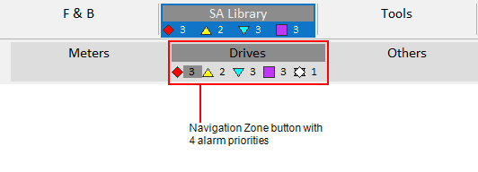            

​                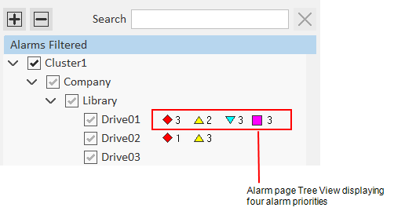            

To enable a fourth alarm count, you need to set the parameter [[Workspace\]NumberOfTopPriorities](file:///C:/Program Files (x86)/AVEVA Plant SCADA/Bin/Help/SCADA Help/Subsystems/ParametersCitectHTML/Content/WorkspaceNumberOfTopPriorities.html)  to 4.

 You also need to configure the display properties for the fourth alarm priority.

**Note:** The Genie "[sa_p4_small](file:///C:/Program Files (x86)/AVEVA Plant SCADA/Bin/Help/SCADA Help/Content/SA_Control_Genie_Priority4Small.htm)" is provided in the SA_Controls project to represent the fourth-highest  priority alarms. To associate this Genie with alarm priority 4, use the **Small Genie Name** property. You can use your own Genie of required. 

**Configure the display properties for the fourth alarm priority**

1.  In the **Setup** activity, select **Alarming**.

2. On the menu below the Command Bar, select **Alarm Priorities**. 

3. If you have used the starter project, you will see the following default priorities.

4. ​                            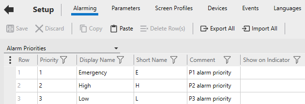                        

5. Add a new row for the fourth alarm priority.

6. Enter the following property values.

7. | Field                          | Description                                                |
   | ------------------------------ | ---------------------------------------------------------- |
   | **Priority**                   | 4                                                          |
   | **Display Name**               | Low                                                        |
   | **Short Name**                 | L                                                          |
   | **Comment**                    | P4 alarm priority                                          |
   | **UnAck On Foreground Color**  | 0x00FF00FF                                                 |
   | **UnAck On Background Color**  | 0x00FFFFFF                                                 |
   | **Ack On Foreground Color**    | 0x00FFBFFF                                                 |
   | **Ack On Background Color**    | 0x00FFBFFF                                                 |
   | **UnAck Off Foreground Color** | 0x00FFBFFF                                                 |
   | **UnAck Off Background Color** | 0x00FFBFFF                                                 |
   | **Library Name**               | sa_priorities                                              |
   | **Genie Name**                 | sa_p4_normal (This Genie is used for the Alarm Indicator.) |
   | **Small Genie Name**           | sa_p4_small                                                |

8. Modify the properties for alarm priority 3 so that is now represents "medium" alarms. 

9. | Field            | Description |
   | ---------------- | ----------- |
   | **Priority**     | 3           |
   | **Display Name** | Medium      |
   | **Short Name**   | M           |

10. **Note:** The Alarm Priority property **Show On Active** must be blank (TRUE) for the alarm counts to show on the Page Navigation zone and Tree View.

11. **Save** your changes. 

12. On the menu below the Command Bar, select **Alarm Categories** 

13. Associate an alarm **Category** with the fourth alarm **Priority**.  

14. ​                            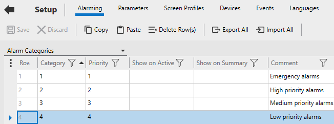                        

15. **Save** your change. 

If you want to add a fourth highest alarm  priority count to the Navigation Zone, additional configuration steps  are required. For more information, see [Add an Additional Alarm Count to the Navigation Zone](file:///C:/Program Files (x86)/AVEVA Plant SCADA/Bin/Help/SCADA Help/Content/Situational_Awareness_Add_an_Additional_Alarm_Count.htm).

You can also add a fourth-highest alarm priority filter to alarm pages. See [Add a Fourth Alarm Priority Filter to Alarm Pages](file:///C:/Program Files (x86)/AVEVA Plant SCADA/Bin/Help/SCADA Help/Content/Situational_Awareness_Add_a_Fourth_Alarm_Filter_Button.htm).

**Note:** Alarm counts will not work if  the home page specified for your navigation menu differs to the home  page specified for your equipment hierarchy (as defined in the **Page** field for the root level of your equipment hierarchy). See "Set the home page for a workspace" in the topic [Prepare the Navigation Menu](file:///C:/Program Files (x86)/AVEVA Plant SCADA/Bin/Help/SCADA Help/Content/Situational_Awareness_Prepare_Navigation_Menus.htm). 

### Add an Additional Alarm Count to the Navigation Zone

By default, the tabs and buttons in the [Navigation Zone](file:///C:/Program Files (x86)/AVEVA Plant SCADA/Bin/Help/SCADA Help/Content/Situational_Awareness_Navigation_Section.htm) include alarm counts for the top three alarm priorities. If required,  you can add an additional alarm count that represents the fourth highest alarm priority.  

​                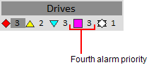            

To add a fourth alarm count to the Navigation Zone's tabs and buttons, you need to perform the following tasks.

**Adjust the parameter [Workspace\]NumberOfTopPriorities**

Set the parameter [[Workspace\]NumberOfTopPriorities](file:///C:/Program Files (x86)/AVEVA Plant SCADA/Bin/Help/SCADA Help/Subsystems/ParametersCitectHTML/Content/WorkspaceNumberOfTopPriorities.html)  to 4.

**Change the default Navigation Zone page**

The default page that the  Navigation Zone is based on is not able to support the wider tabs and  buttons required to display an additional alarm count. To change to the  required Navigation Zone page:

1. Go to Graphics Builder.

2. Open the master page for your project. By default, this page will be called  "Master_PageMenu1_HD1080" or "Master_PageMenu1_UHD4K" (depending on the  resolution your project uses). 

3. Locate the pane that hosts the Navigation Zone.

4. For **Master_PageMenu1_HD1080**, the Navigation Zone pane is located here:

5. ​                            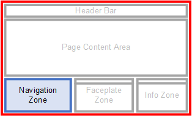                        

6. For **Master_PageMenu1_UHD4K**, the Navigation Zone pane is located here:

7. ​                            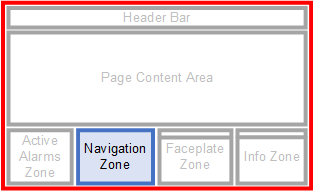                        

8. Double-click on the pane to open the Pane Properties dialog. If the **Name** field does not display "Navigation", you have double-clicked on the wrong pane.

9. Enter the required page name in the pane's **Default Page** field.

10. - For an HD1080 project, enter "PageNav4_1TabRow_HD1080".
    - For a UHD4K project, enter "PageNav4_1TabRow_UHD4K". 

11. Save your changes.

**Configure the display properties for the fourth alarm priority **

 You should confirm that a fourth alarm priority is appropriately configured in your project. For more information, see [Configure Display Properties for a Fourth Alarm Priority](file:///C:/Program Files (x86)/AVEVA Plant SCADA/Bin/Help/SCADA Help/Content/Situational_Awareness_Configure_a Fourth_Alarm_Priority.htm). 

**Note:** Alarm counts will not work if  the home page specified for your navigation menu differs to the home  page specified for your equipment hierarchy (as defined in the **Page** field for the root level of your equipment hierarchy). See "Set the home page for a workspace" in the topic [Prepare the Navigation Menu](file:///C:/Program Files (x86)/AVEVA Plant SCADA/Bin/Help/SCADA Help/Content/Situational_Awareness_Prepare_Navigation_Menus.htm). 

### Add a Fourth Alarm Priority Filter to Alarm Pages

You can add a fourth-highest alarm priority filter to the following alarm pages:

- Active Alarms
- Historical Events
- Shelved Alarms.

​                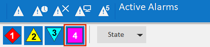            

To achieve this, you need to perform the following steps:

**Adjust the parameter [Workspace\]NumberOfTopPriorities**

Set the parameter [[Workspace\]NumberOfTopPriorities](file:///C:/Program Files (x86)/AVEVA Plant SCADA/Bin/Help/SCADA Help/Subsystems/ParametersCitectHTML/Content/WorkspaceNumberOfTopPriorities.html)  to 4.

**Configure the display properties for the fourth alarm priority **

 You should confirm that a fourth alarm priority is appropriately configured in your project. For more information, see [Configure Display Properties for a Fourth Alarm Priority](file:///C:/Program Files (x86)/AVEVA Plant SCADA/Bin/Help/SCADA Help/Content/Situational_Awareness_Configure_a Fourth_Alarm_Priority.htm). 

**Modify the required alarm page **

1.   In Graphics Builder, open the alarm page you would like to modify (in  the appropriate resolution). The default page names are as follows:

2. - Active Alarms - "DefaultAlarm_HD1080" or "DefaultAlarm_UHD4K".
   - Historical Events - "DefaultSoE_HD1080" or "DefaultSoE_UHD4K".
   - Shelved Alarms - "DefaultShelved_HD1080" or "DefaultShelved_UHD4K".

3. On the filter bar, move the separator and "State" button to the right to make room for a fourth priority button. 

4. ​                            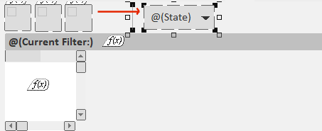                        

5. **Note:** If you are modifying the Historical Events page, a fourth alarm button will  already exist that is used to filter shelved alarms. In this case, you  will need to make room for your fourth alarm priority button between the third and fourth buttons. 

6.  Duplicate one of the existing Item Priority Genies (for priority 1, 2 or 3), and position it in the space you have created. 

7. Double-click on the duplicated Genie to display the Genie Parameters dialog. 

8. Change the **AsmPriority** field to "4", and adjust the **Tooltip** text. 

9. ​                            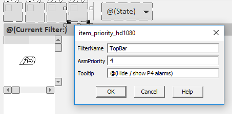                        

10. Save your changes. 

### Format an Alarm List for a Specific Screen Resolution

You can customize the format used for an  alarms list that is displayed on a Situational Awareness alarms page.  This allows you to present the list in a way that will suit a particular screen resolution. For example, you can make the columns wider to suit a page that will display on a UHD 4K monitor. 

To customize an alarms list for a specific screen resolution:

1. Use the [[Format\]FormatName](file:///C:/Program Files (x86)/AVEVA Plant SCADA/Bin/Help/SCADA Help/Subsystems/ParametersCitectHTML/Content/FormatFormatName.html) parameter to define the alarms list format you want to use for a particular screen resolution.

2. The following three examples  show the default format used for each of the generic alarm pages  included in the Situational Awareness Starter Project. You can use one  of these as the basis for a new format that is defined to suit a  specific screen resolution.

3. - [Format]Alarm = the alarm list format for the generic alarm page.
   - [Format]Alarm =  {PriorityAndState,25}{OnDate,80}{OnTime,90}{Name,250}{State,40}{Cluster,70}{Equipment,220}{Item,160}{UserName,100}{Comment,250}{Category,60}
     
   - [Format]Summary = the alarm list format for the generic alarm summary page.
   - [Format]Summary =  {PriorityAndState,25}{Name,250}{SumState,40}{OnDate,80}{OnTime,90}{OffDate,80}{OffTime,90}{DeltaTime,90}{Cluster,70}{Equipment,150}{Item,100}{Comment,250}{Category,60}
     
   - [Format]SOE = the alarm list format for the generic sequence of events page.
   - [Format]SOE =  {PriorityAndState,25}{Date,80}{Time,90}{Message,250}{Name,250}{State,40}{Cluster,70}{Equipment,150}{Item,100}{UserName,100}{UserLocation,100}{Category,60}
     
   
4.  For example, you could create  [Format]SOE_UHD4K for a sequence of events page that will display on a  4K monitor. Use the width attribute in each field to specify how wide  each column will be (in pixels). For example: 

5. [Format]SOE_UHD4K =  {PriorityAndState,50}{Date,160}{Time,180}{Message,500}{Name,500}{State,80}{Cluster,140}{Equipment,300}{Item,200}{UserName,200}{UserLocation,200}{Category,120}

6. In Graphics Builder, open the alarm page you want to apply the new format to and display the Page Properties. 

7. Go to the **Event** tab, and select the **On page entry** event.  

8. By default, Situational Awareness alarm pages will have the following Cicode function configured as the **On page event command**.

9. AlarmPage_Init(AlarmPage_GetDefaultParameters("<res>"), "<res>", <type>)

10. Where:

11. - <res> = the resolution suffix (for example, HD1080, UHD4K)

12. - <type> = the display type (for example, 0 = active alarms, 3 = shelved alarms, 15 =SOE).

13. Add the alarm format name defined in step 1 as the fourth argument to the function. 

14. For example, if you configured the format "SOE_UHD4K", the expression should be as follows:

15. AlarmPage_Init(AlarmPage_GetDefaultParameters("UHD4K"), "UHD4K", 15, "SOE_UHD4K")

16. Save your changes, and compile and run the project. 

The columns displayed on the alarm page will now be based on the format you have specified.

#### Customize the Logo on the Header Bar

The default header bar for a Situational Awareness project comes with a Plant SCADA logo. This logo can be changed.

**Note**: The logo you use needs to be a bitmap. 

To customize the logo:

1. Open Graphics Builder.

2. On the **File** menu, select **New**.

3. Or:

4. Select the **New** button. 

5. ​                    

6. The New Dialog box is displayed.

7. On the New dialog box, click **Symbol**.

8. On the **File** menu, select **Import**.

9. From the Import Dialog Box, locate the logo you want to use and click **Open**.

10. The logo is placed onto the symbol page. Position the logo so that the anchor point is at the bottom right corner.

11. **Note**: If you create a new logo  using the drawing tools in Graphics Builder, before saving the symbol  you need to select all of the objects and select **Convert to Bitmap** from the **Tools** menu. The symbol used by the logo should only contain  one bitmap object.

12. Save the symbol, for example, in the "sa_include" project and the "sa_workspace" library.

13. ​                    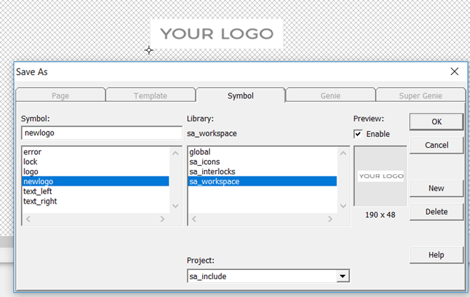                

14. Click **OK**.

15. In Plant SCADA Studio, go to the **Project** activity and select **Home**.

16. From the Command Bar, go to the drop-down next to the **Setup Wizard** and select **Setup Editor**.

17. In the **Parameter Details** section of theSetup Editor, enter the following:

18. - Section: Page
    - Parameter: Logo
    - Value: <libraryname>.<logoname> 
    - For example, "sa_workspace.newlogo". 

    - Click **Add**.

19. Save the changes to the INI file. 

20. Compile and run the project.

21. ​                                    

### Add a Tree View to a Page

A tree view is a control that provides a  hierarchical view of the information on a page. For example, a tree view  is used on the default Active Alarms page in a Situational Awareness  Starter Project. You can use it to filter the displayed list of alarms. 

​                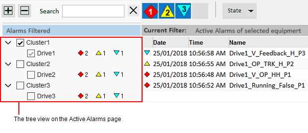            

Each item in a tree view is a Genie that supports the following functionality:

- Check boxes allow you to select one or more items in the tree. 
- Alarms counts indicate the  number of associated alarms in the top three alarm priorities, as well  as the number of shelved alarms. Alarm and shelve counts will only apply to an equipment data source.

**Note:** You can use the parameter [[Workspace\]NumberOfTopPriorities](file:///C:/Program Files (x86)/AVEVA Plant SCADA/Bin/Help/SCADA Help/Subsystems/ParametersCitectHTML/Content/WorkspaceNumberOfTopPriorities.html)  to display alarm counts for the top four alarm priorities (instead of the top three). For more setup information, see [Configure Display Properties for a Fourth Alarm Priority](file:///C:/Program Files (x86)/AVEVA Plant SCADA/Bin/Help/SCADA Help/Content/Situational_Awareness_Configure_a Fourth_Alarm_Priority.htm).

To add a tree view to a page you need to use the [Tree View Genie](file:///C:/Program Files (x86)/AVEVA Plant SCADA/Bin/Help/SCADA Help/Content/SA_Include_Genie_TreeView.htm). The Genie's parameters are divided into five main groups:

- Basic Setup parameters — primarily used to specify the data source on which the tree is based. 
- Search parameters — identify the object used to input search text at runtime. 
- Display parameters — define the size of the space the tree view occupies and the components that will appear at runtime.
- Event parameters — define the functions that are executed when an operator interacts with the Genie at runtime.
- Customization parameters — enable advanced customization of a tree view. 

When the Genie is pasted on a page, the  Genie Parameters Dialog Box is displayed. See below for a description of each parameter. 

**Genie Parameters **

Basic Setup Parameters

| Parameter         | Description                                                  |
| ----------------- | ------------------------------------------------------------ |
| Datasource        | Specifies the menu on which the tree is based. You can enter the name of a menu you have created using the **Menu Configuration** view in the **Visualization** activity (see [Prepare the Navigation Menu](file:///C:/Program Files (x86)/AVEVA Plant SCADA/Bin/Help/SCADA Help/Content/Situational_Awareness_Prepare_Navigation_Menus.htm)).Alternatively, you can use the name of a menu that is created at runtime using the MenuGetPageNode Cicode function. You can also enter "__EquipmentModel" to use the equipment hierarchy defined for the current project. |
| Use Display Names | Determines if display names are used to label equipment in the tree view. A display name is a meaningful name that can be defined for piece of equipment using the Display Name property (see [Define Equipment in Plant SCADA Studio](file:///C:/Program Files (x86)/AVEVA Plant SCADA/Bin/Help/SCADA Help/Content/Define_Equipment.htm)). If the tree view is displaying the equipment model:TRUE =  Equipment display names are usedFALSE = Equipment names are used.If this is set to TRUE and no Display Name is configured, the equipment name will be used instead. If the tree view is displaying a generic menu structure:TRUE = Menu item comments are usedFALSE = Menu item names are used. |

 

Search Parameters

| Parameter       | Description                                                  |
| --------------- | ------------------------------------------------------------ |
| Search Box Name | This field specifies the name of  the ciText.TextBox object that the tree view will use as its input for  the search text at runtime. The name to enter is defined in the Text  Object Properties dialog on the **Access** tab. By default, "Search" is used. |

 

Display Parameters

| Parameter           | Description                                                  |
| ------------------- | ------------------------------------------------------------ |
| Treeview Height     | The height of the area the tree view will occupy (in pixels). If the length of the expanded tree extends beyond the height specified here, a vertical scroll bar will appear. |
| Treeview Width      | The width of the area the tree view will occupy (in pixels).If the width of the expanded tree extends beyond the left edge of the alarm count list, a horizontal scroll bar will appear. |
| Row Height          | The amount of space that will be available to each row within the tree view. |
| Display Checkboxes  | Determines if a check box  is displayed for each item in the tree. TRUE = Check boxes are displayed.FALSE = Check boxes are not displayed. |
| Auto-check Children | Determines if the check boxes within the lower levels of a branch are automatically checked when a parent item is checked. TRUE = Children are automatically checked.FALSE = Children are not automatically checked. |
| Display Alarms      | Determines if alarm counts for the top three alarm categories are displayed for each item in the tree. TRUE = Alarm counts for the top three alarm categories are displayed.FALSE = Alarm counts for the top three alarm categories are not displayed.If the branch  is collapsed, the values will represent the number of active alarms for  each category within the current branch and its lower levels. If a node is expanded, the count  will only shows alarms for that node, as the counts for its children  will now be visible on the child nodes.**Note:** You can use the parameter [[Workspace\]NumberOfTopPriorities](file:///C:/Program Files (x86)/AVEVA Plant SCADA/Bin/Help/SCADA Help/Subsystems/ParametersCitectHTML/content/WorkspaceNumberOfTopPriorities.html) to display alarm counts for the top four alarm priorities (instead of the top three). |
| Display Shelved     | Determines if an alarm count for shelved alarms is displayed for each item in the tree. If the branch  is collapsed, the values will represent the number of shelved alarms for each category within the current branch and its lower levels. If a node is expanded, the count  will only shows shelved alarms for that node, as the counts for its  children will now be visible on the child nodes.TRUE = Alarm count for shelved alarms is displayed.FALSE = Alarm count for shelved alarms is not displayed. |

 

Event Parameters

| Parameter                 | Description                                                  |
| ------------------------- | ------------------------------------------------------------ |
| On Init Complete Function | Represents the name of the function that is invoked when the tree view completes initialization. OnInitCompleteFunction(INT *nTreeviewAN*)The argument *nTreeviewAN* is expected, it is the animation number of the tree view that fires the event. |
| On Check Function         | Represents the name of the function that is invoked upon the checked event.OnCheckFunction(INT *hMenuItem*)The argument *hMenuItem* is  expected. It is the handle to the menu item that is represented by the  tree node on which the check box has just been clicked. |
| On Left Click Function    | Represents the name of the function that is invoked upon the left click event.OnLeftClickFunction(INT *hMenuItem*)The argument *hMenuItem* is expected. It is the handle to the menu item that is represented by the tree node that has just been left-clicked. |
| On Right Click Function   | Represents the name of the function that is invoked upon the right click event.OnRightClickFunction(INT *hMenuItem*)The argument *hMenuItem* is expected. It is the handle to the menu item that is represented by the tree node that has just been right-clicked. |

 

Customization Parameters

| Parameter                         | Description                                                  |
| --------------------------------- | ------------------------------------------------------------ |
| View Genie                        | Refers to the Genie that is called to display each item in the tree. By default, the [Tree View Item Genie](file:///C:/Program Files (x86)/AVEVA Plant SCADA/Bin/Help/SCADA Help/Content/SA_Include_Genie_TreeViewItem.htm) in the "sa_controls" library is used (sa_controls.treeviewitem). You can use  this parameter to substitute the default Genie with your own. This will  allow you to customize the appearance of the tree and the features it  supports. |
| View Init Function                | The Cicode function that is called to initialize the **View Genie** (see above) for each row. By default, a  system function called "_Treeview_InitViewGenie_<resolution>" is  used (for example, "_Treeview_InitViewGenie_HD1080"). |
| Fill Function                     | This function  is called on each page scan to manage data updates in the tree view when the tree view state changes (for example, when scrolling, expanding, or collapsing occurs).By default, a system function called "_Treeview_Update" is used. |
| View Model Data Size              | Specifies the  number of custom fields per tree view item to be allocated for user  data. The data in these fields will be updated by the function specified in the parameter **Datasource Item Retrieve Function** (see below).This parameter is set to zero (0) by default. |
| View Model Init Function          | Custom function to configure the additional columns specified by the parameter 'View  Model Data Size'. This function is called once when the tree view is  initialized. |
| Datasource Item Retrieve Function | A custom  function that loads additional user data for the tree view. This  function is called whenever the tree view data is refreshed (for  example, when scrolling, expanding, or collapsing occurs). The number of custom fields to be updated by this function is defined by the  parameter **View Model Data Size** (see above). |
| Is Source Ready Function          | Enter the name a function that is used to determine if the data source is ready. The tree view  initialization code will run the function (in addition to the checks for navigation initialized and workspace system initialized) before  allowing the tree view to be displayed. If this  function does not return TRUE within five seconds of displaying the  page, the tree view initialization will time out. This function needs to return an INT (TRUE or FALSE) and takes a single argument, INT  nTreeviewAN. |
| Datasource Watcher Function       | Enter a Cicode  function that will be used to monitor the tree view's associated data  source for any updates. The function will be called when the Tree View  Genie is initialized, and needs to be responsible for triggering a  reload if required. The function will run continuously, so it should not return any values. It also needs to accept the arguments *sDatasource* and *hTreeviewAN.* If you are using the Tree View Genie to display the entire equipment model (for example, if the **Datasource** parameter is set to "__EquipmentModel"), you can enter the following  function name to trigger a reload of the tree whenever the equipment  model changes: _Treeview_MonitorEquipmentModel |
| Can Check Items Function          | A custom function that is used to determine if tree view item checking is allowed. By default,  toggling the checked state of a tree view item is allowed at runtime.  This function provides a way to disable the check boxes on all items if  required. For example,  you may want to disable checking if the data that the tree view will  interact with is not ready, or if the current user does not have  sufficient privileges.  The function needs to return a value of TRUE or FALSE. |

 

AN Parameter

| Parameter | Description                       |
| --------- | --------------------------------- |
| AN        | A unique ID for the Genie object. |

**Note:** You can use the **View Genie** parameter to substitute the default Genie with your own. This will  allow you to customize the appearance of the tree and the features it  supports. 

### Add an Alarms List to a Page

You can add an alarms list to a page using the following Genies:

- [Alarm List Genie](file:///C:/Program Files (x86)/AVEVA Plant SCADA/Bin/Help/SCADA Help/Content/SA_Control_Genie_AlarmList.htm) — creates an alarm list with a header row and scroll bars.
- [Alarm List Vertical Genie](file:///C:/Program Files (x86)/AVEVA Plant SCADA/Bin/Help/SCADA Help/Content/SA_Control_Genie_Alarmlist_V.htm) — creates an alarms list with no header row and just a vertical scroll bar.

These Genies use the [AlarmListCreate](file:///C:/Program Files (x86)/AVEVA Plant SCADA/Bin/Help/SCADA Help/Subsystems/CicodeReferenceCitectHTML/Content/AlarmListCreate.html) Cicode function to create a basic alarms list. 

​                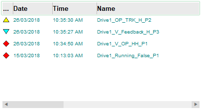            

To apply formatting to the list rows and enable on-click commands, you can also add the [List Row Genie](file:///C:/Program Files (x86)/AVEVA Plant SCADA/Bin/Help/SCADA Help/Content/SA_Control_Genie_List_Row.htm). 

​                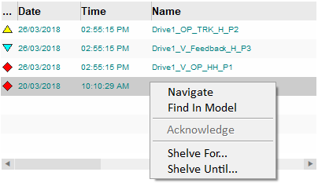            

**Add an alarm list Genie**

To add an alarm list Genie ("alarmlist" or "alarmlist_v") to a page: 

1. Open a page in Graphics Builder. 

2. Click the **Paste Genie** button in the objects toolbox.

3. ​                                                    

4.  Or, select **Paste Genie** from the **Edit** menu. 

5. In the Paste Genie dialog, select the **Library** "sa_controls".

6. Select one of the following from the **Genie** list and click **OK**. 

7. - alarmlist = Alarm List Genie
   - alarmlist_v = Alarm List - Vertical Genie

8.  The Genie is pasted onto the graphics page. A dialog box will open, prompting you to configure the parameters for the Genie.

9. The **Alarm List Vertical Genie** dialog box will show the **AN** parameter. The number that is displayed is AN value that was automatically applied to the Genie when it was pasted on the page.

10. ​                            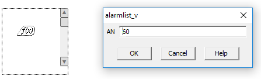                        

11. The **Alarm List Genie** dialog box will include some additional parameters that enable runtime interaction with the header row. By default, the **OnColumnReorderedFunction** will display "ArrayView_SetFormat()". This is a system function that  allows an operator to rearrange the header row columns at runtime. The  other parameters can be left blank.

12. ​                            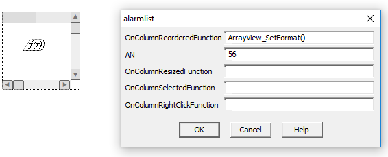                        

13. Click **OK** to close the parameters dialog box. 

To load alarm data into the list at runtime, you need to call the [AlarmListCreate](file:///C:/Program Files (x86)/AVEVA Plant SCADA/Bin/Help/SCADA Help/Subsystems/CicodeReferenceCitectHTML/Content/AlarmListCreate.html) Cicode function as an On Page Entry command in the Page Properties dialog. 

1. In Graphics Builder, right-click on the page and select **Page Properties** from the menu that appears.
2.  Or:

3.  From the **File** menu, select **Properties**.

4. The Page Properties dialog box will appear. 

5. On the **Events** tab, select the **On page entry** event.
6. In the **On page entry command** field, configure  the [AlarmListCreate](file:///C:/Program Files (x86)/AVEVA Plant SCADA/Bin/Help/SCADA Help/Subsystems/CicodeReferenceCitectHTML/Content/AlarmListCreate.html) Cicode function as required. 
7. ​                            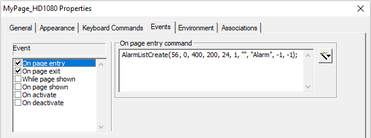                        

8. The value specified for the *nAN* argument needs to match the AN number applied to the alarm list Genie. 

9. On the **Events** tab, select the **On page exit** event.
10. In the **On page exit command** field, configure  the [AlarmListDestroy](file:///C:/Program Files (x86)/AVEVA Plant SCADA/Bin/Help/SCADA Help/Subsystems/CicodeReferenceCitectHTML/Content/AlarmListDestroy.html) Cicode function. For example, 
11.  AlarmListDestroy(56);

12. Click **OK**, and **Save** your page. 

You can now run your project and view the alarms list. 

**Add the List Row Genie**

1. In Graphics Builder, open the page that includes the list to which you want to add a List Row Genie. 

2. Click the **Paste Genie** button in the objects toolbox.

3. ​                                                    

4.  Or, select **Paste Genie** from the **Edit** menu. 

5. In the Paste Genie dialog, select the **Library** "sa_controls".

6. Select one of the following from the **Genie** list, based on the approximate size of the list you require. 

7. - list_row_x5 – use this to create a list with up to 5 rows.
   - list_row_x10 – use this to create a list with up to 10 rows.
   - list_row_x40 – use this to create a list with up to 40 rows.
   - list_row_x80 – use this to create a list with up to 80 rows.

8.  The Genie is pasted onto the graphics page. A dialog box will open, prompting you to configure the parameters for the Genie.

9. ​                            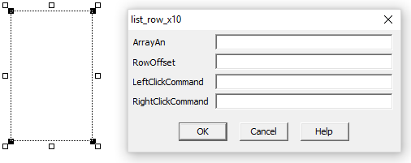                        

10. **Note:**  There is no need  to adjust the size of the List Row Genie on a graphics page to fill an  area. The required space will be determined at runtime by the size of  the list with which it is associated. 

11. In the **ArrayAN** field, enter the AN value for the associated list. 

12. You can use the Cicode function [DspGetAnFromName](file:///C:/Program Files (x86)/AVEVA Plant SCADA/Bin/Help/SCADA Help/Subsystems/CicodeReferenceCitectHTML/Content/DspGetAnFromName.html) to retrieve the AN. For example:

13. DspGetAnFromName("AlarmList").

14. To enable the default set of right-click commands that are available on the default alarm page, go to the **RightClickCommand** field and enter the following: 

15. AlarmPage_AlarmListOnRightClick()

16. If you want to use a custom set of commands, you can add your own Cicode. 

17. Click **OK**, and **Save** your page. 

You can now run your project and view the alarms list. 

### Add a Generic List to a Page

You can add a generic list to a page using the following Genies:

- [Generic List Genie](file:///C:/Program Files (x86)/AVEVA Plant SCADA/Bin/Help/SCADA Help/Content/SA_Control_Genie_GenericList.htm) — creates a list with a header row and scroll bars.
- [Generic List Vertical Genie](file:///C:/Program Files (x86)/AVEVA Plant SCADA/Bin/Help/SCADA Help/Content/SA_Control_Genie_Genericlist_V.htm) — creates a list with no header row and just a vertical scroll bar.

To apply formatting to the list rows and enable on-click commands, you can also add the [List Row Genie](file:///C:/Program Files (x86)/AVEVA Plant SCADA/Bin/Help/SCADA Help/Content/SA_Control_Genie_List_Row.htm). 

**Add a list Genie**

To add a list Genie ("genericlist" or "genericlist_v") to a page: 

1. Open a page in Graphics Builder. 

2. Click the **Paste Genie** button in the objects toolbox.

3. ​                                                    

4.  Or, select **Paste Genie** from the **Edit** menu. 

5. In the Paste Genie dialog, select the **Library** "sa_controls".

6. Select one of the following from the **Genie** list and click **OK**. 

7. - genericlist = Generic List Genie
   - genericlist_v = Generic List Vertical Genie

8.  The Genie is pasted onto the graphics page. A dialog box will open, prompting you to configure the parameters for the Genie.

9. The **Generic List Vertical Genie** dialog box will show the following parameters:

10. - **AN** — the number that is displayed is the AN value that was automatically applied to the Genie when it was pasted on the page.
    - **GenericListFillFunction** — this field specifies the user Cicode function to be called at runtime to populate the list. The function needs to retrieve the data to be  displayed.

11. In the example below,  "Test_GenericListFill" has been entered. To view the custom Cicode that  this function calls, see the Cicode examples below.  

12. ​                            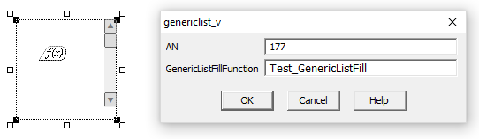                        

13. The **Generic List Genie** dialog box will include some additional parameters that enable runtime interaction with the header row. By default, the **OnColumnReorderedFunction** will display "ArrayView_SetFormat()". This is a system function that  allows an operator to rearrange the header row columns at runtime. 

14. ​                            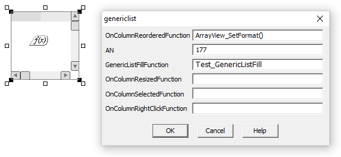                        

15. Click **OK** to close the parameters dialog box. 

To load data into the list  at runtime, you need to call the required Cicode function as an On Page  Entry command in the Page Properties dialog. 

1. In Graphics Builder, right-click on the page and select **Page Properties** from the menu that appears.
2.  Or:

3.  From the **File** menu, select **Properties**.

4. The Page Properties dialog box will appear. 

5. On the **Events** tab, select the **On page entry** event.
6. In the **On page entry command** field, enter the required expression. 
7. For this  example, the "Test_GenericListCreate" function is entered. To view the  custom Cicode that this function calls, see the Cicode examples below.

8. On the **Events** tab, select the **On page exit** event.
9. In the **On page exit command** field, enter an expression to destroy the list that has been created.  For an example, search locate "Test_GenericListDestroy" in the example  Cicode below. 
10. Click **OK**, and **Save** your page. 

**Add the List Row Genie**

1. In Graphics Builder, open the page that includes the list to which you want to add a List Row Genie. 

2. Click the **Paste Genie** button in the objects toolbox.

3. ​                                                    

4.  Or, select **Paste Genie** from the **Edit** menu. 

5. In the Paste Genie dialog, select the **Library** "sa_controls".

6. Select one of the following from the **Genie** list, based on the approximate size of the list your require. 

7. - list_row_x5 – use this to create a list with up to 5 rows.
   - list_row_x10 – use this to create a list with up to 10 rows.
   - list_row_x40 – use this to create a list with up to 40 rows.
   - list_row_x80 – use this to create a list with up to 80 rows.

8.  The Genie is pasted onto the graphics page. A dialog box will open, prompting you to configure the parameters for the Genie.

9. ​                                                    

10. **Note:**  There is no need  to adjust the size of the List Row Genie on a graphics page to fill an  area. The required space will be determined at runtime by the size of  the list with which it is associated. 

11. In the **ArrayAN** field, enter the AN value for the associated list. 

12. You can use the Cicode function [DspGetAnFromName](file:///C:/Program Files (x86)/AVEVA Plant SCADA/Bin/Help/SCADA Help/Subsystems/CicodeReferenceCitectHTML/Content/DspGetAnFromName.html) to retrieve the AN. For example:

13. DspGetAnFromName("GenericList").

14. To enable on-click commands, go to the **LeftClickCommand** and/or **RightClickCommand** fields and enter the required Cicode.

15. See the Cicode example Test_GenericListRightClick below. 

16. Click **OK**, and **Save** your page. 

You can now run your project and view the alarms list. 

**Cicode Examples**            

The following Cicode provides an example of how to create the following generic list using Plant SCADA's [Array Functions](file:///C:/Program Files (x86)/AVEVA Plant SCADA/Bin/Help/SCADA Help/Subsystems/CicodeReferenceCitectHTML/Content/Array_Functions.html). The list displays random numbers with column and row identifiers.

​                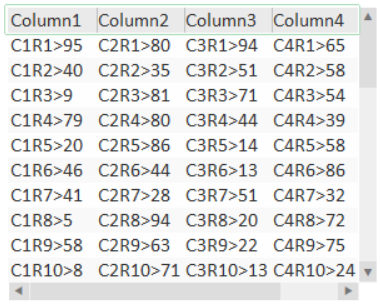            

**Test_GenericListCreate**

```
FUNCTION Test_GenericListCreate(INT hAn)
   INT bDrawHeader = 1;  // Draw the header row
   INT hFontRow = DspFontHnd("SA_AlmRow");
   INT hFontHeader = DspFontHnd("SA_AlmRow");
   INT nColumn = 1;
   INT nColumns = 5;
   INT nRows = 10;
   INT nRowHeight = 20;  // pixels
   INT nHeight = (nRows + 1) * nRowheight;
   INT nWidth = 280;     // pixels
   INT nWidthTotal = 0;  // Pixels, sum of column widths
   INT nDataColumns = 10;  // Maximum possible number of data columns
   INT nDataRows = 40;  // Maximum possible number of data rows

   INT hArray = ArrayCreateByAn(hAn , nColumns + 1, nRows + 1, ARRAY_ZINDEX_MAX);	
   // +1 for Column0 (hidden), +1 for Row0 (hidden)
   STRING sMapName = ArrayGetMapNameByAn(hAn);

// Set up array attributes

ArraySetIntByAn(hAn, nWidth,      ARRAY_INFORMATION_COLUMN, ARRAY_INFORMATION_ROW, ARRAY_ZINDEX_ARRAY_XMAX);
ArraySetIntByAn(hAn, nHeight,     ARRAY_INFORMATION_COLUMN, ARRAY_INFORMATION_ROW, ARRAY_ZINDEX_ARRAY_YMAX);
ArraySetIntByAn(hAn, nRowHeight,  ARRAY_INFORMATION_COLUMN, ARRAY_INFORMATION_ROW, ARRAY_ZINDEX_ARRAY_ROWHEIGHT);
ArraySetIntByAn(hAn, bDrawHeader, ARRAY_INFORMATION_COLUMN, ARRAY_INFORMATION_ROW, ARRAY_ZINDEX_ARRAY_DRAWHEADER);
ArraySetIntByAn(hAn, hFontRow,    ARRAY_INFORMATION_COLUMN, ARRAY_INFORMATION_ROW, ARRAY_ZINDEX_ARRAY_FONTROW);
ArraySetIntByAn(hAn, hFontHeader, ARRAY_INFORMATION_COLUMN, ARRAY_INFORMATION_ROW, ARRAY_ZINDEX_ARRAY_FONTHDR);

// Set up column headers

FOR nColumn = 1 TO nColumns DO
   ArraySetStringByAn(hAn, "Column" + nColumn:#,  nColumn, ARRAY_INFORMATION_ROW, ARRAY_ZINDEX_COLUMN_VALUE);
   ArraySetIntByAn(hAn, 70,                       nColumn, ARRAY_INFORMATION_ROW, ARRAY_ZINDEX_COLUMN_WIDTH);
   ArraySetIntByAn(hAn, ARRAY_COLUMN_TYPE_STRING, nColumn, ARRAY_INFORMATION_ROW, ARRAY_ZINDEX_COLUMN_TYPE);
   nWidthTotal = nWidthTotal + 70;
END

ArraySetIntByAn(hAn, nWidthTotal, ARRAY_INFORMATION_COLUMN, ARRAY_INFORMATION_ROW, ARRAY_ZINDEX_ARRAY_XTOTAL);
ArraySetIntByAn(hAn, 0,  ARRAY_INFORMATION_COLUMN, ARRAY_INFORMATION_ROW, ARRAY_ZINDEX_ARRAY_YTOTAL);

INT hDataArray = ArrayCreate("Test_Data", nDataColumns, nDataRows, 1); 
// Data Array; 10 fields x 40 rows
MapValueSet(sMapName, "DataArray",   hDataArray);
MapValueSet(sMapName, "DataColumns", nDataColumns);
MapValueSet(sMapName, "DataRows",    nDataRows);
MapValueSet(sMapName, "Offset",      -1);

TaskNew("Test_Task_GetData", hAn:#, 1 + 8);
END


FUNCTION Test_GenericListDestroy(INT hAn)
   INT hDataArray = -1;
   STRING sMapName = "";

   IF (ArrayExistsByAn(hAn)) THEN
      sMapName = ArrayGetMapNameByAn(hAn);
      hDataArray = MapValueGet(sMapName, "DataArray");
      ArrayDestroy(hDataArray);
      GenericListDestroy(hAn);
   END
END


FUNCTION Test_Task_GetData(STRING sArg);
   INT hAn = StrToInt(sArg);
   INT nDataColumn = 0;
   INT nDataRow = 0;
   INT nDataColumns = 0;
   INT nDataRows = 0;
   INT hDataArray = -1;
   STRING sMapName = "";
   STRING nRandom = 0;
   STRING sValue = "";

   WHILE (TRUE) DO
      IF (ArrayExistsByAn(hAn)) THEN
         sMapName = ArrayGetMapNameByAn(hAn);
         hDataArray = MapValueGet(sMapName, "DataArray");
         nDataColumns = MapValueGet(sMapName, "DataColumns");
         nDataRows = MapValueGet(sMapName, "DataRows");

         ArraySetIntByAn(hAn, nDataRows, ARRAY_INFORMATION_COLUMN, ARRAY_INFORMATION_ROW, ARRAY_ZINDEX_ARRAY_YTOTAL);

         FOR nDataRow = 1 TO nDataRows DO
             FOR nDataColumn = 1 TO nDataColumns DO
                 nRandom = Rand(99);
                 sValue = "C" + nDataColumn:# + "R" + nDataRow:# + ">" + nRandom:#;
                 ArraySetString(hDataArray, sValue, nDataColumn - 1, nDataRow -1, 0);
             END
         END
      END

      SleepMS(30000);
   END

END
```

**Test_GenericListFill**

```
FUNCTION Test_GenericListFill(INT hAn)
   INT nRow = 0;
   INT nRows = 10;
   INT nColumn = 0;
   INT nColumns = 5;
   INT nOffset = 0;
   INT nOffset_Previous = 0;
   INT nDataColumns = 0;
   INT nDataRows = 0;
   INT hDataArray = -1;
   STRING sMapName = "";
   STRING sValue = "";

   IF (ArrayExistsByAn(hAn)) THEN
      _ArrayView_Header_Run(hAn);
      _ArrayView_VScroll_Run(hAn);
      _ArrayView_HScroll_Run(hAn);

      sMapName = ArrayGetMapNameByAn(hAn);
      hDataArray = MapValueGet(sMapName, "DataArray");
      nOffset_Previous = MapValueGet(sMapName, "Offset");
      nOffset = ArrayGetIntByAn(hAn, ARRAY_INFORMATION_COLUMN, ARRAY_INFORMATION_ROW, ARRAY_ZINDEX_ARRAY_YOFF);

      hDataArray = MapValueGet(sMapName, "DataArray");
      IF ((ArrayIsDirty(hDataArray)) OR (nOffset <> nOffset_Previous)) THEN
         nDataColumns = MapValueGet(sMapName, "DataColumns");
         nDataRows = MapValueGet(sMapName, "DataRows");

         FOR nRow = 1 TO nRows DO
            FOR nColumn = 1 TO nColumns DO
               sValue = ArrayGetString(hDataArray, nColumn - 1, (nOffset + nRow) - 1, 0);
               ArraySetStringByAn(hAn, sValue, nColumn, nRow, ARRAY_ZINDEX_CELL_VALUE);
            END
         END

         MapValueSet(sMapName, "Offset", nOffset);
         ArraySetIsDirty(hDataArray, FALSE);
      END
   END
END

FUNCTION Test_GenericListRightClick(INT hAn)
   Message("TestGenericListRightClick", "Add context menu code here", 0);
END
```

**Test_GenericListRightClick**

```
FUNCTION Test_GenericListRightClick(INT hAn)
   Message("TestGenericListRightClick", "Add context menu code here", 0);
END
```

### Add an Alarm Filter Button

You can add your own alarm filter buttons to one of the [Default Alarm Pages](file:///C:/Program Files (x86)/AVEVA Plant SCADA/Bin/Help/SCADA Help/Content/Situational_Awareness_Default_AlarmPages.htm) in a Situational Awareness project.  

​                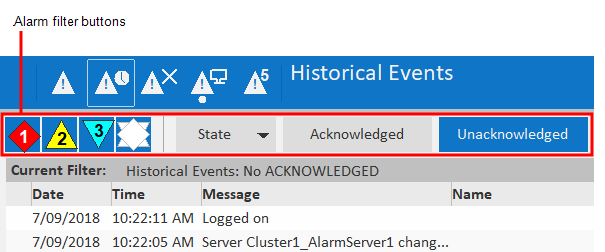            

The following Alarm Filter Genies allow you to add buttons that provide basic filter functionality to an alarm page:

- [Item Acknowledged Genie (HD1080)](file:///C:/Program Files (x86)/AVEVA Plant SCADA/Bin/Help/SCADA Help/Content/SA_Include_Genie_ItemAck1080.htm)                
- [Item Acknowledged Genie (UHD4K)](file:///C:/Program Files (x86)/AVEVA Plant SCADA/Bin/Help/SCADA Help/Content/SA_Include_Genie_ItemAck4K.htm)                
- [Item Priority Genie (HD1080)](file:///C:/Program Files (x86)/AVEVA Plant SCADA/Bin/Help/SCADA Help/Content/SA_Include_Genie_ItemPriority1080.htm)                
- [Item Priority Genie (UHD4K)](file:///C:/Program Files (x86)/AVEVA Plant SCADA/Bin/Help/SCADA Help/Content/SA_Include_Genie_ItemPriority4K.htm)                
- [Item Shelved Genie (HD1080)](file:///C:/Program Files (x86)/AVEVA Plant SCADA/Bin/Help/SCADA Help/Content/SA_Include_Genie_ItemShelved1080.htm)                
- [Item Shelved Genie (UHD4K)](file:///C:/Program Files (x86)/AVEVA Plant SCADA/Bin/Help/SCADA Help/Content/SA_Include_Genie_ItemShelved4K.htm)                
- [Item State Genie (HD1080)](file:///C:/Program Files (x86)/AVEVA Plant SCADA/Bin/Help/SCADA Help/Content/SA_Include_Genie_ItemState1080.htm)                
- [Item State Genie (UHD4K)](file:///C:/Program Files (x86)/AVEVA Plant SCADA/Bin/Help/SCADA Help/Content/SA_Include_Genie_ItemState4K.htm)                
- [Item Unacknowledged Genie (HD1080)](file:///C:/Program Files (x86)/AVEVA Plant SCADA/Bin/Help/SCADA Help/Content/SA_Include_Genie_ItemUnack1080.htm)                
- [Item Unacknowledged Genie (UHD4K)](file:///C:/Program Files (x86)/AVEVA Plant SCADA/Bin/Help/SCADA Help/Content/SA_Include_Genie_ItemUnack4K.htm).

You can also use the [Item Base Genie](file:///C:/Program Files (x86)/AVEVA Plant SCADA/Bin/Help/SCADA Help/Content/SA_Include_Genie_ItemBase.htm) to create a button that implements a custom filter. 

**Note:** The default hardware alarms page does not support filter buttons. 

**Add an alarm filter button using a Genie**

To add an alarm filter button to a default alarm page:

1. In Graphics Builder, open the alarm page to which you want to add a filter button.

2. The default alarm pages have the following names:

3. - DefaultAlarm_HD1080 (Active Alarms Page HD1080)
   - DefaultAlarm_UHD4K (Active Alarms Page UHD4K)
   - DefaultSOE_HD1080 (Historical Events Page HD1080)
   - DefaultSOE_UHD4K (Historical Events Page UHD4K)
   - DefaultShelved_HD1080 (Shelved Alarms Page HD1080)
   - DefaultShelved_UHD4K (Shelved Alarms Page UHD4K)

4. Locate the filters section at the top of the page. The filters section will  contain any Alarm Filter Genies that already appear on the page. 

5. Click the **Paste Genie** button in the objects toolbox, or select **Paste Genie** from the **Edit** menu. 

6. In the Paste Genie dialog, select the "sa_filter" library.

7. Select the required Alarm Filter Genie from those listed above. The name of  the Genie will reflect the type of filtering it supports. 

8. A dialog will  open prompting you to configure the parameters for the Genie. For a  description of each parameters, click on appropriate link in the list of Alarm Filter Genies above.

9. Enter the required values, and click **OK** to close the dialog. 

**Add a custom alarm filter button using the Item Base Genie**

To add a custom alarm filter button to a default alarm page:

1. In Graphics Builder, open the alarm page to which you want to add a custom filter button.

2. The default alarm pages have the following names:

3. - DefaultAlarm_HD1080 (Active Alarms Page HD1080)
   - DefaultAlarm_UHD4K (Active Alarms Page UHD4K)
   - DefaultSOE_HD1080 (Historical Events Page HD1080)
   - DefaultSOE_UHD4K (Historical Events Page UHD4K)
   - DefaultShelved_HD1080 (Shelved Alarms Page HD1080)
   - DefaultShelved_UHD4K (Shelved Alarms Page UHD4K)

4. Locate the filters section at the top of the page. The filters section will  contain any Alarm Filter Genies that already appear on the page. 

5. Click the **Paste Genie** button in the objects toolbox, or select **Paste Genie** from the **Edit** menu. 

6. In the Paste Genie dialog, select the "sa_filter" library.

7. Select the "Item Base Genie" and click **OK**.

8. A dialog will open prompting you to configure the parameters for the Genie. For a description of each parameters, see [Item Base Genie.](file:///C:/Program Files (x86)/AVEVA Plant SCADA/Bin/Help/SCADA Help/Content/SA_Include_Genie_ItemBase.htm)

9. Enter the required values, and click **OK** to close the dialog. 

**Note:** The Default Alarm Pages  incorporate an alarm filter named "TopBar". To implement the expected  filtering functionality, you can enter "TopBar" as the **Filter Name** in the Genie parameters. If you need to create your own custom filter, use the [Item Base Genie](file:///C:/Program Files (x86)/AVEVA Plant SCADA/Bin/Help/SCADA Help/Content/SA_Include_Genie_ItemBase.htm). You can then use the **FilterExpr** parameter to enter a Cicode expression that returns the name of a custom filter. 

### Create a Set of Tabs for a Pane

You can use the Tab Bar Genie to create a  set of tabs for a pane, just like those displayed in the Information  Zone on the Situational Awareness dashboard. 

​                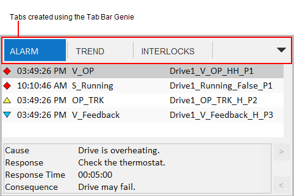            

If the available space cannot accommodate  the configured tabs, you can access those that are not displayed via the drop-down menu to the right of the tabs. You can also enable "pinning", which allows an operator to specify that a particular tab remains  displayed. 

To configure a set of tabs, you need to perform the tasks described below.

**Create a menu**

The Tab Bar Genie calls a  menu defined in a project's Menu Configuration database. You will need  to create an appropriate menu in Plant SCADA Studio's **Visualization** activity (see [Menu Configuration](file:///C:/Program Files (x86)/AVEVA Plant SCADA/Bin/Help/SCADA Help/Content/Menu_Configuration.htm)).

In the case of a menu created for a set of tabs, use the following fields: 

- The **Page** property is used to give the tabbed menu a name.
- The **Level 1** entries define the tabs that appear. 
- The **Target Page** property determines what will be displayed in the content pane when a tab is selected.

You can also customize the tabs using the following properties:

- The **Symbol** property allows you to you to display a lock icon on the tab. Enter any value if you want the lock to display. You can use the Custom 2  property (see below) to hide the icon if required. 
- The **Checked** property allows you to specify if a tab is pinned by default. Leaving  the field blank will mean the tab is not pinned by default. Any other  value will mean the tab is pinned by default. This setting will only  work if pinning is enabled for the tab bar. This is determined by the **Can Tabs Be Pinned?** parameter in the Tab Bar Genie (see Configure the tab bar genie below).
- The **Menu Command** property can be used to specify a Cicode expression that is executed when the associated tab is selected. 
- The **Custom 1** property determines if the **Close** button will appear on the tab. If you leave this field blank, the Close button will appear. Any other value will hide the Close button. 
- The **Custom 2** property determines if the icon identified in the **Symbol** field will appear on the tab. If you leave this field blank, the icon will appear. Any other value will hide the icon. 
- The **Custom 3** property determines if a label will appear on the tab. If you leave  this field blank, the label will appear. Any other value will hide the  label. 

**Note:** The **Custom 4** – **Custom 8** fields are reserved for system use.

**Create the host panes**

Two adjacent panes are required to support a set of tabs:

- Header pane - hosts a page with the Tab Bar Genie on it
- Content pane - displays the target page that is associated with a selected tab. 

The two are linked with each other via the Pane Properties for the content pane. The following Tabbed Pane Properties are used: 

- **Header Pane Name** — identifies the associated header pane
- **Tab Control Name** — identifies the Tab Bar Genie in the header pane that determines what the content pane will display.

**Create the required pages**

You need to create the following pages:

- Header page — you need an appropriately sized page that will occupy the header pane and host the Tab Bar Genie.
- Content  pages — you need appropriately sized pages for each item specified in  the menu you created. The page names need to match those defined in the **Target Page** field for each menu entry. 

**Configure the Tab Bar Genie**

Lastly, you need to configure the [Tab Bar Genie](file:///C:/Program Files (x86)/AVEVA Plant SCADA/Bin/Help/SCADA Help/Content/SA_Include_Genie_TabBar.htm) parameters. To display the Genie Parameters dialog box, double-click on the Genie, or select **Genie Parameters** from the right-click menu. Make the required adjustments to the following fields.

| Parameter                | Description                                                  |
| ------------------------ | ------------------------------------------------------------ |
| Default Tabs Menu Name   | Enter the name of the menu you configured to define the tabs that will display. |
| OnInit Function Name     | If required, specify a Cicode function that is executed when the tab bar initialization has completed. |
| Can Tabs be Pinned?      | Specify if an operator can pin a tab so that it remains displayed.TRUE = Pinning is enabledFALSE = Pinning is not enabled. |
| Max Open Items           | If required, sets a limit on the number of menu items that are included on the tab bar at runtime. The menu items are selected according to the value set for **Order** property. If the Order property is not configured, items are selected  according to the order in which they were added to the Menu  Configuration database. |
| Tab Bar Width            | Specify the width of the tab bar in pixels.                  |
| Max Tab Width            | Specify the maximum width for each tab in pixels.            |
| Use for 4K Page?         | Specify if the tab bar will appear on a UHD4K master page.TRUE = The tab bar will be used in a UHD4K project. FALSE = The tab bar will not be used in a UHD4K project. |
| Allow Duplicate Content? | Determines if multiple tabs can display the same content. TRUE = Multiple tabs can display the same page. FALSE = Each tab displays a different page (default).For example, you could set this to TRUE if you need two tabs to display the same page, but with a different filter applied. |

### Use Nested Panes

A pane can display a page that includes its own set of panes, creating a multi-level arrangement of nested panes. 

​                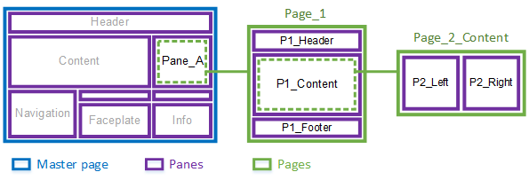            

In the example above, Pane_A on the master page is configured to display a page called "Page_1".

Page_1 includes its own sets of panes:

- P1_Header
- P1_Content
- P1_Footer.

The P1_Content pane is configured to display a page called "Page_2_Content", which in turn has two panes:

- P2_Left
- P2_Right.

When displaying content, you can address  nested panes using dot (.) notation. For example, you could use the  following to address the P2_Left pane:

Pane_A.P1_Content.P2_Left

 

To use nested panes, you need to perform the following tasks:

**Create a page that includes nested panes**

1. Open Graphics Builder.
2. [Create a page](file:///C:/Program Files (x86)/AVEVA Plant SCADA/Bin/Help/SCADA Help/Content/Create_a_Graphics_Page.html) using  the **Style** "situational_awareness" and the **Template** "blank".
3. Display the Page Properties.
4.  From the **File** menu, select **Properties**.

5. Or:

6. Right-click on the page and select **Properties**. 

7. On the **Environment** tab, **Add** a variable.
8. Enter the following values in the Edit Property dialog box:
9. **Property:** HasPanes

10. **Value:** 1

11. This setting  instructs the workspace to initialize the panes, display their default  content, and consider them when contextual updates occur. 

12.  On the **Appearance** tab, use the **View Area** settings to define a size for the page that is appropriate to the pane that will host it. 
13. **Note:** If you  need to create a large number of pages for a custom-sized pane, consider creating a page template that matches the pane's size. 

14. Configure the remaining properties for the page as required. 
15. Click **OK**. 
16. **Save** the page. 

You can then add panes to the page using the procedure described in [Create a Master Page for a Customized Workspace](file:///C:/Program Files (x86)/AVEVA Plant SCADA/Bin/Help/SCADA Help/Content/Situational_Awareness_Create_a_Master_Page_for_a_Customized_Workspace.htm). Use the page you have just created, and start at step 3. 

**Configure the pane that will host the page**

1. In Graphics Builder, open the page that will host the nested panes. 
2. Double click on the pane that will display the nested panes. The Pane Properties dialog will appear.
3. In the **Default Page** field, enter the name of the page you created.
4. Configure the remaining properties as required. 
5. Click **OK**. 
6. **Save** the page. 

**Enable autofilling**

To enable [autofillling](file:///C:/Program Files (x86)/AVEVA Plant SCADA/Bin/Help/SCADA Help/Content/Situational_Awareness_Autofilling.htm) in nested panes you use [Content Types](file:///C:/Program Files (x86)/AVEVA Plant SCADA/Bin/Help/SCADA Help/Content/Content_Types.htm). For example, you could use Pane_A in the diagram above to display a  report for a piece of equipment that is currently in context. To do  this, you would use the following settings:

- The pane **Pane_A** will have its Content Type property set to 'Report'.
- The page **Page_1** will have its Content Type set to 'Report'.
- The pane **P2_Left** will have its Content Type property set to 'Report_Text'.
- The pane **P2_Right** will have its Content Type property set to 'Report_Chart'.
- Pages that appear in **P2_Left** (for example, "Report_1"), will have their Content Type set to 'Report_Text'.
- Pages that appear in **P2_Right** (for example, "Chart_1"), will have their Content Type set to 'Report_Chart'.

If you then want to display a report for a piece of equipment, you need to enter the names of the  associated pages as a comma-separated list in the **Content** property for the equipment. In the example above, this would be "Page_1, Report_1, Chart_1". 

For more information, see the following:

- [Configure Panes on a Master Page](file:///C:/Program Files (x86)/AVEVA Plant SCADA/Bin/Help/SCADA Help/Content/Situational_Awareness_Configure_Panes_on_a_Master_Page.htm)                        
- [Configure Content Types](file:///C:/Program Files (x86)/AVEVA Plant SCADA/Bin/Help/SCADA Help/Content/Configure_Content_Types.htm)                        
- [Assign a Content Type to a Page](file:///C:/Program Files (x86)/AVEVA Plant SCADA/Bin/Help/SCADA Help/Content/Situational_Awareness_Assign_Content_Types_to_Pages.htm).

### Create a Pop-up Window with Panes

You can create a pop-up window that includes a set of panes. 

​                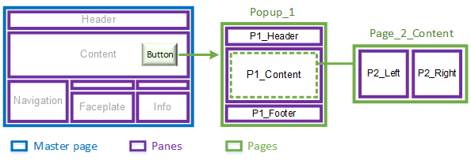            

In the example above, a button in the main content area launches a pop-up window called "Popup_1".

Popup_1 includes its own sets of panes:

- P1_Header
- P1_Content
- P1_Footer.

The P1_Content pane is configured to display a page called "Page_2_Content", which in turn has two nested panes:

- P2_Left
- P2_Right.

When displaying content, you can address  the panes in a pop-up window using the following dot (.) notation. For  example, you could use the following to address the P2_Left pane:

Popup_1.P1_Content.P2_Left

 

To launch a pop-up window, use the Cicode function [WinNewAt](file:///C:/Program Files (x86)/AVEVA Plant SCADA/Bin/Help/SCADA Help/Subsystems/CicodeReferenceCitectHTML/Content/WinNewAt.html). 

To create the required content for the window, perform the following tasks:

**Create a page that will display in the pop-up window**

1. Open Graphics Builder.
2. [Create a page](file:///C:/Program Files (x86)/AVEVA Plant SCADA/Bin/Help/SCADA Help/Content/Create_a_Graphics_Page.html) using  the**Style** "situational_awareness" and the **Template** "blank".
3. Display the Page Properties.
4.  From the **File** menu, select **Properties**.

5. Or:

6. Right-click on the page and select **Properties**. 

7.  On the **Appearance** tab, use the **View Area** settings to define a size for the page that is appropriate to the pop-up window that will host it. 
8. Configure the remaining properties for the page as required. 
9. Click **OK**. 
10. **Save** the page. 

If you want to include panes on the page, you will also need to perform the following steps. 

1. Display the Page Properties.
2. On the **Environment** tab, **Add** a variable.
3. Enter the following values in the Edit Property dialog box:
4. **Property:** HasPanes

5. **Value:** 1

6. This setting  instructs the workspace to initialize the panes, display their default  content, and consider them when contextual updates occur. 

7. Click **OK**. 
8. **Save** the page. 
9. You can then add panes to the page using the procedure described in [Create a Master Page for a Customized Workspace](file:///C:/Program Files (x86)/AVEVA Plant SCADA/Bin/Help/SCADA Help/Content/Situational_Awareness_Create_a_Master_Page_for_a_Customized_Workspace.htm). Use the page you have just created, and start at step 3. 

**Enable autofilling**

You can enable [autofillling](file:///C:/Program Files (x86)/AVEVA Plant SCADA/Bin/Help/SCADA Help/Content/Situational_Awareness_Autofilling.htm) in a pop-up window.  For example, you could use Popup_1 in the diagram  above to display a report for a piece of equipment that is currently in  context. To do this, you would use the following settings:

- The pane **P1_Content** will have its Content Type property set to 'Report'.
- The page **Page_2_Content** will have its Content Type set to 'Report'.
- The pane **P2_Left** will have its Content Type property set to 'Report_Text'.
- The pane **P2_Right** will have its Content Type property set to 'Report_Chart'.
- Pages that appear in **P2_Left** (for example, "Report_1"), will have their Content Type set to 'Report_Text'.
- Pages that appear in **P2_Right** (for example, "Chart_1"), will have their Content Type set to 'Report_Chart'.

If you then want to display a report for a piece of equipment, you need to enter the names of the  associated pages as a comma-separated list in the **Content** property for the equipment. In the example above, this would be "Page_2_Content, Report_1, Chart_1". 

For more information, see the following:

- [Configure Panes on a Master Page](file:///C:/Program Files (x86)/AVEVA Plant SCADA/Bin/Help/SCADA Help/Content/Situational_Awareness_Configure_Panes_on_a_Master_Page.htm)                        
- [Configure Content Types](file:///C:/Program Files (x86)/AVEVA Plant SCADA/Bin/Help/SCADA Help/Content/Configure_Content_Types.htm)                        
- [Assign a Content Type to a Page](file:///C:/Program Files (x86)/AVEVA Plant SCADA/Bin/Help/SCADA Help/Content/Situational_Awareness_Assign_Content_Types_to_Pages.htm).

### Use Navigational Genies on Content Pages

The SA_Include project contains a set of  navigational Genies that you can use to direct an operator through  a  production process that spans multiple graphics pages. The Genies  indicate the direction of a link, and include a label that describes the consecutive location. Clicking on the Genie at runtime will take you  directly to the linked page (except where a Static Link Genie has been  used). 

The following navigational Genies are included in the "sa_navigation" library:

**Link Left/Right**

The left and right navigational Genies can be used to link pages that are a part of a linear process. 

​                                            

The link is defined using the path to a menu item in the project’s Navigation menu. For example, "Plant1.Area1.MyPage". 

You can also indicate that a left/right Genie points to a location that is on a different "console". This means the target is part of a process that is not usually  monitored by the current client. For example, a link in a production  area of a plant may point to a destination in the warehouse. 

To indicate that it points to a different console, the Genie will appear with a gray background. 

​                                            

You can also use a  left/right Genie as a control link. This allows you to associate a piece of equipment with the Genie; the Genie will only appear when their  associated object is in context. 

 The navigational Genies will display a purple drop-shadow when configured as a control link. 

​                        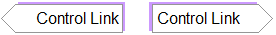                    

**Note:** Control Links can be enabled or disabled by selecting **Options** | **Show/Hide Control Links** on the Header Bar. 

[/AVEVA%20Plant%20SCADA/Bin/Help/SCADA%20Help/Skins/Default/Stylesheets/Images/transparent.gif)Link Up/Down**                            

[/AVEVA%20Plant%20SCADA/Bin/Help/SCADA%20Help/Skins/Default/Stylesheets/Images/transparent.gif)Static Links**                            

To add a navigational Genie to a page:

1. Open a page in Graphics Builder. 

2. Click the **Paste Genie** button in the objects toolbox.

3. ​                                    

4.  Or, select **Paste Genie** from the **Edit** menu. 

5. In the Paste Genie dialog, select the **Library** "sa_navigation".

6. Select one of the following from the **Genie** list and click **OK**. 

7. - link_d = link down 
   - link_l = link left
   - link_r = link right
   - link_u = link up
   - slink_l = static link left
   - slink_r = static link right.

8.  The Genie is pasted onto the  graphics page. A dialog will open, prompting you to configure the  properties of the Genie. For a description of the properties, see below.

9. Click **Save**. 

**Link Left & Link Right**

| Field                     | Description                                                  |
| ------------------------- | ------------------------------------------------------------ |
| Menu Item                 | The path to the linked item in the project's Menu Configuration. This is specified using the following notation:<Level1>.<Level2>.<Level3>.<Level4>.<Level5>.<Level6>For example, "Plant1.Area1.MyPage"The menu item needs to be included under the "Navigation" menu (defined in the **Page** field). As "Navigation" is assumed as the top level of the path, there  is no need to enter it at the start of the menu item path. |
| Tooltip                   | An optional description of the Genie that appears when the mouse points at it. |
| Use for 4K Page?          | Determines if the Genie will appear on a page that displays within a UHD4K workspace. TRUE = The Genie will appear in a UHD4K workspace.FALSE = The Genie will not appear in a UHD4K workspace. |
| Links to another console? | Allows you to  indicate that a Genie points to a destination on a different console,  which is a destination that is not usually monitored by the current  client. TRUE = The Genie points to a different console.FALSE = The Genie does not point to a different console.If set to TRUE, the Genie will display a gray background. |
| Use as Control Link?      | Determines if the Genie will function as a control link. TRUE = The Genie will use a control link.FALSE = The Genie will not use a control link. If set to TRUE, the Genie will display a purple drop-shadow. |
| Control Signal Equipment  | The piece of  equipment that is associated with the left/right Genie. The Genie will  only appear when their associated object is selected. |
| Controlled Equipment      | The piece of  equipment that the Control Link points to. When you click on the Genie,  the page associated with the piece of equipment will display. |

**Link Up & Link Down **

| Field            | Description                                                  |
| ---------------- | ------------------------------------------------------------ |
| Menu Item        | The path to the linked item in the project's Menu Configuration. This is specified using the following notation:<Level1>.<Level2>.<Level3>.<Level4>.<Level5>.<Level6>For example, "Plant1.Area1.MyPage"The menu item needs to be included under the "Navigation" menu (defined in the **Page** field). As "Navigation" is assumed as the top level of the path, there  is no need to enter it at the start of the menu item path. |
| Tooltip          | An optional description of the Genie that appears when the mouse points at it. |
| Use for 4K Page? | Determines if the Genie will appear on a page that displays within a UHD_4K workspace. TRUE = The Genie will appear in a UHD4K workspace.FALSE = The Genie will not appear in a UHD4K workspace. |

**Static Link Left & Static Link Right**

| Field                     | Description                                                  |
| ------------------------- | ------------------------------------------------------------ |
| Label                     | The label that will appear on the Genie.                     |
| Tooltip                   | An optional description of the Genie that appears when the mouse points at it. |
| Use for 4K Page?          | Determines if the Genie will appear on a page that displays within a UHD_4K workspace. TRUE = The Genie will appear in a UHD4K workspace.FALSE = The Genie will not appear in a UHD4K workspace. |
| Links to another console? | Allows you to  indicate that a Genie points to a destination on a different console,  which is a destination that is not usually monitored by the current  client. TRUE = The Genie points to a different console.FALSE = The Genie does not point to a different console.If set to TRUE, the Genie will display a gray background. |

### Apply a Color Theme to a Workspace

If you have created a project from the  Situational Awareness Starter Project, you can change the theme color  used for the workspace(s). This will change the color of the following  items:

- Header bar
- Navigation Zone buttons and tabs
- Information Zone buttons and tabs
- Display page buttons
- Selection rectangle.

There are five default color themes you can use:

- Blue (default) — blue header with blue selection/control highlighting
- Grey — grey header with green selection/control highlighting
- Green — green header with green selection/control highlighting
- Indigo — indigo header with indigo selection/control highlighting
- Orange — orange header with orange selection/control highlighting
- Dark —black header with green selection/control highlighting.

For the Grey and Dark themes, green is used for the selection rectangle, buttons and tabs. 

To apply a color theme to a project's workspaces:

1. In the **Standards** activity, select **Labels**. 

2. In the Grid Editor, locate the following label:

3. - **Label Name:** _THEME_Default

4. In the **Expression** field, specify the required theme color using one of the following labels:

5. - THEME_Blue
   - THEME_Grey
   - THEME_SEGreen
   - THEME_Dark
   - THEME_Indigo
   - THEME_Orange

6. Click **Save**. 

For a description of a workspace, see [Key Components of a Situational Awareness Project](file:///C:/Program Files (x86)/AVEVA Plant SCADA/Bin/Help/SCADA Help/Content/Situational_Awareness_Key_Components.htm).

#### Use a Scheduler Control in a Situational Awareness Project

When using a Scheduler control in your  Situational Awareness project, it is recommended you add a Scheduler  instance to your project's master pages outside of the page bounds to  avoid possible delays when loading Scheduler pages.

​                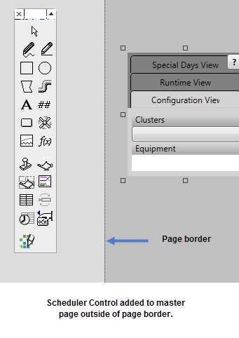            

To add a Scheduler instance to a master page, follow the steps outlined in [Add the Scheduler ActiveX Object to a Page](file:///C:/Program Files (x86)/AVEVA Plant SCADA/Bin/Help/SCADA Help/Content/Add_the_Scheduler_ActiveX_Object_to_a_Page.htm).

Once pasted on the master page, move and position the Scheduler control outside the page border.

#### Defining a Right Click Action on Equipment

In a Situational Awareness Project, you can define a right-click action/command for a piece of equipment using a  callback. This is achieved by specifying a custom function for the label "_CALLBACK_EquipmentRightClick".  

In a project created from the Situational  Awareness Starter Project, the default function specified for the label  is "DefaultEquipmentRightClickCallback". To change this:

1. Go to the **Standards** activity and select **Labels**. 

2. Locate the "_CALLBACK_EquipmentRightClick" label.

3. ​                    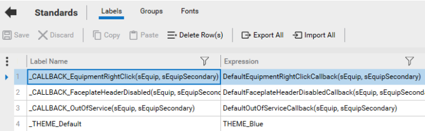                

4. In the **Expression** field, enter a custom function.

5. The function you create needs to take the following two arguments:

6. - sEquip - the current primary equipment context
   - sEquipSecondary - the current secondary equipment context.

7. **Save** your changes. 

If you do not define a label specifying a  custom function (or the default function), a callback error message will be generated when you compile your project. 