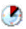

[Проект Situational Awareness](README.md)

## Макет за замовченням (Default Layout)

[Довідка](file:///C:/Program%20Files%20(x86)/AVEVA%20Plant%20SCADA/Bin/Help/SCADA%20Help/Content/Situational_Awareness_Default_Layout.htm)

Коли ви створюєте проект за допомогою проекту Situational Awareness Starter, робоча область за замовчуванням включатиме наступне розташування панелей.

Панель заголовку (Header Bar) містить набір команд, до яких оператору може знадобитися регулярний доступ під час виконання. Область вмісту сторінки (Page Content Area) відображає сторінки, які ви створюєте для представлення вашого заводу або виробничого об’єкта (див. [Створення сторінок вмісту](file:///C:/Program Files (x86)/AVEVA Plant SCADA/Bin/Help/SCADA Help/Content /Situational_Awareness_Create_Content_Pages.htm)).

У нижній частині інтерфейсу також з’являється панель керування оператора. Вона включає в себе такі розділи:

- Active Alarms Zone
- Navigation Zone
- Faceplate Zone
- Information Zone

Набір [Сторінок сигналізації за замовчуванням](file:///C:/Program Files (x86)/AVEVA Plant SCADA/Bin/Help/SCADA Help/Content/Situational_Awareness_Default_AlarmPages.htm) також можна запустити через панель заголовка.

Головна сторінка, яка є основою для такого розташування панелей, доступна в двох розмірах екрана:

- HD1080 (1920 x 1080, 16:9)
- UHD4K (3840 x2160, 16:9)

**Примітка.** Active Alarms Zone недоступна у версії робочого простору HD1080. Замість цього проект HD1080 містить кнопку **Top 5 Alarms** на [Панель заголовка](file:///C:/Program Files (x86)/AVEVA Plant SCADA/Bin/Help/SCADA Help/Content/Situational_Awareness_Headerbar .htm).

У проекті, створеному з початкового проекту, макет за замовчуванням застосовується лише до профілю одного екрана для основного монітора. Якщо ви хочете створити профіль екрана для клієнта відображення з кількома моніторами, перегляньте розділ [Налаштування профілю екрана для кількох моніторів](file:///C:/Program Files (x86)/AVEVA Plant SCADA/Bin/Help /SCADA Help/Content/Situational_Awareness_Set_Up_A_Screen_Profile_for_MultiMonitor.htm).

### Панель заголовку (Header Bar)

Макет за замовчуванням для проекту Situational Awareness містить панель заголовка. Він включає в себе набір команд, до яких оператор може вимагати регулярного доступу під час виконання. Ці команди можна налаштувати.

| Icons                                              | Common tools      | Description                                                  |
| -------------------------------------------------- | ----------------- | ------------------------------------------------------------ |
|                    | Header Logo       | За замовчуванням використовується логотип Plant SCADA. Однак це можна налаштувати. Щоб відобразити свій власний логотип у виділеному просторі, імпортуйте логотип у Graphics Builder і збережіть його як символ у своєму проекті. Присвоїти ім’я символу (у форматі «library.symbol») параметру INI проекту [Page]Logo. Див. [Customize the Logo on the Header Bar](file:///C:/Program Files (x86)/AVEVA Plant SCADA/Bin/Help/SCADA Help/Content/Situational_Awareness_Customizing_Headerbar.htm). |
|               | Home              | Відображає домашню сторінку. Домашня сторінка вказується в меню навігації проекту. Найвищий запис 1-го рівня меню встановлює контекст для робочої області, поле Target  Page для запису визначає домашню сторінку. Див [Prepare the Navigation Menu](file:///C:/Program Files (x86)/AVEVA Plant SCADA/Bin/Help/SCADA Help/Content/Situational_Awareness_Prepare_Navigation_Menus.htm). |
|               | Page Navigation   | Команди навігації сторінкою «Назад», «Вперед» і «Вгору». Назад і вперед дозволяють переміщатися між сторінками в поточній історії перегляду або стеку. Up дозволяє переміщатися на рівень вгору в наборі ієрархічних сторінок. У системах з багатьма моніторами стек складається з кожного монітора і не пов’язаний. Коли відбувається вихід із системи, стек видаляється. |
|             | Trends            | Відкриває сторінку trend summary для робочої області, дозволяючи отримати доступ до попередньо визначених трендів (Див [Default Trends Page](file:///C:/Program Files (x86)/AVEVA Plant SCADA/Bin/Help/SCADA Help/Content/Situational_Awareness_Default_TrendPages.htm)). |
|      | Active Alarms     | Відображає тривоги, які не підтверджені або підтверджені і все ще перебувають у стані тривоги (Див [Default Alarm Pages](file:///C:/Program Files (x86)/AVEVA Plant SCADA/Bin/Help/SCADA Help/Content/Situational_Awareness_Default_AlarmPages.htm)). |
|  | Historical Alarms | Відображає історичний журнал тривог (Див [Default Alarm Pages](file:///C:/Program Files (x86)/AVEVA Plant SCADA/Bin/Help/SCADA Help/Content/Situational_Awareness_Default_AlarmPages.htm)). |
|     | Shelved Alarms    | Перелік тривог, які тимчасово вимкнено (Див [Default Alarm Pages](file:///C:/Program Files (x86)/AVEVA Plant SCADA/Bin/Help/SCADA Help/Content/Situational_Awareness_Default_AlarmPages.htm)). |
|    | Hardware Alarm    | Відображає список апаратних тривог, які не підтверджені або підтверджені і все ще знаходяться в стані тривоги   (Див [Default Alarm Pages](file:///C:/Program Files (x86)/AVEVA Plant SCADA/Bin/Help/SCADA Help/Content/Situational_Awareness_Default_AlarmPages.htm)). Миготливе коло під значком апаратної сигналізації вказує на наявність непідтверджених апаратних тривог.          |
|        | Top 5 Alarms      | Відображає 5 верхніх активних тривог, видимих для оператора. Ця кнопка не включена в панель заголовка для робочого простору UHD4K. |
|   | Page Name         | Назва сторінки вибрано в зоні навігації та відображається в області вмісту сторінки. Якщо сторінки немає в меню навігації, з’явиться повідомлення «Сторінка не існує в меню навігації». Під заголовком сторінки відображається ланцюжок меню. |
|              | User              | Ім'я користувача, який увійшов у систему. Наприклад, Джон Сміт є поточним користувачем, який увійшов у систему. |
|              | Login             | Дозволяє користувачеві входити в систему під час виконання, надаючи доступ до додаткових функцій на основі групи або груп користувачів, до яких вони належать. Розкривне меню надає доступ до команди Вийти. |
|            | Options           | Дозволяє перемикати видимість деяких параметрів відображення для об’єктів у системі виконання. Виберіть відповідну опцію зі спадного списку.   Show or hide Control Links (Див [Add a Control Link](file:///C:/Program Files (x86)/AVEVA Plant SCADA/Bin/Help/SCADA Help/Content/Situational_Awareness_Add_a_Control_Link.htm)).          Show or hide engineering/PV values.         Show or hide labels. |
|               | Help              | Відкриває панель, яка відображає довідку під час виконання.  |
|               | Date/Time         | Поточна дата та час.                                         |
|           | Shutdown          | Вимикає систему виконання.                                   |

#### Налаштування команд меню (Menu Commands)

Щоб налаштувати команду меню:

1. У дії **Visualization** виберіть **Menu Configuration**.
2. У стовпці **Page** знайдіть пункти меню, які використовують назву "Headerbar".
3. Виберіть елемент, який потрібно налаштувати. Стовпець **Level 1** має містити опис команд панелі заголовків.
4. Перейдіть до поля **Menu Command**.
5. Введіть функцію Cicode або виберіть її зі спадного списку.
6. За потреби змініть параметри.
7. Натисніть **Save**.

**Примітка.** Якщо ви хочете змінити вміст панелі заголовка, вам слід створити копію сторінки панелі заголовка (наприклад, "DefaultHeaderbar_HD1080" або "DefaultHeaderbar_UHD4K") і змінити її. Потім ви можете призначити оновлену сторінку як **Default Page** на панелі заголовка сторінки-шаблона.

### Зона активних тривог (Active Alarms Zone)

Зона активних тривог під час виконання відображає список тривог для системи.

**Примітка.** Зона активних тривог з'являється на інформаційній панелі оператора, лише якщо робоча область заснована на головній сторінці 4K («Master_PageMenu1_UHD4K»). Для проекту HD1080 ви можете переглядати активні тривоги за допомогою кнопки **Top 5 Alarms** на панелі заголовка або на сторінці Alarm.

За замовчуванням тривоги відсортовані відповідно до налаштування порядку найвищого пріоритету для сервера сигналізації в Plant SCADA Studio. У межах кожного пріоритету вони перераховані в такому порядку:

- Unacknowledged і active
- Unacknowledged і inactive
- Acknowledged і active
- Disabled або Shelved

У цих групах тривоги відображаються відповідно до часу їх виникнення.

Якщо ваш проект заснований на проекті Situational Awareness Starter Project, стовпці за замовчуванням, представлені для кожного рядка в списку тривог, будуть включати:

- Date – дату, коли тривога стала активною
- Time – час, коли тривога стала активною 
- Name – імя тегу тривоги
- Description – опис тривоги
- State – плинний стан тривоги

**Примітка.** Розташування стовпців у списку тривог за замовчуванням базується на форматі відображення під назвою «TopActiveAlarms_UHD4K». Ви можете налаштувати цей формат у своєму проекті за допомогою перегляду **Parameters** в дії **Setup**.

Кожна тривога також має піктограму, яка вказує на серйозність і стан тривоги. Зовнішній вигляд значка означає наступне:

**Колір і форма**

Колір і форма значка трвоги вказують на її пріоритет. Якщо ваш проект заснований на проекті Situational Awareness Starter Project, наступні значки за замовчуванням будуть використовуватися для вказівки пріоритету:

​            

Якщо ці піктограми були налаштовані, їхній вигляд буде визначатися властивостями дисплея, визначеними для кожного пріоритету тривоги (див [Configure Display Properties for an Alarm Priority](file:///C:/Program Files (x86)/AVEVA Plant SCADA/Bin/Help/SCADA Help/Content/Configure_Display_Properties_for_an_Alarm_Prioirty.htm)). 

**Мигаюча іконка**

Якщо значок тривоги блимає, це означає, що тривога не підтверджена.

**Прозора іконка**

Якщо колір блимаючого значка з’являється наполовину, це означає, що сигнал тривоги знявся, але залишається непідтвердженим. Значок залишиться прозорим і продовжуватиме блимати, доки тривога не буде підтверджено або повторно активований.

Ви можете використовувати Active Alarms Zone для виконання таких дій під час виконання:

- навігація по асоційованим обєктам: щоб включити об’єкт, пов’язаний із нагадуванням, у контекст, клацніть його правою кнопкою миші та виберіть **Навігація** у меню, що з’явиться.

- підтвердження тривог - щоб підтвердити тривогу, клацніть його правою кнопкою миші та виберіть **Підтвердити** у меню, що з’явиться.

### Зона Faceplate

Якщо з об’єктом на сторінці відображення пов’язана лицьова панель, вона відображатиметься в цьому розділі інформаційної панелі, коли об’єкт буде вибрано.

Область, яку займає секція передньої панелі, складається з двох панелей.

#### Панель заголовку (Header pane)

​            

Панель заголовка містить три частини:

- **Display name** — якщо для вибраного обладнання налаштовано відображуване ім'я, воно відображатиметься тут. Кластерний контекст також включений.

Якщо для об'єкта не налаштовано `Display name`, з'явиться скорочений шлях до обладнання для об'єкта. За потреби шлях обладнання може бути відображений як підказка.

- **Коментар** — якщо коментар налаштовано для вибраного обладнання, він відображатиметься тут.

- **Кнопка Out Of Service (OOS)** — дозволяє вивести вибране обладнання з експлуатації, наприклад, для обслуговування або ремонту.

Поки обладнання не працює, його сигнали тривоги придушуються.

Кнопка OOS має три робочі стани:

- Якщо кнопка світло-сіра, це означає, що обладнання в даний момент працює і не може бути виведене з експлуатації. Вам потрібно буде зупинити пристрій, перш ніж ви зможете використовувати кнопку OOS.
- Якщо кнопка активна, це означає, що ви можете використовувати кнопку, щоб вивести обладнання з експлуатації.
- Якщо кнопка темно-сіра, це означає, що частина обладнання в даний момент не працює.

#### Панель Faceplate

Панель faceplate веде себе наступним чином:

- Якщо з вибраним об’єктом пов’язана лицьова панель (Faceplate), вона відображатиметься тут.
- Якщо для вибраного об’єкта не пов’язана лицьова панель, на панелі з’явиться повідомлення «Лицева панель недоступна».
- Якщо жоден об’єкт не вибрано, на цій панелі відобразиться «Об’єкт не виділено».

### Інформаційна зона (Information Zone)

Інформаційна зона з’являється на Operator Dashboard. Вона включає в себе набір вкладок, які представляють різні типи інформації про об’єкт, який зараз знаходиться в контексті. Ці вкладки включають:

#### Alarms

На вкладці Alarms відображаються тривоги, пов’язані з об’єктом, який зараз знаходиться в контексті. Тривоги відсортовані в порядку важливості, а тривоги з найвищим пріоритетом відображаються у верхній частині списку. Коли тривога зникає, вона видаляється зі списку.

​            

Якщо ваш проект заснований на проекті Situational Awareness Starter Project, стовпці за замовчуванням, представлені для кожного рядка в списку тривог, будуть включати:

- Час – час активації тривоги.
- Item – пов’язаний елемент обладнання.
- Tag Name – назва тегу тривоги.

**Примітка.** Розташування стовпців за замовчуванням базується на форматі відображення, визначеному в системному проекті SA_Include. Формат матиме назву «InfoAlarm_HD1080» або «InfoAlarm_UHD4K», залежно від роздільної здатності основної сторінки робочої області. Ви можете налаштувати цей формат, змінивши [`[Format]FormatName`](file:///C:/Program Files (x86)/AVEVA Plant SCADA/Bin/Help/SCADA Help/Subsystems/ParametersCitectHTML/Content/FormatFormatName.html) у перегляді **Parameters** дії **Setup** (див. [Параметри бази даних проекту](file:///C:/Program Files (x86)/AVEVA Plant SCADA/Bin/Help/SCADA Help/Content /Project_Database_Parameters.htm)).

Кожна тривога також має піктограму, яка вказує на серйозність і стан тривоги. Якщо ваш проект заснований на проекті Situational Awareness Starter Project, наступні значки за замовчуванням будуть використовуватися для вказівки пріоритету:

​            

Якщо ці піктограми були налаштовані, їх вигляд буде визначатися властивостями відображення, визначеними для кожного пріоритету тривоги (див. [Налаштування властивостей відображення для пріоритету нагадування](file:///C:/Program Files (x86)/AVEVA Plant SCADA /Bin/Help/SCADA Help/Content/Configure_Display_Properties_for_an_Alarm_Prioirty.htm)).

Якщо значок тривоги блимає, це означає, що тривогу не підтверджено. Якщо колір блимаючого значка з’являється наполовину, це означає, що сигнал тривоги знявся, але залишається непідтвердженим. Значок залишиться прозорим і продовжуватиме блимати, доки сигнал не буде підтверджено або повторно активований.

Ви можете використовувати меню правою кнопкою миші в списку тривог, щоб виконати такі дії під час виконання:

- Квитування (**Acknowledge**) тривоги

- Блокування тривог. Виберіть один із наступних варіантів:
  - **Shelve for ...** — перемикає вигляд на форму відкладених тривог, що дозволяє вимкнути тривоги на певний період часу або на невизначений термін 
  - **Shelve until ...** — перемикає вигляд на форму відкладених тривог, що дозволяє вимкнути тривоги до вказаної дати й часу

- Повернення до активної (**Restore**) тривоги

Панель під списком тривог показує налаштовану користувачем інформацію про [причину та відповідь](file:///C:/Program Files (x86)/AVEVA Plant SCADA/Bin/Help/SCADA Help/Content/Provide_Cause_and_Response_Information_to_Operators.htm) для вибраний тривоги. З тривожним сигналом може бути пов’язано до восьми наборів інформації про причини та реакції; Кнопки зі стрілками праворуч від панелі дозволяють оператору переміщатися між запропонованими відповідями. Щоб додати інформацію про причини та відповіді на сигнали тривоги, див. [Додати інформацію про причину та відповідь до тривог](file:///C:/Program Files (x86)/AVEVA Plant SCADA/Bin/Help/SCADA Help/Content/Add_Cause_and_Response_Information_for_Alarms.htm ).

**Примітка.** Якщо об’єкт з активним [індикатором тривоги](file:///C:/Program Files (x86)/AVEVA Plant SCADA/Bin/Help/SCADA Help/Content/Alarm_Indicator.htm) не відображає жодні тривоги в інформаційній зоні, при виборі під час виконання, це може означати, що індикатор тривоги був налаштований так, щоб реагувати на «дочірні» рівні вниз по ієрархії обладнання або посилання на обладнання. Ці непрямі розташування обладнання не повідомляються в зоні інформації про тривоги для вибраного обладнання. Якщо сталася така ситуація, скористайтеся лічильником тривоги вищого рівня або сторінкою нагадування, щоб означити розташування активної тривоги.

#### Trends

На вкладці Trend  відображається графічне представлення даних, пов’язаних з об’єктом, який зараз знаходиться в контексті. Це представлено за допомогою компактної версії Process Analyst від Plant SCADA.

​                

У поданні діаграми за допомогою набору пірїв із кольоровим кодуванням і перерахованими праворуч від діаграми відображаються дані для вибраного об’єкта. Кожне перо малює значення в залежності від часу. За замовчуванням у поданні відображатимуться перші п’ять трендів в алфавітному порядку за назвою тегу.

Пера можна налаштувати одним із наступних способів:

- Для кожного елемента обладнання, який відображатиметься на діаграмі: додайте [Equipment Runtime Parameter](file:///C:/Program Files (x86)/AVEVA Plant SCADA/Bin/Help/SCADA Help/Content/Manually_Define_Equipment_Runtime_Param.htm ) під назвою «InfoZoneTrends» для кожного обладнання, яке відображатиметься на діаграмі.
- Як глобальний параметр за замовчуванням: налаштуйте параметр INI [`[Workspace]InfoZoneTrends`](file:///C:/Program Files (x86)/AVEVA Plant SCADA/Bin/Help/SCADA Help/Subsystems/ParametersCitectHTML/Content/WorkspaceInfoZoneTrends .htm), щоб відобразити необхідні [елементи обладнання](file:///C:/Program Files (x86)/AVEVA Plant SCADA/Bin/Help/SCADA Help/Content/Items.htm).
- За певним [Типом обладнання](file:///C:/Program Files (x86)/AVEVA Plant SCADA/Bin/Help/SCADA Help/Content/Equipment_Types.htm): налаштуйте параметр INI [`[Workspace]InfoZoneTrends`](file:///C:/Program Files (x86)/AVEVA Plant SCADA/Bin/Help/SCADA Help/Subsystems/ParametersCitectHTML/Content/WorkspaceInfoZoneTrendsType.htm), де `<Type>` відповідає імені типу в Equip перегляд. Наприклад, «InfoZoneTrends.Drive». Значенням параметрів є список назв елементів обладнання, розділений комами.

Наступні команди відображення доступні на панелі навігації, яка проходить у нижній частині перегляду діаграми.

| Tool                             | Description                                 |
| -------------------------------- | ------------------------------------------- |
|      | [Span Picker](javascript:void(0))           |
|    | [Synchronize to Now](javascript:void(0))    |
|  | [Toggle Autoscrolling](javascript:void(0))  |
|         | [End Date/Time Picker ](javascript:void(0)) |

Ви також можете використовувати такі командні кнопки:

| Tool                                                         | Description                                 |
| ------------------------------------------------------------ | ------------------------------------------- |
|   | [Edit Vertical Scale](javascript:void(0))   |
|  | [Toggle Cursor](javascript:void(0))         |
|  | [Display in Trend Page](javascript:void(0)) |

#### Взаємне блокування (Interlocks)

Взаємне блокування (Interlocks) — це фізичне з’єднання між двома частинами обладнання, яке пов’язує їх роботу, так що подія в одній частині обладнання ініціює дію в іншому (див. [Блокування](file:///C:/Program%20Files%20(x86)/AVEVA%20Plant%20SCADA/Bin/Help/SCADA%20Help/Default.htm#Situational_Awareness_Interlocks.htm)).

Вкладка **Interlocks** містить відомості про будь-які активні блокування, які можуть бути пов’язані з вибраним у даний момент обладнанням. Він містить додатковий набір вкладок, які відображають категорії, що використовуються для означення природи блокування. Проект Situational Awareness Starter пропонує такі категорії за замовчуванням.

- Safety — умови, що призводять до припинення роботи обладнання.
- Process — умови, через які обладнання в процесі зупиняється.
- Permissive — умови, які зупиняють запущене обладнання.

Якщо всередині категорії є активні блокування, на вкладці пов’язаної категорії відображається символ замка.

​                

Блокування перелічено на кожній вкладці від найстарішої (спершу запущена) до останньої. Список містить наступний набір стовпців за замовчуванням.

| Column  | Description                                                  |
| ------- | ------------------------------------------------------------ |
| State   | Якщо блокування активне, відображається чорний значок замка.     Якщо блокування знято, відображається біле поле.    |
| Bypass  | Блокування можна налаштувати для підтримки обходу (bypass). Це означає, що оператор може вручну скасувати блокування, змусивши запустити заблокований процес. Див. [Налаштування обходу для блокування](file:///C:/Program Files (x86)/AVEVA Plant SCADA/Bin/Help/SCADA Help/Content/Situational_Awareness_Configure_a_Bypass_for_an_Interlock.htm).  Якщо блокування можна обійти. (але наразі це не обходить), відображається сірий значок замка.  Для обходу блокування - Якщо блокування в даний момент обходиться, відображається фіолетовий значок замка  Для відключення байпасу - Якщо блокування не налаштовано на підтримку обходу, у стовпці не відображається жодна піктограма . |
| Comment | Опис блокування. Опис отримано з поля **Коментар** для пов’язаного посилання на обладнання. |

**Примітка.** Розташування стовпців за замовчуванням базується на форматі відображення, визначеному в системному проекті SA_Include. Формат буде називатися "Interlock_HD1080" або "Interlock_UHD4K", залежно від роздільної здатності основної сторінки робочої області. Ви можете налаштувати цей формат, змінивши [`[Format]FormatName`](file:///C:/Program Files (x86)/AVEVA Plant SCADA/Bin/Help/SCADA Help/Subsystems/ParametersCitectHTML/Content/FormatFormatName.html) у перегляді **Параметри** дії **Налаштування** (див. [Параметри бази даних проекту](file:///C:/Program Files (x86)/AVEVA Plant SCADA/Bin/Help/SCADA Help/Content /Project_Database_Parameters.htm)).

Щоб перейти безпосередньо на сторінку, на якій розміщено блокування, клацніть правою кнопкою миші блокування та виберіть **Навігація**.

### Навігаційна зона (Navigation Zone)

Зона навігації на інформаційній панелі оператора виконує дві цілі:

- Навігація сторінкою — вкладки та кнопки можна використовувати для перемикання між різними сторінками відображення.
- Кількість тривог — кожна вкладка та кнопка відображають кількість тривог для місця, яке воно відкриває, забезпечуючи огляд поточних умов тривоги.

**Примітка.** Щоб увімкнути лічильник тривог в зоні навігації, існує ряд налаштувань проекту, які потрібно правильно налаштувати. Додаткову інформацію див. у розділі [Увімкнути підрахунок сигналів навігаційної зони](file:///C:/Program Files (x86)/AVEVA Plant SCADA/Bin/Help/SCADA Help/Content/Situational_Awareness_Enable_Navigation_Zone_Alarm_Counts.htm).

#### Навігація по сторінкам (Page Navigation)

Розташування вкладок і кнопок визначається через меню сторінок проекту.

Рівень 1 меню встановлює загальний контекст для робочої області. Вкладки вздовж заголовка розділу навігації представляють пункти меню 2 рівня. Кнопки на кожній вкладці представляють до 20 пунктів меню нижнього рівня, які відображаються зліва направо в порядку, визначеному властивістю Order.

#### Лічильники тривог (Alarm Counts)

Кожна вкладка та кнопка в навігаційній зоні підтримують лічильник тивог, який вказує, скільки наразі активних тривог для обладнання, розміщеного на відповідній сторінці.

​            

За замовчуванням лічильник тривог відображає наступне:

1. Кількість активних тривог з найвищим пріоритетом (тобто пріоритетом з найменшим значенням)
2. Кількість активних тривог у наступному найвищому пріоритеті
3. Кількість активних тривог у третьому за пріоритетом
4. Кількість тривог, які зараз відтерміновані.

**Примітка.** Якщо потрібно, ви можете використовувати параметр [`[Workspace]NumberOfTopPriorities`](file:///C:/Program Files (x86)/AVEVA Plant SCADA/Bin/Help/SCADA Help/Subsystems/ ParametersCitectHTML/Content/WorkspaceNumberOfTopPriorities.html), щоб відобразити додаткову кількість тивог для четвертого пріоритету. Додаткову інформацію див. у розділі [Додати додаткову кількість тривог до зони навігації](file:///C:/Program Files (x86)/AVEVA Plant SCADA/Bin/Help/SCADA Help/Content/Situational_Awareness_Add_an_Additional_Alarm_Count.htm).

Максимальне значення, яке можна відобразити для кожного лічильника тривог становить 99. Якщо в певній категорії активних більше 99 тривог, відобразиться «99+». Ви можете підтвердити точну кількість тривог за допомогою підказки.

Кожне значення з’являється ліворуч від анімованої піктограми, яка вказує на пріоритет, який представляє значення. Ці піктограми налаштовуються за допомогою властивості **Small Genie Name** для кожного пріоритету тривоги. Для отримання додаткової інформації див. [Налаштування властивостей відображення для пріоритету тривоги](file:///C:/Program Files (x86)/AVEVA Plant SCADA/Bin/Help/SCADA Help/Content/Configure_Display_Properties_for_an_Alarm_Prioirty.htm).

Сіра смуга використовується для виділення вкладки та кнопки, які містять останній непідтверджений сигнал тривоги, який наразі перебуває у стані ON. Також буде виділено число поруч із найважливішим пріоритетом.

Додаткову інформацію про те, як підготувати меню проекту для зони навігації інформаційної панелі оператора, див. у розділі  [Prepare the Navigation Menu](file:///C:/Program Files (x86)/AVEVA Plant SCADA/Bin/Help/SCADA Help/Content/Situational_Awareness_Prepare_Navigation_Menus.htm)

### Сторінки тривог за замовченням 

Проект, створений за допомогою проекту Situational Awareness Starter Project, включатиме набір сторінок тривог за замовчуванням, які доступні з середовища виконання [Панель заголовка](file:///C:/Program Files (x86)/AVEVA Plant SCADA/Bin/Help/ SCADA Help/Content/Situational_Awareness_Headerbar.htm). Виберіть одну з кнопок, описаних у таблиці нижче, щоб відобразити сторінку нагадування в області вмісту сторінки (див. [Макет за замовчуванням](file:///C:/Program Files (x86)/AVEVA Plant SCADA/Bin/Help/SCADA Help/Content/Situational_Awareness_Default_Layout.htm)).

|                                                |                   |                                                              |
| ---------------------------------------------- | ----------------- | ------------------------------------------------------------ |
|  | Active Alarms     | Тривоги, які не підтверджені або підтверджені і все ще знаходяться в стані тривоги. |
|  | Historical Events | Історичний журнал тривог і дій оператора.                    |
|  | Shelved Alarms    | Тривоги, які тимчасово відтерміновані/заблоковані.           |
|  | Hardware Alarms   | Апаратні тривоги, які або не підтверджені, або підтверджені і все ще знаходяться в стані тривоги. |

Окрім сторінки «Апаратні тривоги» (яка включає лише основний список тривог), ці сторінки мають загальний макет, який містить такі розділи:

#### Список тривог (Alarms List)

Зміст списку тривог визначається наступним:

- Фільтри, які зараз увімкнено (див. [Фільтри](file:///C:/Program Files (x86)/AVEVA Plant SCADA/Bin/Help/SCADA Help/Content/Situational_Awareness_Default_AlarmPages.htm?tocpath=Situational Awareness Projects| Макет за замовчуванням|_____6#Фільтри)).
- Будь-який поточний вибір у перегляді дерева. Список буде включати лише тривоги, пов’язані з вибраними елементами (див. [Перегляд дерева](file:///C:/Program Files (x86)/AVEVA Plant SCADA/Bin/Help/SCADA Help/Content/Situational_Awareness_Default_AlarmPages.htm?tocpath =Проекти ситуаційної поінформованості|Макет за замовчуванням|_____6#TreeView)) і будь-яке вибране обладнання, на яке посилаються (див. [Референс устаткування](file:///C:/Program Files (x86)/AVEVA Plant SCADA/Bin/Help/SCADA Help/ Content/Situational_Awareness_Default_AlarmPages.htm?tocpath=Проекти ситуаційної поінформованості|Макет за замовчуванням|_____6#Довідка)).

Розташування стовпців за замовчуванням визначається типом сторінки нагадування, яка відображається, і форматом за замовчуванням, визначеним для неї [`[Format]FormatName`](file:///C:/Program Files (x86)/AVEVA Plant SCADA Параметр /Bin/Help/SCADA Help/Subsystems/ParametersCitectHTML/Content/FormatFormatName.html). Ви можете змінити порядок стовпців, якщо потрібно.

#### Перегляд дерева (Tree View)

Перегляд дерева надає ієрархічний вигляд ієрархії обладнання проекту. Ви можете використовувати його для фільтрації відображеного списку нагадувань.

​            

Кожен елемент у перегляді дерева містить:

- Прапорці дозволяють вибрати один або кілька елементів у дереві.
- Лічильник тривог вказує кількість пов'язаних тивог у трьох головних пріоритетах тривог, а також кількість відтермінованих тривог.

Список тривог буде відфільтровано, щоб відобразити тривоги, пов’язані з вибраними елементами.

**Примітка.** Ви можете використовувати параметр [`[Workspace]NumberOfTopPriorities`](file:///C:/Program Files (x86)/AVEVA Plant SCADA/Bin/Help/SCADA Help/Subsystems/ParametersCitectHTML/Content/ WorkspaceNumberOfTopPriorities.html), щоб відобразити кількість тривог для чотирьох найбільших пріоритетів тривоги (замість трьох перших). Для отримання додаткової інформації про налаштування див. [Налаштування властивостей дисплея для четвертого пріоритету тривоги](file:///C:/Program Files (x86)/AVEVA Plant SCADA/Bin/Help/SCADA Help/Content/Situational_Awareness_Configure_a Fourth_Alarm_Priority.ht). Щоб налаштувати перегляд дерева, див. [Додати дерево на сторінку](file:///C:/Program Files (x86)/AVEVA Plant SCADA/Bin/Help/SCADA Help/Content/Situational_Awareness_Add_a_Treeview_to_a_Page.htm).

#### Фільтри (Filters)

Цей розділ сторінки тривог дозволяє фільтрувати список тривог за пріоритетом, станом і підтвердженням. Опис **Поточний фільтр** вказує, чи активні якісь фільтри для списку тривог.

**Примітка.** Ви можете додати свої власні кнопки фільтрів на сторінку тривог, використовуючи набір наданих Genie. Див. [Додати кнопку фільтра сигналізації](file:///C:/Program Files (x86)/AVEVA Plant SCADA/Bin/Help/SCADA Help/Content/Situational_Awareness_Add_an_Alarm_Filter_Button.htm).

**Фільтри за пріоритетами (Priority Filters)**    

Кнопки пріоритету тривог дозволяють відфільтрувати тривоги, які входять до трьох основних пріоритетів тривог. За замовчуванням вибрано три кнопки (як позначено кольоровим фоном).

​            

Якщо вимкнути кнопку, тривоги, яким призначено пріоритет тривоги, буде видалено зі списку. Поточний опис фільтра вказуватиме, що тривоги P1, P2 або P3 більше не відображаються.

​            

На сторінці Історичні події також є кнопка, за допомогою якої можна відфільтрувати тривоги.

​            

Ви можете додати четвертий за величиною фільтр пріоритету тривоги до сторінок тривог. Див. [Додати фільтр пріоритету четвертого нагадування до сторінок нагадування](file:///C:/Program Files (x86)/AVEVA Plant SCADA/Bin/Help/SCADA Help/Content/Situational_Awareness_Add_a_Fourth_Alarm_Filter_Button.ht).

Фільтри за станами (**State Filters**)    

Кнопка фільтра за станами дозволяє відфільтрувати тривоги, які знаходяться в певному стані.

​            

**Примітка.** Ця кнопка недоступна на сторінці Shelved Alarms.

При натисканні на кнопку з’являється контрольний список станів тривоги.

​            

Виберіть стани тривог, які ви хочете включити до списку тривог. Поточний опис фільтра вказуватиме, чи не вибрано будь-який стан.

​            

**Фільтр за квитуванням (Acknowledgment Filters)**    

На сторінці історичних подій також є кнопка, яка дозволяє фільтрувати нагадування **Підтверджено** і **Непідтверджено**.

​            

За замовчуванням вибрано обидві кнопки (як позначено кольоровим фоном). Якщо вимкнути кнопку, пов’язані нагадування буде видалено зі списку.

#### Інформація про причину і реакцію(Cause & Response Information)

У цьому розділі сторінки нагадувань відображається інформація про причину та реакцію для вибраної тривоги (see [Provide Cause and Response Information to Operators](file:///C:/Program Files (x86)/AVEVA Plant SCADA/Bin/Help/SCADA Help/Content/Provide_Cause_and_Response_Information_to_Operators.htm)). 

​            

Представлена інформація включає:

- Cause — опис причини тривоги.
- Response — опис відповідної реакції на тривогу.
- Response Time — проміжок часу, протягом якого необхідно діяти на вказану відповідь.
- Consequence — опис ймовірного результату, якщо запропонована відповідь не буде виконана протягом зазначеного часу відповіді.

Якщо для тривоги налаштовано кілька наборів властивостей причини та реагування, ви можете використовувати кнопки зі стрілками у верхньому правому куті, щоб прокрутити їх.

#### Referenced Equipment

У цьому розділі відображаються будь-які [посилання на обладнання](file:///C:/Program Files (x86)/AVEVA Plant SCADA/Bin/Help/SCADA Help/Content/Equipment_References.htm), які пов’язані з обладнанням, яке наразі вибрано у перегляді дерева.

​            

У заголовку **Referenced Equipment** вказується частина обладнання, яке вибрано в даний момент. У списку нижче відображається будь-яке обладнання, для якого було налаштовано посилання на пов’язане обладнання.

Ви можете використовувати прапорець на початку кожного рядка, щоб додати посилання на обладнання до поточного фільтра для основного списку тривог. Ви також можете використовувати кнопку **Очистити все**/**Вибрати все**, щоб перемкнути вибір усіх посилань на обладнання у списку.

Якщо прапорець має сірий фон, це означає, що частина обладнання вже вибрано в перегляді дерева. Якщо ви виберете **Очистити все**, коли частина обладнання знаходиться в цьому стані, буде скасовано вибір цього обладнання як у списку посилання на обладнання, так і в перегляді дерева.

### Сторінки трендів за замовченням (Default Trend Pages)

Проект, створений за допомогою проекту Situational Awareness Starter Project, включатиме сторінку трендів за замовчуванням, доступну за допомогою [Header Bar](file:///C:/Program Files (x86)/AVEVA Plant SCADA/Bin/Help/SCADA Help/Content/Situational_Awareness_Headerbar.htm). Натисніть на значок нижче, щоб відобразити сторінку тенденцій в області вмісту сторінки (see [Default Layout](file:///C:/Program Files (x86)/AVEVA Plant SCADA/Bin/Help/SCADA Help/Content/Situational_Awareness_Default_Layout.htm)). 

Сторінка трендів за замовчуванням дозволяє аналізувати конкретні трнеди та сигнали тривоги для обладнання. Макет сторінки трендів за замовчуванням містить такі розділи:

Поведінки, які ви спостерігатимете під час навігації між сторінками, включають:

- Перехід до іншої сторінки в робочій області не вплине на сторінку трендів. Ваші пера, поточний вибраний об’єкт у дереві об’єктів та будь-який текст, введений у вікно пошуку, будуть збережені.
- Перехід на іншу сторінку та вибір іншого обладнання, а потім повернення на сторінку трнедів очистить запис у полі пошуку, а також вибере обладнання в дереві обладнання.
- Перехід на іншу сторінку та вибір іншого обладнання та очищення цього вибору перед переходом на сторінку трендів збереже вашу конфігурацію на сторінці трендів.

**Note**:  Ви можете запустити сторінку тренду з інших сторінок за допомогою кнопок на вкладці «Тренди» інформаційної зони. Це запустить сторінку тренду з трендрм для об’єкта, вибраного на цій сторінці.

#### Перегляд дерева (Tree View)

Перегляд дерева надає ієрархічний вигляд ієрархії обладнання проекту.

​            

У перегляді дерева відображається:

- Галочки для об'єктів, які мають активний тренд.
- Сірі галочки для об'єктів, дочірні об'єкти яких мають активний тренд.
- Лічильник тривог, який вказує кількість пов’язаних тривог у трьох головних пріоритетах нагадування, а також кількість тривожних сигналів, відкладених на полиці.
- Кнопки для розширення (+) і згортання (-) дерева.
- Поле пошуку, яке можна використовувати для фільтрації відображеного списку об'єктів.

#### Trendable Items

У розділі Trendable Items перелічено елементи, пов’язані з кожною частиною обладнання, які ви можете додати до діаграми трендів.

​            

Наступні значки вказують на «тип» елемента (тега):

|                                          |                          |
| ---------------------------------------- | ------------------------ |
|  | Trend items              |
|  | Alarm items              |
|  | Instant items (variable) |

Для кожного застосовного типу відображається прапорець. Установіть необхідні прапорці, щоб додати їх до діаграми. Можна додати до 16 трендів. Коли ліміт досягнуто, прапорці приховані.

#### Trend Chart

Відображає діаграму трендів на основі вибраного обладнання та опцій.

#### Головна панель (Main Toolbar)

Головна панель інструментів розташована над діаграмою. Він містить команди, які дозволяють виконувати загальні операції, наприклад, зберігати та відкривати подання, друкувати звіти тощо. У таблиці нижче описані кнопки, які включені на головну панель інструментів.

|                          Item                           | Description                                                  |
| :-----------------------------------------------------: | :----------------------------------------------------------- |
|           | **Load View**. Loads a saved view from file. For details, see [Loading a view](file:///C:/Program Files (x86)/AVEVA Plant SCADA/Bin/Help/SCADA Help/Content/Loading_a_view.html). |
|           | **Save View**. Stores a view to file. For details, see [Saving a view](file:///C:/Program Files (x86)/AVEVA Plant SCADA/Bin/Help/SCADA Help/Content/Saving_a_view.html). |
|              | **Print**. Displays the standard Windows Print dialog box for printing trend reports. For details, see [Printing and Exporting](file:///C:/Program Files (x86)/AVEVA Plant SCADA/Bin/Help/SCADA Help/Content/Printing_and_Exporting.html). |
|               | **Copy to Clipboard**. Copies visible pens to the Windows Clipboard. For details, see [Copying data to the Clipboard](file:///C:/Program Files (x86)/AVEVA Plant SCADA/Bin/Help/SCADA Help/Content/Copying_data_to_the_Clipboard.html). |
|         | **Copy to File**. Exports visible pens to an Excel-compatible file. For details, see [Copying data to file](file:///C:/Program Files (x86)/AVEVA Plant SCADA/Bin/Help/SCADA Help/Content/Copying_data_to_file.html). |
|             | **Add Pen**. Displays the Add New Pen(s) dialog box for adding a pen. For details, see [Adding Pens](file:///C:/Program Files (x86)/AVEVA Plant SCADA/Bin/Help/SCADA Help/Content/Adding_Pens.html). **Note**: Pens added with this button will not be synchronized with the equipment tree and trendable items list. |
|          | **Remove Pen**. Deletes the currently selected pen from the trend display. For details, see [Deleting Pens](file:///C:/Program Files (x86)/AVEVA Plant SCADA/Bin/Help/SCADA Help/Content/Deleting_Pens.html). |
|      | **Remove All Pens**. Deletes the currently displayed pens from the trend display. |
|      | **Lock/Unlock Pens**. Toggles the locking of pens. For details, see [Locking/Unlocking Pens](file:///C:/Program Files (x86)/AVEVA Plant SCADA/Bin/Help/SCADA Help/Content/LockingUnlocking_Pens.html). |
|           | **Show/Hide Points**. Toggles the display of points representing where sample data was recorded in the archive. For details, see [Pens](file:///C:/Program Files (x86)/AVEVA Plant SCADA/Bin/Help/SCADA Help/Content/Pens.htm). |
|           | **Show/Hide Cursors**. Toggles the display of cursors. For details, see [Using Cursors](file:///C:/Program Files (x86)/AVEVA Plant SCADA/Bin/Help/SCADA Help/Content/Using_Cursors.html). |
|         | **Show/Hide Cursor Labels**. Toggles the display of cursor labels. For details, see [Using Cursor Labels](file:///C:/Program Files (x86)/AVEVA Plant SCADA/Bin/Help/SCADA Help/Content/Using_Cursor_Labels.html). |
|  | **Find in Model**. Locates the equipment for the currently selected pen in the equipment tree. |

#### Navigation Toolbar

Панель інструментів навігації містить команди, які дозволяють переміщатися вперед або назад по тренду, а також інші пов’язані з навігацією завдання.

​            

**Вибір часу початку** розташований зліва на панелі інструментів навігації, **Вибір часу завершення** — праворуч. Ви можете використовувати їх для означення часу початку та закінчення. Якщо елемент керування вибору часу використовує літній час, годинник ліворуч від елемента керування матиме затінений сегмент.

​            

**Вибір інтервалу** містить часто використовувані попередньо визначені проміжки часу, які можна вибрати зі спадного меню. Проміжок часу відображення тренду представляє різницю між часом початку та часом завершення. Вибір інтервалу часу регулює час початку та залишає час завершення без змін. Щоб встановити проміжок часу, який не входить до списку попередньо визначених часів, див. [Встановити нестандартний часовий проміжок](file:///C:/Program Files (x86)/AVEVA Plant SCADA/Bin/Help/SCADA Help/ Content/Edit_Span.html). Див. [Також заблокувати часовий проміжок](file:///C:/Program Files (x86)/AVEVA Plant SCADA/Bin/Help/SCADA Help/Content/Span_Lock.html).

#### Object View

Перегляд об’єктів відображає список об’єктів (обладнання), що відображаються на діаграмі трендів, разом із властивостями пера, такими як назва, колір, масштаб тощо. Відображаються такі властивості:

| Column            | Description                                                  |
| :---------------- | :----------------------------------------------------------- |
| Scale             | Початкове та кінцеве положення пера по вертикальній осі.     |
| Engineering Units | Інженерні одиниці, пов'язані з пером.                        |
| Comment           | Коментар тренду/тривоги, визначений для пера.                |
| Alarm Name        | Назва пов'язаного тега тривоги                               |
| Cluster           | Ім'я кластера, в якому означено об'єкт.                      |
| Error             | Показує помилку останнього запиту даних. Порожнє, якщо останній запит даних був успішним |

[--> Тривоги](alarms.md)