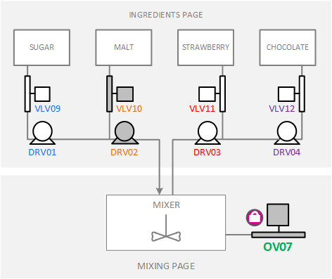
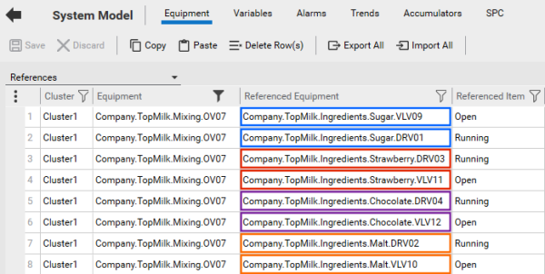
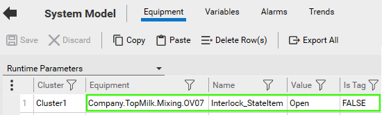
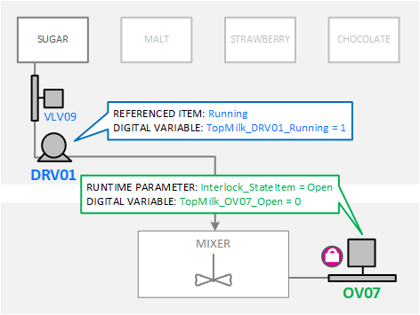
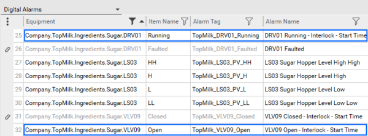
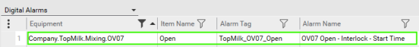
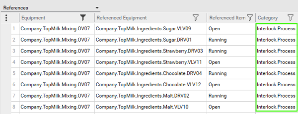
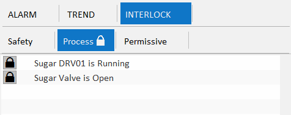

[Проект Situational Awareness](README.md)

## Interlocks

[Довідка](file:///C:/Program%20Files%20(x86)/AVEVA%20Plant%20SCADA/Bin/Help/SCADA%20Help/Content/Situational_Awareness_Interlocks.htm)

У виробничому середовищі блокування — це фізичне з’єднання між двома частинами обладнання, яке пов’язує їх роботу, так що подія в одній частині обладнання ініціює дію в іншому. Як правило, за допомогою логіки PLC, блокування вбудовуються у виробничу систему для підтримки безпеки, захисту обладнання та мінімізації виробничих витрат.

Plant SCADA дозволяє вам представляти блокування, які існують у вашій системі в рамках проекту Ситуаційної обізнаності. Діяльність, пов’язана з блокуванням, може бути представлена оператору під час виконання в [Information Zone](file:///C:/Program Files (x86)/AVEVA Plant SCADA/Bin/Help/SCADA Help/Content/Situational_Awareness_Information_Zone .htm).

Наприклад, сторінка «Mixing» в проекті ExampleSA містить змішувач, який отримує інгредієнти з чотирьох запасних резервуарів на сторінці «Ingredients».

​                            

Змішувальний бак має випускний клапан (OV07). Щоб забезпечити, щоб цей клапан не був відкритий під час доставки інгредієнтів до змішувача, існують блокування між OV07 і клапанами та насосами, які подають чотири інгредієнти для змішування.

Цей приклад буде використано, щоб продемонструвати роль кожного з наступних компонентів під час налаштування блокувань у проекті Situational Awareness.

#### Equipment References

[Equipment References](file:///C:/Program Files (x86)/AVEVA Plant SCADA/Bin/Help/SCADA Help/Content/Equipment_References.htm) використовуються для представлення блокувань у проекті Situational Awareness, оскільки вони дозволяють ви побудуєте взаємовідносини в моделі обладнання, які відображають зв’язки, створені блокуваннями, які існують у цій галузі.

Для підтримки наведеного вище прикладу в проекті ExampleSA налаштовано наступні посилання на обладнання.

/AVEVA Plant SCADA/Bin/Help/SCADA Help/Content/images/Situational_Awareness_Interlocks_EquipRefs.png)                    

Властивість **Referenced Item** визначає елемент обладнання, який ініціює стан блокування. Наприклад, DRV01 ініціює блокування, коли цифрова змінна, пов’язана з її елементом "Running", дорівнює 1 (TopMilk_DRV01_Running = 1).

Властивість **Comment** можна використовувати, щоб надати опис події, яка спричинила блокування, наприклад "Sugar DRV01 is Running".

#### "Interlock_StateItem" Runtime Parameter

Коли відбувається спрацьовування, це спричиняє зміну «state item» у зблокованому пристрої. За замовчуванням пунктом стану для частини обладнання є «Running». Якщо це не той елемент, який повинен реагувати на блокування, ви можете використовувати параметр часу виконання "Interlock_StateItem", щоб вказати інший елемент стану для частини обладнання.

Наприклад, OV07 не має елемента «Running», оскільки це клапан. Interlock_StateItem використовується, щоб вказати «Open» як правильний елемент.

​                                            

Це забезпечує поведінку блокування, показану на наступній схемі.

​                                            

**Примітка.** Поле **IsTag** для параметра часу виконання за замовчуванням має значення TRUE, якщо значення не вказано. Якщо ви не введете FALSE, блокування працюватимуть неправильно.

#### Alarms

Тривоги використовуються для генерування подій, необхідних для відстеження активності, пов’язаної з блокуваннями. Вони означують, скільки часу було активне блокування або коли воно була активна востаннє.

У проекті ExampleSA були налаштовані наступні цифрові сигнали тривоги для двох частин обладнання, які постачають цукор у змішувальну ємність (DRV01 і VLV09).

/AVEVA Plant SCADA/Bin/Help/SCADA Help/Content/images/Situational_Awareness_Interlocks_Alarms.png)                    

Ці сигнали тривоги контролюють елементи, налаштовані на запуск блокування, забезпечуючи запис часу початку та закінчення.

Подібним чином настроєні сигнали тривоги для шести інших частин відповідного обладнання, щоб відстежувати елементи, які запускають блокування.

Наступна сигналізація також була налаштована для контролю пункту «Відкрито» для випускного клапана OV07.

/AVEVA Plant SCADA/Bin/Help/SCADA Help/Content/images/Situational_Awareness_Interlocks_Alarms2.png)                    

**Примітка.** Ці сигнали тривоги мають бути приховані від оператора під час виконання. Цього можна досягти, використовуючи категорію тривоги, для якої **ShowOnActive** і **ShowOnSummary** встановлено значення FALSE.

#### Interlock Categories

- **Safety** — conditions that cause equipment to stop running. 
- **Process** — conditions that cause equipment within a process to stop running.
- **Permissive** — conditions that stop equipment from starting. 

Кожне посилання на обладнання також можна призначити до **Категорії**. У випадку блокування категорія використовується для визначення природи блокування. Проект Situational Awareness Starter пропонує такі категорії за замовчуванням.

- **Safety** — умови, через які обладнання зупиняється.
- **Process** — умови, через які обладнання в процесі зупиняється.
- **Permissive** — умови, які зупиняють запуск обладнання.

Safety and Process  подібні тим, що обидва типи припиняють дію, коли спрацьовує блокування. Permissive блокування дещо відрізняються, оскільки вони зупиняють дію або процес, коли запускається блокування. Умови блокування Process and Permissive можуть перетинатися.

У проекті ExampleSA **Category**, зазначена для кожного з посилань на обладнання, пов'язаного з вихідним клапаном OV07, є "Interlock.Process".

/AVEVA Plant SCADA/Bin/Help/SCADA Help/Content/images/Situational_Awareness_Interlocks_Categories.png)                    

Коли ви переглядаєте блокування під час виконання, ці категорії представлені як набір вкладок у [інформаційній зоні](file:///C:/Program Files (x86)/AVEVA Plant SCADA/Bin/Help/SCADA Help/Content /Situational_Awareness_Information_Zone.htm). Якщо для вибраного обладнання наразі активна блокування, біля відповідної вкладки категорії відображається символ замка.

На основі вказаної категорії всі блокування, пов’язані з OV07, з’являться на вкладці «Process».

​                                            

Блокування перелічено на кожній вкладці від найстарішої (спершу запущена) до останньої.

Блокування можна налаштувати для підтримки обходу. Це означає, що оператор може вручну скасувати блокування, змусивши заблокований процес бути доступним (див. [Налаштування обходу для блокування](file:///C:/Program Files (x86)/AVEVA Plant SCADA/Bin/ Help/SCADA Help/Content/Situational_Awareness_Configure_a_Bypass_for_an_Interlock.htm)). Якщо ввімкнено, оператор може обійти блокування в  [Information Zone](file:///C:/Program Files (x86)/AVEVA Plant SCADA/Bin/Help/SCADA Help/Content/Situational_Awareness_Information_Zone.htm).