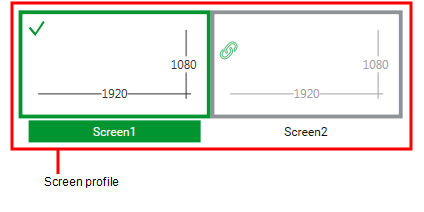
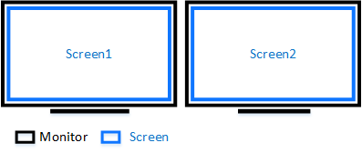
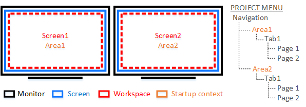
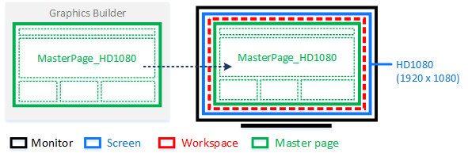
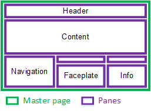

[Проект Situational Awareness](README.md)

## Ключові компоненти проекту Situational Awareness

[Довідка](file:///C:/Program%20Files%20(x86)/AVEVA%20Plant%20SCADA/Bin/Help/SCADA%20Help/Content/Situational_Awareness_Key_Components.htm)

Проект, створений із Situational Awareness Starter Project, використовує архітектуру Workspace, щоб середовище виконання реагувало на зміни контексту. Ця тема містить вступ до ключових компонентів цієї архітектури.

### Профіль екрана (Screen Profile)

Профіль екрана означує розташування екранів, які використовуються клієнтом дисплея Plant SCADA з кількома моніторами. Ви можете створити профіль екрана в дії Setup в Plant SCADA Studio  (see [Screen Profiles](file:///C:/Program Files (x86)/AVEVA Plant SCADA/Bin/Help/SCADA Help/Content/Screen_Profiles.htm)). 

​                                            

Потім ви можете застосувати профіль екрана до клієнтського дисплея за допомогою сторінки « Screen Setup» Computer Setup Wizard.

​                                            

### Робоча область (Workspace)

Workspace (Робоча область) — це механізм, який керує змінами контекстного вмісту на кожному екрані. Він забезпечує контекстну навігацію та, за бажанням, забезпечує індивідуальний досвід оператора, що відповідає ситуаційній обізнаності.

Для кожної робочої області встановлюється  Startup context (Контекст запуску), що зв’язує кожен екран із записом рівня 1 (Level 1) у меню проекту під назвою «Navigation». Це є відправною точкою для будь-якої контекстної навігації, яка відбувається в робочій області.

​                                            

На сторінці **Screen Setup** Computer Setup Wizard контекст запуску встановлюється для кожного екрана.

Щоб отримати інформацію про те, як налаштувати відповідне меню навігації, див. [Prepare the Navigation Menu](file:///C:/Program Files (x86)/AVEVA Plant SCADA/Bin/Help/SCADA Help/Content/Situational_Awareness_Prepare_Navigation_Menus.htm)

### Головна сторінка (Master Page)

Головна сторінка (master page) надає макет вмісту, яким керує робоча область. Він відрізняється від інших графічних сторінок, оскільки складається з набору панелей, кожна з яких розміщує окремі сторінки під час виконання (див. «Panes» нижче).

​                                            

Розмір сторінки-шаблона має відповідати роздільній здатності екрана, на якому вона відображатиметься. Головні сторінки, які надаються разом із Plant SCADA, мають дві роздільної здатності:

- HD1080 - 16:9 (1920 x 1080)
- UHD4K - 16:9 (3840 x 2160)

Щоб указати головну сторінку, яка відображатиметься на екрані під час запуску, скористайтеся сторінкою **Screen Setup** майстра налаштування комп’ютера.

Щоб створити власну головну сторінку, див. [Створення головної сторінки для налаштованого робочого простору](file:///C:/Program Files (x86)/AVEVA Plant SCADA/Bin/Help/SCADA Help/Content/Situational_Awareness_Create_a_Master_Page_for_a_Customized_htWor) .

### Пенелі (Panes)

Панелі (Panes) — це розділи на головній сторінці, які утворюють основу для вмісту, що з’являється під час виконання. Кожна панель містить сторінку, яку можна динамічно оновлювати.

​                                            

Властивості, пов’язані з панеллю, дозволяють вказати, як вона веде себе, коли контекст клієнта змінюється, тип вмісту, який він може відображати, і як сторінка заповнює простір на панелі (див. [Налаштування панелей на головній сторінці](file:///C:/Program Files (x86)/AVEVA Plant SCADA/Bin/Help/SCADA Help/Content/Situational_Awareness_Configure_Panes_on_a_Master_Page.htm)).

Якщо ваш проект базується на проекті Plant SCADA Situational Awareness Starter Project, макет панелей за замовчуванням доступний на вхідних головних сторінках (див. [Макет за замовчуванням](file:///C:/Program Files (x86)/AVEVA Plant SCADA/ Bin/Help/SCADA Help/Content/Situational_Awareness_Default_Layout.htm)).

Існує два способи ініціювати оновлення в цій архітектурі:

- Команди — зазвичай використовуються на панелі заголовка або навігаційному меню для відображення сторінки.
- Контекстні оновлення — вміст панелі може оновлюватися, коли частина обладнання потрапляє в контекст.

Контекстні оновлення вмикаються, пов’язуючи «Content Types» з обладнанням та сторінками в проекті. Це дозволяє панелі автоматично оновлюватися, коли обладнання певного типу потрапляє в контекст. Див. [Автозаповнення](file:///C:/Program Files (x86)/AVEVA Plant SCADA/Bin/Help/SCADA Help/Content/Situational_Awareness_Autofilling.htm).

[--> Автозаповнення](Autofill.md)
