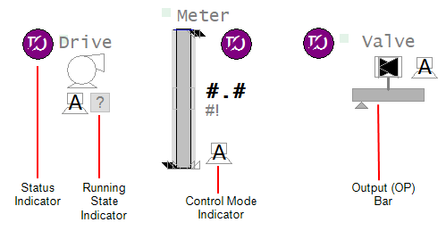

[Проект Situational Awareness](README.md)

## Бібліотеки (Libraries)

[Довідка](file:///C:/Program%20Files%20(x86)/AVEVA%20Plant%20SCADA/Bin/Help/SCADA%20Help/Content/Situational_Awareness_Libraries.htm)

Проект, створений за допомогою Situational Awareness Starter Project, міститиме `SA_Library` як включений проект. SA_Library надає великий набір об’єктів, які можна використовувати для додавання вмісту до графічних сторінок і панелей. Ці об’єкти застосовують узгоджений вигляд і відчуття до широкого спектру звичайних елементів керування інтерфейсом користувача.

Об’єкти включають Genies, які представляють фізичні частини обладнання (наприклад, приводи, лічильники та клапани), а також набір загальних елементів бібліотеки, які їх підтримують (наприклад, індикатори стану, індикатори робочого стану, індикатори режиму керування та вихідні панелі).

​                            

Повний список бібліотек, включених до проекту SA_Library, див. у [Situational Awareness Library Project](salib/readme.md)  у розділі System Projects Reference.

### Композитні джини (Composite Genies)

Унікальність бібліотеки ситуаційної поінформованості полягає в тому, що багато об’єктів бібліотеки можна створити за допомогою [Composite Genie](file:///C:/Program Files (x86)/AVEVA Plant SCADA/Bin/Help/SCADA Help/Content/ Composite_Genies.htm). Composite Genie — це файл XML, який означує набір Genies, параметрів, параметрів і правил відображення макета, щоб визначити, що відображатиметься на сторінці. Це ґрунтується на вибраних користувачами параметрах презентації. Колекція компонентів може бути налаштована як єдиний об’єкт, що значно зменшує розмір і складність ваших бібліотек.

Щоб використовувати Composite Genie, просто відкрийте шаблон XML, який найкраще підходить до обладнання, яке ви хочете представити на сторінці. В ідеалі, шаблон XML повинен відповідати типу обладнання, яке було використано для створення екземпляра обладнання, яке представлятиме Composite Genie. Це рекомендовано, оскільки компоненти Composite Genie призначені для зв’язування з конкретними елементами обладнання, які неможливо змінити.

Це легко, якщо ви створили свої екземпляри обладнання, використовуючи типи обладнання за замовчуванням, надані в проекті Situational Awareness Starter Project.

#### Приклад 

Насос PMP02 з проекту ExampleSA створений за допомогою Composite Genie "Drive.xml", що означає, що він прив'язується до наступних елементів обладнання (рис.).

​                                            

Елементи обладнання «Running», «CtrlMode» і «OP» пов’язані зі змінними тегами, які посилаються на пристрій вводу-виводу.

​                                            

Ці теги змінних були згенеровані [Equipment Editor](file:///C:/Program Files (x86)/AVEVA Plant SCADA/Bin/Help/SCADA Help/Content/The_Equipment_Editor.htm), оскільки PMP02 був заснований на "Drive" Тип обладнання, і для кожного з цих трьох елементів визначено змінний елемент тега.

Наприклад, елемент OP мав змінний елемент тегу, який вказував такий синтаксис **Tag Name**:

```
{equipment.TAGPREFIX}_OP
```

​                                            

У випадку екземпляра обладнання для PMP02, префікс тегу був встановлений на `TopMilk_PMP02_`, в результаті чого з'явився тег з назвою `TopMilk_PMP02_OP`.

Якщо ви генеруєте свої змінні теги таким чином, використовуючи типи обладнання, надані в проекті Situational Awareness Starter Project, прив’язки елементів, необхідні для кожного об’єкта бібліотеки, повинні стати на місце, коли ви використовуєте відповідний Composite Genie. Див. [Додати обладнання за допомогою редактора обладнання](file:///C:/Program Files (x86)/AVEVA Plant SCADA/Bin/Help/SCADA Help/Content/Situational_Awareness_Add_Equipment_Using_Equipment_Editor.htm).

Ви можете змінити назви змінних, визначені в типі обладнання, якщо хочете зберегти власну конвенцію про іменування тегів. Однак вам все одно потрібно поєднати свої змінні з відповідними елементами обладнання.

Щоб визначити необхідні прив’язки для об’єкта бібліотеки та його лицьової панелі за замовчуванням, знайдіть об’єкт у [Situational Awareness System Projects](file:///C:/Program Files (x86)/AVEVA Plant SCADA/Bin/Help/SCADA Help/Content/Situational_Awareness_System_Projects.htm) розділ довідки. В описі кожного бібліотечного об’єкта перелічено Equipment.Items, які він очікує.

Розділ [Situational Awareness Library Project](salib/readme.md)

[--> Блокування](interlocks.md)