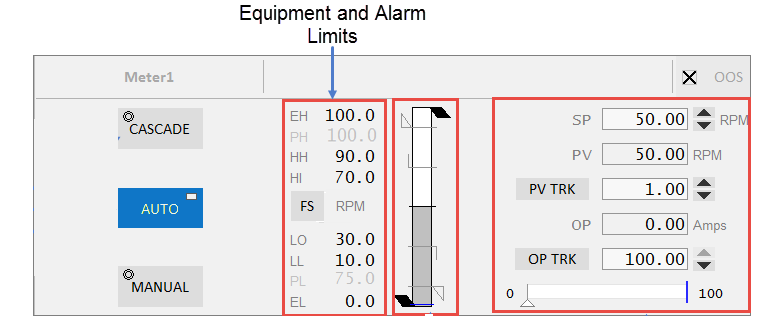
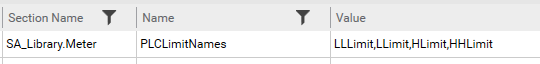
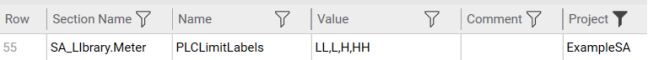
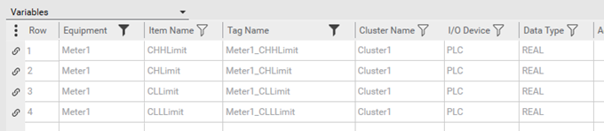
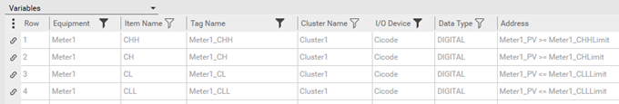

[Проект Situational Awareness](../README.md) -> [Situational Awareness Library](readme.md)

#### Alarm Limits

[Help](file:///C:/Program%20Files%20(x86)/AVEVA%20Plant%20SCADA/Bin/Help/SCADA%20Help/Content/SA_Alarm_Limits.htm)

Межі тривоги вказують, коли змінна процесу спричинить тривогу в системі. Підтримка Situational Awareness в Plant SCADA дозволяє візуалізувати ці межі за допомогою об’єкта бібліотеки Meter Composite Genie та пов’язаних з ним лицевих панелей.

Meter Composite Genie та передні панелі, які відображають лічильники, підтримують:

- Межі тегів аналогової тривоги (одна аналогова тривога, що означує всі межі) і
- Межі тривоги на основі тегів ПЛК (окремі теги вводу/виводу для означення кожної межі).

Межі тривоги на основі тегів особливо корисні, якщо ви хочете динамічно керувати межами та/або якщо ви хочете вказати іншу категорію для кожної межі.                            

**Примітка**: може бути означено до 14 меж, але об’єкт Meter підтримує відображення лише 4 меж. Однак, наприклад, ви можете побудувати власний об’єкт вимірювача з 6 обмеженнями.

За замовчуванням все аналогове обладнання та ваш проект налаштовані на використання обмежень аналогової тривоги. У більшості ситуацій вимірювач буде відображати елемент ".PV" для вашого обладнання. Об’єкти вимірювача автоматично отримають ваші значення HighHigh, High, Low і LowLow з відповідного аналогового PV тега тривоги.

Під час використання проектів на основі ситуаційної обізнаності цю поведінку можна змінити такими способами:

1. Використовуйте analog alarm limits для всього обладнання
2. Використовуйте analog alarm limits для більшості обладнання та PLC-based alarm limits для окремого обладнання
3. Використовуйте PLC-based alarm limits для всього обладнання
4. Використовуйте PLC-based alarm limits для більшості обладнання та analog alarm limits для окремого обладнання.

Вибране за замовчуванням буде залежати від:

- Кількість аналогового обладнання у вашій системі, яке використовуватиме той чи інший метод
- Важливість меж у вашій системі. Обмеження аналогової тривоги в Plant SCADA мають одну категорію. Якщо вам потрібна інша категорія для HH, а не LL, слід використовувати межі тривоги на основі ПЛК.

##### Configure PLC Limits with Equipment

Налаштування та використання меж з PLC:

**1. Виберіть режим за замовчуванням для меж (теги ПЛК або аналогові ліміти тривог)**

Щоб використовувати обмеження ПЛК для всіх вимірювачів, встановіть параметр INI  [`[Workspace.Meter]UseDefaultPLCLimits=TRUE`](file:///C:/Program Files (x86)/AVEVA Plant SCADA/Bin/Help/SCADA Help/Subsystems/ParametersCitectHTML/Content/SA_Library_Meter_UseDefaultPLCLimits.htm).

Щоб змінити поведінку цього параметра для конкретного обладнання, [додайте параметр часу виконання обладнання](file:///C:/Program Files (x86)/AVEVA Plant SCADA/Bin/Help/SCADA Help/Content/Manually_Define_Equipment_Runtime_Param.htm). Для отримання додаткової інформації див. Крок 5 нижче.

**2. Означте назви елементів обладнання, які ліміти вимірювачів використовуватимуть як джерело **[`[SA_Library.Meter]PLCLimitNames`](file:///C:/Program Files (x86)/AVEVA Plant SCADA/Bin/Help/SCADA Help/Subsystems/ParametersCitectHTML/Content/SA_Library_Meter_PLCLimitNames.htm).

Коли використовуються обмеження PLC, вам потрібно налаштувати набір користувальницьких назв елементів обладнання, що представляють кожне з обмежень. У вікні **Setup** , **Parameters** додайте теги (назви елементів) у вигляді списку, розділеного комами, як показано нижче.

​                                            

Об’єкти бібліотеки вимірювачів потім шукатимуть елементи з цими назвами на вашому обладнанні.

Оскільки ці елементи повинні існувати поряд з іншими елементами вашого обладнання (наприклад, PV), рекомендується використовувати ідентифікатор, який дає зрозуміти, що вони є лімітними елементами (наприклад, Limit).

**Примітка**: може бути означено до 14 меж, але об’єкт Meter підтримує відображення лише 4 меж. Однак, наприклад, ви можете побудувати власний об’єкт вимірювача з 6 обмеженнями.

**3. Означте аналогові граничні мітки для відображення на передніх панелях**

Налаштуйте мітки лімітів для кожного з ваших лімітів (наприклад, HH). Мітки обмежень визначаються на глобальному рівні як список, розділений комами за допомогою параметра  [`[SA_Library.Meter]PLCLimitLabels`](file:///C:/Program Files (x86)/AVEVA Plant SCADA/Bin/Help/SCADA Help/Subsystems/ParametersCitectHTML/Content/SA_Library_Meter_PLCLimitLabel.htm).

​                                                    

**Примітка**: обмеження мають бути перераховані в тому ж порядку, що й назви елементів, а кількість визначених елементів має бути такою ж.

**4. Означення Analog Limits за замовченням**

Означте стандартні межі тривог ПЛК для використання для аналогового обладнання. Вони визначаються на глобальному рівні як список, розділений комами за допомогою параметра  [`[SA_Library.Meter]DefaultPLCLimits`](file:///C:/Program Files (x86)/AVEVA Plant SCADA/Bin/Help/SCADA Help/Subsystems/ParametersCitectHTML/Content/SA_Library_Meter_DefaultPLCLimits.htm).

Як правило, ви призначаєте 0 = LL, 1 = L, 2 = H і 3 = HH. Це відповідає порядку, в якому вказані мітки обмежень. Якщо ви хочете визначити лише H і HH за замовчуванням, ви б встановили **Значення** на -1, -1, 2, 3.

**Примітка**: -1 у стовпці **Value** означає «ігнорувати» перші обмеження за замовчуванням.

**5. Configure the "PLCLimits" equipment runtime parameter**

Коли обмеження тривоги повинні відрізнятися для певного обладнання, параметр часу виконання обладнання **PLCLimits** можна налаштувати, щоб замінити значення за замовчуванням.

Наприклад, якщо потрібні тільки H та HH, то це можна налаштувати за допомогою параметрів часу роботи обладнання, як показано нижче.                                            

Щоб налаштувати це:

1. У Plant SCADA Studio перейдіть до активності **System Model** та виберіть **Equipment**. Виберіть **Runtime Parameters** зі спадного меню.
2. Для кожного обладнання, яке має змінити обмеження за замовчуванням, у властивості **Name** введіть PLCLimits.
3. У властивості **Value** вкажіть свій список обмежень ПЛК за замовчуванням, розділених комами, тобто порядок, у якому потрібно використовувати визначені межі сигналізації ПЛК. Використовуйте значення -1, щоб пропустити непотрібні обмеження.

**Примітка**: встановлення властивості **Value** на  `*` змінює значення параметра UseDefaultPLCLimits. Тому, якщо для параметра UseDefaultPLCLimits встановлено значення TRUE, він буде повернений і застосований так, як якщо б для нього було встановлено значення FALSE. У цьому випадку будуть застосовуватися обмеження аналогової тривоги. Якщо UseDefaultPLCLimits має значення FALSE, встановлення значення параметра часу виконання на `*` призведе до того, що пов’язане обладнання використовуватиме обмеження ПЛК за замовчуванням, визначені на рівні проекту.

1. Встановіть для властивості **Is Tag** значення FALSE, щоб мітки ПЛК відображалися на передніх панелях лічильника.
2. Натисніть **Save**.

**6. Згенеруйте елементи змінного тега для кожного граничного елемента на вашому аналоговому обладнанні**

Усе аналогове обладнання, яке буде відображатися як вимірювачі, потім потрібно буде налаштувати на включення змінних елементів для цих меж. Ваш код PLC може потім встановити значення за замовчуванням для цих обмежень, або це можна зробити за допомогою Cicode.

​                                            

**7. Згенеруйте змінні теги, що представляють стан PV для кожного обмеження**

Після встановлення обмежень створіть дискретну змінну, щоб відобразити, коли PV-сигнал перевищує межу.

Для змінної це може бути керовано з самого PLC, або ви можете використовувати [розрахунковий вираз](file:///C:/Program Files (x86)/AVEVA Plant SCADA/Bin/Help/SCADA Help/ Content/Calculated_Variables.htm), який працюватиме на сервері вводу-виводу, як показано нижче:

​                                            

**8. Створення дискретних тегів тривог.**

Дискретні тривоги можуть бути створені для кожного граничного елемента, що дасть вам детальний контроль пріоритету тривоги (категорії). Кожна тривожна сигналізація повинна бути прив’язана до відповідного цифрового тега стану, визначеного в Крок 7.