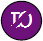

#### Common Object Elements

The objects within the Situational Awareness library share a set of properties and behaviors that are common across objects. 

​                            

 These include:

- [Alarm indicator](file:///C:/Program Files (x86)/AVEVA Plant SCADA/Bin/Help/SCADA Help/Content/Use_Alarm_Indicators.htm)                

- [Status indicator](file:///C:/Program Files (x86)/AVEVA Plant SCADA/Bin/Help/SCADA Help/Content/ASM_Status_Indicators.htm)                
- [Output bar](file:///C:/Program Files (x86)/AVEVA Plant SCADA/Bin/Help/SCADA Help/Content/ASM_OutputBar_Indicator.htm)                
- [Equipment Running State Indicators](file:///C:/Program Files (x86)/AVEVA Plant SCADA/Bin/Help/SCADA Help/Content/ASM_Multiple_Equipment_Objects.htm).

Any exceptions to the  properties are noted in the individual object descriptions.

##### Status Indicators

Індикатори стану використовуються для представлення різних умов, не пов’язаних з тривожним об’єктом, таких як ненормальна якість даних або стани системи керування. Індикатор стану з’являтиметься лише тоді, коли умова запуску істинна.

​                            

The status indicator is a separate genie and is used to represent various states of an object. 

The status indicator symbols can be found in the SA_Library  project in a library called sa_status_indicator.

**Status Indicator States**

Connects to: EquipmentName.EqStatus

A status indicator can represent the following states.

|                          Symbol                          | State                                          | Name |
| :------------------------------------------------------: | ---------------------------------------------- | :--: |
|         | Bad data.                                      |  d2  |
|         | Uncertain data or invalid automation state.    |  d1  |
|          | Simulate mode - forcing a value to a point.    |  d4  |
|               | Offscale.                                      | d12  |
|            | Interlocked.                                   |  d6  |
|     | Interlock bypassed.                            |  d5  |
|                 | Paused.                                        | d19  |
|             | Bad Communication between IO Server and Client | d13  |
|               | Tracking                                       | d20  |
|               | Clamped                                        | d21  |
|          | Off-spec lab data.                             |  d7  |
|            | Maintenance.                                   |  d8  |
|          | Message.                                       |  d9  |
|       | Restart of the machine is required.            | d11  |
|  | Initialization manual or index car.            |  d3  |
|           | Timer is active.                               | d10  |
|         | Calibrate mode. Used to calibrate instruments. | d16  |
|           | Bad Communication between Gateway and PLC.     | d14  |
|              | Deviation                                      | d15  |
|              | Reminder to call outside personnel             | d17  |

У сценаріях, де кілька станів можуть бути активними одночасно, є порядок пріоритету щодо того, який індикатор буде відображатися. Наприклад, PID-контролер, який перебуває в режимі ініціалізації, але також має імітований PV, відображатиме індикатор «S», навіть якщо також була активна умова блокування.

**Status Indicator Order of Precedence**

The following diagram outlines the order of precedence:

                     

Індикатори стану можна налаштувати для більшості об’єктів бібліотеки, за винятком NumericInput і TextInput. Приклади були надані лише для приводів, лічильників та клапанів.

**Customizing Equipment to use Status Indicators**

Status Indicators can be  used to highlight a non-alarm state of an object or equipment. You can  configure equipment to use status indicators one of two ways:

1. Using the Equipment Editor 

2. - Click on the Equipment Tab and from the list of Equipment select the relevant equipment.
   - Open the param_list panel
   - Edit the EqStatusFunc field
   - ​    

3. If not using templates, you can configure the status indicator directly  using the EqStatus item name of the equipment. Go to System Model ->  Variables. 

The SA_Style_1_MultiRes  starter project includes an example (Indicators.ci) of how to configure  equipment using sample functions to call one  of the indicators.  Variations of the equipment status indicator functions have been  provided for Meters, Valves and Drives only.

- [EquipmentStatus_Meter_GetValue](file:///C:/Program Files (x86)/AVEVA Plant SCADA/Bin/Help/SCADA Help/Content/SA_EquipmentStatus_Meter_GetValue.htm) 
- [EquipmentStatus_Valve_GetValue](file:///C:/Program Files (x86)/AVEVA Plant SCADA/Bin/Help/SCADA Help/Content/SA_EquipmentStatus_Valve_GetValue.htm) 
- [EquipmentStatus_Drive_GetValue](file:///C:/Program Files (x86)/AVEVA Plant SCADA/Bin/Help/SCADA Help/Content/SA_EquipmentStatus_Drive_GetValue.htm) 

These functions map the  relevant status tags from a PLC's code into the values required by the  various indicators. Different pieces of equipment have different  relevant states for each of these indicators, so when required, make  your own copy of the example cicode file.  You can then create  variations or unique versions of the sample functions to use in your  project.

Refer to the comments within the cicode file Indicators.ci for more information on how to customize and use these functions.

##### Output (OP) Bar 

An output (OP) bar provides a visual  representation of the current output for a piece of equipment. It can be used with multiple types of objects (control meters, variable speed  drives, and control valves). 

The information displayed by an OP bar may be presented as two values:

- Output — the value set for the output
- Actual output — the current output value indicated by the readback indicator (also referred to as feedback indicator).

Using a furnace as an example, the output  would be the temperature at which the furnace is set to operate. The  actual output would be the current temperature of the furnace as it  moves towards the specified setting.

The  output is represented by the main OP bar, while actual output is represented by a readback indicator. 

​                            

**Output (OP) bar**

 The outer rectangle  represents the entire range of the output, from the low scale value to  the high scale value (for example, 0—100%). 

The following colors are used to represent the  OP value:

- White represents 0% (or the low scale value)
- Black represents 100% (or the high scale value)
- Grey represents all  output values in between.

                     

**Note**: In the case of valves,  the valve head will remain grey, but the OP bar will change to black when the OP reaches 100%. 

**Readback Indicator**

The readback indicator (also known as a feedback indicator) is a small filled triangle that is used to show:

-  Actual output (for controllers)
- Speed (for variable speed drives)
- Position (for valves).

 If this information is not available from the control system, the readback indicator is not displayed. 

The readback indicator displays the following colors:

- White at 0% (or minimum)
- Black at 100% (or maximum)
- Grey for all values in between.

                     

An OP bar can be specified in the  Presentation Options dialog box for meters, drives and valves, but the  behavior is the same in all instances. The following examples  demonstrate positioning for an OP bar on a control meter, a control  valve and a VSD pump. 

​                            

#### Equipment Running State Indicators

An Equipment Running State Indicator is a  compact indicator that can be used to represent a variety of states for  drive objects and some types of valves. These states can include run  status, direction, interlocks, alarms, lockouts, and more.

​                            

You can use Equipment Running State Indicator in the following ways:

**Represent a group of up to five drives using one symbol**

A primary reason for using  Equipment Running State Indicators is to allow equipment to be displayed on a page as group. For example, it is possible to represent a group of up to five pumps using one pump symbol and four Equipment Running State Indicators. 

                     

This allows an entire group of drives to be monitored using one compact object. 

**Display alarms states for a group of drives**

When used with a symbol  representing a group of drives, an Equipment Running State Indicator  will reflect the occurrence of any alarms on an individual drive within  the group. An alarm condition is indicated by a border inside the  Equipment Running State Indicator, allowing the status of the drive to  remain visible. 

The alarm status for the main object will reflect the highest priority alarm on any of the individual drives.

                     

**Integrate an Equipment Running State Indicator into a compact drive symbol**

If available space on the  screen is limited, compact drives can be used. Instead of showing a  square Equipment Running State Indicator box under the symbol, a  circular Equipment Running State Indicator is placed inside the symbol.

                     

The Equipment Running State Indicator does not have a border around it. If the commanded and actual states are the same, the  Equipment Running State Indicator  circle  blends into the fill of the symbol.

**Represent the current state of valves**

For valves, the Equipment Running State Indicator symbols are shown in the valve head instead of a separate box. 

                     

##### Equipment Running States

[Equipment Running State Indicators](file:///C:/Program Files (x86)/AVEVA Plant SCADA/Bin/Help/SCADA Help/Content/ASM_Multiple_Equipment_Objects.htm) use the following symbols to indicate the operational state of a piece of equipment. The RunStatus tag is used for indicating out-of-service states with Equipment Running State value of 2, 3 or 4. 

OOS and OOSDisabled are digital tags that drive the value of equipment running states. 

| Equipment Running State | Symbol                                                       | Description                                                  |
| ----------------------- | :----------------------------------------------------------- | ------------------------------------------------------------ |
| 0                       |                       | Default                                                      |
| 1                       |                      | Mnemonic                                                     |
| 2                       |                  | Mnemonic Out of Service - set manually                       |
| 3                       |                  | Out To Maintenance / Out Of Service / LOTO (Unavailable)     |
| 4                       |       | Off / Closed and Selected Out of Service by upstream equipment |
| 5                       |                   | Off / Stopped and available (Drives) Fully closed (Valves)   |
| 6                       |         | Drive running as standby drive in a duty standby arrangement |
| 7                       |         | Running Forward (Single Speed Drive)  Running Forward Slow Speed (Dual Speed Drive) Valve Open (MOV) Valve stopped midway (complex MOV) |
| 8                       |         | Running Reverse (Single Speed Drive) Running Reverse Slow Speed (Dual Speed Drive) |
| 9                       |       | Running Forward at Full Speed (Dual Speed Drives) Valve Fully Open |
| 10                      |       | Running reverse at Full Speed (Dual Speed Drives)            |
| 11                      |            | Interlock bypassed and off/stopped/closed                    |
| 12                      |                 | Interlocked and off/stopped/closed                           |
| 13                      |         | Interlock bypassed and on/running/open                       |
| 14                      |                  | Interlocked and on/running/open                              |
| 15                      |  | Running Forward at Full Speed (Dual Speed Drives) with an Interlock Bypass Active. |
| 16                      |          | Fully Open and Interlocked (Fail Open Valves).               |
| 17                      |            | State changing from Stopped to Running (Single speed Drive) 	State changing from Stopped to Running Slow (Dual speed Drive) 	Valve requested to open but still at closed limit |
| 18                      |               | State changing from Running Slow to Running Fast (Dual Speed Drive) 	Valve requested to open and has left the closed limit |
| 19                      |            | State changing from Running to Stopped (Single Speed Drive) 	State changing from Running Slow to Stopped (Dual Speed Drive) 	Valve requested to close and has left the open limit |
| 20                      |               | State changing from Running Fast to Running Slow (Dual Speed Drive) 	Valve requested to close but still at open limit |
| 21                      |                 | Startup Warning Siren                                        |
| 22                      |         | Interlocked by a sequence and not running                    |
| 23                      |         | On / Open and Out to Maintenance / Out of Service            |
| 24                      |          | Off / Closed and Selected Out of Service by upstream equipment |