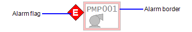

[Проект Situational Awareness](../README.md) -> [Situational Awareness Library](readme.md)

### Загальні елементи об'єктів 

[Help](file:///C:/Program%20Files%20(x86)/AVEVA%20Plant%20SCADA/Bin/Help/SCADA%20Help/Content/ASM_Common_Object_Elements.htm)

Об’єкти в бібліотеці Situational Awareness поділяють набір властивостей і поведінки, які є спільними для об’єктів.

​                            

До них входять:

- Alarm indicator        

- Status indicator             
- Output bar         
- Equipment Running State Indicators

Будь-які винятки з властивостей зазначаються в описах окремих об’єктів.

#### Використання тривожних індикаторів

[Alarm indicator](file:///C:/Program Files (x86)/AVEVA Plant SCADA/Bin/Help/SCADA Help/Content/Use_Alarm_Indicators.htm)

Індикатори тривоги складаються з рамки та прапорця, які з’являються навколо екстенту групи об’єктів або Джина. Ви можете використовувати їх для забезпечення чіткої візуальної індикації виникнення тривоги під час виконання.

​                            

**Alarm border**

Коли виникає відповідний стан тривоги, навколо групи об’єктів або Genie з’явиться рамка тривоги.

**Alarm flag**

Прапорець тривоги надає додаткову інформацію про тривогу, представляючи:

- колір прапорці
- форма прапорці
- код прапорця, який може вказувати пріоритет тривоги або тип тривоги.

У наведеному нижче прикладі показано коди форми, кольору та прапорців, які використовуються для позначення аварійних тривог, тривог високого та низького пріоритету в проекті, створеному на основі проекту Situational Awareness Starter Project.

​                                            

Якщо вам потрібно налаштувати власні прапорці сигналізації, див. [Create a Custom Flag for an Alarm Indicator](file:///C:/Program Files (x86)/AVEVA Plant SCADA/Bin/Help/SCADA Help/Content/Create_Custom_Flags_for_an_Alarm_Indicator.htm).

Крім використання кольору для означення пріоритету тривоги, зовнішній вигляд індикатора тривоги можна використовувати для означення поточного стану тривоги. Наприклад, якщо тривога не підтверджена, індикатор блимає. Для отримання додаткової інформації див. [Стани тривоги](file:///C:/Program Files (x86)/AVEVA Plant SCADA/Bin/Help/SCADA Help/Content/Alarm_States.htm).

Ви можете розташувати прапорець тривоги в кількох місцях навколо межі тривоги об’єкта. Щоб позначити певний стан тривоги, індикатор тривоги може блимати або відображати світліший варіант кольору.

Щоб налаштувати індикатор тривоги для групи об'єктів або Genie, необхідно виконати наступні завдання:

1. Підтвердьте, що необхідні пріоритети тривоги призначені категорії тривоги. Див. [Categorize Alarms](file:///C:/Program Files (x86)/AVEVA Plant SCADA/Bin/Help/SCADA Help/Content/CategorizeAlarms.htm).
2. Визначте властивості відображення для пріоритетів тривоги, які буде представляти індикатор. Див. [Налаштування властивостей відображення для пріоритету тривоги](file:///C:/Program Files (x86)/AVEVA Plant SCADA/Bin/Help/SCADA Help/Content/Configure_Display_Properties_for_an_Alarm_Prioirty.htm).
3. Для кожної групи об'єктів або Genie визначте властивості індикатора тривоги в Graphics Builder. Див. [Індикатор тривоги](file:///C:/Program Files (x86)/AVEVA Plant SCADA/Bin/Help/SCADA Help/Content/Alarm_Indicator.htm).

#### Status Indicators

[Status indicator](file:///C:/Program Files (x86)/AVEVA Plant SCADA/Bin/Help/SCADA Help/Content/ASM_Status_Indicators.htm)   

Індикатори стану використовуються для представлення різних умов, не пов’язаних з тривожним об’єктом, таких як ненормальна якість даних або стани системи керування. Індикатор стану з’являтиметься лише тоді, коли умова запуску істинна.

​                            

Індикатор стану є окремим джином і використовується для представлення різних станів об’єкта. Символи індикаторів стану можна знайти в проекті SA_Library у бібліотеці, яка називається sa_status_indicator.

**Status Indicator States**

Connects to: EquipmentName.EqStatus. Індикатор стану може представляти наступні стани.

|                          Symbol                          | State                                          | Name |
| :------------------------------------------------------: | ---------------------------------------------- | :--: |
|         | Bad data.                                      |  d2  |
|         | Uncertain data or invalid automation state.    |  d1  |
|          | Simulate mode - forcing a value to a point.    |  d4  |
|               | Offscale.                                      | d12  |
|            | Interlocked.                                   |  d6  |
|     | Interlock bypassed.                            |  d5  |
|                 | Paused.                                        | d19  |
|             | Bad Communication between IO Server and Client | d13  |
|               | Tracking                                       | d20  |
|               | Clamped                                        | d21  |
|          | Off-spec lab data.                             |  d7  |
|            | Maintenance.                                   |  d8  |
|          | Message.                                       |  d9  |
|       | Restart of the machine is required.            | d11  |
|  | Initialization manual or index car.            |  d3  |
|           | Timer is active.                               | d10  |
|         | Calibrate mode. Used to calibrate instruments. | d16  |
|           | Bad Communication between Gateway and PLC.     | d14  |
|              | Deviation                                      | d15  |
|              | Reminder to call outside personnel             | d17  |

У сценаріях, де кілька станів можуть бути активними одночасно, є порядок пріоритету щодо того, який індикатор буде відображатися. Наприклад, PID-регулятор, який перебуває в режимі ініціалізації, але також має імітований PV, відображатиме індикатор «S», навіть якщо також була активна умова блокування.

**Status Indicator Order of Precedence**

Наступна діаграма показує порядок пріоритетності:

                     

Індикатори стану можна налаштувати для більшості об’єктів бібліотеки, за винятком NumericInput і TextInput. Приклади були надані лише для приводів, вимірювачів та клапанів.

**Customizing Equipment to use Status Indicators**

Індикатори стану можуть використовуватися для виділення нетривожного стану об’єкта або обладнання. Ви можете налаштувати обладнання для використання індикаторів стану одним із двох способів:

1) Використовуючи Equipment Editor 

- Натисніть на вкладку Обладнання та зі списку Обладнання виберіть відповідне обладнання.

- Відкрийте панель param_list 

- Редагуйте поле EqStatusFunc 

2) Якщо ви не використовуєте шаблони, ви можете налаштувати індикатор стану безпосередньо за допомогою назви елемента EqStatus обладнання. Перейдіть до Модель системи -> Змінні. 

Початковий проект SA_Style_1_MultiRes містить приклад (Indicators.ci) того, як налаштувати обладнання за допомогою зразкових функцій для виклику одного з індикаторів. Варіанти функцій індикатора стану обладнання були передбачені лише для вимірювачів, клапанів і приводів.

- [EquipmentStatus_Meter_GetValue](file:///C:/Program Files (x86)/AVEVA Plant SCADA/Bin/Help/SCADA Help/Content/SA_EquipmentStatus_Meter_GetValue.htm) 
- [EquipmentStatus_Valve_GetValue](file:///C:/Program Files (x86)/AVEVA Plant SCADA/Bin/Help/SCADA Help/Content/SA_EquipmentStatus_Valve_GetValue.htm) 
- [EquipmentStatus_Drive_GetValue](file:///C:/Program Files (x86)/AVEVA Plant SCADA/Bin/Help/SCADA Help/Content/SA_EquipmentStatus_Drive_GetValue.htm) 

Ці функції відображають відповідні теги стану з коду ПЛК у значення, необхідні для різних індикаторів. Різні частини обладнання мають різні відповідні стани для кожного з цих індикаторів, тому, якщо потрібно, створіть власну копію файлу прикладу cicode. Потім ви можете створити варіанти або унікальні версії зразкових функцій для використання у своєму проекті.

Зверніться до коментарів у файлі cicode Indicators.ci для отримання додаткової інформації про те, як налаштувати та використовувати ці функції.

#### Output (OP) Bar 

[Output bar](file:///C:/Program Files (x86)/AVEVA Plant SCADA/Bin/Help/SCADA Help/Content/ASM_OutputBar_Indicator.htm)     

Панель виходу (OP) забезпечує візуальне представлення поточного виходу для частини обладнання. Її можна використовувати з кількома типами об’єктів (control meters, приводами зі змінною швидкістю та регулюючими клапанами).

Інформація, що відображається панеллю OP, може бути представлена у вигляді двох значень:

- Output (Вихід) — значення, встановлене для виходу
- Actual output (Фактичний вихід) — поточне вихідне значення, яке вказується індикатором положення (також званим індикатором зворотного зв'язку).

Використовуючи піч як приклад, вихідним буде температура, при якій піч налаштована на роботу. Фактичним виходом буде поточна температура печі, коли вона рухається до заданого параметра.

Вихід представлений головною панеллю OP, а фактичний вихід представлений індикатором зворотного зв'язку.

​                            

**Output (OP) bar**

Зовнішній прямокутник представляє весь діапазон виводу, від низького значення шкали до високого значення шкали (наприклад, 0—100%).

Для представлення значення OP використовуються наступні кольори:

- Білий колір означає 0% (або найменше значення шкали)
- Чорний означає 100% (або високе значення шкали)
- Сірий відображає всі вихідні значення між ними.

                     

У разі клапанів ВМ клапана залишиться сірим, але стовпчик OP зміниться на чорний, коли OP досягне 100%.

**Readback Indicator**

Індикатор зворотного зчитування (також відомий як індикатор зворотного зв’язку) — це невеликий заповнений трикутник, який використовується для показу:

- Фактичний вихід (для регуляторів)
- Швидкість (для приводів зі змінною швидкістю)
- Позиція (для клапанів).

Якщо ця інформація недоступна з системи керування, індикатор зворотного зчитування не відображається.

Індикатор зворотного зчитування відображає такі кольори:

- Білий на 0% (або мінімум)
- Чорний на 100% (або максимум)
- Сірий для всіх значень між ними.

                     

У діалоговому вікні «Presentation Options» для вимірювачів, приводів і клапанів можна вказати стовпчик OP, але поведінка однакова у всіх випадках. Наведені нижче приклади демонструють позиціонування OP-стовпчика на контрольному вимірювачі, регулюючому клапані та насосі VSD.

​                            

#### Equipment Running State Indicators

[Equipment Running State Indicators](file:///C:/Program Files (x86)/AVEVA Plant SCADA/Bin/Help/SCADA Help/Content/ASM_Multiple_Equipment_Objects.htm).

Індикатор робочого стану обладнання – це компактний індикатор, який можна використовувати для представлення різноманітних станів приводних об’єктів та деяких типів клапанів. Ці стани можуть включати стан роботи, напрямок, блокування, тривогу, блокування тощо.

​                            

Ви можете використовувати індикатор робочого стану обладнання такими способами:

**Represent a group of up to five drives using one symbol**

Основною причиною використання індикаторів стану обладнання є можливість відображати обладнання на сторінці як групу. Наприклад, можна представити групу до п’яти насосів, використовуючи один символ насоса та чотири індикатори робочого стану обладнання.

                     

Це дозволяє контролювати цілу групу накопичувачів за допомогою одного компактного об’єкта.

**Display alarms states for a group of drives**

При використанні із символом, що представляє групу приводів, індикатор стану роботи обладнання відображатиме виникнення будь-яких тривог на окремому приводі в групі. Стан тривоги позначається рамкою всередині індикатора робочого стану обладнання, завдяки чому статус привода залишається видимим. Стан тривоги для основного об’єкта буде відображати тривогу найвищого пріоритету на будь-якому з окремих приводів.

                     

**Integrate an Equipment Running State Indicator into a compact drive symbol**

Якщо доступний простір на екрані обмежений, можна використовувати компактні приводи. Замість відображення квадратного поля індикатора робочого стану обладнання під символом, круглий індикатор робочого стану обладнання розміщується всередині символу.

                     

Індикатор стану запущеного обладнання не має межі навколо нього. Якщо командний та фактичний стани збігаються, коло індикатора робочого стану обладнання зливається із заливкою символу.

**Represent the current state of valves**

Для клапанів символи індикатора робочого стану обладнання відображаються в ВМ клапана замість окремого поля.

                     

##### Equipment Running States

[Індикатори робочого стану обладнання](file:///C:/Program Files (x86)/AVEVA Plant SCADA/Bin/Help/SCADA Help/Content/ASM_Multiple_Equipment_Objects.htm) використовуйте наступні символи для вказівки робочого стану частини обладнання. Тег RunStatus використовується для вказівки непрацездатних станів зі значенням Equipment Running State 2, 3 або 4.

OOS і OOSDisabled — це цифрові теги, які визначають значення стану обладнання.

| Equipment Running State | Symbol                                                       | Description                                                  |
| ----------------------- | :----------------------------------------------------------- | ------------------------------------------------------------ |
| 0                       |                       | Default                                                      |
| 1                       |                      | Mnemonic                                                     |
| 2                       |                  | Mnemonic Out of Service - set manually                       |
| 3                       |                  | Out To Maintenance / Out Of Service / LOTO (Unavailable)     |
| 4                       |       | Off / Closed and Selected Out of Service by upstream equipment |
| 5                       |                   | Off / Stopped and available (Drives) Fully closed (Valves)   |
| 6                       |         | Drive running as standby drive in a duty standby arrangement |
| 7                       |         | Running Forward (Single Speed Drive)  Running Forward Slow Speed (Dual Speed Drive) Valve Open (MOV) Valve stopped midway (complex MOV) |
| 8                       |         | Running Reverse (Single Speed Drive) Running Reverse Slow Speed (Dual Speed Drive) |
| 9                       |       | Running Forward at Full Speed (Dual Speed Drives) Valve Fully Open |
| 10                      |       | Running reverse at Full Speed (Dual Speed Drives)            |
| 11                      |            | Interlock bypassed and off/stopped/closed                    |
| 12                      |                 | Interlocked and off/stopped/closed                           |
| 13                      |         | Interlock bypassed and on/running/open                       |
| 14                      |                  | Interlocked and on/running/open                              |
| 15                      |  | Running Forward at Full Speed (Dual Speed Drives) with an Interlock Bypass Active. |
| 16                      |          | Fully Open and Interlocked (Fail Open Valves).               |
| 17                      |            | State changing from Stopped to Running (Single speed Drive) 	State changing from Stopped to Running Slow (Dual speed Drive) 	Valve requested to open but still at closed limit |
| 18                      |               | State changing from Running Slow to Running Fast (Dual Speed Drive) 	Valve requested to open and has left the closed limit |
| 19                      |            | State changing from Running to Stopped (Single Speed Drive) 	State changing from Running Slow to Stopped (Dual Speed Drive) 	Valve requested to close and has left the open limit |
| 20                      |               | State changing from Running Fast to Running Slow (Dual Speed Drive) 	Valve requested to close but still at open limit |
| 21                      |                 | Startup Warning Siren                                        |
| 22                      |         | Interlocked by a sequence and not running                    |
| 23                      |         | On / Open and Out to Maintenance / Out of Service            |
| 24                      |          | Off / Closed and Selected Out of Service by upstream equipment |

[--> Equipment Custom Parameters](EquipmentCustomParameters.md)