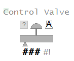

[Проект Situational Awareness](../README.md) -> [Situational Awareness Library](readme.md)

## Control Valve

[help](file:///C:/Program%20Files%20(x86)/AVEVA%20Plant%20SCADA/Bin/Help/SCADA%20Help/Content/ASM_Control_Valve.htm)

Об’єкт регулюючих клапанів показує положення та стан регулюючих клапанів. Елементи та поведінка описані в розділі Common Elements.

| Property                                        | Description                                                  |
| :---------------------------------------------- | :----------------------------------------------------------- |
| Name                                            | Control Valve                                                |
| Graphical Representation                        |                               |
| Example Equipment Template                      | Valve                                                        |
| Associated Composite Genie                      | Valve.xml                                                    |
| Equipment.Items the Genie expects               | [Open, POS, Closed, Opening, Closing](file:///C:/Program Files (x86)/AVEVA Plant SCADA/Bin/Help/SCADA Help/Content/ASM_Valves.htm#Valves_Control)[CtrlMode, CtrlModeDef](file:///C:/Program Files (x86)/AVEVA Plant SCADA/Bin/Help/SCADA Help/Content/ASM_Valves.htm#ModeIndicator)[RunStatus](file:///C:/Program Files (x86)/AVEVA Plant SCADA/Bin/Help/SCADA Help/Content/ASM_MeO_States.htm#OOS_Tags)[OP ](file:///C:/Program Files (x86)/AVEVA Plant SCADA/Bin/Help/SCADA Help/Content/ASM_Valves.htm#Valves_OP)[OPTrack](file:///C:/Program Files (x86)/AVEVA Plant SCADA/Bin/Help/SCADA Help/Content/ASM_Valves.htm#Valves_OPTrack)[FB](file:///C:/Program Files (x86)/AVEVA Plant SCADA/Bin/Help/SCADA Help/Content/ASM_Valves.htm#Valves_Readback)[OOS, OOSDisable](file:///C:/Program Files (x86)/AVEVA Plant SCADA/Bin/Help/SCADA Help/Content/ASM_MeO_States.htm#OOS_Tags)OpenCmd    CloseCmd    StopCmd    AutoCmd    ManCmd    Stopped |
| Equipment Parameters the Equipment Items Expect | [InternalIODevice](file:///C:/Program Files (x86)/AVEVA Plant SCADA/Bin/Help/SCADA Help/Content/Situational_Awareness_Equipment_Parameters.htm#Param_InternalIODevice)[CicodeIODevice](file:///C:/Program Files (x86)/AVEVA Plant SCADA/Bin/Help/SCADA Help/Content/Situational_Awareness_Equipment_Parameters.htm#Param_CicodeIODevice)[EqStatusFunc](file:///C:/Program Files (x86)/AVEVA Plant SCADA/Bin/Help/SCADA Help/Content/Situational_Awareness_Equipment_Parameters.htm#Param_EqStatusFunc)[CtrlMode](file:///C:/Program Files (x86)/AVEVA Plant SCADA/Bin/Help/SCADA Help/Content/Situational_Awareness_Equipment_Parameters.htm#Param_CtrlMode)[Range](file:///C:/Program Files (x86)/AVEVA Plant SCADA/Bin/Help/SCADA Help/Content/Situational_Awareness_Equipment_Parameters.htm#Param_Range) |
| Associated Faceplate(s)                         | [Simple ON / OFF Valve](file:///C:/Program Files (x86)/AVEVA Plant SCADA/Bin/Help/SCADA Help/Content/SA_FP_Simple_Valve.htm)    [Complex ON / OFF Valve](file:///C:/Program Files (x86)/AVEVA Plant SCADA/Bin/Help/SCADA Help/Content/SA_FP_Complex_Valve.htm) |
| Equipment.Items that the Faceplate expects      | [OPTrack](file:///C:/Program Files (x86)/AVEVA Plant SCADA/Bin/Help/SCADA Help/Content/ASM_Valves.htm#Valves_OPTrack)[CtrlModeDef](file:///C:/Program Files (x86)/AVEVA Plant SCADA/Bin/Help/SCADA Help/Content/ASM_Valves.htm#ModeIndicator)OpenCmd    CloseCmd    StopCmd    AutoCmd    ManCmd    Stopped |

**Configuration Tasks**

- [Створити обладнання та організувати обладнання в ієрархії](file:///C:/Program Files (x86)/AVEVA Plant SCADA/Bin/Help/SCADA Help/Content/Situational_Awareness_Add_Equipment_Using_Equipment_Editor.htm): Створіть необхідні екземпляри обладнання для об’єкти та організуйте обладнання в ієрархії. Під час додавання Composite Genies до графічної сторінки можна посилатися на об’єкти за їх іменами. Ви можете додати один або кілька екземплярів обладнання на сторінку.
- [Associate PLC Alarm Limits for Meters](file:///C:/Program Files (x86)/AVEVA Plant SCADA/Bin/Help/SCADA Help/Content/Configure_PLC_Limits_with_Equipment.htm): це необов'язкове завдання. якщо ви хочете використовувати ліміти сигналізації ПЛК замість стандартних аналогових лімітів тривоги.
- [Insert a Composite Genie](file:///C:/Program Files (x86)/AVEVA Plant SCADA/Bin/Help/SCADA Help/Content/Insert_a_Composite_Genie.htm): створення графічних сторінок із екземплярами [Composite Genies](file:///C:/Program Files (x86)/AVEVA Plant SCADA/Bin/Help/SCADA Help/Content/Composite_Genies.htm), які пов’язані з обладнанням, яке ви визначили у своєму проекті.
- [Створити нову передню панель](file:///C:/Program Files (x86)/AVEVA Plant SCADA/Bin/Help/SCADA Help/Content/SA_Create_A_New_FP.htm): додайте [faceplate](file:// /C:/Program Files (x86)/AVEVA Plant SCADA/Bin/Help/SCADA Help/Content/SA_Library_Faceplates.htm) для обладнання, щоб дозволити операторам взаємодіяти з обладнанням під час виконання.
- Напишіть функції Cicode для ініціалізації значень PR та OR. Для отримання додаткової інформації зверніться до онлайн-довідки Cicode Reference. Рекомендується, щоб для лічильника подвійного рівня ви встановлювали ці значення для обох лічильників на однакові значення.

**Примітка**: переконайтеся, що адреса, налаштована для клапана в ПЛК, збігається з адресою тегу, зазначеною в Plant SCADA. Якщо це не налаштовано належним чином, стан і вихідне значення клапана не будуть точними.

**Presentation Options**

Для цього об’єкта доступні наступні параметри презентації.

| Option                   | Description                                                  |
| ------------------------ | ------------------------------------------------------------ |
| Equipment Name           | Enter a name for the piece of equipment. You can enter a maximum of 160 characters for this option. |
| Equipment Item Prefix    | Specify the prefix and the equipment.item the prefix will be applied to. |
| Valve Type               | Select the type of Valve - Block, Control or Damper, Hand.   |
| Size                     | Size of the Valve - small or large.                          |
| Orientation              | Select 	 the  orientation that is appropriate for the presentation of the object on  the graphics page. Horizontal or Vertical. Horizontal is selected by  default. |
| Fail Type                | Select the fail action for the valve (open, closed, or last). |
| Display Label            | Use this setting to display a label at the selected position. Select **None** if you do not want to display a label. |
| Label                    | Enter the text that will display at the location specified in **Display Label** field. You can enter a maximum of 30 characters for this option. |
| Display Alarm Indicator  | Select this  option to display an alarm indicator which indicates the highest  priority alarm and its state for this Valve's equipment. |
| Display Alarm Flag       | Use this setting to display an alarm flag at the selected position. **Note:** If you select the same position for the alarm flag and **Display Status** indicator (see below), they will overlap. The alarm flag will not be visible. |
| Display Status Indicator | Select the  location to display a status indicator. Select None if you do not wish  to see the status indicator. For more information, see [Status Indicators](file:///C:/Program Files (x86)/AVEVA Plant SCADA/Bin/Help/SCADA Help/Content/ASM_Status_Indicators.htm). |
| Display Output Bar       | Select this option to display a field control or computer control for this object. |
| Display OOS              | Select this option to display an out of service indicator.   |
| Display Control Mode     | Select this option to display a mode indicator for the object. |
| Display Readback         | The [Display Readback](file:///C:/Program Files (x86)/AVEVA Plant SCADA/Bin/Help/SCADA Help/Content/ASM_COntrol_Meters_Common_Elements.htm) represents the actual output for the controller. |
| Display Value            | Select this option to display the output value.              |

