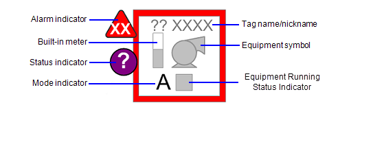
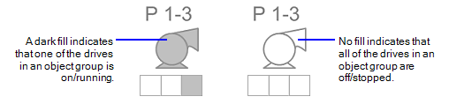
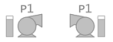
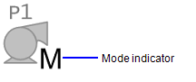
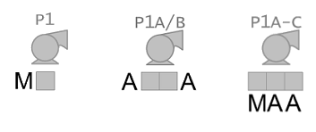
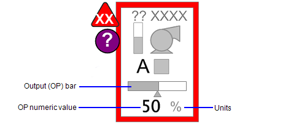

[Проект Situational Awareness](../README.md) -> [Situational Awareness Library](readme.md)

### Drive, Belt and Mining Objects

[Help](file:///C:/Program%20Files%20(x86)/AVEVA%20Plant%20SCADA/Bin/Help/SCADA%20Help/Content/ASM_Drives.htm)

Об'єкти приводу, доступні в бібліотеці Situational Awareness, класифікуються на такі групи:

- [drive](drive.md)
- [belt](belt.md)
- [mining](mining.md)

Всі вони схожі за своїми елементами і функціоналом. Символ обладнання (див. нижче) є єдиним елементом, унікальним для кожного типу приводу. На зображенні нижче показано елементи, які складають основний об’єкт приводу.

​                            

**Примітка**: об’єкт приводу містить вбудований вимірювач, щоб ви могли відображати ключове аналогове значення поруч із символом приводу. Якщо вам не потрібен бічний вимірювач, вам не потрібен наступний елемент: PV.
Якщо ви хочете, щоб ваш накопичувач мав кілька аналогових значень, ви можете відобразити їх як окремі об’єкти вимірювача за допомогою композитних дженів. При використанні вимірювачів адреси та назви тегів мають бути унікальними. Використовуйте префікс у назві елемента. Для отримання додаткової інформації зверніться до [Meters](file:///C:/Program Files (x86)/AVEVA Plant SCADA/Bin/Help/SCADA Help/Content/ASM_Meters.htm).

**Equipment symbol**

Підключається до: Running, Stopped

Символ обладнання вказує на наступне:

- Тип представленого обладнання.
- Стан роботи привода.

Темна заливка вказує на статус роботи привода «on» або «running». Біла заливка означає, що привод «off» або «stopped».

​                                            

Деякі символи обладнання доступні у варіантах, які вказують на певний напрямок.

**Alarm indicator**

An alarm indicator is used to show the occurrence and status of alarms associated with an object. See [Use Alarm Indicators](file:///C:/Program Files (x86)/AVEVA Plant SCADA/Bin/Help/SCADA Help/Content/Use_Alarm_Indicators.htm) for more information. 

**Status indicator**

Connects to: EqStatus.

A running state indicator  is used to represent various non-alarm conditions associated with an  object, such as abnormal data quality or control system states. See [Status Indicators](file:///C:/Program Files (x86)/AVEVA Plant SCADA/Bin/Help/SCADA Help/Content/ASM_Status_Indicators.htm) in the section on Common Object Properties. 

**Equipment Running State Indicator**

Connects to: RunStatus.

An Equipment Running State  Indicator is a compact indicator that can be used to represent a variety of states for drive objects They allow an object to represent a group  of drives. See [Equipment Running State Indicators](file:///C:/Program Files (x86)/AVEVA Plant SCADA/Bin/Help/SCADA Help/Content/ASM_Multiple_Equipment_Objects.htm) in the section on Common Object Properties. 

**Built-in meter**

Connects to: PV.

This item is available to  accommodate drive objects that have an integrated meter for motor amps  or kilowatts. It is built using a small version of the meter symbol and  graphical PV from the Miscellaneous meter. To give the graphics designer flexibility to put the relevant information next to the object, the  item name that drives this graph has been given a name that describes  its use on the genie.

The built-in meter element  is only shown if the reading is available. It is only available for  single-drive objects, it is not used with groups of multiple drive  objects.

For drive objects with a left-facing option, the built-in meter is moved to the right-hand side of the equipment symbol.

​                                            

**Tag name or nickname**

The tag name/nickname field shows the equipment tag name (by default), or, if entered by the user, a “nickname”. The nickname is usually a common name used to help identify the reading (for example, “Oil pump”, instead of “P4509”). 

**Mode indicator**

Connects to: CtrlMode, CtrlModeDef

This is a single-character code that indicates the current mode of the drive. 

​                                            

**Control Mode Indicator states**:

- 0 – Auto (A)
- 1 – Manual (M)
- 2 – Cascade (C)
- 3 – Local (L)
- 4 – Special control (computer symbol)

**Note**: The Mode  Indicator is not displayed if the tag is set to CtrlModeDef. To view the control mode at all times, remove the CtrlModeDef tag from the  equipment template. 

The AutoCmd, ManCmd,  CasCmd, FwdCmd, LocalCmd, MaintCmd, RemCmd, RevCmd, StartCmd, StopCmd,  OOSCmd tags work in conjunction with the CtrlMode tag. For more  information, see [Create a New Faceplate](file:///C:/Program Files (x86)/AVEVA Plant SCADA/Bin/Help/SCADA Help/Content/SA_Create_A_New_FP.htm). 

If a drive object includes Equipment Running State Indicators, the following positioning is used: 

- For a single Equipment Running State Indicator, the mode indicator is positioned to  the left of the Equipment Running State Indicator. 
- For two  Equipment Running State Indicators, the mode indicators are placed on  either side of the Equipment Running State Indicator.
- For groups  of three Equipment Running State Indicators, (or more), the mode  indicator is shown underneath the Equipment Running State Indicator.

​                                            

If the object represents a variable speed drive (VSD), it may also include the following additional elements.

​                            

**Output (OP) bar**

Connects to: OP.

The output (OP) bar provides a graphical representation of the commanded output for a variable speed drive (VSD). See [Output (OP) Bar](file:///C:/Program Files (x86)/AVEVA Plant SCADA/Bin/Help/SCADA Help/Content/ASM_OutputBar_Indicator.htm) in the section on Common Object Properties. 

When dealing with a group  of 2 or more drives, the VSD output bar should only be shown if there is only one VSD in the group, or if there is a common controller for all  of the drives in the group. If the group includes two or more separate  VSDs, either the VSD output indicator should not be shown, or two  separate drive objects should be used.

The readback indicator is  only shown for drives where readback is available. Generally this will  show the actual speed of the drive, measured as a percentage. When a  group of drives with a VSD is shown, and readback is available, readback indicators are shown for each drive.

**Numeric OP**

Connects to: OP.

For variable speed drives, a numeric representation of the OP can provide operators with precise  values when needed. This is measured as a percentage value. 

The visibility of the  numeric OP is tied to the visibility state for PVs (as specified in the  Show/Hide Settings). If the user selects to turn off the visibility for  PVs, the numeric OP values is also hidden. 

**Units**

Represents the unit of measurement for the output. Typically, this will be percentage (%) for VSD output. 

- [drive](drive.md)
- [belt](belt.md)
- [mining](mining.md)