[Проект Situational Awareness](../README.md) -> [Situational Awareness Library](readme.md)

#### Faceplates

[Help](file:///C:/Program%20Files%20(x86)/AVEVA%20Plant%20SCADA/Bin/Help/SCADA%20Help/Content/SA_Library_Faceplates.htm)

Лицьова панель – це сторінка, яка пов’язана з елементом обладнання. Зазвичай він містить графічне представлення обладнання, вимірювань та елементів керування, які дозволяють оператору взаємодіяти з обладнанням під час виконання.

Коли частина обладнання потрапляє в контекст під час виконання, відображатиметься передня панель. Для підтримки цього макет за замовчуванням для проекту Situational Awareness включає [Faceplate Zone](file:///C:/Program Files (x86)/AVEVA Plant SCADA/Bin/Help/SCADA Help/Content/Situational_Awareness_Faceplate_Zone.htm) у [Інформаційна зона](file:///C:/Program Files (x86)/AVEVA Plant SCADA/Bin/Help/SCADA Help/Content/Situational_Awareness_Information_Zone.htm).

**Примітка**: коли обладнання виведене з обслуговування (out of service), усі елементи керування (кнопки та цифрові вводи) на передній панелі вимкнені.

Plant SCADA надає набір зразків передніх панелей для вимірювачів, приводів і клапанів. Зауважте, що зразки передніх панелей повністю налаштовані та готові до використання. Однак ви можете [створити нові передні панелі](file:///C:/Program Files (x86)/AVEVA Plant SCADA/Bin/Help/SCADA Help/Content/SA_Create_A_New_FP.htm), якщо це потрібно.

Лицьові панелі складаються з [Genies](file:///C:/Program Files (x86)/AVEVA Plant SCADA/Bin/Help/SCADA Help/Content/SA_Library_Faceplate_Genie_Library.htm) та/або Composite Genies. Взаємодія користувача з лицевими панелями здійснюється за допомогою елементів (тегів), пов’язаних з різними компонентами лицьової панелі. Елементи, пов’язані з кожною передньою панеллю, перераховані в стовпці Асоційовані теги таблиці лицьової панелі.

### Faceplate Zone

Якщо з об’єктом на сторінці відображення пов’язана лицьова панель, вона буде відображатися в цьому розділі інформаційної панелі, коли об’єкт буде вибрано.

Область, яку займає секція передньої панелі, складається з двох панелей.

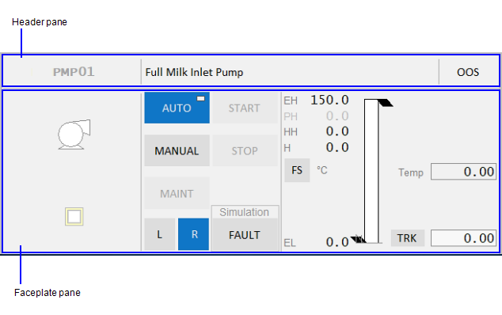    

**Header pane**

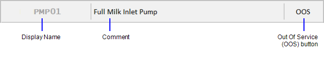    

Панель заголовка містить три частини:

- **Display name** — якщо для вибраного обладнання налаштовано відображуване ім'я, воно відображатиметься тут. Кластерний контекст також включений.
- Якщо відображуване ім’я не налаштовано для об’єкта, з’явиться скорочений шлях обладнання для об’єкта. За потреби шлях обладнання може бути відображений як підказка.

- **Comment** — Якщо для вибраного обладнання налаштовано коментар, він відображатиметься тут.
- **Out Of Service (OOS) button** — Дозволяє вивести вибране обладнання з експлуатації, наприклад, на технічне обслуговування або ремонт.
- Поки обладнання не працює, його сигнали тривоги придушуються.

Кнопка OOS має три робочі стани:

- Якщо кнопка світло-сіра, це означає, що обладнання в даний момент працює і не може бути виведене з експлуатації. Вам потрібно буде зупинити пристрій, перш ніж ви зможете використовувати кнопку OOS.
- Якщо кнопка активна, це означає, що ви можете використовувати кнопку, щоб вивести обладнання з експлуатації.
- Якщо кнопка темно-сіра, це означає, що частина обладнання в даний момент не працює

**Faceplate pane**

Панель передньої панелі веде себе таким чином:

- Якщо з вибраним об’єктом пов’язана лицьова панель, він відображатиметься тут.
- Якщо для вибраного об’єкта не пов’язана лицьова панель, на панелі з’явиться повідомлення «Ліцева панель недоступна».
- Якщо жоден об’єкт не вибрано, на цій панелі відобразиться «Об’єкт не виділено».

### Create a New Faceplate

You can use one of the sample faceplates in the required resolution (HD1080 or 4K) to create your own faceplate.  Sample faceplates are located in the SA_Style_1_MultiRes project.

To create a new faceplate, follow these steps:

1. Modify an existing sample faceplate.
2. Or:

3. Create a copy of an existing faceplate.

4. Or:

5. Create a new page in Graphics Builder using the "faceplate" template in the required resolution.

6. **Note**: The sample faceplates use a specific set of items to display controls at runtime. You can build your [faceplate](file:///C:/Program Files (x86)/AVEVA Plant SCADA/Bin/Help/SCADA Help/Content/SA_Library_Faceplates.htm) using these items, which are listed in the topics that describe the faceplates for [meters](file:///C:/Program Files (x86)/AVEVA Plant SCADA/Bin/Help/SCADA Help/Content/SA_Meters_FPs.htm), [drives](file:///C:/Program Files (x86)/AVEVA Plant SCADA/Bin/Help/SCADA Help/Content/ASM_Drive_Faceplates.htm) and [valves](file:///C:/Program Files (x86)/AVEVA Plant SCADA/Bin/Help/SCADA Help/Content/SA_Valves_FPs.htm). 

7. Save your page.
8. Go to Plant SCADA Studio.
9. In the **Visualization** **activity | Pages**, set the **Content Type** for the above page to "FP". Content of this type will automatically display in the [Faceplate Zone](file:///C:/Program Files (x86)/AVEVA Plant SCADA/Bin/Help/SCADA Help/Content/Situational_Awareness_Faceplate_Zone.htm) of the workspace. 
10. Click **Save**. 
11. In Plant SCADA Studio, **System Model activity | Equipment**, locate the equipment for which you are creating the faceplate.
12. Add the name of the page you created earlier to the **Content** field for the equipment. It can include a comma separated list.
13. Click **Save**.

**Note**: User interaction with  faceplates is achieved through command tags (items) associated with the  various components of a faceplate.  Items are listed in the individual  faceplate topic. Buttons on a faceplate are designed to support this  interaction. However, tags in Plant SCADA need to be mapped to the tags that you have configured on your PLCs.  For example, tags for starting a drive (StartCmd) and displaying its  status (CtrlMode) available in Plant SCADA. Similarly, tags for starting the drive and displaying its status would  exist on your PLC. These two sets of tags need to mapped to each other  for the buttons on the drive faceplate to work. If the mapping is not  created, buttons on the faceplates will not function. Refer to the  example below to understand how this works.

**Example **

This example illustrates how tags are used to achieve interaction with faceplates. 

The CtrlModeDef tag sets  the default mode of operation for a piece of equipment. If you set this  tag to 0 for a pump, the default mode of a pump will be Auto. That is  indicated on the faceplate by a rectangle in the top-right corner of the **Auto** button on the faceplate as shown below. 

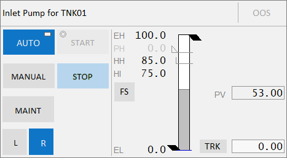    

The CtrlMode tag represents the current mode for a piece of equipment. If the CtrlModeDef (default) and CrtlMode (current) have different values, the current mode will be  displayed in green. For example, the CtrlModeDef = 0 (Auto) and the  CtrlMode = 1 (Manual), the **Manual** button will be displayed in green. Clicking the **Manual** button will set the ManCmd tag  to 1.  

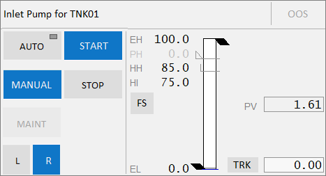    

If the pump is not running, the **Start** button will also be displayed in green to allow you to manually start the pump. If the pump is running, the **Stop** button will be green allowing you to manually stop the pump. The **Auto** button will continue to display the rectangle to indicate that it is the default mode. Note that the **Start** and **Stop** buttons are available only when the mode is Manual.

**Note**: Clicking any button will set its <name>Cmd tag to 1. For example, clicking the **Manual** button will set ManCmd to 1.

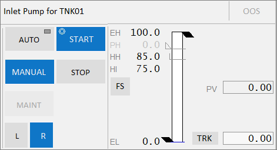    

When you click one of the buttons, a circle will appear in the top-left corner to indicate that a command (**Start** in the above image) has been sent to the PLC mapped to the  corresponding tags. Once the Start command is completed, the circle will disappear as the PLC sets StartCmd to 0 (or StopCmd to 0 in case you  clicked the **Stop** button).  In addition, the PLC sets the value of the Running tag to 1 (Stopped tag if you clicked the **Stop** button). When you click Stop, the value of the Stopped tag is 1.

### Meter Faceplates

Вимірювачі можуть бути пов’язані з однією з таких панелей: 

- [Analog Controller](file:///C:/Program Files (x86)/AVEVA Plant SCADA/Bin/Help/SCADA Help/Content/SA_FP_Analog_Controller.htm)
- [Analog Indicator](file:///C:/Program Files (x86)/AVEVA Plant SCADA/Bin/Help/SCADA Help/Content/SA_FP_Analog_Indicator.htm)

Для використання доступні такі панелі вимірювача: 

- FP_AI_HD1080
- FP_AI_UHD4K
- FP_CTRL_HD1080
- FP_CTRL_UHD4K

Ці лицьові панелі є сторінками проекту sa_style_1_multires і повністю налаштовані. Ви можете використовувати їх безпосередньо у своїх проектах.

#### Analog Controller

Передня панель аналогового регулятора може бути пов’язана з вимірювальними приладами, такими як витратоміри. 

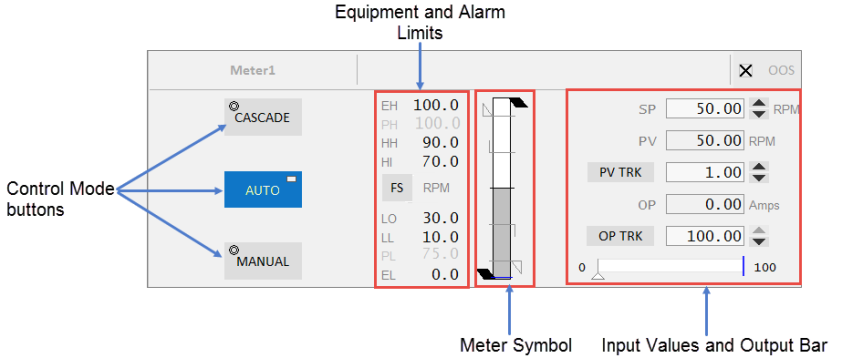    

Лицьова панель аналогового регулятору складається з таких компонентів:

| Component            | Description                                                  | Associated Tags                                              |
| :------------------- | :----------------------------------------------------------- | :----------------------------------------------------------- |
| Control Mode buttons | Auto, Manual and Cascade buttons are  displayed on this faceplate.  The button is green when a mode is active. When the tag associated with the equipment is 0, the mode is Auto. When the tag is 1, the mode is Manual and when the tag is 2, the mode is  Cascade.Clicking a mode button sends a command to the linked PLC. The Mode button displays two symbols:    The circle  in the top-left corner indicates that a command has been sent to the  linked PLC. This indicator is not visible otherwise.    The  rectangle in the top-right corner indicates that the current mode is the normal(default) mode of operation for the equipment. | [CtrlMode, CtrlModeDef](file:///C:/Program Files (x86)/AVEVA Plant SCADA/Bin/Help/SCADA Help/Content/ASM_COntrol_Meters_Common_Elements.htm#Meters_Mode) AutoCmd, CasCmd, ManCmd |
| Equipment Limits     | The following limits are displayed on the left-hand side of the meter symbol:    Engineering High and Low values    Practical Value High and Low valuesIf the values lie outside the practical  values, additional indicators are displayed. The color of the equipment  limits changes as the meter values change. If the practical range is the same as the engineering range, the practical range will be hidden. | [PRHigh, PRLow](file:///C:/Program Files (x86)/AVEVA Plant SCADA/Bin/Help/SCADA Help/Content/ASM_Meters_Common_Elements.htm#Full_Range_Indicators)[PV](file:///C:/Program Files (x86)/AVEVA Plant SCADA/Bin/Help/SCADA Help/Content/ASM_Meters_Common_Elements.htm#Meters_NumericPV) |
| Alarm Limits         | Displays the following alarm limits on the left-hand side of the meter symbol:    HiHi    Hi    Lo    LoLoThese are the standard analog alarm limits. If these alarm limits are not configured, they will not be displayed. **Note**: You can now configure custom digital alarm limits based on the [PLC alarm limits](file:///C:/Program Files (x86)/AVEVA Plant SCADA/Bin/Help/SCADA Help/Content/Configure_PLC_Limits_with_Equipment.htm). The **FS** (Full scale) button can be  used to toggle the meter into full scale even when the PV is within the  practical range. The units of measurement of the PV are displayed to the right of the **FS** button. | [HHAlm, HAlm, LAlm, LLAlm](file:///C:/Program Files (x86)/AVEVA Plant SCADA/Bin/Help/SCADA Help/Content/ASM_Meters_Common_Elements.htm#Meter_AlarmLimits)    **Note**: These tags are used if the  UsePLCLimits parameter is "true" unless the PLCLimits parameter has been changed from the default. If the UsePLCLimits parameter is "false",  values come from the alarm limit configuration of the PV tag. |
| Meter Symbol         | Symbol for the currently selected meter.                     |                                                              |
| Faceplate Inputs     | Shown on the right-hand side of the meter symbol. Most of these are selected in the Composite Genie presentation  options. These include:    Setpoint (SP) - this is editable only in Auto mode.    PV (comes from the equipment)    PV tracker    OP - this is editable only in Manual mode.    OP tracker**Note**: You can configure the Setpoint increment by using an [Equipment Runtime Parameter](file:///C:/Program Files (x86)/AVEVA Plant SCADA/Bin/Help/SCADA Help/Content/Manually_Define_Equipment_Runtime_Param.htm) on your equipment. This is not supported on the default faceplates, but you can modify the faceplate to achieve this. Specify a name for the  parameter (for example, SPStep) on the [Numeric Input](file:///C:/Program Files (x86)/AVEVA Plant SCADA/Bin/Help/SCADA Help/Content/ASM_Numeric_Input.htm) Composite Genie of the faceplate. Also, the **IsTag** property needs to be set to FALSE. | [SP](file:///C:/Program Files (x86)/AVEVA Plant SCADA/Bin/Help/SCADA Help/Content/ASM_COntrol_Meters_Common_Elements.htm#Meters_Setpoint)[PV, PVTrack](file:///C:/Program Files (x86)/AVEVA Plant SCADA/Bin/Help/SCADA Help/Content/ASM_Meters_Common_Elements.htm#Meters_NumericPV)[OP, OPTrack](file:///C:/Program Files (x86)/AVEVA Plant SCADA/Bin/Help/SCADA Help/Content/ASM_COntrol_Meters_Common_Elements.htm#Meters_OP) |
| Output Bar           | Displayed below the  input values. This shows the expected output along the bar and the  actual output indicated by a triangle below the bar. The output  indicator is visible only when the controller is in Auto or Cascade  mode. It is not visible in Manual mode. | [OP, OPTrack](file:///C:/Program Files (x86)/AVEVA Plant SCADA/Bin/Help/SCADA Help/Content/ASM_COntrol_Meters_Common_Elements.htm#Meters_OP)[FB](file:///C:/Program Files (x86)/AVEVA Plant SCADA/Bin/Help/SCADA Help/Content/ASM_COntrol_Meters_Common_Elements.htm#Meters_FB) |

#### Analog Indicator

Зміна передньої панелі аналогового індикатора пов’язана зі звичайними вимірювачами, такими як аналізатор.

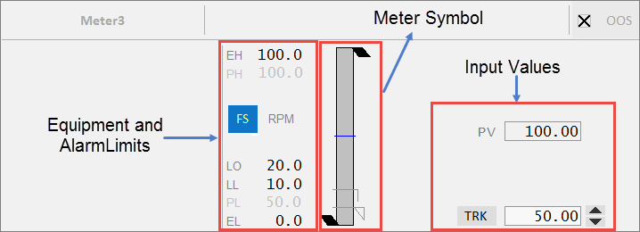

Лицьова панель аналогового індикатора складається з таких компонентів:

| Component        | Description                                                  | Associated Tags                                              |
| :--------------- | :----------------------------------------------------------- | :----------------------------------------------------------- |
| Equipment Limits | The following limits are displayed for this faceplate:Engineering High and Low valuesPractical Value High and Low values If the values lie  outside the practical values, additional indicators are displayed. The  color of the equipment limits changes as the meter values change. If the practical range is the same as the engineering range, the practical range will be hidden. | [PRHigh, PRLow](file:///C:/Program Files (x86)/AVEVA Plant SCADA/Bin/Help/SCADA Help/Content/ASM_Meters_Common_Elements.htm#Full_Range_Indicators)[PV](file:///C:/Program Files (x86)/AVEVA Plant SCADA/Bin/Help/SCADA Help/Content/ASM_Meters_Common_Elements.htm#Meters_NumericPV) |
| Alarm Limits     | Displays the following alarm limits:HiHiHiLoLoLo        These are the standard analog alarm limits. If these alarm limits are not configured, they will not be displayed. **Note**: You can now configure custom digital alarm limits based on the PLC alarm limits. The **FS** (Full  scale) button can be used to toggle the meter into full scale even when  the PV is within the practical range. The units of measurement of the  PV are displayed to the right of the **FS** button. | [HHAlm, HAlm, LAlm, LLAlm](file:///C:/Program Files (x86)/AVEVA Plant SCADA/Bin/Help/SCADA Help/Content/ASM_Meters_Common_Elements.htm#Meter_AlarmLimits)        **Note**: These  tags are used if the UsePLCLimits parameter is "true" unless the  PLCLimits parameter has been changed from the default. If  UsePLCLimitsParameter is "false", values come from the alarm limit  configuration of the PV tag. |
| Faceplate Inputs | Shown on the right hand side. Most of these are selected in the Composite Genie presentation options. These include:PV (comes from the equipment)PV tracker |                                                              |

 

### Drive Faceplates

Drive objects can call different faceplates depending on their specific properties as outlined below:

- [Single or Multiple DOL Drive](file:///C:/Program Files (x86)/AVEVA Plant SCADA/Bin/Help/SCADA Help/Content/SA_FP_Single_Multiple_DOL_Drive.htm)
- [Single or Multiple VSD Drive – Single direction](file:///C:/Program Files (x86)/AVEVA Plant SCADA/Bin/Help/SCADA Help/Content/SA_FP_Single_Multiple_VSD_Drive.htm)
- [Single DOL Drive with Forward/ Reverse capability](file:///C:/Program Files (x86)/AVEVA Plant SCADA/Bin/Help/SCADA Help/Content/SA_FP_Single_DOL_Drive.htm)
- [Single VSD Drive with Forward/ Reverse capability](file:///C:/Program Files (x86)/AVEVA Plant SCADA/Bin/Help/SCADA Help/Content/SA_FP_Single_VSD_Drive.htm)

The following sample drive faceplates are available for use:

- FP_DOL_HD1080
- FP_DOL_UHD4K
- FP_VSD_HD1080
- FP_VSD_UHD4K
- FP_DOL_FR_HD1080
- FP_DOL_FR_UHD4K
- FP_VSD_FR_HD1080
- FP_VSD_FR_UHD4K

These faceplates are pages in the  sa_style_1_multires project, and are fully configured. You can use them  directly in your projects. 

#### Single and Multiple DOL Drive

This faceplate is used for all single and multiple Direct Online (DOL) drives.

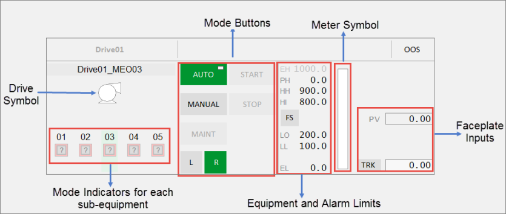

The Single or Multiple DOL Drive faceplate comprises the following components:

| Component                                  | Description                                                  | Associated Tags                                              |
| :----------------------------------------- | :----------------------------------------------------------- | :----------------------------------------------------------- |
| Drive Symbol                               | Symbol for the drive associated with the selected equipment. Clicking on the  multiple equipment object selects that particular drive. The buttons,  meter and readings are then populated for that drive. |                                                              |
| Mode Indicators for each related equipment | Status indicator and control modes for each related equipment displayed below the drive symbol. The last two characters of the tagname for each drive are shown over each multiple equipment  indicator to distinguish between the drives.**Note**: If the  drive does not have any MEOs, a Running State Indicator and control mode will be displayed for the drive itself in the center position. The last two characters' label and the label above the drive are not shown. The  mode indicator is not selectable.  Indicators for up to 5 DOL drives can be displayed here. | [RunStatus](file:///C:/Program Files (x86)/AVEVA Plant SCADA/Bin/Help/SCADA Help/Content/ASM_MeO_States.htm#RunStatus_Tag)[CtrlMode, CtrlModeDef](file:///C:/Program Files (x86)/AVEVA Plant SCADA/Bin/Help/SCADA Help/Content/ASM_Drives.htm#ModeIndicator) |
| Mode buttons                               | Mode buttons are green  when a mode is active, and grey when inactive. When the CtrlMode tag  associated with the equipment is 0, the mode is Auto. When the tag is 1, the mode is Manual. This tag applies to Auto and Manual buttons.The Mode button displays two symbols:The circle  in the top-left corner indicates that a command has been sent to the  linked PLC. This indicator is not visible otherwise.The rectangle in the top-right corner indicates that the current mode is the normal mode of operation for the equipment.        The following Mode buttons are displayed: |                                                              |
|                                            | Auto: Automatic mode                                         | [CtrlMode, CtrlModeDef](file:///C:/Program Files (x86)/AVEVA Plant SCADA/Bin/Help/SCADA Help/Content/ASM_Drives.htm#ModeIndicator)AutoCmd |
|                                            | Manual: Manual mode                                          | [CtrlMode, CtrlModeDef](file:///C:/Program Files (x86)/AVEVA Plant SCADA/Bin/Help/SCADA Help/Content/ASM_Drives.htm#ModeIndicator)ManCmd |
|                                            | Maint:  Maintenance mode - This is a toggle button that toggles the "MaintCmd"  item from 0 to 1 or vice versa. It is green (active) when the "Maint"  item is 1 and disabled when the drive is running. During this time, all  non-critical interlocks are bypassed. The circle or rectangle symbols  are not displayed on this button. | Maint, MaintCmd                                              |
|                                            | Start: This is a toggle button to  manually start the drive. This button is available only when the drive  is in Manual (MAN) mode. This button does not have a "Normal" mode, and  therefore does not display the rectangle symbol. | [Running](file:///C:/Program Files (x86)/AVEVA Plant SCADA/Bin/Help/SCADA Help/Content/ASM_Drives.htm#Running_Drive) StartCmd |
|                                            | Stop: This  is a toggle button to manually stop the drive. This button is available  only when the drive is in Manual (MAN) mode.  It is disabled when the  drive is in Maintenance mode. This button does not have a "Normal" mode, and therefore does not display the rectangle symbol. | [Stopped](file:///C:/Program Files (x86)/AVEVA Plant SCADA/Bin/Help/SCADA Help/Content/ASM_Drives.htm#Running_Drive) StopCmd |
|                                            | Local: When active, this button indicates that the drive is in local control. Remote: When active, this button indicates that the drive is in remote control. |                                                              |
| Equipment Limits                           | The following limits are displayed on the right-hand side:Engineering High and Low valuesPractical Value High and Low values        If the values lie  outside the practical values, additional indicators are displayed. The  color of the equipment limits changes as the meter values change. If the practical range is the same as the engineering range, the practical range will be hidden. | [PRHigh, PRLow](file:///C:/Program Files (x86)/AVEVA Plant SCADA/Bin/Help/SCADA Help/Content/ASM_Meters_Common_Elements.htm#Full_Range_Indicators)[PV](file:///C:/Program Files (x86)/AVEVA Plant SCADA/Bin/Help/SCADA Help/Content/ASM_Drives.htm#BuiltInMeter) |
| Alarm Limits                               | Displays the following alarm limits on the right-hand side:HiHiHiLoLoLo        These are the standard analog alarm limits. If these alarm limits are not configured, they will not be displayed. **Note**: You can now configure custom digital alarm limits based on the PLC alarm limits. The **FS** (Full  scale) button can be used to toggle the meter into full scale even when  the PV is within the practical range. The units of measurement of the  PV are displayed to the right of the **FS** button. | [HHAlm, HAlm, LAlm, LLAlm](file:///C:/Program Files (x86)/AVEVA Plant SCADA/Bin/Help/SCADA Help/Content/ASM_Meters_Common_Elements.htm#Meter_AlarmLimits)        **Note**: These tags are used if the  UsePLCLimits parameter is "true" unless the PLCLimits parameter has been changed from the default. If the UsePLCLimits parameter is "false",  values come from the alarm limit configuration of the PV tag. |
| Meter                                      | Meter displayed for the PV of the equipment.                 |                                                              |
| Faceplate Inputs                           | Shown on the right-hand side of the meter. These include:PV (comes from the equipment)PV tracker | [PV, PVTrack](file:///C:/Program Files (x86)/AVEVA Plant SCADA/Bin/Help/SCADA Help/Content/ASM_Meters_Common_Elements.htm#Meters_NumericPV) |

#### Single and Multiple VSD Drive - Single Direction

This faceplate is used for single and  multiple Variable Speed Drive (VSD) control. It is used for variable  drives and groups of variable speed drives. This faceplate functions  similar to the multiple DOL drive faceplate. The Equipment Running State Indicators are positioned like the multiple DOL drive faceplate based  upon the number of drives.

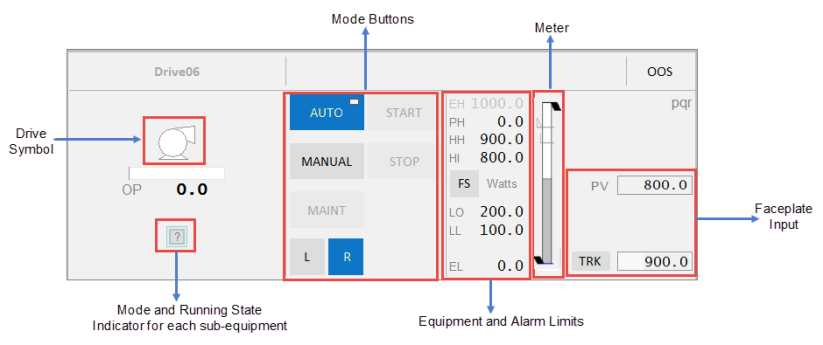

| Component                                  | Description                                                  | Associated Tags                                              |
| :----------------------------------------- | :----------------------------------------------------------- | :----------------------------------------------------------- |
| Drive Symbol                               | Symbol for the drive associated with the selected equipment. Clicking on the  multiple equipment object selects that particular drive. The buttons,  meter and readings are then populated for that drive. |                                                              |
| Output Bar                                 | This shows the expected output along the bar.                |                                                              |
| Mode Indicators for each related equipment | Running State Indicators and control modes for each related equipment displayed below the drive symbol. The last two characters of the tagname for each drive are shown over each multiple equipment  indicator to distinguish between the drives.**Note**: If the  drive does not have any MEOs, a Running State Indicator and control mode will be displayed for the drive itself in the center position. The last two characters' label and the label above the drive are not shown. The  mode indicator is not selectable.  Indicators for up to 5 VS drives can be displayed here. | [RunStatus](file:///C:/Program Files (x86)/AVEVA Plant SCADA/Bin/Help/SCADA Help/Content/ASM_MeO_States.htm#RunStatus_Tag) [CtrlMode, CtrlModeDef](file:///C:/Program Files (x86)/AVEVA Plant SCADA/Bin/Help/SCADA Help/Content/ASM_Drives.htm#ModeIndicator) |
| Mode buttons                               | Mode buttons are green  when a mode is active, and grey when inactive. When the CtrlMode tag  associated with the equipment is 0, the mode is Auto. When the tag is 1, the mode is Manual. This tag applies to Auto and Manual buttons.The Mode button displays two symbols:The circle  in the top-left corner indicates that a command has been sent to the  linked PLC. This indicator is not visible otherwise.The rectangle in the top-right corner indicates that the current mode is the normal mode of operation for the equipment.        The following mode buttons are displayed: |                                                              |
|                                            | Auto: Automatic mode                                         | [CtrlMode, CtrlModeDef](file:///C:/Program Files (x86)/AVEVA Plant SCADA/Bin/Help/SCADA Help/Content/ASM_Drives.htm#ModeIndicator) AutoCmd |
|                                            | Manual: Manual mode                                          | [CtrlMode, CtrlModeDef](file:///C:/Program Files (x86)/AVEVA Plant SCADA/Bin/Help/SCADA Help/Content/ASM_Drives.htm#ModeIndicator) ManCmd |
|                                            | Maint:  Maintenance mode - This is a toggle button that toggles the "MaintCmd"  item from 0 to 1 or vice versa. It is green (active) when the "Maint"  item is 1 and disabled when the drive is running. During this time, all  non-critical interlocks are bypassed. The circle or rectangle symbols  are not displayed on this button. | Maint, MaintCmd                                              |
|                                            | Start: This  is a toggle button to manually start the drive. This button is available only when the drive is in Manual (MAN) mode. This button does not have a "Normal" mode, and therefore does not display the rectangle symbol. | [Running](file:///C:/Program Files (x86)/AVEVA Plant SCADA/Bin/Help/SCADA Help/Content/ASM_Drives.htm#Running_Drive) StartCmd |
|                                            | Stop: This  is a toggle button to manually stop the drive. This button is available  only when the drive is in Manual (MAN) mode.  It is disabled when the  drive is in Maintenance mode. It is disabled when the drive is in  Maintenance mode. This button does not have a "Normal" mode, and  therefore does not display the rectangle symbol. | [Stopped](file:///C:/Program Files (x86)/AVEVA Plant SCADA/Bin/Help/SCADA Help/Content/ASM_Drives.htm#Running_Drive) StopCmd |
|                                            | Local: When active, this button indicates that the drive is in local control. Remote: When active, this button indicates that the drive is in remote control. |                                                              |
| Equipment Limits                           | The following limits are displayed on the right-hand side:Engineering High and Low valuesPractical Value High and Low values        If the values lie  outside the practical values, additional indicators are displayed. The  color of the equipment limits changes as the meter values change. If the practical range is the same as the engineering range, the practical range will be hidden. | [PRHigh, PRLow](file:///C:/Program Files (x86)/AVEVA Plant SCADA/Bin/Help/SCADA Help/Content/ASM_Meters_Common_Elements.htm#Full_Range_Indicators)[PV](file:///C:/Program Files (x86)/AVEVA Plant SCADA/Bin/Help/SCADA Help/Content/ASM_Drives.htm#BuiltInMeter) |
| Alarm Limits                               | Displays the following alarm limits on the right-hand side:HiHiHiLoLoLo        These are the standard analog alarm limits. If these alarm limits are not configured, they will not be displayed. **Note**: You can now configure custom digital alarm limits based on the PLC alarm limits. The **FS** (Full scale) button can be  used to toggle the meter into full scale even when the PV is within the  practical range. The units of measurement of the PV are displayed to the right of the **FS** button. | [HHAlm, HAlm, LAlm, LLAlm](file:///C:/Program Files (x86)/AVEVA Plant SCADA/Bin/Help/SCADA Help/Content/ASM_Meters_Common_Elements.htm#Meter_AlarmLimits)        **Note**: These  tags are used if the UsePLCLimits parameter is "true" unless the  PLCLimits parameter has been changed from the default. If the  UsePLCLimits parameter is "false", values come from the alarm limit  configuration of the PV tag. |
| Meter                                      | Meter displayed for the PV of the equipment.                 |                                                              |

#### Single DOL Drive with Forward/Reverse Capability

This faceplate is used for a customized Direct Online (DOL) drive that has different commands for forward and reverse.

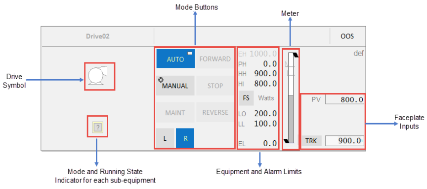

| Component                                  | Description                                                  | Associated Tags                                              |
| :----------------------------------------- | :----------------------------------------------------------- | :----------------------------------------------------------- |
| Drive Symbol                               | Symbol for the drive associated with the selected equipment. Clicking on the  multiple equipment object selects that particular drive. The buttons,  meter and readings are then populated for that drive. |                                                              |
| Mode Indicators for each related equipment | Running State Indicator and control modes for each related equipment displayed below the drive symbol. The last two characters of the tagname  for each drive are shown over each multiple equipment indicator to  distinguish between the drives.**Note**: If the  drive does not have any MEOs, a Running Status indicator and control  mode will be displayed for the drive itself in the center position. The  last two characters' label and the label above the drive are not shown.  The mode indicator is not selectable.  Indicators for up to 5 DOL drives can be displayed here. | [RunStatus](file:///C:/Program Files (x86)/AVEVA Plant SCADA/Bin/Help/SCADA Help/Content/ASM_MeO_States.htm#RunStatus_Tag)[ CtrlMode, CtrlModeDef](file:///C:/Program Files (x86)/AVEVA Plant SCADA/Bin/Help/SCADA Help/Content/ASM_Drives.htm#ModeIndicator) |
| Mode Buttons                               | Mode buttons are green  when a mode is active, and grey when inactive. When the CtrlMode tag  associated with the equipment is 0, the mode is Auto. When the tag is 1, the mode is Manual. This tag applies to Auto and Manual buttons.The Mode button displays two symbols:The circle  in the top-left corner indicates that a command has been sent to the  linked PLC. This indicator is not visible otherwise.The rectangle in the top-right corner indicates that the current mode is the normal mode of operation for the equipment.        The following mode buttons are displayed: |                                                              |
|                                            | Auto: Automatic mode                                         | [CtrlMode, CtrlModeDef](file:///C:/Program Files (x86)/AVEVA Plant SCADA/Bin/Help/SCADA Help/Content/ASM_Drives.htm#ModeIndicator) AutoCmd |
|                                            | Manual: Manual mode                                          | [CtrlMode, CtrlModeDef](file:///C:/Program Files (x86)/AVEVA Plant SCADA/Bin/Help/SCADA Help/Content/ASM_Drives.htm#ModeIndicator)  ManCmd |
|                                            | Maint:  Maintenance mode - This is a toggle button that toggles the "MaintCmd"  item from 0 to 1 or vice versa. It is green (active) when the "Maint"  item is 1 and disabled when the drive is running. During this time, all  non-critical interlocks are bypassed. The circle or rectangle symbols  are not displayed on this button. | Maint, MaintCmd                                              |
|                                            | Stop: This is a toggle button to  manually stop the drive. This button is available only when the drive is in Manual (MAN) mode.  It is disabled when the drive is in Maintenance  mode. It is disabled when the drive is in Maintenance mode. This button  does not have a "Normal" mode, and therefore does not display the  rectangle symbol. | [Stopped](file:///C:/Program Files (x86)/AVEVA Plant SCADA/Bin/Help/SCADA Help/Content/ASM_Drives.htm#Running_Drive) StopCmd |
|                                            | Forward: This is a toggle button to manually start the drive in the forward  direction. This button is available only when the drive is in Manual  (MAN) mode. This button does not have a "Normal" mode, and therefore  does not display the rectangle symbol. | Fwd, FwdCmd                                                  |
|                                            | Reverse: This is a toggle button to manually start the drive in the reverse  direction. This button is available only when the drive is in Manual  (MAN) mode. This button does not have a "Normal" mode, and therefore  does not display the rectangle symbol. | Rev, RevCmd                                                  |
|                                            | Local: When active, this button indicates that the drive is in local control. Remote: When active, this button indicates that the drive is in remote control. |                                                              |
| Equipment Limits                           | The following limits are displayed on the right-hand side:Engineering High and Low valuesPractical Value High and Low values        If the values lie  outside the practical values, additional indicators are displayed. The  color of the equipment limits changes as the meter values change. If the practical range is the same as the engineering range, the practical range will be hidden. | [PRHigh, PRLow](file:///C:/Program Files (x86)/AVEVA Plant SCADA/Bin/Help/SCADA Help/Content/ASM_Meters_Common_Elements.htm#Full_Range_Indicators)[PV](file:///C:/Program Files (x86)/AVEVA Plant SCADA/Bin/Help/SCADA Help/Content/ASM_Drives.htm#BuiltInMeter) |
| Alarm Limits                               | Displays the following alarm limits on the right-hand side:HiHiHiLoLoLo        These are the standard analog alarm limits. If these alarm limits are not configured, they will not be displayed. **Note**: You can now configure custom digital alarm limits based on the PLC alarm limits. The **FS** (Full scale) button can be  used to toggle the meter into full scale even when the PV is within the  practical range. The units of measurement of the PV are displayed to the right of the **FS** button. | [HHAlm, HAlm, LAlm, LLAlm](file:///C:/Program Files (x86)/AVEVA Plant SCADA/Bin/Help/SCADA Help/Content/ASM_Meters_Common_Elements.htm#Meter_AlarmLimits)        **Note**: These  tags are used if the UsePLCLimits parameter is "true" unless the  PLCLimits parameter has been changed from the default. If UsePLCLimits  parameter is "false", values come from the alarm limit configuration of  the PV tag. |
| Meter                                      | Meter displayed for the PV of the equipment.                 |                                                              |
| Faceplate Inputs                           | Shown on the right-hand side of the meter. These include:PV (comes from the equipment)PV tracker | [PV, PVTrack](file:///C:/Program Files (x86)/AVEVA Plant SCADA/Bin/Help/SCADA Help/Content/ASM_Meters_Common_Elements.htm#Meters_NumericPV) |

#### Single VSD Drive with Forward/Reverse Capability

This faceplate is used for a customized VSD drive that has different commands for forward and reverse. This  faceplate is similar to the VSD drive faceplate.

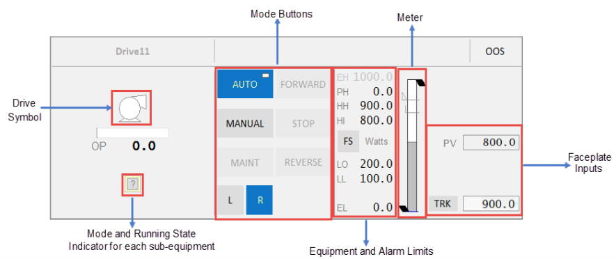

| Component                                  | Description                                                  | Associated Tags                                              |
| :----------------------------------------- | :----------------------------------------------------------- | :----------------------------------------------------------- |
| Drive Symbol                               | Symbol for the drive associated with the selected equipment. The mode indicator for the drive is displayed below the symbol. |                                                              |
| Output Bar                                 | This shows the expected output along the bar and the actual output indicated by a triangle below the bar. |                                                              |
| Mode Indicators for each related equipment | Running State Indicators and control modes for each related equipment displayed below the drive symbol. The last two characters of the tagname for each drive are shown over each multiple equipment  indicator to distinguish between the drives.**Note**: If the  drive does not have any MEOs, a Running State Indicator and control mode will be displayed for the drive itself in the center position. The last two characters' label and the label above the drive are not shown. The  mode indicator is not selectable.  Indicators for up to 5 VS drives can be displayed here. | [RunStatus](file:///C:/Program Files (x86)/AVEVA Plant SCADA/Bin/Help/SCADA Help/Content/ASM_MeO_States.htm#RunStatus_Tag)[CtrlMode, CtrlModeDef](file:///C:/Program Files (x86)/AVEVA Plant SCADA/Bin/Help/SCADA Help/Content/ASM_Drives.htm#ModeIndicator) |
| Mode Buttons                               | Mode buttons are green  when a mode is active, and grey when inactive. When the CtrlMode tag  associated with the equipment is 0, the mode is Auto. When the tag is 1, the mode is Manual. This tag applies to Auto and Manual buttons.The Mode button displays two symbols:The circle  in the top-left corner indicates that a command has been sent to the  linked PLC. This indicator is not visible otherwise.The rectangle in the top-right corner indicates that the current mode is the normal mode of operation for the equipment.        The following mode buttons are displayed: |                                                              |
|                                            | Auto: Automatic mode                                         | [CtrlMode, CtrlModeDef](file:///C:/Program Files (x86)/AVEVA Plant SCADA/Bin/Help/SCADA Help/Content/ASM_Drives.htm#ModeIndicator) AutoCmd |
|                                            | Manual: Manual mode                                          | [CtrlMode, CtrlModeDef](file:///C:/Program Files (x86)/AVEVA Plant SCADA/Bin/Help/SCADA Help/Content/ASM_Drives.htm#ModeIndicator) ManCmd |
|                                            | Maint:  Maintenance mode - This is a toggle button that toggles the "MaintCmd"  item from 0 to 1 or vice versa. It is green (active) when the "Maint"  item is 1 and disabled when the drive is running. During this time, all  non-critical interlocks are bypassed. The circle or rectangle symbols  are not displayed on this button. | Maint, MaintCmd                                              |
|                                            | Start: This  is a toggle button to manually start the drive. This button is available only when the drive is in Manual (MAN) mode. This button does not have a "Normal" mode, and therefore does not display the rectangle symbol. | [Running](file:///C:/Program Files (x86)/AVEVA Plant SCADA/Bin/Help/SCADA Help/Content/ASM_Drives.htm#Running_Drive) StartCmd |
|                                            | Stop: This  is a toggle button to manually stop the drive. This button is available  only when the drive is in Manual (MAN) mode.  It is disabled when the  drive is in Maintenance mode. It is disabled when the drive is in  Maintenance mode. This button does not have a "Normal" mode, and  therefore does not display the rectangle symbol. | [Stopped](file:///C:/Program Files (x86)/AVEVA Plant SCADA/Bin/Help/SCADA Help/Content/ASM_Drives.htm#Running_Drive) StopCmd |
|                                            | Forward: This is a toggle button to manually start the drive in the forward  direction. This button is available only when the drive is in Manual  (MAN) mode. This button does not have a "Normal" mode, and therefore  does not display the rectangle symbol. | Fwd, FwdCmd                                                  |
|                                            | Reverse: This is a toggle button to manually start the drive in the reverse  direction. This button is available only when the drive is in Manual  (MAN) mode. This button does not have a "Normal" mode, and therefore  does not display the rectangle symbol. | Rev, RevCmd                                                  |
|                                            | Local: When active, this button indicates that the drive is in local control. Remote: When active, this button indicates that the drive is in remote control. |                                                              |
| Equipment Limits                           | The following limits are displayed on the right-hand side:Engineering High and Low valuesPractical Value High and Low values        If the values lie  outside the practical values, additional indicators are displayed. The  color of the equipment limits changes as the meter values change. If the practical range is the same as the engineering range, the practical range will be hidden. | [PRHigh, PRLow](file:///C:/Program Files (x86)/AVEVA Plant SCADA/Bin/Help/SCADA Help/Content/ASM_Meters_Common_Elements.htm#Full_Range_Indicators)[PV](file:///C:/Program Files (x86)/AVEVA Plant SCADA/Bin/Help/SCADA Help/Content/ASM_Drives.htm#BuiltInMeter) |
| Alarm Limits                               | Displays the following alarm limits on the right-hand side:HiHiHiLoLoLo        These are the standard analog alarm limits. If these alarm limits are not configured, they will not be displayed. **Note**: You can now configure custom digital alarm limits based on the PLC alarm limits. The **FS** (Full  scale) button can be used to toggle the meter into full scale even when  the PV is within the practical range. The units of measurement of the  PV are displayed to the right of the **FS** button. | [HHAlm, HAlm, LAlm, LLAlm](file:///C:/Program Files (x86)/AVEVA Plant SCADA/Bin/Help/SCADA Help/Content/ASM_Meters_Common_Elements.htm#Meter_AlarmLimits)        **Note**: These  tags are used if the UsePLCLimits parameter is "true" unless the  PLCLimits parameter has been changed from the default. If  UsePLCLimitsParameter is "false", values come from the alarm limit  configuration of the PV tag. |
| Meter                                      | Meter displayed for the PV of the equipment.                 |                                                              |
| Faceplate Inputs                           | Shown on the right-hand side of the meter. These include:PV (comes from the equipment)PV tracker | [PV, PVTrack](file:///C:/Program Files (x86)/AVEVA Plant SCADA/Bin/Help/SCADA Help/Content/ASM_Meters_Common_Elements.htm#Meters_NumericPV) |

### Valves

Valves can be associated with one of the following faceplates:

- [Simple ON / OFF Valve](file:///C:/Program Files (x86)/AVEVA Plant SCADA/Bin/Help/SCADA Help/Content/SA_FP_Simple_Valve.htm)
- [Complex ON / OFF Valve](file:///C:/Program Files (x86)/AVEVA Plant SCADA/Bin/Help/SCADA Help/Content/SA_FP_Complex_Valve.htm)

The following sample valve faceplates are available for use:

- FP_COMPLX_VLV_HD1080
- FP_COMPLX_VLV_UHD4K
- FP_VLV_HD1080
- FP_VLV_UHD4K

Ці лицьові панелі є сторінками проекту sa_style_1_multires і повністю налаштовані. Ви можете використовувати їх безпосередньо у своїх проектах.

#### Simple Valve

Приклад передньої панелі Simple Valve може бути пов’язаний з блоковим клапаном, оскільки він має квадратну головку клапана.

**Примітка**. Щоб використовувати для інших типів клапанів, створіть копію передньої панелі та оновіть тип клапана в композитному джині.

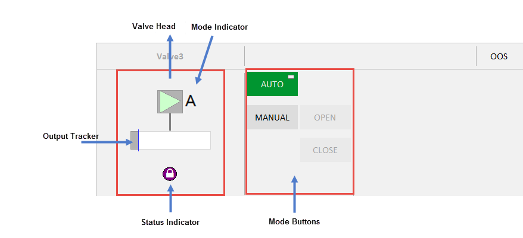    

The Simple Valve faceplate comprises the following components:

| Component                  | Description                                                  | Associated Tags                                              |
| :------------------------- | :----------------------------------------------------------- | :----------------------------------------------------------- |
| Valve Head                 | Valve Symbol associated with the selected equipment.         |                                                              |
| Mode Buttons               | Кнопки режиму зелені, коли режим активний, і сірі, коли неактивний. Коли тег CtrlMode, пов’язаний з обладнанням, дорівнює 0, режим – Автоматичний. Якщо тег дорівнює 1, режим ручний. Цей тег застосовується до кнопок «Авто» та «Вручну». Кнопка «Режим» відображає два символи: коло у верхньому лівому куті вказує, що команда була надіслана до пов’язаного ПЛК. Інакше цей індикатор не видно. Прямокутник у верхньому правому куті вказує, що поточний режим є нормальним режимом роботи обладнання. Відображається на кнопках Auto/Manual, прямокутник залежить від «CtrlModeDef». Доступні такі кнопки режиму: | [CtrlMode, CtrlModeDef](file:///C:/Program Files (x86)/AVEVA Plant SCADA/Bin/Help/SCADA Help/Content/ASM_Valves.htm#ModeIndicator) AutoCmd    ManCmd |
|                            | Auto: Automatic mode                                         | [CtrlMode, CtrlModeDef](file:///C:/Program Files (x86)/AVEVA Plant SCADA/Bin/Help/SCADA Help/Content/ASM_Valves.htm#ModeIndicator)AutoCmd |
|                            | Manual: Manual mode                                          | [CtrlMode, CtrlModeDef](file:///C:/Program Files (x86)/AVEVA Plant SCADA/Bin/Help/SCADA Help/Content/ASM_Valves.htm#ModeIndicator)ManCmd |
|                            | Open: Open  mode - This is a toggle button that toggles the "OpenCmd". The Open  button is active (green) when ‘OpenCmd’ tag is 1. The button is disabled when the valve is in AUTO mode or the valve has an interlock/shutdown  condition preventing the valve from being operated. | OpenCmd                                                      |
|                            | Close: Close mode - This is a toggle button that toggles the "CloseCmd". The Close  button is active (green) when ‘Closedmd’ tag is 1.The button is disabled when the valve is in AUTO mode or the valve has an interlock/shutdown  condition preventing the valve from being closed. | CloseCmd                                                     |
| Mode Indicators            | Local, Manual, Auto and Cascade Mode. Local - Local Mode – field or MCC control only. Manual - Manual Mode - start/stop or valve position set by control room operator Auto Mode - start/stop and valve position set by control system, control operator sets Setpoint target. Cascade mode – control system sets setpoint target from another loop/logic. | [CtrlMode, CtrlModeDef](file:///C:/Program Files (x86)/AVEVA Plant SCADA/Bin/Help/SCADA Help/Content/ASM_Valves.htm#ModeIndicator) |
| Equipment Status Indicator | Displays if there is an abnormal status condition e.g. bad comms (stop IO server). | [EqStatus](file:///C:/Program Files (x86)/AVEVA Plant SCADA/Bin/Help/SCADA Help/Content/ASM_Status_Indicators.htm#EqStatus) |
| Output Tracker             | Blue line on output bar. The position of the output tracker is based on the ‘OPTrack’ tag and visible when ‘TrackDsp’ tag is 1. | [OPTrack](file:///C:/Program Files (x86)/AVEVA Plant SCADA/Bin/Help/SCADA Help/Content/ASM_Valves.htm#Valves_OPTrack)TrackDsp |

####  Complex Valve

The Complex Valve faceplate can be associated with  the Block Valve. 

**Note**: To use for other valve types, create a copy of the faceplate and update the valve type in the composite genie.

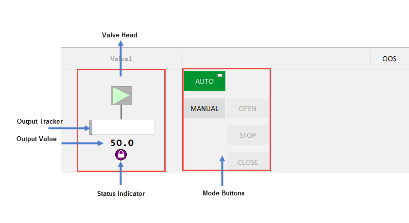    

The Complex Valve faceplate comprises the following components:

| Component                  | Description                                                  | Associated Tags                                              |
| :------------------------- | :----------------------------------------------------------- | :----------------------------------------------------------- |
| Valve Head                 | Valve Symbol associated with the selected equipment.         |                                                              |
| Mode buttons               | Auto, Manual, Open,  Close and Stop buttons are displayed on this faceplate.  The button is  green when a mode is active. When the tag associated with the equipment  is 0, the mode is Auto. When the tag is 1, the mode is Manual.The Control Mode button displays two symbols:    The circle  in the top-left corner indicates that a command has been sent to the  linked PLC. This indicator is not visible otherwise.    The  rectangle in the top-right corner indicates that the current mode is the normal mode of operation for the equipment. Displayed on the  Auto/Manual buttons, the rectangle depends on ‘CtrlModeDef’ | [CtrlMode, CtrlModeDef](file:///C:/Program Files (x86)/AVEVA Plant SCADA/Bin/Help/SCADA Help/Content/ASM_Valves.htm#ModeIndicator) |
|                            | Auto: Automatic mode                                         | [CtrlMode, CtrlModeDef](file:///C:/Program Files (x86)/AVEVA Plant SCADA/Bin/Help/SCADA Help/Content/ASM_Valves.htm#ModeIndicator)AutoCmd |
|                            | Manual: Manual mode                                          | [CtrlMode, CtrlModeDef](file:///C:/Program Files (x86)/AVEVA Plant SCADA/Bin/Help/SCADA Help/Content/ASM_Valves.htm#ModeIndicator)ManCmd |
|                            | Open: Open  mode - This is a toggle button that toggles the "OpenCmd". The Open  button is active (green) when ‘OpenCmd’ tag is 1. The button is disabled when the valve is in AUTO mode or the valve has an interlock/shutdown  condition preventing the valve from being operated. | OpenCmd                                                      |
|                            | Close: Close mode - This is a toggle button that toggles the "CloseCmd". The Close  button is active (green) when ‘Closedmd’ tag is 1.The button is disabled when the valve is in AUTO mode or the valve has an interlock/shutdown  condition preventing the valve from being closed. | CloseCmd                                                     |
|                            | Stop: Stop  mode - This is a toggle button that toggles the .The Stop button is  active (green )when ‘Stopped’ is 1. The button shall be disabled when  the valve is in AUTO mode. | StopCmd                                                      |
| Mode Indicators            | Local, Manual, Auto and Cascade Mode. Local - Local Mode – field or MCC control only. Manual - Manual Mode - start/stop or valve position set by control room operator Auto Mode - start/stop and valve position set by control system, control operator sets Setpoint target. Cascade mode – control system sets setpoint target from another loop/logic. | [CtrlMode, CtrlModeDef](file:///C:/Program Files (x86)/AVEVA Plant SCADA/Bin/Help/SCADA Help/Content/ASM_Valves.htm#ModeIndicator) |
| Equipment Status Indicator | Displays if there is an abnormal status condition e.g. bad comms (stop IO server). | [EqStatus](file:///C:/Program Files (x86)/AVEVA Plant SCADA/Bin/Help/SCADA Help/Content/ASM_Status_Indicators.htm#EqStatus) |
| Output Tracker             | Blue line on output bar. The position of the output tracker is based on the ‘OPTrack’ tag and visible when ‘TrackDsp’ tag is 1. | [OPTrack](file:///C:/Program Files (x86)/AVEVA Plant SCADA/Bin/Help/SCADA Help/Content/ASM_Valves.htm#Valves_OPTrack)TrackDsp |
| Output Value               | Number below the output bar . This uses the ‘OP’ tag which is the same for the output bar. The units of the OP will be displayed to the right of the number if configured. |                                                              |

 

