[Проект Situational Awareness](../README.md) -> [Situational Awareness Library](readme.md)

#### Meters

[Help](file:///C:/Program%20Files%20(x86)/AVEVA%20Plant%20SCADA/Bin/Help/SCADA%20Help/Content/ASM_Meters.htm)

Meters (вимірювачі) забезпечують графічне та числове відображення показань приладу. Графічне представлення дозволяє візуально порівнювати PV з контрольними значеннями, такими як межі тривоги та/або налаштовані користувачем опорні значення (наприклад, «трекер» або оптимальний діапазон). Багато вимірювачів мають варіації, які дозволяють також використовувати їх для представлення регулятору. Ці варіації включають додаткові елементи, такі як вихід (OP) та індикатор зворотного зв’язку (FB).

Ви можете вставити кілька екземплярів вимірювача в двох або трьох примірниках за допомогою  [MeterMultiple.xml  Composite Genie](file:///C:/Program Files (x86)/AVEVA Plant SCADA/Bin/Help/SCADA Help/Content/ASM_Meters_Multiple_Meter.htm). 

Вимірювачі пов’язані з обладнанням і вимагають визначення таких елементів: 

| Item Name                                                    | Description                                    |
| ------------------------------------------------------------ | ---------------------------------------------- |
| [FB](file:///C:/Program Files (x86)/AVEVA Plant SCADA/Bin/Help/SCADA Help/Content/ASM_COntrol_Meters_Common_Elements.htm#Meters_FB) | Feedback Indicator                             |
| [OP](file:///C:/Program Files (x86)/AVEVA Plant SCADA/Bin/Help/SCADA Help/Content/ASM_COntrol_Meters_Common_Elements.htm#Meters_OP) | Output                                         |
| [ORDsp](file:///C:/Program Files (x86)/AVEVA Plant SCADA/Bin/Help/SCADA Help/Content/ASM_Meters_Common_Elements.htm#Meters_OR) | Optimal Range Display                          |
| [ORLow](file:///C:/Program Files (x86)/AVEVA Plant SCADA/Bin/Help/SCADA Help/Content/ASM_Meters_Common_Elements.htm#Meters_OR) | Optimal Range (OR) Low                         |
| [ORHigh](file:///C:/Program Files (x86)/AVEVA Plant SCADA/Bin/Help/SCADA Help/Content/ASM_Meters_Common_Elements.htm#Meters_OR) | Optimal Range (OR) High                        |
| [PR](file:///C:/Program Files (x86)/AVEVA Plant SCADA/Bin/Help/SCADA Help/Content/ASM_Meters_Common_Elements.htm#Full_Range_Indicators) | Practical Range specific to Deviation meters   |
| [PRLow](file:///C:/Program Files (x86)/AVEVA Plant SCADA/Bin/Help/SCADA Help/Content/ASM_Meters_Common_Elements.htm#Full_Range_Indicators) | Practical Range (PR) Low                       |
| [PRHigh](file:///C:/Program Files (x86)/AVEVA Plant SCADA/Bin/Help/SCADA Help/Content/ASM_Meters_Common_Elements.htm#Full_Range_Indicators) | Practical Range (PR) High                      |
| [PV](file:///C:/Program Files (x86)/AVEVA Plant SCADA/Bin/Help/SCADA Help/Content/ASM_Meters_Common_Elements.htm#Meters_NumericPV) | Process Variable                               |
| [PVTarget](file:///C:/Program Files (x86)/AVEVA Plant SCADA/Bin/Help/SCADA Help/Content/ASM_Meters_Common_Elements.htm#Meters_NumericPV) | Process Variable specific to Target meters     |
| [PVTrack](file:///C:/Program Files (x86)/AVEVA Plant SCADA/Bin/Help/SCADA Help/Content/ASM_Meters_Common_Elements.htm#Meter_GraphicalPV) | Process ValueTracker                           |
| [SP](file:///C:/Program Files (x86)/AVEVA Plant SCADA/Bin/Help/SCADA Help/Content/ASM_COntrol_Meters_Common_Elements.htm#Meters_Setpoint) | Setpoint                                       |
| [TrackDsp](file:///C:/Program Files (x86)/AVEVA Plant SCADA/Bin/Help/SCADA Help/Content/ASM_Meters_Common_Elements.htm#Meters_Tracker) | Controls whether or not a tracker is displayed |

Об’єкти вимірювача, доступні в бібліотеці Situational Awareness, включають:

- [Analyzer](file:///C:/Program Files (x86)/AVEVA Plant SCADA/Bin/Help/SCADA Help/Content/ASM_Analyzer.htm)
- [Deviation](file:///C:/Program Files (x86)/AVEVA Plant SCADA/Bin/Help/SCADA Help/Content/ASM_Deviation.htm)
- [Dual Level](file:///C:/Program Files (x86)/AVEVA Plant SCADA/Bin/Help/SCADA Help/Content/ASM_Dual_Level.htm)
- [Flow](file:///C:/Program Files (x86)/AVEVA Plant SCADA/Bin/Help/SCADA Help/Content/ASM_Flow.htm)
- [Level](file:///C:/Program Files (x86)/AVEVA Plant SCADA/Bin/Help/SCADA Help/Content/ASM_Level.htm)
- [Miscellaneous](file:///C:/Program Files (x86)/AVEVA Plant SCADA/Bin/Help/SCADA Help/Content/ASM_Miscellaneous.htm)
- [Pressure ](file:///C:/Program Files (x86)/AVEVA Plant SCADA/Bin/Help/SCADA Help/Content/ASM_Pressure.htm)
- [Target](file:///C:/Program Files (x86)/AVEVA Plant SCADA/Bin/Help/SCADA Help/Content/ASM_Target_Meter.htm)
- [Temperature](file:///C:/Program Files (x86)/AVEVA Plant SCADA/Bin/Help/SCADA Help/Content/ASM_Temperature.htm)

##### Meter Orientations

Для більшості вимірювачів передбачено кілька орієнтацій, щоб надати розробникам сторінок гнучкість у тому, як викладена графіка.

**Mirrored**

Дзеркальний вимірювач змінює положення ліворуч і праворуч деяких елементів вимірювача, як показано в прикладі нижче. Впливають на положення індикатора робочого стану, стрілки швидкості зміни, PV, інженерних одиниць та індикатора режиму (для control meters).

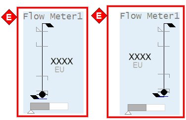    

**Horizontal**

Орієнтація вимірювача змінюється на горизонтальну, як показано в прикладі нижче. Зверніть увагу, що пропорції межі тривоги, символу вимірювача та індикатора виходу регулятору  дещо відрізняються для горизонтальної версії порівняно з вертикальною.

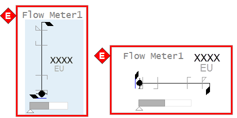    

**Horizontal + Mirrored**

Горизонтальні лічильники також можуть бути дзеркальними. Як правило, ця орієнтація використовується переважно зі звичайними лічильниками, а не контрольними.

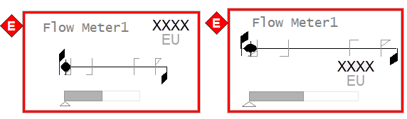    

##### Meter Common Elements

На малюнку нижче показаний приклад елементів, з яких складається метр.

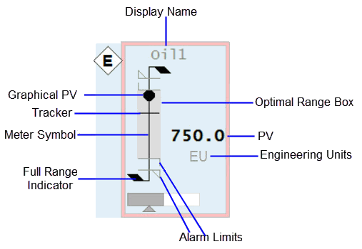    

**Meter Symbol and Graphical PV**

Графічний PV підключається до: `EquipmentName.PV`, `EquipmentName.PVTarget`

Зовнішній вигляд символу вимірювача та графічного PV повідомляє операторам, який тип показань відображається (потік проти температури та тиску тощо). Наприклад, витратоміри представлені як базова форма «палиці» з чорною крапкою як графічний PV. Температури нагадують термометр. Рівнеміри нагадують (тонку) посудину з заливкою, яка піднімається і опускається, щоб відобразити рівень, і так далі. Символи та PV для кожного типу лічильників показано на наступному зображенні.

| Analyzer Meter                              | Deviation Meter                              | Flow Meter                       | Level Meter                              | Misc Meter                              | Pressure Meter                       | Target Meter                              | Temperature Meter                |
| ------------------------------------------- | -------------------------------------------- | -------------------------------- | ---------------------------------------- | --------------------------------------- | ------------------------------------ | ----------------------------------------- | -------------------------------- |
|  |  |  | 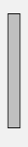 | 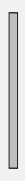 |  |  | 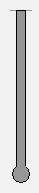 |

**Full Range Indicators**

Підключається до: `EquipmentName.PRHigh`, `EquipmentName.PRLow`, `EquipmentName.PR`

Кожен вимірювач дозволяє встановити «нормальний» робочий діапазон («практичний» діапазон). Під час більшості робочих ситуацій повний діапазон вимірювача набагато більше, ніж фактична область інтересу. Встановивши нормальний робочий діапазон, ви можете побачити значущі зміни в PV, дивлячись на вимірювач.

Пункт `EquipmentName.PR` застосовний лише до вимірювачів відхилень. PRHigh і PRLow не застосовуються до цих вимірювачів.

Якщо PV виходить за межі нормального робочого діапазону, шкала вимірювача автоматично зміниться, щоб відобразити весь діапазон приладу. Щоб розрізнити вимірювач, який показує весь діапазон, у верхній частині лічильника з’являються додаткові прапорці, а колір лінії символу лічильника змінюється з сірого на чорний, як у прикладі нижче:

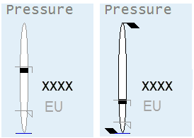    

**Alarm Limits**

Підключається до:  `EquipmentName.PV` (analog alarm - current) або (`EquipmentName.HHAlm`,  `EquipmentName.HAlm`, `EquipmentName.LAlm`, `EquipmentName.LLAlm`) або  PLC Alarm Limits if configured.

На символі вимірювача  з’являються індикатори ліміту тривоги, щоб показати розташування будь-яких налаштованих меж тривоги. Це дозволяє операторам бачити, коли PV наближається до межі тривоги. Чотири типи меж тривоги відображаються різними символами.

**Note**: Додаткову інформацію про налаштування лімітів тривоги ПЛК див [Associate PLC Limits with Equipment.](file:///C:/Program Files (x86)/AVEVA Plant SCADA/Bin/Help/SCADA Help/Content/Configure_PLC_Limits_with_Equipment.htm)

|                                          |                       |
| ---------------------------------------- | --------------------- |
|          | High high alarm limit |
|     | High alarm limit      |
|    | Low alarm limit       |
|  | Low Low alarm limit   |

Детальніше, див [Alarm Indicators](file:///C:/Program Files (x86)/AVEVA Plant SCADA/Bin/Help/SCADA Help/Content/Alarm_Indicator.htm).

Індикатор ліміту тривоги не з’явиться, якщо відповідне обмеження тривоги не налаштовано для приладу або якщо межа виходить за межі діапазону, показаного вимірвювачем. Зауважте, що точна ширина індикаторів ліміту тривоги дещо відрізняється для різних типів вимірювачів, щоб врахувати ширину символу вимірювача. Наприклад, індикатори ліміту тривоги ширші на рівнемірі, ніж на витратомірі.

**Engineering Units**

Підключається до: `EquipmentName.PV` (eng units field).

Інженерні одиниці представляють одиницю вимірювання для приладу.

**PV**

Connects to: EquipmentName.PV, EquipmentName.PVTarget

Числовий PV забезпечує текстове представлення показань приладу. Це надає операторам точні значення, коли це необхідно.

**Відображувальне значення/Nickname**

Відображуване ім’я/псевдонім показує назву інструменту (за замовчуванням) або, якщо введено користувачем, «відображаючу назву». Псевдонім зазвичай використовується, щоб допомогти ідентифікувати показання (наприклад, «Температура масла» замість «TI1001»). Поле вміщує до 79 символів.

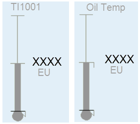    

**Optimal Range Box**

Connects to: EquipmentName.ORHigh, EquipmentName.ORLow, Visibility connected to EquipmentName.ORDsp.

Оптимальний діапазон виділяє певний діапазон вимірювача. Як правило, оператори використовують цю функцію, щоб нагадати собі про бажаний або «оптимальний» діапазон для PV, залежно від умов експлуатації. Повинна бути можливість увімкнути та встановити кінцеві точки для оптимального діапазону від деталей точки. Якщо оптимальний діапазон не встановлено або не ввімкнено, поле не відображається.

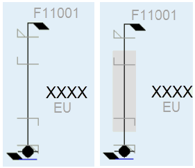    

**Tracker**

Connects to: EquipmentName.PVTrack, EquipmentName.OPTrack, EquipmentName.TrackDsp.

Подібно до коробки оптимального діапазону, трекер є налаштованим користувачем індикатором, який позначає конкретне значення на вимірювачі. Оператор може позначити поточне значення PV, щоб, коли вони пізніше знову переглянуть показання, вони могли побачити, чи змінилося воно. Трекер можна налаштувати та ввімкнути/вимкнути з передньої панелі вимірювача.

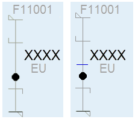    

#####  Керівні вимірювачі (Control Meters) - Common Elements

Коли вимірювач використовується для показу показань з регулятору, включається додаткова інформація. Керівні вимірювачі включають усі [загальні елементи](file:///C:/Program Files (x86)/AVEVA Plant SCADA/Bin/Help/SCADA Help/Content/ASM_Meters_Common_Elements.htm), описані раніше для звичайних вимірювачів, а також додаткові елементи, показані нижче.

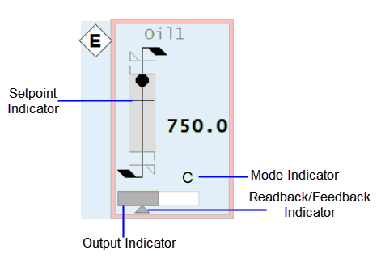    

**Setpoint Indicator**

Connects to: EquipmentName.SP

Індикатор уставки — це додаткова позначка на символі вимірювача (подібна до індикаторів трекера та ліміту тривоги), яка показує положення заданого значення регулятору.

**Output Indicator**

Connects to: EquipmentName.OP

Форма зовнішнього прямокутника з білою заливкою представляє весь діапазон [виводу регулятору](file:///C:/Program Files (x86)/AVEVA Plant SCADA/Bin/Help/SCADA Help/Content/ASM_OutputBar_Indicator.htm) ( зазвичай 0-100%), тоді як темніша заливка представляє вихідне значення.

**Feedback Indicator**

Connects to: EquipmentName.FB

Цей невеликий трикутний індикатор представляє фактичний вихід для регулятору (якщо доступний з системи керування). Він має ту саму шкалу, що і індикатор виходу регулятору (наприклад, 0-100%). Це дозволяє оператору швидко побачити, чи збігаються вихідні та фактичні вихідні значення. Це може бути особливо корисно, коли регулятор має функцію наростання.

**Mode Indicator**

Connects to: EquipmentName.CtrlMode, EquipmentName.CtrlModeDef

Це односимвольний код, який вказує на режим роботи регулятору. Як правило, набір режимів включає ручний (M), автоматичний (A) і каскадний (C).

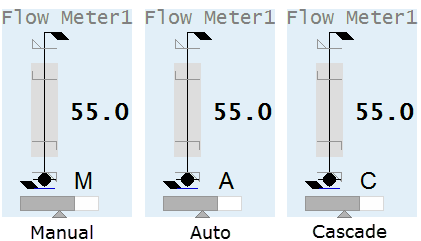    

**Control Mode Indicator states**:

- 0 – Auto (A)
- 1 – Manual (M)
- 2 – Cascade (C)
- 3 – Local (L)
- 4 – Special control (computer symbol)

**Примітка**: Індикатор режиму не відображається, якщо для тега встановлено значення CtrlModeDef. Щоб постійно переглядати режим керування, видаліть тег CtrlModeDef із шаблону обладнання.

##### Meter Special Elements

Деякі вимірювачі можуть мати елементи на додаток до описаних у [Загальні елементи вимірювача](file:///C:/Program Files (x86)/AVEVA Plant SCADA/Bin/Help/SCADA Help/Content/ASM_Meters_Common_Elements.htm). Є три спеціальні елементи.

**Differential Indicator**

Символ дельта (Δ) використовується для вимірювачів температури та тиску, щоб вказати, коли відображаються диференціальні показання. Це статичний елемент, який включається при конфігурації і не підключається до системи керування. Він складається з простого трикутника, який розміщений поруч із лічильником.

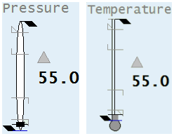    

**Descriptor**

The Miscellaneous,  Deviation, and Analyzer meters can all be used to show many different  types of readings. Therefore, it is recommended that short text  (up to 3 characters) is provided to help identify the reading (e.g., “O2” for  Oxygen content, “SG” for density, “Vis” for viscosity, “Trq” for torque, etc.) .  

Вимірники Miscellaneous, Deviation та Analyzer  можуть використовуватися для відображення різних типів показань. Тому рекомендується надавати короткий текст (до 3 символів), щоб допомогти визначити показання (наприклад, “O2” для вмісту кисню, “SG” для густини, «Vis» для в’язкості, «Trq» для крутного моменту тощо .) .

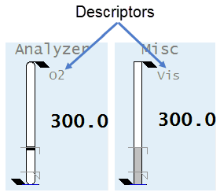    

**Clock Timer**

Connects to: EquipmentName.Timer, EquipmentName.TimerEXP

Таймер годинника є незалежним об'єктом, який інтегрований з вимірювальними приладами Analyzer. Його можна використовувати в тих випадках, коли аналізатор показує переривчасті показання зразка. Для цих типів показань таймер годинника показує, як давно значення було оновлено. Це допомагає операторам зрозуміти, наскільки поточне значення. Якщо аналізатор зчитує безперервно, таймер годинника не відображається.

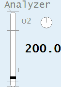    

##### Analyzer Meter

| Property                                        | Description                                                  |
| :---------------------------------------------- | :----------------------------------------------------------- |
| Name                                            | Analyzer                                                     |
| Graphical Representation                        | 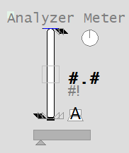                        |
| Example Equipment Template                      | Meter                                                        |
| Associated Composite Genie                      | Meter.xml                                                    |
| Equipment.Items that the Genie expects          | [OP](file:///C:/Program Files (x86)/AVEVA Plant SCADA/Bin/Help/SCADA Help/Content/ASM_COntrol_Meters_Common_Elements.htm#Meters_OP)[ORHigh, ORLow, ORDsp](file:///C:/Program Files (x86)/AVEVA Plant SCADA/Bin/Help/SCADA Help/Content/ASM_Meters_Common_Elements.htm#Meters_OR)[PRHigh, PRLow](file:///C:/Program Files (x86)/AVEVA Plant SCADA/Bin/Help/SCADA Help/Content/ASM_Meters_Common_Elements.htm#Full_Range_Indicators)[PVTrack](file:///C:/Program Files (x86)/AVEVA Plant SCADA/Bin/Help/SCADA Help/Content/ASM_Meters_Common_Elements.htm#Meters_Tracker)[PV](file:///C:/Program Files (x86)/AVEVA Plant SCADA/Bin/Help/SCADA Help/Content/ASM_Meters_Common_Elements.htm#Meter_GraphicalPV)[SP](file:///C:/Program Files (x86)/AVEVA Plant SCADA/Bin/Help/SCADA Help/Content/ASM_COntrol_Meters_Common_Elements.htm#Meters_Setpoint)[FB](file:///C:/Program Files (x86)/AVEVA Plant SCADA/Bin/Help/SCADA Help/Content/ASM_COntrol_Meters_Common_Elements.htm#Meters_FB)[CtrlMode, CtrlModeDef](file:///C:/Program Files (x86)/AVEVA Plant SCADA/Bin/Help/SCADA Help/Content/ASM_COntrol_Meters_Common_Elements.htm#Meters_Mode)[RunStatus](file:///C:/Program Files (x86)/AVEVA Plant SCADA/Bin/Help/SCADA Help/Content/ASM_MeO_States.htm#RunStatus_Tag)[EqStatus](file:///C:/Program Files (x86)/AVEVA Plant SCADA/Bin/Help/SCADA Help/Content/ASM_Status_Indicators.htm#EqStatus)[TrackDsp](file:///C:/Program Files (x86)/AVEVA Plant SCADA/Bin/Help/SCADA Help/Content/ASM_Meters_Common_Elements.htm#Meters_Tracker)[Timer, TimerExp](file:///C:/Program Files (x86)/AVEVA Plant SCADA/Bin/Help/SCADA Help/Content/ASM_Meters_Special_Elements.htm#Meters_Timer) |
| Equipment Parameters the Equipment Items Expect | [InternalIODevice](file:///C:/Program Files (x86)/AVEVA Plant SCADA/Bin/Help/SCADA Help/Content/Situational_Awareness_Equipment_Parameters.htm#Param_InternalIODevice)[CicodeIODevice](file:///C:/Program Files (x86)/AVEVA Plant SCADA/Bin/Help/SCADA Help/Content/Situational_Awareness_Equipment_Parameters.htm#Param_CicodeIODevice)[EqStatusFunc](file:///C:/Program Files (x86)/AVEVA Plant SCADA/Bin/Help/SCADA Help/Content/Situational_Awareness_Equipment_Parameters.htm#Param_EqStatusFunc)[CtrlMode](file:///C:/Program Files (x86)/AVEVA Plant SCADA/Bin/Help/SCADA Help/Content/Situational_Awareness_Equipment_Parameters.htm#Param_CtrlMode)[Range](file:///C:/Program Files (x86)/AVEVA Plant SCADA/Bin/Help/SCADA Help/Content/Situational_Awareness_Equipment_Parameters.htm#Param_Range)[Alarm Limits](file:///C:/Program Files (x86)/AVEVA Plant SCADA/Bin/Help/SCADA Help/Content/Situational_Awareness_Equipment_Parameters.htm#Param_Alarm) |
| Associated Faceplate(s)                         | [Analog Controller](file:///C:/Program Files (x86)/AVEVA Plant SCADA/Bin/Help/SCADA Help/Content/SA_FP_Analog_Controller.htm)[Analog Indicator](file:///C:/Program Files (x86)/AVEVA Plant SCADA/Bin/Help/SCADA Help/Content/SA_FP_Analog_Indicator.htm) |
| Equipment.Items that the Faceplate Expects      | [OP](file:///C:/Program Files (x86)/AVEVA Plant SCADA/Bin/Help/SCADA Help/Content/ASM_COntrol_Meters_Common_Elements.htm#Meters_OP)[ORHigh, ORLow, ORDsp](file:///C:/Program Files (x86)/AVEVA Plant SCADA/Bin/Help/SCADA Help/Content/ASM_Meters_Common_Elements.htm#Meters_OR)[PRHigh, PRLow](file:///C:/Program Files (x86)/AVEVA Plant SCADA/Bin/Help/SCADA Help/Content/ASM_Meters_Common_Elements.htm#Full_Range_Indicators)[OPTrack, PVTrack, TrackDsp](file:///C:/Program Files (x86)/AVEVA Plant SCADA/Bin/Help/SCADA Help/Content/ASM_Meters_Common_Elements.htm#Meters_Tracker)[PV](file:///C:/Program Files (x86)/AVEVA Plant SCADA/Bin/Help/SCADA Help/Content/ASM_Meters_Common_Elements.htm#Meters_NumericPV)[SP](file:///C:/Program Files (x86)/AVEVA Plant SCADA/Bin/Help/SCADA Help/Content/ASM_COntrol_Meters_Common_Elements.htm#Meters_Setpoint)[CtrlMode, CtrlModeDef](file:///C:/Program Files (x86)/AVEVA Plant SCADA/Bin/Help/SCADA Help/Content/ASM_COntrol_Meters_Common_Elements.htm#Meters_Mode)AutoCmd, ManCmd, CasCmd    [RunStatus](file:///C:/Program Files (x86)/AVEVA Plant SCADA/Bin/Help/SCADA Help/Content/ASM_MeO_States.htm#RunStatus_Tag)[OOS, OOSDisabled](file:///C:/Program Files (x86)/AVEVA Plant SCADA/Bin/Help/SCADA Help/Content/ASM_MeO_States.htm#OOS_Tags) |

**Configuration Tasks**

- [Create equipment and organize equipment in a hierarchy](file:///C:/Program Files (x86)/AVEVA Plant SCADA/Bin/Help/SCADA Help/Content/Situational_Awareness_Add_Equipment_Using_Equipment_Editor.htm): Create equipment instances for the required objects, and organize the  equipment in a hierarchy. Objects can be referred to by their name when  you add Composite Genies to a graphics page. You can add one or more instances of an equipment to a page.
- [Associate PLC Alarm Limits for Meters](file:///C:/Program Files (x86)/AVEVA Plant SCADA/Bin/Help/SCADA Help/Content/Configure_PLC_Limits_with_Equipment.htm): This is an optional task that is required if you want to use PLC alarm limits instead of the standard analog alarm limits.
- [Insert a Composite Genie](file:///C:/Program Files (x86)/AVEVA Plant SCADA/Bin/Help/SCADA Help/Content/Insert_a_Composite_Genie.htm): Create graphics pages with instances of [Composite Genies](file:///C:/Program Files (x86)/AVEVA Plant SCADA/Bin/Help/SCADA Help/Content/Composite_Genies.htm) that are associated with the  equipment you have defined in your project. 
- [Create a new faceplate](file:///C:/Program Files (x86)/AVEVA Plant SCADA/Bin/Help/SCADA Help/Content/SA_Create_A_New_FP.htm): Add a [faceplate](file:///C:/Program Files (x86)/AVEVA Plant SCADA/Bin/Help/SCADA Help/Content/SA_Library_Faceplates.htm) for the equipment to allow operators to engage with the equipment at runtime.    
- Write Cicode functions to initialize PR and OR values. Refer to the Cicode Reference Online help for more information. It is recommended that for a  Dual Level meter you set these values on both meters to the same value. 

**Presentation Options**

The following presentation options are available for this object.

| Option                          | Description                                                  |
| ------------------------------- | ------------------------------------------------------------ |
| Meter Type                      | From the  drop-down select one of the following meters: Level, Flow, Temperature,  Pressure, Analyzer, Miscellaneous, Target, Deviation and Dual Level |
| Equipment Name                  | Enter a name for the equipment associated with the meter. You can enter a maximum of 160 characters for this option. |
| Equipment Item Prefix           | Prefix applied to the equipment  item name. This allows for displaying multiple values for a single piece of equipment. For example, you want to create three meters to monitor  power, voltage and current  for a single pump. You would create three  meters on the pump and assign the equipment item prefix "Power",  "Voltage" and "Current". So, the PV values for the meters would be  PowerPV, VoltagePV and CurrentPV respectively.**Note**: To get a meter with a prefix to work correctly, you need to create tags with the required  item names. From the example above, you will need to create the tags  PowerPV, PowerOP, VoltagePV, VoltageOP, CurrentPV, CurrentOP and so on.The following equipment item names (where applicable) can be prefixed:    FB    FullScale    OP    ORDsp    ORLow    ORHigh    PRLow    PRHigh    PV    PVTrack    PVTarget     SP    Timer    TrackDsp |
| Size                            | Size of the meter object image - small or large              |
| Orientation                     | Select the orientation that is appropriate for the presentation of the object on the graphics page. |
| Display Label                   | Use this setting to display a label at the selected position. Select **None** if you do not want to display a label. |
| Label                           | Enter the text that will display at the location specified in **Display Label** field. You can enter a maximum of 30 characters for this option. |
| Display Alarm Indicator         | Select this option to display an alarm border around the  Genie. |
| Display Alarm Flag              | Use this setting to display an alarm flag at the selected position. **Note:** If you select the same position for the alarm flag and **Display Status** indicator (see below), they will overlap. The alarm flag will not be visible. |
| Display Status Indicator        | Use this setting to display a status indicator at the selected location. Select **None** if you do not want to display the status indicator. For more information, see [Status Indicators](file:///C:/Program Files (x86)/AVEVA Plant SCADA/Bin/Help/SCADA Help/Content/ASM_Status_Indicators.htm). |
| Display Process Variable        | Select to display a process variable (numeric PV) with the meter. This option is selected by default. |
| Display Control Mode            | Select this option to display the [Controller Mode Indicator](file:///C:/Program Files (x86)/AVEVA Plant SCADA/Bin/Help/SCADA Help/Content/ASM_COntrol_Meters_Common_Elements.htm). On selecting this option the **Display Control Readback** option box is also displayed. The [Display Control Readback Indicator](file:///C:/Program Files (x86)/AVEVA Plant SCADA/Bin/Help/SCADA Help/Content/ASM_COntrol_Meters_Common_Elements.htm) represents the actual output for the controller. |
| Display Controller Output       | Select to display an output indicator with the meter. For more information, see [Output Bar](file:///C:/Program Files (x86)/AVEVA Plant SCADA/Bin/Help/SCADA Help/Content/ASM_OutputBar_Indicator.htm). |
| Display Setpoint                | Select to display a setpoint indicator with the meter.       |
| Display OOS                     | Select to display Out of Service indicator.                  |
| Display Differential Indication | Select to display an indicator when a differential reading is detected. **This is visible only on Pressure and Temperature meters**. For more information, see [Meter Special Elements](file:///C:/Program Files (x86)/AVEVA Plant SCADA/Bin/Help/SCADA Help/Content/ASM_Meters_Special_Elements.htm). |
| Descriptor                      | Enter a short 3-character text descriptor  to indicate what is being measured. If left blank no descriptor will be displayed. **This is visible only on Miscellaneous, Deviation and Analyzer meters**. |
| Display Clock Timer             | Select to display a clock timer on the meter. **This is  visible only on Analyzer meters**. For more information, see [Meter Special Elements](file:///C:/Program Files (x86)/AVEVA Plant SCADA/Bin/Help/SCADA Help/Content/ASM_Meters_Special_Elements.htm). |
| Display Control Readback        | Select to display a readback indicator (also known as feedback indicator) with the meter. |
| Display Trend                   | Select this option to display a [Trend object](file:///C:/Program Files (x86)/AVEVA Plant SCADA/Bin/Help/SCADA Help/Content/ASM_Trends.htm) with the meter. On selecting this option, the **Trend Type** dropdown is displayed. Select either **Tail** or **Full**.**Note**: When the **Display Trend** option is selected, the Mirrored option is not available. |
| Trend Type                      | Select the type of trend to be displayed with the meter: [Tail](file:///C:/Program Files (x86)/AVEVA Plant SCADA/Bin/Help/SCADA Help/Content/ASM_Trend_Tail.htm) or [Full](file:///C:/Program Files (x86)/AVEVA Plant SCADA/Bin/Help/SCADA Help/Content/ASM_Full_Trend.htm). |
| Mirrored                        | Inserts a mirror image of the meter based on the selected presentation options. |

##### Deviation Meter

The deviation meter is used to represent  the difference between two values. A positive difference is shown as a  bar  extending upwards from the middle of the meter symbol. A negative  difference extends downwards. The configured input range for the  deviation meter needs to be in equal proportions around a zero (for  example -200 to +200 or -50 to +50). The PV will be shown as a deviation from setpoint, where zero=setpoint. If the PV exceeds this range, the  color of the bar will change to black.

| Property                                        | Description                                                  |
| :---------------------------------------------- | :----------------------------------------------------------- |
| Name                                            | Deviation                                                    |
| Graphical Representation                        | 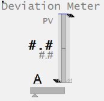                          |
| Example Equipment Template                      | DeviationMeter                                               |
| Associated Composite Genie                      | Meter.xml                                                    |
| Equipment.Items that the Genie expects          | [OP](file:///C:/Program Files (x86)/AVEVA Plant SCADA/Bin/Help/SCADA Help/Content/ASM_COntrol_Meters_Common_Elements.htm#Meters_OP)[ORHigh, ORLow, ORDsp](file:///C:/Program Files (x86)/AVEVA Plant SCADA/Bin/Help/SCADA Help/Content/ASM_Meters_Common_Elements.htm#Meters_OR)[PR](file:///C:/Program Files (x86)/AVEVA Plant SCADA/Bin/Help/SCADA Help/Content/ASM_Meters_Common_Elements.htm#Full_Range_Indicators)[PVTrack](file:///C:/Program Files (x86)/AVEVA Plant SCADA/Bin/Help/SCADA Help/Content/ASM_Meters_Common_Elements.htm#Meters_Tracker)[PV](file:///C:/Program Files (x86)/AVEVA Plant SCADA/Bin/Help/SCADA Help/Content/ASM_Meters_Common_Elements.htm#Meter_GraphicalPV)[SP](file:///C:/Program Files (x86)/AVEVA Plant SCADA/Bin/Help/SCADA Help/Content/ASM_COntrol_Meters_Common_Elements.htm#Meters_Setpoint)[FB](file:///C:/Program Files (x86)/AVEVA Plant SCADA/Bin/Help/SCADA Help/Content/ASM_COntrol_Meters_Common_Elements.htm#Meters_FB)[CtrlMode, CtrlModeDef](file:///C:/Program Files (x86)/AVEVA Plant SCADA/Bin/Help/SCADA Help/Content/ASM_COntrol_Meters_Common_Elements.htm#Meters_Mode)[RunStatus](file:///C:/Program Files (x86)/AVEVA Plant SCADA/Bin/Help/SCADA Help/Content/ASM_MeO_States.htm#RunStatus_Tag)[EqStatus](file:///C:/Program Files (x86)/AVEVA Plant SCADA/Bin/Help/SCADA Help/Content/ASM_Status_Indicators.htm#EqStatus)[TrackDsp](file:///C:/Program Files (x86)/AVEVA Plant SCADA/Bin/Help/SCADA Help/Content/ASM_Meters_Common_Elements.htm#Meters_Tracker) |
| Equipment Parameters the Equipment Items Expect | [InternalIODevice](file:///C:/Program Files (x86)/AVEVA Plant SCADA/Bin/Help/SCADA Help/Content/Situational_Awareness_Equipment_Parameters.htm#Param_InternalIODevice)[CicodeIODevice](file:///C:/Program Files (x86)/AVEVA Plant SCADA/Bin/Help/SCADA Help/Content/Situational_Awareness_Equipment_Parameters.htm#Param_CicodeIODevice)[EqStatusFunc](file:///C:/Program Files (x86)/AVEVA Plant SCADA/Bin/Help/SCADA Help/Content/Situational_Awareness_Equipment_Parameters.htm#Param_EqStatusFunc)[CtrlMode](file:///C:/Program Files (x86)/AVEVA Plant SCADA/Bin/Help/SCADA Help/Content/Situational_Awareness_Equipment_Parameters.htm#Param_CtrlMode)[Range](file:///C:/Program Files (x86)/AVEVA Plant SCADA/Bin/Help/SCADA Help/Content/Situational_Awareness_Equipment_Parameters.htm#Param_Range)[Alarm Limits](file:///C:/Program Files (x86)/AVEVA Plant SCADA/Bin/Help/SCADA Help/Content/Situational_Awareness_Equipment_Parameters.htm#Param_Alarm) |
| Associated Faceplate(s)                         | [Analog Controller](file:///C:/Program Files (x86)/AVEVA Plant SCADA/Bin/Help/SCADA Help/Content/SA_FP_Analog_Controller.htm)[Analog Indicator](file:///C:/Program Files (x86)/AVEVA Plant SCADA/Bin/Help/SCADA Help/Content/SA_FP_Analog_Indicator.htm) |
| Equipment.Items that the Faceplate Expects      | [OP](file:///C:/Program Files (x86)/AVEVA Plant SCADA/Bin/Help/SCADA Help/Content/ASM_COntrol_Meters_Common_Elements.htm#Meters_OP)[ORHigh, ORLow, ORDsp](file:///C:/Program Files (x86)/AVEVA Plant SCADA/Bin/Help/SCADA Help/Content/ASM_Meters_Common_Elements.htm#Meters_OR)[PRHigh, PRLow](file:///C:/Program Files (x86)/AVEVA Plant SCADA/Bin/Help/SCADA Help/Content/ASM_Meters_Common_Elements.htm#Full_Range_Indicators)[OPTrack, PVTrack, TrackDsp](file:///C:/Program Files (x86)/AVEVA Plant SCADA/Bin/Help/SCADA Help/Content/ASM_Meters_Common_Elements.htm#Meters_Tracker)[PV](file:///C:/Program Files (x86)/AVEVA Plant SCADA/Bin/Help/SCADA Help/Content/ASM_Meters_Common_Elements.htm#Meters_NumericPV)[SP](file:///C:/Program Files (x86)/AVEVA Plant SCADA/Bin/Help/SCADA Help/Content/ASM_COntrol_Meters_Common_Elements.htm#Meters_Setpoint)[CtrlMode, CtrlModeDef](file:///C:/Program Files (x86)/AVEVA Plant SCADA/Bin/Help/SCADA Help/Content/ASM_COntrol_Meters_Common_Elements.htm#Meters_Mode)AutoCmd, ManCmd, CasCmd    [RunStatus](file:///C:/Program Files (x86)/AVEVA Plant SCADA/Bin/Help/SCADA Help/Content/ASM_MeO_States.htm#RunStatus_Tag)[OOS, OOSDisabled](file:///C:/Program Files (x86)/AVEVA Plant SCADA/Bin/Help/SCADA Help/Content/ASM_MeO_States.htm#OOS_Tags) |

**Configuration Tasks**

- [Create equipment and organize equipment in a hierarchy](file:///C:/Program Files (x86)/AVEVA Plant SCADA/Bin/Help/SCADA Help/Content/Situational_Awareness_Add_Equipment_Using_Equipment_Editor.htm): Create equipment instances for the required objects, and organize the  equipment in a hierarchy. Objects can be referred to by their name when  you add Composite Genies to a graphics page. You can add one or more instances of an equipment to a page.
- [Associate PLC Alarm Limits for Meters](file:///C:/Program Files (x86)/AVEVA Plant SCADA/Bin/Help/SCADA Help/Content/Configure_PLC_Limits_with_Equipment.htm): This is an optional task that is required if you want to use PLC alarm limits instead of the standard analog alarm limits.
- [Insert a Composite Genie](file:///C:/Program Files (x86)/AVEVA Plant SCADA/Bin/Help/SCADA Help/Content/Insert_a_Composite_Genie.htm): Create graphics pages with instances of [Composite Genies](file:///C:/Program Files (x86)/AVEVA Plant SCADA/Bin/Help/SCADA Help/Content/Composite_Genies.htm) that are associated with the  equipment you have defined in your project. 
- [Create a new faceplate](file:///C:/Program Files (x86)/AVEVA Plant SCADA/Bin/Help/SCADA Help/Content/SA_Create_A_New_FP.htm): Add a [faceplate](file:///C:/Program Files (x86)/AVEVA Plant SCADA/Bin/Help/SCADA Help/Content/SA_Library_Faceplates.htm) for the equipment to allow operators to engage with the equipment at runtime.    
- Write Cicode functions to initialize PR and OR values. Refer to the Cicode Reference Online help for more information. It is recommended that for a  Dual Level meter you set these values on both meters to the same value. 

**Presentation Options**

The following presentation options are available for this object.

| Option                          | Description                                                  |
| ------------------------------- | ------------------------------------------------------------ |
| Meter Type                      | From the  drop-down select one of the following meters: Level, Flow, Temperature,  Pressure, Analyzer, Miscellaneous, Target, Deviation and Dual Level |
| Equipment Name                  | Enter a name for the equipment associated with the meter. You can enter a maximum of 160 characters for this option. |
| Equipment Item Prefix           | Prefix applied to the equipment  item name. This allows for displaying multiple values for a single piece of equipment. For example, you want to create three meters to monitor  power, voltage and current  for a single pump. You would create three  meters on the pump and assign the equipment item prefix "Power",  "Voltage" and "Current". So, the PV values for the meters would be  PowerPV, VoltagePV and CurrentPV respectively.**Note**: To get a meter with a prefix to work correctly, you need to create tags with the required  item names. From the example above, you will need to create the tags  PowerPV, PowerOP, VoltagePV, VoltageOP, CurrentPV, CurrentOP and so on.The following equipment item names (where applicable) can be prefixed:    FB    FullScale    OP    ORDsp    ORLow    ORHigh    PRLow    PRHigh    PV    PVTrack    PVTarget     SP    Timer    TrackDsp |
| Size                            | Size of the meter object image - small or large              |
| Orientation                     | Select the orientation that is appropriate for the presentation of the object on the graphics page. |
| Display Label                   | Use this setting to display a label at the selected position. Select **None** if you do not want to display a label. |
| Label                           | Enter the text that will display at the location specified in **Display Label** field. You can enter a maximum of 30 characters for this option. |
| Display Alarm Indicator         | Select this option to display an alarm border around the  Genie. |
| Display Alarm Flag              | Use this setting to display an alarm flag at the selected position. **Note:** If you select the same position for the alarm flag and **Display Status** indicator (see below), they will overlap. The alarm flag will not be visible. |
| Display Status Indicator        | Use this setting to display a status indicator at the selected location. Select **None** if you do not want to display the status indicator. For more information, see [Status Indicators](file:///C:/Program Files (x86)/AVEVA Plant SCADA/Bin/Help/SCADA Help/Content/ASM_Status_Indicators.htm). |
| Display Process Variable        | Select to display a process variable (numeric PV) with the meter. This option is selected by default. |
| Display Control Mode            | Select this option to display the [Controller Mode Indicator](file:///C:/Program Files (x86)/AVEVA Plant SCADA/Bin/Help/SCADA Help/Content/ASM_COntrol_Meters_Common_Elements.htm). On selecting this option the **Display Control Readback** option box is also displayed. The [Display Control Readback Indicator](file:///C:/Program Files (x86)/AVEVA Plant SCADA/Bin/Help/SCADA Help/Content/ASM_COntrol_Meters_Common_Elements.htm) represents the actual output for the controller. |
| Display Controller Output       | Select to display an output indicator with the meter. For more information, see [Output Bar](file:///C:/Program Files (x86)/AVEVA Plant SCADA/Bin/Help/SCADA Help/Content/ASM_OutputBar_Indicator.htm). |
| Display Setpoint                | Select to display a setpoint indicator with the meter.       |
| Display OOS                     | Select to display Out of Service indicator.                  |
| Display Differential Indication | Select to display an indicator when a differential reading is detected. **This is visible only on Pressure and Temperature meters**. For more information, see [Meter Special Elements](file:///C:/Program Files (x86)/AVEVA Plant SCADA/Bin/Help/SCADA Help/Content/ASM_Meters_Special_Elements.htm). |
| Descriptor                      | Enter a short 3-character text descriptor  to indicate what is being measured. If left blank no descriptor will be displayed. **This is visible only on Miscellaneous, Deviation and Analyzer meters**. |
| Display Clock Timer             | Select to display a clock timer on the meter. **This is  visible only on Analyzer meters**. For more information, see [Meter Special Elements](file:///C:/Program Files (x86)/AVEVA Plant SCADA/Bin/Help/SCADA Help/Content/ASM_Meters_Special_Elements.htm). |
| Display Control Readback        | Select to display a readback indicator (also known as feedback indicator) with the meter. |
| Display Trend                   | Select this option to display a [Trend object](file:///C:/Program Files (x86)/AVEVA Plant SCADA/Bin/Help/SCADA Help/Content/ASM_Trends.htm) with the meter. On selecting this option, the **Trend Type** dropdown is displayed. Select either **Tail** or **Full**.**Note**: When the **Display Trend** option is selected, the Mirrored option is not available. |
| Trend Type                      | Select the type of trend to be displayed with the meter: [Tail](file:///C:/Program Files (x86)/AVEVA Plant SCADA/Bin/Help/SCADA Help/Content/ASM_Trend_Tail.htm) or [Full](file:///C:/Program Files (x86)/AVEVA Plant SCADA/Bin/Help/SCADA Help/Content/ASM_Full_Trend.htm). |
| Mirrored                        | Inserts a mirror image of the meter based on the selected presentation options. |

##### Dual Level Meter

This object provides a compact way to  monitor two related levels simultaneously. The level indication is  presented on a linear scale. For example, you could use a Dual Level  meter to indicate the levels of two tanks. One of the tanks is shown in a slightly darker shade of gray than the other. The Dual Level meter is  designed to display the values of two levels that share a common set of  scales (engineering range, practical range and alarm limits). 

**Note**: If you need to display the values of two levels with different scales, use the Multiple Meter. 

| Property                                        | Description                                                  |
| :---------------------------------------------- | :----------------------------------------------------------- |
| Name                                            | Dual Level                                                   |
| Graphical Representation                        | 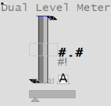                   |
| Example Equipment Template                      | Meter                                                        |
| Associated Composite Genie                      | Meter.xml                                                    |
| Equipment.Items that the Genie expects          | [OP](file:///C:/Program Files (x86)/AVEVA Plant SCADA/Bin/Help/SCADA Help/Content/ASM_COntrol_Meters_Common_Elements.htm#Meters_OP)[ORHigh, ORLow, ORDsp](file:///C:/Program Files (x86)/AVEVA Plant SCADA/Bin/Help/SCADA Help/Content/ASM_Meters_Common_Elements.htm#Meters_OR)[PRHigh, PRLow](file:///C:/Program Files (x86)/AVEVA Plant SCADA/Bin/Help/SCADA Help/Content/ASM_Meters_Common_Elements.htm#Full_Range_Indicators)[OPTrack, PVTrack](file:///C:/Program Files (x86)/AVEVA Plant SCADA/Bin/Help/SCADA Help/Content/ASM_Meters_Common_Elements.htm#Meters_Tracker)[PV](file:///C:/Program Files (x86)/AVEVA Plant SCADA/Bin/Help/SCADA Help/Content/ASM_Meters_Common_Elements.htm#Meter_GraphicalPV)[SP](file:///C:/Program Files (x86)/AVEVA Plant SCADA/Bin/Help/SCADA Help/Content/ASM_COntrol_Meters_Common_Elements.htm#Meters_Setpoint)[FB](file:///C:/Program Files (x86)/AVEVA Plant SCADA/Bin/Help/SCADA Help/Content/ASM_COntrol_Meters_Common_Elements.htm#Meters_FB)[CtrlMode, CtrlModeDef](file:///C:/Program Files (x86)/AVEVA Plant SCADA/Bin/Help/SCADA Help/Content/ASM_COntrol_Meters_Common_Elements.htm#Meters_Mode)[RunStatus](file:///C:/Program Files (x86)/AVEVA Plant SCADA/Bin/Help/SCADA Help/Content/ASM_MeO_States.htm#RunStatus_Tag)[EqStatus](file:///C:/Program Files (x86)/AVEVA Plant SCADA/Bin/Help/SCADA Help/Content/ASM_Status_Indicators.htm#EqStatus)[TrackDsp](file:///C:/Program Files (x86)/AVEVA Plant SCADA/Bin/Help/SCADA Help/Content/ASM_Meters_Common_Elements.htm#Meters_Tracker) |
| Equipment Parameters the Equipment Items Expect | [InternalIODevice](file:///C:/Program Files (x86)/AVEVA Plant SCADA/Bin/Help/SCADA Help/Content/Situational_Awareness_Equipment_Parameters.htm#Param_InternalIODevice)[CicodeIODevice](file:///C:/Program Files (x86)/AVEVA Plant SCADA/Bin/Help/SCADA Help/Content/Situational_Awareness_Equipment_Parameters.htm#Param_CicodeIODevice)[EqStatusFunc](file:///C:/Program Files (x86)/AVEVA Plant SCADA/Bin/Help/SCADA Help/Content/Situational_Awareness_Equipment_Parameters.htm#Param_EqStatusFunc)[CtrlMode](file:///C:/Program Files (x86)/AVEVA Plant SCADA/Bin/Help/SCADA Help/Content/Situational_Awareness_Equipment_Parameters.htm#Param_CtrlMode)[Range](file:///C:/Program Files (x86)/AVEVA Plant SCADA/Bin/Help/SCADA Help/Content/Situational_Awareness_Equipment_Parameters.htm#Param_Range)[Alarm Limits](file:///C:/Program Files (x86)/AVEVA Plant SCADA/Bin/Help/SCADA Help/Content/Situational_Awareness_Equipment_Parameters.htm#Param_Alarm) |
| Associated Faceplate(s)                         | [Analog Controller](file:///C:/Program Files (x86)/AVEVA Plant SCADA/Bin/Help/SCADA Help/Content/SA_FP_Analog_Controller.htm)[Analog Indicator](file:///C:/Program Files (x86)/AVEVA Plant SCADA/Bin/Help/SCADA Help/Content/SA_FP_Analog_Indicator.htm) |
| Equipment.Items that the Faceplate Expects      | [OP](file:///C:/Program Files (x86)/AVEVA Plant SCADA/Bin/Help/SCADA Help/Content/ASM_COntrol_Meters_Common_Elements.htm#Meters_OP)[ORHigh, ORLow, ORDsp](file:///C:/Program Files (x86)/AVEVA Plant SCADA/Bin/Help/SCADA Help/Content/ASM_Meters_Common_Elements.htm#Meters_OR)[PRHigh, PRLow](file:///C:/Program Files (x86)/AVEVA Plant SCADA/Bin/Help/SCADA Help/Content/ASM_Meters_Common_Elements.htm#Full_Range_Indicators)[OPTrack, PVTrack, TrackDsp](file:///C:/Program Files (x86)/AVEVA Plant SCADA/Bin/Help/SCADA Help/Content/ASM_Meters_Common_Elements.htm#Meters_Tracker)[PV](file:///C:/Program Files (x86)/AVEVA Plant SCADA/Bin/Help/SCADA Help/Content/ASM_Meters_Common_Elements.htm#Meters_NumericPV)[SP](file:///C:/Program Files (x86)/AVEVA Plant SCADA/Bin/Help/SCADA Help/Content/ASM_COntrol_Meters_Common_Elements.htm#Meters_Setpoint)[CtrlMode, CtrlModeDef](file:///C:/Program Files (x86)/AVEVA Plant SCADA/Bin/Help/SCADA Help/Content/ASM_COntrol_Meters_Common_Elements.htm#Meters_Mode)AutoCmd, ManCmd, CasCmd    [RunStatus](file:///C:/Program Files (x86)/AVEVA Plant SCADA/Bin/Help/SCADA Help/Content/ASM_MeO_States.htm#RunStatus_Tag)[OOS, OOSDisabled](file:///C:/Program Files (x86)/AVEVA Plant SCADA/Bin/Help/SCADA Help/Content/ASM_MeO_States.htm#OOS_Tags) |

**Configuration Tasks**

- [Create equipment and organize equipment in a hierarchy](file:///C:/Program Files (x86)/AVEVA Plant SCADA/Bin/Help/SCADA Help/Content/Situational_Awareness_Add_Equipment_Using_Equipment_Editor.htm): Create equipment instances for the required objects, and organize the  equipment in a hierarchy. Objects can be referred to by their name when  you add Composite Genies to a graphics page. You can add one or more instances of an equipment to a page.
- [Associate PLC Alarm Limits for Meters](file:///C:/Program Files (x86)/AVEVA Plant SCADA/Bin/Help/SCADA Help/Content/Configure_PLC_Limits_with_Equipment.htm): This is an optional task that is required if you want to use PLC alarm limits instead of the standard analog alarm limits.
- [Insert a Composite Genie](file:///C:/Program Files (x86)/AVEVA Plant SCADA/Bin/Help/SCADA Help/Content/Insert_a_Composite_Genie.htm): Create graphics pages with instances of [Composite Genies](file:///C:/Program Files (x86)/AVEVA Plant SCADA/Bin/Help/SCADA Help/Content/Composite_Genies.htm) that are associated with the  equipment you have defined in your project. 
- [Create a new faceplate](file:///C:/Program Files (x86)/AVEVA Plant SCADA/Bin/Help/SCADA Help/Content/SA_Create_A_New_FP.htm): Add a [faceplate](file:///C:/Program Files (x86)/AVEVA Plant SCADA/Bin/Help/SCADA Help/Content/SA_Library_Faceplates.htm) for the equipment to allow operators to engage with the equipment at runtime.    
- Write Cicode functions to initialize PR and OR values. Refer to the Cicode Reference Online help for more information. It is recommended that for a  Dual Level meter you set these values on both meters to the same value. 

**Presentation Options**

The following presentation options are available for this object.

| Option                                             | Description                                                  |
| -------------------------------------------------- | ------------------------------------------------------------ |
| Meter Type                                         | From the dropdown list, select Dual Level.                   |
| Reference Equipment Name                           | Enter the full  name and path for the equipment associated with the dual meter. The path and name should be prefixed with the equipment's cluster name for  multi-cluster systems. You can enter a maximum of 160 characters for  this option. |
| Equipment Name and Equipment #2 Name               | Enter the full name and path of the two equipment objects. You can enter a maximum of 160 characters for this option. |
| Equipment Item Prefix and Equipment #2 Item Prefix | Prefix applied to the equipment  item name. This allows for displaying multiple values for a single piece of equipment. For example, you want to create two meters to monitor  power or voltage  for a single pump. You would create two meters on the  pump and assign the equipment item prefix "Power1" and "Power2" or  "Voltage1" and "Voltage2". So, the PV values for the meters would be  Power1PV, Power2PV, etc, respectively.**Note**: To get a meter with a prefix to work correctly, you need to create tags with the required  item names. From the example above, you will need to create the tags  Power1PV, Power2PV and so on.The following equipment item names can be prefixed:    PV    OP    ORDsp    TrackDsp    FB    PRLow    PRHigh    ORLow    ORHigh    SP    PVTrack    FullScale    OPTrack    Timer    PVTarget |
| Size                                               | Size of the meter object image - small or large              |
| Orientation                                        | Select the orientation that is appropriate for the presentation of the object on the graphics page. |
| Display Label                                      | Use this setting to display a label at the selected position. Select **None** if you do not want to display a label. |
| Label                                              | Enter the text that will display at the location specified in **Display Label** field. You can enter a maximum of 30 characters for this option. |
| Display Status Indicator                           | Select the  location to display a status indicator. Select None if you do not wish  to see the status indicator. For more information, see [Status Indicators](file:///C:/Program Files (x86)/AVEVA Plant SCADA/Bin/Help/SCADA Help/Content/ASM_Status_Indicators.htm). |
| Display Process Variable                           | Select to display a process variable (numeric PV) with the meter. This option is selected by default. |
| Display Control Mode                               | Select this option to display the [Controller Mode Indicator](file:///C:/Program Files (x86)/AVEVA Plant SCADA/Bin/Help/SCADA Help/Content/ASM_COntrol_Meters_Common_Elements.htm). On selecting this option the “Display Control Readback” option box is also displayed. The [Display Control Readback Indicator](file:///C:/Program Files (x86)/AVEVA Plant SCADA/Bin/Help/SCADA Help/Content/ASM_COntrol_Meters_Common_Elements.htm) represents the actual output for the controller. |
| Display Controller Output                          | Select to display an output indicator with the meter. For more information, see [Output Ba](file:///C:/Program Files (x86)/AVEVA Plant SCADA/Bin/Help/SCADA Help/Content/ASM_OutputBar_Indicator.htm)r. |
| Display Setpoint                                   | Select to display a setpoint indicator with the meter.       |
| Display OOS                                        | Select to display Out of Service indicator.                  |
| Display Control Readback                           | Select to display a readback indicator (also known as feedback indicator) with the meter. |
| Mirrored                                           | Inserts a mirror image of the meter based on the selected presentation options. |

**Note**: The Control Mode, PV and OP bar take values only from **Equipment Name**. **Equipment Name #2** is only used to display the height of the second bar (the light grey bar).

##### Flow Meter

The flow indication is presented on a  linear scale, containing a “floating ball” PV indicator like commonly  found physical flow meters.  The meter limit markers  will appear only  if there are no alarm limits shown, in order to better define the meter  range visually.

| Property                                        | Description                                                  |
| :---------------------------------------------- | :----------------------------------------------------------- |
| Name                                            | Flow                                                         |
| Graphical Representation                        | /AVEVA%20Plant%20SCADA/Bin/Help/SCADA%20Help/Content/images/Meters_Flow_122x176.png) |
| Example Equipment Template                      | Meter                                                        |
| Associated Composite Genie                      | Meter.xml                                                    |
| Equipment.Items that the Genie expects          | [OP](file:///C:/Program Files (x86)/AVEVA Plant SCADA/Bin/Help/SCADA Help/Content/ASM_COntrol_Meters_Common_Elements.htm#Meters_OP)[ORHigh, ORLow, ORDsp](file:///C:/Program Files (x86)/AVEVA Plant SCADA/Bin/Help/SCADA Help/Content/ASM_Meters_Common_Elements.htm#Meters_OR)[PRHigh, PRLow](file:///C:/Program Files (x86)/AVEVA Plant SCADA/Bin/Help/SCADA Help/Content/ASM_Meters_Common_Elements.htm#Full_Range_Indicators)[OPTrack, PVTrack](file:///C:/Program Files (x86)/AVEVA Plant SCADA/Bin/Help/SCADA Help/Content/ASM_Meters_Common_Elements.htm#Meters_Tracker)[PV](file:///C:/Program Files (x86)/AVEVA Plant SCADA/Bin/Help/SCADA Help/Content/ASM_Meters_Common_Elements.htm#Meter_GraphicalPV)[SP](file:///C:/Program Files (x86)/AVEVA Plant SCADA/Bin/Help/SCADA Help/Content/ASM_COntrol_Meters_Common_Elements.htm#Meters_Setpoint)[FB](file:///C:/Program Files (x86)/AVEVA Plant SCADA/Bin/Help/SCADA Help/Content/ASM_COntrol_Meters_Common_Elements.htm#Meters_FB)[CtrlMode, CtrlModeDef](file:///C:/Program Files (x86)/AVEVA Plant SCADA/Bin/Help/SCADA Help/Content/ASM_COntrol_Meters_Common_Elements.htm#Meters_Mode)[RunStatus](file:///C:/Program Files (x86)/AVEVA Plant SCADA/Bin/Help/SCADA Help/Content/ASM_MeO_States.htm#RunStatus_Tag)[EqStatus](file:///C:/Program Files (x86)/AVEVA Plant SCADA/Bin/Help/SCADA Help/Content/ASM_Status_Indicators.htm#EqStatus)[TrackDsp](file:///C:/Program Files (x86)/AVEVA Plant SCADA/Bin/Help/SCADA Help/Content/ASM_Meters_Common_Elements.htm#Meters_Tracker)[Timer, TimerExp](file:///C:/Program Files (x86)/AVEVA Plant SCADA/Bin/Help/SCADA Help/Content/ASM_Meters_Special_Elements.htm#Meters_Timer) |
| Equipment Parameters the Equipment Items Expect | [InternalIODevice](file:///C:/Program Files (x86)/AVEVA Plant SCADA/Bin/Help/SCADA Help/Content/Situational_Awareness_Equipment_Parameters.htm#Param_InternalIODevice)[CicodeIODevice](file:///C:/Program Files (x86)/AVEVA Plant SCADA/Bin/Help/SCADA Help/Content/Situational_Awareness_Equipment_Parameters.htm#Param_CicodeIODevice)[EqStatusFunc](file:///C:/Program Files (x86)/AVEVA Plant SCADA/Bin/Help/SCADA Help/Content/Situational_Awareness_Equipment_Parameters.htm#Param_EqStatusFunc)[CtrlMode](file:///C:/Program Files (x86)/AVEVA Plant SCADA/Bin/Help/SCADA Help/Content/Situational_Awareness_Equipment_Parameters.htm#Param_CtrlMode)[Range](file:///C:/Program Files (x86)/AVEVA Plant SCADA/Bin/Help/SCADA Help/Content/Situational_Awareness_Equipment_Parameters.htm#Param_Range)[Alarm Limits](file:///C:/Program Files (x86)/AVEVA Plant SCADA/Bin/Help/SCADA Help/Content/Situational_Awareness_Equipment_Parameters.htm#Param_Alarm) |
| Associated Faceplate(s)                         | [Analog Controller](file:///C:/Program Files (x86)/AVEVA Plant SCADA/Bin/Help/SCADA Help/Content/SA_FP_Analog_Controller.htm)[Analog Indicator](file:///C:/Program Files (x86)/AVEVA Plant SCADA/Bin/Help/SCADA Help/Content/SA_FP_Analog_Indicator.htm) |
| Equipment.Items that the Faceplate Expects      | [OP](file:///C:/Program Files (x86)/AVEVA Plant SCADA/Bin/Help/SCADA Help/Content/ASM_COntrol_Meters_Common_Elements.htm#Meters_OP)[ORHigh, ORLow, ORDsp](file:///C:/Program Files (x86)/AVEVA Plant SCADA/Bin/Help/SCADA Help/Content/ASM_Meters_Common_Elements.htm#Meters_OR)[PRHigh, PRLow](file:///C:/Program Files (x86)/AVEVA Plant SCADA/Bin/Help/SCADA Help/Content/ASM_Meters_Common_Elements.htm#Full_Range_Indicators)[OPTrack, PVTrack, TrackDsp](file:///C:/Program Files (x86)/AVEVA Plant SCADA/Bin/Help/SCADA Help/Content/ASM_Meters_Common_Elements.htm#Meters_Tracker)[PV](file:///C:/Program Files (x86)/AVEVA Plant SCADA/Bin/Help/SCADA Help/Content/ASM_Meters_Common_Elements.htm#Meters_NumericPV)[SP](file:///C:/Program Files (x86)/AVEVA Plant SCADA/Bin/Help/SCADA Help/Content/ASM_COntrol_Meters_Common_Elements.htm#Meters_Setpoint)[CtrlMode, CtrlModeDef](file:///C:/Program Files (x86)/AVEVA Plant SCADA/Bin/Help/SCADA Help/Content/ASM_COntrol_Meters_Common_Elements.htm#Meters_Mode)AutoCmd, ManCmd, CasCmd    [RunStatus](file:///C:/Program Files (x86)/AVEVA Plant SCADA/Bin/Help/SCADA Help/Content/ASM_MeO_States.htm#RunStatus_Tag)[OOS, OOSDisabled](file:///C:/Program Files (x86)/AVEVA Plant SCADA/Bin/Help/SCADA Help/Content/ASM_MeO_States.htm#OOS_Tags) |

**Configuration Tasks**

- [Create equipment and organize equipment in a hierarchy](file:///C:/Program Files (x86)/AVEVA Plant SCADA/Bin/Help/SCADA Help/Content/Situational_Awareness_Add_Equipment_Using_Equipment_Editor.htm): Create equipment instances for the required objects, and organize the  equipment in a hierarchy. Objects can be referred to by their name when  you add Composite Genies to a graphics page. You can add one or more instances of an equipment to a page.
- [Associate PLC Alarm Limits for Meters](file:///C:/Program Files (x86)/AVEVA Plant SCADA/Bin/Help/SCADA Help/Content/Configure_PLC_Limits_with_Equipment.htm): This is an optional task that is required if you want to use PLC alarm limits instead of the standard analog alarm limits.
- [Insert a Composite Genie](file:///C:/Program Files (x86)/AVEVA Plant SCADA/Bin/Help/SCADA Help/Content/Insert_a_Composite_Genie.htm): Create graphics pages with instances of [Composite Genies](file:///C:/Program Files (x86)/AVEVA Plant SCADA/Bin/Help/SCADA Help/Content/Composite_Genies.htm) that are associated with the  equipment you have defined in your project. 
- [Create a new faceplate](file:///C:/Program Files (x86)/AVEVA Plant SCADA/Bin/Help/SCADA Help/Content/SA_Create_A_New_FP.htm): Add a [faceplate](file:///C:/Program Files (x86)/AVEVA Plant SCADA/Bin/Help/SCADA Help/Content/SA_Library_Faceplates.htm) for the equipment to allow operators to engage with the equipment at runtime.    
- Write Cicode functions to initialize PR and OR values. Refer to the Cicode Reference Online help for more information. It is recommended that for a  Dual Level meter you set these values on both meters to the same value. 

**Presentation Options**

The following presentation options are available for this object.

| Option                          | Description                                                  |
| ------------------------------- | ------------------------------------------------------------ |
| Meter Type                      | From the  drop-down select one of the following meters: Level, Flow, Temperature,  Pressure, Analyzer, Miscellaneous, Target, Deviation and Dual Level |
| Equipment Name                  | Enter a name for the equipment associated with the meter. You can enter a maximum of 160 characters for this option. |
| Equipment Item Prefix           | Prefix applied to the equipment  item name. This allows for displaying multiple values for a single piece of equipment. For example, you want to create three meters to monitor  power, voltage and current  for a single pump. You would create three  meters on the pump and assign the equipment item prefix "Power",  "Voltage" and "Current". So, the PV values for the meters would be  PowerPV, VoltagePV and CurrentPV respectively.**Note**: To get a meter with a prefix to work correctly, you need to create tags with the required  item names. From the example above, you will need to create the tags  PowerPV, PowerOP, VoltagePV, VoltageOP, CurrentPV, CurrentOP and so on.The following equipment item names (where applicable) can be prefixed:    FB    FullScale    OP    ORDsp    ORLow    ORHigh    PRLow    PRHigh    PV    PVTrack    PVTarget     SP    Timer    TrackDsp |
| Size                            | Size of the meter object image - small or large              |
| Orientation                     | Select the orientation that is appropriate for the presentation of the object on the graphics page. |
| Display Label                   | Use this setting to display a label at the selected position. Select **None** if you do not want to display a label. |
| Label                           | Enter the text that will display at the location specified in **Display Label** field. You can enter a maximum of 30 characters for this option. |
| Display Alarm Indicator         | Select this option to display an alarm border around the  Genie. |
| Display Alarm Flag              | Use this setting to display an alarm flag at the selected position. **Note:** If you select the same position for the alarm flag and **Display Status** indicator (see below), they will overlap. The alarm flag will not be visible. |
| Display Status Indicator        | Use this setting to display a status indicator at the selected location. Select **None** if you do not want to display the status indicator. For more information, see [Status Indicators](file:///C:/Program Files (x86)/AVEVA Plant SCADA/Bin/Help/SCADA Help/Content/ASM_Status_Indicators.htm). |
| Display Process Variable        | Select to display a process variable (numeric PV) with the meter. This option is selected by default. |
| Display Control Mode            | Select this option to display the [Controller Mode Indicator](file:///C:/Program Files (x86)/AVEVA Plant SCADA/Bin/Help/SCADA Help/Content/ASM_COntrol_Meters_Common_Elements.htm). On selecting this option the **Display Control Readback** option box is also displayed. The [Display Control Readback Indicator](file:///C:/Program Files (x86)/AVEVA Plant SCADA/Bin/Help/SCADA Help/Content/ASM_COntrol_Meters_Common_Elements.htm) represents the actual output for the controller. |
| Display Controller Output       | Select to display an output indicator with the meter. For more information, see [Output Bar](file:///C:/Program Files (x86)/AVEVA Plant SCADA/Bin/Help/SCADA Help/Content/ASM_OutputBar_Indicator.htm). |
| Display Setpoint                | Select to display a setpoint indicator with the meter.       |
| Display OOS                     | Select to display Out of Service indicator.                  |
| Display Differential Indication | Select to display an indicator when a differential reading is detected. **This is visible only on Pressure and Temperature meters**. For more information, see [Meter Special Elements](file:///C:/Program Files (x86)/AVEVA Plant SCADA/Bin/Help/SCADA Help/Content/ASM_Meters_Special_Elements.htm). |
| Descriptor                      | Enter a short 3-character text descriptor  to indicate what is being measured. If left blank no descriptor will be displayed. **This is visible only on Miscellaneous, Deviation and Analyzer meters**. |
| Display Clock Timer             | Select to display a clock timer on the meter. **This is  visible only on Analyzer meters**. For more information, see [Meter Special Elements](file:///C:/Program Files (x86)/AVEVA Plant SCADA/Bin/Help/SCADA Help/Content/ASM_Meters_Special_Elements.htm). |
| Display Control Readback        | Select to display a readback indicator (also known as feedback indicator) with the meter. |
| Display Trend                   | Select this option to display a [Trend object](file:///C:/Program Files (x86)/AVEVA Plant SCADA/Bin/Help/SCADA Help/Content/ASM_Trends.htm) with the meter. On selecting this option, the **Trend Type** dropdown is displayed. Select either **Tail** or **Full**.**Note**: When the **Display Trend** option is selected, the Mirrored option is not available. |
| Trend Type                      | Select the type of trend to be displayed with the meter: [Tail](file:///C:/Program Files (x86)/AVEVA Plant SCADA/Bin/Help/SCADA Help/Content/ASM_Trend_Tail.htm) or [Full](file:///C:/Program Files (x86)/AVEVA Plant SCADA/Bin/Help/SCADA Help/Content/ASM_Full_Trend.htm). |
| Mirrored                        | Inserts a mirror image of the meter based on the selected presentation options. |

##### Level Meter

The meter symbol for a Level meter is a  narrow box shape that resembles a “skinny” vessel. The graphical PV is  shown as a darker fill within the vessel. The fill rises and falls to  indicate the actual level.

Level meters are provided in both vertical  and horizontal orientations, although it is expected they will be used  primarily in the vertical orientation.

| Property                                        | Description                                                  |
| :---------------------------------------------- | :----------------------------------------------------------- |
| Name                                            | Level                                                        |
| Graphical Representation                        | 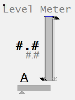                        |
| Example Equipment Template                      | Meter                                                        |
| Associated Composite Genie                      | Meter.xml                                                    |
| Equipment.Items that the Genie expects          | [OP](file:///C:/Program Files (x86)/AVEVA Plant SCADA/Bin/Help/SCADA Help/Content/ASM_COntrol_Meters_Common_Elements.htm#Meters_OP)[ORHigh, ORLow, ORDsp](file:///C:/Program Files (x86)/AVEVA Plant SCADA/Bin/Help/SCADA Help/Content/ASM_Meters_Common_Elements.htm#Meters_OR)[PRHigh, PRLow](file:///C:/Program Files (x86)/AVEVA Plant SCADA/Bin/Help/SCADA Help/Content/ASM_Meters_Common_Elements.htm#Full_Range_Indicators)[OPTrack, PVTrack](file:///C:/Program Files (x86)/AVEVA Plant SCADA/Bin/Help/SCADA Help/Content/ASM_Meters_Common_Elements.htm#Meters_Tracker)[PV](file:///C:/Program Files (x86)/AVEVA Plant SCADA/Bin/Help/SCADA Help/Content/ASM_Meters_Common_Elements.htm#Meter_GraphicalPV)[SP](file:///C:/Program Files (x86)/AVEVA Plant SCADA/Bin/Help/SCADA Help/Content/ASM_COntrol_Meters_Common_Elements.htm#Meters_Setpoint)[FB](file:///C:/Program Files (x86)/AVEVA Plant SCADA/Bin/Help/SCADA Help/Content/ASM_COntrol_Meters_Common_Elements.htm#Meters_FB)[CtrlMode, CtrlModeDef](file:///C:/Program Files (x86)/AVEVA Plant SCADA/Bin/Help/SCADA Help/Content/ASM_COntrol_Meters_Common_Elements.htm#Meters_Mode)[RunStatus](file:///C:/Program Files (x86)/AVEVA Plant SCADA/Bin/Help/SCADA Help/Content/ASM_MeO_States.htm#RunStatus_Tag)[EqStatus](file:///C:/Program Files (x86)/AVEVA Plant SCADA/Bin/Help/SCADA Help/Content/ASM_Status_Indicators.htm#EqStatus)[TrackDsp](file:///C:/Program Files (x86)/AVEVA Plant SCADA/Bin/Help/SCADA Help/Content/ASM_Meters_Common_Elements.htm#Meters_Tracker)[Timer, TimerExp](file:///C:/Program Files (x86)/AVEVA Plant SCADA/Bin/Help/SCADA Help/Content/ASM_Meters_Special_Elements.htm#Meters_Timer) |
| Equipment Parameters the Equipment Items Expect | [InternalIODevice](file:///C:/Program Files (x86)/AVEVA Plant SCADA/Bin/Help/SCADA Help/Content/Situational_Awareness_Equipment_Parameters.htm#Param_InternalIODevice)[CicodeIODevice](file:///C:/Program Files (x86)/AVEVA Plant SCADA/Bin/Help/SCADA Help/Content/Situational_Awareness_Equipment_Parameters.htm#Param_CicodeIODevice)[EqStatusFunc](file:///C:/Program Files (x86)/AVEVA Plant SCADA/Bin/Help/SCADA Help/Content/Situational_Awareness_Equipment_Parameters.htm#Param_EqStatusFunc)[CtrlMode](file:///C:/Program Files (x86)/AVEVA Plant SCADA/Bin/Help/SCADA Help/Content/Situational_Awareness_Equipment_Parameters.htm#Param_CtrlMode)[Range](file:///C:/Program Files (x86)/AVEVA Plant SCADA/Bin/Help/SCADA Help/Content/Situational_Awareness_Equipment_Parameters.htm#Param_Range)[Alarm Limits](file:///C:/Program Files (x86)/AVEVA Plant SCADA/Bin/Help/SCADA Help/Content/Situational_Awareness_Equipment_Parameters.htm#Param_Alarm) |
| Associated Faceplate(s)                         | [Analog Controller](file:///C:/Program Files (x86)/AVEVA Plant SCADA/Bin/Help/SCADA Help/Content/SA_FP_Analog_Controller.htm)[Analog Indicator](file:///C:/Program Files (x86)/AVEVA Plant SCADA/Bin/Help/SCADA Help/Content/SA_FP_Analog_Indicator.htm) |
| Equipment.Items that the Faceplate Expects      | [OP](file:///C:/Program Files (x86)/AVEVA Plant SCADA/Bin/Help/SCADA Help/Content/ASM_COntrol_Meters_Common_Elements.htm#Meters_OP)[ORHigh, ORLow, ORDsp](file:///C:/Program Files (x86)/AVEVA Plant SCADA/Bin/Help/SCADA Help/Content/ASM_Meters_Common_Elements.htm#Meters_OR)[PRHigh, PRLow](file:///C:/Program Files (x86)/AVEVA Plant SCADA/Bin/Help/SCADA Help/Content/ASM_Meters_Common_Elements.htm#Full_Range_Indicators)[OPTrack, PVTrack, TrackDsp](file:///C:/Program Files (x86)/AVEVA Plant SCADA/Bin/Help/SCADA Help/Content/ASM_Meters_Common_Elements.htm#Meters_Tracker)[PV](file:///C:/Program Files (x86)/AVEVA Plant SCADA/Bin/Help/SCADA Help/Content/ASM_Meters_Common_Elements.htm#Meters_NumericPV)[SP](file:///C:/Program Files (x86)/AVEVA Plant SCADA/Bin/Help/SCADA Help/Content/ASM_COntrol_Meters_Common_Elements.htm#Meters_Setpoint)[CtrlMode, CtrlModeDef](file:///C:/Program Files (x86)/AVEVA Plant SCADA/Bin/Help/SCADA Help/Content/ASM_COntrol_Meters_Common_Elements.htm#Meters_Mode)AutoCmd, ManCmd, CasCmd    [RunStatus](file:///C:/Program Files (x86)/AVEVA Plant SCADA/Bin/Help/SCADA Help/Content/ASM_MeO_States.htm#RunStatus_Tag)[OOS, OOSDisabled](file:///C:/Program Files (x86)/AVEVA Plant SCADA/Bin/Help/SCADA Help/Content/ASM_MeO_States.htm#OOS_Tags) |

**Configuration Tasks**

- [Create equipment and organize equipment in a hierarchy](file:///C:/Program Files (x86)/AVEVA Plant SCADA/Bin/Help/SCADA Help/Content/Situational_Awareness_Add_Equipment_Using_Equipment_Editor.htm): Create equipment instances for the required objects, and organize the  equipment in a hierarchy. Objects can be referred to by their name when  you add Composite Genies to a graphics page. You can add one or more instances of an equipment to a page.
- [Associate PLC Alarm Limits for Meters](file:///C:/Program Files (x86)/AVEVA Plant SCADA/Bin/Help/SCADA Help/Content/Configure_PLC_Limits_with_Equipment.htm): This is an optional task that is required if you want to use PLC alarm limits instead of the standard analog alarm limits.
- [Insert a Composite Genie](file:///C:/Program Files (x86)/AVEVA Plant SCADA/Bin/Help/SCADA Help/Content/Insert_a_Composite_Genie.htm): Create graphics pages with instances of [Composite Genies](file:///C:/Program Files (x86)/AVEVA Plant SCADA/Bin/Help/SCADA Help/Content/Composite_Genies.htm) that are associated with the  equipment you have defined in your project. 
- [Create a new faceplate](file:///C:/Program Files (x86)/AVEVA Plant SCADA/Bin/Help/SCADA Help/Content/SA_Create_A_New_FP.htm): Add a [faceplate](file:///C:/Program Files (x86)/AVEVA Plant SCADA/Bin/Help/SCADA Help/Content/SA_Library_Faceplates.htm) for the equipment to allow operators to engage with the equipment at runtime.    
- Write Cicode functions to initialize PR and OR values. Refer to the Cicode Reference Online help for more information. It is recommended that for a  Dual Level meter you set these values on both meters to the same value. 

**Presentation Options**

The following presentation options are available for this object.

| Option                          | Description                                                  |
| ------------------------------- | ------------------------------------------------------------ |
| Meter Type                      | From the  drop-down select one of the following meters: Level, Flow, Temperature,  Pressure, Analyzer, Miscellaneous, Target, Deviation and Dual Level |
| Equipment Name                  | Enter a name for the equipment associated with the meter. You can enter a maximum of 160 characters for this option. |
| Equipment Item Prefix           | Prefix applied to the equipment  item name. This allows for displaying multiple values for a single piece of equipment. For example, you want to create three meters to monitor  power, voltage and current  for a single pump. You would create three  meters on the pump and assign the equipment item prefix "Power",  "Voltage" and "Current". So, the PV values for the meters would be  PowerPV, VoltagePV and CurrentPV respectively.**Note**: To get a meter with a prefix to work correctly, you need to create tags with the required  item names. From the example above, you will need to create the tags  PowerPV, PowerOP, VoltagePV, VoltageOP, CurrentPV, CurrentOP and so on.The following equipment item names (where applicable) can be prefixed:    FB    FullScale    OP    ORDsp    ORLow    ORHigh    PRLow    PRHigh    PV    PVTrack    PVTarget     SP    Timer    TrackDsp |
| Size                            | Size of the meter object image - small or large              |
| Orientation                     | Select the orientation that is appropriate for the presentation of the object on the graphics page. |
| Display Label                   | Use this setting to display a label at the selected position. Select **None** if you do not want to display a label. |
| Label                           | Enter the text that will display at the location specified in **Display Label** field. You can enter a maximum of 30 characters for this option. |
| Display Alarm Indicator         | Select this option to display an alarm border around the  Genie. |
| Display Alarm Flag              | Use this setting to display an alarm flag at the selected position. **Note:** If you select the same position for the alarm flag and **Display Status** indicator (see below), they will overlap. The alarm flag will not be visible. |
| Display Status Indicator        | Use this setting to display a status indicator at the selected location. Select **None** if you do not want to display the status indicator. For more information, see [Status Indicators](file:///C:/Program Files (x86)/AVEVA Plant SCADA/Bin/Help/SCADA Help/Content/ASM_Status_Indicators.htm). |
| Display Process Variable        | Select to display a process variable (numeric PV) with the meter. This option is selected by default. |
| Display Control Mode            | Select this option to display the [Controller Mode Indicator](file:///C:/Program Files (x86)/AVEVA Plant SCADA/Bin/Help/SCADA Help/Content/ASM_COntrol_Meters_Common_Elements.htm). On selecting this option the **Display Control Readback** option box is also displayed. The [Display Control Readback Indicator](file:///C:/Program Files (x86)/AVEVA Plant SCADA/Bin/Help/SCADA Help/Content/ASM_COntrol_Meters_Common_Elements.htm) represents the actual output for the controller. |
| Display Controller Output       | Select to display an output indicator with the meter. For more information, see [Output Bar](file:///C:/Program Files (x86)/AVEVA Plant SCADA/Bin/Help/SCADA Help/Content/ASM_OutputBar_Indicator.htm). |
| Display Setpoint                | Select to display a setpoint indicator with the meter.       |
| Display OOS                     | Select to display Out of Service indicator.                  |
| Display Differential Indication | Select to display an indicator when a differential reading is detected. **This is visible only on Pressure and Temperature meters**. For more information, see [Meter Special Elements](file:///C:/Program Files (x86)/AVEVA Plant SCADA/Bin/Help/SCADA Help/Content/ASM_Meters_Special_Elements.htm). |
| Descriptor                      | Enter a short 3-character text descriptor  to indicate what is being measured. If left blank no descriptor will be displayed. **This is visible only on Miscellaneous, Deviation and Analyzer meters**. |
| Display Clock Timer             | Select to display a clock timer on the meter. **This is  visible only on Analyzer meters**. For more information, see [Meter Special Elements](file:///C:/Program Files (x86)/AVEVA Plant SCADA/Bin/Help/SCADA Help/Content/ASM_Meters_Special_Elements.htm). |
| Display Control Readback        | Select to display a readback indicator (also known as feedback indicator) with the meter. |
| Display Trend                   | Select this option to display a [Trend object](file:///C:/Program Files (x86)/AVEVA Plant SCADA/Bin/Help/SCADA Help/Content/ASM_Trends.htm) with the meter. On selecting this option, the **Trend Type** dropdown is displayed. Select either **Tail** or **Full**.**Note**: When the **Display Trend** option is selected, the Mirrored option is not available. |
| Trend Type                      | Select the type of trend to be displayed with the meter: [Tail](file:///C:/Program Files (x86)/AVEVA Plant SCADA/Bin/Help/SCADA Help/Content/ASM_Trend_Tail.htm) or [Full](file:///C:/Program Files (x86)/AVEVA Plant SCADA/Bin/Help/SCADA Help/Content/ASM_Full_Trend.htm). |
| Mirrored                        | Inserts a mirror image of the meter based on the selected presentation options. |

##### Miscellaneous Meter

The miscellaneous meter indication is  presented on a linear scale, containing a filled rectangle as a PV  indicator. The miscellaneous meter is usually used to represent readings that do not have a dedicated meter type (e.g., weight, speed, torque,  etc.).

| Property                                        | Description                                                  |
| :---------------------------------------------- | :----------------------------------------------------------- |
| Name                                            | Miscellaneous                                                |
| Graphical Representation                        | 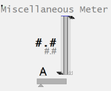                |
| Example Equipment Template                      | Meter                                                        |
| Associated Composite Genie                      | Meter.xml                                                    |
| Equipment.Items that the Genie expects          | [OP](file:///C:/Program Files (x86)/AVEVA Plant SCADA/Bin/Help/SCADA Help/Content/ASM_COntrol_Meters_Common_Elements.htm#Meters_OP)[ORHigh, ORLow, ORDsp](file:///C:/Program Files (x86)/AVEVA Plant SCADA/Bin/Help/SCADA Help/Content/ASM_Meters_Common_Elements.htm#Meters_OR)[PRHigh, PRLow](file:///C:/Program Files (x86)/AVEVA Plant SCADA/Bin/Help/SCADA Help/Content/ASM_Meters_Common_Elements.htm#Full_Range_Indicators)[OPTrack, PVTrack](file:///C:/Program Files (x86)/AVEVA Plant SCADA/Bin/Help/SCADA Help/Content/ASM_Meters_Common_Elements.htm#Meters_Tracker)[PV](file:///C:/Program Files (x86)/AVEVA Plant SCADA/Bin/Help/SCADA Help/Content/ASM_Meters_Common_Elements.htm#Meter_GraphicalPV)[SP](file:///C:/Program Files (x86)/AVEVA Plant SCADA/Bin/Help/SCADA Help/Content/ASM_COntrol_Meters_Common_Elements.htm#Meters_Setpoint)[FB](file:///C:/Program Files (x86)/AVEVA Plant SCADA/Bin/Help/SCADA Help/Content/ASM_COntrol_Meters_Common_Elements.htm#Meters_FB)[CtrlMode, CtrlModeDef](file:///C:/Program Files (x86)/AVEVA Plant SCADA/Bin/Help/SCADA Help/Content/ASM_COntrol_Meters_Common_Elements.htm#Meters_Mode)[RunStatus](file:///C:/Program Files (x86)/AVEVA Plant SCADA/Bin/Help/SCADA Help/Content/ASM_MeO_States.htm#RunStatus_Tag)[EqStatus](file:///C:/Program Files (x86)/AVEVA Plant SCADA/Bin/Help/SCADA Help/Content/ASM_Status_Indicators.htm#EqStatus)[TrackDsp](file:///C:/Program Files (x86)/AVEVA Plant SCADA/Bin/Help/SCADA Help/Content/ASM_Meters_Common_Elements.htm#Meters_Tracker) |
| Equipment Parameters the Equipment Items Expect | [InternalIODevice](file:///C:/Program Files (x86)/AVEVA Plant SCADA/Bin/Help/SCADA Help/Content/Situational_Awareness_Equipment_Parameters.htm#Param_InternalIODevice)[CicodeIODevice](file:///C:/Program Files (x86)/AVEVA Plant SCADA/Bin/Help/SCADA Help/Content/Situational_Awareness_Equipment_Parameters.htm#Param_CicodeIODevice)[EqStatusFunc](file:///C:/Program Files (x86)/AVEVA Plant SCADA/Bin/Help/SCADA Help/Content/Situational_Awareness_Equipment_Parameters.htm#Param_EqStatusFunc)[CtrlMode](file:///C:/Program Files (x86)/AVEVA Plant SCADA/Bin/Help/SCADA Help/Content/Situational_Awareness_Equipment_Parameters.htm#Param_CtrlMode)[Range](file:///C:/Program Files (x86)/AVEVA Plant SCADA/Bin/Help/SCADA Help/Content/Situational_Awareness_Equipment_Parameters.htm#Param_Range)[Alarm Limits](file:///C:/Program Files (x86)/AVEVA Plant SCADA/Bin/Help/SCADA Help/Content/Situational_Awareness_Equipment_Parameters.htm#Param_Alarm) |
| Associated Faceplate(s)                         | [Analog Controller](file:///C:/Program Files (x86)/AVEVA Plant SCADA/Bin/Help/SCADA Help/Content/SA_FP_Analog_Controller.htm)[Analog Indicator](file:///C:/Program Files (x86)/AVEVA Plant SCADA/Bin/Help/SCADA Help/Content/SA_FP_Analog_Indicator.htm) |
| Equipment.Items that the Faceplate Expects      | [OP](file:///C:/Program Files (x86)/AVEVA Plant SCADA/Bin/Help/SCADA Help/Content/ASM_COntrol_Meters_Common_Elements.htm#Meters_OP)[ORHigh, ORLow, ORDsp](file:///C:/Program Files (x86)/AVEVA Plant SCADA/Bin/Help/SCADA Help/Content/ASM_Meters_Common_Elements.htm#Meters_OR)[PRHigh, PRLow](file:///C:/Program Files (x86)/AVEVA Plant SCADA/Bin/Help/SCADA Help/Content/ASM_Meters_Common_Elements.htm#Full_Range_Indicators)[OPTrack, PVTrack, TrackDsp](file:///C:/Program Files (x86)/AVEVA Plant SCADA/Bin/Help/SCADA Help/Content/ASM_Meters_Common_Elements.htm#Meters_Tracker)[PV](file:///C:/Program Files (x86)/AVEVA Plant SCADA/Bin/Help/SCADA Help/Content/ASM_Meters_Common_Elements.htm#Meters_NumericPV)[SP](file:///C:/Program Files (x86)/AVEVA Plant SCADA/Bin/Help/SCADA Help/Content/ASM_COntrol_Meters_Common_Elements.htm#Meters_Setpoint)[CtrlMode, CtrlModeDef](file:///C:/Program Files (x86)/AVEVA Plant SCADA/Bin/Help/SCADA Help/Content/ASM_COntrol_Meters_Common_Elements.htm#Meters_Mode)AutoCmd, ManCmd, CasCmd    [RunStatus](file:///C:/Program Files (x86)/AVEVA Plant SCADA/Bin/Help/SCADA Help/Content/ASM_MeO_States.htm#RunStatus_Tag)[OOS, OOSDisabled](file:///C:/Program Files (x86)/AVEVA Plant SCADA/Bin/Help/SCADA Help/Content/ASM_MeO_States.htm#OOS_Tags) |

**Configuration Tasks**

- [Create equipment and organize equipment in a hierarchy](file:///C:/Program Files (x86)/AVEVA Plant SCADA/Bin/Help/SCADA Help/Content/Situational_Awareness_Add_Equipment_Using_Equipment_Editor.htm): Create equipment instances for the required objects, and organize the  equipment in a hierarchy. Objects can be referred to by their name when  you add Composite Genies to a graphics page. You can add one or more instances of an equipment to a page.
- [Associate PLC Alarm Limits for Meters](file:///C:/Program Files (x86)/AVEVA Plant SCADA/Bin/Help/SCADA Help/Content/Configure_PLC_Limits_with_Equipment.htm): This is an optional task that is required if you want to use PLC alarm limits instead of the standard analog alarm limits.
- [Insert a Composite Genie](file:///C:/Program Files (x86)/AVEVA Plant SCADA/Bin/Help/SCADA Help/Content/Insert_a_Composite_Genie.htm): Create graphics pages with instances of [Composite Genies](file:///C:/Program Files (x86)/AVEVA Plant SCADA/Bin/Help/SCADA Help/Content/Composite_Genies.htm) that are associated with the  equipment you have defined in your project. 
- [Create a new faceplate](file:///C:/Program Files (x86)/AVEVA Plant SCADA/Bin/Help/SCADA Help/Content/SA_Create_A_New_FP.htm): Add a [faceplate](file:///C:/Program Files (x86)/AVEVA Plant SCADA/Bin/Help/SCADA Help/Content/SA_Library_Faceplates.htm) for the equipment to allow operators to engage with the equipment at runtime.    
- Write Cicode functions to initialize PR and OR values. Refer to the Cicode Reference Online help for more information. It is recommended that for a  Dual Level meter you set these values on both meters to the same value. 

**Presentation Options**

The following presentation options are available for this object.

| Option                          | Description                                                  |
| ------------------------------- | ------------------------------------------------------------ |
| Meter Type                      | From the  drop-down select one of the following meters: Level, Flow, Temperature,  Pressure, Analyzer, Miscellaneous, Target, Deviation and Dual Level |
| Equipment Name                  | Enter a name for the equipment associated with the meter. You can enter a maximum of 160 characters for this option. |
| Equipment Item Prefix           | Prefix applied to the equipment  item name. This allows for displaying multiple values for a single piece of equipment. For example, you want to create three meters to monitor  power, voltage and current  for a single pump. You would create three  meters on the pump and assign the equipment item prefix "Power",  "Voltage" and "Current". So, the PV values for the meters would be  PowerPV, VoltagePV and CurrentPV respectively.**Note**: To get a meter with a prefix to work correctly, you need to create tags with the required  item names. From the example above, you will need to create the tags  PowerPV, PowerOP, VoltagePV, VoltageOP, CurrentPV, CurrentOP and so on.The following equipment item names (where applicable) can be prefixed:    FB    FullScale    OP    ORDsp    ORLow    ORHigh    PRLow    PRHigh    PV    PVTrack    PVTarget     SP    Timer    TrackDsp |
| Size                            | Size of the meter object image - small or large              |
| Orientation                     | Select the orientation that is appropriate for the presentation of the object on the graphics page. |
| Display Label                   | Use this setting to display a label at the selected position. Select **None** if you do not want to display a label. |
| Label                           | Enter the text that will display at the location specified in **Display Label** field. You can enter a maximum of 30 characters for this option. |
| Display Alarm Indicator         | Select this option to display an alarm border around the  Genie. |
| Display Alarm Flag              | Use this setting to display an alarm flag at the selected position. **Note:** If you select the same position for the alarm flag and **Display Status** indicator (see below), they will overlap. The alarm flag will not be visible. |
| Display Status Indicator        | Use this setting to display a status indicator at the selected location. Select **None** if you do not want to display the status indicator. For more information, see [Status Indicators](file:///C:/Program Files (x86)/AVEVA Plant SCADA/Bin/Help/SCADA Help/Content/ASM_Status_Indicators.htm). |
| Display Process Variable        | Select to display a process variable (numeric PV) with the meter. This option is selected by default. |
| Display Control Mode            | Select this option to display the [Controller Mode Indicator](file:///C:/Program Files (x86)/AVEVA Plant SCADA/Bin/Help/SCADA Help/Content/ASM_COntrol_Meters_Common_Elements.htm). On selecting this option the **Display Control Readback** option box is also displayed. The [Display Control Readback Indicator](file:///C:/Program Files (x86)/AVEVA Plant SCADA/Bin/Help/SCADA Help/Content/ASM_COntrol_Meters_Common_Elements.htm) represents the actual output for the controller. |
| Display Controller Output       | Select to display an output indicator with the meter. For more information, see [Output Bar](file:///C:/Program Files (x86)/AVEVA Plant SCADA/Bin/Help/SCADA Help/Content/ASM_OutputBar_Indicator.htm). |
| Display Setpoint                | Select to display a setpoint indicator with the meter.       |
| Display OOS                     | Select to display Out of Service indicator.                  |
| Display Differential Indication | Select to display an indicator when a differential reading is detected. **This is visible only on Pressure and Temperature meters**. For more information, see [Meter Special Elements](file:///C:/Program Files (x86)/AVEVA Plant SCADA/Bin/Help/SCADA Help/Content/ASM_Meters_Special_Elements.htm). |
| Descriptor                      | Enter a short 3-character text descriptor  to indicate what is being measured. If left blank no descriptor will be displayed. **This is visible only on Miscellaneous, Deviation and Analyzer meters**. |
| Display Clock Timer             | Select to display a clock timer on the meter. **This is  visible only on Analyzer meters**. For more information, see [Meter Special Elements](file:///C:/Program Files (x86)/AVEVA Plant SCADA/Bin/Help/SCADA Help/Content/ASM_Meters_Special_Elements.htm). |
| Display Control Readback        | Select to display a readback indicator (also known as feedback indicator) with the meter. |
| Display Trend                   | Select this option to display a [Trend object](file:///C:/Program Files (x86)/AVEVA Plant SCADA/Bin/Help/SCADA Help/Content/ASM_Trends.htm) with the meter. On selecting this option, the **Trend Type** dropdown is displayed. Select either **Tail** or **Full**.**Note**: When the **Display Trend** option is selected, the Mirrored option is not available. |
| Trend Type                      | Select the type of trend to be displayed with the meter: [Tail](file:///C:/Program Files (x86)/AVEVA Plant SCADA/Bin/Help/SCADA Help/Content/ASM_Trend_Tail.htm) or [Full](file:///C:/Program Files (x86)/AVEVA Plant SCADA/Bin/Help/SCADA Help/Content/ASM_Full_Trend.htm). |
| Mirrored                        | Inserts a mirror image of the meter based on the selected presentation options. |

##### Pressure Meter

 Pressure meters can be used to show regular pressure readings, or differential pressure readings.

| Property                                        | Description                                                  |
| :---------------------------------------------- | :----------------------------------------------------------- |
| Name                                            | Pressure                                                     |
| Graphical Representation                        | 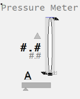                     |
| Example Equipment Template                      | Meter                                                        |
| Associated Composite Genie                      | Meter.xml                                                    |
| Equipment.Items that the Genie expects          | [OP](file:///C:/Program Files (x86)/AVEVA Plant SCADA/Bin/Help/SCADA Help/Content/ASM_COntrol_Meters_Common_Elements.htm#Meters_OP)[ORHigh, ORLow, ORDsp](file:///C:/Program Files (x86)/AVEVA Plant SCADA/Bin/Help/SCADA Help/Content/ASM_Meters_Common_Elements.htm#Meters_OR)[PRHigh, PRLow](file:///C:/Program Files (x86)/AVEVA Plant SCADA/Bin/Help/SCADA Help/Content/ASM_Meters_Common_Elements.htm#Full_Range_Indicators)[OPTrack, PVTrack](file:///C:/Program Files (x86)/AVEVA Plant SCADA/Bin/Help/SCADA Help/Content/ASM_Meters_Common_Elements.htm#Meters_Tracker)[PV](file:///C:/Program Files (x86)/AVEVA Plant SCADA/Bin/Help/SCADA Help/Content/ASM_Meters_Common_Elements.htm#Meter_GraphicalPV)[SP](file:///C:/Program Files (x86)/AVEVA Plant SCADA/Bin/Help/SCADA Help/Content/ASM_COntrol_Meters_Common_Elements.htm#Meters_Setpoint)[FB](file:///C:/Program Files (x86)/AVEVA Plant SCADA/Bin/Help/SCADA Help/Content/ASM_COntrol_Meters_Common_Elements.htm#Meters_FB)[CtrlMode, CtrlModeDef](file:///C:/Program Files (x86)/AVEVA Plant SCADA/Bin/Help/SCADA Help/Content/ASM_COntrol_Meters_Common_Elements.htm#Meters_Mode)[RunStatus](file:///C:/Program Files (x86)/AVEVA Plant SCADA/Bin/Help/SCADA Help/Content/ASM_MeO_States.htm#RunStatus_Tag)[EqStatus](file:///C:/Program Files (x86)/AVEVA Plant SCADA/Bin/Help/SCADA Help/Content/ASM_Status_Indicators.htm#EqStatus)[TrackDsp](file:///C:/Program Files (x86)/AVEVA Plant SCADA/Bin/Help/SCADA Help/Content/ASM_Meters_Common_Elements.htm#Meters_Tracker) |
| Equipment Parameters the Equipment Items Expect | [InternalIODevice](file:///C:/Program Files (x86)/AVEVA Plant SCADA/Bin/Help/SCADA Help/Content/Situational_Awareness_Equipment_Parameters.htm#Param_InternalIODevice)[CicodeIODevice](file:///C:/Program Files (x86)/AVEVA Plant SCADA/Bin/Help/SCADA Help/Content/Situational_Awareness_Equipment_Parameters.htm#Param_CicodeIODevice)[EqStatusFunc](file:///C:/Program Files (x86)/AVEVA Plant SCADA/Bin/Help/SCADA Help/Content/Situational_Awareness_Equipment_Parameters.htm#Param_EqStatusFunc)[CtrlMode](file:///C:/Program Files (x86)/AVEVA Plant SCADA/Bin/Help/SCADA Help/Content/Situational_Awareness_Equipment_Parameters.htm#Param_CtrlMode)[Range](file:///C:/Program Files (x86)/AVEVA Plant SCADA/Bin/Help/SCADA Help/Content/Situational_Awareness_Equipment_Parameters.htm#Param_Range)[Alarm Limits](file:///C:/Program Files (x86)/AVEVA Plant SCADA/Bin/Help/SCADA Help/Content/Situational_Awareness_Equipment_Parameters.htm#Param_Alarm) |
| Associated Faceplate(s)                         | [Analog Controller](file:///C:/Program Files (x86)/AVEVA Plant SCADA/Bin/Help/SCADA Help/Content/SA_FP_Analog_Controller.htm)[Analog Indicator](file:///C:/Program Files (x86)/AVEVA Plant SCADA/Bin/Help/SCADA Help/Content/SA_FP_Analog_Indicator.htm) |
| Equipment.Items that the Faceplate Expects      | [OP](file:///C:/Program Files (x86)/AVEVA Plant SCADA/Bin/Help/SCADA Help/Content/ASM_COntrol_Meters_Common_Elements.htm#Meters_OP)[ORHigh, ORLow, ORDsp](file:///C:/Program Files (x86)/AVEVA Plant SCADA/Bin/Help/SCADA Help/Content/ASM_Meters_Common_Elements.htm#Meters_OR)[PRHigh, PRLow](file:///C:/Program Files (x86)/AVEVA Plant SCADA/Bin/Help/SCADA Help/Content/ASM_Meters_Common_Elements.htm#Full_Range_Indicators)[OPTrack, PVTrack, TrackDsp](file:///C:/Program Files (x86)/AVEVA Plant SCADA/Bin/Help/SCADA Help/Content/ASM_Meters_Common_Elements.htm#Meters_Tracker)[PV](file:///C:/Program Files (x86)/AVEVA Plant SCADA/Bin/Help/SCADA Help/Content/ASM_Meters_Common_Elements.htm#Meters_NumericPV)[SP](file:///C:/Program Files (x86)/AVEVA Plant SCADA/Bin/Help/SCADA Help/Content/ASM_COntrol_Meters_Common_Elements.htm#Meters_Setpoint)[CtrlMode, CtrlModeDef](file:///C:/Program Files (x86)/AVEVA Plant SCADA/Bin/Help/SCADA Help/Content/ASM_COntrol_Meters_Common_Elements.htm#Meters_Mode)AutoCmd, ManCmd, CasCmd    [RunStatus](file:///C:/Program Files (x86)/AVEVA Plant SCADA/Bin/Help/SCADA Help/Content/ASM_MeO_States.htm#RunStatus_Tag)[OOS, OOSDisabled](file:///C:/Program Files (x86)/AVEVA Plant SCADA/Bin/Help/SCADA Help/Content/ASM_MeO_States.htm#OOS_Tags) |

**Configuration Tasks**

- [Create equipment and organize equipment in a hierarchy](file:///C:/Program Files (x86)/AVEVA Plant SCADA/Bin/Help/SCADA Help/Content/Situational_Awareness_Add_Equipment_Using_Equipment_Editor.htm): Create equipment instances for the required objects, and organize the  equipment in a hierarchy. Objects can be referred to by their name when  you add Composite Genies to a graphics page. You can add one or more instances of an equipment to a page.
- [Associate PLC Alarm Limits for Meters](file:///C:/Program Files (x86)/AVEVA Plant SCADA/Bin/Help/SCADA Help/Content/Configure_PLC_Limits_with_Equipment.htm): This is an optional task that is required if you want to use PLC alarm limits instead of the standard analog alarm limits.
- [Insert a Composite Genie](file:///C:/Program Files (x86)/AVEVA Plant SCADA/Bin/Help/SCADA Help/Content/Insert_a_Composite_Genie.htm): Create graphics pages with instances of [Composite Genies](file:///C:/Program Files (x86)/AVEVA Plant SCADA/Bin/Help/SCADA Help/Content/Composite_Genies.htm) that are associated with the  equipment you have defined in your project. 
- [Create a new faceplate](file:///C:/Program Files (x86)/AVEVA Plant SCADA/Bin/Help/SCADA Help/Content/SA_Create_A_New_FP.htm): Add a [faceplate](file:///C:/Program Files (x86)/AVEVA Plant SCADA/Bin/Help/SCADA Help/Content/SA_Library_Faceplates.htm) for the equipment to allow operators to engage with the equipment at runtime.    
- Write Cicode functions to initialize PR and OR values. Refer to the Cicode Reference Online help for more information. It is recommended that for a  Dual Level meter you set these values on both meters to the same value. 

**Presentation Options**

The following presentation options are available for this object.

| Option                          | Description                                                  |
| ------------------------------- | ------------------------------------------------------------ |
| Meter Type                      | From the  drop-down select one of the following meters: Level, Flow, Temperature,  Pressure, Analyzer, Miscellaneous, Target, Deviation and Dual Level |
| Equipment Name                  | Enter a name for the equipment associated with the meter. You can enter a maximum of 160 characters for this option. |
| Equipment Item Prefix           | Prefix applied to the equipment  item name. This allows for displaying multiple values for a single piece of equipment. For example, you want to create three meters to monitor  power, voltage and current  for a single pump. You would create three  meters on the pump and assign the equipment item prefix "Power",  "Voltage" and "Current". So, the PV values for the meters would be  PowerPV, VoltagePV and CurrentPV respectively.**Note**: To get a meter with a prefix to work correctly, you need to create tags with the required  item names. From the example above, you will need to create the tags  PowerPV, PowerOP, VoltagePV, VoltageOP, CurrentPV, CurrentOP and so on.The following equipment item names (where applicable) can be prefixed:    FB    FullScale    OP    ORDsp    ORLow    ORHigh    PRLow    PRHigh    PV    PVTrack    PVTarget     SP    Timer    TrackDsp |
| Size                            | Size of the meter object image - small or large              |
| Orientation                     | Select the orientation that is appropriate for the presentation of the object on the graphics page. |
| Display Label                   | Use this setting to display a label at the selected position. Select **None** if you do not want to display a label. |
| Label                           | Enter the text that will display at the location specified in **Display Label** field. You can enter a maximum of 30 characters for this option. |
| Display Alarm Indicator         | Select this option to display an alarm border around the  Genie. |
| Display Alarm Flag              | Use this setting to display an alarm flag at the selected position. **Note:** If you select the same position for the alarm flag and **Display Status** indicator (see below), they will overlap. The alarm flag will not be visible. |
| Display Status Indicator        | Use this setting to display a status indicator at the selected location. Select **None** if you do not want to display the status indicator. For more information, see [Status Indicators](file:///C:/Program Files (x86)/AVEVA Plant SCADA/Bin/Help/SCADA Help/Content/ASM_Status_Indicators.htm). |
| Display Process Variable        | Select to display a process variable (numeric PV) with the meter. This option is selected by default. |
| Display Control Mode            | Select this option to display the [Controller Mode Indicator](file:///C:/Program Files (x86)/AVEVA Plant SCADA/Bin/Help/SCADA Help/Content/ASM_COntrol_Meters_Common_Elements.htm). On selecting this option the **Display Control Readback** option box is also displayed. The [Display Control Readback Indicator](file:///C:/Program Files (x86)/AVEVA Plant SCADA/Bin/Help/SCADA Help/Content/ASM_COntrol_Meters_Common_Elements.htm) represents the actual output for the controller. |
| Display Controller Output       | Select to display an output indicator with the meter. For more information, see [Output Bar](file:///C:/Program Files (x86)/AVEVA Plant SCADA/Bin/Help/SCADA Help/Content/ASM_OutputBar_Indicator.htm). |
| Display Setpoint                | Select to display a setpoint indicator with the meter.       |
| Display OOS                     | Select to display Out of Service indicator.                  |
| Display Differential Indication | Select to display an indicator when a differential reading is detected. **This is visible only on Pressure and Temperature meters**. For more information, see [Meter Special Elements](file:///C:/Program Files (x86)/AVEVA Plant SCADA/Bin/Help/SCADA Help/Content/ASM_Meters_Special_Elements.htm). |
| Descriptor                      | Enter a short 3-character text descriptor  to indicate what is being measured. If left blank no descriptor will be displayed. **This is visible only on Miscellaneous, Deviation and Analyzer meters**. |
| Display Clock Timer             | Select to display a clock timer on the meter. **This is  visible only on Analyzer meters**. For more information, see [Meter Special Elements](file:///C:/Program Files (x86)/AVEVA Plant SCADA/Bin/Help/SCADA Help/Content/ASM_Meters_Special_Elements.htm). |
| Display Control Readback        | Select to display a readback indicator (also known as feedback indicator) with the meter. |
| Display Trend                   | Select this option to display a [Trend object](file:///C:/Program Files (x86)/AVEVA Plant SCADA/Bin/Help/SCADA Help/Content/ASM_Trends.htm) with the meter. On selecting this option, the **Trend Type** dropdown is displayed. Select either **Tail** or **Full**.**Note**: When the **Display Trend** option is selected, the Mirrored option is not available. |
| Trend Type                      | Select the type of trend to be displayed with the meter: [Tail](file:///C:/Program Files (x86)/AVEVA Plant SCADA/Bin/Help/SCADA Help/Content/ASM_Trend_Tail.htm) or [Full](file:///C:/Program Files (x86)/AVEVA Plant SCADA/Bin/Help/SCADA Help/Content/ASM_Full_Trend.htm). |
| Mirrored                        | Inserts a mirror image of the meter based on the selected presentation options. |

##### Target Meter

The Target meter is used to show deviations from setpoint in level.

| Property                                        | Description                                                  |
| :---------------------------------------------- | :----------------------------------------------------------- |
| Name                                            | Target                                                       |
| Graphical Representation                        | 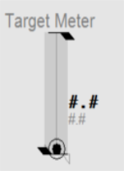                       |
| Example Equipment Template                      | TargetMeter                                                  |
| Associated Composite Genie                      | Meter.xml                                                    |
| Equipment.Items that the Genie expects          | [OP](file:///C:/Program Files (x86)/AVEVA Plant SCADA/Bin/Help/SCADA Help/Content/ASM_COntrol_Meters_Common_Elements.htm#Meters_OP)[ORHigh, ORLow, ORDsp](file:///C:/Program Files (x86)/AVEVA Plant SCADA/Bin/Help/SCADA Help/Content/ASM_Meters_Common_Elements.htm#Meters_OR)[PRHigh, PRLow](file:///C:/Program Files (x86)/AVEVA Plant SCADA/Bin/Help/SCADA Help/Content/ASM_Meters_Common_Elements.htm#Full_Range_Indicators)[OPTrack, PVTrack](file:///C:/Program Files (x86)/AVEVA Plant SCADA/Bin/Help/SCADA Help/Content/ASM_Meters_Common_Elements.htm#Meters_Tracker)[PV](file:///C:/Program Files (x86)/AVEVA Plant SCADA/Bin/Help/SCADA Help/Content/ASM_Meters_Common_Elements.htm#Meter_GraphicalPV)[SP](file:///C:/Program Files (x86)/AVEVA Plant SCADA/Bin/Help/SCADA Help/Content/ASM_COntrol_Meters_Common_Elements.htm#Meters_Setpoint)[FB](file:///C:/Program Files (x86)/AVEVA Plant SCADA/Bin/Help/SCADA Help/Content/ASM_COntrol_Meters_Common_Elements.htm#Meters_FB)[CtrlMode, CtrlModeDef](file:///C:/Program Files (x86)/AVEVA Plant SCADA/Bin/Help/SCADA Help/Content/ASM_COntrol_Meters_Common_Elements.htm#Meters_Mode)[RunStatus](file:///C:/Program Files (x86)/AVEVA Plant SCADA/Bin/Help/SCADA Help/Content/ASM_MeO_States.htm#RunStatus_Tag)[EqStatus](file:///C:/Program Files (x86)/AVEVA Plant SCADA/Bin/Help/SCADA Help/Content/ASM_Status_Indicators.htm#EqStatus)[TrackDsp](file:///C:/Program Files (x86)/AVEVA Plant SCADA/Bin/Help/SCADA Help/Content/ASM_Meters_Common_Elements.htm#Meters_Tracker) |
| Equipment Parameters the Equipment Items Expect | [InternalIODevice](file:///C:/Program Files (x86)/AVEVA Plant SCADA/Bin/Help/SCADA Help/Content/Situational_Awareness_Equipment_Parameters.htm#Param_InternalIODevice)[CicodeIODevice](file:///C:/Program Files (x86)/AVEVA Plant SCADA/Bin/Help/SCADA Help/Content/Situational_Awareness_Equipment_Parameters.htm#Param_CicodeIODevice)[EqStatusFunc](file:///C:/Program Files (x86)/AVEVA Plant SCADA/Bin/Help/SCADA Help/Content/Situational_Awareness_Equipment_Parameters.htm#Param_EqStatusFunc)[CtrlMode](file:///C:/Program Files (x86)/AVEVA Plant SCADA/Bin/Help/SCADA Help/Content/Situational_Awareness_Equipment_Parameters.htm#Param_CtrlMode)[Range](file:///C:/Program Files (x86)/AVEVA Plant SCADA/Bin/Help/SCADA Help/Content/Situational_Awareness_Equipment_Parameters.htm#Param_Range)[Alarm Limits](file:///C:/Program Files (x86)/AVEVA Plant SCADA/Bin/Help/SCADA Help/Content/Situational_Awareness_Equipment_Parameters.htm#Param_Alarm) |
| Associated Faceplate(s)                         | [Analog Controller](file:///C:/Program Files (x86)/AVEVA Plant SCADA/Bin/Help/SCADA Help/Content/SA_FP_Analog_Controller.htm)[Analog Indicator](file:///C:/Program Files (x86)/AVEVA Plant SCADA/Bin/Help/SCADA Help/Content/SA_FP_Analog_Indicator.htm) |
| Equipment.Items that the Faceplate Expects      | [OP](file:///C:/Program Files (x86)/AVEVA Plant SCADA/Bin/Help/SCADA Help/Content/ASM_COntrol_Meters_Common_Elements.htm#Meters_OP)[ORHigh, ORLow, ORDsp](file:///C:/Program Files (x86)/AVEVA Plant SCADA/Bin/Help/SCADA Help/Content/ASM_Meters_Common_Elements.htm#Meters_OR)[PRHigh, PRLow](file:///C:/Program Files (x86)/AVEVA Plant SCADA/Bin/Help/SCADA Help/Content/ASM_Meters_Common_Elements.htm#Full_Range_Indicators)[OPTrack, PVTrack, TrackDsp](file:///C:/Program Files (x86)/AVEVA Plant SCADA/Bin/Help/SCADA Help/Content/ASM_Meters_Common_Elements.htm#Meters_Tracker)[PV](file:///C:/Program Files (x86)/AVEVA Plant SCADA/Bin/Help/SCADA Help/Content/ASM_Meters_Common_Elements.htm#Meters_NumericPV)[SP](file:///C:/Program Files (x86)/AVEVA Plant SCADA/Bin/Help/SCADA Help/Content/ASM_COntrol_Meters_Common_Elements.htm#Meters_Setpoint)[CtrlMode, CtrlModeDef](file:///C:/Program Files (x86)/AVEVA Plant SCADA/Bin/Help/SCADA Help/Content/ASM_COntrol_Meters_Common_Elements.htm#Meters_Mode)AutoCmd, ManCmd, CasCmd    [RunStatus](file:///C:/Program Files (x86)/AVEVA Plant SCADA/Bin/Help/SCADA Help/Content/ASM_MeO_States.htm#RunStatus_Tag)[OOS, OOSDisabled](file:///C:/Program Files (x86)/AVEVA Plant SCADA/Bin/Help/SCADA Help/Content/ASM_MeO_States.htm#OOS_Tags) |

**Configuration Tasks**

- [Create equipment and organize equipment in a hierarchy](file:///C:/Program Files (x86)/AVEVA Plant SCADA/Bin/Help/SCADA Help/Content/Situational_Awareness_Add_Equipment_Using_Equipment_Editor.htm): Create equipment instances for the required objects, and organize the  equipment in a hierarchy. Objects can be referred to by their name when  you add Composite Genies to a graphics page. You can add one or more instances of an equipment to a page.
- [Associate PLC Alarm Limits for Meters](file:///C:/Program Files (x86)/AVEVA Plant SCADA/Bin/Help/SCADA Help/Content/Configure_PLC_Limits_with_Equipment.htm): This is an optional task that is required if you want to use PLC alarm limits instead of the standard analog alarm limits.
- [Insert a Composite Genie](file:///C:/Program Files (x86)/AVEVA Plant SCADA/Bin/Help/SCADA Help/Content/Insert_a_Composite_Genie.htm): Create graphics pages with instances of [Composite Genies](file:///C:/Program Files (x86)/AVEVA Plant SCADA/Bin/Help/SCADA Help/Content/Composite_Genies.htm) that are associated with the  equipment you have defined in your project. 
- [Create a new faceplate](file:///C:/Program Files (x86)/AVEVA Plant SCADA/Bin/Help/SCADA Help/Content/SA_Create_A_New_FP.htm): Add a [faceplate](file:///C:/Program Files (x86)/AVEVA Plant SCADA/Bin/Help/SCADA Help/Content/SA_Library_Faceplates.htm) for the equipment to allow operators to engage with the equipment at runtime.    
- Write Cicode functions to initialize PR and OR values. Refer to the Cicode Reference Online help for more information. It is recommended that for a  Dual Level meter you set these values on both meters to the same value. 

**Presentation Options**

The following presentation options are available for this object.

| Option                          | Description                                                  |
| ------------------------------- | ------------------------------------------------------------ |
| Meter Type                      | From the  drop-down select one of the following meters: Level, Flow, Temperature,  Pressure, Analyzer, Miscellaneous, Target, Deviation and Dual Level |
| Equipment Name                  | Enter a name for the equipment associated with the meter. You can enter a maximum of 160 characters for this option. |
| Equipment Item Prefix           | Prefix applied to the equipment  item name. This allows for displaying multiple values for a single piece of equipment. For example, you want to create three meters to monitor  power, voltage and current  for a single pump. You would create three  meters on the pump and assign the equipment item prefix "Power",  "Voltage" and "Current". So, the PV values for the meters would be  PowerPV, VoltagePV and CurrentPV respectively.**Note**: To get a meter with a prefix to work correctly, you need to create tags with the required  item names. From the example above, you will need to create the tags  PowerPV, PowerOP, VoltagePV, VoltageOP, CurrentPV, CurrentOP and so on.The following equipment item names (where applicable) can be prefixed:    FB    FullScale    OP    ORDsp    ORLow    ORHigh    PRLow    PRHigh    PV    PVTrack    PVTarget     SP    Timer    TrackDsp |
| Size                            | Size of the meter object image - small or large              |
| Orientation                     | Select the orientation that is appropriate for the presentation of the object on the graphics page. |
| Display Label                   | Use this setting to display a label at the selected position. Select **None** if you do not want to display a label. |
| Label                           | Enter the text that will display at the location specified in **Display Label** field. You can enter a maximum of 30 characters for this option. |
| Display Alarm Indicator         | Select this option to display an alarm border around the  Genie. |
| Display Alarm Flag              | Use this setting to display an alarm flag at the selected position. **Note:** If you select the same position for the alarm flag and **Display Status** indicator (see below), they will overlap. The alarm flag will not be visible. |
| Display Status Indicator        | Use this setting to display a status indicator at the selected location. Select **None** if you do not want to display the status indicator. For more information, see [Status Indicators](file:///C:/Program Files (x86)/AVEVA Plant SCADA/Bin/Help/SCADA Help/Content/ASM_Status_Indicators.htm). |
| Display Process Variable        | Select to display a process variable (numeric PV) with the meter. This option is selected by default. |
| Display Control Mode            | Select this option to display the [Controller Mode Indicator](file:///C:/Program Files (x86)/AVEVA Plant SCADA/Bin/Help/SCADA Help/Content/ASM_COntrol_Meters_Common_Elements.htm). On selecting this option the **Display Control Readback** option box is also displayed. The [Display Control Readback Indicator](file:///C:/Program Files (x86)/AVEVA Plant SCADA/Bin/Help/SCADA Help/Content/ASM_COntrol_Meters_Common_Elements.htm) represents the actual output for the controller. |
| Display Controller Output       | Select to display an output indicator with the meter. For more information, see [Output Bar](file:///C:/Program Files (x86)/AVEVA Plant SCADA/Bin/Help/SCADA Help/Content/ASM_OutputBar_Indicator.htm). |
| Display Setpoint                | Select to display a setpoint indicator with the meter.       |
| Display OOS                     | Select to display Out of Service indicator.                  |
| Display Differential Indication | Select to display an indicator when a differential reading is detected. **This is visible only on Pressure and Temperature meters**. For more information, see [Meter Special Elements](file:///C:/Program Files (x86)/AVEVA Plant SCADA/Bin/Help/SCADA Help/Content/ASM_Meters_Special_Elements.htm). |
| Descriptor                      | Enter a short 3-character text descriptor  to indicate what is being measured. If left blank no descriptor will be displayed. **This is visible only on Miscellaneous, Deviation and Analyzer meters**. |
| Display Clock Timer             | Select to display a clock timer on the meter. **This is  visible only on Analyzer meters**. For more information, see [Meter Special Elements](file:///C:/Program Files (x86)/AVEVA Plant SCADA/Bin/Help/SCADA Help/Content/ASM_Meters_Special_Elements.htm). |
| Display Control Readback        | Select to display a readback indicator (also known as feedback indicator) with the meter. |
| Display Trend                   | Select this option to display a [Trend object](file:///C:/Program Files (x86)/AVEVA Plant SCADA/Bin/Help/SCADA Help/Content/ASM_Trends.htm) with the meter. On selecting this option, the **Trend Type** dropdown is displayed. Select either **Tail** or **Full**.**Note**: When the **Display Trend** option is selected, the Mirrored option is not available. |
| Trend Type                      | Select the type of trend to be displayed with the meter: [Tail](file:///C:/Program Files (x86)/AVEVA Plant SCADA/Bin/Help/SCADA Help/Content/ASM_Trend_Tail.htm) or [Full](file:///C:/Program Files (x86)/AVEVA Plant SCADA/Bin/Help/SCADA Help/Content/ASM_Full_Trend.htm). |
| Mirrored                        | Inserts a mirror image of the meter based on the selected presentation options. |

##### Temperature Meter

Temperatures are indicated on a linear  scale.  Temperature meters can be used to show regular temperature  readings, or differential temperature readings.

| Property                                        | Description                                                  |
| :---------------------------------------------- | :----------------------------------------------------------- |
| Name                                            | Deviation                                                    |
| Graphical Representation                        | 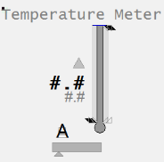                  |
| Example Equipment Template                      | Meter                                                        |
| Associated Composite Genie                      | Meter.xml                                                    |
| Equipment.Items that the Genie expects          | [OP](file:///C:/Program Files (x86)/AVEVA Plant SCADA/Bin/Help/SCADA Help/Content/ASM_COntrol_Meters_Common_Elements.htm#Meters_OP)[ORHigh, ORLow, ORDsp](file:///C:/Program Files (x86)/AVEVA Plant SCADA/Bin/Help/SCADA Help/Content/ASM_Meters_Common_Elements.htm#Meters_OR)[PRHigh, PRLow](file:///C:/Program Files (x86)/AVEVA Plant SCADA/Bin/Help/SCADA Help/Content/ASM_Meters_Common_Elements.htm#Full_Range_Indicators)[OPTrack, PVTrack](file:///C:/Program Files (x86)/AVEVA Plant SCADA/Bin/Help/SCADA Help/Content/ASM_Meters_Common_Elements.htm#Meters_Tracker)[PV](file:///C:/Program Files (x86)/AVEVA Plant SCADA/Bin/Help/SCADA Help/Content/ASM_Meters_Common_Elements.htm#Meter_GraphicalPV)[SP](file:///C:/Program Files (x86)/AVEVA Plant SCADA/Bin/Help/SCADA Help/Content/ASM_COntrol_Meters_Common_Elements.htm#Meters_Setpoint)[FB](file:///C:/Program Files (x86)/AVEVA Plant SCADA/Bin/Help/SCADA Help/Content/ASM_COntrol_Meters_Common_Elements.htm#Meters_FB)[CtrlMode, CtrlModeDef](file:///C:/Program Files (x86)/AVEVA Plant SCADA/Bin/Help/SCADA Help/Content/ASM_COntrol_Meters_Common_Elements.htm#Meters_Mode)[RunStatus](file:///C:/Program Files (x86)/AVEVA Plant SCADA/Bin/Help/SCADA Help/Content/ASM_MeO_States.htm#RunStatus_Tag)[EqStatus](file:///C:/Program Files (x86)/AVEVA Plant SCADA/Bin/Help/SCADA Help/Content/ASM_Status_Indicators.htm#EqStatus)[TrackDsp](file:///C:/Program Files (x86)/AVEVA Plant SCADA/Bin/Help/SCADA Help/Content/ASM_Meters_Common_Elements.htm#Meters_Tracker) |
| Equipment Parameters the Equipment Items Expect | [InternalIODevice](file:///C:/Program Files (x86)/AVEVA Plant SCADA/Bin/Help/SCADA Help/Content/Situational_Awareness_Equipment_Parameters.htm#Param_InternalIODevice)[CicodeIODevice](file:///C:/Program Files (x86)/AVEVA Plant SCADA/Bin/Help/SCADA Help/Content/Situational_Awareness_Equipment_Parameters.htm#Param_CicodeIODevice)[EqStatusFunc](file:///C:/Program Files (x86)/AVEVA Plant SCADA/Bin/Help/SCADA Help/Content/Situational_Awareness_Equipment_Parameters.htm#Param_EqStatusFunc)[CtrlMode](file:///C:/Program Files (x86)/AVEVA Plant SCADA/Bin/Help/SCADA Help/Content/Situational_Awareness_Equipment_Parameters.htm#Param_CtrlMode)[Range](file:///C:/Program Files (x86)/AVEVA Plant SCADA/Bin/Help/SCADA Help/Content/Situational_Awareness_Equipment_Parameters.htm#Param_Range)[Alarm Limits](file:///C:/Program Files (x86)/AVEVA Plant SCADA/Bin/Help/SCADA Help/Content/Situational_Awareness_Equipment_Parameters.htm#Param_Alarm) |
| Associated Faceplate(s)                         | [Analog Controller](file:///C:/Program Files (x86)/AVEVA Plant SCADA/Bin/Help/SCADA Help/Content/SA_FP_Analog_Controller.htm)[Analog Indicator](file:///C:/Program Files (x86)/AVEVA Plant SCADA/Bin/Help/SCADA Help/Content/SA_FP_Analog_Indicator.htm) |
| Equipment.Items that the Faceplate Expects      | [OP](file:///C:/Program Files (x86)/AVEVA Plant SCADA/Bin/Help/SCADA Help/Content/ASM_COntrol_Meters_Common_Elements.htm#Meters_OP)[ORHigh, ORLow, ORDsp](file:///C:/Program Files (x86)/AVEVA Plant SCADA/Bin/Help/SCADA Help/Content/ASM_Meters_Common_Elements.htm#Meters_OR)[PRHigh, PRLow](file:///C:/Program Files (x86)/AVEVA Plant SCADA/Bin/Help/SCADA Help/Content/ASM_Meters_Common_Elements.htm#Full_Range_Indicators)[OPTrack, PVTrack, TrackDsp](file:///C:/Program Files (x86)/AVEVA Plant SCADA/Bin/Help/SCADA Help/Content/ASM_Meters_Common_Elements.htm#Meters_Tracker)[PV](file:///C:/Program Files (x86)/AVEVA Plant SCADA/Bin/Help/SCADA Help/Content/ASM_Meters_Common_Elements.htm#Meters_NumericPV)[SP](file:///C:/Program Files (x86)/AVEVA Plant SCADA/Bin/Help/SCADA Help/Content/ASM_COntrol_Meters_Common_Elements.htm#Meters_Setpoint)[CtrlMode, CtrlModeDef](file:///C:/Program Files (x86)/AVEVA Plant SCADA/Bin/Help/SCADA Help/Content/ASM_COntrol_Meters_Common_Elements.htm#Meters_Mode)AutoCmd, ManCmd, CasCmd    [RunStatus](file:///C:/Program Files (x86)/AVEVA Plant SCADA/Bin/Help/SCADA Help/Content/ASM_MeO_States.htm#RunStatus_Tag)[OOS, OOSDisabled](file:///C:/Program Files (x86)/AVEVA Plant SCADA/Bin/Help/SCADA Help/Content/ASM_MeO_States.htm#OOS_Tags) |

**Configuration Tasks**

- [Create equipment and organize equipment in a hierarchy](file:///C:/Program Files (x86)/AVEVA Plant SCADA/Bin/Help/SCADA Help/Content/Situational_Awareness_Add_Equipment_Using_Equipment_Editor.htm): Create equipment instances for the required objects, and organize the  equipment in a hierarchy. Objects can be referred to by their name when  you add Composite Genies to a graphics page. You can add one or more instances of an equipment to a page.
- [Associate PLC Alarm Limits for Meters](file:///C:/Program Files (x86)/AVEVA Plant SCADA/Bin/Help/SCADA Help/Content/Configure_PLC_Limits_with_Equipment.htm): This is an optional task that is required if you want to use PLC alarm limits instead of the standard analog alarm limits.
- [Insert a Composite Genie](file:///C:/Program Files (x86)/AVEVA Plant SCADA/Bin/Help/SCADA Help/Content/Insert_a_Composite_Genie.htm): Create graphics pages with instances of [Composite Genies](file:///C:/Program Files (x86)/AVEVA Plant SCADA/Bin/Help/SCADA Help/Content/Composite_Genies.htm) that are associated with the  equipment you have defined in your project. 
- [Create a new faceplate](file:///C:/Program Files (x86)/AVEVA Plant SCADA/Bin/Help/SCADA Help/Content/SA_Create_A_New_FP.htm): Add a [faceplate](file:///C:/Program Files (x86)/AVEVA Plant SCADA/Bin/Help/SCADA Help/Content/SA_Library_Faceplates.htm) for the equipment to allow operators to engage with the equipment at runtime.                    
- Write Cicode functions to initialize PR and OR values. Refer to the Cicode Reference Online help for more information. It is recommended that for a  Dual Level meter you set these values on both meters to the same value. 

**Presentation Options**

The following presentation options are available for this object.

| Option                          | Description                                                  |
| ------------------------------- | ------------------------------------------------------------ |
| Meter Type                      | From the  drop-down select one of the following meters: Level, Flow, Temperature,  Pressure, Analyzer, Miscellaneous, Target, Deviation and Dual Level |
| Equipment Name                  | Enter a name for the equipment associated with the meter. You can enter a maximum of 160 characters for this option. |
| Equipment Item Prefix           | Prefix applied to the equipment  item name. This allows for displaying multiple values for a single piece of equipment. For example, you want to create three meters to monitor  power, voltage and current  for a single pump. You would create three  meters on the pump and assign the equipment item prefix "Power",  "Voltage" and "Current". So, the PV values for the meters would be  PowerPV, VoltagePV and CurrentPV respectively.**Note**: To get a meter with a prefix to work correctly, you need to create tags with the required  item names. From the example above, you will need to create the tags  PowerPV, PowerOP, VoltagePV, VoltageOP, CurrentPV, CurrentOP and so on.The following equipment item names (where applicable) can be prefixed:    FB    FullScale    OP    ORDsp    ORLow    ORHigh    PRLow    PRHigh    PV    PVTrack    PVTarget     SP    Timer    TrackDsp |
| Size                            | Size of the meter object image - small or large              |
| Orientation                     | Select the orientation that is appropriate for the presentation of the object on the graphics page. |
| Display Label                   | Use this setting to display a label at the selected position. Select **None** if you do not want to display a label. |
| Label                           | Enter the text that will display at the location specified in **Display Label** field. You can enter a maximum of 30 characters for this option. |
| Display Alarm Indicator         | Select this option to display an alarm border around the  Genie. |
| Display Alarm Flag              | Use this setting to display an alarm flag at the selected position. **Note:** If you select the same position for the alarm flag and **Display Status** indicator (see below), they will overlap. The alarm flag will not be visible. |
| Display Status Indicator        | Use this setting to display a status indicator at the selected location. Select **None** if you do not want to display the status indicator. For more information, see [Status Indicators](file:///C:/Program Files (x86)/AVEVA Plant SCADA/Bin/Help/SCADA Help/Content/ASM_Status_Indicators.htm). |
| Display Process Variable        | Select to display a process variable (numeric PV) with the meter. This option is selected by default. |
| Display Control Mode            | Select this option to display the [Controller Mode Indicator](file:///C:/Program Files (x86)/AVEVA Plant SCADA/Bin/Help/SCADA Help/Content/ASM_COntrol_Meters_Common_Elements.htm). On selecting this option the **Display Control Readback** option box is also displayed. The [Display Control Readback Indicator](file:///C:/Program Files (x86)/AVEVA Plant SCADA/Bin/Help/SCADA Help/Content/ASM_COntrol_Meters_Common_Elements.htm) represents the actual output for the controller. |
| Display Controller Output       | Select to display an output indicator with the meter. For more information, see [Output Bar](file:///C:/Program Files (x86)/AVEVA Plant SCADA/Bin/Help/SCADA Help/Content/ASM_OutputBar_Indicator.htm). |
| Display Setpoint                | Select to display a setpoint indicator with the meter.       |
| Display OOS                     | Select to display Out of Service indicator.                  |
| Display Differential Indication | Select to display an indicator when a differential reading is detected. **This is visible only on Pressure and Temperature meters**. For more information, see [Meter Special Elements](file:///C:/Program Files (x86)/AVEVA Plant SCADA/Bin/Help/SCADA Help/Content/ASM_Meters_Special_Elements.htm). |
| Descriptor                      | Enter a short 3-character text descriptor  to indicate what is being measured. If left blank no descriptor will be displayed. **This is visible only on Miscellaneous, Deviation and Analyzer meters**. |
| Display Clock Timer             | Select to display a clock timer on the meter. **This is  visible only on Analyzer meters**. For more information, see [Meter Special Elements](file:///C:/Program Files (x86)/AVEVA Plant SCADA/Bin/Help/SCADA Help/Content/ASM_Meters_Special_Elements.htm). |
| Display Control Readback        | Select to display a readback indicator (also known as feedback indicator) with the meter. |
| Display Trend                   | Select this option to display a [Trend object](file:///C:/Program Files (x86)/AVEVA Plant SCADA/Bin/Help/SCADA Help/Content/ASM_Trends.htm) with the meter. On selecting this option, the **Trend Type** dropdown is displayed. Select either **Tail** or **Full**.**Note**: When the **Display Trend** option is selected, the Mirrored option is not available. |
| Trend Type                      | Select the type of trend to be displayed with the meter: [Tail](file:///C:/Program Files (x86)/AVEVA Plant SCADA/Bin/Help/SCADA Help/Content/ASM_Trend_Tail.htm) or [Full](file:///C:/Program Files (x86)/AVEVA Plant SCADA/Bin/Help/SCADA Help/Content/ASM_Full_Trend.htm). |
| Mirrored                        | Inserts a mirror image of the meter based on the selected presentation options. |