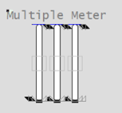

[Проект Situational Awareness](../README.md) -> [Situational Awareness Library](readme.md)

#### Multiple Meter

| Property                                        | Description                                                  |
| :---------------------------------------------- | :----------------------------------------------------------- |
| Name                                            | Multiple                                                     |
| Graphical Representation                        |                   |
| Example Equipment Template                      | Two or three meter objects                                   |
| Associated Composite Genie                      | Meter_Multiple.xml                                           |
| Equipment.Items that the Genie expects          | [OP](file:///C:/Program Files (x86)/AVEVA Plant SCADA/Bin/Help/SCADA Help/Content/ASM_COntrol_Meters_Common_Elements.htm#Meters_OP)[ORHigh, ORLow, ORDsp](file:///C:/Program Files (x86)/AVEVA Plant SCADA/Bin/Help/SCADA Help/Content/ASM_Meters_Common_Elements.htm#Meters_OR)[PRHigh, PRLow](file:///C:/Program Files (x86)/AVEVA Plant SCADA/Bin/Help/SCADA Help/Content/ASM_Meters_Common_Elements.htm#Full_Range_Indicators)[OPTrack, PVTrack](file:///C:/Program Files (x86)/AVEVA Plant SCADA/Bin/Help/SCADA Help/Content/ASM_Meters_Common_Elements.htm#Meters_Tracker)[PV](file:///C:/Program Files (x86)/AVEVA Plant SCADA/Bin/Help/SCADA Help/Content/ASM_Meters_Common_Elements.htm#Meter_GraphicalPV)[SP](file:///C:/Program Files (x86)/AVEVA Plant SCADA/Bin/Help/SCADA Help/Content/ASM_COntrol_Meters_Common_Elements.htm#Meters_Setpoint)[FB](file:///C:/Program Files (x86)/AVEVA Plant SCADA/Bin/Help/SCADA Help/Content/ASM_COntrol_Meters_Common_Elements.htm#Meters_FB)[CtrlMode, CtrlModeDef](file:///C:/Program Files (x86)/AVEVA Plant SCADA/Bin/Help/SCADA Help/Content/ASM_COntrol_Meters_Common_Elements.htm#Meters_Mode)[RunStatus](file:///C:/Program Files (x86)/AVEVA Plant SCADA/Bin/Help/SCADA Help/Content/ASM_MeO_States.htm#RunStatus_Tag)[EqStatus](file:///C:/Program Files (x86)/AVEVA Plant SCADA/Bin/Help/SCADA Help/Content/ASM_Status_Indicators.htm#EqStatus)[TrackDsp](file:///C:/Program Files (x86)/AVEVA Plant SCADA/Bin/Help/SCADA Help/Content/ASM_Meters_Common_Elements.htm#Meters_Tracker) |
| Equipment Parameters the Equipment Items Expect | [InternalIODevice](file:///C:/Program Files (x86)/AVEVA Plant SCADA/Bin/Help/SCADA Help/Content/Situational_Awareness_Equipment_Parameters.htm#Param_InternalIODevice)[CicodeIODevice](file:///C:/Program Files (x86)/AVEVA Plant SCADA/Bin/Help/SCADA Help/Content/Situational_Awareness_Equipment_Parameters.htm#Param_CicodeIODevice)[EqStatusFunc](file:///C:/Program Files (x86)/AVEVA Plant SCADA/Bin/Help/SCADA Help/Content/Situational_Awareness_Equipment_Parameters.htm#Param_EqStatusFunc)[CtrlMode](file:///C:/Program Files (x86)/AVEVA Plant SCADA/Bin/Help/SCADA Help/Content/Situational_Awareness_Equipment_Parameters.htm#Param_CtrlMode)[Range](file:///C:/Program Files (x86)/AVEVA Plant SCADA/Bin/Help/SCADA Help/Content/Situational_Awareness_Equipment_Parameters.htm#Param_Range)[Alarm Limits](file:///C:/Program Files (x86)/AVEVA Plant SCADA/Bin/Help/SCADA Help/Content/Situational_Awareness_Equipment_Parameters.htm#Param_Alarm) |
| Associated Faceplate(s)                         | [Analog Controller](file:///C:/Program Files (x86)/AVEVA Plant SCADA/Bin/Help/SCADA Help/Content/SA_FP_Analog_Controller.htm)[Analog Indicator](file:///C:/Program Files (x86)/AVEVA Plant SCADA/Bin/Help/SCADA Help/Content/SA_FP_Analog_Indicator.htm) |
| Equipment.Items that the Faceplate Expects      | [OP](file:///C:/Program Files (x86)/AVEVA Plant SCADA/Bin/Help/SCADA Help/Content/ASM_COntrol_Meters_Common_Elements.htm#Meters_OP)[ORHigh, ORLow, ORDsp](file:///C:/Program Files (x86)/AVEVA Plant SCADA/Bin/Help/SCADA Help/Content/ASM_Meters_Common_Elements.htm#Meters_OR)[PRHigh, PRLow](file:///C:/Program Files (x86)/AVEVA Plant SCADA/Bin/Help/SCADA Help/Content/ASM_Meters_Common_Elements.htm#Full_Range_Indicators)[OPTrack, PVTrack, TrackDsp](file:///C:/Program Files (x86)/AVEVA Plant SCADA/Bin/Help/SCADA Help/Content/ASM_Meters_Common_Elements.htm#Meters_Tracker)[PV](file:///C:/Program Files (x86)/AVEVA Plant SCADA/Bin/Help/SCADA Help/Content/ASM_Meters_Common_Elements.htm#Meters_NumericPV)[SP](file:///C:/Program Files (x86)/AVEVA Plant SCADA/Bin/Help/SCADA Help/Content/ASM_COntrol_Meters_Common_Elements.htm#Meters_Setpoint)[CtrlMode, CtrlModeDef](file:///C:/Program Files (x86)/AVEVA Plant SCADA/Bin/Help/SCADA Help/Content/ASM_COntrol_Meters_Common_Elements.htm#Meters_Mode)AutoCmd, ManCmd, CasCmd    [RunStatus](file:///C:/Program Files (x86)/AVEVA Plant SCADA/Bin/Help/SCADA Help/Content/ASM_MeO_States.htm#RunStatus_Tag)[OOS, OOSDisabled](file:///C:/Program Files (x86)/AVEVA Plant SCADA/Bin/Help/SCADA Help/Content/ASM_MeO_States.htm#OOS_Tags) |

[/AVEVA%20Plant%20SCADA/Bin/Help/SCADA%20Help/Skins/Default/Stylesheets/Images/transparent.gif)Configuration Tasks](javascript:void(0))

- [Create equipment and organize equipment in a hierarchy](file:///C:/Program Files (x86)/AVEVA Plant SCADA/Bin/Help/SCADA Help/Content/Situational_Awareness_Add_Equipment_Using_Equipment_Editor.htm): Create the equipment for the required objects. Organize the equipment  in a hierarchy. Objects can be referred to by their name when you add  Composite Genies to a graphics page. You can add one or more instances of an equipment to a page.
- [Configure equipment references](file:///C:/Program Files (x86)/AVEVA Plant SCADA/Bin/Help/SCADA Help/Content/Manually_Define_Equipment_References.htm): Create the required relationships ([equipment references](file:///C:/Program Files (x86)/AVEVA Plant SCADA/Bin/Help/SCADA Help/Content/Equipment_References.htm)) between  a piece of equipment to items of another piece of equipment.  This allows you to refer to equipment.items outside of the equipment hierarchy. 
- [Configure PLC Alarm Limits for Meters](file:///C:/Program Files (x86)/AVEVA Plant SCADA/Bin/Help/SCADA Help/Content/Configure_PLC_Limits_with_Equipment.htm): This is an optional task that is required if you want to use PLC alarm limits instead of the standard analog alarm limits.
- [Insert a Composite Genie](file:///C:/Program Files (x86)/AVEVA Plant SCADA/Bin/Help/SCADA Help/Content/Insert_a_Composite_Genie.htm): Create graphics pages with instances of [Composite Genies](file:///C:/Program Files (x86)/AVEVA Plant SCADA/Bin/Help/SCADA Help/Content/Composite_Genies.htm) that are associated with the  equipment you have defined in your project. 
- [Create a new faceplate](file:///C:/Program Files (x86)/AVEVA Plant SCADA/Bin/Help/SCADA Help/Content/SA_Create_A_New_FP.htm): Add a [faceplate](file:///C:/Program Files (x86)/AVEVA Plant SCADA/Bin/Help/SCADA Help/Content/SA_Library_Faceplates.htm) for the equipment to allow operators to engage with the equipment at runtime. 
- Write Cicode functions to initialize PR and OR values. Refer to the Cicode Reference Online help for more information. 

[/AVEVA%20Plant%20SCADA/Bin/Help/SCADA%20Help/Skins/Default/Stylesheets/Images/transparent.gif)Presentation Options](javascript:void(0))

| Option                    | Description                                                  |
| ------------------------- | ------------------------------------------------------------ |
| Equipment Name            | Enter a name for the equipment associated with the meter. You can enter a maximum of 160 characters for this option.**Note**: The Multiple Meter equipment needs to be [manually configured to reference](file:///C:/Program Files (x86)/AVEVA Plant SCADA/Bin/Help/SCADA Help/Content/Manually_Define_Equipment_References.htm) the name of each meter to be included. |
| Meter Count               | Number of meters - select from Duplicated for two meters or Triplicated for three meters. |
| Equipment #1/#2/#3 Name   | Enter the name of the equipment  object for the first/second/third meter (displayed only if meter count  is triplicated). You can enter a maximum of 160 characters for this  option. |
| Equipment #1/#2/#3 Prefix | Prefix applied to the equipment  item name for the meters. This allows for displaying multiple values for a single piece of equipment. For example, you want to create three  meters to monitor power, voltage and current  for a single pump. You  would create three meters on the pump and assign the equipment item  prefix "Power", "Voltage" and "Current". So, the PV values for the  meters would be PowerPV, VoltagePV and CurrentPV respectively.**Note**: To get a meter with a prefix to work correctly, you need to create tags with the required  item names. From the example above, you will need to create the tags  PowerPV, PowerOP, VoltagePV, VoltageOP, CurrentPV, CurrentOP and so on.The following equipment item names can be prefixed:    PV    OP    ORDsp    TrackDsp    FB    PRLow    PRHigh    ORLow    ORHigh    SP    PVTrack    FullScale    OPTrack    Timer    PVTarget |
| Meter Type                | From a drop-down select one of the following meters: Level, Flow, Temperature, Pressure, Analyzer, Miscellaneous, and Deviation. |
| Size                      | Size of the meter object image - small or large              |
| Orientation               | Select the orientation that is appropriate for the presentation of the object on the graphics page. |
| Display Label             | Use this setting to display a label at the selected position. Select **None** if you do not want to display a label. |
| Label                     | Enter the text that will display at the location specified in **Display Label** field. You can enter a maximum of 30 characters for this option. |
| Display Alarm Indicator   | Shows or hides the Alarm Indicator which indicates the highest priority alarm and its state for this group of meters. |
| Display Setpoint          | Select to display a setpoint indicator with the meter.       |
| Display OOS               | Select to display Out of Service indicator.                  |
| Mirrored                  | Inserts a mirror image of the meter based on the selected presentation options. |