[Проект Situational Awareness](../README.md) -> [Situational Awareness Library](readme.md)

### Valves

[Help](file:///C:/Program%20Files%20(x86)/AVEVA%20Plant%20SCADA/Bin/Help/SCADA%20Help/Content/ASM_Valves.htm)

Об’єкти Valve, які доступні в бібліотеці Situational Awareness, включають:

- [Control Valve](controlvalve.md)    
- [Damper](damper.md)    
- [Block Valve](blockvalve.md)    
- [Hand Valve](handvalve.md)    

На рисунку нижче показано приклад елементів, які можуть складати об’єкт control valve.     

​    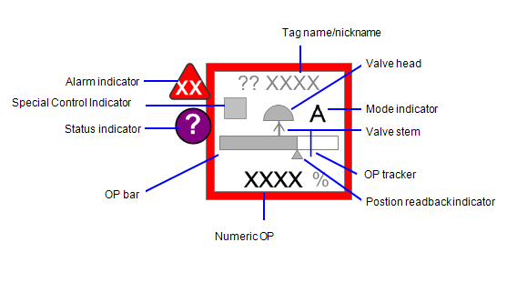

**Alarm indicator**

Індикатор тривоги використовується для відображення виникнення та стану тривог, пов’язаних з об’єктом. Див. Індикатори тривоги в розділі Common Object Properties.

**Status indicator**

Connects to: EquipmentName.EqStatus

Індикатор стану використовується для представлення різних умов, не пов’язаних з тривожним об’єктом, таких як ненормальна якість даних або стани системи керування. Див. [Індикатори стану](file:///C:/Program Files (x86)/AVEVA Plant SCADA/Bin/Help/SCADA Help/Content/ASM_Status_Indicators.htm) у розділі Загальні властивості об’єкта.

**Note**: Індикатор статусу не входить до складу базового джина.

**Valve Objects - Tagname/Nickname**

Поле tagname/nickname показує тег клапана (за замовчуванням) або, якщо введено користувачем, «nickname». Псевдонім, як правило, є звичайним ім’ям, яке використовується для ідентифікації читання (наприклад, «Fuel Gas» замість «CV1001»).

Видимість поля тегів/псевдонімів має бути пов’язана з налаштуваннями видимості тегів у елементах керування «“Show/Hide Settings».

**OP Bar (for valves with continuous position control)**

Connects to: EquipmentName.OP

Для регулюючих клапанів та інших клапанів, які можуть бути відкриті на 0-100%, ця смуга показує командний OP для клапана (опис функціональних можливостей див. у розділі 0).

Зауважте, що панель OP не стає чорною, коли клапан повністю відкритий.

**OP Bar (for valves with discrete position control)**

Connects to: EquipmentName.OP

Для двопозиційних клапанів (відкритих/закритих), таких як запірні клапани або прості MOV, смуга OP використовується для розрізнення між закритими, відкриттями/закритими та закритими (якщо доступно). Під час відкриття або закриття смуга відображається із заливкою на половині смуги.

Зверніть увагу, що панель OP не стає чорною у відкритому стані.

| State              | OP Bar                                  | Example (Block Valve)                    |
| ------------------ | --------------------------------------- | ---------------------------------------- |
| Fully closed       | 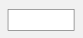 | 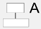 |
| Opening or closing | 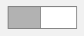   | 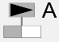   |
| Fully open         | 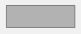   | 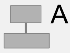   |

**Position Readback Indicator**

Connects to: EquipmentName.FB

Цей трикутник використовується, щоб показати фактичне положення клапана (зчитування) (0-100%), якщо є (опис функціональних можливостей див. у розділі 0).

**Note**: Слід використовувати тільки на складних клапанах, які мають елементи OP і FB; інакше він не компілюється.

**Valve Objects - Numeric OP**

Connects to:  EquipmentName.OP

Це числове поле, яке використовується для відображення командного OP (0-100%), якщо є. Він завжди відображається у вигляді відсоткового значення. Це надає операторам точні значення, коли це необхідно.

Видимість числового OP має бути прив’язана до стану видимості для PV, вибраного в елементах керування «Show/Hide Settings». Якщо користувач вибирає вимкнути видимість для PV, числові значення OP також мають бути приховані. Якщо клапан переходить у стан тривоги, слід увімкнути видимість. 			

**OP Tracker**

Connects to: EquipmentName.OPTracker        

Трекер — це налаштований користувачем індикатор, який позначає конкретне вихідне значення на панелі OP. Типовий випадок використання — це коли оператор хоче позначити поточну позицію, щоб, коли він знову подивиться на позицію (через деякий час), він міг побачити, чи змінилася вона. Положення трекера встановлюється та вмикається/вимкнено з передньої панелі клапана (див. специфікацію приладової панелі APG). Трекер доступний лише для клапанів з безперервним регулюванням положення (регулюючі клапани, заслінки та складні MOV/EOV).

**Mode Indicator**

Connects to: EquipmentName.CtrlMode, EquipmentName.CtrlModeDef

Це односимвольний код, який вказує на режим роботи клапана. Він показаний біля головки клапана. Як правило, набір режимів включає ручний (M), автоматичний (A), каскадний (C) і локальний (L) і спеціальне керування (символ комп’ютера), але інші можуть бути додані за потребою для платформи системи керування.

**Примітка**: Індикатор режиму не відображається, якщо для тега встановлено значення CtrlModeDef. Щоб постійно переглядати режим керування, видаліть тег CtrlModeDef із шаблону обладнання.

**Valve Stem**

Де застосовно, шток клапана використовується для відображення дії несправності для клапана (не відкрився, не закрився або  fail last). Ці стани показані таким чином:

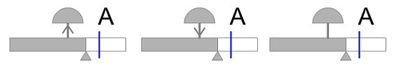        

**Valve Head (control valves and dampers)**

 Connects to: EquipmentName.Open, EquipmentName.POS, EquipmentName.Closed, EquipmentName.Opening, EquipmentName.Closing

Для регулюючих клапанів і заслінок колір заповнення головки клапана використовується для вказівки на те, чи клапан повністю закритий, частково відкритий чи повністю відкритий. Це схоже на те, як колір заливки використовується для панелі OP та індикаторів зворотного зчитування. При повному закритті заливка біла. При частковому відкритті заливка стає сірою, а при повному відкритті — чорною.

Якщо зворотне зчитування доступне, заповнення головки клапана має вказувати позицію зворотного зчитування. В іншому випадку він повинен вказувати на командну позицію.

| State          | Control Valve                                | Damper                                       |
| -------------- | -------------------------------------------- | -------------------------------------------- |
| Fully closed   | 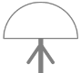 |  |
| Partially Open |    |    |
| Fully open     | 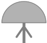   |    |

**Valve Head (MOV/EOVs and block valves)**

 Connects to: EquipmentName.Open, EquipmentName.POS, EquipmentName.Closed, EquipmentName.Opening, EquipmentName.Closing

Для MOV/EOV і блокувальних клапанів колір заповнення головки клапана відповідає тій же схемі, що й для [регулюючих клапанів](file:///C:/Program Files (x86)/AVEVA Plant SCADA/Bin/Help/SCADA Help/Content /ASM_Control_Valve.htm) і [демпфери](file:///C:/Program Files (x86)/AVEVA Plant SCADA/Bin/Help/SCADA Help/Content/ASM_Damper.htm).

Однак на додаток до положення головки клапанів для MOV/EOV і блокувальні клапани також використовуються для вказівки перехідних станів. Тобто головка клапана використовує символи із символу індикатора робочого стану обладнання, встановленого для показу, коли клапан відкривається або закривається. Відкриття або закриття позначається трикутником у голівці клапана. Дивіться приклади нижче:

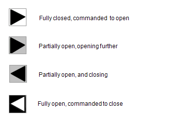        

**Special Control Indicator**

The special control  indicator can be used to indicate either of two special states: field control and computer control. No symbol appears for valves that are  under normal control via the SCADA system.

Спеціальний індикатор керування може використовуватися для вказівки будь-якого з двох спеціальних станів: місцеве керування з поля (ручне) і керування з компютера. Для клапанів, які перебувають під звичайним керуванням через систему SCADA, символ не відображається.

| State              | Appearance                                     |                                                              |
| ------------------ | ---------------------------------------------- | ------------------------------------------------------------ |
| Normal             | 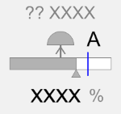     | Клапан нормально керується через систему керування (символ не показано) |
| Handswitch control | 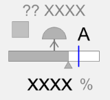 | Індикатор ручного перемикача з’являється, коли клапаном керують з поля за допомогою місцевого ручного перемикача. |

**Note**: Переконайтеся, що адреса, налаштована для клапана в ПЛК, збігається з адресою тегу, зазначеною в Plant SCADA. Якщо це не налаштовано належним чином, стан і вихідне значення клапана не будуть точними.