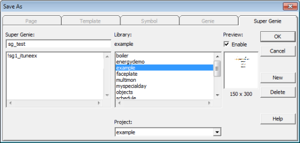
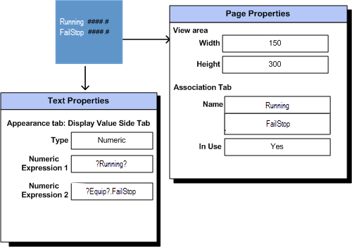
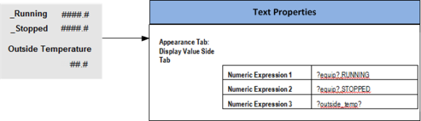
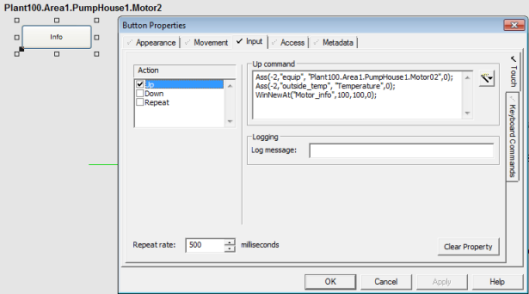

# Super Genies

Super Genie library objects are  non-instantiated pages that are linked to a Genie. When you save your  Super Genie as a library object, it is not saved as a normal page and  thus is not instantiated by default in your project. A Super Genie library object is only instantiated when it has been attached to a Genie and the Genie is placed on a graphics page in your project.

You can configure the Super Genie library object to display static and dynamic content using association Cicode functions. See Dynamic Associations for more information.

### Create a New Super Genie

You can configure and save a Super Genie page as a library object. If you save your Super Genie as a library object it is not saved as a normal page and thus is not instantiated by default  in your project. A Super Genie library object is only instantiated when  it has been attached to a Genie and the Genie is placed on a page in  your project. Once the library object is instantiated the Super Genie is available for use in your project.

**Note**: If you configure a  Super Genie in this way and name the page with an `!` prefix, then you  need to select List System Pages from the Graphics Builder Options menu  to show the page with the other pages, so you can then select it and  edit the page. Otherwise it will be hidden.

To create a new Super Genie:

1. Open Graphics Builder.
2. From the toolbar select the **New** button, or select **New** from the **File** menu. 
3. Click the Super Genie option. A blank Super Genie page will open. 
4. Create your Super Genie as you would any graphics page.
5. ​                            

6. From the toolbar select **Save**, or select **Save** from the **File** menu. 
7. The Save as dialog opens. The Super Genie tab is active, with no other options available.
8. Enter a name for the Super Genie in the **Super Genie** field (for example, "!sg2_test").
9. Select the **Library** and **Project** in which you would like to store the Super Genie. 
10. Like Genie libraries, Super Genies libraries are global and can be used between projects.

11. Click **OK**.

**Note**:  Save it in a Super Genie library using an exclamation mark (`!`) prefix. This keeps the pages hidden in the configuration environment (they are visible only if  attached to a Genie). The first eight characters of the Super Genie name need to be unique for each Super Genie.

### Super Genie Library Objects and the Page Properties Associations Tab

When you define a Super Genie, you are actually creating a Super Genie template, similar to a page template. When the Super Genie is instantiated in the project, this template is used to  create a new Super Genie page. At this point, any associations saved with the template are copied across to the Super Genie page. However, if subsequent changes are made to the page association definitions of the  template (under page properties), the corresponding associations of the  Super Genie page are not updated.

After the Super Genie page content has  been modified, the Super Genie page created from the template needs to be updated. In the Graphics Builder select **Tools | Update Pages**. 

If it is not updated. then your page may display out-of-date content.

### Attach a Super Genie to a Genie

To attach a Super Genie to a Genie:

1. Open Graphics Builder.
2. With the Genie open, select **Attach Super Genie** from the **Edit** menu.
3. Click **Add**. The Super Genie Dialog box will open.
4. Select the library to which the Super Genie belongs.
5. Select the Super Genie to attach (for example, "!PopUp_SG") and click **OK**.
6. The Super Genie is added to the Attach Super Genie list.

7. Click **OK** to save the changes, or click **Cancel**.

**Note:** A Super Genie can be attached to more than one Genie.

### Edit a Super Genie Library Object 

If you modify a Super Genie while its project is running in the background, you will be prompted to 'Update Pages'. This will update your changes in the runtime environment. If a runtime  page containing the Super Genie is displayed when the change is made, it will not be updated until after you exit the page and display it again.

For those  pages created from a Super Genie, if the parameter [CtDraw.RSC]AllowEditSuperGeniePage is set to 0 (the  default), a message will be displayed that will help prevent you from  editing the Super Genie page directly. Instead you will need to edit the Super Genie Library object that created that page. 

If the parameter  [CtDraw.RSC]AllowEditSuperGeniePage is set to 1, a message will display  that asks for confirmation before allowing you to edit the page  directly.

**Note**: Changes made directly  to a  page (created from a Super Genie) will be overridden when you ' Update Pages'.

#### Open an Existing Super Genie Library Object

To open an existing Super Genie library object: 		

1. Open Graphics Builder.
2. Click the **Open** toolbar button, or select **Open** from the **File**  menu.
3. Select the **Super Genie** tab.
4. Select the **Project** and **Library** in which the Super Genie is stored.
5. Select the  **Super Genie**.
6. Click **OK**.

#### Delete a Existing Super Genie Library Object

To delete a Super Genie library object:

1. Open Graphics Builder.
2. Click the **Open** toolbar button, or select **Open** from the **File**  menu.
3. Select the **Super Genie** tab.
4. Select the **Project** and **Library** in which the Super Genie is stored.
5. Select the  **Super Genie** and click **Delete**.
6. A confirmation message will display. 

7. Click **OK** to delete the library object.

Deleting a Super Genie  that has been attached to a Genie will not cause that Genie to become inoperable at runtime. 

**Note**: If you delete a Super Genie that is in use, the object configured to call the page at runtime will become inoperable.

#### Edit a Super Genie Page

If you modify a Super Genie while its project is running in the background, you will be prompted to 'Update Pages'. This will update your changes in the runtime environment. If a runtime  page containing the Super Genie is displayed when the change is made, it will not be updated until after you exit the page and display it again.

Open an Existing Super Genie Page](javascript:void(0);)

To open an existing Super Genie page:

1. Go to Graphics Builder.
2. Click the **Open** toolbar button, or select **Open** from the **File**  menu.
3. Select the **Pages** tab.
4. Select the **Project** to which the page belongs.
5. Select the  **Super Genie**.
6. Click **OK**.

#### Delete a Super Genie Page

To delete a Super Genie page from the project:

1. Click the **Open** toolbar button, or select **Open** from the **File**  menu.
2. Select the **Pages** tab.
3. Select the **Project** to which the page belongs.
4. Select the  **Super Genie** and click **Delete**. 
5. A confirmation message will display. 
6. Click **Yes** to delete the page and its records from the project. Click **No** to delete the page from the project only. Click **Cancel** to cancel the operation.

**Note**: If you delete a Super Genie page that is in use, the object configured to call the page at runtime will become inoperable.

# Dynamic Associations 

Dynamic associations are placeholders you can  use on a graphics page to link to equipment, 'equipment.item' and/or variable tag references via association Cicode functions at runtime.

**Note:** Prior to Citect SCADA 2015, dynamic associations were referenced within Super Genie pages.  With the introduction of equipment, 'equipment.item' references and  partial associations, the concept is now referred to as dynamic associations.

When you replace part or all of a command or expression with a placeholder, the placeholder is called an association.

You can use associations in any graphics object properties that accept tags, commands and expressions. You can also use associations in:

- log messages for object touch and keyboard commands
- tool tips
- page keyboard commands
- the comment for Trend objects.

However, you cannot use the dynamic association syntax in a report, alarm, trend, or background Cicode function.

In the illustration below,  Numeric Expression 1 has been replaced with a placeholder '?Running?'. The question marks  (`? ?`) denote it is a dynamic association.

Only part of Numeric Expression 2 has been replaced with the placeholder `?Equip?`.

​                    

### Define Dynamic Associations

To define a dynamic association, enclose the  association name between question mark (`?`) characters. You can also  include the data type, though this is optional. 

```
?<Association>?
?<Data Type> <Association>?   
```

Everything between the question mark characters will be replaced at runtime with the associated value. The association  may be referenced as many times as necessary on a graphics page.

**Note**: If you have upgraded and historically used numbers in your associations, these will continue to work as numbers are regarded the same as a name.

The data types for an association allow you to pass tags of the following types:

- BYTE
- BCD 
- DIGITAL
- INT
- UINT
- LONG
- LONGBCD
- STRING
- REAL

When the `<Data_Type>` is not specified, Citect SCADA will automatically use the relevant typecast variable type at runtime.

**Note**: Explicit type casting to BCD, BYTE, LONGBCD, UINT and ULONG types is not supported for the associated tag. Use automatic data type associations for these  types. If using automatic data type associations, be aware that it may be more difficult to decipher error logs.  	

In the following example an association has  been used in numeric expressions 1 to 3. The names used are "equip" and  "outside_temp". As they are associations, the names have been placed  within `? ?`. 

​                    

For Numeric expression 1 and 2, only part of  the expression has been associated with a placeholder. For numeric expression 3, the whole expression has been replaced with an association.

This means at runtime, a variable tag,  equipment name or `equipment.item` reference will replace the  associations `?equip?` and `?outside_temp?` in the expression. 

​	You can also use the association with prefixes, suffixes and logical operators. For example:

- `?INT equip?.Running`
- `Plant100.?INT equip?.Running`
- `?INT 1?_PV , TAG_?INT 1?, TAG_?INT 1?_PV`
- `(NOT(?30?)OR(?52?)OR(?152?)) AND(?54?)`
-  `(NOT ?30? OR ?52? OR ?152?) AND ?54?)`.

**Note**: When using logical  operators, use brackets or spaces in the dynamic associations. If  brackets or spaces are not used, the compiler will produce an  "Incompatible type" error message.

This will be expanded to the complete reference at runtime. For example, an association of `?equip?.Running` when  associated with equipment named `Pump1`  at runtime, will become  `Pump1.Running`.

**Note**: Tag elements (for  example, `Field`, `Override Mode` or `Control Mode`) and Tag Items (for  example, `V`, `Q`, `T`) are not supported for partial associations in dynamic  associations.

### Use Equipment References with Dynamic Associations 

When defining dynamic associations, you can use full or partial associations to generate the complete `equipment.item`  reference when a page is displayed at runtime.

For example, you can define dynamic associations to display the values of the following equipment from the Example Project:

- `Example_Motor.FailStop`
- `Example_Motor.FailStart`
- `Example_Motor.Running`.

To do this, you can configure object properties as follows:

| Numeric expression | ?Equip.FailStop?  |
| ------------------ | ----------------- |
| Numeric expression | ?Equip.FailStart? |
| Numeric expression | ?Equip.Running?   |

For each numeric expression, a full association has been used as a dynamic association.

When configuring an object to call the dynamic  association page, each `equipment.item` reference will be passed to the  dynamic association using an association Cicode function. Each dynamic  association needs to be configured in the object.

```c
Ass(-2, “Equip.FailStop”,” “Example_Motor.FailStop”);
Ass(-2, “Equip.FailStart”, “Example_Motor.FailStart”);
Ass(-2, “Equip.Running”, “Example_Motor.Running”);
WinNewAt(“equipSg”,100,100,0);
```

Using a partial association (where only part of the `equipment.item` reference is used), you can configure the numeric  expressions as follows:

| Numeric expression | ?Equip?.FailStop  |
| ------------------ | ----------------- |
| Numeric expression | ?Equip?.FailStart |
| Numeric expression | ?Equip?.Running   |

When configuring the object to call the dynamic association page, only one `equipment.item` reference needs to be  passed to the dynamic association using an association Cicode function. 

```
Ass(-2, “Equip”, “Example_Motor”);
WinNewAt(“equipSg”,100,100,0);
```

### Use Structured Tags with Dynamic Associations 

Dynamic associations support direct  concatenation of the  tag with other information (as do Genies). For  example, the following is valid:

```
?INT 1?_PV , TAG_?INT 1?, TAG_ ?INT 1?_PV
```

### Link Dynamic Associations

Citect SCADA allows you to link dynamic associations. Linking refers to a situation  where an existing set of associations are passed onto a new page. 

To do this, configure the graphics object's  input command to use the AssChain Cicode functions when displaying the  related pop up.

### Dynamic Associations and Areas 

When you display a dynamic association, the  area of the page is inherited from its parent. For example, if the  parent page is in area 1, when you display a dynamic association it will also be area 1. This allows you to call the same dynamic association  from different pages in different areas.

The inherited area may be avoided by defining a specific area for the dynamic association. This means, every instance  of the dynamic association will have the same area, despite the area  inherited from its parent. 

Dynamic associations will only inherit areas if their area is blank.

### Use Constants with Dynamic Associations 

You can use the following types of constants with dynamic associations: 

- STRING
- INTEGER
- DIGITAL 
- REAL
- LONG.

To pass a constant you need to format the  argument in the association function to include a single quote on either side. For example, to pass the constant data **1.2345** into a dynamic association, you would call the association function like this:

```
Ass(hWin, sArg, "'1.2345'");
```

To pass a variable tag or `equipment.item` tag reference, you don't need the single quotes. For example, to pass variable tag **TAG1** into a dynamic association, you would call the association function as follows;

```
Ass(hWin, sArg, "TAG1");
```

 Or if using `equipment.item'`to reference the variable tag:

```
Ass(hWin, sArg, "Pump.Speed");
				
```

The ability to pass constants into dynamic  associations is restricted in that the constant association can be used  where you can enter a normal Cicode tag. For example, a keyboard  command, a symbol address field, and so on. 

Можливість передавати константи в динамічні асоціації обмежена тим, що константна асоціація може використовуватися, де ви можете ввести звичайний тег Cicode. Наприклад, команда з клавіатури, поле адреси символу тощо.

### Use Arrays and Array Offsets with Dynamic Associations

Dynamic association can accept array elements  or entire arrays as substitution. Passing an element of an array is achieved by referencing the element, as shown here:

```
AssPopUp("MyPopUp", "DigArray[42]");
```

To pass an entire array to a dynamic association, only the array name is used. For example:

```
AssPopUp("MyPopUp", "DigArray");
```

#### Use Arrays with Dynamic Associations

To pass an entire array to a  dynamic association, configure it to accept the array instead of a  single value. Use the following syntax for the dynamic association  substitution string:

```
?<Data Type><Substitution String>? [<element>] 
```

Only arrays of data type DIGITAL, INT, REAL, and LONG are supported.

#### Use Array Offsets with Dynamic Associations

You can use array offsets with a tag that is an array.

For example, you may have a tag (named *Tag1*) defined as an array of four elements. When using the GENERIC protocol, the tag has an address I1[4]:

| Tag1 = I1[4]  -> | I1   |
| ---------------- | ---- |
|                  | I2   |
|                  | I3   |
|                  | I4   |

Tag1 represents the registers I1, I2, I3 and I4. When Tag1 is used with the Ass Cicode function it behaves as follows:

- If you associate a value using `Ass(hWin, "X", "Tag1", 0)` then the substitution string `?X?[0]` gives the value in `I1`.
- If you associate a value using `Ass(hWin, "X", "Tag1", 0)` then the substitution string `?X?[2]` gives the value in `I3`.
- If you associate a value using `Ass(hWin, "X", "Tag1[0]", 0)` then the substitution string `?X?[2]` gives the value in `I3`.
- If you associate a value using `Ass(hWin, "X", "Tag1[1]", 0)` then the  substitution string `?X?[2]` gives the value in `I4`. This is because the  two offsets are added together to determine the final offset within the  array variable.
- If you associate a value using `Ass(hWin, "X", "Tag1[2]", 0)` then the  substitution string `?X?[2]` gives the error `#ERR`. This is because the sum of the two array offsets gives a position (`Tag1[4]`) that is outside the bounds of the array.

You can also use array offsets with a tag that is not an array.

For example, you may have a tag (named `Tag2`) defined as a single value. When using the GENERIC protocol, the tag has an address I1:

| Tag2 = I1  -> | I1   |
| ------------- | ---- |
|               |      |

When Tag2 is used with the Ass Cicode function, it behaves as follows:

- If you associate a value using Ass(hWin, "X", "Tag2", 0) then the substitution string ?X?[0] gives the value in I1. This is because a non-array tag is equivalent to an array with one element.
- If you associate a value using Ass(hWin, "X", "Tag2[0]", 0) then the  substitution string ?X?[0] gives the value in I1. This is because a  non-array tag is equivalent to an array with one element.
- If you associate a value using Ass(hWin, "X", "Tag2", 0) then the substitution string ?X?[2] gives the notification #ERR. This is because a non-zero  offset cannot be applied to a non-array tag.
- If you associate a value using Ass(hWin, "X", "Tag2[0]", 0) then the  substitution string ?X?[2] gives the notification #ERR. This is because a non-zero offset cannot be applied to a non-array tag.
- If you associate a value using Ass(hWin, "X", "Tag2[1]", 0) then the  substitution string ?X?[2] gives the notification #ERR. This is because a non-zero offset cannot be applied to a non-array tag.
- If you associate a value using Ass(hWin, "X", "Tag2[2]", 0) then the  substitution string ?X?[2] gives the notification #ERR. This is because a non-zero offset cannot be applied to a non-array tag.

### Create a Dynamic Association Page

You can configure any graphics page (normal or  Super Genie) to use dynamic associations. This allows the page to be  reused in different contexts as the actual data that is used is assigned at runtime when the page displays.

To create a dynamic association page:

1. Open Graphics Builder.
2. From the toolbar select **New**.
3.  Or:

4. From the **File** menu, select **New**.

5. On the New dialog box, select **Page** or **Super Genie**.
6.  If you select Page, the Page Template dialog box will display. Choose the required **Template** and click **OK**.

7. Add the required objects to the page.
8.  Right-click on an object and select **Properties**. 
9. Configure the dynamic associations in the required property fields.
10. Click **OK** to apply the changes.
11. From the **File** menu select **Save**.
12. In the Save dialog, select the project to which the page will belong.
13. Name the page and click **OK**.

### Display a Dynamic Association Page

To display a page that uses dynamic  associations, you need to add an object to a graphics page that is  configured to call the page. For example, you could use a new menu item, a button, or a symbol.

When configuring the object, you use one of the Association Cicode functions. At runtime, this  links the associations  with the equipment, `equipment.item` or variable tag references.

If you use the association Cicode function, you need to use it once for each value you want to pass to the Super Genie.

To use a Dynamic Association:

1. Open Graphics Builder.

2. Open the page to which you would like to add an object that calls the dynamic association page.

3. Place and configure an input object on the page. This object will process the dynamic associations. 

4. This is illustrated in the screen  shot below, where a button was placed on the graphics page that will  process two associations before displaying the popup page.

5. ​                            

6. ​				The **Up** input command for the button has been configured as follows:	

7. ```
   Ass(-2,”equip”,”Plant100.Area1.PumpHouse1.Motor2”,0);
   Ass(-2,”outside_temp”,”Temperature”,0);
   WinNewAt("Motor_info",100,100,0);
   ```

8. Where:

9. - "equip" is the name of the substitution and "Plant100.Area1.PumpHouse1.Motor2" is the  equipment name assigned to the association.
   - "outside_temp" is the name of the substitution and "Temperature" is the tag name assigned to the association.
   - "Motor_info" is the name of the dynamic association page.

10. Save the graphics page.

### Page Properties - Associations 

The Page Property association Name Tab is used  to define default Associations.  The name you use when defining a Super Genie association is entered in the Name Field. 

Use this tab to reference or edit existing  associations. In using this tab you can add those associations that are  currently in use in a Super Genie association and define the appropriate default value and value on error fields. You can also add a  description. 

Double-click in the row to make it editable, or Click **Add**.

| Field                          | Description                                                  |
| ------------------------------ | ------------------------------------------------------------ |
| **Name**                       | **Note**: On upgrading from an earlier version of Citect SCADA existing numbered substitutions  are taken from defined Super Genie pages and automatically listed in the drop down box. For new associations enter  the  name of the association directly in the field [Name] provided: or  select the  name of the association from the drop-down box. Only those  association names that are ‘in-use’ as part of a Super Genie assocaition are listed. For example, if the association in the expression field of a button was `?Speed?` then the association name is `Speed.Name` Associations:    To start with an alphanumeric or “_” character    To contain only those characters that are allowed in variable tag names (excluding the period character ‘.’), and not contain any white space.    Be no more than 253 characters in length |
| **Default (optional)**         | Enter the default value to be used if the page association has not been performed using one of the Association Cicode functions at runtime. The default value needs to be either a literal string constant enclosed in single quotes (e.g. <'a literal value'> or <'1.23'>) or a valid full or partial tag name, equipment.item reference. |
| **Value on Error (optional):** | Enter the text to be used  if no default value is defined and the association is not performed, or  if the defined association did not resolve to a valid tag name. Since  the value on error cannot be a variable tag, it is not necessary to  enclose the text in quotation marks.If the association on the  page is specified in a typed format, the value will be converted to the  specified type. If the value cannot be converted a hardware alarm will  be raised. For example, if the association is specified as `?INT AlmDesc?` and the value on error is set to `<LowLevel>`, the animation will  display zero (0) and a hardware alarm will be raised. Typeless  substitutions such as `?AlmDesc?` will display the value on error as  specified. |
| **Description (optional):**    | Enter a description of the page association. The description is useful when maintaining associations. |
| **In Use:**                    | This column can not be edited and simply indicates if the association is in use on the current page in a Super Genie. |

When finished click **Add**, the association is then added to the table.

To edit an association select an item and click **Edit** or double-click on the row to make it editable. You can not edit the  name of an existing association that is in use. However you can select a new name in an existing row, and when this name is `<ENTERED>`, a  new row of information will be displayed and the existing row of data  will disappear.

To delete an association select the row in the table and click **Delete**. You can delete associations in use or not in use. If you delete the  object from the page, the status of the association used in the Super  Genie substitution will be updated to not in-use. 

Click **Ok** or **Apply** to save the association table or click **Cance**l to discard any changes you may have made.


