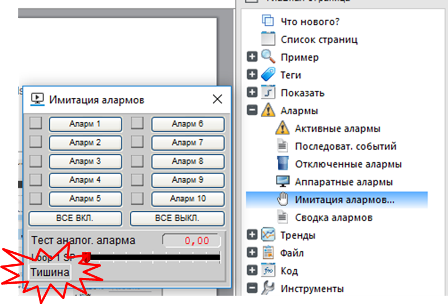
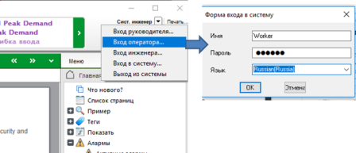
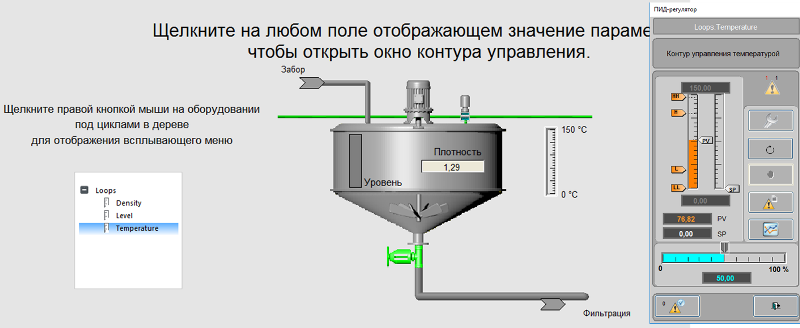
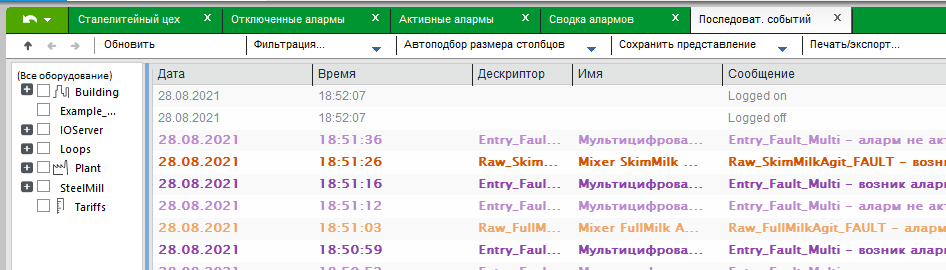
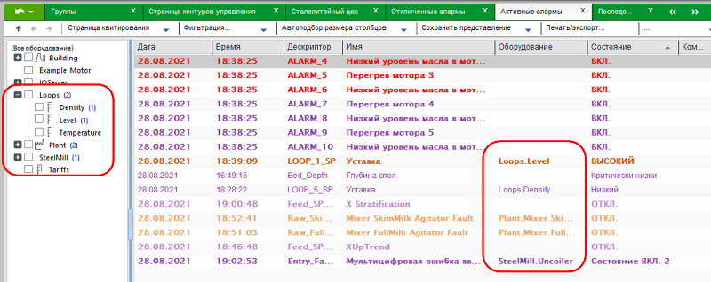

# Лабораторна робота №1

**Тема. Середовище виконання** **SCADA/HMI.**

**Тривалість**: 4 акад. години (4 пари).

**Мета:** ознайомлення з можливостями середовищ виконання SCADA на базі Citect 2018 R2.  

**Цілі.** 

1. Навчитися налаштовувати запускати, зупиняти, перезапускати середовище виконання Citect 2018 R2. 

2. На прикладі демонстраційного проекту ознайомитися з основними можливостями середовища виконання: анімацією, тривоговими екранами, трендами та інш.

**Лабораторна установка**

Апаратне забезпечення: ПК. 

Програмне забезпечення: Citect 2018 R2.

## Порядок виконання роботи 

**Увага!** Дана лабораторна робота потребує встановленого Citect 2018 R2. Образ дистрибутива Citect можна завантажити [за посиланням](https://schneider-electric.app.box.com/s/lgd27nur1rin1hs4x822g8lr6tlr2y82/folder/91719058330). Також зверніть увагу, що у методичних рекомендаціях до лабораторних робіт використовуються терміни та інтерфейс російськомовної локалізації Citect. 

## 1. Налаштування та запуск середовища виконання 

- [ ] Використовуючи помічник, налаштуйте середовище виконання на запуск проекту "Example". Порядок налаштування середовища виконання описаний в [Додатку 1](lab1a1.md).

- [ ] Запустіть середовище виконання Citect "AVEVA" -> "Исполнительная система Citect". 

  

  Рис.1.1 Запуск виконавчої системи Vijeo Citect

- [ ] У вікні попередження "Деморежиму" натисніть "Ок". 

У демонстраційному режимі середовище виконання працює 15 хвилин (якщо є зовнішні драйвери), що достатньо для перевірки працездатності проекту. Проект "Example" не використовує зовнішніх змінних вводу/виводу, тому він буде працювати без обмежень. 

## 2. Зміна мови інтерфейсу та реєстрація користувача 

- [ ] Ознайомтеся зі структурою меню на правій бічній панелі, поступово відриваючи їх (натисканням по хрестику). 
- [ ] Знайдіть пункт меню, який відповідає за налаштування (інструменти/Tools), в якому знайдіть розділ "Language" та змініть мову на російську. Ви можете продовжувати працювати з англомовним інтерфейсом, якщо Вам так зручніше, однак надалі в роботі будуть використовуватися посилання російськомовні пункти меню.  

рис.1.2. Зміна мови інтерфейсу.

За замовченням, у виконавчій системі працює функція озвучування тривог. Якщо це Вас не влаштовує зробіть наступну дію.

- [ ] Зайдіть в пункт меню "Алармы->Имитация алармов" Відключіть  

рис.1.3. Відключення озвучування тривог

- [ ] Зареєструйтеся під користувачем "Оператор" ()"Worker"), як це показано на рис.1.4. Пароль вводити не потрібно, він заповнюється автоматично. Однак слід вибрати мову інтерфейсу, наприклад Russian. 

Рис.1.4 Вікна зміни користувача

## 3. Знайомство з можливостями графічного інтерфейсу 

- [ ] Поступово відкриваючи різні вікна, визначте які частини людино-машинного інтерфейсу залишаються завжди видимими. Занотуйте для звіту і визначте їх призначення. 

- [ ] У розділі меню"Пример"- відкрийте вікно "Разлив. машина". 
- [ ] Спробуйте покерувати у ручному режимі двигуном мішалки. Зверніть увагу на спосіб реалізації панелі керування двигуном. 

 Рис.1.5 Керування мішалкою

- [ ] Знайдіть елементи збільшення та зменшення швидкості руху пляшок та змініть швидкість до 25%(задається у %). 
- [ ] Підійдіть критично до реалізації інтерфейсу сторінки і подумайте, якої інформації вам не вистачає і яка є зайвою.

- [ ] Відкрийте сторінку "Показать" – "Ввод оператора"  Знайдіть елементи з наступними способами вводу/зміни значення (зверніть увагу що введення тексту та значення працює без попадання курсору в поле для вводу): 

- зміна дискретного значення кнопкою перемикання;
- введення текстового значення;
- введення числового значення шляхом набору з клавіатури;
- введення числового значення шляхом набору з віртуальної клавіатури Citect; 
- зміна значення повзунками (вертикальними, горизонтальними і круговими);
- зміна значень переміщенням по 2-м осям;
- зміна значення переміщенням елемента числового відображення;

При введенні числового та текстового значення спробуйте також вводити дуже великі числа.

## 4.Робота з компонентами 

- [ ] Відкрийте сторінку "Показать" – "Джини". Натисніть кнопку "Тестировать Genie" і знайдіть елементи з наступними способами вводу/зміни/відображення значення:

- анімація зміною зображення, в тому числі багато-кадрового;
- анімація зміна тексту;
- анімація зміни кольору;

- [ ] Відкрийте сторінку "Показать" – "Группы". Увімкніть режим "демонстрація" і дочекайтеся поки вона закінчиться. 
- [ ] Використовуючи різні типи повзунків покеруйте краном. Зверніть увагу на групові операції в анімації.

- [ ] Відкрийте сторінку "Показать" – "объекты". Використовуючи повзунки змінюйте: габарити, розміщення по вертикалі та горизонталі, кут повороту об’єктів, градієнт кольору. Зверніть увагу на"множинність" анімації (декілька анімацій для того ж об'єкту). 
- [ ] Використовуючи команду "Спрятать"спробуйте анімацію видимості.

- [ ] Відкрийте сторінку "Показать" – "ActiveX". Натисніть кнопку "Авто" для демонстрації роботи індикаторів.
- [ ] У ручному режимі спробуйте змінювати значення.

## 5.Налаштування регуляторів 

- [ ] Відкрийте сторінку "Показать" - "Контуры управления". Ознайомтеся зі змістом сторінки і можливостями, які вона надає.
- [ ] Для одного з  контурів (Loop), наприклад "Temperature" змініть значення виходу (OP, "Выход контроллера") в значення 50%. Дочекайтеся, коли плинне значення добереться до усталеного значення. 

 Рис.1.6 Налаштування регулятору

- [ ] Переведіть контур в автоматичний режим (призначення кнопок вказується контекстними підказками). Виставте значення уставки (SP) приблизно ¾ від розміру шкали.
- [ ] Інші два контури  також переведіть в автоматичний режим і виставте значення приблизно ¾ від розміру їх шкали.

- [ ] Змініть коефіцієнти ПІД-регулятора на одному з контурів, використовуючи кнопку "Подстроить".
- [ ] Для одного з контурів відкрийте тренди реального часу кнопкою "Покзать тренды". Подивіться як змінювалися значення. **Зробіть копію екрану для звіту.** 

## 6.Тренди реального часу 

- [ ] Відкрийте сторінку "Пример" - "Сталелитейный цех". 
- [ ] Проаналізуйте трендовий графік, визначте за що відповідає кожна крива. 
- [ ] На верхній частині графіку у вигляді ступінчатого сигналу показаний час виникнення тривог, спостерігаючи за ним проаналізуйте що значить кожна сходинка і що значить її колір. 
- [ ] Зафіксуйте що значить колір тривог для звіту. 

 Рис.1.7. Перегляд трендів реального часу

## 7.Активні тривоги

- [ ] Перевірте чи усі тривоги активовані (в експлуатації). Для цього зайдіть у розділ "Алармы" -> "Отключенные алармы" і подивіться чи є в списку є якісь заблоковані тривоги.
- [ ] Якщо є заблоковані тривоги, зареєструйтеся в системі виконання під користувачем "Інженер" і натисніть "Включить страницу" (Що значить зняти блокування з усіх заблокованих тривог). Потім знову зареєструйтеся в системі виконання під користувачем "Оператор" ("Worker").

- [ ] Відкрийте сторінку "Алармы" – "Активные алармы". 
- [ ] Для можливості зміни стану тривог відкрийте вікно зі сторінкою "Алармы" – "Имитация алармов".
- [ ] Змінюючи стан тривог (Аларм1, Аларм2 і т.д.) прослідкуйте як вони себе ведуть у списку активних тривог та на панелі останніх тривог (видимих на всіх сторінках). Зверніть увагу на наявність повідомлень у списку активних тривог при їх зникненні. Занотуйте для звіту поведінку тривог. 

 Рис.1.8. Робота зі списком активних тривог

- [ ] Проаналізуйте зміст контекстного меню одного з повідомлень тривог в списку. Зверніть увагу на пункти, які там недоступні. 
- [ ] Зареєструйтеся в системі виконання під користувачем "Інженер". Проаналізуйте зміст контекстного меню.   

 Рис.1.9. Контекстне меню тривог

- [ ] Користуючись контекстним меню викличте вікно з властивостями ("Сведения") однієї з тривог (надалі"експериментальна") і зробіть копію екрану для аналізу і звіту. 
- [ ] Для однієї з інших тривог виберіть пункт контекстного меню "Квитировать". Аналогічну операцію можна  зробити через вікно останніх тривог.
- [ ] За допомогою вікна "Имитация алармов" зробіть щоб тільки "експериментальна" тривога була активною. 
- [ ] Натисніть кнопку в головному меню "Страница квитирования", що значить підтвердити усі тривоги на сторінці.  
- [ ] Звернітьувагу на те, які повідомлення залишилися на сторінці активних тривог. Подивіться властивості тривоги, зробіть копію екрану і порівнюючи з попереднім, зробіть аналіз того, що змінилося.  

## 8.Блокування тривоги

- [ ] За допомогоювікна "Алармы" – "Имитация алармов"активуйте перші три "Аварії". 
- [ ] Виділіть їх (натискаючи в списку з кнопкою Ctrl) та через команду в контекстному меню заблокуйте.

 Рис.1.10. Блокування тривог

- [ ] Тепер ці тривоги виведені з експлуатації і не будуть відслідковуватися системою. Для їх активації зайдіть у розділ "Алармы" -> "Отключенные алармы" і натисніть "Включить страницу" (Що значить зняти блокування з усіх заблокованих тривог).

## 9.Фільтрування та налаштування списку тривог

- [ ] Користуючись командою "ВСЕ ВКЛ." на сторінці "Алармы" – "Имитация алармов" увімкніть усі тривоги.
- [ ] Забезпечте також спрацювання тривоги для `Loop_1_SP`. 
- [ ] Перейдіть на вікно активних тривог. Використовуючи налаштування фільтру для сторінки зробіть відображення тільки тривог, що мають стан "ON".

 Рис.1.11. Фільтрування списку тривог

- [ ] Перегляньте, які тривоги залишилися в списку, після чого використовуючи верхнє меню скиньте налаштування фільтрації.
- [ ] Користуючись верхньою панеллю сторінки активних тривог добавте поля (колонки) "Категория" и "Оборудование".

 Рис.1.12. Керування колонками

## 10.Зведення тривог

- [ ] Перейдіть на сторінку "Алармы" – "Сводка алармов".
- [ ] Подивіться яка інформація і в якому вигляді доступна для даного зведення. За необхідності використовуйте вікно імітації тривог.
- [ ] Занотуйте для звіту основні особливості вікна зведення. 

 Рис.1.13. Сторінка зведення тривог

## 11.Вікно журналу тривог та подій (SOE)

- [ ] Перейдіть на сторінку журналу тривог та подій "Алармы"->"Последовательность событий" (SOE). 
- [ ] Подивіться чим принципово відрізняється цей журнал від сторінки Зведення тривог.
- [ ] Проаналізуйте усі можливості, які надає журнал тривог та подій.

 Рис.1.14. Сторінка журналу подій та тривог (SOE)

## 12.Фільтрація з використанням вікна устатковання

- [ ] Відкрийте вікно активних тривог. Зробіть щоб усі тривоги у вікні імітації тривог були включені.
- [ ] Подивіться властивість "Оборудование" (устатковання) для тривог.
- [ ] Знайдіть це устатковання на лівій бічній панелі в ієрархічному меню. Зверніть увагу на цифри в дужках біля устатковання. Виясніть що вони значать і зробіть нотатки для звіту. 

 Рис.1.15. Фільтрування списку тривог за устаткованням

- [ ] На панелі устатковання виставіть опцію у квадраті біля Loops. У списку тривог повинні залишитися тільки ті тривоги, які стосуються цього устатковання (фільтрування списку за устаткованням).
- [ ] Виставіть опції і для іншого устатковання, в яких є тривоги. 
- [ ] Зніміть усі опції.
- [ ] Відкрийте вікно журналу тривог і подій (SOE), подивіться як там працює фільтрація за устаткованням.

## 13.Історичні тренди - демонстрація

- [ ] Перейдіть на сторінку "Тренды" – "Демонстрация Process Analyst".  
- [ ] Запустіть демонстрацію трендів натиснувши відповідну команду в головній панелі інструментів (рис.1.16) трендового переглядача (Trend Viewer). 

 

Рис.1.16 Вікно демонстрації тренду

- [ ] Поступово будуть переключатися різні тренди (біля 5-ти видів) щоб показати основні можливості переглядача трендів. Подивіться які варіанти відображення трендів доступні у виконавчій системі Citect 2018 R2 і як змінюється легенда та її зміст. При цьому зверніть увагу на:

- нижню частину екрану, в якій знаходяться підписи до трендових і тривогових кривих з їх значеннями (легенда тренду);
- верхню частину, де рисуються криві трендів та/або станів тривог;
- на головну панель інструментів над трендами 
- на панель інструментів навігації  під трендами

## 14. Основні команди переглядача трендів

- [ ] Відкрийте сторінку "Показать" - "Контуры управления". 
- [ ] Проконтролюйте щоб контур Level  був у автоматичному режимі. Змініть уставки контуру рівня Level приблизно на 25% від плинного значення. 
- [ ] Перейдіть на сторінку "Тренды"- "Одиночный тренд". 
- [ ] Зробіть видимим курсор, за допомогою кнопки "Показать/скрыть курсор" на верхній панелі інструментів. Переведіть курсор в зону перехідного процесу. 

Рис.1.17. Використання курсору

- [ ] За допомогою команди головної панелі інструментів активуйте трендову статистику (Show/Hide Trend Statistic). Подивіться які значення змінних були в точці хвилини від початку перехідного процесу та проаналізуйте інформацію зі статичних даних. 
- [ ] **Зробіть копію екрану для звіту.**

- [ ] Користуючись панеллю інструментів навігації кнопками "Назад на один интервал" та "Назад напол-интервала" подивіться якими були значення одразу після початку запуску виконавчої системи. 
- [ ] Знайдіть на панелі інструментівнавігації поля введення "Начального момента времени", "Конечного момента времени", зміни діапазону відображення та налаштуйте відображення тренду завесь період роботи на лабораторному занятті. Згадайте, за яких причин змінювалися ці значення. 
- [ ] За допомогою кнопки "Переключение автоматической прокрутки" активуйте режим автопрокрутки тренду. 

- [ ] Прексперементуйте та визначте призначення усіх команд для масштабування (збільшення, зменшення і т.п.).

## 15. Добавлення та видалення кривих на тренд

- [ ] Скориставшись командою головної панелі інструментів "Добавить кривые" добавте в переглядач трендів криві LOOP4_PV, LOOP4_SP, LOOP4_OP (аналогічно LOOP5) для контурів Temperature і Density:
  - на панелі натисніть кнопку з зображенням `+` та олівця
  - у вікні добавлення (рис.1.18) треба вибрати тип "Тренды", ввести в полі тег значення \*loop\* для зменшення кількості виведення результатів пошуку і натиснути кнопку пошуку
  - після чого з вінка результатів пошуку вибрати потрібні змінні та подвійним кліком (або кнопкою "Добавить") добавити її в список вибраних елементів
  - Після вибору змінних клікнути на "Ок".   

  

Рис.1.18 Вікно добавлення нових кривих 

- [ ] використовуючи кнопку `-` видаліть з переглядача усі теги, крім *LOOP*

- [ ] Скориставшись командою головної панелі інструментів "Добавить кривые" добавте в переглядач декілька кривих зі змінними реального часу ("Переменные теги"). 
- [ ] Подивіться також інші можливості трендових переглядачів. 

## 16. Збереження та використання налаштувань переглядача трендів 

- [ ] Збережіть вибрані налаштування у файл з назвою "TrendsIvanenkoIvan.pav" (в назві має бути ваші імя і прізвища на латиниці без пробілів), використовуючи команду "Сохранить вид" з головної панелі інструментів.
- [ ] Поступово відкриваючи кілька файлів *.pav подивіться збереження на даний момент налаштування.

## 17.Тривоги в переглядачі трендів 

- [ ] За допомогою вікна "Алармы" – "Имитация алармов" та списку активних тривог включіть кілька тривог, підтвердіть (квітіруйте) їх та відключіть.
- [ ] Відкрийте сторінку "Тренды"- "Одиночный тренд" та у переглядачі трендів відкрийте налаштування "Alarms.pav".
- [ ] Проаналізуйте як графічно відображаються стани тривог. Подумайте які переваги це може дати в комбінації з відображенням трендів.
- [ ] Зробіть копії екранів та зробіть примітки для звіту та захисту.

Рис.1.19 Відображення тривог у переглядачі трендів.

## 18.Перегляд журналів та звітів

- [ ] У меню "Файл" подивіться протокол дії оператора та звіти. 

- [ ] Завершіть роботу системи виконанням команди "Завершить роботу" зі сторінки"Инженерные утилиты" меню "Инструменты" . 

## Порядок прийому роботи 

Викладач перевіряє вибірково виконання пунктів лабораторної роботи. Нижче наведена методика перевірки (орієнтовно, вибірково):

1. Покажіть способи вводу дискретного, аналогового, текстового значення. 

2. Покажіть способи відображення дискретного, аналогового, текстового значення. 

3. Покажіть властивість тривоги та прокоментуйте поля.

4. Застосуйте фільтр по часу, по типу, по устаткованню для тривог. 

5. Перевірка прав доступу до дій відповідно до зареєстрованого користувача.

6. Покажіть як тривоги блокуються та розблокуються.

7. Відобразіть тренд зміни значень контурів регулювання (LOOPs) за весь час лабораторної роботи.

8. Покажіть тренди з відображенням стану тривог. Прокоментуйте зовнішній вигляд тривог.

9. Покажіть скриншоти трендів за весь період лабораторної роботи, покажіть коли буди зміни завдань на які значення, тривоги (виникли, підтвердження, зникли);

## Питання до захисту 

1. Як організовано меню в проекті Example? Як організовані команди керування в меню на сторінках? 
2. Поясніть призначення меню верхнього рівня в проекті Example.
3. За допомогою яких елементів в проекті Example оператор швидко може побачити стан усієї системи?
6. Де і для чого в проекті Example використовується анімація миготіння?
7. Розкажіть яку інформацію Ви можете отримати зі сторінки "Разлив.машина". Які елементи використовуються для відображення стану та керування?
8. Які елементи вводу/зміни значення використовуються в проекті Example?
9. Які елементи відображення значення/стану використовуються в проекті Example?
10. Які елементи відображення в проекті Example, на вашу думку, є найбільш інформаційними? Які прийоми людино-машинного інтерфейсу в проекті варто б було змінити відповідно до сучасних стандартів. Обґрунтуйте свою відповідь.
11. Які засоби в проекті Example використовуються для відображення оператору імені та призначення того параметру, який відображається, або проводиться зміна?
12. Як в проекті Example на графіку(переглядачі) трендів показують різні типи тривог?
13. Які інструменти для перегляду тривог(активних, журналів тривог та ін.) та керування їх станом задіяні в проекті Example?
14. Як дізнатися про перелік активних тривог в даний момент часу? Чи доступна ця інформація перед очима у оператора завжди?
15. Як повідомлення тривог розрізняються за станом, пріоритетністю відображення?
16. Як дізнатися детальну інформацію про потрібну тривогу? Прокоментуйте, яка інформація доступна оператору?
17. Як ведуть себе повідомлення в списку активних тривог при зміні їх стану? Коли тривоги зникають з цього списку?
18. Розкажіть навіщо потрібно підтвердження (квітирування) тривоги? Як це робиться в проекті Example? Як видно чи тривога була підтвердженою?
19. Розкажіть навіщо потрібно блокування(виведення з експлуатації) тривог? Як це робиться в проекті Example? Де видно перелік заблокованих тривог? Як можна повернути тривоги до експлуатації (Деблокувати)?
20. Де і як можна дізнатися коли тривога виникла, зникла, була підтвердженою чи блокованою (виведеною з експлуатації)?
21. Навіщо потрібні фільтри в переглядачах тривоги? За якими полями тривоги в проекті Example можна застосовувати фільтри?
22. Яка інформація і в якій формі доступна взведенні тривог ("Сводка алармов")? Чим зведення тривог відрізняється від списку активних тривог?
21. Розкажіть про функції журналу тривог та подій (SOE).
22. Для чого призначені трендові переглядачі? Яку інформацію може відображати трендовий переглядач у Citect? 
23. Для чого потрібна легенда трендів? Яка інформація там доступна для відображення?
24. Розкажіть про призначення курсору на трендових переглядачах.
25. Назвіть елементи навігації та масштабування для трендів та розкажіть їх призначення.
26. Які можливості надає трендовий переглядач у Citect?
27. Розкажіть яким чином можна у Citect зберігати налаштування трендового переглядача і навіщо це може знадобитися.
28. Розкажіть яким чином відображаються тривоги в переглядачі трендів. Яку перевагу може мати такий спосіб відображення над класичним (в списку активних тривог)? 
29. Які обмеження для різних користувачів (аккаунтів) Ви побачили в проекті Example. 
30. Поясніть відмінність середовища розробки та середовища виконання SCADA/HMI. Яке саме середовище потрібне для роботи АРМу оператору на підприємстві?
31. Поясніть що таке проект SCADA/HMI? Чим відрізняється вихідний проект від скомпільованого і коли підприємству необхідні обидва варіанти проектів?
32. Від чого залежить вартість середовища виконання SCADA/HMI?
33. Які типові функції надають програмиSCADA/HMI?
