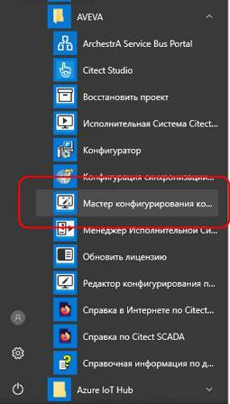
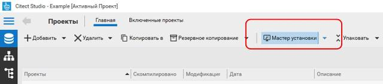
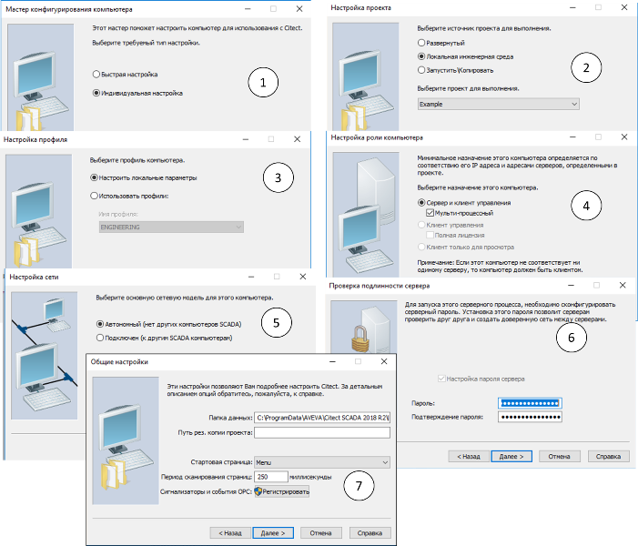

[До лабораторної роботи 1](lab1.md)

## Додаток 1.1. Налаштування середовища виконання та файл Citect.ini 

Середовище виконання (Runtime система) – це, по суті, виконавчий файл (або файли) Citect.exe який може виконувати проект, створений та скомпільований у середовищі розробки Citect. При запуску середовище виконання повинно знати про те, який саме проект необхідно запустити а також з якими налаштуваннями (наприклад, де зберігати файли для трендів та тривог, якою буде стартова сторінка і т.д.). Назва та місце розміщення проекту а також інші налаштування зберігаються в ***параметрах*** Citect, які на кожному комп’ютері зберігаються в файлі "Citect.ini". Розміщення файлу "Citect.ini" залежить від версії Citect та операційної системи, наприклад для Citect 2018 R2 це розміщення буде "C:\ProgramData\AVEVA\Citect SCADA 2018 R2\Config" .

"Citect.ini" є типовим текстовим ini-файлом, який містить розділи, назви та значення параметрів. Для його зміни можна користуватися будь-яким текстовим редактором або спеціалізованою утилітою "Редактор конфигурирования проектов", що поставляється разом з Citect. У будь якому з цих варіантів користувач повинен володіти достатньо великою кількістю знань, тому для спрощення налаштування основних параметрів виконавчої системи краще користуватися помічником налаштування комп’ютера, який доступний з меню "Пуск" Windows ("Настройка компьютера", рис.Д1.1) або з середовища розробки ("Мастер конфигурирования компьютера", рис.Д1.2).  

 

рис.Д1.1.

Рис.Д1.2

Тут не будемо пояснювати усі налаштування, вони будуть поступово описані в інших лабораторних роботах. Для мінімального налаштування запуску проекту "Example" необхідно в помічнику налаштування комп’ютеру вказати наступні значення параметрів (рис.Д.1.3):

- у першому вікні (1) необхідно вибирати "Индивидуальная настройка" для подальшого відображення максимальної кількості налаштовуваних параметрів;
- у вікні "Настройка проекта" (2) вибрати проект, що буде виконувати виконавча система, наприклад "Example"; проект до цього повинен бути скомпільований; для заново інстальованих систем проект "Example" вже скомпільований;
- у вікні "Настройка профиля" (3) можна вказати профіль з проекту, в якому вказуються усі налаштування для даного ПК, або налаштувати ці параметри окремо через відповідні пункти файлу Citect.ini ;
- у вікні "Настройка роли компьютера" (4) можна виставити опцію "Мульти-процессный", тоді кожна частина проекту (кожен сервер і клієнт) буде запускатися у вигляді окремого процесу ОС (окремий Citect.exe);
- у вікні "Настройка сети" (5) необхідно вибрати опцію "Автономный", тоді середовище виконання буде запускатися в режимі відсутності зв’язку з іншими середовищами виконання Vijeo Citect; якщо в даному вікні вибрати опцію "Подключен", то середовище виконання без ліцензійного ключа буде запускатися тільки на декілька секунд;
- в усіх інших вікнах налаштування (окрім наступних) у більшості випадків і для даної лабораторної роботи треба залишити за замовченням; 
- у вікні "Проверка подлинности сервера" (6) необхідно один раз вказати пароль доступу віддалених клієнтів до серверу; 
- у вікні "Общие настройки" (7) можна вказати стартову сторінку та папку розміщення історичних даних; для налаштування проекту "Example" залиште ці налаштування без змін; 
- після внесення усіх змін необхідно натиснути "Готово", для внесення їх у файл Citect.ini.      

Рис.Д1.3. Основні налаштування виконавчої системи за допомогою помічника

