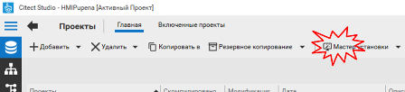

[Людино-машинні інтерфейси](https://pupenasan.github.io/hmi/)  Автор і лектор: Олександр Пупена доц. кафедри [АКСТУ НУХТ](http://www.iasu-nuft.pp.ua/) 

# Лабораторна робота №2

**Тема. Розробка бази даних реального часу** **SCADA/HMI.** 

**Тривалість**: 8 акад. годин (4 пари).

**Мета:** ознайомлення з основними можливостями середовища розробки Citect, та опанування роботи зі змінними.  

**Завдання для виконання роботи**

**Цілі.** 

1. Навчитися створювати, видаляти, архівувати та відновлювати проект Citect. 

2. Навчитися налаштовувати підсистему збору та обробки даних реального часу SCADA Citect. 

3. Навчитися створювати, редагувати та налагоджувати базові елементи SCADA/HMI Citect.

4. Навчитися створювати та редагувати змінні теги Citect використовуючи вбудовані редактори.

5. Створити частину проекту зі змінними тегів.   

**Лабораторна установка**

- Апаратне забезпечення: ПК. 

- Програмне забезпечення: UNITY PRO V>=7.0 або Control Expert,  Citect 2016 (або новіше)

## **Порядок виконання роботи** 

Перед виконанням роботи ознайомтеся з усіма додатками до лабораторної роботи:

- [Додаток 2.1. Короткі відомості про організацію проектів у Citect](lab2a1.md)
- [Додаток 2.2. Налаштування змінних тегів у Citect ](lab2a2.md)

## 1. Запуск проекту для ПЛК та ознайомлення з завданням

- [ ] Виконайте пункти з розділів 2, 3 та 4, що наведені в [Описі завдання для виконання на лабораторних роботах з дисципліни людино-машинні інтерфейси для Citect](task.md) 
- [ ] Ознайомтеся з іншими розділами опису завдання. 

**Увага!** [Опис завдання для виконання на лабораторних роботах з дисципліни людино-машинні інтерфейси для Citect](task.md) є документом, за яким виконуються усі лабораторні роботи по Citect!

## 2. Створення проекту Citect 

- [ ] Запустіть середовище розробки Citect Studio (рис.2.1).

  Рис.2.1. Запуск середовища розробки Citect Studio

- [ ] Проконтролюйте відкриття двох редакторів: "Citect Studio" (надалі  ***Провідник*** ) та "Графический редактор" (надалі  ***графічний редактор***). 

- [ ] У провіднику створіть новий проект (рис.2.2):
  - У назві проекту вкажіть своє прізвище в англійській транслітерації, напиклад `HMIPupena`. Зверніть увагу, що назва проекту не повинна містити кириличних літер, пробілів і починатися з літери. 
  - У описі проекту вкажіть прізвище та номер групи. 
  - Шлях розміщення залиште за замовченням. 
  - Для спрощення створення проекту виставте опцію "Создать проект на основе начального проекта". 
  - У налаштуваннях вибору початкового проекту вкажіть шаблон, що найбільше підходить до типу вашого монітору. Якщо проект виконується в лабораторії А532, виберіть шаблон "SxW_Style_1_HD768_titlebar". 
  - Натисніть кнопку "ОК" для закінчення створення проекту.  

Рис.2.2 Створення нового проекту 

- [ ] Знайдіть створений проект в списку проектів провідника. Натисніть на "Выбрать как активный". 

Рис.2.3 Вибір активного проекту для редагування 

<iframe width="560" height="315" src="https://www.youtube.com/embed/cfmWUYAG2rw" title="YouTube video player" frameborder="0" allow="accelerometer; autoplay; clipboard-write; encrypted-media; gyroscope; picture-in-picture" allowfullscreen></iframe>

## 3. Навігація по проекту 

Завдяки виставленій опції створення проекту на базі початкового автоматично будуть створені: кластер, сервери, пристрої вводу/виводу, основні сторінки, меню, роль Адміністратора, файл Cicode. 

- [ ] Уважно прочитайте [додаток 2.1 Короткі відомості про організацію проектів у Citect](lab2a1.md). 
- [ ] Перейдіть до розділу "Топология" (рис.2.4):
  - Подивіться на вкладці "Компьютеры", які серверні компоненти створені у Вашому проекті. Кожен сервер відповідає за свою функцію обробки. За збір даних відповідає IOServer1.   
  - Подивіться на вкладці "Устройства ввода/вывода", які пристрої I/O створені у Вашому проекті.  За замовченням пристрій `Internal` відповідає за внутрішні теги серверу (які не зв'язані з зовнішнім джерелом даних), а `Cicode` - для розрахункових тегів.  

Рис.2.4 Топологія новоствореного проекту 

- [ ] Перейдіть до розділу "Визуализация" (рис.2.5):
  - Подивіться на вкладці "Конфигурация меню", які меню створені у Вашому проекті. Реалізація меню розглядається у іншій лабораторній роботі. За замовченням меню надає базові можливості для навігації проекту в середовищі виконання.
  - Подивіться на вкладці "Страницы", які сторінки створилися в проекті. За замовченням на вкладці не відображаються приховані сорінки (починаються з "!"). 

Рис.2.5 Меню та сторінки новоствореного проекту 

- [ ] У графічному редакторі виставте опцію відображення прихованих (системних) сторінок (рис.2.6)  

Рис.2.6 Налаштування відображення прихованих сторінок 

- [ ] У провіднику відкрийте розділ "Безопасность" і знайдіть роль. Ролі використовуються в налаштуваннях користувачів, які будуть розглядатися в одній із лабораторних робіт.

Також за замовченням створюються деякі інші об'єкти, які будуть розглянуті у інших лабораторних роботах.    

- [ ] Перейдіть в розділ "Проекты->Включенные проекты". Подивіться які проекти включенні за замовченням
- [ ] У провіднику Windows відкрийте директорію, в якій знаходиться Ваш проект. Для цього можна перейти в розділ провідника Citect "Проекты"->"Главная" і натиснути  "Открыть в проводнике". Перегляньте в якій директорії знаходяться файли і які розширення мають.

<iframe width="560" height="315" src="https://www.youtube.com/embed/NULVmvsWO7E" title="YouTube video player" frameborder="0" allow="accelerometer; autoplay; clipboard-write; encrypted-media; gyroscope; picture-in-picture" allowfullscreen></iframe>

## 4. Компілювання та запуск проекту 

- [ ] Скомпілюйте активний проект.

 

Рис.2.7 Компілювання активного проекту

- [ ] Компілювання повинно пройти успішно. Для перегляду помилок компілювання можна відкрити спеціально призначене для цього вікно ("Компилировать сообщения").

- [ ] Якщо проект скомпілювався, перейдіть до виконання наступного пункту, якщо ні – за допомогою викладача виправте помилки.

Перед тим, як запустити новий проект необхідно налаштувати середовище виконання. Для цього використовується майстер, який Ви запускали на минулій лабораторній роботі.   

- [ ] Запустіть майстра установки, налаштуйте систему для запуску вашого проекту, аналогічно, як це робилося в [лабораторній роботі №1](lab1a1.md).  

Рис.2.8 Запуск майстра установки.

- [ ] Запустіть проект на виконання.

Навіть в новоствореному проекті є готові сторінки для перегляду.

- [ ] Перегляньте структуру меню, та відкрийте кілька сторінок для перевірки роботи меню.
- [ ] Завершіть роботу середовища виконання.

<iframe width="560" height="315" src="https://www.youtube.com/embed/yAg_-MUCWlo" title="YouTube video player" frameborder="0" allow="accelerometer; autoplay; clipboard-write; encrypted-media; gyroscope; picture-in-picture" allowfullscreen></iframe>

## 5. Конфігурування пристрою вводу/виводу 

- [ ] Детально ознайомтеся з розділом "7. Вимоги до системи SCADA/HMI. Вимоги до комунікаційного обміну" [Завдання](task.md). 

- [ ] Для налаштування комунікаційного зв’язку через пристрій вводу/виводу запустіть майстер 

Рис.2.9 Запуск майстра налаштування пристрою вводу/виводу

- [ ] На рис.2.10 для кожного пункту показано зовнішній вигляд вікон, налаштуйте наступні налаштування: 

(1) у стартовому вікні натисніть "Далее"; 

 Рис.2.10. Вікна помічника налаштування комунікацій 

(2) у вікні створення серверу залиште "IOServer" – назва серверу вводу/виводу, який буде використовуватися для роботи з пристроями вводу/виводу; зверніть увагу, що **у Вашому проекті повинен      бути тільки один сервер вводу виводу**, оскільки він вже існує – просто виберіть його зі списку;  

(3) у вікні створення пристрою вводу/виводу введіть назву пристрою, наприклад "PLCM340"; зверніть увагу, що назва повинна містити тільки літери латинського алфавіту, починатися з літери, не містити пробілів і також інших службових символів (може містити "_");  

(4) у вікні вибору типу пристрою вкажіть "внешние устройства I/O", так як створені в його межах змінні Citect мають за джерело даних змінні зовнішнього пристрою вводу/виводу;

(5) у вікні вибору моделі пристрою та протоколу вкажіть у розділі "Schneider Electric" -> "М340" ->      "Modbus/TCP (Ethernet)";

(6) у вікні налаштування параметрів TCP/IP вкажіть IP адресу М340, або комп’ютера на якому знаходиться імітатор Unity PRO; якщо імітатор Unity PRO виконується на тому самому ПК що і  виконавча система  Citect, тут необхідно вписати 127.0.0.1;

(7) вікно означення зовнішньої БД тегів дає можливість підключити або імпортувати зовнішній файл, в якому знаходиться база даних змінних тегів вводу/виводу, що у багатьох випадках скорочує час створення та налагодження проекту; механізми імпорту/експорту на даному етапі використовуватися не будуть, тому у цьому вікні нічого не вказуйте, просто натисніть "Далее";       

(8) у вікні завершення майстра передивіться перелік того, що він буде створювати і натисніть "Готово". 

Зверніть увагу, що **для зміни налаштувань існуючих пристроїв вводу/виводу майстер налаштування запускати не потрібно**, бо кожного разу у результаті запуску будуть створюватися нові записи в базі даних проекту!   

- [ ] Перевірте результати роботи майстра, переглянувши наступні розділи проекту через провідник(рис.2.11):

- Устройства ввода/вывда
- Модули
- Порты

- [ ] Подивіться скільки є записів у кожному розділі, які поля заповнені, як забезпечується ієрархія вкладеності `Модулі -> порти -> пристрої вводу/виводу`

 Рис.2.11. Налаштування пристроїв

- [ ] Зверніть увагу, де налаштовуються параметри комунікацій IP та TCP порт, які були задані в майстрі. Це може здатися не логічним з точки зору ієрархії, тому для налаштування кожного окремого типу драйверу варто спочатку читати документацію.   

<iframe width="560" height="315" src="https://www.youtube.com/embed/8e0S1MM_O3Q" title="YouTube video player" frameborder="0" allow="accelerometer; autoplay; clipboard-write; encrypted-media; gyroscope; picture-in-picture" allowfullscreen></iframe>

## 6. Створення перших тегів

У нових програмах Citect (починаючи з версії 2016), є табличні редактори, які можна налаштувати під свої потреби.

- [ ] Відкрийте редактор тегів (рис.2.12). Налаштуйте (виставте опціями), щоб в редакторі відображалися тільки ті колонки, які показані на рис.2.12.  

 Рис.2.12. Налаштування табличного редактору тегів

- [ ] Створіть два змінних теги: один аналоговий (див. перший запис таблиці 1 [завдання](task.md)) та один дискретний (див. перший запис таблиці 2 файлу завдання). Рекомендується імена тегам давати такі самі як в проекті Unity PRO. На рис.2.13 показані поля записів для цих змінних. 

| Имя тега | Тип данных | Устройства | Адрес  | Комментарий                     | Абс.мин.знач | Абс.макс.знач | Мин.знач в ед.изм | Макс.знач в ед.изм | Ед. изм | Формат |
| -------- | ---------- | ---------- | ------ | ------------------------------- | ------------ | ------------- | ----------------- | ------------------ | ------- | ------ |
| T1_LT1   | INT        | PLCM340    | %MW100 | Рівень T1                       | 0            | 10000         | 0                 | 100                | %       | ##.#   |
| D1_LSH   | DIGITAL    | PLCM340    | %M0    | Сигналізатор верхнього рівня D1 |              |               |                   |                    |         |        |

Рис.2.13. Створення змінних

- [ ] Натисніть "Сохранить"

- [ ] Скомпілюйте проект. Перевірте наявність помилок та попереджень, якщо таких не виявлено – перейдіть до наступного пункту, інакше – виправте помилки. 

<iframe width="560" height="315" src="https://www.youtube.com/embed/6zX22KzJma0" title="YouTube video player" frameborder="0" allow="accelerometer; autoplay; clipboard-write; encrypted-media; gyroscope; picture-in-picture" allowfullscreen></iframe>

## 7. Виведення перших тегів на мнемосхему

- [ ] Відкрийте сторінку Startup (рис.2.14)

Рис.2.14. Відкриття сторінки Startup 

- [ ] Видаліть рисунок з демо ("Citect Scada ..."), що розміщений на мнемосхемі.
- [ ] Відкрийте вікно властивостей сторінки (контекстне меню сторінки ->"Свойства страницы..") змініть фон на сірий (Color80) як це показано на рис.2.15. Після цього натисніть "Ok"

Рис.2.15 Зміна фону сторінки

- [ ] Видаліть лишні елементи, що залишились на мнемосхмі. Для виділення можна натиснути комбінацію "CTRL A" після чого копку "Delete"  
- [ ] Перейдіть в Citect Studio і змініть режим прив'язки за замовченням до тегів замість устатковання ("оборудование") (рис.2.16) 

Рис.2.16 Налаштування прив'язки до тегів 

- [ ] Перейдіть в редактор графіки, розмістіть на сторінці 4 графічні елементи, як це зображено на рис.2.17, користуючись описаними нижче (під рисунком) процедурами, :

1. текстові написи "Рівень Т1" та "Сигналізатор верхнього рівня"
2. джини для відображення та зміни значень змінних `T1_LT1` та `D1_LSH`. 

Рис.2.17. Зовнішній вигляд сторінки у режимі розробки

Текстові поля створюються з використанням елементу "Текст", що вибирається з палітри інструментів (рис.2.18) або з меню графічного редактору "Объекты" -> "Текст". Зверніть увагу, що **перед розміщенням на сторінці текстового елементу в ньому необхідно набрати текст**.

Для відображення та зміни значення числової змінної скористуйтесь джином "Parameter2" з бібліотеки "keyentry". Джин – це графічний бібліотечний елемент з вбудованою анімацією. Для прив’язки змінної до анімації, після вставки джина з'явиться вікно прив’язки, куди треба буде вказати змінну. Для відображення та зміни значення дискретної змінної, скористуйтесь джином "On_off_toogle2" з бібліотеки "keyentry". 

Рис.2.18 Створення графічних елементів

- [ ] Після усіх дій збережіть сторінку у графічному редакторі через меню "Файл"->"Сохранить"   

З деталями налаштування основних графічних можливостей Citect Ви ознайометесь у наступних лабораторних роботах. 

<iframe width="560" height="315" src="https://www.youtube.com/embed/zNuUCUaY8Ic" title="YouTube video player" frameborder="0" allow="accelerometer; autoplay; clipboard-write; encrypted-media; gyroscope; picture-in-picture" allowfullscreen></iframe>

## 8. Створення користувача

- [ ] У провіднику створіть користувача "admin" з правами адміністратора (рис.2.19). Задайте нескладний пароль, щоб Ви запам'ятали. 
- [ ] Збережіть зміни ("Сохранить")

 Рис.2.19 Створення користувача

<iframe width="560" height="315" src="https://www.youtube.com/embed/h5t3sZIzzCY" title="YouTube video player" frameborder="0" allow="accelerometer; autoplay; clipboard-write; encrypted-media; gyroscope; picture-in-picture" allowfullscreen></iframe>

## 9. Запуск і перевірка роботи

- [ ] Скомпілюйте проект. Перевірте наявність помилок та попереджень, якщо таких не виявлено – перейдіть до наступного пункту, інакше – виправте помилки.
- [ ] Завантажте в імітатор ПЛК і запустіть на виконання проект Unity PRO, відповідно до того, як це описано в пункті 2 [завдання](task.md). 
- [ ] Запустіть на виконання скомпільований проект Citect.

**Увага!** Якщо користувач не зареєстрований, замість кириличного тексту може з'явитися нечитабельні шрифти. Це пов'язано з тим що за замовченням не виставлена правильна кодова сторінка. Щоб цього позбутися необхідно зареєструватися в системі з вибором криличної мови, у даному випадку Russian. Іншим способом є встановлення в Citect.ini кириличної кодової сторінки за замовченням, що буде розглядатися пізніше в даній лабораторній роботі.         

- [ ] Зареєструйте користувача "admin" в системі для можливості проведення усіх операцій (рис.2.20). 

Рис.2.20 Реєстрація користувача в системі

- [ ] Перевірте чи відображаються значення змінних в середовищі виконання. Якщо замість них відображаються написи "BAD" чи "COM" – це значить, що є проблеми у зв’язку з контролером (або імітатором Unity PRO) і необхідно їх вирішувати за допомогою викладача. У іншому випадку – переходьте до наступного пункту.  

- [ ] Використовуючи операторські екрани в Unity PRO перейдіть в режим форсування змінної датчика рівня `T1_LT1` (`AIFRC[0]`) та сигналізатора `D1_LSH` (`DIFRC[12]`) на операторському екрану Screens. Деталі режимів форсування описані у файлі [Завдання](task.md) та перевірялися на початку лабораторної роботі. 
- [ ] У режимі форсування перевірте змініть значення в середовищі Citect для цих змінних. Перевірте чи відповідає це таким саме значенням в Unity PRO. Зверніть увагу на масштабування `T1_LT1`. Якщо усі зміни відбуваються коректно – переходьте до наступного пункту.
- [ ] Закрийте средовище виконання.

<iframe width="560" height="315" src="https://www.youtube.com/embed/Th9MwYDOnhY" title="YouTube video player" frameborder="0" allow="accelerometer; autoplay; clipboard-write; encrypted-media; gyroscope; picture-in-picture" allowfullscreen></iframe>

## 10. Створення резервної копії

- [ ] Зробіть резервну копію проекту як це показано на рис.2.21. Розміщення файлу резервної копії зручно робити на робочому столі.
- [ ] Після процедури створення знайдіть файл резервної копії з розширенням ctz. 

Необхідно періодично робити резервні копії. Це дасть можливість у випадку непередбачуваних змін в проекті відновити стару версію. Також це є самим простим і безпечним механізмом перенесення проекту з одного комп’ютера на інший.    

 

Рис.2.21 Створення резервної копії проекту

- [ ] Відновіть резервну копію проекту в новий проект з таким саме ім’ям але з суфіксом "Rest" (рис.2.22). Перед відновленням необхідно підтвердити пропозицію середовища Citect на створення нової папки проекту.    

Відновлення проекту можна робити і в існуючий проект, але тоді файли існуючого проекту будуть замінені файлами резервної копії. Необхідно дуже уважно ставитися до процедури створення та відновлення резервної копії проекту. 

Рис.2.22 Відновлення резервної копії проекту

- [ ] Видаліть проект з суфіксом "Rest" (той який створився у результаті відновлювався в попередньому пункті).

**Увага! Кожного разу по завершенню заняття створюйте резервні копії та забирайте їх з собою, для збереження проекту!**

<iframe width="560" height="315" src="https://www.youtube.com/embed/OGUXa6D092c" title="YouTube video player" frameborder="0" allow="accelerometer; autoplay; clipboard-write; encrypted-media; gyroscope; picture-in-picture" allowfullscreen></iframe>

## 11. Добавлення тегів скалярних типів

Табличний редактор Citect дозволяє вставляти дані в табличному вигляді скопійовані з інших редакторів, наприклад Excel. Це зручно при підготовці даних і значно прискорює процес розроблення. 

- [ ] Завантажте та відкрийте [таблицю зі змінними](https://docs.google.com/spreadsheets/d/1PPKSlxMoOP-Fjb1KPU559eIJL7-qr5sb/edit?usp=sharing&ouid=111751208742846482260&rtpof=true&sd=true) , або відкрийте її на гугл диску
- [ ] Скопіюйте вміст таблиці в буфер обміну
- [ ] Вставте скопійовані дані в таблицю тегів. 
- [ ] Зверніть увагу щоб послідовність колонок співпадала з наведеним на рис.2.23. Якщо це не так, перед вставленням змініть послідовність, шляхом перетягування колонок.

Рис.2.23 Вставлення даних в таблицю тегів

- [ ] Збережіть та скомпілюйте проект. Якщо компіляція пройшла успішно – перейдіть до наступного пункту. 

<iframe width="560" height="315" src="https://www.youtube.com/embed/00DkdcqXVZI" title="YouTube video player" frameborder="0" allow="accelerometer; autoplay; clipboard-write; encrypted-media; gyroscope; picture-in-picture" allowfullscreen></iframe>

## 12. Робота в середовищі виконання зі спеціальним вікном тегів

При створенні проекту автоматично створюються сторінки для перевірки та модифікації тегів. 

- [ ] Запустіть середовище виконання.
- [ ] Перейдіть на сторінку `Tags -> All Variable Tags`
- [ ] Подивіться які можливості для перегляду тегів доступні.

За замовченням сторінка не дає можливості змінювати значення змінної. Для того, щоб активувати таку можливість необхідно налаштувати для неї привілеї, якими повинен володіти користувач.

- [ ] У графічному редакторі відкрийте сторінку "Variable Tags" (рис.2.24)

Рис.2.24 Відкриття сторінки з тегами

- [ ] Зробіть подвійний клік по сторінці і вкажіть привілею 1. Збережіть сторінку. 

Рис.2.25 Зміна налаштувань сторінки з тегами

- [ ] Скомпілюйте проект. Його можна скомпілювати як з Citect Studio так і з графічного редактору (File -> Compile).
- [ ] Якщо Ви не зупиняли середовище виконання, то після компіляції нові сторінки можна просто відкрити повторно. Якщо середовище було зупинено - запустіть його заново.
- [ ] Зареєструйтеся в системі як користувач "admin".
- [ ] На сторінці "All Variable Tags" змініть значення змінної "T_SB1" 

Рис.2.26 Зміна значення тегу

<iframe width="560" height="315" src="https://www.youtube.com/embed/xfoGXh98nFM" title="YouTube video player" frameborder="0" allow="accelerometer; autoplay; clipboard-write; encrypted-media; gyroscope; picture-in-picture" allowfullscreen></iframe>

## 13. Теги типу масив

- [ ] Уважно прочитайте [додаток 2](lab2a2.md). 
- [ ] Добавте змінну-масив HEA_TT1_SP відповідно до налаштувань таблиці 1 файлу [Завдання](task.md). Для створення такої змінної в полі адреси після означення початкової адреси в квадратних дужках пишеться кількість елементів. У завданні масив означений в проекті Unity PRO з діапазоном від 0 до 5, отже кількість елементів задається рівною 6. Загальний вигляд налаштувань масиву показаний на рис.2.27.   

Рис.2.27. Налаштування змінної масиву

- [ ] Збережіть і скомпілюйте проект. При вдалому результаті компілювання переходьте далі. 

- [ ] Аналогічним чином добавте змінні `DIFRC` та `AIFRC` з таблиці 2 файлу [Завдання](task.md).  Скомпілюйте проект. При вдалому результаті компілювання переходьте далі.
- [ ] 

Рис.2.28. Налаштування дискретних змінних масиву

<iframe width="560" height="315" src="https://www.youtube.com/embed/BUX0CEjilL4" title="YouTube video player" frameborder="0" allow="accelerometer; autoplay; clipboard-write; encrypted-media; gyroscope; picture-in-picture" allowfullscreen></iframe>

## 14. Налаштування кодової сторінки  за замовченням

Цей пункт треба виконувати, якщо за замовченням в середовищі виконання не відображаються кириличні шрифти. 

- [ ] З провідника або з меню Пуск запустіть "Редактор настройки"

 Рис.2.29 Запуск редактора настройки

Редактор настройки дає можливість змінювати параметри в Citect.ini.

- [ ] У реакторі у полі для вводу задайте слово `Language` для пошуку параметрів пов'язаних з мовою. Натисніть значок Пошуку. У вікні результатів пошуку виберіть `Language Parameters`  

 

 Рис.2.30 Вікно пошуку параметрів

- [ ] Виберіть в списку [Language]CharSet, вкажіть в параметрах значення 204, натисніть "Добавить"  
- [ ] Збережіть налаштування через меню "Файл -> Сохранить"

 

 Рис.2.31 Налаштування кодової сторінки 

- [ ] Запустіть або перезапустіть проект на виконання. Перевірте, що кириличний текст відображається вірно без реєстрації користувача.

<iframe width="560" height="315" src="https://www.youtube.com/embed/slydTi7lKwg" title="YouTube video player" frameborder="0" allow="accelerometer; autoplay; clipboard-write; encrypted-media; gyroscope; picture-in-picture" allowfullscreen></iframe>

## 15. Функція TagDebug

Для перевірки працездатності змінних тегів можна скористуватися спеціалізованою функцією Citect "TagDebug", яка викликає вікно перегляду та зміни значення вибраних змінних. 

- [ ] У графічному редакторі відкрийте сторінку "Startup". 
- [ ] У довільному місці розмістіть кнопку з написом "Перевірка змінних", який вказується у властивостях "Представление"->"Общие"->"Текст" (рис.2.32). 
- [ ] На вкладці "Ввод"->"Касание"->"Действие" активуйте опцію "Вверх", а в поле "Вверх команда" впишіть `TagDebug()`. 
- [ ] Збережіть сторінку, скомпілюйте проект, та у випадку вдалої компіляції перейдіть до наступного пункту.  

 Рис.2.32 Налаштування кнопки для виклику вікна перевірки змінних

- [ ] Запустіть або перезапустіть проект на виконання.

- [ ] У Unity PRO зніміть заздалегідь усі форсування. 
- [ ] Натиснувши на кнопку "Перевірка змінних" викличте вікно-форму читання/запису (рис.2.33). Прочитайте значення змінної T_SB1 ("Запуск процесу приготування"). Змініть значення на 1 та запишіть його в контролер. Подивіться чи запустилася програма приготування продукту в імітаторі контролера. Якщо так, перейдіть далі.

 Рис.2.33 Вікно читання/запису змінної, що викликається функцією `TagDebug()`

- [ ] За допомогою вікна TagDebug перевірте відповідність значення аналогових змінних в Citect до змінних в ПЛК з урахуванням масштабу. 
- [ ] Також вибірково перевірте 3 дискретних змінних. За необхідності, модифікуйте проект, щоб всі змінні були налаштовані згідно завдання.

<iframe width="560" height="315" src="https://www.youtube.com/embed/WoUSnp4qTS0" title="YouTube video player" frameborder="0" allow="accelerometer; autoplay; clipboard-write; encrypted-media; gyroscope; picture-in-picture" allowfullscreen></iframe>

## 16. Добавлення та перевірка роботи структурних змінних

У проект необхідно добавити структурні змінні що вказані в таблиці 3 з файлу [Завдання](task.md). Враховуючи, що назва змінних не може містити крапку ".", у якості розділового знаку варто використовувати символ нижнього підкреслення "_". Надалі назва тегів буде мати вирішальне значення для автоматизації розробки людино-машинного інтерфейсу, тому ми рекомендуємо Вам використовувати імена з таблиці 2.1  

Таблиця 2.1. Рекомендовані назви змінних тегів відповідно до полів структури

| **Назва змінної в ПЛК** | **Рекомендована назва в** SCADA Citect | **Призначення**                                              |
| ----------------------- | -------------------------------------- | ------------------------------------------------------------ |
| Dozator1.CV             | D1_LC_CV                               | плинна кількість доз  D1                                     |
| Dozator1.PV             | D1_LC_PV                               | задана кількість доз D1                                      |
| Dozator1.START          | D1_LC_START                            | запуск дозування D1                                          |
| Dozator2.CV             | D2_LC_CV                               | плинна кількість доз D2                                      |
| Dozator2.PV             | D2_LC_PV                               | задана кількість доз D2                                      |
| Dozator2.START          | D2_LC_START                            | запуск дозування D2                                          |
| TC1_PARA.pv_inf         | HEA_TC1_PVINF                          | обмеження по мінімуму  вхідної величини завдання TC1         |
| TC1_PARA.pv_sup         | HEA_TC1_PVSUP                          | обмеження по максимуму  вхідної величини завдання TC1        |
| TC1_PARA.out_inf        | HEA_TC1_OUTINF                         | обмеження по мінімуму  вихідної величини блоку TC1           |
| TC1_PARA.out_sup        | HEA_TC1_OUTSUP                         | обмеження по максимуму  вихідної величини блоку TC1          |
| TC1_PARA.kp             | HEA_TC1_KP                             | Коефіцієнт пропорційності TC1                                |
| TC1_PARA.ti             | HEA_TC1_TI                             | Час інтегрування TC1                                         |
| TC1_PARA.dband          | HEA_TC1_DBAND                          | Зона нечутливості TC1                                        |
| TC1_PARA.outbias        | HEA_TC1_OUTBIAS                        | зміщення виходу регулятора  в П-режимі функціонування (при ti=0s) TC1 |
| TC1s_PARA.pv_inf        | HEA_TC1s_PVINF                         | обмеження по мінімуму  вхідної величини завдання TC1s        |
| TC1s_PARA .pv_sup       | HEA_TC1s_PVSUP                         | обмеження по максимуму  вхідної величини завдання TC1s       |
| TC1s_PARA .out_inf      | HEA_TC1s_OUTINF                        | обмеження по мінімуму  вихідної величини блоку TC1s          |
| TC1s_PARA .out_sup      | HEA_TC1s_OUTSUP                        | обмеження по максимуму  вихідної величини блоку TC1s         |
| TC1s_PARA .kp           | HEA_TC1s_KP                            | Коефіцієнт пропорційності TC1s                               |
| TC1s_PARA .ti           | HEA_TC1s_TI                            | Час інтегрування TC1s                                        |
| TC1s_PARA .dband        | HEA_TC1s_DBAND                         | Зона нечутливості TC1s                                       |
| TC1s_PARA .outbias      | HEA_TC1s_OUTBIAS                       | зміщення виходу регулятора  в П-режимі функціонування (при ti=0s) TC1s |
| Recipe1.D1Count         | T1_KS_D1CNT_SP                         | рецепт Т1: кількість  доз з дозатору D1                      |
| Recipe1.D2Count         | T1_KS_D2CNT_SP                         | рецепт Т1: кількість  доз з дозатору D2                      |
| Recipe1.T_SP            | T1_KS_TT1_SP                           | рецепт Т1: значення  температури нагрівання                  |
| Recipe1.Delay           | T1_KS_DEL_SP                           | рецепт Т1: заданий час  витримки                             |
| Recipe2.D1Count         | T2_KS_D1CNT_SP                         | рецепт Т2: кількість доз з дозатору D1                       |
| Recipe2.D2Count         | T2_KS_D2CNT_SP                         | рецепт Т2: кількість доз з дозатору D2                       |
| Recipe2.T_SP            | T2_KS_TT1_SP                           | рецепт Т2: значення температури нагрівання                   |
| Recipe2.Delay           | T2_KS_DEL_SP                           | рецепт Т2: заданий час витримки                              |

Уважно прочитайте [додаток 2.2](lab2a2.md) щоб вірно налаштувати ці змінні. Необхідно врахувати:

- наявність типу BOOL в структурах, які в Citect мають тип Digital, та правильну їх адресацію 
- необхідність приведення типу TIME до формату Citect (LONG), та правильне їх масштабування (с -> мс) 

- [ ] Самостійно добавте усі структуровані змінні з таб.2.2 в проект. Для швидкості створення можна скористатися табличним редактором MS Excel або Google Sheet:
  - скопіювати змінні з таблиці 2.1 в табличний редактор а також з таблиць 3-8  з файлу [Завдання](task.md). 
  - скопіювати колонку "рекомендована назва в SCADA Citect" в редактор тегів в колонку "Имя тега"
  - скопіювати колонку "Призначення" в редактор тегів в поле комментарий
  - скопіювати адреси з таблиць 3-8 з файлу [Завдання](task.md) або з табличного редактору
  - вірно вибрати потрібний тип змінних та налаштувати інші поля (масштабування, одиниці вимірювання)
- [ ] Збережіть та скомпілюйте проект. 
- [ ] При компіляції можуть виникнути помилки `Address on bad boundary` . Дізнайтеся що це за помилка та виправте її, як описано в [додатку 2.2](lab2a2.md) 
- [ ] Якщо з'являються інші помилки, подвійним кліком можна перейти до джрелеа помилки і виправити її.  

 Рис.2.34 Помилки компілювання

- [ ] Після виправлення усіх помилок запустіть на виконання проект. 
- [ ] За допомогою вікна TagDebug перевірте відповідність значень полів типу TIME структурних змінних ПЛК до змінних Citect (наприклад `HEA_TC1_TI`). 

- [ ] За необхідності модифікуйте проект так, щоб всі змінні були налаштовані згідно завдання.

- [ ] **Зробіть резервну копію проекту, скопіюйте її на змінний носій. У випадку роботи в лабораторії – покажіть викладачу, і з його відома видаліть свій проект з провідника проектів.**      

<iframe width="560" height="315" src="https://www.youtube.com/embed/jmCniCyEVD0" title="YouTube video player" frameborder="0" allow="accelerometer; autoplay; clipboard-write; encrypted-media; gyroscope; picture-in-picture" allowfullscreen></iframe>

## Питання до захисту 

1. Поясніть відмінність понять середовища розробки та середовища виконання SCADA/HMI. Яке саме середовище потрібне для роботи АРМу оператору на підприємстві?
2. Поясніть що таке проект SCADA/HMI? Чим відрізняється вихідний проект від скомпільованого і коли     підприємству необхідні обидва варіанти проектів?
3. Від чого залежить вартість середовища виконання SCADA/HMI?
4. Які типові функції надають програми SCADA/HMI?
5. Що таке база даних реального часу? 
6. Поясніть, що таке тег SCADA? Що може бути джерелом даних для тега?
7. Поясніть що таке відмітка часу і показник достовірності тегу?
8. Розкажіть про призначення основних редакторів  Citect.
9. Чому у включених проекту з'явився файл "Sxw_Style_Include"? Чи міг там з'явитися інший проект? На що це впливає? 
10. Що собою представляє проект Citect з точки зору файлової системи Windows?
11. Як середовище розробки Citect дізнається де знаходяться проекти на комп'ютері? 
12. Як середовище виконання Citect дізнається де знаходяться файли режиму виконання на комп'ютері? 
13. Як можна дізнатися про розміщення папки проекту середовища розробки?
14. Для чого потрібен Citect Studio? Розкажіть про можливості які Ви використовували в цій лабораторній роботі. 
15. Поясніть для чого потрібна компіляція проекту. Які ситуації можливі при компіляції проекту? Як дізнатися про помилки компіляції?
16. Яке призначення майстра налаштування комунікацій? Які зміни в проект вносить майстер? Чи можна створити ці записи в проекті самостійно? Обґрунтуйте необхідність використання цього майстра.
17. Що і де необхідно змінити в існуючому проекті, щоб вказати іншу IP адресу ПЛК?  
18. Навіщо потрібно створювати резервну копію проекту? Розкажіть основні процедури створення а     відновлення резервної копії проекту.
19. Яке призначення змінних тегів ("Переменные теги")? Розкажіть про призначення основних властивостей, які налаштовуються в Citect при створенні цих змінних.
20. Яке призначення локальних змінних ("Локальные переменные")? Чим локальні змінні принципово відрізняються від змінних тегів?
21. Які типи даних для змінних є у  Citect? Розкажіть про відповідність цих типів основним типам даних в IEC 61131, зокрема у Unity PRO. Як у  Citect налаштувати змінну яка буде відображати секунди зі змінної ПЛК типу TIME?
22. Розкажіть про означення адреси в  Citect для змінних з пристроїв, підключених через драйвер MODNET30. Які правила адресації BOOL/EBOOL що прив’язані до комірок %MW?
23. Розкажіть про означення адреси в  Citect для змінних з пристроїв, підключених через драйвер MODNET30. Які правила адресації DINT/UDINT що прив’язані до комірок %MW?
24. Як у Citect налаштовуються  масиви? Як звертатися в проекті до елементів масивів?
25. Які Ви знаєте засоби  Citect для читання та запису користувачем будь яких змінних в системі?   

