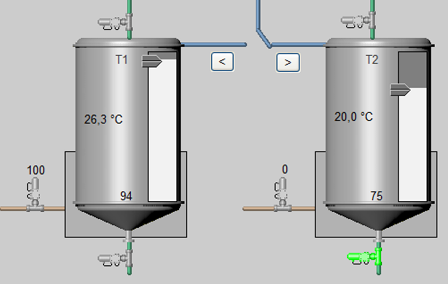

[Людино-машинні інтерфейси](https://pupenasan.github.io/hmi/)  Автор і лектор: Олександр Пупена доц. кафедри [АКСТУ НУХТ](http://www.iasu-nuft.pp.ua/) 

# Лабораторна робота №3

**Тема. Основи розробки людино-машинного інтерфейсу (графічної підсистеми) в** **SCADA/HMI.** 

**Тривалість**: 8 акад. годин (4 пари).

**Мета:** ознайомлення з основними можливостями графічної підсистеми та опанування роботи з графічним редактором Citect.  

**Завдання для виконання роботи**

**Цілі.** 

1. Опанувати основні діяльності зі створення/редагування сторінок, символів та анімації у Citect. 

2. Навчитись користуватися Cicode виразами, командами та вбудованими функціями. 

**Лабораторна установка**

- Апаратне забезпечення: ПК. 

- Програмне забезпечення: UNITY PRO V>=7.0 або Control Expert,  Citect 2016 (або новіше). **Увага! Графічна система, починаючи з Citect 2020 повністю змінена. Тому даний лабораторний практикум не призначений для версій Citect, новіших за Citect 2018R2.** 

## Порядок виконання роботи

## 1.Ознайомлення з додатками 

- [ ] Ознайомтеся з усіма додатками до лабораторної роботи:

- [Додаток 3.1. Базові можливості графічної підсистеми та робота з графічним редактором  Citect ](lab3a1.md)
- [Додаток 3.2. Основи роботи з Cicode виразами та функціями](lab3a2.md)

## 2. Підготовка імітатору на ПЛК

- [ ] Завантажте в імітатор контролера підготовлений проект Unity PRO, що описаний у файлі [Завдання](task.md), як це робили на попередній роботі. Якщо проект був збережений як `STU`, варто відкрити його а не файл експорту. 
- [ ] Запустіть на виконання проект в Unity PRO. Перевірте його працездатність.

## 3. Відновлення власного проекту та перевірка його роботи

- [ ] Запустіть середовище розробки Citect. 

- [ ] Якщо Ваш минулий проект не завантажено або змінено кимось іншим, зробіть відновлення свого проекту з резервної копії, збереженої минулої лабораторної роботи. 
- [ ] За необхідності, зробіть компіляцію проекту. 
- [ ] Запустіть свій проект на виконання і перевірте його працездатність, наприклад, змінюючи одну зі мінних у Citect і перевіряючи ці зміни в імітаторі ПЛК.   

## 4. Створення сторінок

- [ ] Детально прочитайте розділ [Робота зі сторінками з додатку Д3.1.2](lab3a1.md))
- [ ] Створіть нову сторінку відповідно до налаштувань:

- на базі стилю: "sxw_style_1";
- шаблон: "Normal"

- "разрешение": за замовченням

- колір фону: "Color 80"

 

рис.3.1. Вибір кольору `Color80` 

- інші налаштування вказані в таблиці 3.1.

- [ ] Змініть заголовок вікна на `Загальна мнемосхема`.
- [ ] У описі напишіть загальна мнемосхема усього виробництва.
- [ ] Збережіть сторінку з іменем `Base`.
- [ ] Аналогічно створіть ще дві сторінки на базі шаблону `Normal` того ж стилю, розширення і кольору фону,  а назви, заголовки і описи візьміть з таблиці 3.1: 

Таб.3.1. Налаштування основних сторінок проекту.

| Назва сторінки | Заголовок вікна                 | Опис (не обов'язково)                                   |
| -------------- | ------------------------------- | ------------------------------------------------------- |
| Tanks          | Установка приготування продукту | мнемосхема налаштування установки приготування продукту |
| Heat           | Установка підігріву             | мнемосхема налаштування установки підігріву             |

## 5. Підготовка растрових файлів імпорту

- [ ] Відкрийте папку розміщення свого проекту: "Отркыть в проводнике" 

рис.3.2. Відкриття папки проекту з редактору проекту

- [ ] Скопіюйте у папку проекту файли "Tanks.bmp" та "Hea.bmp", які ви раніше завантажували за [цим посиланням](https://drive.google.com/drive/folders/1Hxq-XNS5WW4BWzxzUgkIgO2EuIVaJO6h?usp=sharing). 

## 6. Імпорт рисунку на сторінку `Tanks`

- [ ] Прочитайте пункт "Д3.1.6 Робота з кольорами" [додатку 3.1](lab3a1.md)
- [ ] На сторінку `Tanks` імпортуйте раніше скопійований у вашу папку проекту рисунок `Tanks.bmp` ("Файл"->"Импорт").
- [ ] Розмістіть та за необхідності відмасштабуйте рисунок на сторінці так, щоб він зайняв весь вільний від інших елементів простір.

рис.3.3. Розміщення відмасштабованого рисунку на екрані

- [ ] Користучючись інструментами заміни кольорів замініть білий фон на прозорий (позначається хрестиком). Рекомендуємо скористатися піпеткою. 
- [ ] Збережіть сторінку.

## 7. Імпорт рисунку на сторінку `Heat`

- [ ] Аналогічно попередньому пункту імпортуйте на сторінку "Heat" рисунок "Hea.bmp".
- [ ] За необхідності налаштуйте зображення під розміри сторінки. 
- [ ] Замініть задній фон на прозорий. 
- [ ] Збережіть сторінку.

## 8. Запуск проекту на виконання

- [ ] Скомпілюйте проект. Це можна зробити не тільки з "Citect Studio", а і також з меню графічного редактору. 
- [ ] Якщо проект скомпілювався без помилко - запустіть його на виконання.
- [ ] Відкрийте пункт меню "Page List" - це дасть змогу відобразити усі сторінки, які наявні в проекті

рис.3.4. Відображення меню Page List

- [ ]  Відкрийте сторінки `Tanks` та `Heat`, перевірте чи відображаються на них імпортовані рисунки

## 9. Фіксація рисунків як фону

- [ ] Прочитайте пункт "Д3.1.3. Графічні елементи" [додатку 3.1](lab3a1.md)
- [ ] Зафіксуйте імпортовані рисунки на сторінках "Tanks" та "Heat", щоб вони були в якості підкладки.  
- [ ] Збережіть сторінки.    

Тепер дані рисунки є підкладкою, яка може використовуватися як канва для рисування поверху. Згодом цю підкладку можна буде видалити.

## 10. Вставлення символів для резервуарів

- [ ] Прочитайте пункт "Д3.1.15 Робота з символами" [додатку 3.1](lab3a1.md) 
- [ ] На сторінці "Tanks" вставте символ `Tank_tall_large` з бібліотеки `Tanks_cyl_conb_30` для танків Т1 та Т2. 
- [ ] Налаштуйте їх розміри за необхідністю.

## 11. Вставлення символів для дозаторів

- [ ] На сторінці "Tanks" вставте символ `Tank` з бібліотеки `Tanks_cyl_conb_30` для дозаторів D1 та D2. 
- [ ] Налаштуйте     їх розміри за необхідністю. 

рис.3.5. Вигляд сторінки "Tanks" після вставлення символів для ємностей  

**Зауважте! Використання об'ємних рисунків без потреби не рекомендується, так як це створює додаткове непотрібне навантаження на зовнішній вигляд, відволікає увагу і може погіршити ситуаційне сприйняття. У даній роботі показаний приклад використання готових бібліотечних символів.**     

## 12. Рисування теплової камери для танку

- [ ] Прочитайте пункт "Д3.1.4. Властивості та анімація графічних елементів" [додатку 3.1](lab3a1.md) 

- [ ] Використовуючи прямокутники нарисуйте теплову камеру для танків. Зробіть камери заповнені кольором "Color17" та розмістіть за танками використовуючи команди меню "Отодвинуть назад" (рис.3.6)

рис.3.6. Команди для взаємного розміщення елементів по осі "Z"  

рис.3.7. Вигляд теплових сорочок

## 13. Рисування трубопроводів

- [ ] Прочитайте про особливості рисування трубопроводів у пункті "Д3.1.3. Графічні елементи" [додатку 3.1](lab3a1.md) 
- [ ] Використовуючи елемент "Труба" нарисуйте усі трубні комунікації, які показані на схемі. 
- [ ] Намагайтесь не використовувати яскраві кольори.

**Зауважте! Використання об'ємних рисунків у тому числі трубопроводів та різноманіття кольорів не рекомендується, так як це створює додаткове непотрібне навантаження на зовнішній вигляд, відволікає увагу і може погіршити ситуаційне сприйняття. У даній роботі показаний приклад використання готових бібліотечних символів.**     

## 14. Видалення підкладки та написи

- [ ] На сторінці "Tanks" видаліть рисунок-підкладку що був раніше зафіксований.
  - Поставити опцію "Правка"-> "Не учитывать фиксацию"
  - Виділити і видалити підложку
  - Зняти опцію "Правка"-> "Не учитывать фиксацию"
- [ ] Відредагуйте за необхідності трубопроводи та їх розміщення, при цьому можна тимчасово відвязатися від прив'язки до сітки ("Вид -> приязать к сетке") 
- [ ] Зробіть написи біля танків ("Т1" та "Т2") та на дозаторах ("D1" та "D2").
- [ ] Збережіть сторінку.

Результат має бути схожим на рис.3.8.  

Рис.3.8 Фрагмент сторінки "Tanks" після створення векторного рисунку та видалення підкладки 

## 15. Кнопки "Пуск" та "Ініціалізація кроків"

- [ ] Прочитайте пункт "Д3.1.5 Обробка подій кліку лівої кнопки миші" [додатку 3.1](lab3a1.md) 

- [ ] Використовуючи елементи "кнопка" реалізуйте:

- кнопку "Пуск", яка буде інвертувати змінну `T_SB1` при натисканні 

- кнопку "Ініціалізація кроків", яка буде виставляти в "1" змінну `InitSFC`

Рис.3.9 Приклад налаштування дії натискання кнопки "Пуск"

## 16. Відображення стану установки кольором

- [ ] Прочитайте пункт "Д3.1.9 Налаштування анімації кольору" [додатку 3.1](lab3a1.md) 
- [ ] Використовуючи елемент "Прямокутник" зробіть графічний індикатор роботи установки, який     буде:

- заповнений темно-сірим кольором, коли `T_SB1=0`;

- заповнений світло-сирим кольором, коли `T_SB1=1`;

- [ ] Збережіть сторінку, скомпілюйте проект, запустіть на виконання.
- [ ]  Перевірте чи працює кнопка "Пуск" та графічний відповідний індикатор, натискаючи на кнопку. 

Рис.3.10. Налаштування анімації кольору по змінній 

## 17. Відображення стану установки текстом

- [ ] Прочитайте пункт "Д3.1.8 Налаштування текстового відображення" [додатку 3.1](lab3a1.md) 

- [ ] Розмістіть елемент "Числовое значение" на фоні графічного індикатору. Зробіть товстий шрифт. 
- [ ] Використайте його для відображення стану роботи програми:

- відображається текст "Зупинено", коли `T_SB1=0`;

- відображається текст "Виконується", коли `T_SB1=1`;

- [ ] Збережіть сторінку, скомпілюйте проект. 

**Не зупиняйте виконавчу систему перед перевіркою. Достатньо повторно відкрити змінену сторінку! Надалі після кожного пункту намагайтеся перевіряти працездатність змін!** 

- [ ] Перевірте чи працює текстовий індикатор.

Рис.3.11. Налаштування анімації тексту по змінній 

## 18. Відображення рівнів

- [ ] Прочитайте пункт "Д3.1.10 Анімація заповнення" [додатку 3.1](lab3a1.md) 

- [ ] Використовуючи елемент "Прямокутник" та анімацію заповнення реалізуйте стовпчикову діаграму для рівнів в танках Т1 та Т2: 

- тег `T1_LT1` для танку Т1, світлосірий колір заливки, темно-сірий фон;

- тег `T2_LT1` для танку Т2, світлосірий колір заливки, темно-сірий фон;

Рис.3.12. Налаштування анімації заповнення  

- [ ] Збережіть сторінку, скомпілюйте проект. Перевірте роботу елементів, при включеній кнопці "Пуск" 

## 19. Відображення числового значення параметрів

- [ ] Прочитайте налаштування числового поля в пункті "Д3.1.8 Налаштування текстового відображення" [додатку 3.1](lab3a1.md) 
- [ ] Використовуючи елемент "Числовое значение" зробіть текстовий індикатор для значень змінних тегів рівнів та температур в танках. Значення температури повинно відображатися разом з одиницями вимірювання.

Рис.3.13. Налаштування анімації числового відображення

## 20. Відображення стану сигналізаторів рівнів дозаторів

- [ ] Використовуючи елемент "Еліпс" зробіть сигналізатори нижніх (LSL) та верхніх (LSH) рівнів дозаторів: 

- темно-сірий в стані "0" 
- світлосірий в стані "1".

- [ ] Перевірте відображення сигналізаторів

Рис.3.14. Відображення стану індикаторів в режимі виконання

## 21. Відображення стану клапанів подачі теплоагентів

- [ ] Використовуючи символи з бібліотеки "valve_solenoid" (бажано сірого кольору) вставте зображення на місце клапанів подачі теплоагенту в танки. 
- [ ] Біля символів, використовуючи числове значення, реалізуйте виведення тегів `T1_TV1` та `T2_TV1`
- [ ] Перевірте відображення клапанів

Рис.3.15. Відображення стану клапанів пари в режимі виконання

## 22. Відображення стану дискретних ВМ через анімацію символів  

- [ ] Прочитайте налаштування анімації символів в пункті "Д3.1.15 Робота з символами" [додатку 3.1](lab3a1.md) 
- [ ] Використовуючи  анімацію "Набор образов" та символи з бібліотеки "valve_solenoid" (бажано сірого та зеленого кольору) реалізуйте відображення команд на клапани:
- набору танків `T1_LVS2`, `T2_LVS2`
- зливу танків `T1_LVS1`, `T2_LVS1`
- набору дозаторів `D1_LVS1`, `D2_LVS1`
- зливу дозаторів `D1_LVS2`, `D2_LVS2`
- [ ] Перевірте відображення дискретних ВМ

Рис.3.16. Відображення стану клапанів пари в режимі виконання

**Зауважте! Використання зеленого кольору, як стану "ВКЛ" не рекомендується сучасними стандартами! У даній роботі показаний приклад використання готових бібліотечних символів.**     

## 23. Створення панелі зміни рецепту для танку 1

- [ ] Прочитайте про реалізацію введення числового значення тегу в пункті "Д3.1.14 Робота з клавіатурними командами" [додатку 3.1](lab3a1.md) 
- [ ] Реалізуйте панель зміни рецепту для танку 1 (див. рис. 1 [Завдання](task.md)), використовуючи вже знайомі вам     анімаційні елементи та анімацію введення значення з клавіатури:

- для зручності (за бажанням) налаштуйте та включіть прив’язку до сітки через меню "Вид"
- можна скористатися меню "Порядок -> Выровнять" для вирівнювання елементів по горизонталі та вертикалі

- нарисуйте прямокутник для фону параметрів налаштування рецепту першого дозатору та впишіть туди текстові поля `D1`,`D2` і т.д. 

- створіть числові поля для виведення змінних першого рецепту, теги: `T1_KS_D1CNT_SP`, `T1_KS_D2CNT_SP`, `T1_KS_TT1_SP`, `T1_KS_DEL_SP`

- для створених елементів зробіть можливість введення значення завдання з клавіатури 

Рис.3.17. Налаштування поля для вводу на панелі зміни рецепту

- [ ] Перевірте роботу панелі вводу: введіть інші значення параметрів і впевніться що вони аналогічно змінилися в ПЛК

Рис.3.18. Відображення налаштування рецептів в режимі виконання в Citect (ліворуч) та Unity PRO (праворуч). 

## 24. Створення панелі зміни рецепту для танку 2

- [ ] Повторіть аналогічні дії до попереднього пункту для рецепту танку 2.

## 25. Створення перемикача для дозатору

- [ ] Прочитайте про анімацію видимості в пункті "Д3.1.4.Властивості та анімація" [додатку 3.1](lab3a1.md) 
- [ ] Нарисуйте два трубопроводи, що розходяться на подачу з дозаторів (рис.3.19). 
- [ ] Використовуючи анімацію видимості покажіть переключення дозаторів на танк Т1 та танк Т2, теги: 

- прихований при `T_LVS3_T1OPN=0` перемикач на танк1
- прихований при  `T_LVS3_T2OPN=0` перемикач на танк2

Рис.3.19. Налаштування анімації видимості для перемикача дозатора

- [ ] Створіть дві кнопки для команди на перемикач:

-  `T_LVS3 = 0` команда переключення на танк 1
-  `T_LVS3 = 1` команда переключення на танк 2

- [ ] Скомпілюйте і перевірте роботу. Перевірку краще робити в режимі роботи програми керування "Зупинено".

Рис.3.20. Вигляд мнемосхеми з перемикачами в режимі виконання

## 26. Використання анімації руху

- [ ] Прочитайте пункт "Д3.1.12. Анімація руху" [додатку 3.1](lab3a1.md) 
- [ ] Розмістіть символ `Pointer2_e_gray` з бібліотеки `Thumbs ` на відображенні стовпчикового індикатору, як це показано на рис.3.21.
- [ ] Виділіть прямокутник (стовпчикову діаграму) та з використанням панелі статусу дізнайтеся його висоту. 

Рис.3.21 Місце розміщення числового індикатору рівня 

- [ ] Використовуючи  анімацію руху забезпечте рух даного елементу по вертикалі разом з видимим     рівнем. При цьому Ви можете скористатися отриманим значенням висоти для вказівки     максимального зміщення.
- [ ] Зробіть аналогічну дію і для танку 2.
- [ ] Скомпілюйте і перевірте роботу. Це краще робити в режимі "Виконується".   

Рис.3.22. Вигляд мнемосхеми з анімацією руху

## 28. Реалізація основного змісту мнемосхеми для установки підігріву

- [ ] Використовуючи вже відомі вам елементи та анімацію, реалізуйте мнемосхему для процесу     нагрівання ("Heat"). Якщо якісь теги, що використовуються в анімаціях, не створені в проекті, для їх визначення скористайтеся документом [Завдання](task.md). Також для визначення того, які теги використовуються в анімаціях можна скористатися операторським екраном Unity PRO (подивитися прив’язку елементів), так як імена тегів Citect співпадають з назвою змінних в проекті ПЛК. Зверніть увагу, що час роботи програмного задатчика не передбачено виводити на дисплеї, але Ви можете за бажанням реалізувати це самостійно (потрібна зміна програми і в ПЛК). Можлива наступна послідовність дій:

- нанесіть базові статичні векторні елементи (фігури, лінії, труби, написи) та, за необхідності, символи поверх підкладки;

- розмістіть числові елементи для відображення усіх плинних та заданих значень; для цього можете скористатися джинами `Parameter2` з бібліотеки `keyentry` для заданого значення, так як це було зроблено в лабораторній роботі №2); 

- видаліть підкладку

- розмістіть елементи відображення стану та значень з відповідною анімацією: еліпси з анімацією кольору, лінії переключення з анімацією видимості;

- розмістіть кнопки або інші зображення для керування станом програмного задатчика, веденого регулятору, блоку ручного управління;   

Можливий варіант кінцевої мнемосхеми показаний на рис.3.23

   Рис.3.23 Варіант виконання мнемосхеми "Heats" 

- [ ] Збережіть сторінку, скомпілюйте проект і перевірте роботу мнемосхеми порівнюючи з тією, що в Operator Screens Unity PRO.  

## 29. Використання віртуальної клавіатури введення значення 

- [ ] Прочитайте пункт "Д3.2.5. Функція виклику віртуальної клавіатури" [додатку 3.2](lab3a2.md) 
- [ ] У елементі відображення заданого значення (знаходиться праворуч від `HS1sp`) реалізуйте анімацію введення з віртуальної клавіатури (тег HEA_TC1_SP)

 Рис.3.24. Варіант виконання з віртуальною клавіатурою

## 30. Створення повзункового регулятору

- [ ] Прочитайте пункт "Д3.1.13. Повзунок" [додатку 3.1](lab3a1.md) 

- [ ] Реалізуйте можливість зміни значення виходу на клапан (тег `HEA_TV1`) за допомогою повзунку, для цього: 

- нарисуйте вертикальну лінію і два прямокутника, як це показано на рис.3.25

- визначте висоту лінії за допомогою статусної інформації

- впишіть висоту лінії в якості максимального значення по вертикалі 

   Рис.3.25 Варіант реалізації вертикального повзунка

- [ ] Перевірте роботу повзунка.

## 31. Створення системних калвіш та клавіатурних команд

- [ ] Прочитайте пункт "Д3.1.14. Робота з клавіатурними командами" [додатку 3.1](lab3a1.md) 

- [ ] Створіть системну клавішу "cmdHome" з прив’язка до кнопки `ESC` (В Citect Studio "Настройка -> Клавиши клавиатуры").
- [ ] Створіть системну клавішу "cmdInfo" з прив’язкою до комбінації `CTRL+I`

 Рис.3.26. Створення системних клавіш 

- [ ] Створіть загальносистемну клавіатурну команду, яка забезпечує по натисненню "cmdHome"     відкривання сторінки "Base".

- [ ] Прочитайте пункт "Д3.2.4. Функція InfoForm" [додатку 3.2](lab3a2.md) 
- [ ] У редакторі графіки створіть клавіатурну команду на сторінках "Tanks" та "Heat", яка буде викликати функцію InfoForm. 

 Рис.3.27. Налаштування команд сторінки

- [ ] Перевірте роботу клавіатурних команд на усіх основних мнемосхемах, для цього:

- скомпілюйте проект і перезапустіть виконавчу систему Citect, так як в проекті були внесені системні зміни
- відкрийте сторінку "Tanks"  та наведіть курсор на якийсь елемент, наприклад рівень, і натисніть комбінацію `CTRL+I`; повинна з'явитися інформаційна форма про елемент, яка показана на рис.3.28, подивіться її зміст  
- аналогічну дію проведіть для сторінки "Heat" 
- натисніть "Esc" - повинна відкритися сторінка "Base"

Рис.3.28. Вигляд інформаційної форми в режимі виконання

## 32. Створення резервної копії проекту

- [ ] Зробіть резервну копію проекту, скопіюйте її на змінний носій або на хмарному сховищі. У випадку роботи в лабораторії – покажіть викладачу, і з його відома видаліть свій проект. 

 

## **Питання до захисту** 

1. Які типи сторінок можуть відображатися на екрані оператору АРМу?
2. Поясніть своїми словами, що таке мнемосхема.
3. Які механізми використовують, щоб оператор міг контролювати велику кількість параметрів     технологічного процесу?
4. Зміною яких властивостей графічних елементів можна показати стан технологічних параметрів? Як     прийнято називати такі зміни?
5. Які загальні рекомендації щодо використання кольору в графічній підсистемі?
6. Якими способами можна показати стан дискретної змінної?
7. Якими способами можна показати стан аналогової змінної?
8. Які типи графічних файлів може створювати графічна підсистема Citect. Розкажіть про призначення кожного з них.
9. Розкажіть про призначення шаблону сторінки Citect. Чи може сторінка створюватися на базі порожнього шаблону? Яким чином до проекту підключити бажані існуючі в інших проектах шаблони?
10. Прокоментуйте призначення основних об’єктів з палітри графічних об’єктів графічної підсистеми Citect.
11. Яким чином у Citect реалізована анімація зміни кольору? Продемонструйте на прикладах.
12. Яким чином у Citect реалізована анімація зміни позиції та розміру? Продемонструйте на прикладах.
13. Яким чином у Citect реалізована анімація зміни графічного зображення? Продемонструйте на     прикладах.
14. Яким чином у Citect реалізована анімація заповнення? Продемонструйте на прикладах.
15. Яким чином у Citect реалізована анімація зміни тексту? Продемонструйте на прикладах.
16. Яким чином у Citect реалізована анімація відображення числового значення? Продемонструйте на     прикладах.
17. Розкажіть та покажіть на прикладах механізми використання символів Citect.
18. Які способи введення/зміни даних у Citect ви знаєте? Продемонструйте один з них на прикладі (за вибором).
19. Як у Citect реалізовані повзункові задавачі? Покажіть на прикладі.
20. Як у Citect реалізовані механізми налаштування виконання команд з миші? Покажіть на прикладі.
21. Як у Citect реалізовані механізми налаштування виконання команд з клавіатури? Покажіть на прикладі вводу значення змінної з клавіатури.
22. Поясніть що таке Cicode, Cicode команди, Cicode вирази та Cicode функції у Citect.     
