[До лабораторної роботи 1](lab3.md)

## Додаток 3.1. Базові можливості графічної підсистеми та робота з графічним редактором  Citect 

### Д3.1.1. Редактор графіки

Для створення графічної частини проекту, тобто людино-машинного інтерфейсу SCADA Citect використовується редактор графіки. У редакторі графіки створюються та редагуються такі об’єкти :

-     графічні сторінки (страницы, pages): дисплейні вікна з графічними елементами та анімацією; 

-     шаблони сторінок (шаблоны, Templates): шаблони з графічними елементами та анімацією, що використовуються як основа для сторінок; 

-     символи (образы, Symbol): набір графічних елементів що згруповані разом для багаторазового використання в якості готового бібліотечного графічного компоненту;

-     джини (джины, Genies): набір графічних елементів з анімацією, що можуть бути багаторазово використані як готовий анімований бібліотечний компонент (графічна функція); 

-     супер джини (супер Джины, Super Genies): спеціальний вид сторінки, що використовується у якості спливаючих діалогових вікон усередині джинів; 

Доступ до цих об’єктів для створення, редагування чи видалення проводиться через меню "Файл" редактору графіки або розділу "Визуализация" провідника проектів (рис.Д3.1.1). 

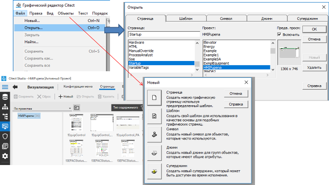

Рис.Д3.1.1. Доступ до елементів графічної підсистеми Vijeo Citect 

Зверніть увагу, що видалення об’єктів можливе тільки у вікні відкриття, використовуючи копку "Удалить" (див. рис.Д3.1.1). 

Ряд властивостей редактору графіки налаштовується у вікні "Средства"->"настройки". Зокрема там є опція вибору необхідності відображення системних сторінок (тих, назва яких починається з "!"). 

Для зручності розміщення елементів може знадобитися сітка, налаштування якої доступне через меню "Вид".  

### Д3.1.2. Основи роботи з сторінками (Страницы, Page) та шаблонами (Templates)

Графічна підсистема у Citect базується на представленні дисплейних вікон у вигляді ***сторінок*** (***Страницы***). Графічні сторінки створюються на базі шаблону, що означує для сторінки:

-     розміри вікна;

-     колір фону сторінки;

-     поведінку вікна сторінки за замовченням;

-     може мати вбудовані графічні елементи та анімацію; 

Шаблон полегшує створення сторінки, так як окрім властивостей розміру та кольору фону може мати велику кількість вбудованих графічних елементів та анімацію, що надає сторінці певну базову функціональність. Ці елементи шаблону не будуть доступні для редагування на сторінці і будуть видимі як фон. У шаблони вбудовують меню, банери тривог, панелі статусу та інші елементи, що необхідно бачити на всіх сторінках. На базі готових шаблонів Citect дуже просто створити сторінки переглядачів тривог, трендів, звітів, вказавши тільки необхідний шаблон. 

Протягом розвитку SCADA-програми Citect розробники створили багато шаблонів, які відрізнялися своїм виглядом та підходами до побудови людино-машинного інтерфейсу. Ці шаблони створювалися як певний набір типових рішень з загальними властивостями (вигляд меню, тривог і т.п) та об’єднувалися єдиним ***стилем***. Класичні стилі (bottom, standard, top, version2) увійшли як частина наперед-встановленого проекту "***Include***", який неявно включається у всі проекти. Інші стилі можуть бути використані при включенні інших наперед-встановлених проектів у свій проект. Так, наприклад, у попередній лабораторній роботі, при створенні нового проекту було вказано стиль SxW_Style1 (див.ЛР№2), після чого у включених проектах нового проекту (розділ провідника "Проекты"->"Включенные проекты") з'явилися записи з іменем проекту "SxW_Style_Include" та "Library_equipment". 

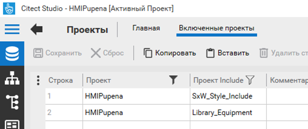

Рис.Д3.1.2. Включені проекти

При створенні нової сторінки, редактор графіки пропонує вибрати стиль з доступних в розроблювальному проекті та включених в нього проектах (рис.Д3.1.3). Рекомендується створювати сторінки в проекті на базі якогось одного стилю, інакше окрім стилістичних невідповідностей сторінок, можуть також виникнути непередбачувані ситуації, викликані конфліктом Cicode команд різних шаблонів.

 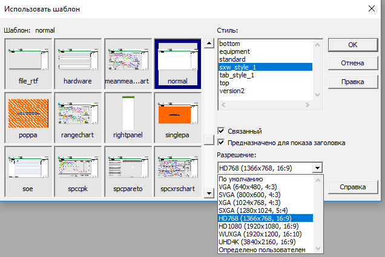

Рис.Д3.1.3 Вибір шаблону для сторінок 

Після вибору стилю, у вікні створення вибирається розмір шаблонів сторінок, та сам шаблон. Для звичайних сторінок мнемосхем доцільно вибирати шаблон "Normal", який має класичні елементи навігації (меню), банери тривог та інші загальнодоступні на всіх сторінках елементи, характерні для даного стилю. Окрім шаблонів різних за призначенням типів сторінок (наприклад трендів, тривог, звітів), доступний також шаблон "blank", у якого відсутня будь-яка вбудована анімація. Такі сторінки можуть знадобитися, наприклад, для створення спливаючих вікон.        

За замовченням, зв'язок сторінки з шаблоном на базі якого вони були створені, залишається. Цю опцію ("Связанный") можна відмінити (див. рис. Д3.1.3), у цьому випадку зміни в шаблоні не будуть відбуватися на сторінці, яка створена на базі нього.

Вибір шаблону, розміру вікна, кольору фону можна зробити у будь який час шляхом зміни властивостей сторінки, які наведені у вкладці "Представление" (рис.Д3.1.4). Доступ до властивостей сторінки проводиться шляхом виклику пункту "Свойства страницы" контекстного меню сторінки або пункту меню "Файл"->"Свойства". Контекстне меню сторінки викликається правим кліком у будь-якому місці сторінки що не містить графічного елементу.  

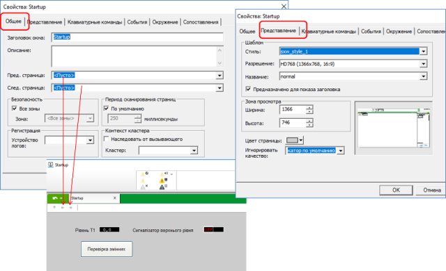

Рис.Д3.1.4 Загальні властивості сторінок (вкладки "Общие" та "Представление") 

У загальних властивостях сторінки (вкладка "Общие", див.рис.Д3.1.4) можна також вказати заголовок вікна, назву попередньої та наступної сторінки. Ці назви сторінок використовуються в режимі виконання у командах меню навігації. 

За замовченням, період сканування сторінки береться з однойменного параметру проекту, однак його можна змінити для кожної сторінки окремо. Це значення вказує системі на те, з якою періодичністю на сторінці обробляти анімацію та виконувати Cicode-функції. Враховуючи, що в анімації використовуються значення змінних, вони також будуть оновлюватися з тією ж періодичністю.

Після будь-яких змін на сторінці, щоб вони збереглися в проекті, її треба зберегти "Файл"->"Сохранить". Після компіляції проекту, не обов’язково перезавантужувати всю виконавчу систему Citect, для того щоб зміни вступили в силу. Достатньо повторно відкрити відредаговану та скомпільовану сторінку.

Інші властивості сторінок будуть розглянуті в інших розділах. 

### Д3.1.3. Графічні елементи 

Зміст графічних сторінок Citect наповнюється графічними елементами. Вони розміщуються розробником на сторінці та налаштовуються на етапі розробки, використовуючи редактор графіки. Графічні елементи можуть бути статичними, які не змінюють свої властивості, та динамічними, одна або декілька властивосте яких залежить від значення змінних або результату виразів. 

Вставка елементів може проводитись через команди пунктів меню здебільшого "Объекты" та "Правка". Citect для зручності пропонує палітру інструментів (див рис.Д3.1.5). Активація/деактивація відображення палітри доступна через меню "Вид"->"Показать инструменты". У передостанніх версіях Citect пропонуються такі графічні інструменти (у новіших можуть назви дещо відрізнятися):

-     для рисування ліній, прямокутників, еліпсів, багатокутників ("полигон");

-     "труба" - для рисування труб;

-     "текст" - для вставки статичного тексту

-     "число" - для вставки тексту, що змінюється в залежності від значення змінної чи виразу;

-     "кнопка" - для вставки командних кнопок;

-     "набор образов" – для вставки анімації, що показує на сторінці різні символи (образи) в залежності від значення змінної чи виразу;

-     "тренд" - для вставки елемента відображення змінної у вигляді простого тренду;

-     "объект Cicode" – для вставки функцій Cicode, що викликаються при кожній обробці сторінки; 

-     "символ" – для вставки бібліотечного графічного елементу; 

-     "джин" – для вставки бібліотечного графічного елементу з вбудованою анімацією; 

-     "ActiveX" – для вставки графічного компоненту ActiveX, який зареєстрований у Windows на даному ПК;

-     "анализатор процессов" – для вставки компонента Аналізатору процесу у вигляді тренду; 

-     "элемент обмена с базами данных" – для вставки компоненту обміну з базами даних;

-     "Vijeo WEB Gate" – для вставки компоненту (вбудованого вікна) роботи з підключеною панеллю оператору Magelis XBT (виробництво Schneider Electric);

-     "Pelco Camera" - для вставки компоненту роботи з камерами Pelco (компонент інсталюється окремо за необхідністю).  

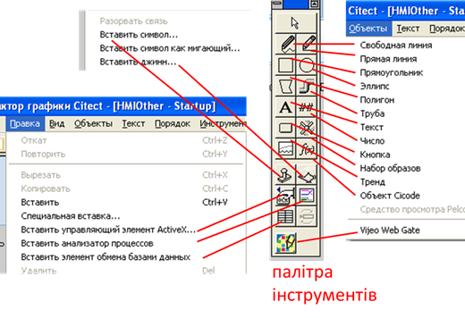

Рис.Д3.1.5 Палітра інструментів та відповідні пункти меню графічного редактору

 Налаштування багатьох графічних інструментів розглядається нижче. Елементи "Тренд", "Джин", "Анализатор процессов" (Process Analyst), "объект Cicode" будуть розглядатися в наступних лабораторних роботах. Елементи "элемент обмена с базами данных", "Vijeo WEB Gate" та "Pelco Camera" та інші не будуть задіяні в лабораторних роботах даного курсу.

На сторінки можна також імпортувати графічні файли через меню "Файл"->"Импорт". Кольори імпортованої графіки можна відредагувати (наприклад замінити кольори) за допомогою вбудованих інструментів (див. Д3.1.6 робота з кольорами). 

Графічні елементи можна групувати, виділивши їх разом та викликавши відповідну команду з контекстного меню. Редагувати властивості елементів в середині групи можна доступившись до них через комбінацію "CTRL" + подвійний лівий клік миші. 

Якщо необхідно **зафіксувати** певний набір графічних елементів, для використання їх в редакторі в якості фона, можна вибрати необхідні елементи та викликати команду меню "Правка"-> "Фиксировать объект". Для тимчасового відключення режиму фіксації для усіх фіксованих об’єктів на сторінці викликається команда "Правка"-> "Не учитывать фиксацию". Відміна фіксації для вибраних об’єктів проводиться через команду меню "Правка"-> "Отменить фиксацию".

Розміри графічних елементів та позицію курсору можна побачити в панелі статусу (нижній правий куток екрану). 

Кожен елемент на сторінці має унікальний ідентифікатор – Animation Number (**AN**), який можна подивитися у його властивостях на вкладці "Доступ" в полі "Объект AN". Ідентифікатор AN використовується в багатьох функціях в якості вказівника на елемент, який задіяний в функції. Крім того, за цим ідентифікатором можна зробити перехід до потрібного елементу, використовуючи меню "Средства" ->"Перейти к объекту".

Більшість графічних елементів налаштовуються інтуїтивно зрозуміло. Однак налаштування деяких потребує пояснення. Так, наприклад, для рисування **трубопроводів** (елемент "Труба"), після його вибору, на схемі натискається і утримується ліва кнопка миші, і з утриманням рисується перший сегмент. Далі, кожен одинарний клік миші створює наступний сегмент, а подвійний клік миші завершує рисування труби. Утримання клавіші "CTRL" змішує рисувати сегменти під прямим кутом.     

### Д3.1.4. Властивості та анімація графічних елементів

Графічні елементи мають багато спільних налаштувань. Деякі з цих налаштувань означують залежність поведінки властивостей елементу в режимі виконання від значення змінної або виразу, а також ті операції, які необхідно провести при певних діях оператору. Якщо якась властивість елементу змінюється в залежності від значення змінної чи виразу, або, навпаки, операція над елементом приводить до певної дії – то кажуть, що цей елемент ***анімований*** або ***динамічний***. Статичні елементи, такі як, наприклад, лінія, еліпс чи текст за замовченням не мають анімації, однак якщо їх властивість анімувати - вони стають динамічними. У Vijeo Citect до одного елементу можна застосувати декілька різних анімацій, змінюючи відповідні властивості. Властивості, що залежать від значення змінної чи виразу будемо також називати ***анімованими***.  

Доступ до налаштування властивостей елементу відбувається через його контекстне меню (рис.Д3.1.6). Усі властивості згруповані в 2-х рівневі панелі налаштувань, де перший рівень надається через горизонтальні ***вкладки,*** а другий – через вертикальні ***закладки***, що доступні на кожній вкладці. Так, наприклад, на рис.Д3.1.6 показані властивості "Вид"->"Общие". У вкладці "Вид" доступні також закладки "3D эффекты" та "Видимость".     

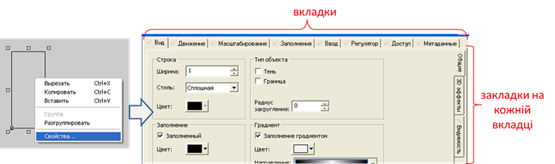

Рис.Д3.1.6 Налаштування властивостей елементу 

На закладці "Вид" можна налаштувати: стиль та колір лінії; заповнення елементу, вказавши властивість "заполненный", колір заповнення та градієнт; стиль відображення (об'ємні властивості).  

Для анімації властивостей елементу, як правило, необхідно вказати ***Cicode вираз*** (див. також Д3.2.1). Вираз записується таким чином, щоб його результат давав значення потрібного типу, якого потребує анімація. Так, наприклад, на рисунку Д3.1.7 показане вікно налаштування властивості **видимості елементу**. У даному випадку елемент буде прихований, коли значення змінного тегу `T1_LT1` буде більше нулю. Слід звернути увагу на те, що результат виразу у даному випадку повинен бути булевим (типу так/ні). Частковим випадком виразу є змінна (тег). У випадку анімації видимості (рис.Д3.1.7) замість виразу можна було б вказати тег типу DIGITAL.   

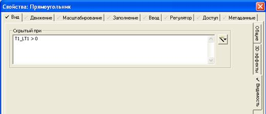

Рис.Д3.1.7 Використання Cicode виразів 

Для вставки у вираз змінних та функцій можна скористуватися помічником (див. рис.Д3.1.8). 

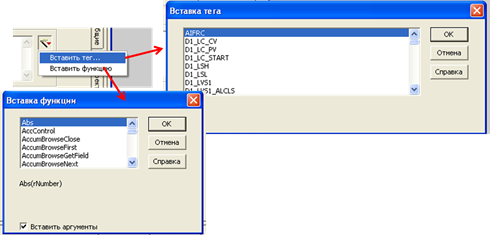

Рис.Д3.1.8 Помічник вставки змінних та функцій 

### Д3.1.5. Обробка подій кліку лівої кнопки миші "Ввод"->"Касание"

Базові графічні елементи мають можливість обробляти кліки миші для елементів. Налаштування обробників проводиться у вкладці "Ввод"->"Касание" (див. рис.Д3.1.9). Є можливість налаштувати команди (див.Д3.2.1. Cicode команди) для різних типів дій: 

-     "вверх" - відпускання лівої кнопки миші;

-     "вниз" – натискання лівої кнопки миші;

-     "повторить" – тримання лівої кнопки миші в натиснутому стані.  

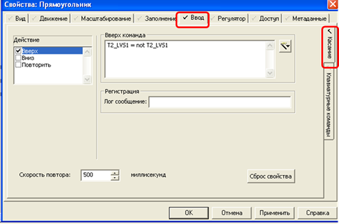

Рис.Д3.1.9 Налаштування обробнику лівого кліку миші 

Для кожної дії прописується ***Cicode команда*** яка повинна виконуватися при виникненні дії (події). Наприклад, на рис.Д3.1.9 показане налаштування дії "Вверх", яке в режимі виконання забезпечить інвертування значення тегу `T2_LVS1` після відпускання лівої кнопки миші. Слід звернути увагу на те, що в полі "Вверх команда" недостатньо просто вказати якесь ім’я тегу, адже у цьому випадку не буде відомо що саме треба зробити з цим тегом.

Для дії "Повторить" треба також налаштувати періодичність виклику команди ("Скорость повтора") при утриманні лівої кнопки натиснутою. У такому випадку "Повторить команда" буде викликатися з вказаною періодичністю.

У полі "Лог сообщение" вказується текст, що буде записаний в журнал дій оператору. Детальніше це буде розглянуто в наступних лабораторних роботах.    

### Д3.1.6. Робота з кольорами у Citect

Кольори для властивостей елементів Citect можна вибрати з палітри існуючих ("предпочтительные цвета") або вписати їх в форматі RGB (див.рис.Д3.1.10). Палітру можна змінювати, тобто редагувати існуючі кольори палітри або добавляти свої. У палітру входять також такі специфічні кольори як кольори миготіння та прозорий (позначається хрестиком).  

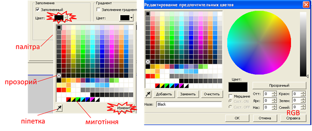

Рис.Д3.1.10 Кольорова палітра та її налаштування 

Палітру можна налаштувати також через меню "Средства"->"Редактировать предпочтительные цвета". 

Окрім палітри в меню інструментів доступні також утиліти налаштування та заміни кольорів (рис.Д3.1.11) 

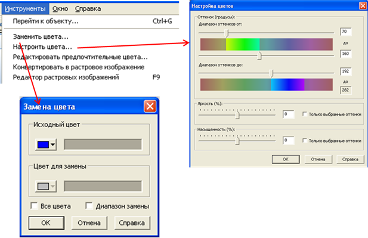

Рис.Д3.1.11 Інструменти налаштування та заміни кольорів 

У пункті "Исходный цвет" вибирається який колір треба змінити, а в "Цвет для замены" - на який. У виборі кольору який треба змінити доступний інструмент "піпетка", яким можна вибрати колір заміни. 

### Д3.1.7. Властивості загального вигляду "Вид"

На вкладці "Вид" доступні загальні властивості зовнішнього вигляду елементу (рис.Д3.1.12). Кількість та перелік властивостей "Вид" та відповідно вкладок залежить від типу елементу. Для усіх елементів можливо налаштувати властивість видимості через вкладку "Видимость". Призначення інших властивостей розглянуто в інших розділах додатку.   

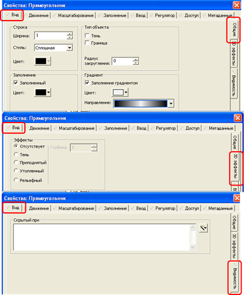

Рис.Д3.1.12 Налаштування загальних властивостей вигляду (вкладка "Вид")

### Д3.1.8. Налаштування текстового відображення та анімації

Для текстових елементів на вкладці "Вид" доступні властивості тексту ("Вид"-> "Общие") та налаштування анімації тексту ("Вид"->"Отображаемое значение"). У таблиці Д3.1.1 наведений перелік можливостей налаштування анімації тексту.  

Таб.Д3.1.1.Типи анімацій тексту. 

| **Властивість**                  | **Призначення**                                              | **Коментар до прикладу**                                     |
| -------------------------------- | ------------------------------------------------------------ | ------------------------------------------------------------ |
| 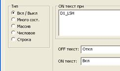 | відображає різний текст при нульовому і  ненульовому результаті виразу | При `D1_LSH=0`  відображає текст "Откл" інакше "Вкл"         |
| 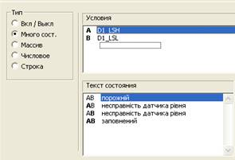 | відображає різний текст в залежності від  комбінації станів дискретних (DIGITAL) змінних або виразів, що  повертають 0/1; товстим шрифтом в станах показується стан 1 | `D1_LSH=0 & D1_LSL=0` -> "порожній"   `D1_LSH=1 & D1_LSL=0`  -> "несправність датчика"   `D1_LSH=0 & D1_LSL=1` -> "  несправність датчика "   `D1_LSH=1 & D1_LSL=1` -> "заповнений" |
| 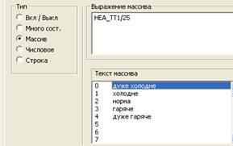 | відображає різний текст в залежності від значення  виразу    | `HEA_TT1/25 ≈ 0 `-> "дуже  холодне"   `HEA_TT1/25 ≈ 1` -> "  холодне"   `HEA_TT1/25 ≈ 2` ->  "норма"   `HEA_TT1/25 ≈ 3 `->  "гаряче"   `HEA_TT1/25 ≈ 4` -> "дуже  гаряче"  |
| 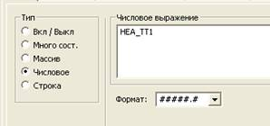 | відображає числове значення виразу з заданим  форматом; якщо формат заданий як <default>, то він береться з  налаштування тегу | відображає числове значення змінної `HEA_TT1` у форматі 5 символів до  коми і один після без одиниць вимірювання. |
| 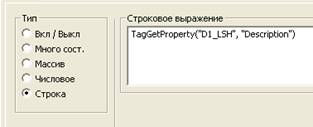 | відображає символьний рядок заданий виразом                  | відображає значення властивості "Description" (Коментар) тегу `D1_LSH` |

### Д3.1.9. Налаштування анімації кольору ("Заполнение"->"Цвет")

Елементи можуть змінювати колір в залежності від значення змінних або виразів. Для налаштування кольорів елементів на вкладці "Заполнение" доступні властивості анімації кольору ("Заполнение"->"Цвет"). Типи анімацій кольору зведені в таблиці Д3.1.2. 

Таб.Д3.1.2.Типи анімацій кольору 

| **Властивість**                  | **Призначення**                                              | **Коментар до прикладу**                                     |
| -------------------------------- | ------------------------------------------------------------ | ------------------------------------------------------------ |
| 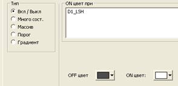 | змінює колір при нульовому і ненульовому  результаті виразу  | При `D1_LSH=0` елемент заповнений  темно-сірим кольором, інакше - білим |
| 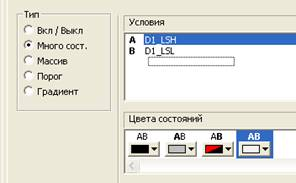 | змінює колір в залежності від комбінації станів  дискретних (DIGITAL) змінних або виразів | `D1_LSH=0 & D1_LSL=0`  -> темно-сірий  `D1_LSH=1 & D1_LSL=0`  -> сірий   `D1_LSH=0 & D1_LSL=1`  -> мигаючий чорний-червоний   `D1_LSH=1 & D1_LSL=1`  -> білий |
| 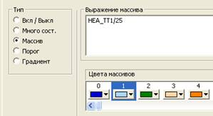 | змінює колір в залежності від значення виразу                | `HEA_TT1/25 ≈ 0` -> синій   `HEA_TT1/25 ≈ 1` -> блакитний   `HEA_TT1/25 ≈ 2` -> зелений   `HEA_TT1/25 ≈ 3` -> рожевий   `HEA_TT1/25 ≈ 4` -> помаранчевий |
| 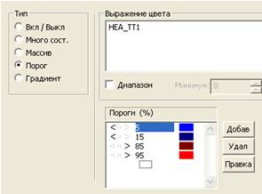 | змінює колір в залежності від того, в який  діапазон попадає значення виразу | `HEA_TT1 < 5` -> синій   `5 < HEA_TT1 < 15` -> темно-синій   `15 < HEA_TT1 <  85`  ->   не змінюється відносно зданого у "Вид"   `85 < HEA_TT1 < 95` -> бордовий   `95 < HEA_TT1`  -> червоний |
| 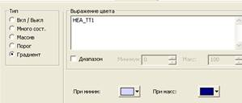 | змінює колір градієнтно в заданому діапазоні  залежності від значення виразу | Колір визначається відповідністю значення `HEA_TT1` у  відсотках до градієнту світло-блакитного – темно-синього кольорів |

### Д3.1.10. Анімація заповнення ("Заполнение"->"Уровень")

Ступінь заповнення вибраним в налаштуваннях кольором графічного елементу може змінюватися в залежності від результату виразу, вказаного на вкладці "Заполнение" (рис.Д3.1.13). При цьому вказується відповідність ступені наповненості (у %) до вказаного діапазону виразу. Якщо у якості виразу вказується змінна, то діапазон може братися з властивостей діапазону тегу (мінімуму і максимум в одиницях виміру) для чого опція "Укажите диапазон" не виставляється. Колір заливки береться з властивостей загального вигляду, а фон вказується у властивості "Цвет фона". Вибір напрямку заливки вказується у властивості "Напр. зал:".   

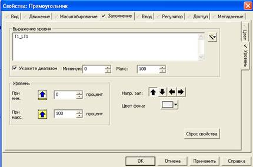

Рис.Д3.1.13 Налаштування анімацій заповнення (вкладка "Заполнение")

### Д3.1.11. Анімація зміни розміру ("Масштабирование")

За допомогою анімації масштабування (вкладка "Масштабирование") можна прив’язувати ширину елементу (закладка "По горизонтали") та висоту елементу (закладка "По вертикали") у відсотках до їх нормальних розмірів у відповідності до результату виразу "Выражение масштаба" (див.рис.Д3.1.14). Можна задати мінімум та максимум виразу, що співвідносяться до 0% та 100% масштабу відповідно, для чого виставляється опція "Укажите диапазон" та вписуються потрібні значення. Якщо опція не вказується, то значення будуть братися з властивостей діапазону тегу (мінімуму і максимум в одиницях виміру), вказаного в полі "Выражение масштаба". Масштабування проводиться відносно осі, вказаної в налаштуваннях "Смещение центральной оси".   

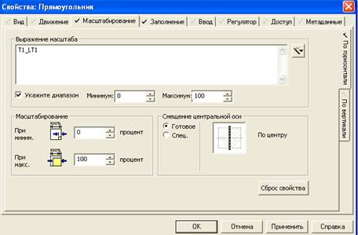

Рис.Д3.1.14 Налаштування анімацій зміни розміру (вкладка " Масштабирование ")

### Д3.1.12. Анімація руху ("Движение")

Позиція елемента по вертикалі або/та горизонталі може бути прив’язана до значення виразу. Налаштування анімації руху проводиться через вкладу "Движение", відповідно в закладках "По горизонтали" та "По вертикали" (див. рис.Д3.1.15). Також можна реалізувати анімацію обертання через закладку "Вращающийся". Рух задається через зміщення елементу в пікселях відносно початкової точки. Зміщення при мінімумі результату "Выражение движения" задається відповідно до значення мінімуму величини, аналогічно для максимального зміщення. Мінімум та максимум величини може братися з властивостей діапазону тегу (мінімуму і максимум в одиницях виміру) або вказуватися явно, після виставлення опції "Укажите диапазон". 

Для анімації обертання вказуються не значення зміщення а кути обертання відносно початкової позиції. Точка осі, відносно якої буде відбуватися обертання вказується в "Смещение центральной оси".

Для одного елементу може одночасно задаватися анімація руху по двом осям і обертання.       

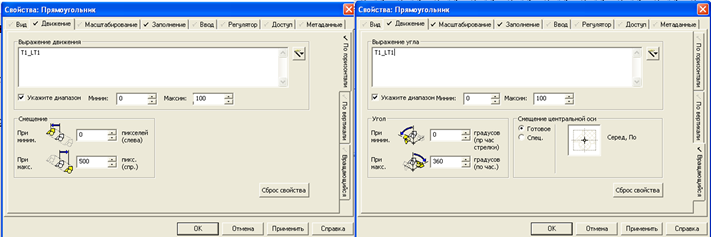

Рис.Д3.1.15 Налаштування анімацій руху (вкладка "Движение")

### Д3.1.13. Повзунок ("Регулятор")

У Vijeo Citect елемент можна рухати, тим самим змінюючи значення величини тегу. Ця анімація налаштовується через вкладку "Регулятор" (рис.Д3.1.16). Переміщення доступне по горизонталі чи вертикалі, або по обом осям одночасно. Зміщення в пікселях відносно початкового та кінцевого положення відповідає значенням властивостей діапазону тегу (мінімуму і максимум в одиницях виміру). 

Опція "Непрерывное обновление тега" задає режим миттєвого запису значення в тег при кожному русі. Якщо опція не виставлена, то запис проводиться тільки після відпускання кнопки миші.  

На закладці "Вращающийся" можна задати поведінку кругового регулятору. Ця анімація доступна тільки при відсутності інших типів регулятору. Аналогічно анімації обертання, тут вказується кут повороту та зміщення початкової точки осі.    

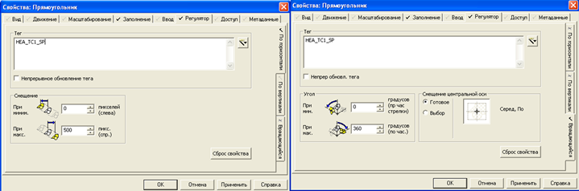

Рис.Д3.1.16 Налаштування повзунку (вкладка " Регулятор ")

### Д3.1.14. Робота з клавіатурними командами

У Citect передбачена можливість обробки клавіатурних команд. Для цього спочатку клавішам клавіатури або їх комбінації дають певне ім'я, а потім назначають цій поіменованій клавіші певну клавіатурну команду, я якій прописують дію, що повинна виконуватися при натисканні цієї клавіші. 

Багато клавіатурних клавіш вже прописані на рівні включеного системного проекту "Include". Це такі клавіші як "ENTER", клавіші миші та навігації. На рис.Д3.1.17 показаний приклад створення клавіші клавіатури з іменем "cmdHome" яка відповідає за натискання ESC (вказується в полі "Код клавиши"). Таке розділення назви клавіші та її реальної відповідності клавіатурі дає можливість у будь-який момент часу назначити іншу фізичну команду логічній клавіші.

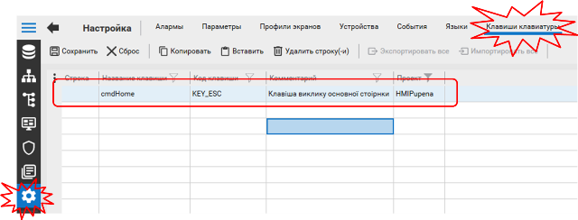

Рис.Д3.1.17 Створення клавіатурної комбінації (клавіші)

Клавіші або їх послідовності надаються певні клавіатурні команди. Ці команди можуть бути назначені на:

-     рівні всіє системи, тобто незалежно від того, яка сторінка відкрита в даний момент (редагується в редакторі проектів "Визуализация"->"Клавиатурные команды")

-     рівні сторінки, тобто команди будуть працювати на сторінці де вони означені (редагується в редакторі графіки у властивостях сторінки "Клавиатурные команды")

-     рівні елементу, тобто коли елемент отримує фокус вводу (редагується в редакторі графіки у властивостях елементу "Ввод"->"Клавиатурные команды")) 

На рис. Д3.1.18 показаний приклад клавіатурної команди системного рівня, в якій при натисненні клавіші `cmdHome` буде викликана Cicode функція відкриття сторінки "Base". Тобто на будь якій сторінці при натисканні ESC буде відкрита основна сторінка проекту з іменем "Base".

 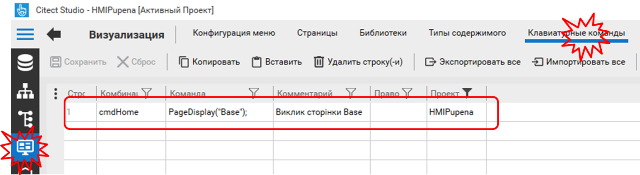

Рис.Д3.1.18 Створення клавіатурної команди рівня усього проекту

На рис. Д3.1.19 показаний приклад клавіатурної команди рівня сторінки (налаштовується у властивостях сторінки), в якому при натисканні одночасно клавіш "CTRL" та "I" буде викликана функція InfoForm. Клавіша "cmdInfo" створюється в редакторі проектів.   

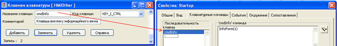

Рис.Д3.1.19 Створення клавіатурної комбінації (клавіші) та клавіатурної команди рівня сторінки

На прикладі з рис.Д3.1.20 для одного з елементів (налаштовується у властивостях елементу "Ввод"->"Клавиатурные команды") означені дві клавіатурні команди назначені на послідовності клавіш `PGUP` та `PGDN`. Клавіші вже існують в проекті, так як вони прописані в "Include", тому їх не потрібно створювати. Таким чином, при попаданні фокусу на елемент, оператор зможе натискати `PgUp` для збільшення значення тегу `HEA_TC1_SP` та `PgDn` для зменшення.   

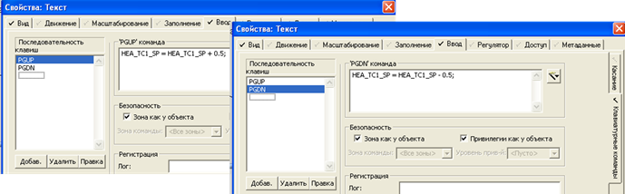

Рис.Д3.1.20 Створення клавіатурної команди рівня елементу

Для введення символьної послідовності або числового значення тегу у Citect передбачені спеціальні "змінні": `Arg1`, `Arg2` … `Arg8`. Зауважимо, що у даному випадку "змінна" - це умовна назва, так як даний механізм використовує записи міток в проекті "Include", але для користувача це умовно можна назвати "змінною". Якщо в символьну послідовність вписати декілька символів `#`, то в режимі роботи набрана оператором послідовність з цієї кількості символів на клавіатурі буде записана в змінну `Arg1` у вигляді текстового рядку. Якщо в набраній оператором послідовності зустрічається кома (`,`) наступні символи будуть записані в `Arg2` і т.д. Таким чином оператор може ввести одразу до восьми текстових значень, розділених комою. Якщо необхідно вводити числове значення, замість `Arg1` зручніше користуватися спеціальною змінною сторінки `ArgValue1`. На рис.Д3.1.21 показаний приклад налаштування властивостей клавіатурних команд елементу для введення числового значення з клавіатури. У даному випадку після натиснення оператором до 4-х символьних клавіш і після цього клавіші `ENTER`, у `Arg1` буде збережене значення послідовності символів, яке пройшовши попередню перевірку на коректність значення буде записане у змінну `HEA_TC1_SP`.  

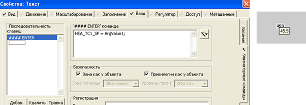

Рис.Д3.1.21 Створення клавіатурної команди для введення значення змінної

Введення значення в режимі виконання може бути виконане після попадання фокусу на елемент. При цьому поле для вводу не активується, а введені символи відображаються під елементом. Введення значення можливе для будь-якого елементу, а не тільки тексту.    

### Д3.1.15. Робота з символами (образами) та анімацією символів ("Набор образов")

***Символи*** (***symbols***) – це графічні елементи, згруповані разом і доступні в якості готового бібліотечного елементу. Бібліотеки символів, що доступні в проекті, включають в себе символи усіх включених в нього проектів. Враховуючи, що проект "Include" включається в проект неявно, розробнику доступний великий набір символів, які містяться в ньому. Кожен проект може вміщувати декілька поіменованих бібліотек, кожна з яких може містити десятки символів. Ім'я символу буде складатися з назви бібліотеки і безпосередньо імені самого символу, які розділені крапкою.

Вставку символу на сторінку можна зробити через відповідну кнопку панелі інструментів (рис.Д3.1.22). Спочатку вибирається потрібна бібліотека, потім символ. Вставлений символ за замовченням зв’язаний з бібліотечним прототипом. Такий зв'язок дає можливість змінюючи прототип в бібліотеці, автоматично змінювати усі його екземпляри.       

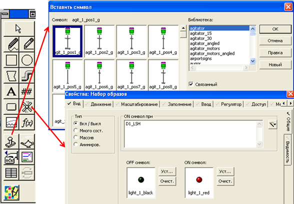

Рис.Д3.1.22 Вставка символу та елементу "Набор символів"

Для символів доступно декілька налаштувань анімацій, аналогічна іншим елементам. Додатково є спеціалізований елемент "Набор образов (символов)" (див. рис.Д3.1.22), призначений для анімації зміни символів у залежності від значення виразу. Більшість налаштувань типів зміни символів аналогічні до налаштувань анімації кольору (див. Д3.1.9), за винятком нового типу - "Анимиров." Ця анімація передбачає два стани: 

-     стан відключення, тобто коли вираз повертає нульове значення: у цьому випадку буде відображатися символ вказаний як "Off"

-     стан включення, тобто коли вираз повертає ненульове значення: у цьому випадку зображення буде змінюватися покадрово, кожен кадр якого заданий символом "FrameX";

На рис. Д3.1.23 показаний приклад налаштування анімації, в якій буде відображатися сірий символ мішалки в стані `Mixer=0`, а при `Mixer=1` буде відбуватися поступова зміна зелених символів мішалки в різних позиціях, що дасть ефект її обертання.        

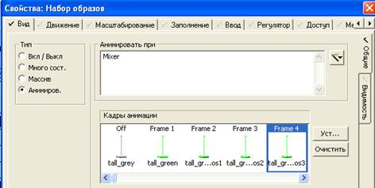

Рис.Д3.1.23 Налаштування анімації набору символів "Анимир"

Треба врахувати, що анімація "Набор символов" може працювати тільки з символами в растровому форматі. Для перетворення векторних елементів в растр можна скористатися командою "Инструменты"->"Конвертировать в растровое изображение". 

У графічному редакторі можна створювати свої символи ("Файл"->"Создать"->"Символ") і зберігати їх у власних бібліотеках. 
