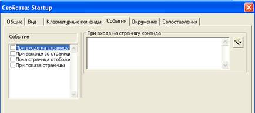
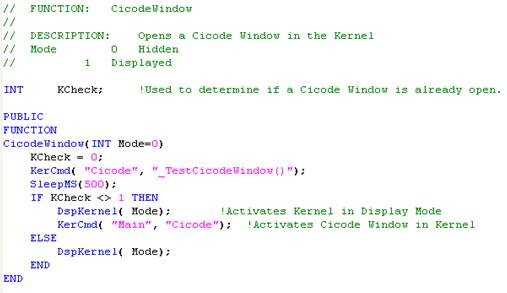
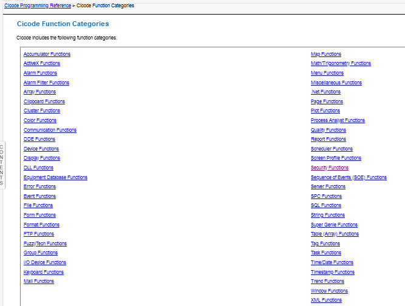
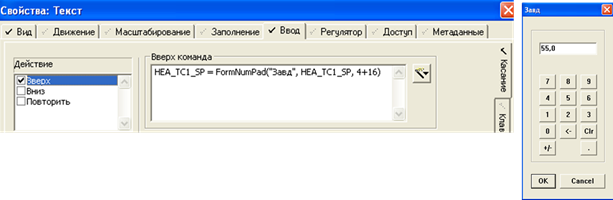

## Додаток 3.2. Основи роботи з Cicode виразами та функціями

### Д3.2.1. Мова Cicode, Cicode вирази та команди

Левова частка анімації Citect реалізована через вирази та команди, що написані в форматі вбудованої мови програмування ***Cicode***.

***Cicode вирази*** (Cicode expressions) – це вирази, написані на мові Cicode, результатом виконання яких є певне значення, що може бути використане при анімації. Це може бути простою змінною чи константою, або виразом з арифметичними, логічними операціями або конкатенацією. 

***Cicode команди*** (Cicode commands) – це інструкція або набір інструкцій (операторів) для виконання, написаних на мові Cicode. По суті, це невеликі програми, написані на мові Cicode. Інструкції розділяються крапкою з комою і можуть викликати функції та змінювати значення змінних. Cicode команди можуть викликатися зокрема:

- певними діями операторів, наприклад кліками миші чи натисканням клавіші (див. Д3.1.5 та Д3.1.14)
- при відкритті/закритті/відображенні сторінок (рис.Д3.2.1)
- при спрацюванні/відключенні тривоги (буде розглянуто в інших лабораторних роботах)
- при формуванні звіту
- при реєстрації користувача в системі (буде розглянуто в інших лабораторних роботах).  



Рис.Д3.2.1 Налаштування команд на різні події на сторінці

Також Cicode команди можна запускати з кожним перерахунком сторінки, помістивши на неї елемент "Объект Cicode".     

У виразах та командах мови Cicode доступні операнди для наступних операцій:

-     арифметичні операції: `+` (додавання), `-` (віднімання), `/` (ділення), `*` (множення), `MOD` (остача від ділення);

-     логічні операції: `AND`, `OR`, `NOT`;

-     побітові логічні операції: `BITAND`, `BITOR`, `BITXOR`;

-     операції порівняння: `>` , `<`, `=`, `<>`, `>=`, `<=`;

-     конкатенація: `+` (з'єднання двох рядків типу STRING);

У Cicode виразах та командах доступний виклик функцій, які можуть бути вбудованими в систему, або написані власноруч за допомогою редактору Cicode. Власні функції Cicode потрібні у тому випадку, коли необхідно створити багаторазово викликуваний код з передачею параметрів, або коли необхідний набір інструкцій не може вміститися в полі введення команди Cicode.  Вони створюються у файлах Cicode. 

Cicode - це повноцінна мова програмування, яка має можливості роботи з власними змінними, умовні оператори, оператори циклів, підтримують багатопоточність та багато чого іншого. Приклад функції на мові Cicode приведений на рис.Д3.2.2. Даний курс не передбачає створення власних функцій. З деталями Ви можете ознайомитися в розділі довідки "Cicode Programming Reference".



Рис.Д3.2.2 Приклад функції Cicode

Альтернативою функціям на мові Cicode в Citect є вбудована мова VBA (Visual Basic for Application), яка не розглядається в даному курсі.  

### **Д3.2.2. Вбудовані** **Cicode** функції

Функціональність Citect багато в чому побудована на базі Cicode функцій, які надають гнучкості цій SCADA-програмі. Деяка частина функцій доступна у включених проектах та створена для реалізації обраного стилю. Ці функції доступні для перегляду та зміни у відповідних файлах через редактор Cicode. Інші функції є системними (нативними) і є частиною API (програмного інтерфейсу). Усі системні функції поділені на категорії для зручності доступу до їх опису в довідниковій системі (див. рис.Д3.2.3). 



Рис.Д3.2.3. Категорії Cicode функцій у Citect 2018.R2

У даному курсі будуть використовуватися тільки деякі найбільш вживані функції. Нижче (в додатку) наведені ті функції, які використовуються у цій лабораторній роботі, інші будуть даватися в додатках до інших лабораторних роботах.  

### Д3.2.3. Функція виклику сторінки (PageDisplay)

Функція відкриває сторінку, вказану в параметрі sPage типу STRING. Синтаксис (спрощений):

***PageDisplay(sPage)***

Приклад відкриття сторінки з ім'ям "Mimic":

```js
PageDisplay("Mimic")
```

### Д3.2.4. Функція надання інформації про елемент (InfoForm)

Функція відкриває вікно з інформацією про елемент, на якому знаходиться курсор. Синтаксис:

***InfoForm(Mode)***

де *Mode* - задає можливість відображення кнопки запису значення: 1-дозволено, 0 – не дозволено.  

### Д3.2.5. Функція виклику вікна вводу значення з віртуальної клавіатури (FormNumPad).

Функція викликає вікно-форму вводу значення з віртуальної клавіатури. Синтаксис:

***FormNumPad(sTitle, Input, Mode)***

де

*sTitle* – текст, який виводиться в заголовку;

*Input* - значення за замовченням, як правило вказується плинне значення величини, яка буде змінюватися;

*Mode* - режим відображення форми вводу, може бути комбінацією (сумою) значень:  

- 0 – стандартна клавіатура
- 1 – поле вводу пароля 
- 4 – з кнопками "+/-" 
- 8 - з кнопкою "/" 
- 16 - з кнопкою "." 
- 32 - з кнопкою ":" 
- 64 - з кнопкою "AM", "PM" buttons

Результатом функції є введене значення. Приклад використання показаний на рис.Д3.2.4



рис.Д3.2.4. Приклад використання функції `FormNumPad` для введення значення з віртуальної клавіатури по кліку миші на елементі
