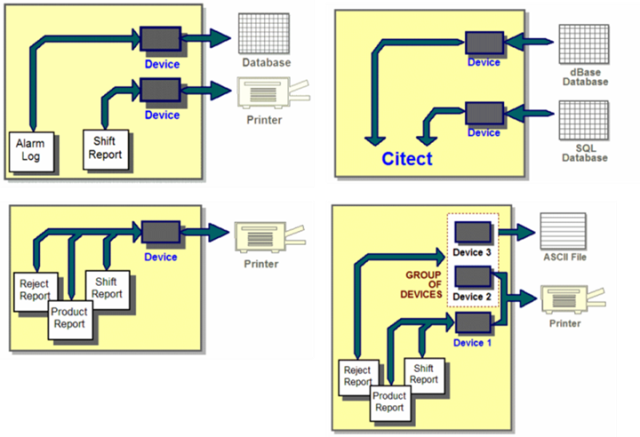
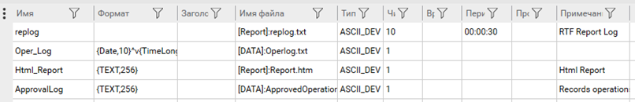
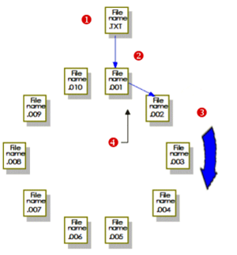
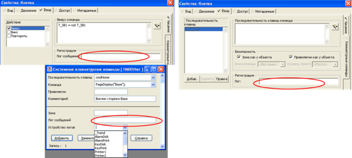

[До лабораторної роботи 4](lab4.md)

## Додаток 4.2. Пристрої системного введення/виведення в Citect та ведення журналу користувацьких подій 

***Пристрої системного введення/виведення***, або просто ***пристрої*** (Device; в рос. лок. "Устройства") надають користувачеві можливість у Citect забезпечувати записування та читання даних з файлів, принтерів та СУБД (рис. Д4.2.1). Пристрої можуть використовуватися для ведення журналів тривог, записування/читання даних з файлу/БД у Cicode, а також для ведення журналу дій оператора (наприклад, натискання кнопки або введення значення в полі). 

 

*Рис. Д4.2.1.* Приклади застосувань пристроїв

Один і той самий пристрій може використовуватися в різних діяльностях Citect. При необхідності використання декількох пристроїв для виведення їх групують в групу пристроїв. При роботі з СУБД дані можна не тільки записувати, а й зчитувати. 

При конфігуруванні пристрою вказується тип (рис. Д4.2.2), який можна вибрати з ряду: 

- RTF files; 

- ASCII files; 

- dBASE databases; 

- SQL databases (через ODBC) ; 

- Printers (Принтери). 



*Рис. Д4.2.2* Налаштування пристроїв

Для файлів в полі імені файлу (File Name; в рос. лок. "Имя файла") задається ім’я файлу. Шлях до директорії можна вказати з використанням параметра. Наприклад, наступний запис вказуватиме на те, що розміщення файлу буде завдатися параметром DATA, який записується в Citect.ini або в налаштуваннях параметра проекту. 

```
[DATA]: ALARMLOG.TXT
```

Для файлів можна вказати також періодичність створення (рос.лок."Периодичность") та кількість історичних файлів (в рос. лок. "Число файлов"). Нові файли будуть створюватися із зазначеною періодичністю відносно часу, вказаного в полі Time (в рос. лок."Время"). Наприклад, якщо кількість файлів задати 10, періодичність 24:00:00, ім’я FileName.TXT, а час 12:00:00, то відбуватиметься така послідовність (рис. Д4.2.3):

1) спочатку записування будуть вестися у файл "FileName.TXT";

2) о 12:00 наступного дня файл буде перейменовано на "FileName.001", після чого створиться новий файл "FileName.TXT", куди буде проводитися записування;

3) у 12:00 3-го дня файл "FileName.001" буде перейменовано на "FileName.002", а файл "FileName.TXT" на "FileName.001", після чого створиться новий файл "FileName.TXT", куди буде проводитися записування; 

4) на 11-й день найстаріший файл буде видалено.  

 

*Рис. Д4.2.3*. Ведення історії файлів

Якщо кількість файлів не вказано, за замовченням береться 10. Кількість фалів можна також задати рівним:

0 – без історії;

-1 - записування в той самий файл.

Для означення формату запису в файл використовуються спеціальні поля, як це робиться для полів тривог. Якщо в тривогах не означений формат для журналу, то буде використовуватися той, який означений для пристрою. Для журналу дій оператора використовуються спеціальні імена полів, які вказані в табл. Д4.2.1. 

*Таблиця Д4.2.1.* Деякі поля для лог-журналів дій оператора (повний перелік див. в довідниковій системі)

| **Поле**          | **Опис**                                                     | **Примітка**                   |
| ----------------- | ------------------------------------------------------------ | ------------------------------ |
| {UserName,n}      | Ім’я користувача                                             |                                |
| {FullName,n}      | Повне Ім’я користувача                                       |                                |
| {Time,n}          | Час формування запису в файлі                                |                                |
| {Date,n}          | Дата формування запису в файлі                               |                                |
| {Page,n}          | Назва сторінки, яка була  відображена, коли відбувався запис |                                |
| {MsgLog,n}        | Повідомлення, яке прописано в  графічному елементі або системній клавіатурній команді, що потребує записування  в журналі дій оператора |                                |
| {Arg1,n}…{Arg8,n} | Набір клавіш натиснутих оператором                           | тільки для клавіатурних команд |

Для ведення ***журналу дій оператора (лог-журнали***) для необхідного графічного елемента або системної клавіатурної команди вказується пристрій, який повинен бути створений заздалегідь (рис. Д4.2.4), а також повідомлення (MsgLog), яке буде заноситися до лог-журналу (рис. Д4.2.5).


*Рис. Д4.2.4* Вказівка на пристрій для графічного елемента та системної клавіатурної команди 

 

*Рис .Д4.2.5* Вказівка повідомлення, яке буде писатися в пристрій при діях оператора: натисканнях миші по елементу, введення з клавіатури для елемента та на рівні всієї системи

Слід розуміти, що ці події не будуть заноситися в загальний журнал SOE. Для внесення сконфігурованих користувачами подій можна скористатися функцією Cicode "SOEEventAdd".
