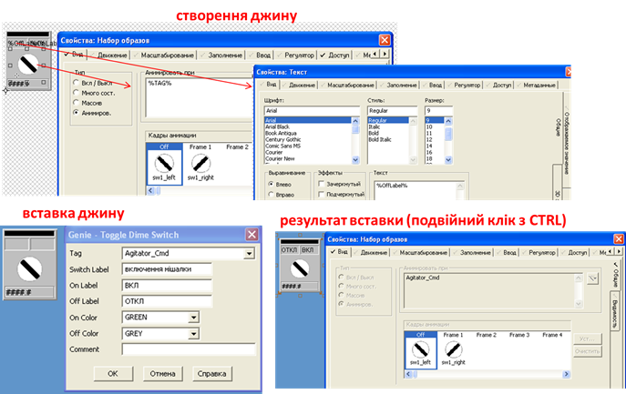
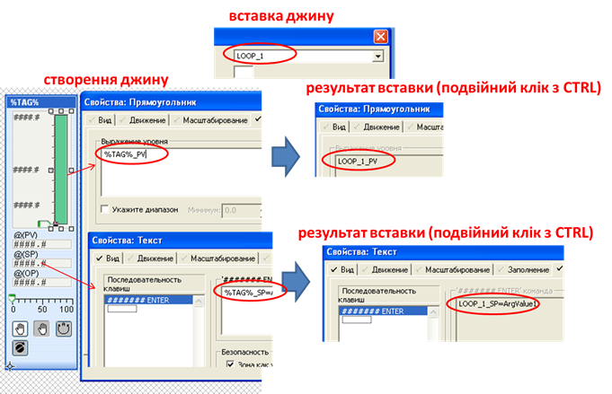

[До лабораторної роботи 4](lab4.md)

## Додаток 4.3. Використання анімованих елементів Джинів - (Genie)  

***Джини*** (Genie) - сукупність пов'язаних об'єктів з вбудованою анімацією на базі замінників, які використовуються в графічних сторінках. Джини – це бібліотечні елементи, які у великій кількості доступні вже у включених проектах. Можна створювати свої джини, що значно спрощує розробку графічної підсистеми з великою кількістю однотипних елементів.

Ідея роботи джинів полягає в наступному. У графічних елементах, які складають основу джину, в місцях анімації або текстової властивості вставляються ***замінники*** (substitution), що виділяються з обох боків символом процента. При вставленні джину ці замінники замінюються іншим текстом, який вводить користувач при вставці.

Наприклад, на рис.Д4.3.1 вказаний джин з іменем "ToggleDimeSwitch", в якому використовується анімація набору символів. У місце анімації "Анимировать при" вставлений замінник `%TAG%`, а в місце відображення тексту в поле "Текст" вказано `%OffLabel%`. При вставці такого джина у місця замінників вставляються `Agitator_Cmd` та `ОТКЛ` відповідно. Після вставки, замінені значення можна перевірити натиснувши подвійним натисканням миші з натиснутою клавішею `CTRL` по необхідному елементу джина (див.Д4.3.1).    

  Рис.Д4.3.1 Приклад прив’язки в джині

Використання замінників дає можливість вставляти в елементі джину тільки частину імені тегу (напису). При використанні структурованих імен змінних це ще більше скорочує час розробки. Так, наприклад, на рис. Д4.3.2 показаний джин, в якому усі елементи прив’язані до змінних, частина імені яких означена замінником `%TAG%`. Таким чином, коли при вставленні джина замінник отримує значення `LOOP_1`, він стає частиною імені змінних тегів `LOOP_1_PV` та `LOOP_1_SP`.

  Рис.Д4.2.7 Приклад використання замінника як частини тега 

Використання такого підходу зменшує кількість введення замінників.   

Джини створюються в редакторі графіки, використовуючи команду меню "Файл->Новый->Джин". Для створення своєї бібліотеки, куди потрібно зберегти джин, у вікні діалогу збереження треба натиснути "Новый" і ввести назву нової бібліотеки.  

Зв'язок джинів з бібліотечним елементом залишається, тому при редагуванні його в бібліотеці, усі екземпляри також змінюються. Слід звернути увагу, що інколи сторінка у Citect одразу не підхоплює зміни в джині. У цьому випадку, сторінку, в якій використано джин, необхідно закрити і повторно відкрити, після чого зберегти і перекомпілювати.
