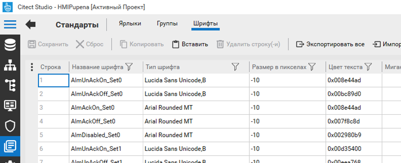

[До лабораторної роботи 4](lab4.md)

## Додаток 4.5. Робота з шрифтами 

Категорії тривог та функції CiCode можуть використовувати попередньо означені в системі або створені користувачем шрифти. Шрифти задаються в меню "Стандарты-> Шрифты" (рис.Д4.5.1). 

Рис.Д4.5.1 Редагування шрифтів  

Шрифт задається комбінацією типу та розміру шрифту, кольору тексту та фону. Можна задати також другий колір тексту та фону для моргання. 

У типі шрифту окрім назви можна задавати властивості товщини (B) курсиву (I) та підкреслення (U), вказавши їх через кому. Наприклад тип "Courier,B,I,U" активує всі три властивості (рис.Д4.5.1) 

Розмір шрифту можна задавати в пікселях або в пунктах (кегль). Для означення шрифту в пунктах необхідно вказати його номер зі знаком мінус, як це показано на рис.Д4.5.1.  
