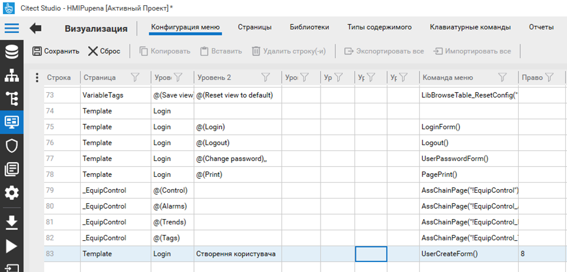

[Людино-машинні інтерфейси](https://pupenasan.github.io/hmi/)  Автор і лектор: Олександр Пупена доц. кафедри [АКСТУ НУХТ](http://www.iasu-nuft.pp.ua/) 

# Лабораторна робота №5.

**Тема. Розроблення трендової підсистеми в SCADA/HMI.**

**Тривалість**: 4 акад. години (4 пари).

**Мета:** ознайомлення з принципами розробки трендової підсистеми, трендів реального часу, генерування подій та керування користувачами.  

**Завдання для виконання роботи**

**Цілі.** 

1. Опанувати основні діяльності з налаштування трендів Citect та їх відображення.

2. Опанувати основні діяльності зі створення та використання трендів реального часу.

3. Опанувати основні діяльності зі створення та використання подій.

4. Опанувати основні діяльності з налаштування користувачів Citect. 

**Лабораторна установка**

Апаратне забезпечення: ПК. 

Програмне забезпечення: UNITY PRO V>=7.0 або Control Expert,  Citect 2016 (або новіше). **Увага! Графічна система, починаючи з Citect 2020 повністю змінена. Тому даний лабораторний практикум не призначений для версій Citect, новіших за Citect 2018R2.** 

## Порядок виконання роботи

## 1.Ознайомлення з додатками 

- [ ] Поверхово ознайомтеся зі змістом додатків до лабораторної роботи:

1. [Додаток 5.1. Налаштування трендової підсистеми Citect ](lab5a_1.md)
2. [Додаток 5.2. Користувачі, права доступу, блокування](lab5a_2.md)
3. [Додаток 5.3. Події (Events)](lab5a_3.md)
4. [Додаток 5.4.Деякі Cicode функції, що використані в лабораторній роботі](lab5a_4.md)

## 2. Підготовка імітатору на ПЛК

- [ ] Завантажте в імітатор контролера підготовлений проект Unity PRO, що описаний у файлі [Завдання](task.md), як це робили на попередній роботі. Якщо проект був збережений як `STU`, варто відкрити його а не файл експорту. 
- [ ] Запустіть на виконання проект в Unity PRO. Перевірте його працездатність.

## 3. Відновлення власного проекту та перевірка його роботи

- [ ] Запустіть середовище розробки Citect. 
- [ ] Якщо Ваш минулий проект не завантажено або змінено кимось іншим, зробіть відновлення свого проекту з резервної копії, збереженої минулої лабораторної роботи. 
- [ ] За необхідності, зробіть компіляцію проекту. 
- [ ] Запустіть свій проект на виконання і перевірте його працездатність, наприклад, змінюючи одну зі мінних у Citect і перевіряючи ці зміни в імітаторі ПЛК.   

## 4. Створення тегу тренду 

- [ ] Уважно прочитайте [Додаток 5.1. Налаштування трендової підсистеми Citect ](lab5a_1.md)

- [ ] Створіть тег тренду з наступними параметрами:

Таблиця 5.1.

| Имя тега | Выражение | Тип          | Период выборки | Время    | Период   | Число файлов | Комментарий | Метод хранения                  |
| -------- | --------- | ------------ | -------------- | -------- | -------- | ------------ | ----------- | ------------------------------- |
| T1_LT1   | T1_LT1    | TRN_PERIODIC | 00:00:05       | 00:00:00 | 24:00:00 | 10           | рівень T1   | Floating Point (8-byte samples) |

Усі інші поля залиште без змін. 

- [ ] Збережіть зміни та скомпілюйте проект.

## 5. Запуск проекту на виконання

- [ ] Використовуючи "Мастер усатновки" налаштуйте щоб архівні дані зберігалися в директорії C:\CDATA\xxx, де XXX – назва вашого проекту (рис.5.1).  


 Рис.5.1 Налаштування місця розміщення папки з архівними файлами

- [ ] Запустіть проект на виконання. Якщо середовище Runtime до цього виконувалось – перезапустіть його. 
- [ ] За допомогою провідника Windows перевірте чи створилися файли історії в папці архівних файлів. 

- [ ] У середовищі виконання зі сторінки "Tanks" запустіть установку приготування продуктів. 
- [ ] Перейдіть у меню "Trends" і відкрийте сторінку "Анализатор процессов всплывающее окно" ("Popup Process Analyst"). 
- [ ] Добавте в Аналітик процесу криву тренду з тегом  T1_LT1 (рис.5.1). 
- [ ] Якщо тренд коректно відображається переходьте до наступного пункту. 


 Рис.5.2. Добавлення тегу. 

## 6. Створення та перевірка інших трендових тегів

- [ ] Створіть усі інші трендові теги, відповідно до таблиць 10 та 11 файлу [Завдання](task.md). 
- [ ] Скомпілюйте та запустіть проект на виконання. 
- [ ] Якщо середовище Runtime до цього виконувалося – перезапустіть його. 

- [ ] У середовищі виконання увійдіть в систему під користувачем `admin` та з зручною мовою.
- [ ] Викличте вікно "Process Analyst" з меню "Тренды". 
- [ ] Зайдіть у властивості Аналітика. Перейменуйте існуючу панель Аналітика на "Приготування" і добавте ще дві панелі "Дозатор 1" та "Дозатор2". 
- [ ] Добавте усі криві, що відповідають за приготування до панелі "Приготування". Звертайте увагу на тип кривої та панель, куди добавляєте. 
- [ ] Так само добавте криві на панелі "Дозатор1" та "Дозатор2" та збережіть налаштування у файлі "Production.pav". Результат повинен виглядати приблизно так, як на рис.5.3. 


Рис.5.3 Зовнішній вигляд Аналітика процесів

## 7. Розміщення Process Analyst на сторінці  "Heat"

- [ ] Використовуючи редактор графіки, розмістіть на сторінці "Heat" Аналітик процесів. 
- [ ] Налаштуйте щоб там відображалися трендові дані по підігрівнику, зокрема:

Таблиця 5.2.

| Змінна     | Примітка                             |
| ---------- | ------------------------------------ |
| HEA_TC1_SP | Уставка для ведучого регулятору      |
| HEA_TT1    | Т продукту на виході підігрівача     |
| HEA_TT2    | Т гарячої води на виході підігрівача |
| HEA_TV1    | Клапан подачі гарячої води           |

- [ ] На закладці "Панели инструментов" налаштуйте головну панель інструментів, як це показано на рис.5.4. 


Рис.5.4 Налаштування панелі інструментів

- [ ] Скомпілюйте проект та перевірте його роботу в Runtime. Якщо графіки не з’являються натисніть на панелі інструментів Аналітика процесу кнопку "Обновить данные". 
- [ ] Включіть програмний задатчик та переведіть контур регулювання в автоматичний режим. За допомогою панелі інструментів змініть масштаби пір’їв на 20-70.   

- [ ] Виведіть на сторінку Heat значення збурення "smHEA_Z1", щоб його можна було змінювати. Можете скористатись для цього джином "Parameter_2" з бібліотеки KeyEntry. 
- [ ] Скомпілюйте проект і запустіть його на виконання. Введіть значення збурення рівним 5.0, подивіться чи дійсно змінюється значення температури. 

## 8. Створення події для зміни значення.

- [ ] Прочитайте уважно [додаток 5.3](lab5a_3.md). 

У цьому пункті необхідно зробити подію, яка випадковим чином буде змінювати кожні 5 секунд значення збурення в діапазоні -5 до +5. 

- [ ] Створіть подію (Событие) та налаштуйте її відповідно до рис.5.5. 

```
smHea_Z1 = Rand (1000)/100.0 - 5.0
```


Рис.5.5 Налаштування властивостей події

- [ ] Скомпілюйте проект. Запустіть майстер налаштування комп’ютеру і активуйте подію "SmZbur", як це показано на рис.5.6. 
- [ ] Запустіть середовище RunTime і перевірте чи змінюється змінна "smHEA_Z1". 


Рис.5.6 Налаштування виконання події на різних частинах системи VijeoCitect 

## 9. Розміщення елементу Тренд

- [ ] Розмістіть об’єкт "Тренд" на сторінці "Tanks" лівіше від танку 1. 

- [ ] У властивостях об’єкту прив’яжіть до першого пера тег тренду "T1_TT1" а до другого - "T1_TV1". 
- [ ] Навколо об’єкта тренду нарисуйте незаповнений прямокутник у якості рамки тренду. 
- [ ] Збережіть сторінку, запустіть проект на виконання та перевірте його роботу.

## 10. Використання CiCode функцій для роботи з Трендом

- [ ] Уважно прочитайте [Д5.4.1](lab5a_4.md). 
- [ ] Дізнайтеся значення точки анімації (AN, ТА) у об’єкта "Trend" через властивості елемента. 
- [ ] У властивостях сторінки "События", для події "При входе на страницу" вставте функцію TrendSetSpan, в аргументах якої вкажіть визначену точку анімації та значення "00:10:00" (10 хвилин). 
- [ ] Збережіть сторінку, запустіть проект на виконання та перевірте його роботу.

```
TrendSetSpan (729, "00:10:00")
```


Рис.5.7. Налаштування автоматичного запуску функції для встановлення періоду відображення. 

- [ ] Пункти 9 та 10 зробіть аналогічним чином і для другого танку. 

## 11. Створення ролей користувачів

- [ ] Уважно прочитайте [додаток 5.2](lab5a_2.md). 
- [ ] Прочитайте вимоги до організації підсистеми доступу з файлу ["Завдання"](task.md). 
- [ ] Створіть ролі з наступними параметрами:

Таблиця 5.3.

| **Назва ролі** | **Привілеї**                                                 | **Коментар**                              | **Примітка**                 |
| -------------- | ------------------------------------------------------------ | ----------------------------------------- | ---------------------------- |
| Administrators | 1,2, 8 - глобальні                                           | Адміністратори                            | Роль вже є, змінити привілеї |
| ProdUsers      | 1 в зоні 1 (зона Tanks)                                      | оператори установки приготування продукту |                              |
| HeaUsers       | 1 в зоні 2 (зона Hea)                                        | оператори установки підігріву             |                              |
| KVPiA          | 1..7 - глобальні                                             | служба КВПіА, наладчик                    |                              |
| Dispatch       | 1 в зоны 10 (зона Dispatch), 1 - глобальні  тільки для перегляду | оператори-диспетчери виробництва          |                              |

## 12. Створення користувачів 

- [ ] Cтворіть користувачів з наступними ролями:

Таблиця 5.4.

| **Назва користувача** | **Назва ролі** | **Тип**   | **Примітка**                                   |
| --------------------- | -------------- | --------- | ---------------------------------------------- |
| Admin                 | Administrators |           | Користувач вже є                               |
| PUser1                | ProdUsers      | ProdUsers | 1-й користувач установки приготування продукту |
| HUser1                | HeaUsers       | HeaUsers  | 1-й користувач установки приготування продукту |
| KVPUser1              | KVPiA          | KVPiA     | 1-й наладчик                                   |
| DspUser1              | Dispatch       | Dispatch  | 1-й диспетчер                                  |

## 13. Налаштування доступу до сторінок та перевірка 

- [ ]  Зробіть наступні налаштування зон для сторінок (Свойства ->Общие->Безопасность):

Таблиця 5.5.

| **Назва сторінки** | **Зона** | **Примітка**                          |
| ------------------ | -------- | ------------------------------------- |
| Tanks              | 1        | зона установки приготування продукту  |
| Heat               | 2        | зона установки підігріву              |
| Base               | 10       | зона оператора-диспетчера виробництва |

- [ ] Для усіх елементів вводу на сторінках "Tanks" та "Heat", а також в джинах зробіть привілеї з рівнем 1. 
- [ ] Скомпілюйте проект і запустіть на виконання.

- [ ] Зареєструйтеся в Runtime системі Citect під користувачем "PUser1" та перевірте до яких сторінок та елементів він має доступ. 
- [ ] Після цього послідовно зареєструйтеся під різними користувачами, вказаними в таблиці 5.4, та перевірте їх можливості.

## 13. Налаштування доступу до тривог та перевірка

- [ ] Для усіх алармів вкажіть зону, до якої вони належать: 
  - для змінних приготування продукту – 1, 
  - для змінних установки підігріву - 2. 

- [ ] Скомпілюйте проект і запустіть на виконання.

- [ ] Використовуючи змінні форсування AIFRC[] та DIFRC[] в Unity PRO або у Citect згенеруйте по одній тривозі в установці приготування продукту (наприклад відмова клапану) і установки підігріву (наприклад висока температура продукту). 
- [ ] Зайдіть в систему під користувачем "Admin" і подивіться на список активних тривог, але не підтверджуйте їх. 
- [ ] Потім почергово зайдіть в систему під користувачами "PUser1" та "HUser1", підтверджуючи видимі для них тривоги.

## 14. Налаштування блокувань

- [ ] У середовищі розробки налаштуйте виконання блокування повзунку на сторінці "Heat" у випадку, коли регулятор знаходиться не в ручному (в автоматичному) режимі. Для цього використайте властивість "Заблокировать при" з закладки "Доступ"->"Запрещен". 
- [ ] Скомпілюйте і перевірте роботу блокування. 

## 15. Створення користувачів в середовищі виконання

- [ ] Створіть пункт меню для створення користувачів як це показано на рис.5.8:

- Сторінка `Template` (меню у шаблоні)
- Рівень 1 `Login` 
- Рівень 2 `Створення користувачів`
- Команда меню `UserCreateForm()`
- Право (привілеї) `8`



Рис.5.8. Створення пункту меню 

- [ ] Для можливості створення користувачів у ролі "Адміністратори" повинно бути право керування користувачами. Перевірте чи це так, і якщо ні - дайте це право. 
- [ ] Збережіть проект. Виконайте компіляцію і перезапустіть середовище виконання.
- [ ] Зайдіть в систему виконання як "Admin". 
- [ ] Використовуючи відповідний пункт меню та форму (рис.5.9) створіть в режимі виконання користувачів:

Таблиця 5.6.

| **Назва користувача** | **Тип**   | **Примітка** |
| --------------------- | --------- | ------------ |
| PUser1                | ProdUsers |              |
| PUser2                | ProdUsers |              |
| PUser3                | ProdUsers |              |
| HUser1                | HeaUsers  |              |
| HUser2                | HeaUsers  |              |
| HUser3                | HeaUsers  |              |


Рис.5.9. Створення корситувачів в режимі виконання

- [ ] Після створення, подивіться чи з’явилися ці користувачі в середовищі розробки. 
- [ ] У середовищі виконання увійдіть в систему під іменем будь якого з новоствореного користувача та перевірте його можливості.  

  

## Питання до захисту

1. Чим відрізняються тренди реального часу від історичних? Як у Citect можна реалізувати ці тренди?
2. Які задачі виконує підсистема керування історичними трендами? Як у Citect реалізована підсистема трендів?
3. Навіщо для трендів означувати періодичність запису та глибину? Як пов’язані ці властивості та яким чином їх вибирати/розраховувати? Як це задається у Citect?
4. За якими подіями може відбуватися запис значень змінних в тренд? Як це задається у Citect?
5. Розкажіть про можливості  переглядачів трендів що є в наявності у Citect.
6. Як показуються змінні на самописцях і як їх відрізняти між собою? Як дізнатися значення змінної в     конкретній точці? Як це реалізовано у Citect?
7. Які механізми використовуються у Citect для розділення прав між користувачами? Розкажіть про призначення зон та привілеїв.
8. Розкажіть про призначення блокування та реалізація його у Citect?
9. Розкажіть про призначення та реалізацію подій у Citect.
10. Поясніть чому 13-му пункті кожен користувач бачив тільки деяку частину тривог.
10. Розкажіть про необхідність створення користувачів у середовищі виконання і як це робиться в Citect.  

 
