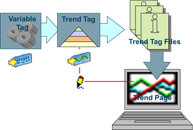
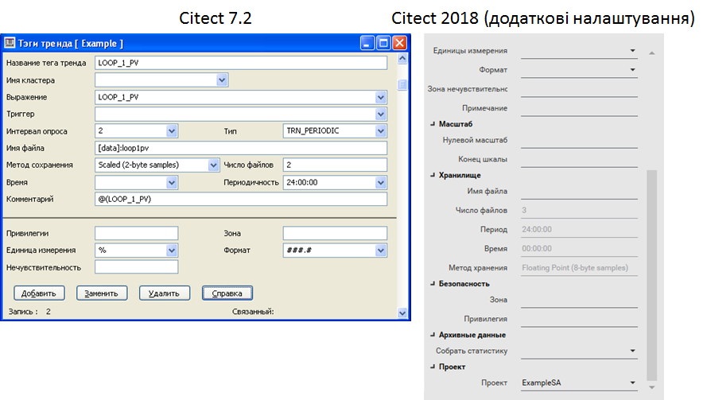
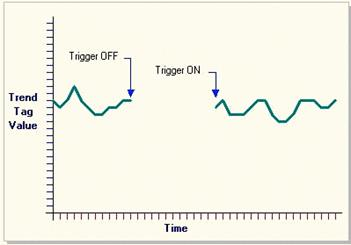
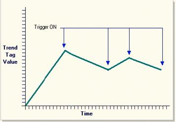
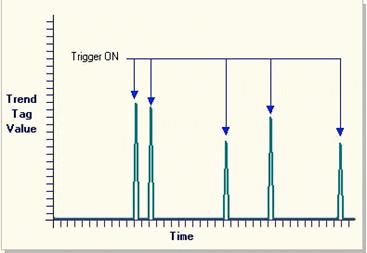
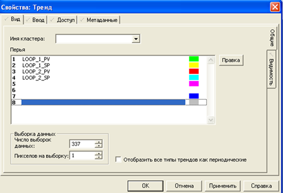
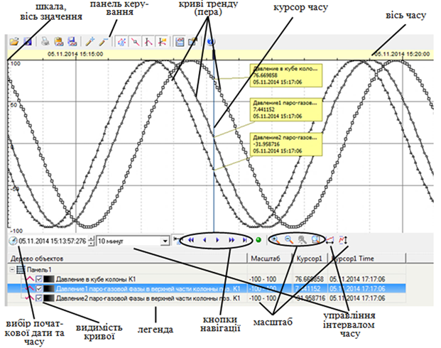
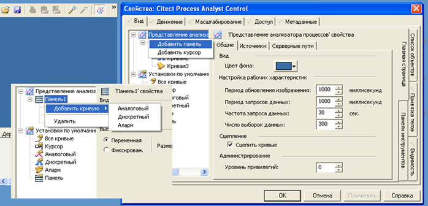
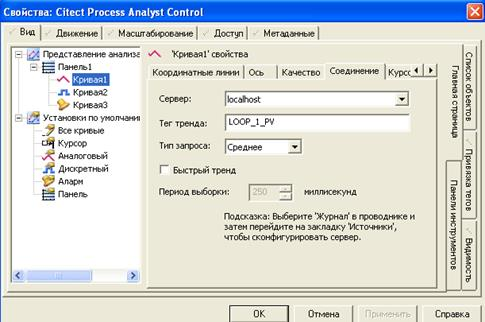
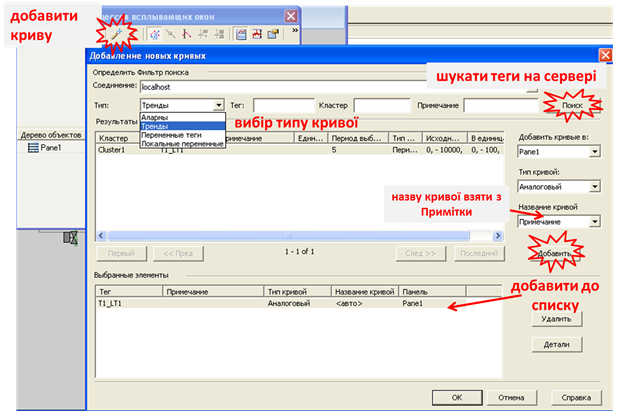

[До лабораторної роботи 5](lab5.md)

## Додаток 5.1. Налаштування трендової підсистеми Citect 

### Д5.1.1. Загальні відомості

У SCADA Citect збереженням (реєстрацією) даних на диску з можливістю їх перегляду у вигляді тренду займається ***трендовий сервер*** (Trend Server). Окрім збереження, трендовий сервер також обслуговує запити від клієнтів (наприклад, від Process Analyst) на читання архівних даних. Оскільки у Citect підтримується розподілена кластерна структура, трендовий сервер може запускатися окремим процесом на окремому ПК. Тому в проекті для Trend Server явно конфігурується ім’я, адреса ПК, на якому планується запускати сервер, TCP-порт та кластер. Для standalone рішень ці настройки залишаються за замовчуванням, оскільки усі компоненти запускаються на тому самому ПК.



Рис.Д5.1.1 Принципи роботи трендової підсистеми

### Д5.1.2. Теги трендів 

Значення, які необхідно зберігати в тренді, означуються через ***теги трендів***, в яких вказується вся необхідна для записування в трендові файли інформація. Ці об’єкти в якості джерела даних беруть значення з інших тегів, у тому числі зі змінних тегів (Рис.Д5.1.1), хоч в якості значення можна записувати результат виразу з комбінацією будь-яких об’єктів. Таким чином, трендовий сервер слідкує за тим, коли необхідно зробити розрахунок виразу і коли треба зробити запис у файлі. Також до його завдань входить формування відповіді на запитування архівних даних. Безпосередніми клієнтами для трендового серверу можуть бути:

- графічні об’єкти для перегляду трендів: Trend та Process Analyst;

- спеціальна Cicode-функція "TrnGetTable" для отримання даних у вигляді масиву;

- функції Cicode для експорту даних: у буфер – "TrnExportClip", в файл CSV – "TrnExportCSV", або у файл DBF – "TrnExportDBF".   

Для перегляду даних у вигляді трендів у графічній підсистемі використовуються два типи об’єктів "Тренд" (Trend) та "Аналізатор процесів" (Process Analyst). Графічний об’єкт "Тренд" може відображати тільки архівні дані з тегів тренду. Аналізатор процесів, окрім архівних даних, що означені в тегах трендів, може відображати дані реального часу. 

Форму налаштування тегу тренду показано на рис.Д5.1.2. Для тегу тренду означується назва, яка може збігатися з назвою змінних тегів або тегів тривог. У полі "Выражение" вказується Cicode вираз, що повертає якесь числове значення. Це може бути як змінна, як це показано на рис.Д5.1.2, так і вираз або функція, наприклад "(LOOP_1_PV + LOOP_2_PV)/2". 



Рис.Д5.1.2 Налаштування тегу тренда

Трендовий сервер розраховує значення вказаного виразу з періодичністю, зазначеною в полі "Интервал опроса". Якщо в цьому полі з'являється десяткове число, то воно буде інтерпретуватися як секунди. Періодичність можна також задати у форматі "hh:mm:ss". Поле "Интервал опроса" є опціональним, за замовченням приймається 10 с. Слід звернути увагу, що при зміні цього значення треба видалити раніше створені архівні файли для даного трендового тегу, щоб зміни вступили в силу. 

У Citect доступні три способи ініціювання записування, які вказуються в полі "Тип". ***Періодичний тренд*** (тип TRN_PERIODIC) записує дані постійно із зазначеним періодом. Можна також вказати ***тригер*** (поле "Триггер"), який буде активувати або деактивувати ведення записування. Запис в архів проводиться тоді, коли тригер = TRUE або не вказаний (рис.Д5.1.3). 



 Рис.Д5.1.3 Періодичний тренд (тип TRN_PERIODIC)  

***Подієвий тренд*** (тип TRN_EVENT) записує дані тільки в момент зміни значення тригеру з FALSE в TRUE. Між точками запису проводиться інтерполяція (рис.Д5.1.4).  



Рис.Д5.1.4 Подієвий тренд (тип TRN_EVENT)

***Періодично-подієвий тренд*** (тип TRN_PERIODIC_EVENT) аналогічно попередньому, записує дані тільки в момент зміни значення тригеру з FALSE в TRUE. Але цей тип тренду не робить інтерполяцію між точками запису (рис.Д5.1.5.)



Рис.Д5.1.5 Періодично-подієвий тренд (тип TRN_PERIODIC_EVENT)

У полі "Имя файла" можна вказати шлях та ім’я файлу (без розширення) для тегу тренду. Наприклад "[data]:loop1pv" вказує, що архівні файли будуть розміщуватися в папці означеній параметром "DATA" з назвою "loop1pv". Якщо ім’я файлу не вказане, воно береться з імені тегу тренду а шлях папки зі значення параметру "DATA".

Глибина запису архіву та кількість архівних файлів для кожного тегу тренду означується значеннями полів "Число файлов", "Время" та "Периодичность". Властивість "Число файлов" вказує на кількість архівних файлів (за замовченням береться 2). Файли синхронізовані відносно часу, вказаного в полі "Время", а кожен файл буде зберігати дані відповідно до вказаної періодичності. При першому старті системи виконання будуть створені усі необхідні файли для ведення історії. Під час роботи системи дані будуть зберігатися у кожному з цих файлів, поступово переходячи від одного файлу до іншого з вказаною періодичністю (значення "Периодичность"). Коли закінчується час запису в останній файл, система знову переходить до 1-го файлу, затираючи старі архівні значення. Розглянемо це на прикладі, де означено кількість файлів рівною 10, періодичність 24:00:00, а час синхронізації ("Время") - 00:00:00.

1. При першому запуску системи будуть створені усі 10-ть файлів з вказаним іменем та з розширеннями ".000"… ".009" та один файл з розширенням ".HST". Спочатку Vijeo Citect пише архівні дані в файл з розширенням ".000".

2. Опівночі, наступного дня, дані будуть записуватися в файл з розширенням ".001".

3. Опівночі, третього дня, дані будуть записуватися в файл з розширенням ".002" і так далі.

4. Після 10-ти днів, система почне переписувати перший файл, тобто ".000".  

Слід звернути увагу, що при зміні будь з яких значень кількості та періодичності історичних файлів треба видалити раніше створені архівні файли для даного тегу тренда, щоб зміни вступили в силу.

Властивість "Метод сохранения" вказує на спосіб і величину збереження числових даних. Якщо не потрібна велика точність, варто використовувати "Scaled (2-byte samples)". Одиниці вимірювання і формат вказуються для відображення їх на осі, курсорі Аналітика процесів та на інших числових полях. Така необхідність спричинена можливістю використання кількох змінних у формуванні значення трендового тегу. Зона і привілеї налаштовуються для обмеження доступу . 

У нових версіях Citect з’явилися додаткові можливості і відповідно налаштування. Зокрема масштаб задається для формування масштабу відображення за замовчуванням. Властивість "Собрать статистику" (Historize) вказує на автоматичне формування історичного тегу в спеціалізованому продукті Schneider Electric's Historian.

Клієнтська частина підсистеми трендів представлена графічними об’єктами переглядачів трендів, які можна розміщувати в будь-якій кількості на будь якій дисплейній сторінці, а також функціями Cicode.  

### Д5.1.3. Об’єкт "Тренд"

Об’єкт "***Тренд***" – переглядач трендів Citect, який був доступний ще з ранніх версій. Він дає можливість відобразити до 8-ми архівних значень тегів тренду. Для кожного пера (кривої) вказується назва тегу тренду та колір (рис. Д5.1.7). Властивість "Число выборок данных" вказує на кількість записів у файлі історії, які будуть відображатися для кожного тегу тренду. За допомогою властивості "Пикселов на выборку" вказуються проміжки між двома точками одного пера на графіку. Ширина об’єкта "Тренд" пов’язана з цими властивостями:  

```
Ширина = "Пикселов на выборку" x Число выборок данных"
```



Рис.Д5.1.7 Об’єкт "Тренд"

Указати діапазон значень у часових розмірах можна за допомогою Cicode функції, наприклад TrendSetSpan.

Об’єкт "Тренд" має дуже мало можливостей налаштування в середовищі розроблення. Усі можливості навігації по історії, відображенню значень, налаштуванню області відображення та багато іншого реалізовуються через функції Cicode. Для спрощення використання трендів на базі об’єкта "Тренд" у включених проектах Citect є спеціальні сторінки, джини та суперджини. Тим не менше, більш функціональнішим у використанні трендів є об’єкт "Аналізатор процесів".

### Д5.1.4. Об’єкт "Аналізатор процесів" (Process Analyst) 

***Аналізатор процесів*** (Process Analyst) дає можливість відображати в часі значення тегів трендів, змінних тегів а також тегів тривог. Аналізатор процесів має такі можливості:

- налаштування всіх параметрів відображення як у середовищі розроблення, так і в середовищі виконання;

- добавлення і відображення на одному елементі тренду кількох панелей (умовно незалежних трендових елементів) це дає можливість:

  - групувати криві разом за певною ознакою;

  - порівнювати тренди;

  - здійснювати відносний зсув панелей за часом; 

- відображення на панелі об’єктів:

  - трендів у реальному часі зі змінних тегів;

  - архівних трендів з трендового серверу;

  - зміни стану тривог у часі з тривогового сервера;

  - архівних трендів та трендів реального часу з Historian; 

- добавлення на тренд (конкретну панель) кривих реального часу та за архіву:

  - числових змінних;

  - дискретних змінних;

  - стану тривог; 

- відображення кривих (пер, pen) тренду у вигляді (рис.Д5.1.8):

  - ліній різного кольору, товщини та формату: неперервної, штрихової, пунктирної і т.п.;

  - різного типу ліній залежно від якості (достовірності) та наявності даних;

  - точок даних у форматі різних фігур;  


Рис.Д5.1.8. Налаштування кривої тренду

- відображення та налаштування по осях X та Y для кожної кривої (рис.Д5.1.9):

  - сітки і поділок; 

  - діапазону, можливості автомасштабування;

  - можливості прокручування (див.рис.Д5.1.10);

  - відображення шкали для вибраної кривої;


*Рис.Д5.1.9.* Налаштування координатних ліній та осей

- у режимі виконання використання кнопок перемотування (див.рис.Д5.1.10)

  - "<" – на половину інтервалу назад; 

  - " <<" – на один інтервал назад;

  - " >" – на половину інтервалу вперед; 

  - " >>" – на один інтервал уперед;



*Рис.Д5.1.10.* Загальний вигляд Аналітика процесів у середовищі виконання

- у режимі виконання для кривих

  - зціплювати криві разом;

  - синхронізувати з плинним часом;

- виведення легенди з можливістю:

  - швидкої зміни основних властивостей кривих;

  - відображенням числового значення трендів у потрібній точці часу через курсор;

- збереження відображених даних у форматі XLS або TXT; 
- збереження заданих налаштувань (представлення) у файл "*.PAV" з указаним ім’ям для можливості відкриття налаштувань звичайним вибором;
- керування та налаштування з Cicode функцій та VBA. 

Окремо варто зупинитися на функції відображення на панелі трендів стану тривог (рис.Д5.1.11). 


Рис.Д5.1.11. Загальний вигляд Аналітика процесів в середовищі виконання

Кожен стан тривог (неактивна 4, активна непідтверджена 1, активна підтверджена (3), неактивна непідтверджена 2) відображається на панелі трендів у вигляді прямокутника певної висоти і контуру. Для аналогових тривог можна також змінювати колір для різної мітки. 

Окрім трендів, Citect має можливість з використанням спеціальних функцій відображати залежності у форматі графіку X від Y.

Криві отримують назви за замовченням, однак їх можна змінити довільними назвами, в тому числі з кирилицею. Для можливості зміни, необхідно зробити натискання по назві кривій, а після її виділення зробити повторне одинарне натискання і перейменувати криву.   



Рис.Д5.1.12 Загальний вигляд вікна налаштування Аналітика процесів в середовищі розробки

Для кожної кривої у вкладці "Соединение" задається джерело даних (рис. Д5.1.13). Так, наприклад, для аналогової або дискретної кривої задається тег тренду. Якщо необхідно вказати змінний тег (для трендів реального часу) то виставляється опція "Быстрый тренд", а в полі "Тег тренда" вказується назва змінного тегу. 

Налаштування вигляду панелі інструментів робиться в закладці "Панели инструментов".    



Рис.Д5.1.13 Властивості вкладки "Соединение" Аналітика процесів



Рис.Д5.1.14 Добавлення кривої в Аналітику процесів в середовищі виконання

