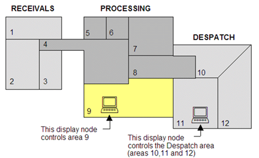
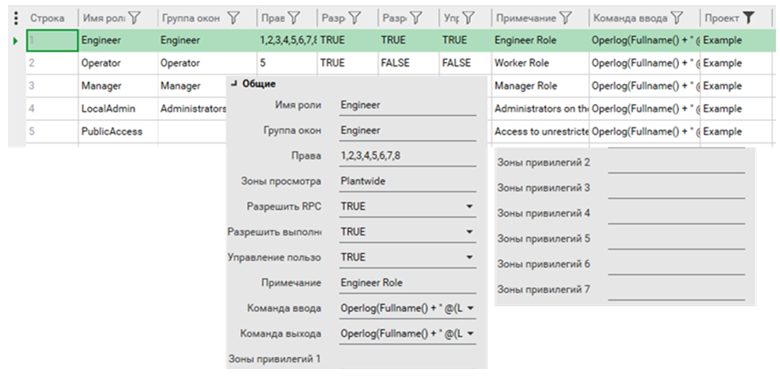
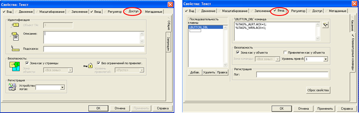
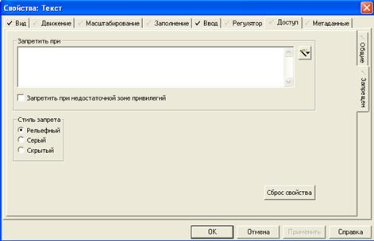

[До лабораторної роботи 5](lab5.md)

## **Додаток 5.2. Користувачі, права доступу, блокування** 

У Citect поняття облікового запису ототожнюється з поняттям користувача. Можливості користувачів (авторизація) задаються через приналежність до ролі, в якій вказуються набір привілеїв (Privilege) у певних виробничих зонах (Area). Роль повністю означує права, що має користувач, якому ця роль призначена. Ролі базуються на розділенні процесу згідно з:

‒    ***виробничими зонами*** (Area), за допомогою яких вказується область процесу, до якого користувач має право доступу;

‒    привілеями (***Privilege***), за допомогою яких вказується рівень доступу до кожного елемента в межах зони. 

Таким чином, при створенні користувача йому призначають роль, яка надає йому певні права в певній зоні (області) процесу. За замовченням, якщо користувач не зареєструвався, привілеї та зона для нього рівні 0.

Приклад розділення процесу (виробництва) на зони показано на рис.Д5.2.1. Згідно з цим рисунком, у зоні 9 користувачі з указаними правами можуть доступатися для керування, а в зонах 10–12 – тільки для контролю. Розділення технологічного процесу (виробництва) на зони використовується разом з означенням привілей для обмежень доступу в клавіатурних командах, тривогах, об’єктах, звітах і т.д. 

​                               

Рис.Д5.2.1 Приклад ділення процесу на зони

Зони призначені для розділення прав доступу в різних частинах процесу або виробництва, а привілеї стосуються можливостей оператора в межах цих зон. У Citect користувачам можуть бути призначені до 8-ми привілеїв (1..8). За замовченням, номери привілеїв є рівнозначними, тобто користувач тільки з привілеями 8 не має доступу до об’єктів з привілеями 1–7. Через параметр [Privilege]Exclusive=0 можна призначити ієрархічність привілеїв (8-й має усі привілеї). Окрім привілеїв у межах зон, в ролях можна призначити глобальні привілеї, які діють у межах усіх зон.

Таким чином, у межах проекту створюються ролі, в кожній з яких вказуються зони та привілеї. На рис. Д.5.2.2 показано форму налаштування ролей. У полі "Privileges" **(**рос. лок."Права") вказуються номери привілеїв, які діють в усіх зонах. У полі "View Areas" (рос. лок."Зоны просмотра") вказуються номери зон, які доступні користувачеві з цією роллю тільки для перегляду. Для кожного привілею можна назвати зони, в яких вони діють "Priv1 Areas" (рос. лок."Зона привилегий 1"… "Зона привилегий 8"). Поля Entry Command (рос. лок."Команда ввода") та Exit Command (рос. лок."Команда выхода") дають можливість вказати команди Cicode, які будуть запускатися при реєстрації та виході користувача із системи, відповідно. Якщо виставлена опція "Manage Users", користувачі з даною роллю можуть керувати користувачами в режимі виконання (додавати, змінювати та видаляти). Для можливості запуску застосунків з використанням функції "Exec" повинна бути активною властивість "Allow Exec" (рос. лок. "Разрешить выполнение"), а для функцій MsgRPC та ServerRPC – "Allow RPC" (рос. лок. "Разрешить RPC"). 

 

*Рис .Д5.2.2* Налаштування ролей

SCADA Citect дає можливість інтегрувати підсистему користувачів Windows зі своєю підсистемою доступу. Для цього в полі Windows Group (рос. лок. "Группа окон" (до версії 2018 R12) або "Группа пользователей"J) вказується ім’я групи користувачів та налаштовується параметр [Client]AutoLoginMode. 

При створенні користувачів Citect (рис. Д.5.2.3), окрім паролю і ролі, можна задати тип. Цей тип можна використовувати при створенні користувачів у режимі виконання (функція UserCreate), де в якості шаблону нового користувача будуть використовуватися налаштування конкретного користувача.

 

*Рис. Д.5.2.3* Налаштування користувачів

Для означення прав доступу до елементів для кожного з них можна призначити рівень привілеїв та зону. Наприклад, для графічних елементів це робиться на закладці "Доступ->Общие" (рис. Д.5.2.4). За необхідністю можна означити інші привілеї та зону для кожної дії. 

 

Рис.Д5.2.4 Налаштування доступу для елементів

На закладці "Доступ->Запрещен" можна вказати умову блокування (заборони) доступу до елемента та зовнішній вигляд при забороні (рис. Д5.2.5). 

 

Рис.Д5.2.5 Налаштування блокування доступу

Вхід та вихід користувачів реалізується через функції Cicode та шаблони. Одночасно з реєстрацією користувача вказується мова, яка буде використовуватися в системі. Усі дії з користувачами фіксуються в журналі. Шаблони Citect також надають можливість редагувати існуючі та створювати нові користувачі в режимі виконання через меню користувачів. Зрештою це робиться через CiCode функцію UserCreate. Це можуть робити тільки користувачі з зазначеними правами "Manage Users" (див. рис. Д5.2.2).

Citect має багато функцій керування користувачами, деякі з них наведені нижче:

- Login – вхід користувача з вказаним іменем, паролем та мовою;
- LoginForm – відображення форми входу користувача в систему; 
- Logout – вихід користувача із системи;
- LogoutIdle – час простою, після якого користувач покине систему автоматично;
- UserCreate – створення нового користувача;
- UserCreateForm – відображення форми створення нового користувача;
- UserEditForm – відображення форми редагування користувача.

Таким чином, якщо необхідно реалізувати автоматичний вхід у систему користувача через певний ідентифікатор, це можна зробити через події та функцію Login. 

Додатково до адміністрування користувачів Citect передбачає захист підключення клієнта до сервера, для чого в майстрі налаштування комп’ютера вказується пароль підключення. Також у цьому майстрі можна налаштувати повноекранний режим, який не дає перейти на робочий стіл, використовуючи кнопки керування заголовка вікна (згорнути, закрити). Тут також можна налаштувати блокування комбінації "ALT+SPACE", яка передбачає виклик контекстного меню активного вікна. Інші комбінації, наприклад "Alt-Escape", "Ctrl-Escape" чи "Alt-Tab", необхідно блокувати іншими засобами, наприклад, правкою ключів реєстру Windows або спеціальними утилітами. 

 

