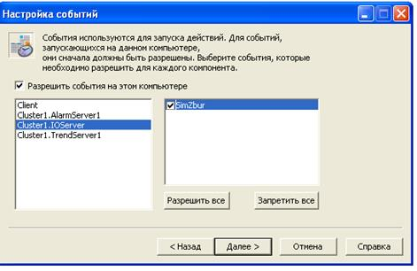

[До лабораторної роботи 5](lab5.md)

## Додаток 5.3. Події (Events) 

Події дають можливість виконувати певну дію, означену Cicode командою, за виконанням певної умови або періодичності виконання. Події створюються в редакторі проекту "Система"->"События". Для події вказується ім’я (див. рис.Д5.3.1), періодичність та час, відносно якого проводиться синхронізація періодичності ("Время"). Якщо період не вказаний, він приймається рівним 1 секунда.  

Рис.Д5.3.1 Налаштування властивостей події

Тригер вказує на умову, яка запускає виконання дії. Якщо тригер не вказаний, то дія буде виконуватися з періодичністю, означеною полями "Время" і "Периодичность". Якщо тригер вказаний, але не вказані поля "Время" і "Периодичность", то дія буде виконуватися по передньому фронту спрацювання тригеру.

Події можуть виконуватися на будь якому сервері Citect, або в клієнті, або в усіх перерахованих. Місце виконання подій налаштовуються в майстрі налаштування комп’ютера (рис.Д5.3.2). Події з іменем "GLOBAL" виконуються на всіх комп’ютерах в системі Vijeo Citect. 

Рис.Д5.3.2 Налаштування виконання події на різних частинах системи VijeoCitect 

