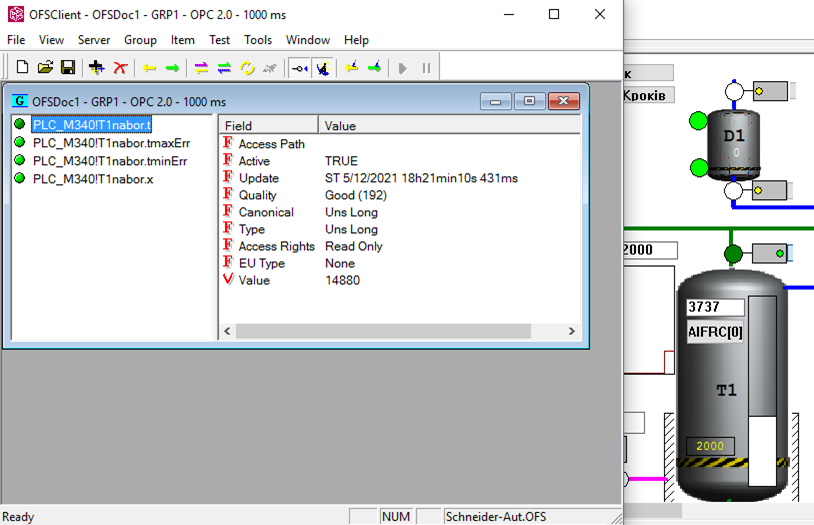
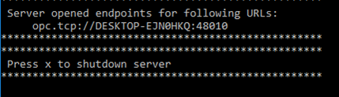
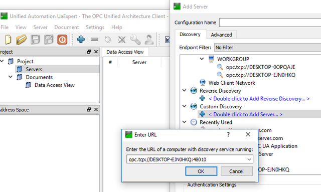
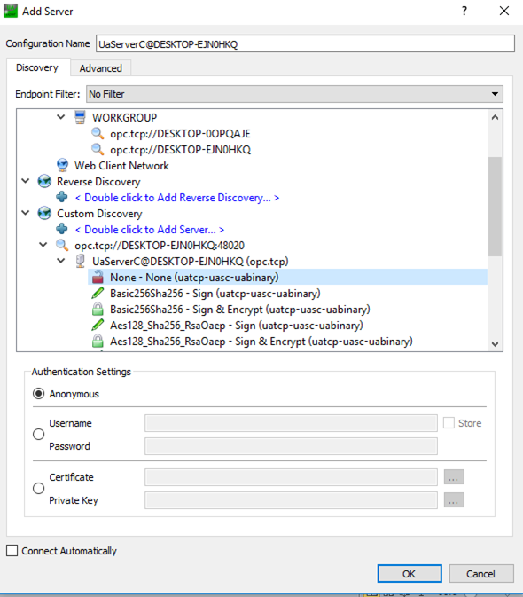
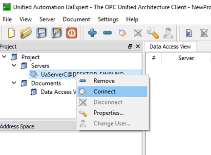
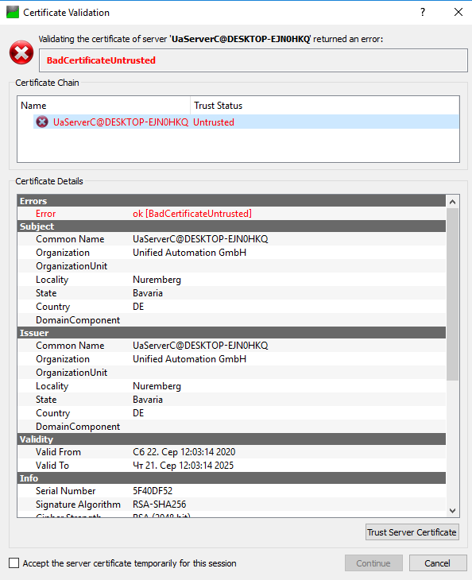
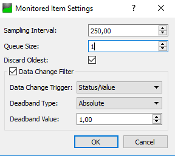
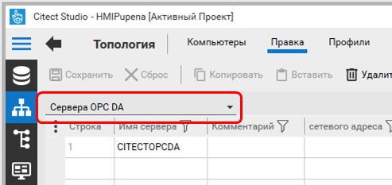
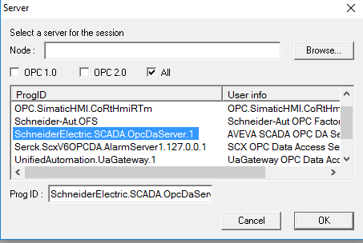

[Людино-машинні інтерфейси](https://pupenasan.github.io/hmi/)  Автор і лектор: Олександр Пупена доц. кафедри [АКСТУ НУХТ](http://www.iasu-nuft.pp.ua/) 

# Лабораторна робота №6.

**Інтеграція** **SCADA/HMI зі сторонніми засобами та розробка HMI для мобільних гаджетів**

**Тривалість**: 8 акад. годин (4 пари).

**Мета:** ознайомлення з принципами інтегрування SCADA/HMI з іншими програмним засобами з використанням технології OPC.  

**Завдання для виконання роботи**

**Цілі.** 

1. Опанувати основні діяльності з налаштування OPC Server та OPC Client в технології OPC DA.
2. Опанувати основні діяльності з налаштування OPC Server та OPC Client в технології OPC UA.
3. Навчитися розробляти прикладне ПЗ на базі SCADA Citect з використанням драйверів OPC.
4. Навчитися розробляти застосунки HMI для мобільних гаджетів з використанням спеціалізованого ПЗ та інтегрувати їх зі SCADA/HMI.  

**Лабораторна установка**

Апаратне забезпечення: ПК. 

Програмне забезпечення: UNITY PRO V>=7.0 або Control Expert,  Citect 2016 (або новіше). . **Увага! Графічна система, починаючи з Citect 2020 повністю змінена. Тому даний лабораторний практикум не призначений для версій Citect, новіших за Citect 2018R2.** 


**Примітки щодо відео: представлені в роботі відеоматеріали є студентською інтерпретацією лабораторної роботи, носять ознайомчий характер і можуть містити помилки!** 

## Порядок виконання роботи

## 1.Ознайомлення з додатками 

- [ ] Поверхово ознайомтеся зі змістом додатків до лабораторної роботи:

1. [Додаток 6.1. Налаштування та перевірка роботи серверів OPC DA](lab6a_1.md)
2. [Додаток 6.2. Налаштування Citect для роботи в якості OPC DA Client](lab6a_2.md)
3. [Додаток 6.3. Налаштування та перевірка роботи серверів OPC UA](lab6a_3.md)
4. [Додаток 6.4. Налаштування Citect для роботи в якості OPC UA Client](lab6a_4.md)
5. [Додаток 6.5. Встановлення та налаштування OPC DA - OPC UA шлюза](lab6a_5.md)
6. [Додаток 6.6. Розробка HMI для мобільних гаджетів та їх інтегрування через OPC](lab6a_6.md)

## 2. Підготовка імітатору на ПЛК

- [ ] Завантажте в імітатор контролера підготовлений проект Unity PRO, що описаний у файлі [Завдання](task.md), як це робили на попередній роботі. Якщо проект був збережений як `STU`, варто відкрити його а не файл експорту. 
- [ ] Запустіть на виконання проект в Unity PRO. Перевірте його працездатність.

## 3. Відновлення власного проекту та перевірка його роботи

- [ ] Запустіть середовище розробки Citect. 
- [ ] Якщо Ваш минулий проект не завантажено або змінено кимось іншим, зробіть відновлення свого проекту з резервної копії, збереженої минулої лабораторної роботи. 
- [ ] За необхідності, зробіть компіляцію проекту. 
- [ ] Запустіть свій проект на виконання і перевірте його працездатність, наприклад, змінюючи одну зі мінних у Citect і перевіряючи ці зміни в імітаторі ПЛК.   

## 4. Експортування означення змінних з проекту 

- [ ] Детально ознайомтеся з принципами налаштуванням OFS, які описані в [додатку 6.1. Налаштування та перевірка роботи серверів OPC DA](lab6a_1.md)
- [ ] Після завантаження проекту UNITY PRO в ПЛК, зробіть експорт даних з типом `SFCSTEP_STATE` в файл типу `*.XVM`

Увага! Кожне повне компілювання (`Rebuild`) розміщує дані в різних областях. Тому після компілювання для нормальної роботи змінних в OFS, потрібно робити експорт повторно     

## 5. Встановлення та конфігурування OFS Server 

- [ ] Завантажте та встановіть OFS Server. Деталі завантаження та встановлення описані в [додатку 6.1. Налаштування та перевірка роботи серверів OPC DA](lab6a_1.md)
- [ ] Відкрийте конфігуратор OFS. Створіть та налаштуйте пристрій (псевдонім) на зв'язок з локальним емулятором ПЛК. У якості `symbol table file` вкажіть експортований до цього файл `*.XVM`.
- [ ] Збережіть налаштування.

<iframe width="560" height="315" src="https://www.youtube.com/embed/61kQNIKUxvg" title="YouTube video player" frameborder="0" allow="accelerometer; autoplay; clipboard-write; encrypted-media; gyroscope; picture-in-picture" allowfullscreen></iframe>

## 6. Перевірка роботи OFS Server за допомогою OFS Client 

- [ ] Запустіть OFS Client.
- [ ] З'єднайтеся з сервером OFS.
- [ ] Створіть OPC групу та добавте в неї Item які стосуються кроку набору (`T1nabor`).
- [ ] При правильності налаштування та присутності з'єднання кружечки біля назви Item будуть зеленими (рис.6.1) 
- [ ] Запустіть в ПЛК програму приготування. Перевірте, що в OFS Client значення `T1nabor.x` встановлено в 1 при активності кроку набору в Танк1, а змінна  `T1nabor.t` - збільшується.



рис.6.1. Перевірка роботи OFS Server.

<iframe width="560" height="315" src="https://www.youtube.com/embed/O5c3tbsd0v8" title="YouTube video player" frameborder="0" allow="accelerometer; autoplay; clipboard-write; encrypted-media; gyroscope; picture-in-picture" allowfullscreen></iframe>

## 7. Встановлення та конфігурування VIPA OPC

- [ ] Завантажте та встановіть VIPA OPC Server. Деталі завантаження та встановлення описані в [додатку 6.1. Налаштування та перевірка роботи серверів OPC DA](lab6a_1.md)
- [ ] Відкрийте конфігуратор VIPA OPC (Від імені адміністратора). 
- [ ] Видаліть усі мережі крім MPI та змініть назву пристрою на PLC1. Змініть налаштування, щоб він імітувався.
- [ ] Збережіть налаштування та переконфігуруйте службу як це вказано в додатку.

<iframe width="560" height="315" src="https://www.youtube.com/embed/fLzb37ImSzg" title="YouTube video player" frameborder="0" allow="accelerometer; autoplay; clipboard-write; encrypted-media; gyroscope; picture-in-picture" allowfullscreen></iframe>

## 8. Перевірка роботи OPC VIPA за допомогою OFS Client 

- [ ] Запустіть OFS Client.
- [ ] З'єднайтеся з сервером `VIPA.OPC-Server`
- [ ] Створіть OPC групу та добавте в неї дві змінні, які були сконфігуровані в сервері.

Спочатку змінні будуть відображатися як поганої якості (жовті трикутники), бо вони не ініціалізувалися.

- [ ] Запишіть (клік по елементу) в змінні якість значення. 

Після цього індикатори зміняться на зелені кружечки, що свідчить про їх хорошу якість.

<iframe width="560" height="315" src="https://www.youtube.com/embed/_oNSY62wRWU" title="YouTube video player" frameborder="0" allow="accelerometer; autoplay; clipboard-write; encrypted-media; gyroscope; picture-in-picture" allowfullscreen></iframe>

## 9. Створення пристрою I/O в Citect для з'єднання з OFS  

- [ ] Уважно прочитайте [Додаток 6.2. Налаштування Citect для роботи в якості OPC DA Client](lab6a_2.md)
- [ ] Використовуючи майстер створення пристроїв створіть I/O Device OFSM340, що буде зв'язуватися через драйвер OFSOPC. Зробіть зв'язок тегів Citect зі змінними OFS. При налаштуванні зв'язування вкажіть конфігурований в OFS псевдонім ПЛК.
- [ ] Після завершення майстра, передивіться теги, які були створені. 

<iframe width="560" height="315" src="https://www.youtube.com/embed/OidfF8TrhwY" title="YouTube video player" frameborder="0" allow="accelerometer; autoplay; clipboard-write; encrypted-media; gyroscope; picture-in-picture" allowfullscreen></iframe>

## 10. Перевірка роботи тегів з OFS

- [ ] У Citect створіть нову сторінку з назвою "OPCtest".
- [ ] Виведіть 4-ри теги для відображення, які  перевірялися в OFS Client (див. рис.6.1).
- [ ] Зробіть компілювання проекту та запустіть його на виконання. Перевірте чи співпадають значення з тими що показуються в OFS Client  

<iframe width="560" height="315" src="https://www.youtube.com/embed/4rBGePjgJFU" title="YouTube video player" frameborder="0" allow="accelerometer; autoplay; clipboard-write; encrypted-media; gyroscope; picture-in-picture" allowfullscreen></iframe>

## 11. Створення та перевірка пристрою I/O в Citect для з'єднання з VIPA OPC  

- [ ] Використовуючи майстер створення пристроїв створіть I/O Device PLC1VIPA, що буде зв'язуватися через драйвер OPCClient. Зробіть зв'язок тегів Citect зі змінними OPC. 
- [ ] Після завершення майстра, передивіться теги, які були створені. 

<iframe width="560" height="315" src="https://www.youtube.com/embed/EX2FS9YBgM0" title="YouTube video player" frameborder="0" allow="accelerometer; autoplay; clipboard-write; encrypted-media; gyroscope; picture-in-picture" allowfullscreen></iframe>

## 12. Перевірка роботи тегів з VIPA OPC

- [ ] У Citect на сторінці "OPCtest" виведіть два теги для відображення та зміни (наприклад через джин KeyEntry.Parameter2), які  перевірялися в OFS Client.
- [ ] Зробіть компілювання проекту та запустіть його на виконання. Введіть якісь значення. Перевірте чи співпадають значення з тими що показуються в OFS Client для VIPA OPC.

<iframe width="560" height="315" src="https://www.youtube.com/embed/5uuILZGGjsI" title="YouTube video player" frameborder="0" allow="accelerometer; autoplay; clipboard-write; encrypted-media; gyroscope; picture-in-picture" allowfullscreen></iframe>

## 13. Завантаження та встановлення тестових застосунків OPC UA

- [ ] Уважно прочитайте [Додаток 6.3. Налаштування та перевірка роботи серверів OPC UA](lab6a_3.md)
- [ ] Завантажте та встановіть [OPC UA C++ Demo Server](https://www.unified-automation.com/downloads/opc-ua-servers.html)  (під Winidows). Доступ до завантаження потребує реєстрації, але це безкоштовно.
- [ ] Завантажте та встановіть тестовий OPC UA Client [UaExpert](https://www.unified-automation.com/downloads/opc-ua-clients.html).


## 14. Запуск серверу та клієнту OPC UA

- [ ] Запустіть "OPC UA C++ Demo Server" та погодьтеся на внесення порту до списку дозволених брандмауером.
- [ ] У консольному вікні серверу знайдіть запис з URL кінцевої точки, на рис. 6.2 вона має таке значення

```bash
opc.tcp://DESKTOP-EJN0HKQ:48010
```

 

рис.6.2. Приклад кінцевої точки

- [ ] Запустіть UaExpert, натисніть "+" (Add server) 
- [ ] Добавте тестовий OPC UA Server через меню Custom Discovery, шляхом копіювання URL, який наведений у консольному вікні серверу 



рис.6.3. Добавлення OPC UA Server

- [ ] Виберіть підключення без захисту (None) і натисніть Ok



рис.6.4. Вибір з варіантів підлкючення  

- [ ] Для доданого серверу натисніть Connect.  

  

  рис.6.5. Підключення до серверу

- [ ] У вікні що з'явиться,  виберіть Trust Server Certificate, після чого натисніть Continue.



рис.6.6. Довіра до сертифікату серверу

<iframe width="560" height="315" src="https://www.youtube.com/embed/tZOpSOzD39g" title="YouTube video player" frameborder="0" allow="accelerometer; autoplay; clipboard-write; encrypted-media; gyroscope; picture-in-picture" allowfullscreen></iframe>

## 15. Перегляд змісту OPC UA Сервера

- [ ] Використовуючи UaExpert проаналізуйте зміст об'єктів першого (Root) та другого рівня (Objects, Types, Views), проаналізуйте: 
  - [ ] перелік та зміст атрибутів: NodeID, NodeClass 
  - [ ] перелік та зміст посилань (References): 
- [ ] Проаналізуйте подібним чином ще одну з папок, вкладену в `Objects`

- [ ] Відкрийте для перегляду об'єкт `BuildingAutomation.AirConditioner_1`
- [ ] Знайдіть DataVariable `Temperature`  проаналізуйте атрибути `Value` та `DataType`.
- [ ] Проаналізуйте атрибути для властивостей `AirConditioner_1.Temperature.EURange` та `AirConditioner_1.Temperature.EngineeringUnits`
- [ ] Проаналізуйте атрибути `Value` та `DataType`для наступних об'єктів:
  - [ ] `Demo.Static.Arrays.AnalogMeasurement`
  - [ ] `Demo.Static.Arrays.Structure`
  - [ ] `Demo.Static.Matrix.Float`

<iframe width="560" height="315" src="https://www.youtube.com/embed/-mjn6ygka0c" title="YouTube video player" frameborder="0" allow="accelerometer; autoplay; clipboard-write; encrypted-media; gyroscope; picture-in-picture" allowfullscreen></iframe>

## 16.Використання Data Access View

- [ ] Якщо не відкрито вікно `Data Access View` , створіть новий документ такого типу
- [ ] Перетягніть `AirConditioner_1` на вікно  `Data Access View` , повинні поміститися усі об'єкти, що знаходяться всередині 
- [ ] Подвійним кліком по полю `Value` в `Data Access View` змініть значення `TemperatureSetPoint` рівною 75
- [ ] Через контекстне меню  в `Data Access View`  зайдіть в налаштування `Subscription Settings`, виставіть періодичність публікації рівною 4 секундам (4000). Перевірте, що значення змінюються не раніше ніж через 4 секунди. 
- [ ] Виставіть періодичність публікації рівною 1 секунді.
- [ ] Через контекстне меню `Temperature`  в `Data Access View` зайдіть в налаштування `Monitoring Item Settings` значення зони нечутливості 1 градус. 



рис.6.7. Зміна інтервалу опитування

- [ ] Змініть налаштування уставки  `TemperatureSetPoint` рівною 70. Тепер значення температури повинно оновлюватися тільки при зміні на 1 градус.
- [ ] Зробіть копію екрану для звіту.

<iframe width="560" height="315" src="https://www.youtube.com/embed/JQ5aWykqe0w" title="YouTube video player" frameborder="0" allow="accelerometer; autoplay; clipboard-write; encrypted-media; gyroscope; picture-in-picture" allowfullscreen></iframe>

## 17. Створення пристрою I/O в Citect для з'єднання з OPC UA  

- [ ] Уважно прочитайте [Додаток 6.4. Налаштування Citect для роботи в якості OPC UA Client](lab6a_4.md)
- [ ] Використовуючи майстер створення пристроїв створіть новий I/O Device з іменем OPCUADEV та драйвером OPC UA.
- [ ] У якості OPC UA Серверу вкажіть UA CPP, який встановлений до цього.
- [ ] Зробіть лінкування тегів з гілкою `Demo->Dynamic->Scalar`

<iframe width="560" height="315" src="https://www.youtube.com/embed/XWwcaRWtRSc" title="YouTube video player" frameborder="0" allow="accelerometer; autoplay; clipboard-write; encrypted-media; gyroscope; picture-in-picture" allowfullscreen></iframe>

## 18. Перевірка роботи тегів OPC UA  

- [ ] У Citect на сторінці "OPCtest" виведіть теги `Scalar\Float` для відображення.
- [ ] Зробіть компілювання проекту та запустіть його на виконання. Перевірте чи співпадає значення з тим що показується в UA Expert.

<iframe width="560" height="315" src="https://www.youtube.com/embed/9DivdwlDDBo" title="YouTube video player" frameborder="0" allow="accelerometer; autoplay; clipboard-write; encrypted-media; gyroscope; picture-in-picture" allowfullscreen></iframe>

## 19. Налаштування Citect для роботи як OPC DA Server  

Citect може працювати не тільки як OPC DA Client, но і як OPC DA Server. Для цього необхідно явно вказати це в конфігурації. Крім того, для роботи в мережі, необхідно вірно налаштувати DCOM-конфігуратор.

- [ ] Створіть конфігурацію Citect OPC DA Server, як показано на рис.6.8
- [ ] Усі інші поля залиште за замовченням.



рис.6.8. Активування OPC DA серверу в проекті Citect. 

<iframe width="560" height="315" src="https://www.youtube.com/embed/TnoLLbXRdns" title="YouTube video player" frameborder="0" allow="accelerometer; autoplay; clipboard-write; encrypted-media; gyroscope; picture-in-picture" allowfullscreen></iframe>

## 20. Перевірка звязку з Citect як OPC DA Server  

- [ ] Скомпілюйте та запустіть проект на виконання.
- [ ] Запустіть тестового OFS Client. У якості OPC серверу вкажіть `SchneiderElectric.SCADA.OpcDaServer.1`



рис.6.9. З'єднання з Citect OPC DA Server. 

- [ ] Створіть групу, та добавте якусь змінну, наприклад `HEA_TT1`
- [ ] Перевірте чи співпадає значення змінної в SCADA. 

<iframe width="560" height="315" src="https://www.youtube.com/embed/epeI6ND3jD4" title="YouTube video player" frameborder="0" allow="accelerometer; autoplay; clipboard-write; encrypted-media; gyroscope; picture-in-picture" allowfullscreen></iframe>

## 21. Встановлення та налаштування OPC UA Gateway для зв'язку OPC UA Client з Citect   

- [ ] Уважно прочитайте [Додаток 6.5. Встановлення та налаштування OPC DA - OPC UA шлюза](lab6a_5.md). 
- [ ] Завантажте та встановіть OPC UA Gateway.
- [ ] Налаштуйте OPC UA Gateway для підключення до Citect як для OPC DA серверу.
- [ ] За допомогою UA Expert перевірте працездатність з'єднання, відображаючи одну зі змінних Citect.   

<iframe width="560" height="315" src="https://www.youtube.com/embed/IjzNMyfehts" title="YouTube video player" frameborder="0" allow="accelerometer; autoplay; clipboard-write; encrypted-media; gyroscope; picture-in-picture" allowfullscreen></iframe>

## 22. Встановлення, налаштування та перевірка роботи HMI застосунку для Android

**Дане завдання виконується за можливості та за бажанням.**  

- [ ] Встановіть застосунок HMI з драйвером зв'язку OPC UA Client для Android або iOS на мобільний телефон або планшет. Один з прикладів - `Suppanel HMI`, робота з яким описана в [Додатку 6.6. Розробка HMI для мобільних гаджетів та їх інтегрування через OPC](lab6a_6.md).

- [ ] Налаштуйте зв'язок з тесовим OPC UA сервером  `opc.tcp://opcuaserver.com:48010`
- [ ] Розробіть примітив для відображення плинної температури одного з кондиціонерів.
- [ ] Налаштуйте зв'язок з OPC UA Gateway.
- [ ] Зробіть щоб можна було відображати плинну температуру на виході теплообмінника та змінювати задане значення з мобільного застосунку.   

## Питання до захисту

1. Розкажіть про загальні принципи побудови обміну між SCADA/HMI та іншими засобами з використанням OPC DA.
2. Яка програма називається OPC DA Server?
3. Яка програма називається OPC DA Client?
4. Чим виступає SCADA/HMI програма при з’єднанні з ПЛК OPC DA Client чи Server?
5. Що необхідно налаштувати в OPC DA Server для забезпечення доступу до даних через його драйвер?
6. Що необхідно налаштувати в SCADA/HMI програмі для забезпечення доступу до даних OPC DA Server, до якого він намагається підключитися?
7. Що таке ОРС-Item і OPC-Group в OPC DA?
8. Які специфікації є в OPC DA?
9. Як у стандарті означені правила ідентифікації тегів?
10. Як можна дізнатися про формування ідентифікатора OPC ItemID? Покажіть це на прикладі.
11. Які основні атрибути, окрім Value, є в OPC Item? 
12. Яке призначення OPC-Group? 
13. Розкажіть про операції читання/записування OPC Item.
14. Які процедури необхідно зробити, щоб налаштувати з’єднання з віддаленим OPC сервером? Покажіть     на прикладі однієї з програм SCADA/HMI.
15. У якій сфері застосовують технології OPC DA в проектах зі SCADA/HMI?
16. Який порядок перевірки наявності зв’язку із джерелом даних при використанні OPC DA як універсального драйвера SCADA/HMI?
17. Яка принципова відмінність OPC DA від OPC UA? Які в цьому переваги?
18. Розкажіть про принципи організації адресного простору OPC UA (Address Space).
19. Які класи вузлів Ви знаєте? Яке їх призначення?
20. Що таке атрибути вузла?
21. Як організовані зв’язки між вузлами? Що таке посилання?
22. Розкажіть про призначення вузлів класу Змінні (Variables). 
23. Чим відрізняються типи вузлів класу змінних: Properties (Властивості) і DataVariables (Змінні Даних)?
24. Розкажіть, як означується ідентифікатор NodeId для вузла.
25. Що таке Namespace Index? Як URI простору імен пов'язаний з індексом?
26. Як правильно звертатися до простору імен у різних сесіях? 
27. Які IdentifierType Ви можете назвати?
28. Як представляється повний кваліфікатор NodeId в XML-нотації?
29. Яким проводиться налаштування Контрольованих Елементів (Monitored Items) та Підписки (Subscription)?
30. Розкажіть про призначення сервера виявлення (Discovery Server).
31. Розкажіть про принципи автентифікації в OPC UA.
32. Які режими безпеки доступні для OPC UA?
33. Як в OPC UA організована довіра клієнтів і серверів через сертифікацію?
34. Які варіанти параметрів безпеки доступні в OPC UA?
35. Розкажіть про процедуру підключення OPC UA клієнта. Покажіть на прикладі однієї з програм SCADA/HMI.
36. Розкажіть на прикладі як можна використати тестові утиліти OPC UA для виявлення проблем.