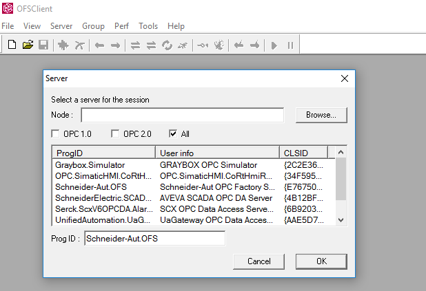
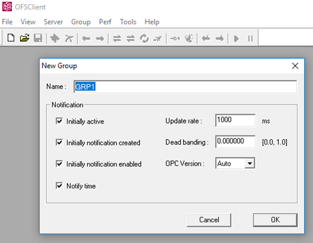

[До лабораторної роботи 6](lab6.md)

## Додаток 6.1. Налаштування та перевірка роботи серверів OPC DA 

У даному додатку наводиться приклади налаштування OPC серверів від 2-х виробників - Schneider Electric (Schneider-Aut.OFS) та VIPA (VIPA.OPC-Server)

## Д6.1.1. Робота з OFS

OFS (OPC Factory Server) - є сервером OPC від Schneider Electric, який призначений для взаємодії з ПЛК M340, M580 та старішими контролерами лінійки Modicon та Telemechanique. OFS комунікує з ПЛК через оптимізовані для них драйвери, що дозволяє швидше обмінюватися з ними даними, ніж через стандартні функції Modbus. Крім того, він надає додаткові можливості для роботи з ПЛК:

- поглиблена діагностика;
- доступ до усіх даних, а не тільки до пам'яті %M та %MW; на відміну від стандартних функцій доступу по Modbus, що передбачає видимість тільки локалізованих об'єктів M340 та M580, OFS не має обмежень щодо доступу до змінних та екземплярів ПЛК
- доступ до функцій роботи з відміткою часу
- можливість завантаження переліку змінних з інтегрованого в ПЛК Data Dictionary (тільки в M580) 
- інші додаткові можливості       

Таким чином Citect має принаймні два шляхи обміну даними з ПЛК: через стандартні драйвери Modbus (MODBUS, MODNET) або через OFS. Для цього типу зв'язку Шнейдер Електрик рекомендує використовувати саме OFS, тому окрім стандартного драйверу OPC Client, має спеціальний драйвер OFS OPC. Налаштування цього драйверу описане в іншому додатку. 

OFS є повноцінним OPC DA сервером, який підтримує усі специфікації OPC DA і може використовуватися з програмними продуктами типу OPC Client від інших виробників ПЗ. Це дає можливість використовувати усі можливості обміну з ПЛК M340 та M580 наприклад інших SCADA-програм.   

OFS є платним продуктом, однак доступна демонстраційна версія, яка надає можливості повноцінної роботи, але з обмеженням в часі. Завантажити її можна [за цим посиланням](https://www.se.com/ww/en/download/document/OFS_V_3_62_3303_SP1/). При встановленні всі опції залишайте за замовченням.

Для конфігурування сервера OFS використовується утиліта OFS Configuration Tool. Дані на сервері означуються наступним чином :

- створюється псевдонім (Alias), що буде вказувати на адресу конкретного пристрою, з яким може обмінюватись ОРС-сервер; наприклад PLC_M340 (рис.Д6.1.1);

- для створеного псевдоніму вказується драйвер зв’язку, адреса пристрою та додаткові параметри, що уточнюють місцезнаходження його в мережі; наприклад для зв'язку з імітатором ПЛК на тому ж ПК можна задати : MBT:127.0.0.1/U (рис.Д6.1.1);


*Рис. Д6.1.1.* Конфігурування псевдоніму пристрою ОFS

- для створеного псевдоніму пристрою означити яким чином будуть створюватися ItemID: 
  - через файл одного з форматів, де буде вказано перелік змінних та їх адрес (symbol table file)
  - через інтегрований словник в сам ПЛК (Using Data Dictionary)  

Слід зазначити, що OFS підтримує правила створення Item за спеціалізованою схемою найменування ItemID, в якому вже вказується адреса пристрою та змінної. Але такий підхід не дуже зручний і має деякі  обмежені можливості. 

У лабораторній роботі використовується означення ItemID через файл типу `*.XVM`, за допомогою якого експортуються імена та налаштування змінних з проекту UnityPRO або Control Expert. Для цього необхідно виділити потрібні змінні та експортувати їх у вказаному форматі (рис.Д6.1.3)  


  *Рис. Д6.1.3*. Експорт налаштувань виділених змінних в Unity PRO (Control Expert.) 

На рис.Д6.1.3 в якості такого файлу вказаний m340.xvm, який до цього був експортований.


  *Рис. Д6.1.3.* Конфігурування пристрою в ОFS

Інші налаштування можна залишити за замовченням. За додатковою інформацією про інші налаштування та можливості OFS зверніться до довідкової системи.

Після конфігурування необхідно зберегти налаштування `File -> Save Configuration` . Якщо OFS сервер був запущений, його необхідно перезапустити. 

OFS Сервер за замовченням стартує у віконному режимі де можна проглянути статистику а також журнал подій та повідомлень. Сам по собі сервер не потрібно запускати, він запуститься при виклику клієнта.  

## Д6.1.2. Робота з тестовим клієнтом OFS Client

Програма OFS Client призначена для тестування роботи OPC DA Серверів, в тому числі OFS Server з яким вона інсталюється за замвоченням. Програма підтримує наступні функції:

1. роботу з локальними або віддаленими ОРС Серверами, які підтримують специфікацію OPC DA;

2. визначення переліку підтримуваних інтерфейсів об’єкту OPCServer та OPCGroup ;

3. створення OPC групи з вказаними ім’ям, часом відновлення, зоною нечутливості;

4. доступ до властивостей ОРС груп, зокрема управління активацією групи (періодичне читання), управління підпискою (асинхронні операції);

5. створення OPC Item та зміна їх властивостей;

6. проведення асинхронних та синхронних операцій над OPC Item; 

7. доступ до часових відміток зчитування/запису всіх змінних

Після завантаження програми, необхідно вказати ОРС Сервер, з яким повинен зв’язатися OFS Client. У списку ProgID ОРС Серверів доступні тільки ті, які підтримують вказану версію специфікації над списком (при All – сервери підтримують 1.0 і 2.0 одночасно). Вибраний ОРС Сервер висвітлюється в полі ProgID. У випадку з’єднання з віддаленим ОРС сервером, в полі Node додатково вказується назва віддаленого ПК або його IP (наприклад [\\192.168.9.1](file:///\\192.168.9.1) або \\COMP1). 



  *Рис. Д6.1.4.* Вікно вибору OPC-серверу в ОFS Сервері

Після з'єднання з вибраним OPC-сервером необхідно створити групу та елементи.

- Меню Group->NewGroup – створення нової групи (рис.Д6.1.5);
- Меню Item->New – створення нового OPCItem; в списку вибирається конкретний ItemID (рис.Д6.1.6);



  *Рис. Д6.1.5.* Вікно створення нової групи


  *Рис. Д6.1.6.* Вікно створення елементів OPC Item через їх вибір

При створенні, ОРС Group по замовченню автоматично проводить періодичне читання з повідомленням. У цьому випадку, Item будуть відображати значення та властивості з періодом UpdateRate OPC групи. В меню Group можна проводити групові синхронні/асинхронні операції над Item а також міняти властивості групи (Properties): активність(Active), режим повідомлення(Notifications) і т.д. 

Вибрані OPC Item з'являються у вікні групи, де їх можна відобразити та змінити (подвійним кліком по назві змінної).


  *Рис. Д6.1.7* Вікно відображення та зміни значень OPC Item

Конфігурування VIPA OPC-Server виконується з використанням утиліти OPC Editor. Аналогічно OFS, на сервері створюються пристрої, в межах яких означуються змінні, однак їх порядок і форма дещо відрізняються (рис. 4.26).

## Д6.1.3. Робота з VIPA OPC

VIPA OPC є OPC сервером від VIPA gmbh, який надає можливість з'єднуватися з Siemens-сумісними ПЛК через драйвери MPI, S7/TCP та ISO on TCP/IP. VIPA OPC є платним продуктом, однак доступна демонстраційна версія, яка надає можливості повноцінної роботи, але з обмеженням в часі. Завантажити її можна [за цим посиланням](https://vipa.com.ua/support/downloads/software.html) 

**Для налаштування необхідно запускати VIPA OPC editor від імені адміністратора.** Після запуску редактору в ньому необхідно відкрити конфігураційний файл, де зберігається налаштування серверу. Його можна знайти за посиланням  

`C:\Program Files (x86)\Vipa GmbH\OPC Server\ini` 

Сам сервер встановлюється як служба Windows і за необхідності перезаупскається з конфігуратора.

При конфігуруванні спочатку вибирається драйвер мережі (наприклад MPI). У межах мережі створюється PLC (наприклад PLC1), а в межах пристрою вказується назва змінної (Tag) та її адреса в ПЛК (TIC MW10 - MW100) Відповідно до правил іменування змінних в VIPA OPC ідентифікатор змінної буде формуватися так: 

```
ItemID = Ім’я_PLC/Ім’я_змінної
```

Враховуючи що при перевірці проекту ПЛК може бути відсутній, VIPA OPC надає режим імітації. Тому для перевірки роботи з сервером варто встановити пристрій в режим імітації (Simulation).

 

  *Рис. Д6.1.8* Налаштування Драйверу та пристроїв для VIPA OPC 

Після налаштування необхідно зберегти конфігурацію та перезапустити сервер (рис.Д.6.1.9).


  *Рис. Д6.1.9* Перезапуск серверу з конфігуратору 

