[До лабораторної роботи 6](lab6.md)

## Додаток 6.2. Налаштування Citect для роботи в якості OPC DA Client

### Д6.2.1. Налаштування та використання драйверу OFS OPC

Для зв'язку Citect з OFS Шнейдер Електрик рекомендує використовувати спеціальний драйвер OFS OPC - драйвер OPC Client, який оптимізований для OFS. Зручніше всього налаштовувати драйвер при створенні I/O Device через майстер. Для цього він вибирається у відповідному вікні (рис.Д6.2.1), після чого налаштовуються його параметри. 

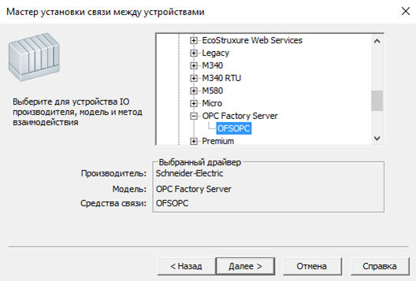

рис.Д6.2.1. Вибір драйверу OFSOPC

У вікні адреси пристрою (рис.Д6.2.2) вказується його псевдонім, який сконфігурований в OFS Configuration. 

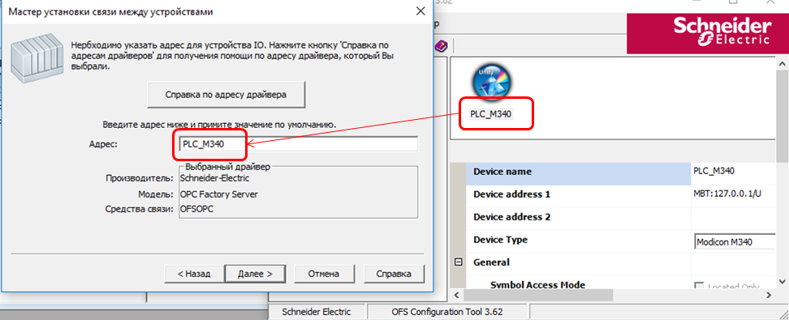

рис.Д6.2.2. Вказівка псевдоніму пристрою

Через драйвер OFSOPC можна налаштувати зв'язок списку тегів (лінкування). Для цього треба активувати відповідну опцію і натиснути "Обзор" (рис.Д6.2.3) 

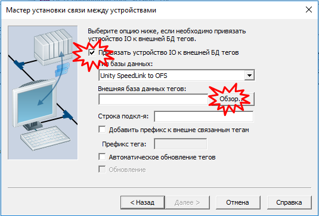

рис.Д6.2.3. Налаштування зв'язку з зовнішньою базою даних  тегів.

Після цього завантажиться OFS і у списку ItemID можна вибрати відповідну гілку (рис.Д6.2.4).

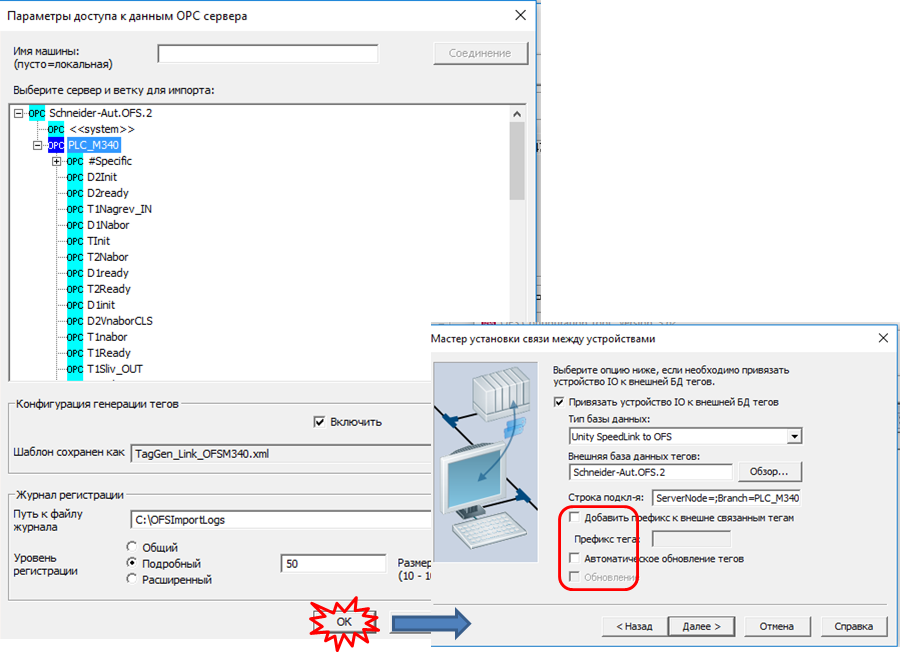

рис.Д6.2.4. Вибір в дереві необхідних гілок для зв'язку.

Після завершення роботи майстра відобразиться результат імпортування тегів (Рис.Д6.2.5)

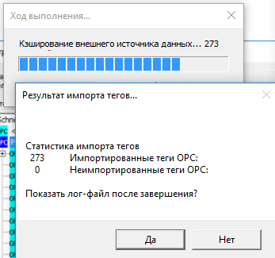

рис.Д6.2.5. Звіт про імпортування

Зв'язані (лінковані) теги в списку тегів відображаються сірим кольором шрифту. Це значить, що їх не можна змінювати прямо в цьому переліку так як їх налаштування зв'язане з джерелом.    

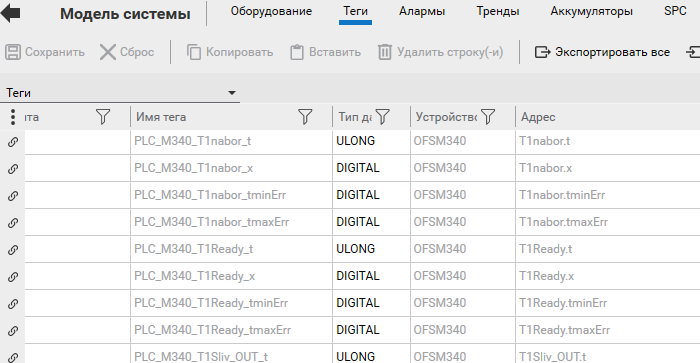

рис.Д6.2.6. Вигляд зв'язаних (лінкованих) тегів. 

### Д6.2.2. Налаштування та використання драйверу OPC DA Client

Як у більшості SCADA Citect має драйвер OPC DA Client. Його зручно налаштовувати через майстра. На відповідній вкладці майстра вибирається драйвер в розділі `OPC Foundation -> OPC DA Client -> OPC` (рис.Д6.2.7) 

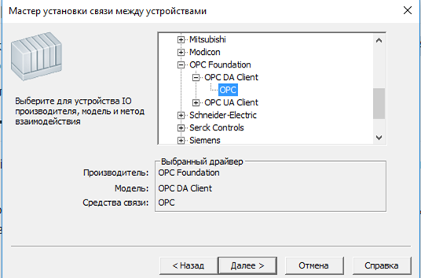

рис.Д6.2.7. Вибір драйверу OPC DA Client

У налаштуванні адреси треба вказати ProgID відповідного OPC DA Server. Наприклад для зв'язку з VIPA OPC вказується (рис.Д6.2.8)

```
VIPA.OPCServer
```

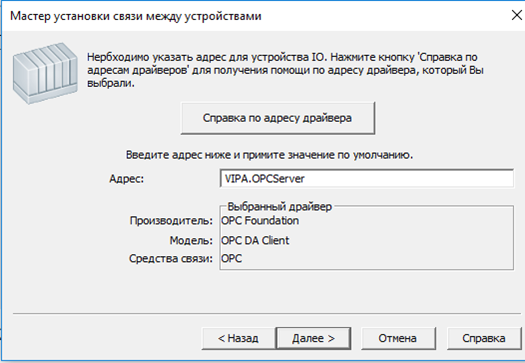

рис.Д6.2.8.Вказівка назви ProgID OPC Server

Також для цього типу драйверу є можливість зробити прив'язку налаштування тегів до налаштування в OPC Server. Для цього у відповідному вікні майстра необхідно вибрати тип бази даних `OPC` (рис. Д6.2.9).

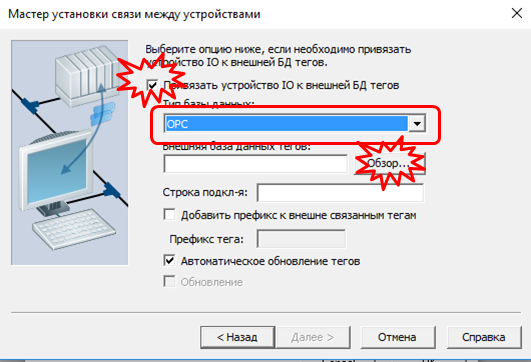

рис.Д6.2.9.Налаштування прив'язки до списку Item ID 

У вікні огляду БД зі списком тегів вказується той самий OPC Server, який вибрався в якості джерела даних. Після вибору серверу можна вибрати відповідну гілку, наприклад як на рис.Д6.2.10 - PLC1. Цей вибір стане частиною рядка підключення, як `Branch` 

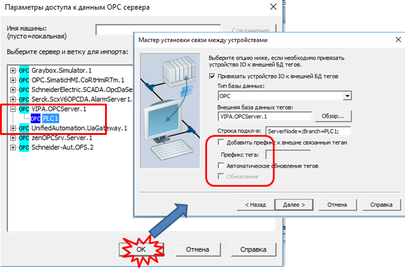

рис.Д6.2.10. Вибір OPC Server для прив'язки 

Після завершення роботи майстра відобразиться результат імпортування тегів (Рис.Д6.2.11)

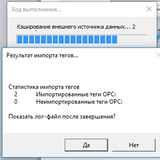

рис.Д6.2.11. Звіт про результат імпорту

Зв'язані (лінковані) теги в списку тегів відображаються сірим кольором шрифту. Це значить, що їх не можна змінювати прямо в цьому переліку так як їх налаштування зв'язане з джерелом.    

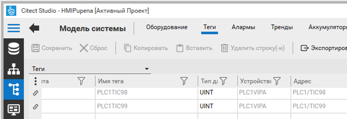

рис.Д6.2.12. Імпортовані прив'язані теги 
